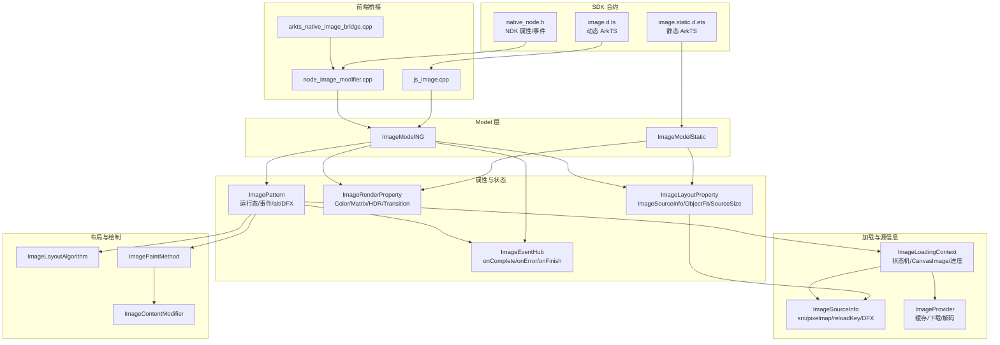
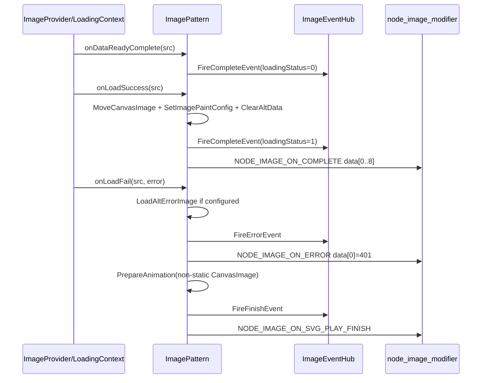

# 架构设计

> Image 组件功能域的架构设计文档，补录并统一当前 ace_engine 已实现能力。

## 设计元数据

| 字段 | 内容 |
|------|------|
| Design ID | DESIGN-Func-05-08-01 |
| 关联需求 | 已有能力补录（无独立 requirement.md） |
| 关联 Epic | 无 |
| 目标 Feature | Feat-01 核心显示属性, Feat-02 颜色与效果, Feat-03 高级功能, Feat-04 事件回调, Feat-05 基础内存与加载上下文生命周期 |
| 复杂度 | 复杂 |
| 目标版本 | API 7 起支持，API 9/11/12/14/21/22/23/26 分批扩展 |
| Owner | ArkUI SIG |
| 状态 | Baselined（已有实现补录） |

## 需求基线

| 项 | 补充说明 |
|----|----------|
| 核心目标 | 提供 Image 组件，支持多源图片显示、解码尺寸控制、缩放重复、颜色效果、AI/高级能力、事件回调和内部加载上下文生命周期管理 |
| API 覆盖 | 动态 ArkTS、静态 ArkTS 与 NDK/C API 多范式覆盖；含 Image 构造重载、`reloadKey`、`ImageAIOptions`、`ImageAlt`、`setImageOptions`、30+ 属性、3 个 ArkTS 事件和 4 个 NDK Image 节点事件 |
| Feat-05 补充 | 固化当前实现的 ImageSourceInfo 值语义、ImageLoadingContext 资源释放、MakeCanvasImage 重建判定和 alt/altError 清理；未落地的 shared_ptr/AltState/bitmask 优化仅作为开放问题记录 |

## 上下文和现状

### 涉及仓和模块

| 仓库 | 模块/路径 | 当前职责 | 本 Feature 影响 |
|------|-----------|----------|-----------------|
| ace_engine | `frameworks/bridge/declarative_frontend/jsview/js_image.cpp` | 动态 ArkTS Image 构造、属性和事件解析，处理 `reloadKey`、`ImageAlt`、onComplete/onError/onFinish 等 JSView 入口 | Feat-01/03/04 |
| ace_engine | `frameworks/bridge/declarative_frontend/engine/jsi/nativeModule/arkts_native_image_bridge.cpp` | ArkTS native bridge，属性参数解析后调用 node modifier/Model | Feat-01/02/03 |
| ace_engine | `frameworks/core/components_ng/pattern/image/image_model_ng.cpp` | NG Model，动态/NDK 属性写入 LayoutProperty、RenderProperty、Pattern 成员或 EventHub | Feat-01~04 |
| ace_engine | `frameworks/core/components_ng/pattern/image/image_model_static.cpp` | 静态 ArkTS Model，静态 Image 构造、`setImageOptions` 和静态属性写入 | Feat-01~03 |
| ace_engine | `frameworks/core/components_ng/pattern/image/image_layout_property.h` | 布局属性：src/alt/ImageAlt、objectFit、autoResize、sourceSize、orientation、fitOriginalSize 等 | Feat-01/05 |
| ace_engine | `frameworks/core/components_ng/pattern/image/image_render_property.h` | 渲染属性：objectRepeat、renderMode、fillColor、colorFilter、dynamicRangeMode、hdrBrightness、imageMatrix、resizable、contentTransition 等 | Feat-02/03 |
| ace_engine | `frameworks/core/components_ng/pattern/image/image_pattern.h/.cpp` | ImagePattern 主逻辑：加载编排、事件触发、alt/altError 回退、AI 分析、拖拽、DFX、内部状态生命周期 | Feat-01/03/04/05 |
| ace_engine | `frameworks/core/components_ng/image_provider/image_loading_context.h/.cpp` | ImageLoadingContext 状态机：持有 source/image object/canvas image，管理下载进度、MakeCanvasImage、OnUnloaded/OnLoadSuccess/OnLoadFail | Feat-05 |
| ace_engine | `frameworks/core/image/image_source_info.h/.cpp` | 图片源统一抽象：src/resource/pixelmap/buffer/cacheKey/reloadKey/supportSvg2/DFX 配置和相等比较 | Feat-01/05 |
| ace_engine | `frameworks/core/interfaces/native/node/node_image_modifier.cpp` | NDK Image 属性与事件实现，映射 `NODE_IMAGE_*` 属性和事件到 ImageModelNG | Feat-01~04 |
| ace_engine | `interfaces/native/native_node.h` | NDK C API 枚举声明，包含 Image 属性和 Image 节点事件 payload 合约 | Feat-01~04 |

### 调用链层级分析

| 层 | 模块 | 职责 | 修改类型 |
|----|------|------|----------|
| SDK 类型定义 | `interface/sdk-js/api/@internal/component/ets/image.d.ts` | 动态 ArkTS API 合约，包含 API 7~26 的 Image 构造、属性、事件和版本说明 | 存量分析 |
| 静态 SDK 类型定义 | `interface/sdk-js/api/arkui/component/image.static.d.ets` | 静态 ArkTS ImageAttribute、构造和 `setImageOptions` 合约 | 存量分析 |
| ArkTS 动态 JSView | `frameworks/bridge/declarative_frontend/jsview/js_image.cpp` | 解析 Image() 参数、JS 属性参数和事件回调，转换为 Model 调用 | 存量分析 |
| ArkTS native bridge | `frameworks/bridge/declarative_frontend/engine/jsi/nativeModule/arkts_native_image_bridge.cpp` | ArkTS/JSI 值到 C++ 类型转换，覆盖颜色、sourceSize、矩阵、滤镜等属性 | 存量分析 |
| NDK C API 声明 | `interfaces/native/native_node.h` | 暴露 `NODE_IMAGE_*` 属性和事件枚举，定义 C API payload | 存量分析 |
| NDK node modifier | `frameworks/core/interfaces/native/node/node_image_modifier.cpp` | NDK 属性/事件落到 ImageModelNG，含 onComplete/onError/onSvgPlayFinish/onDownloadProgress 数据映射 | 存量分析 |
| Model 层 | `frameworks/core/components_ng/pattern/image/image_model_ng.cpp`, `image_model_static.cpp` | 统一属性设置入口，决定写入 LayoutProperty/RenderProperty/Pattern/EventHub | 存量分析 |
| Property 层 | `image_layout_property.h`, `image_render_property.h` | 按布局和渲染 dirty flag 分层保存属性 | 存量分析 |
| Pattern 层 | `image_pattern.h/.cpp` | 加载、回退、事件、AI、拖拽和 DFX 的主编排层 | 存量分析 |
| LoadingContext 层 | `image_loading_context.h/.cpp` | 异步加载状态机和 CanvasImage 生成/复用逻辑 | Feat-05 补充分析 |
| SourceInfo 层 | `image_source_info.h/.cpp` | 图片源值对象、reloadKey、pixmapBuffer、cacheKey 和比较逻辑 | Feat-05 补充分析 |
| Layout/Paint 层 | `image_layout_algorithm.cpp`, `image_paint_method.cpp`, `image_content_modifier.cpp` | objectFit 测量、绘制配置和 CanvasImage 渲染 | 存量分析 |

### 适用架构规则

| Rule ID | 适用原因 | 设计结论 | 验证方式 |
|---------|----------|----------|----------|
| OH-ARCH-LAYERING | Image 涉及 SDK/Bridge/Model/Property/Pattern/Loading/Paint 多层 | 保持单向调用，属性写入不越层访问渲染对象 | 代码审查 |
| OH-ARCH-API-LEVEL | Image API 从 API 7 起多版本演进 | 外部 API 行为以 `.d.ts/.static.d.ets` 为准，源码差异进入风险表 | API 审查/XTS |
| OH-ARCH-COMPONENT-BUILD | Image 属于 `ace_core_ng` 组件实现 | 本次仅规格补录，无新增 BUILD.gn target | 构建检查 |
| OH-ARCH-CAPI | NDK 节点事件 payload 是 ABI 相关合约 | 仅记录现有 `data[]` 下标和错误码，不变更 C API | C API UT |

## 不涉及项承接

| 维度 | 设计结论 |
|------|----------|
| 性能 | 展开：autoResize、sourceSize、syncLoad、MakeCanvasImageIfNeed 和 LoadingContext 生命周期属于现有性能/内存基线 |
| 安全与权限 | N/A；Image 公开 API 无新增权限 |
| 兼容性 | 展开：API 版本差异、SDK/源码差异、NDK payload 粒度差异均在规格和风险表标注 |
| IPC/跨进程 | N/A；ImageSourceInfo、ImageDfxConfig、ImageLoadingContext 为内部结构 |
| 公共 API 变更 | N/A；本次为已有能力补录，不修改 SDK/NDK 签名 |

## 关键设计决策

| 决策 ID | 问题 | 推荐方案 | 探索过的替代方案 | 取舍理由 | 影响 |
|---------|------|----------|-----------------|----------|------|
| ADR-1 | Image 属性分哪几层存储 | 布局属性、渲染属性、Pattern 成员/EventHub 分层保存 | 全部放 LayoutProperty；全部放 Pattern | 布局属性触发 MEASURE/LAYOUT，渲染属性仅触发 RENDER，Pattern 成员保存不适合 dirty flag 的运行态状态 | `image_layout_property.h`, `image_render_property.h`, `image_pattern.h` |
| ADR-2 | objectFit 默认值 | 默认 COVER | 默认 CONTAIN；默认 FILL | COVER 保持比例填满容器，和当前 `ImageLayoutProperty` 默认一致 | `image_layout_property.cpp:87` |
| ADR-3 | autoResize 默认值存在路径差异 | 保留当前 API/SceneBoard/Pattern 逻辑并在规格中显式记录 | 文档中统一成单一默认值 | 源码存在历史兼容逻辑，当前实现即规格，不能静默改写 | `image_pattern.cpp:2679-2693` |
| ADR-4 | Image 加载由谁编排 | ImagePattern 持有 ImageLoadingContext，并通过 LoadNotifier 接收数据就绪、成功、失败和完成回调 | ImagePattern 直接管理 ImageProvider；完全独立加载器 | Pattern 负责组件生命周期，LoadingContext 负责加载状态机，职责边界清晰 | `image_pattern.cpp:1145-1152`, `image_loading_context.h:204-234` |
| ADR-F4-1 | 事件回调如何派发 | ArkTS 事件注册到 ImageEventHub；NDK 事件由 node_image_modifier 转为 ArkUINodeEvent | 在 LoadingContext 内直接持有 ArkTS/NDK 回调 | EventHub 隔离组件事件，NDK payload 由 C API 层统一转换 | `image_event_hub.h:36-75`, `node_image_modifier.cpp:1660-1725` |
| ADR-F5-1 | ImageSourceInfo 当前是否共享 | 以当前值语义作为规格基线：LayoutProperty 与 LoadingContext 都按值保存 ImageSourceInfo | 把规格写成 shared_ptr 优化目标 | 当前源码未实现 shared_ptr 共享；规格必须反映真实实现 | `image_layout_property.h:50-65`, `image_loading_context.h:204`, `image_source_info.h:146-174` |
| ADR-F5-2 | 替代图资源如何释放 | 主图加载成功后调用 ClearAltData 清理 alt/altError 上下文、图像和 rect | 保持替代图直到 Pattern 析构 | 主图恢复后替代图资源不应继续被 Pattern 强持有 | `image_pattern.cpp:411-422`, `image_pattern.cpp:525` |
| ADR-F5-3 | CanvasImage 何时重建 | MakeCanvasImageIfNeed 按 autoResize/imageFit/sourceSize/firstLoad/sizeLevel 判定，MAKE_CANVAS_IMAGE 状态下使用 pending task | 每次 dstSize 变化都重建 | 减少频繁尺寸变化下的重复 CanvasImage 创建，同时保持切片 rect 同步 | `image_loading_context.cpp:330-360` |

## 设计骨架

### 骨架范围

| 骨架项 | 目标 | 不包含 | 验证方式 |
|--------|------|--------|----------|
| API 与多范式入口 | 动态 ArkTS、静态 ArkTS、NDK C API 的入口和版本差异 | 修改 SDK 签名 | API 审查 |
| 属性三层存储 | LayoutProperty / RenderProperty / Pattern/EventHub 分层 | 重构属性存储结构 | 代码审查 |
| objectFit 布局算法 | 18 种 ImageFit 的尺寸计算 | ImageMatrix 绘制矩阵细节 | 单元测试 |
| 颜色效果渲染 | fillColor、colorFilter、HDR、contentTransition、pointLight 等效果 | 底层 Drawing 实现 | XTS/代码审查 |
| 高级能力 | resizable、AI analyzer、syncLoad、draggable、supportSvg2、enhancedImageQuality | AI 服务能力实现 | XTS/代码审查 |
| 事件回调 | ArkTS 3 事件与 NDK 4 节点事件 payload | 新增事件类型 | XTS/C API UT |
| 内存与生命周期 | ImageSourceInfo 值语义、LoadingContext 生命周期、alt 清理和 MakeCanvasImage 重用 | 未落地内存优化 | 单元测试/代码审查 |

### 骨架 Spec 拆分

| Task ID | 目标 | 受影响文件 | AC |
|---------|------|-----------|-----|
| TASK-SKELETON-1 | 核心显示属性与构造入口验证 | `js_image.cpp`, `image_model_ng.cpp`, `image_layout_property.h` | Feat-01 AC |
| TASK-SKELETON-2 | 颜色效果渲染验证 | `image_render_property.h`, `image_paint_method.cpp`, `image_content_modifier.cpp` | Feat-02 AC |
| TASK-SKELETON-3 | 高级功能验证 | `image_pattern.cpp`, `image_model_static.cpp`, `node_image_modifier.cpp` | Feat-03 AC |
| TASK-SKELETON-4 | 事件回调触发与 payload 验证 | `image_event_hub.h`, `image_pattern.cpp`, `node_image_modifier.cpp` | Feat-04 AC |
| TASK-SKELETON-5 | 内存生命周期验证 | `image_source_info.*`, `image_loading_context.*`, `image_pattern.*` | Feat-05 AC |

## 后续 Task 拆分

| Spec | 目的 | 依赖 | 输出 |
|------|------|------|------|
| Feat-01-image-core-display-spec.md | 固化核心显示属性、Image 构造、reloadKey、ImageAlt 和静态 setImageOptions 行为 | 本 Design + 图片加载机制 | 完整行为规格与 AC |
| Feat-02-image-color-effects-spec.md | 固化 fillColor、colorFilter、dynamicRangeMode、hdrBrightness、imageMatrix、edgeAntialiasing、antialiased、contentTransition、pointLight 行为 | 本 Design | 完整行为规格与 AC |
| Feat-03-image-advanced-spec.md | 固化 resizable、AI analyzer、syncLoad、copyOption、draggable、supportSvg2、privacySensitive、enhancedImageQuality 行为 | 本 Design | 完整行为规格与 AC |
| Feat-04-image-events-spec.md | 固化 ArkTS 事件和 NDK Image 节点事件 payload | 本 Design | 完整行为规格与 AC |
| Feat-05-image-base-memory-opt-spec.md | 固化当前基础内存与加载上下文生命周期，不包含未落地优化作为 AC | 本 Design | 完整行为规格与 AC |

## API 签名、Kit 与权限

### 新增 API

> 本表为已有 Image API 面补录，不表示本次代码新增 API。权限、SysCap 和 @since 以 SDK `.d.ts/.static.d.ets` 与 `native_node.h` 为准。

| API 签名 | 类型 | 功能描述 | 关联 Feat |
|----------|------|----------|----------|
| `Image(src: PixelMap \| ResourceStr \| DrawableDescriptor \| ImageContent, reloadKey?)` | Public | Image 动态构造，API 12 支持 ImageContent，API 26 支持 reloadKey | Feat-01 |
| `Image(src, imageAIOptions?, reloadKey?)` | Public | 构造时绑定 ImageAIOptions 和可选 reloadKey | Feat-01/03 |
| `setImageOptions(src, imageAIOptions?, reloadKey?)` | Public static | 静态 ArkTS builder 形态设置图片源、AI 选项和 reloadKey | Feat-01 |
| `alt(value: ResourceStr \| PixelMap \| ImageAlt \| undefined): T` | Public | 设置占位图、错误图和 ImageAlt placeholder/error | Feat-01 |
| `objectFit(value: ImageFit): T` | Public | 设置图片缩放模式（默认 COVER，含 18 种枚举） | Feat-01 |
| `objectRepeat(value: ImageRepeat): T` | Public | 设置图片重复模式 | Feat-01 |
| `renderMode(value: ImageRenderMode): T` | Public | 设置原始/模板渲染模式 | Feat-01 |
| `autoResize(value: boolean): T` | Public | 设置是否按组件尺寸自动调整解码尺寸 | Feat-01 |
| `sourceSize(value: ImageSourceSize): T` | Public | 设置解码目标尺寸 | Feat-01 |
| `orientation(value: ImageRotateOrientation): T` | Public | 设置图片旋转方向 | Feat-01 |
| `fitOriginalSize(value: boolean): T` | Public | 设置是否按原始图尺寸测量 | Feat-01 |
| `interpolation(value: ImageInterpolation): T` | Public | 设置缩放插值质量 | Feat-01 |
| `fillColor(value: ResourceColor \| ColorContent \| ColorMetrics): T` | Public | 设置 SVG 填充颜色，支持 reset/P3 输入 | Feat-02 |
| `colorFilter(value: ColorFilter \| DrawingColorFilter \| ResourceColor): T` | Public | 设置颜色矩阵或 DrawingColorFilter，API 26 支持 ResourceColor | Feat-02 |
| `dynamicRangeMode(value: DynamicRangeMode): T` | Public | 设置动态范围模式 | Feat-02 |
| `hdrBrightness(value: number): T` | Public | 设置 HDR 亮度 | Feat-02 |
| `imageMatrix(value: Matrix4Transit): T` | Public | 设置矩阵变换 | Feat-02 |
| `edgeAntialiasing(value: number): T` | System | 设置 SVG 边缘抗锯齿范围 | Feat-02 |
| `antialiased(value: Optional<boolean>): T` | Public | 设置 pixel map 图片边缘抗锯齿 | Feat-02 |
| `contentTransition(value: ContentTransitionEffect): T` | Public | 设置图片内容切换过渡 | Feat-02 |
| `pointLight(value: PointLightStyle): T` | System | 设置通用 RenderContext 点光源效果 | Feat-02 |
| `resizable(value: ResizableOptions): T` | Public | 设置切片/网格拉伸配置 | Feat-03 |
| `enableAnalyzer(value: boolean): T` | Public | 启用图片 AI 分析器 | Feat-03 |
| `analyzerConfig(config: ImageAnalyzerConfig): T` | System | 设置 AI 分析类型 | Feat-03 |
| `copyOption(value: CopyOptions): T` | Public | 设置图片复制选项 | Feat-03 |
| `draggable(value: boolean): T` | Public | 设置图片拖拽开关 | Feat-03 |
| `syncLoad(value: boolean): T` | Public | 设置同步加载 | Feat-03 |
| `matchTextDirection(value: boolean): T` | Public | 设置是否匹配文本方向 | Feat-03 |
| `supportSvg2(value: boolean): T` | Public | 启用增强 SVG2 解析 | Feat-03 |
| `privacySensitive(value: boolean): T` | Public | 设置隐私敏感标记 | Feat-03 |
| `enhancedImageQuality(value: ResolutionQuality): T` | System | 设置增强图片质量 | Feat-03 |
| `onComplete(callback: ImageOnCompleteCallback): T` | Public | 图片数据加载/解码成功回调 | Feat-04 |
| `onError(callback: ImageErrorCallback): T` | Public | 图片加载失败回调 | Feat-04 |
| `onFinish(callback: VoidCallback): T` | Public | SDK 合约为 SVG 动画播放完成回调 | Feat-04 |
| `NODE_IMAGE_ON_COMPLETE` | Public C API | NDK 图片成功事件，返回 9 个 data 槽位 | Feat-04 |
| `NODE_IMAGE_ON_ERROR` | Public C API | NDK 图片失败事件，当前实现固定返回 401 | Feat-04 |
| `NODE_IMAGE_ON_SVG_PLAY_FINISH` | Public C API | NDK SVG 动画播放完成事件 | Feat-04 |
| `NODE_IMAGE_ON_DOWNLOAD_PROGRESS` | Public C API | NDK 网络图片下载进度事件 | Feat-04 |

### 变更/废弃 API

无。本次为规格补录，不修改 SDK/NDK 声明。

## 构建系统影响

### BUILD.gn 变更

无新增 target。Image 组件已纳入现有 ace_engine 构建目标。

### bundle.json 变更

无。

## 可选设计扩展

### 架构图



### 数据模型设计

```typescript
// ArkTS 公开事件与参数类型摘要
interface ImageSourceSize { width: number; height: number }
interface ImageAlt { placeholder?: ResourceStr | PixelMap; error?: ResourceStr | PixelMap }
interface ImageCompleteEvent {
  width: number; height: number;
  componentWidth: number; componentHeight: number;
  loadingStatus: number;
  contentWidth: number; contentHeight: number;
  contentOffsetX: number; contentOffsetY: number;
}
interface ImageError {
  componentWidth: number; componentHeight: number;
  message: string; error?: BusinessError; downloadInfo?: object;
}
```

```cpp
// 当前内部持有模型摘要
class ImageSourceInfo {
    std::string src_;
    std::shared_ptr<std::string> srcRef_;
    RefPtr<PixelMap> pixmap_;
    std::shared_ptr<uint8_t[]> buffer_;
    const uint8_t* pixmapBuffer_;
    NG::ImageDfxConfig imageDfxConfig_;
    std::optional<std::string> reloadKey_;
};

class ImageLoadingContext {
    ImageSourceInfo src_;
    RefPtr<ImageObject> imageObj_;
    RefPtr<CanvasImage> canvasImage_;
    LoadNotifier notifiers_;
    std::unique_ptr<SizeF> sourceSizePtr_;
};
```

### 线程与并发模型

| 操作 | 发起线程 | 回调线程 | 说明 |
|------|----------|----------|------|
| 属性设置 | UI | UI | Bridge/Model 直接写 Property、Pattern 或 EventHub |
| 图片下载/解码 | UI 发起，后台执行 | UI 通知 | ImageProvider 下载/解码后通过 ImageUtils 投递 UI 任务 |
| MakeCanvasImage | UI | UI | LoadingContext 根据状态立即执行或缓存 pending task |
| 事件回调 | UI | UI | ImagePattern/EventHub 或 node modifier 同步派发 |
| 下载进度 | 下载回调 | UI | ImageProvider 进度回调通过 DownloadOnProgress 转发到 LoadingContext |

## 详细设计

### 属性三层存储模型

Image 组件属性按更新影响分布在三类存储位置：

| 存储层 | 代表属性/状态 | dirty flag/触发方式 | 证据 |
|--------|---------------|-------------------|------|
| LayoutProperty | ImageSourceInfo、Alt、AltError、AltPlaceholder、objectFit、autoResize、sourceSize、fitOriginalSize、orientation、isYUVDecode | MEASURE/LAYOUT/NORMAL/BY_CHILD_REQUEST | `image_layout_property.h:50-65` |
| RenderProperty | objectRepeat、renderMode、fillColor、colorFilter、dynamicRangeMode、hdrBrightness、imageMatrix、edgeAntialiasing、antialiased、contentTransition、resizable | PROPERTY_UPDATE_RENDER 或 paint property 更新 | `image_render_property.h` |
| Pattern/EventHub | syncLoad、copyOption、interpolation、enableAnalyzer、supportSvg2、imageQuality、draggable、onProgressCallback、onComplete/onError/onFinish | 无统一 dirty flag，按具体逻辑手动触发 | `image_pattern.h:380-425`, `image_event_hub.h:36-75` |

### objectFit 布局算法

`ImageLayoutAlgorithm::MeasureContent` 根据 ImageFit 枚举计算组件尺寸：

| ImageFit | 行为 | 组件尺寸 | 图片显示区域 |
|---------|------|----------|-------------|
| COVER(2) | 保持比例填满容器 | 容器约束尺寸 | 居中裁剪溢出 |
| CONTAIN(1) | 保持比例完整显示 | 容器约束尺寸 | 居中留白 |
| FILL(0) | 拉伸填满 | 容器约束尺寸 | 完全填充 |
| NONE(5) | 原始尺寸不缩放 | 图片原始尺寸 | 原始大小 |
| SCALE_DOWN(6) | 同 NONE 但不放大 | min(原始, 容器) | 不超过原始 |
| FITWIDTH(3) | 宽度适配 | 宽=容器宽, 高按比例 | 宽度填满 |
| FITHEIGHT(4) | 高度适配 | 高=容器高, 宽按比例 | 高度填满 |
| TOP_LEFT(7)~BOTTOM_END(15) | 9 宫格定位 | 容器约束尺寸 | 对应方位对齐 |
| MATRIX(17) | 使用 imageMatrix 变换 | 容器约束尺寸 | 矩阵变换 |

### 事件触发时序



关键约束：
- onComplete 有 `loadingStatus=0` 和 `loadingStatus=1` 两个触发点：`image_pattern.cpp:234-247`, `image_pattern.cpp:548-555`。
- onError 在失败后可先启动 AltError 加载，再派发失败事件：`image_pattern.cpp:722-729`。
- SDK 合约将 onFinish 限定为 SVG 动画完成，源码当前对非静态 CanvasImage 注册 finish 回调：`image.d.ts:1669-1686`, `image_pattern.cpp:259-280`。
- NDK 下载进度事件只在进度回调存在时由 ImageProvider/LoadingContext 转发：`image_provider.cpp:439-447`, `node_image_modifier.cpp:1712-1725`。

### 基础内存与加载上下文生命周期

当前实现的内存基线是值语义与 RefPtr 混合持有：

| 对象 | 当前持有方式 | 生命周期规则 | 证据 |
|------|-------------|--------------|------|
| ImageSourceInfo | LayoutProperty 与 ImageLoadingContext 均按值保存 | src/pixelmap/buffer/reloadKey/DFX 配置参与比较和加载判定 | `image_source_info.h:146-174`, `image_loading_context.h:204` |
| PixelMap source | `RefPtr<PixelMap> pixmap_` + `pixmapBuffer_` 缓存像素地址 | 相等比较同时检查 pixmapBuffer 和 raw pixel map | `image_source_info.cpp:150-195`, `image_source_info.cpp:276-278` |
| ImageLoadingContext | 持有 src、ImageObject、CanvasImage、LoadNotifier、rect/size、sourceSizePtr | OnUnloaded 清空 imageObj/canvasImage/rect/size；StaticImageObject 成功后 ClearData | `image_loading_context.cpp:90-108` |
| CanvasImage 重建 | `MakeCanvasImageIfNeed` 控制 | autoResize/imageFit/sourceSize/firstLoad/sizeLevel 变化触发，MAKE_CANVAS_IMAGE 状态下缓存 pending task | `image_loading_context.cpp:330-360` |
| alt/altError | Pattern 分别持有独立 LoadingContext、CanvasImage 和 rect | 主图成功后 ClearAltData 释放替代图相关对象 | `image_pattern.h:394-403`, `image_pattern.cpp:411-422` |
| ImageDfxConfig | Pattern、ImageSourceInfo、CanvasImage 按值传递/保存 | 当前未共享，DFX 日志和 CanvasImage 配置使用值副本 | `image_pattern.h:413-415`, `image_loading_context.cpp:34-40` |

未落地优化不作为设计基线：当前源码仍保留 `pixmapBuffer_`、ImageSourceInfo 值属性项、ImageLoadingContext `src_` 值成员、Pattern 中三份 ImageDfxConfig 和分散的 alt/altError 字段。后续如要做 shared_ptr/AltState/bitmask 优化，应另起需求并以本规格的可见行为为回归基线。

### 颜色效果与高级能力分派

颜色效果和高级能力不统一存储：
- fillColor/colorFilter/dynamicRangeMode/hdrBrightness/imageMatrix/edgeAntialiasing/antialiased/contentTransition 主要落到 RenderProperty 或绘制配置。
- pointLight 是 system API，写通用 RenderContext 点光源属性，`native_node.h` 没有 `NODE_IMAGE_POINT_LIGHT` 专属枚举。
- enableAnalyzer/analyzerConfig/ImageAIOptions 进入 ImageAnalyzerManager；draggable 进入通用 GestureHub/FrameNode 拖拽状态；supportSvg2 写 Pattern 成员并传给 LoadingContext。
- enhancedImageQuality 动态 JSView 缺省/非法值走 LOW，静态 API undefined 走 NONE，这是范式差异。

## 风险和开放问题

| 项 | 类型 | 影响 | 处理方式 | Owner |
|----|------|------|----------|-------|
| autoResize 默认值双重逻辑 | 兼容性 | 中 | JSON 反序列化默认 false，Pattern/SceneBoard 路径存在不同默认值；规格按源码分支记录 | ArkUI SIG |
| orientation undefined/null SDK 与 JSView 差异 | 兼容性 | 中 | SDK 声明 undefined/null 为 AUTO，JSView 参数缺失或非法时回退 UP；在 Feat-01 标注差异 | ArkUI SIG |
| supportSvg2 动态修改差异 | 兼容性 | 中 | SDK 声明 Image 创建后不能动态改变，Model 仍提供 setter 写 Pattern 成员；规格记录为 SDK/实现风险 | ArkUI SIG |
| enhancedImageQuality 动静态默认差异 | 兼容性 | 低 | 动态 JSView 缺省/非法值为 LOW，静态 undefined 为 NONE；XTS 需分范式覆盖 | ArkUI SIG |
| onFinish SDK/源码范围差异 | 兼容性 | 中 | SDK/C API 合约限定 SVG 动画完成，源码对非静态 CanvasImage 设置 finish 回调；规格显式记录，不修改实现 | ArkUI SIG |
| NDK onError 信息粒度 | C API | 低 | `native_node.h` 声明错误码含 401/103101，当前 node modifier 固定填 401；ArkTS 仍可通过 ImageErrorInfo 获取细分错误 | ArkUI SIG |
| Feat-05 历史优化草稿未落地 | 规格维护 | 中 | shared_ptr 共享 ImageSourceInfo/ImageDfxConfig、AltState、bool bitmask 均未在当前源码实现；已从 AC/ADR 移除并作为未来优化开放问题 | ArkUI SIG |
| ImageSourceInfo 值拷贝内存基线 | 内存 | 中 | 当前值语义会复制 src/pixelmap/buffer/reloadKey/DFX 配置；后续优化必须保持 reloadKey、pixmapBuffer 比较和 source 匹配语义 | ArkUI SIG |
| 图片加载管线跨功能域依赖 | 架构 | 中 | Image 组件依赖 ImageProvider/LoadingContext/缓存下载管线，管线行为变更可能影响 Image 规格 | ArkUI SIG |

## 设计审批

- [x] 需求基线已确认，设计覆盖 Feat-01~Feat-05
- [x] 不涉及项已承接，N/A 和展开项都有结论
- [x] 涉及仓和模块职责清楚
- [x] 适用架构规则已识别并形成设计结论
- [x] 分层和子系统边界合规
- [x] API 变更有签名、权限、错误码和兼容性说明
- [x] BUILD.gn/bundle.json 影响明确
- [x] 设计输出和后续 Task 拆分明确
- [x] 关键设计决策有理由和影响说明
- [x] 风险和开放问题有 Owner

**结论:** 通过（已有实现补录）
