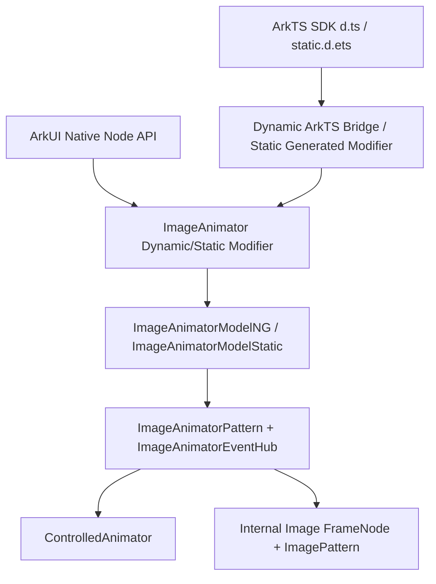
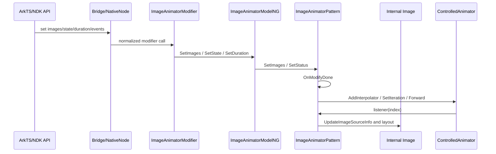
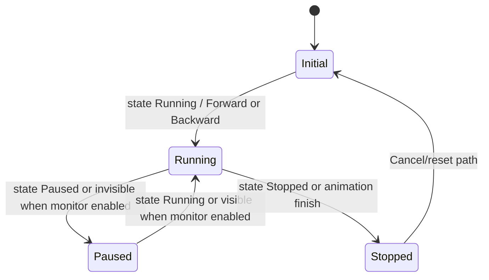
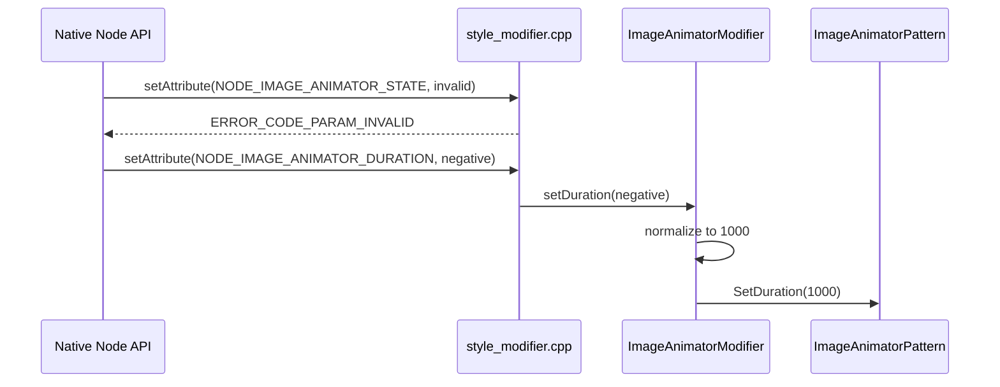

# 架构设计
> 确认目标仓和模块的架构约束、关键设计决策、Spec 拆分方向。

## 设计元数据
| Field | Content |
|-------|---------|
| Design ID | DESIGN-Func-05-08-02 |
| 关联需求 | 已有能力补录（无独立 requirement.md） |
| 关联 Epic | 无 |
| 目标 Feature | Feat-01 ImageAnimator 帧数据与显示缓存；Feat-02 ImageAnimator 播放控制与可见性联动；Feat-03 ImageAnimator 事件回调与多范式接口 |
| 复杂度 | 复杂 |
| 目标版本 | Dynamic API 7+；NDK API 12+；Dynamic `monitorInvisibleArea` API 17+；Static API 23+；Static style builder API 26+ |
| Owner | ArkUI SIG |
| 状态 | Baselined（已有实现补录） |

## 需求基线
> 需求基线详见已有实现。以下仅列出设计阶段需要额外强调的要点。

| 项 | 补充说明（如需） |
|----|------------------|
| 当前实现即规格 | ImageAnimator 的规格按 SDK 声明与 ace_engine 当前实现补录，不改变产品代码。动态 SDK 组件自 API 7 提供，见 `/srv/workspace/openharmony_master_default_20260709175431_huawei_a631ac547/code/interface/sdk-js/api/@internal/component/ets/image_animator.d.ts:21`。 |
| SDK 优先 | Public ArkTS API 以 `.d.ts` / `.static.d.ets` 为契约；源码中的校验、降级和默认值作为实现细节或风险呈现。 |
| 多范式一致性 | 同一组件覆盖动态 ArkTS、静态 ArkTS、ArkUI native node/C API 和 arkoala modifier；各范式的 API 边界分别记录。 |
| 子 Image 节点 | NG 模型在设置非空 `images` 时创建内部 Image 子节点，子节点标记为 ImageAnimator 场景，见 `frameworks/core/components_ng/pattern/image_animator/image_animator_model_ng.cpp:26`。 |

## 上下文和现状
### 涉及仓和模块
| 仓库 | 补充架构说明 |
|------|--------------|
| `foundation/arkui/ace_engine` | ImageAnimator NG Pattern、Model、EventHub、bridge、native node 和测试均在本仓实现。 |
| `<OH_ROOT>/interface/sdk-js` | ArkTS 动态、静态和 modifier SDK 声明位于 SDK 接口仓路径，作为 Public API 契约。 |

### 调用链层级分析
| 层 | 模块 | 职责 | 修改类型 |
|----|------|------|----------|
| SDK 声明层 | `/interface/sdk-js/api/@internal/component/ets/image_animator.d.ts:21`；`/interface/sdk-js/api/arkui/component/imageAnimator.static.d.ets:28` | 声明 ImageAnimator、ImageFrameInfo、属性、事件和 API 版本。 | 文档补录 |
| 动态 ArkTS bridge | `frameworks/core/components_ng/pattern/image_animator/bridge/arkts_native_image_animator_bridge.cpp:94` | 注册 create、属性 setter/resetter、事件 setter/resetter。 | 文档补录 |
| 静态 arkoala bridge | `frameworks/core/components_ng/pattern/image_animator/bridge/image_animator_static_modifier.cpp:104`；`frameworks/core/interfaces/native/generated/interface/arkoala_api_generated.h:25772` | 构造静态节点，转换 `ImageFrameInfo`，分发静态属性与事件。 | 文档补录 |
| Modifier 层 | `frameworks/core/components_ng/pattern/image_animator/bridge/image_animator_dynamic_modifier.cpp:639` | 暴露动态 modifier 表，连接 ArkTS bridge/CJ/NDK 到 ModelNG。 | 文档补录 |
| Model 层 | `frameworks/core/components_ng/pattern/image_animator/image_animator_model_ng.cpp:44`；`frameworks/core/components_ng/pattern/image_animator/image_animator_model_static.cpp:31` | 创建 FrameNode，创建内部 Image 子节点，转发属性到 Pattern/EventHub。 | 文档补录 |
| Pattern 层 | `frameworks/core/components_ng/pattern/image_animator/image_animator_pattern.cpp:35` | 持有 `ControlledAnimator`、帧数据、缓存队列、状态与可见性逻辑。 | 文档补录 |
| Image 子组件层 | `frameworks/core/components_ng/pattern/image_animator/image_animator_pattern.cpp:125` | 将当前帧转成 `ImageSourceInfo` 并更新子 Image 布局。 | 文档补录 |
| NDK C API 层 | `interfaces/native/node_attributes/image_animator.h:47`；`interfaces/native/native_node.h:92` | 声明 native node、frame info、属性和事件枚举。 | 文档补录 |
| Native node 分发层 | `interfaces/native/node/style_modifier.cpp:19183`；`frameworks/core/interfaces/native/node/node_api.cpp:700` | 校验 native attribute/event 输入并路由到 ImageAnimator modifier。 | 文档补录 |
| 测试层 | `test/unittest/core/pattern/image_animator/image_animator_pattern_test_ng.cpp:198`；`test/unittest/capi/modifiers/image_animator_modifier_test.cpp:96`；`test/unittest/interfaces/native_node_test.cpp:5297` | 覆盖 Pattern、static/CAPI modifier、native node 属性和事件映射。 | 文档补录 |

### 适用架构规则
| Rule ID | 适用原因 | 设计结论 | 验证方式 |
|---------|----------|----------|----------|
| OH-ARCH-LAYERING | 组件跨 SDK、bridge、modifier、Model、Pattern、native node 多层。 | 调用方向保持 SDK/bridge -> modifier -> Model -> Pattern -> Image 子节点；文档不新增跨层调用。 | 源码审查 |
| OH-ARCH-SUBSYSTEM | ImageAnimator 使用 ArkUI 内部 Image 和 animation 能力。 | 不新增跨子系统依赖；现有依赖由 `image_animator/BUILD.gn` 管理。 | `python3 tools/generate_index.py --check`；源码路径核对 |
| OH-ARCH-IPC-SAF | 本次补录不涉及 IPC/SAF。 | 无 IPC/SAF 设计。 | 文档审查 |
| OH-ARCH-API-LEVEL | 涉及 ArkTS Public API 和 NDK API。 | API 版本以 SDK/NDK 头文件标注为准，源码差异进入风险。 | SDK/NDK 文件行号核对 |
| OH-ARCH-COMPONENT-BUILD | 组件有动态、静态 bridge 源文件。 | 本次无 BUILD.gn 修改；现有 BUILD 包含 pattern/model/dynamic bridge，非 wearable 场景包含 static modifier，见 `frameworks/core/components_ng/pattern/image_animator/BUILD.gn:17` 和 `frameworks/core/components_ng/pattern/image_animator/BUILD.gn:37`。 | 文档审查 |
| OH-ARCH-ERROR-LOG | Native node setter 返回 `ERROR_CODE_PARAM_INVALID` 或 `ERROR_CODE_NO_ERROR`。 | 错误码行为按 `style_modifier.cpp` 当前校验记录。 | native node UT |

## 不涉及项承接
| 维度 | 设计结论 |
|------|----------|
| 产品源码修改 | 不修改 ImageAnimator 实现，不变更默认值、错误码或 ABI。 |
| 构建脚本修改 | 不修改 BUILD.gn、bundle.json 或依赖。 |
| 新增 Public API | 不新增 API；补录已有 ArkTS/NDK/static modifier 能力。 |
| 资源格式迁移 | 不涉及持久化数据、配置文件或资源格式迁移。 |

## 关键设计决策
| 决策 ID | 问题 | 推荐方案 | 探索过的替代方案 | 取舍理由 | 影响 |
|---------|------|----------|------------------|----------|------|
| ADR-1 | ImageAnimator 如何显示当前帧。 | 使用内部 Image 子节点显示当前帧，非空 `images` 时初始化子节点并标记 `SetImageAnimator(true)`。 | 直接在 ImageAnimator 节点绘制；每帧创建独立显示节点。 | 当前实现已在 ModelNG 中创建内部 Image，Pattern 只更新子 Image 的 source 和布局，见 `image_animator_model_ng.cpp:26`、`image_animator_pattern.cpp:125`。 | Feat-01 需要把子节点创建、缓存替换和布局行为列为规格。 |
| ADR-2 | 全局 duration 与逐帧 duration 如何取优先级。 | 任一有效帧存在正 duration 时，以逐帧 duration 总和为动画总时长并按 duration 权重生成 PictureInfo。 | 始终使用全局 duration；逐帧 duration 与全局 duration 叠加缩放。 | `SetImages` 累加有效帧 duration，`CreatePictureAnimation` 在 `durationTotal_ > 0` 时设置 animator duration 为该总和，见 `image_animator_pattern.h:73`、`image_animator_pattern.cpp:49`。 | Feat-01/02 必须记录逐帧 duration 覆盖全局 duration。 |
| ADR-3 | 缓存帧数量如何确定。 | 平均帧显示时间 >= 50ms 缓存 1 张，否则缓存 2 张，且不超过 `images.size() - 1`。 | 固定缓存 0/1/2 张；按 `preDecode` 参数决定。 | 当前实现用 `CRITICAL_TIME = 50` 和 `controlledAnimator_->GetDuration() / images.size()` 计算缓存，见 `image_animator_pattern.cpp:28`、`image_animator_pattern.cpp:235`。 | Feat-01 需要覆盖内存和性能边界；`preDecode` 不应描述为有效缓存控制。 |
| ADR-4 | `fixedSize` 与帧 width/height/top/left 的关系。 | `fixedSize=true` 时内部 Image MATCH_PARENT 并清理 margin/user size；`fixedSize=false` 时使用帧 top/left 作为 margin、width/height 作为用户尺寸。 | 始终尊重帧尺寸；由父约束决定。 | SDK 声明 true 时帧尺寸/位置无效，源码实现与之匹配，见 `/interface/sdk-js/api/@internal/component/ets/image_animator.d.ts:247`、`image_animator_pattern.cpp:136`。 | Feat-01 需要把固定/非固定布局作为可观测规则。 |
| ADR-5 | `preDecode` 是否控制缓存。 | 文档记录为已废弃且当前实现无动作。 | 将 `preDecode` 映射到缓存数量。 | SDK 标注 API 7 支持、API 9 废弃，Pattern `SetPreDecode` 为空实现，见 `/interface/sdk-js/api/@internal/component/ets/image_animator.d.ts:264`、`image_animator_pattern.h:96`。 | Feat-02 需明确不把 `preDecode` 作为有效行为。 |
| ADR-6 | 可见性联动如何生效。 | 始终注册内部 visible area callback，但仅当 `monitorInvisibleArea` 为 true 时触发暂停/恢复。 | 仅在属性为 true 时注册；通过自定义 state 强制同步。 | `RegisterVisibleAreaChange` 总是注册 ratio 0.0，callback 内部调用 `CheckIfNeedVisibleAreaChange()`，见 `image_animator_pattern.cpp:393`。 | Feat-02 需要覆盖从 true 切回 false 和 native images setter 打开监控的兼容差异。 |
| ADR-7 | `onFinish` 与内部事件如何映射。 | Public `onFinish` 存入 EventHub 的 stop event，并注册到 `ControlledAnimator` stop listener。 | 独立 finish event 字段；同时监听 stop 和 repeat。 | ModelNG `SetOnFinish` 调用 `SetStopEvent`，Pattern `UpdateEventCallback` 注册 stop listener，见 `image_animator_model_ng.cpp:152`、`image_animator_pattern.cpp:457`。 | Feat-03 需要把完成或停止均触发写清楚。 |
| ADR-8 | 静态 style builder 的 `setImageAnimatorOptions` 语义。 | SDK 要求 style builder 开始调用该接口，native static 实现为空。 | 把默认属性初始化放在该接口内。 | SDK 声明 `setImageAnimatorOptions` API 26 staticonly，native static modifier 中 `SetImageAnimatorOptionsImpl` 注释为无需实现，见 `/interface/sdk-js/api/arkui/component/imageAnimator.static.d.ets:109`、`image_animator_static_modifier.cpp:113`。 | Feat-03 需记录该接口是构建流程占位，不产生可观测属性副作用。 |

## 设计骨架
### 骨架范围
| 骨架项 | 目标 | 不包含 | 验证方式 |
|--------|------|--------|----------|
| 帧数据与显示缓存 | 补录 `ImageFrameInfo`、`images`、内部 Image 子节点、布局和缓存策略。 | 不扩展图片格式支持。 | 源码审查、Pattern UT、static modifier UT |
| 播放控制与可见性 | 补录 state/duration/reverse/fillMode/iterations/preDecode/monitorInvisibleArea 和 form 行为。 | 不改变动画状态机。 | 源码审查、CAPI modifier UT |
| 事件与多范式接口 | 补录 onStart/onPause/onRepeat/onCancel/onFinish、NDK event、static builder、modifier。 | 不新增事件 payload。 | 源码审查、native node event UT |

### 骨架 Spec 拆分
| Task ID | 目标 | 受影响文件 | AC |
|---------|------|------------|----|
| TASK-SKELETON-1 | 生成帧数据与显示缓存规格 | `arkui-specs/05-ui-components/08-image-components/02-image-animator/Feat-01-image-animator-frame-data-cache-spec.md` | AC-1.1 至 AC-3.3 |
| TASK-SKELETON-2 | 生成播放控制与可见性联动规格 | `arkui-specs/05-ui-components/08-image-components/02-image-animator/Feat-02-image-animator-playback-control-spec.md` | AC-1.1 至 AC-3.3 |
| TASK-SKELETON-3 | 生成事件回调与多范式接口规格 | `arkui-specs/05-ui-components/08-image-components/02-image-animator/Feat-03-image-animator-events-interfaces-spec.md` | AC-1.1 至 AC-3.3 |

## 后续 Task 拆分
| Task ID | 目标 | 受影响文件 | 依赖 |
|---------|------|------------|------|
| TASK-05-08-02-01 | 补齐 Feat-01 帧数据与显示缓存规格 | `Feat-01-image-animator-frame-data-cache-spec.md` | DESIGN-Func-05-08-02 |
| TASK-05-08-02-02 | 补齐 Feat-02 播放控制与可见性联动规格 | `Feat-02-image-animator-playback-control-spec.md` | DESIGN-Func-05-08-02 |
| TASK-05-08-02-03 | 补齐 Feat-03 事件回调与多范式接口规格 | `Feat-03-image-animator-events-interfaces-spec.md` | DESIGN-Func-05-08-02 |

## API 签名、Kit 与权限
### 新增 API
| API 签名 | 类型 | Kit | d.ts 位置 | 权限要求 | SysCap |
|----------|------|-----|-----------|----------|--------|
| `ImageAnimator(): ImageAnimatorAttribute` | Public | ArkUI | `/interface/sdk-js/api/@internal/component/ets/image_animator.d.ts:35`；`/interface/sdk-js/api/arkui/component/imageAnimator.static.d.ets:301` | 无 | `SystemCapability.ArkUI.ArkUI.Full` |
| `ImageAnimator(style: CustomBuilderT<ImageAnimatorAttribute>): ImageAnimatorAttribute` | Public | ArkUI | `/interface/sdk-js/api/arkui/component/imageAnimator.static.d.ets:304` | 无 | `SystemCapability.ArkUI.ArkUI.Full` |
| `ImageFrameInfo.src/width/height/top/left/duration` | Public | ArkUI | `/interface/sdk-js/api/@internal/component/ets/image_animator.d.ts:61`；`/interface/sdk-js/api/arkui/component/imageAnimator.static.d.ets:36` | 无 | `SystemCapability.ArkUI.ArkUI.Full` |
| `images(value: Array<ImageFrameInfo>)` / static `images(value: Array<ImageFrameInfo> | undefined)` | Public | ArkUI | `/interface/sdk-js/api/@internal/component/ets/image_animator.d.ts:181`；`/interface/sdk-js/api/arkui/component/imageAnimator.static.d.ets:119` | 无 | `SystemCapability.ArkUI.ArkUI.Full` |
| `state/duration/reverse/fixedSize/fillMode/iterations/preDecode/monitorInvisibleArea` | Public | ArkUI | `/interface/sdk-js/api/@internal/component/ets/image_animator.d.ts:199`；`/interface/sdk-js/api/arkui/component/imageAnimator.static.d.ets:134` | 无 | `SystemCapability.ArkUI.ArkUI.Full` |
| `onStart/onPause/onRepeat/onCancel/onFinish` | Public | ArkUI | `/interface/sdk-js/api/@internal/component/ets/image_animator.d.ts:342`；`/interface/sdk-js/api/arkui/component/imageAnimator.static.d.ets:225` | 无 | `SystemCapability.ArkUI.ArkUI.Full` |
| `ImageAnimatorModifier.applyNormalAttribute` | Public | ArkUI | `/interface/sdk-js/api/arkui/ImageAnimatorModifier.d.ts:45`；`/interface/sdk-js/api/arkui/ImageAnimatorModifier.static.d.ets:24` | 无 | `SystemCapability.ArkUI.ArkUI.Full` |
| `OH_ArkUI_ImageAnimatorFrameInfo_*` | Public NDK | ArkUI | `interfaces/native/node_attributes/image_animator.h:84` | 无 | `SystemCapability.ArkUI.ArkUI.Full` |
| `ARKUI_NODE_IMAGE_ANIMATOR` 和 `NODE_IMAGE_ANIMATOR_*` | Public NDK | ArkUI | `interfaces/native/native_node.h:92`；`interfaces/native/native_node.h:9221` | 无 | `SystemCapability.ArkUI.ArkUI.Full` |
| `NODE_IMAGE_ANIMATOR_EVENT_ON_*` | Public NDK | ArkUI | `interfaces/native/native_node.h:11796` | 无 | `SystemCapability.ArkUI.ArkUI.Full` |

### 变更/废弃 API
| 原有 API | 变更类型 | 新 API | 迁移说明 |
|----------|----------|--------|----------|
| `preDecode(value: number)` | 废弃 | 无替代接口 | SDK 标注 since 7 dynamiconly、deprecated since 9；当前 Pattern `SetPreDecode` 无实现，见 `/interface/sdk-js/api/@internal/component/ets/image_animator.d.ts:264`、`frameworks/core/components_ng/pattern/image_animator/image_animator_pattern.h:96`。 |

## 构建系统影响
### BUILD.gn 变更
```text
文件路径: frameworks/core/components_ng/pattern/image_animator/BUILD.gn
变更说明: 本次仅补录规格，不修改构建。现有 target image_animator_pattern_ng 包含 ModelNG、ModelStatic、Pattern、多线程 attach、dynamic bridge/dynamic modifier，并在非 arkui_x、非 wearable 场景加入 static modifier。
证据: frameworks/core/components_ng/pattern/image_animator/BUILD.gn:17, frameworks/core/components_ng/pattern/image_animator/BUILD.gn:25, frameworks/core/components_ng/pattern/image_animator/BUILD.gn:37
```

### bundle.json 变更
无 bundle.json 变更。

## 可选设计扩展
### 架构图


### 数据流/控制流
| 步骤 | 调用方 | 被调用方 | 数据/接口 | 说明 |
|------|--------|----------|-----------|------|
| 1 | ArkTS/Static/NDK | Bridge 或 native node | `ImageFrameInfo` / `ArkUI_ImageAnimatorFrameInfo` | SDK 声明 src、尺寸、位置、duration；NDK frame info 以 px 存储，见 `interfaces/native/node_attributes/image_animator.h:115`。 |
| 2 | Bridge/native node | Modifier | `setImages` / `setJSImages` / `setImageAnimatorSrc` | 动态 bridge 支持 string array 和 object array；static modifier 转换 `Ark_ImageFrameInfo`；NDK 将 frame info 数组转为 `ArkUIImageFrameInfo`。 |
| 3 | Modifier | ModelNG/Static | `std::vector<ImageProperties>` | `ImageProperties` 存储 src、PixelMap、bundle/module、尺寸、位置、duration，见 `frameworks/core/components_ng/pattern/image/image_properties.h:26`。 |
| 4 | Model | Pattern | `SetImages` / `SetDuration` / `SetStatus` | Model 创建内部 Image 子节点并转发属性。 |
| 5 | Pattern | ControlledAnimator | interpolator、duration、iteration、fill mode | Pattern 按帧 duration 或全局 duration 构造动画。 |
| 6 | Pattern | Internal Image | `ImageSourceInfo`、margin、ideal size、measure type | Pattern 切换当前帧、缓存帧和 Image 布局。 |

### 时序设计


### 数据模型设计
```typescript
interface ImageFrameInfo {
  src: string | Resource | PixelMap;
  width?: number | string;
  height?: number | string;
  top?: number | string;
  left?: number | string;
  duration?: number;
}
```

```cpp
struct ImageProperties {
    std::string src;
    RefPtr<PixelMap> pixelMap;
    std::string bundleName;
    std::string moduleName;
    CalcDimension width;
    CalcDimension height;
    CalcDimension top;
    CalcDimension left;
    int32_t duration = 0;
};
```

| 存储项 | 存储位置 | 生命周期 | 证据 |
|--------|----------|----------|------|
| 帧数组 | `ImageAnimatorPattern::images_` | Pattern 生命周期内保存，`SetImages` 替换 | `frameworks/core/components_ng/pattern/image_animator/image_animator_pattern.h:67` |
| 缓存队列 | `ImageAnimatorPattern::cacheImages_` | 按 `GenerateCachedImages` 增减，随 Pattern 销毁 | `frameworks/core/components_ng/pattern/image_animator/image_animator_pattern.h:38` |
| 当前索引 | `ImageAnimatorPattern::nowImageIndex_` | 播放中更新 | `frameworks/core/components_ng/pattern/image_animator/image_animator_pattern.cpp:70` |
| 回调 | `ImageAnimatorEventHub` | EventHub 生命周期内保存 | `frameworks/core/components_ng/pattern/image_animator/image_animator_event_hub.h:33` |

### 算法与状态机


缓存数量算法:
```text
averageShowTime = controlledAnimator.duration / images.size
cacheImageNum = averageShowTime >= 50ms ? 1 : 2
cacheImageNum = min(images.size - 1, cacheImageNum)
```
证据: `frameworks/core/components_ng/pattern/image_animator/image_animator_pattern.cpp:235`。

### 测试性设计
| 测试层级 | 测试目标 | Mock 策略 | 验证方式 |
|----------|----------|-----------|----------|
| Pattern UT | 子 Image、缓存、当前帧切换、PixelMap path | TestNG + Mock PixelMap | `test/unittest/core/pattern/image_animator/image_animator_pattern_test_ng.cpp:198` |
| Static/CAPI modifier UT | static modifier images、iterations、默认/非法值 | generated modifier test fixture | `test/unittest/capi/modifiers/image_animator_modifier_test.cpp:96` |
| Native node UT | native attribute reset/get、异常输入、事件枚举映射 | NativeNodeAPI test | `test/unittest/interfaces/native_node_test.cpp:5297`、`test/unittest/interfaces/native_node_test.cpp:6766` |
| 组件测试 | ArkTS 页面级属性测试 | component_test 页面 | `test/component_test/test_cases/components/image_video_and_media/entry/src/main/ets/pages/MyTest/ImageAnimatorDurationTest.ets` |

### 异常传播时序图


| 异常场景 | 传播结论 | 证据 |
|----------|----------|------|
| Native state/fillMode 越界 | `style_modifier` 返回 `ERROR_CODE_PARAM_INVALID` | `interfaces/native/node/style_modifier.cpp:19219`、`interfaces/native/node/style_modifier.cpp:19334` |
| Dynamic state/fillMode 越界 | bridge/modifier 降级到 Initial/Forwards | `arkts_native_image_animator_bridge.cpp:148`、`image_animator_dynamic_modifier.cpp:118` |
| Dynamic duration 负数 | 降级到 1000ms | `arkts_native_image_animator_bridge.cpp:186`、`image_animator_dynamic_modifier.cpp:92` |
| Frame info null | NDK create 返回 null，getter 返回 0，setter 无动作 | `interfaces/native/node/frame_information.cpp:23`、`interfaces/native/node/frame_information.cpp:54` |

### 资源所有权矩阵
| 资源 | 创建方 | 持有方 | 销毁触发 | 实际释放 | 异常回收 |
|------|--------|--------|----------|----------|----------|
| ImageAnimator FrameNode | ModelNG/Static | UI 树 | 节点销毁 | RefPtr/框架节点生命周期 | `CHECK_NULL` 保护 |
| 内部 Image FrameNode | ModelNG/Static 或 cache 生成 | ImageAnimator host 或 `cacheImages_` | Pattern 销毁或缓存队列 resize | RefPtr 自动释放 | cache resize 和 host child 替换 |
| `ControlledAnimator` | Pattern 构造 | Pattern | Pattern 析构 | 析构置空 | `CHECK_NULL` 保护 |
| `ArkUI_ImageAnimatorFrameInfo` | NDK create API | 调用方 | 调用 `Dispose` | `delete imageInfo` | null dispose 无动作 |
| 事件 callback | EventHub | EventHub/ControlledAnimator listener | reset 或新回调覆盖 | std::function 生命周期 | invalid callback reset |

### 接口参数规约
| 接口 | 参数 | 类型 | 合法范围 | 非法处理 | 边界说明 |
|------|------|------|----------|----------|----------|
| `images` | `value` | `Array<ImageFrameInfo>` | 非空数组可触发内部 Image 初始化；src 支持 string/resource/PixelMap 的版本范围见 SDK | 动态 bridge 非数组直接忽略；native object/size 无效返回错误 | SDK 声明动态更新不支持 |
| `duration` | `value` | `number` / `int` | `>= 0`，单位 ms | 动态降级 1000；static validator 非负；native duration setter 不直接拒绝负数，modifier 降级 | 任一帧有正 duration 时全局 duration 不生效 |
| `state` | `value` | `AnimationStatus` | 0 Initial、1 Running、2 Paused、3 Stopped | 动态降级 Initial；native 越界返回错误 | state 与 `monitorInvisibleArea` 独立保存 |
| `reverse` | `value` | `boolean` | true/false | 动态非 bool reset false；native 非 0/1 返回错误 | 影响起始索引和下一帧方向 |
| `fixedSize` | `value` | `boolean` | true/false | 动态非 bool reset true；native 非 0/1 返回错误 | true 时帧尺寸和位置无效 |
| `fillMode` | `value` | `FillMode` | 0 None、1 Forwards、2 Backwards、3 Both | 动态越界 Forwards；native 越界返回错误 | 与 reverse 共同决定结束保留帧 |
| `iterations` | `value` | `number` / `int` | `-1` 或 `>= 0` | `< -1` 降级为 1；native setter 先路由到 modifier | form render 强制 1 |
| `monitorInvisibleArea` | `value` | `boolean` | true/false | 动态非 bool false；static undefined false | native `NODE_IMAGE_ANIMATOR_IMAGES` setter 会额外设置 true |
| `onStart/onPause/onRepeat/onCancel/onFinish` | `event` | `() => void` | function 或 static optional callback | 动态 undefined/null/non-function reset；static undefined reset | NDK event payload 为空 |

### 线程与并发模型
| 操作 | 发起线程 | 回调线程 | 跨进程边界 | 线程安全 | 重入约束 |
|------|----------|----------|------------|----------|----------|
| 属性设置 | UI 主线程 | UI 主线程 | 无 | Pattern 通过 UI 节点访问 | 不定义并发写入语义 |
| 图片加载完成 | Image 加载链路回调 | UI 事件回调上下文 | 无 | 通过 WeakPtr/WeakClaim 校验节点存在 | load success 只处理 loadingStatus 1 |
| visible area callback | Pipeline visible area 机制 | UI 主线程 | 无 | weak pattern 升级后执行 | 仅 `monitorInvisibleArea` 为 true 时改变播放 |
| NDK async event | ArkUI native event 分发 | ArkUI event 分发线程 | 无 | event 只携带 subKind/extraParam | 事件回调不携带 payload |

## 详细设计
### 帧数据、显示节点与缓存
ImageAnimator 的帧数据统一收敛为 `ImageProperties`，包含 `src`、`pixelMap`、`bundleName`、`moduleName`、`width`、`height`、`top`、`left` 和 `duration`，见 `frameworks/core/components_ng/pattern/image/image_properties.h:26`。动态 SDK 的 `src` 在 API 7-8 为 string，API 9-11 扩展 Resource，API 12 起扩展 PixelMap，见 `/interface/sdk-js/api/@internal/component/ets/image_animator.d.ts:63`；静态 SDK 在 API 23 起声明 string/resource/PixelMap，见 `/interface/sdk-js/api/arkui/component/imageAnimator.static.d.ets:36`。

`SetImages` 检测新旧帧数组是否完全相等；相等时仅标记 `isImagesSame_`，不重建帧列表；不相等时替换 `images_`，将负数逐帧 duration 归零，并只累加存在 src 或 PixelMap 且 duration 大于 0 的帧，见 `frameworks/core/components_ng/pattern/image_animator/image_animator_pattern.h:67`。`CreatePictureAnimation` 在 `durationTotal_ > 0` 时用逐帧 duration 占比生成 PictureInfo，并把 animator duration 改为 duration 总和；否则所有帧等分全局 duration，见 `frameworks/core/components_ng/pattern/image_animator/image_animator_pattern.cpp:43`。

显示节点由 ModelNG/Static 负责创建。动态普通 create 初始不创建子节点，设置非空 `images` 后调用 `InitImageNodeInImageAnimator`；node variant 和 static variant 创建 FrameNode 时直接带内部 Image 子节点，见 `frameworks/core/components_ng/pattern/image_animator/image_animator_model_ng.cpp:71`、`frameworks/core/components_ng/pattern/image_animator/image_animator_model_ng.cpp:174`、`frameworks/core/components_ng/pattern/image_animator/image_animator_model_static.cpp:31`。

缓存由 `GenerateCachedImages` 决定数量并创建内部 Image 节点。缓存节点同样标记 `SetImageAnimator(true)`，measure type 为 MATCH_PARENT，alignment 为 TOP_LEFT，并注册 load success 事件，见 `frameworks/core/components_ng/pattern/image_animator/image_animator_pattern.cpp:235`。`SetShowingIndex` 优先复用已加载缓存，否则直接更新当前子 Image；完成切换后更新后续缓存帧并标记 `PROPERTY_UPDATE_MEASURE_SELF`，见 `frameworks/core/components_ng/pattern/image_animator/image_animator_pattern.cpp:70`。

### 播放控制、布局与可见性
Pattern 构造时创建 `ControlledAnimator`，默认 fill mode 为 Forwards，duration 为 1000ms，见 `frameworks/core/components_ng/pattern/image_animator/image_animator_pattern.cpp:35`。`RunAnimatorByStatus` 将 Initial 映射为 cancel/reset/show index，Paused 映射为 pause/show index，Stopped 映射为 finish/show index，Running 路径按 `reverse` 调用 Forward 或 Backward，见 `frameworks/core/components_ng/pattern/image_animator/image_animator_pattern.cpp:275`。

`fixedSize=false` 时，当前 Image 使用帧的 left/top 作为 margin，width/height 作为用户尺寸并使用 MATCH_CONTENT；`fixedSize=true` 时清理 margin 和用户尺寸，使用 MATCH_PARENT 并控制动画图片播放，见 `frameworks/core/components_ng/pattern/image_animator/image_animator_pattern.cpp:136`。组件自身未显式指定尺寸时，`AdaptSelfSize` 取所有非百分比帧 width/height 的最大值作为自适应尺寸，见 `frameworks/core/components_ng/pattern/image_animator/image_animator_pattern.cpp:526`。

可见性监听在 attach 时注册，ratio list 固定为 `{0.0}`，但 callback 仅在 `isAutoMonitorInvisibleArea_` 为 true 时调用 `OnVisibleAreaChange`，见 `frameworks/core/components_ng/pattern/image_animator/image_animator_pattern.cpp:393`。不可见时暂停当前 animator，可见且用户状态仍为 Running 时恢复 Forward/Backward，见 `frameworks/core/components_ng/pattern/image_animator/image_animator_pattern.h:108`。

form render 下，duration 会被限制在 1000ms 以内，iteration 强制为 1，并用剩余时间记录控制后续播放，见 `frameworks/core/components_ng/pattern/image_animator/image_animator_pattern.cpp:647`、`frameworks/core/components_ng/pattern/image_animator/image_animator_pattern.cpp:680`。

### 事件、静态接口与 NDK 接口
事件统一存入 `ImageAnimatorEventHub` 的 start/stop/pause/repeat/cancel 字段，见 `frameworks/core/components_ng/pattern/image_animator/image_animator_event_hub.h:33`。ModelNG 的 `SetOnFinish` 写入 stop event，Pattern 在 `UpdateEventCallback` 中清除旧 listener 并把各事件注册到 `ControlledAnimator`，见 `frameworks/core/components_ng/pattern/image_animator/image_animator_model_ng.cpp:152`、`frameworks/core/components_ng/pattern/image_animator/image_animator_pattern.cpp:446`。

动态 bridge 对事件参数进行 function 校验，undefined/null/non-function 触发 reset；JSView 路径使用 `GetAnimatorEvent`，非 JSView 路径包装 `FunctionRef` 调用，见 `frameworks/core/components_ng/pattern/image_animator/bridge/arkts_native_image_animator_bridge.cpp:505`。NDK event 通过 `IMAGE_ANIMATOR_NODE_ASYNC_EVENT_HANDLERS` 和 reset handler 分发表路由，见 `frameworks/core/interfaces/native/node/node_api.cpp:700`、`frameworks/core/interfaces/native/node/node_api.cpp:951`。

NDK `ArkUI_ImageAnimatorFrameInfo` 由 create API 创建，调用方负责 `Dispose`；null create 返回 null，null getter 返回 0，见 `interfaces/native/node/frame_information.cpp:23`、`interfaces/native/node/frame_information.cpp:42`。`NODE_IMAGE_ANIMATOR_IMAGES` setter 将 frame info 数组转换为 `ArkUIImageFrameInfo`，并在设置 images 后调用 `setAutoMonitorInvisibleArea(..., true)`，见 `interfaces/native/node/style_modifier.cpp:19183`。

## 风险和开放问题
| 项 | 类型 | 影响 | 处理方式 | Owner |
|----|------|------|----------|-------|
| SDK 声明 `images` 不支持动态更新，但实现有同数组检测和替换逻辑 | API | 中 | 规格按 SDK 写明不承诺动态更新；实现细节仅作为当前行为记录。 | ArkUI SIG |
| `preDecode` SDK 仍可调用但实现为空 | API | 低 | 规格标注为 deprecated since 9 且无可观测效果。 | ArkUI SIG |
| Native `NODE_IMAGE_ANIMATOR_IMAGES` setter 额外打开 `monitorInvisibleArea` | API | 中 | 在 Feat-01/02/03 中作为 native 行为差异列出，避免后续 SDD 误以为默认 false。 | ArkUI SIG |
| 动态 API 非法值多为 reset/降级，native node 部分非法值返回错误码 | API | 中 | 分范式列出参数规约和异常规则。 | ArkUI SIG |
| 静态 style builder 要求调用 `setImageAnimatorOptions`，但 native 实现无副作用 | API | 低 | 在 Feat-03 标注为构建流程占位。 | ArkUI SIG |

## 设计审批
- [x] 需求基线已确认，设计覆盖 P0/P1 AC
- [x] 不涉及项已承接，N/A 和展开项都有结论
- [x] 涉及仓和模块职责清楚
- [x] 调用链层级分析完整，每层覆盖到位
- [x] 适用架构规则已识别并形成设计结论
- [x] 分层和子系统边界合规
- [x] API 变更有签名、权限、错误码和兼容性说明
- [x] BUILD.gn/bundle.json 影响明确
- [x] 设计输出和后续 Task 拆分明确
- [x] 关键设计决策有理由和影响说明
- [x] 风险和开放问题有 Owner

**结论:** 通过（已有实现补录）。
