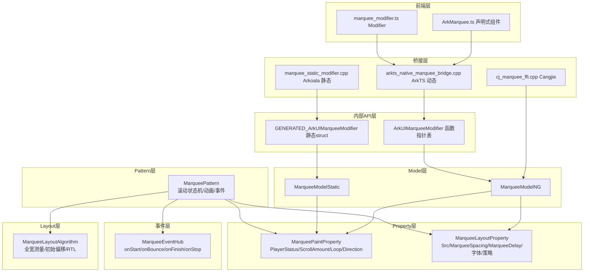
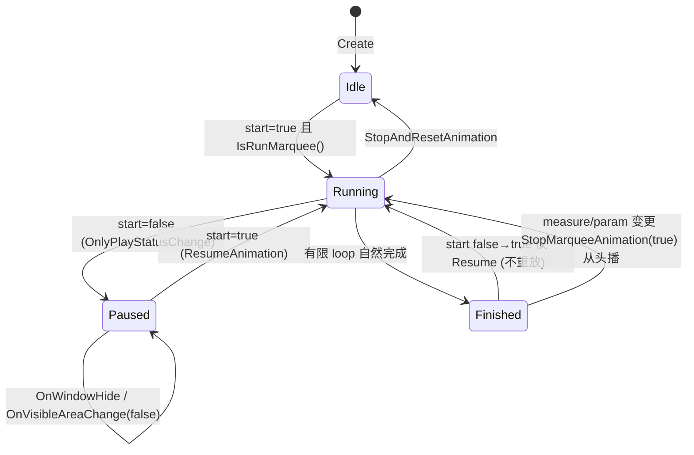

# 架构设计

> Marquee 组件功能域的架构设计文档，补录已有实现。Marquee 是一个单行文本跑马灯组件，仅在文本内容宽度大于等于组件宽度时启动滚动。

## 设计元数据

| 字段 | 内容 |
|------|------|
| Design ID | DESIGN-Func-05-09-01 |
| 关联需求 | 已有能力补录（无独立 requirement.md） |
| 关联 Epic | 无 |
| 目标 Feature | Feat-01 创建与滚动参数, Feat-02 字体样式, Feat-03 滚动策略、事件回调与多范式 |
| 复杂度 | 标准 |
| 目标版本 | API 8 起支持（动态版），API 12 新增 marqueeUpdateStrategy/MarqueeModifier，API 23 新增 spacing/delay 与静态版，API 26 新增 onStop/setMarqueeOptions 静态双签名 |
| Owner | ArkUI SIG |
| 状态 | Baselined（已有实现补录） |

## 需求基线

| 项 | 内容 |
|----|------|
| 问题陈述 | 开发者需要一个单行文本跑马灯组件，控制滚动启停、步长、循环次数、起始方向、轮间距、轮间延迟，并监听滚动生命周期事件 |
| 核心目标 | （Feat-01）固化 MarqueeOptions 的 start/step/loop/fromStart/src/spacing/delay 七个构造参数及滚动激活运行时逻辑（内容宽度+padding≥组件宽度才启动、step>textWidth 回退默认、loop≤0 无限循环、卡片场景仅滚一次）；（Feat-02）固化 fontColor/fontSize/allowScale/fontWeight/fontFamily 五个字体样式属性及其主题默认值（穿戴与普通设备差异）；（Feat-03）固化 marqueeUpdateStrategy 滚动策略、onStart/onBounce/onFinish/onStop 四个事件回调、MarqueeModifier/attributeModifier/setMarqueeOptions 多范式入口与 Cangjie FFI（无公开 NDK C-API） |
| P0 AC | 七个构造参数取值与默认值正确；滚动激活条件按真实谓词生效；start 不可重启已完成滚动；step>textWidth 回退默认 6vp；卡片场景 loop 强制 1 |

## 上下文和现状

### 涉及仓和模块

| 仓库 | 模块/路径 | 当前职责 | 本 Feature 影响 |
|------|-----------|----------|-----------------|
| ace_engine | `frameworks/core/components_ng/pattern/marquee/marquee_pattern.h/cpp` | Pattern 层 — 滚动状态机、动画播放、事件触发 | 核心运行时 |
| ace_engine | `frameworks/core/components_ng/pattern/marquee/marquee_model_ng.h/cpp` | Model 层 — ArkTS 动态版属性桥接 | API→Property |
| ace_engine | `frameworks/core/components_ng/pattern/marquee/marquee_model_static.h/cpp` | 静态版 Model 代理（仅 SetScrollAmount） | 静态版入口 |
| ace_engine | `frameworks/core/components_ng/pattern/marquee/marquee_layout_algorithm.h/cpp` | 布局算法 — 文本全宽测量、初始偏移、RTL | 布局消费 |
| ace_engine | `frameworks/core/components_ng/pattern/marquee/marquee_layout_property.h` | Layout 属性存储（Src/MarqueeSpacing/MarqueeDelay/字体属性/策略） | 属性存储 |
| ace_engine | `frameworks/core/components_ng/pattern/marquee/marquee_paint_property.h` | Paint 属性存储（PlayerStatus/ScrollAmount/Loop/Direction） | 属性存储 |
| ace_engine | `frameworks/core/components_ng/pattern/marquee/marquee_event_hub.h` | 事件 Hub — onStart/onBounce/onFinish/onStop 注册与触发 | 事件层 |
| ace_engine | `frameworks/core/components_ng/pattern/marquee/marquee_accessibility_property.h/cpp` | 无障碍 — 仅暴露文本内容，不暴露滚动状态 | 无障碍 |
| ace_engine | `frameworks/core/components_ng/pattern/marquee/marquee_pattern_multi_thread.cpp` | 多线程 attach/detach 钩子 | 多实例 |
| ace_engine | `frameworks/core/components_ng/pattern/marquee/bridge/arkts_native_marquee_bridge.h/cpp` | ArkTS 动态版桥接 — create/setInitialize/属性解析 | ArkTS 入口 |
| ace_engine | `frameworks/core/components_ng/pattern/marquee/bridge/marquee_dynamic_modifier.cpp` | 动态 Modifier — ArkUIMarqueeModifier 函数指针表 | 动态桥接 |
| ace_engine | `frameworks/core/components_ng/pattern/marquee/bridge/marquee_static_modifier.cpp` | 静态 Modifier — setMarqueeOptions/construct 等 | Arkoala 入口 |
| ace_engine | `frameworks/core/components_ng/pattern/marquee/bridge/marquee_custom_modifier.h/cpp` | 自定义 Modifier — 仅 setMarqueeFrameRateRange | 帧率同步 |
| ace_engine | `frameworks/core/components_ng/pattern/marquee/bridge/marquee_dynamic_module.cpp` | 动态模块分发 — GetDynamic/Static/Cj/CustomModifier | 模块分发 |
| ace_engine | `frameworks/core/components/common/properties/marquee_option.h` | 旧版 MarqueeOption struct（非 NG 路径） | 兼容结构 |
| ace_engine | `frameworks/core/components/marquee/marquee_theme.h` | 旧版主题（MARQUEE_FONT_SIZE 37.5px，NG 未直接使用字号） | 主题默认 |
| ace_engine | `frameworks/core/components/common/layout/constants.h` | 枚举 — MarqueeDirection/MarqueeUpdateStrategy/MarqueeDynamicSyncSceneType | 枚举定义 |
| ace_engine | `frameworks/bridge/declarative_frontend/ark_component/src/ArkMarquee.ts` | ArkTS 声明式组件 | 前端入口 |
| ace_engine | `frameworks/bridge/declarative_frontend/ark_modifier/src/marquee_modifier.ts` | ArkTS MarqueeModifier | 前端 Modifier |
| ace_engine | `frameworks/bridge/cj_frontend/interfaces/cj_ffi/cj_marquee_ffi.h/cpp` | Cangjie FFI — 子集 API（无 onStop/spacing/delay） | Cangjie 入口 |
| ace_engine | `frameworks/core/interfaces/arkoala/arkoala_api.h` | ArkUIMarqueeModifier 内部 API struct 定义 | 内部接口 |
| ace_engine | `frameworks/core/interfaces/native/generated/interface/arkoala_api_generated.h` | GENERATED_ArkUIMarqueeModifier 静态 struct + Ark_MarqueeOptions | 生成接口 |
| sdk-js | `api/@internal/component/ets/marquee.d.ts` | ArkTS 动态版 API 声明 | 类型定义 |
| sdk-js | `api/arkui/component/marquee.static.d.ets` | ArkTS 静态版 API 声明 | 类型定义 |
| sdk-js | `api/arkui/MarqueeModifier.d.ts` | MarqueeModifier 动态版声明 | 类型定义 |

### 调用链层级分析

| 层 | 模块 | 职责 | 修改类型 |
|----|------|------|----------|
| 前端声明层 | `ArkMarquee.ts` / `arkmarquee.js` | 声明式组件构造，调用 `setInitialize(node, start, step, loop, fromStart, src, spacing, delay)` | 已实现 |
| ArkTS 桥接层 | `arkts_native_marquee_bridge.cpp` | 解析 JS 参数，调用 `getMarqueeModifier()->setMarquee*` | 已实现 |
| 内部 API 层 | `arkoala_api.h` ArkUIMarqueeModifier | 函数指针 struct，分发到 dynamic_modifier 自由函数 | 已实现 |
| 动态 Modifier 层 | `marquee_dynamic_modifier.cpp` | 自由函数调用 `MarqueeModelNG::Set*`（FrameNode 重载） | 已实现 |
| 静态 Modifier 层 | `marquee_static_modifier.cpp` | Arkoala 生成路径，`setMarqueeOptions` 整体构造，`MarqueeModelStatic::SetScrollAmount` | 已实现 |
| Model 层 | `marquee_model_ng.cpp` / `marquee_model_static.cpp` | 属性 Update/Reset 到 Paint/Layout Property | 已实现 |
| Property 层 | `marquee_paint_property.h` / `marquee_layout_property.h` | 属性存储与 dirty flag（update MEASURE / paint reset RENDER） | 已实现 |
| Pattern 层 | `marquee_pattern.cpp` | 滚动状态机、动画播放、事件触发、属性变更分发 | 已实现 |
| Layout 层 | `marquee_layout_algorithm.cpp` | 文本全宽测量、初始偏移、RTL 对齐 | 已实现 |
| Event 层 | `marquee_event_hub.h` | 事件回调注册与触发 | 已实现 |
| 无障碍层 | `marquee_accessibility_property.cpp` | 仅暴露文本内容 | 已实现 |
| Cangjie 层 | `cj_marquee_ffi.cpp` | FFI 直调 ModelNG 实例方法（绕过 CJUIMarqueeModifier） | 已实现 |

### 适用架构规则

| Rule ID | 适用原因 | 设计结论 | 验证方式 |
|---------|----------|----------|----------|
| OH-ARCH-LAYERING | 前端→桥接→Modifier→Model→Property→Pattern→Layout | 单向调用，无跨层回调；Pattern 通过 EventHub 触发事件回前端 | 代码评审/依赖检查 |
| OH-ARCH-API-LEVEL | API 8 起公开，API 12/23/26 递进新增 | Public API；SysCap SystemCapability.ArkUI.ArkUI.Full；无权限要求 | API 评审/XTS |
| OH-ARCH-COMPONENT-BUILD | 组件化 NG 模块 | 已纳入 marquee pattern 模块，无新增 BUILD.gn | 构建验证 |
| OH-ARCH-ERROR-LOG | 无错误码返回（声明式属性 API） | 非法输入静默回退默认值，不抛错 | 单测 |

## 不涉及项承接

| 维度 | 设计结论 |
|------|----------|
| 公开 NDK C-API | Marquee 组件**无公开 Node C-API**。NDK 仅有 Text 组件的 `ArkUI_TextMarqueeOptions`（非独立 Marquee 节点）。多语言入口仅 ArkTS 动态/静态 + Cangjie FFI |
| 多子节点 | Marquee 不支持子组件；内部强制创建最多 2 个 Text 子节点（第二子节点仅在 spacing/delay 设置时存在） |
| 旧版非 NG 路径 | `MarqueeOption` struct 与 `MarqueeModelImpl` 旧路径保留兼容，但 NG pipeline 走 Paint/Layout Property；本设计以 NG 路径为准 |

## 关键设计决策

| 决策 ID | 问题 | 推荐方案 | 探索过的替代方案 | 取舍理由 | 影响 |
|---------|------|----------|------------------|----------|------|
| ADR-1 | 滚动激活条件如何判定 | 采用 `textWidth + horizontalPadding >= marqueeFrameWidth`（含等号、含水平 padding） | 简化为 `textWidth > marqueeWidth`（CLAUDE.md 文档说法） | 真实代码含 padding 与等号，简化版会漏判 padding 影响与等宽场景 | AC 必须按真实谓词测试；padding 影响 IsRunMarquee |
| ADR-2 | 未显式设置 start 时的默认值 | 运行时以 `value_or(false)` 为准；inspector 序列化以 `value_or(true)` 显示 | 统一为 true / 统一为 false | 运行时 false 与 SDK 文档（未明确默认）一致；inspector true 沿用旧版 struct 默认。两者不一致是已知问题 | 风险项：未设置 start 时行为与 inspector 显示相悖 |
| ADR-3 | 已完成的有限滚动如何重启 | start false→true 仅 ResumeAnimation（不重放）；需触发 measure 或参数变更走 StopMarqueeAnimation(true) 才从头播放 | 检测 finished 状态自动 reset animation_ | 当前实现 animation_ 在自然完成后不 reset，避免误重放 | 需独立 AC + 风险项；用户易踩坑 |
| ADR-4 | step 超过文本宽度时的处理 | 回退默认 6vp（px），时长公式 `duration = |end-start| * 85 / step` ms | 超过时夹紧到 textWidth | 默认值 6vp 是历史经验值；85ms/px 控制视觉速度 | step 行为语义与时长可观测性 |
| ADR-5 | 属性存储分层 | PlayerStatus/ScrollAmount/Loop/Direction 存 PaintProperty；Src/MarqueeSpacing/MarqueeDelay 存 LayoutProperty | 全存 LayoutProperty / 全存 PaintProperty | 滚动控制参数在运行时频繁读取，Paint 层读取开销低；Src/Spacing/Delay 影响布局测量，属 Layout | MarqueeLayoutProperty 镜像了前四项但 NG 未写入（遗留） |
| ADR-6 | 多范式入口策略 | ArkTS 动态（ArkUIMarqueeModifier）+ Arkoala 静态（setMarqueeOptions）+ Cangjie FFI；无公开 NDK | 新增公开 NDK Node C-API | Marquee 主要面向 ArkTS；Cangjie 需求有限；NDK 仅 Text 跑马灯覆盖 | Cangjie FFI 缺 onStop/spacing/delay/direction setter（已知缺口） |
| ADR-7 | 卡片/服务卡片场景的循环处理 | `IsFormRenderExceptDynamicComponent()` 为真时强制 loop=1，仅滚一次 | 按用户 loop 执行 | 卡片场景资源受限，避免无限滚动耗电 | 需卡片场景 AC 与兼容性说明 |

## 设计骨架

### 骨架范围

| 骨架项 | 目标 | 不包含 | 验证方式 |
|--------|------|--------|----------|
| Marquee 组件创建与属性存储 | 7 构造参数 + 5 字体属性 + 策略/事件落库到 Paint/Layout Property | 具体动画曲线实现 | 单测/UT |
| 滚动状态机 | Idle/Running/Paused/Finished 转换 | 多线程同步细节 | 集成测试 |
| 多范式桥接 | ArkTS/Arkoala/Cangjie 三入口分发 | 公开 NDK | API 评审 |

### 骨架 Spec 拆分

| Task ID | 目标 | 受影响文件 | AC |
|---------|------|-----------|-----|
| TASK-SKELETON-1 | 创建与滚动参数 spec | `Feat-01-marquee-creation-scroll-params-spec.md` | AC-1.x ~ AC-7.x |
| TASK-SKELETON-2 | 字体样式 spec | `Feat-02-marquee-font-style-spec.md` | AC-1.x ~ AC-5.x |
| TASK-SKELETON-3 | 策略/事件/多范式 spec | `Feat-03-marquee-strategy-events-multi-paradigm-spec.md` | AC-1.x ~ AC-6.x |

## 后续 Task 拆分

| Task ID | 目标 | 受影响文件 | 依赖 |
|---------|------|-----------|------|
| TASK-01 | 创建与滚动参数行为规格补录 | `05-ui-components/09-text-components/01-marquee/Feat-01-marquee-creation-scroll-params-spec.md` | 无 |
| TASK-02 | 字体样式行为规格补录 | `05-ui-components/09-text-components/01-marquee/Feat-02-marquee-font-style-spec.md` | TASK-01（共享 design.md） |
| TASK-03 | 策略/事件/多范式行为规格补录 | `05-ui-components/09-text-components/01-marquee/Feat-03-marquee-strategy-events-multi-paradigm-spec.md` | TASK-01（共享 design.md） |

## API 签名、Kit 与权限

### 新增 API

| API 签名 | 类型 | Kit | d.ts 位置 | 权限要求 | SysCap |
|----------|------|-----|----------|----------|---------|
| `Marquee(options: MarqueeOptions): MarqueeAttribute` (动态) | Public | ArkUI | `api/@internal/component/ets/marquee.d.ts` | 无 | SystemCapability.ArkUI.ArkUI.Full |
| `Marquee(options: MarqueeOptions): MarqueeAttribute` (静态) | Public | ArkUI | `api/arkui/component/marquee.static.d.ets` | 无 | SystemCapability.ArkUI.ArkUI.Full |
| `Marquee(style: CustomBuilderT<MarqueeAttribute>): MarqueeAttribute` (静态双签名, @since 26.1) | Public | ArkUI | `api/arkui/component/marquee.static.d.ets` | 无 | SystemCapability.ArkUI.ArkUI.Full |
| `setMarqueeOptions(options: MarqueeOptions): this` (静态, @since 26.1, unpublished) | InnerApi | ArkUI | `api/arkui/component/marquee.static.d.ets` | 无 | SystemCapability.ArkUI.ArkUI.Full |
| `MarqueeModifier` (动态, @since 12) | Public | ArkUI | `api/arkui/MarqueeModifier.d.ts` | 无 | SystemCapability.ArkUI.ArkUI.Full |
| `FfiOHOSAceFrameworkMarqueeCreate(...)` (Cangjie FFI) | InnerApi | ArkUI | `frameworks/bridge/cj_frontend/interfaces/cj_ffi/cj_marquee_ffi.h` | 无 | SystemCapability.ArkUI.ArkUI.Full |

### 变更/废弃 API

| 原有 API | 变更类型 | 新 API | 迁移说明 |
|----------|----------|--------|----------|
| `MarqueeOptions` (API 8 object) | 变更 | `MarqueeOptions` (API 18 匿名对象 rectification) | 字段不变，类型化；历史版本信息保留 |
| `onStop(event)` | 新增 (@since 26) | — | 旧版无 onStop；stopViaPlayStatus 变更监听 |

## 构建系统影响

### BUILD.gn 变更

无新增 BUILD.gn 变更。Marquee pattern 模块已纳入 `frameworks/core/components_ng/pattern/marquee/BUILD.gn`，bridge 子目录已纳入 `bridge/BUILD.gn`。

### bundle.json 变更

无。Marquee 组件属 ArkUI 部件既有能力，无新增部件依赖。

## 可选设计扩展

### 架构图



### 数据模型设计

TypeScript 层（API）：

```typescript
interface MarqueeOptions {
    start: boolean;          // 是否开始滚动
    step?: number;           // 步长 vp，默认 6
    loop?: number;           // 循环次数，<=0 无限，默认 -1
    fromStart?: boolean;     // 从头开始，默认 true
    src: string;             // 滚动文本
    spacing?: LengthMetrics; // 轮间距，默认=组件宽度 (@since 23)
    delay?: number;          // 轮间等待 ms，默认 0 (@since 23)
}
```

C++ 层（框架）：

| 属性 | C++ 字段 | 存储位置 | 类型 | dirty flag(update/reset) |
|------|----------|----------|------|--------------------------|
| start | propPlayerStatus_ | MarqueePaintProperty | bool | MEASURE / RENDER |
| step | propScrollAmount_ | MarqueePaintProperty | double (px) | MEASURE / RENDER |
| loop | propLoop_ | MarqueePaintProperty | int32_t | MEASURE / RENDER |
| fromStart | propDirection_ | MarqueePaintProperty | MarqueeDirection | MEASURE / RENDER |
| src | propSrc_ | MarqueeLayoutProperty | std::string | MEASURE / MEASURE |
| spacing | propMarqueeSpacing_ | MarqueeLayoutProperty | CalcDimension | MEASURE / MEASURE |
| delay | propMarqueeDelay_ | MarqueeLayoutProperty | int32_t | MEASURE / MEASURE |
| fontColor | propFontColor_ | MarqueeLayoutProperty | Color | MEASURE / MEASURE |
| fontSize | propFontSize_ | MarqueeLayoutProperty | Dimension | MEASURE / MEASURE |
| allowScale | propAllowScale_ | MarqueeLayoutProperty | bool | MEASURE / MEASURE |
| fontWeight | propFontWeight_ | MarqueeLayoutProperty | FontWeight | MEASURE / MEASURE |
| fontFamily | propFontFamily_ | MarqueeLayoutProperty | std::vector<string> | MEASURE / MEASURE |
| marqueeUpdateStrategy | propMarqueeUpdateStrategy_ | MarqueeLayoutProperty | MarqueeUpdateStrategy | MEASURE / NORMAL |

### 算法与状态机



关键常量：

| 常量 | 值 | 位置 |
|------|----|------|
| DEFAULT_MARQUEE_SCROLL_AMOUNT | 6.0_vp | marquee_paint_property.h:26 |
| DEFAULT_MARQUEE_SCROLL_DELAY | 85.0 (ms/px) | marquee_pattern.cpp:31 |
| DEFAULT_MARQUEE_LOOP | -1 (无限) | marquee_pattern.cpp:33 |

时长公式：`duration = |calculateEnd - calculateStart| * 85 / step`（ms），step>textWidth 时 step 回退 6vp。

## 详细设计

### 滚动激活与播放状态机

滚动激活谓词 `IsRunMarquee()`（`marquee_pattern.cpp:772-793`）：`return GreatOrEqual(textWidth + horizontalPadding, marqueeSize.Width())`。文本宽度含水平 padding。不满足时 `StartMarqueeAnimation` 提前返回（`marquee_pattern.cpp:181-185`），不触发 onStart。

播放状态分发（`OnModifyDone` `marquee_pattern.cpp:135-174`）：
1. measure/layout flag → `measureChanged_=true`，延迟到 `OnDirtyLayoutWrapperSwap` 走 `StopMarqueeAnimation(playStatus)` 重启
2. 仅 playerStatus 变更（`OnlyPlayStatusChange`）→ `ChangeAnimationPlayStatus`（pause/resume，不重布局）
3. 策略=DEFAULT 或无第二子节点或动画参数变更 → `StopMarqueeAnimation(playStatus)`（停止并从头重启）

### step 回退与时长公式

`PlayMarqueeAnimation`（`marquee_pattern.cpp:208-251`）：`step = GetScrollAmount()`；`if (GreatNotEqual(step, textWidth)) step = DEFAULT_MARQUEE_SCROLL_AMOUNT.ConvertToPx()`。时长 `duration = |end-start| * DEFAULT_MARQUEE_SCROLL_DELAY / step`，曲线 `Curves::LINEAR`。RTL 文本交换 start/end。

### spacing/delay 双滚动

`NeedSecondChild() = HasMarqueeSpacing() || HasMarqueeDelay()`（`marquee_pattern.cpp:923-930`）。任一设置即创建第二文本子节点，走 `PlayMarqueeDoubleAnimation`（`marquee_pattern.cpp:1071-1115`）。`textTotalLen = textWidth + max(spacing,0)`；`delay` 在两轮间插入 no-op 关键帧（`BuildAnimationKeyframes` `:1161`）。spacing 默认值=组件宽度（`GetMarqueeSpacing` `:889-903`）。

### fromStart 与 RTL

`fromStart` 桥接映射为 MarqueeDirection（true→LEFT，false→RIGHT，`arkts_native_marquee_bridge.cpp:255-256`）。LEFT 表示文本从右边缘进入向左滚动；RIGHT 从左边缘向右。文本方向自动检测（`GetTextDirection` `marquee_pattern.cpp:809-828`）。`directionMoveLeft = (direction==LEFT) ^ (textDir==RTL)`（`:918-919`）。

### 卡片场景强制单次

`StartMarqueeAnimation`（`marquee_pattern.cpp:191-193`）：`if (pipeline->IsFormRenderExceptDynamicComponent()) repeatCount = 1`。`IsFormRenderExceptDynamicComponent()` = `isFormRender_ && !isDynamicRender_`（`pipeline_base.h:775-778`）。

### 字体样式默认值

NG pattern 从 TextTheme 取默认（`UpdateTextNodeAttr` `marquee_pattern.cpp:940-970`）：fontColor=`font_primary`（`#182431` 普通 / `#FFFFFFFF` 穿戴）；fontSize=`16.0fp` 普通 / `15.0fp` 穿戴；fontWeight=Normal；fontFamily 默认重置。allowScale 默认 true → fp 随系统字号缩放。`OnColorConfigurationUpdate` 覆盖为 `MarqueeTheme::GetTextColor()`（无 alpha）。

### 滚动策略与事件

`MarqueeUpdateStrategy`（`constants.h:942-945`）：DEFAULT=0 重启；PRESERVE_POSITION=1 保留位置（仅 spacing/delay 设置且无参数变更时生效）。事件触发点：onStart(`:195`)、onBounce(`:301`/`:1219`)、onFinish(`:307`/`:314`)、onStop(`:399`，需 hasStart_ 且 GetTextOffset()==0)。终态顺序：onStop 先于 onFinish（`:276-277`）。

### 多范式桥接

ArkTS 动态：`ArkUIMarqueeModifier` 函数指针表（`arkoala_api.h:8575-8613`）→ `marquee_dynamic_modifier.cpp` 自由函数 → `MarqueeModelNG`。Arkoala 静态：`setMarqueeOptions`（`marquee_static_modifier.cpp:84-116`）解析 step/loop/src/start/direction（spacing/delay 解析但未 apply）。Cangjie FFI：`cj_marquee_ffi.cpp` 直调 ModelNG 实例，缺 onStop/spacing/delay/direction setter。无公开 NDK C-API。

## 风险和开放问题

| 项 | 类型 | 影响 | 处理方式 | Owner |
|----|------|------|----------|-------|
| start 默认值不一致：运行时 false vs inspector true vs legacy struct true | API | 中 | 规格固化运行时 false；inspector 不一致标注为已知问题 | ArkUI SIG |
| 已完成滚动不可用 start 重启（仅 Resume 不重放） | API | 中 | 独立 AC 与风险项；建议开发者改 step/loop/src 触发重启 | ArkUI SIG |
| MarqueeLayoutProperty 镜像 PlayerStatus/ScrollAmount/Loop/Direction 但 NG 未写入 | 架构 | 低 | 遗留代码，标注不使用；未来清理 | ArkUI SIG |
| Cangjie FFI 缺 onStop/spacing/delay/direction setter | API | 低 | 标注已知缺口；cj_marquee_ffi.cpp:28 TODO 待用 CJUIMarqueeModifier | ArkUI SIG |
| setMarqueeOptions 静态 API 解析 spacing/delay 但未 apply | API | 中 | 标注已知缺口；spacing/delay 需走单独生成 setter | ArkUI SIG |
| 无公开 NDK C-API | API | 低 | Marquee 非跨语言刚需；NDK 仅 Text 跑马灯覆盖 | ArkUI SIG |
| paint 属性 dirty-flag 不对称（update MEASURE / reset RENDER） | 架构 | 低 | OnModifyDone 只读 layout flag，paint reset 走 RENDER 影响小 | ArkUI SIG |

## 设计审批

- [x] 需求基线已确认，设计覆盖 P0/P1 AC
- [x] 不涉及项已承接，N/A 和展开项都有结论
- [x] 涉及仓和模块职责清楚
- [x] 调用链层级分析完整，每层覆盖到位
- [x] 适用架构规则已识别并形成设计结论
- [x] 分层和子系统边界合规
- [x] API 变更有签名、权限、错误码和兼容性说明
- [x] BUILD.gn/bundle.json 影响明确
- [x] 设计输出和后续 Task 拆分明确
- [x] 关键设计决策有理由和影响说明
- [x] 风险和开放问题有 Owner

**结论:** 通过（已有实现补录）
