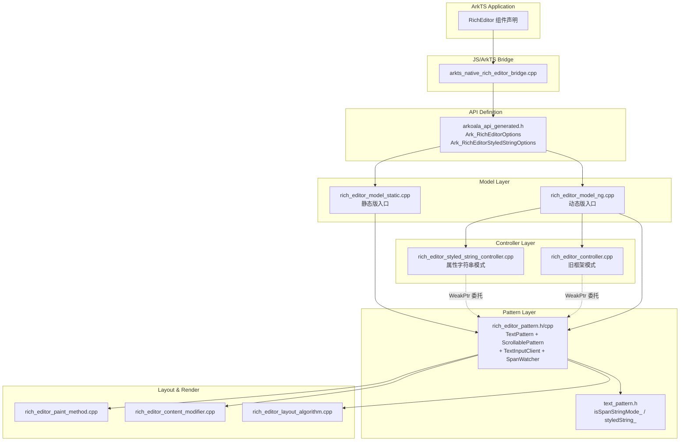
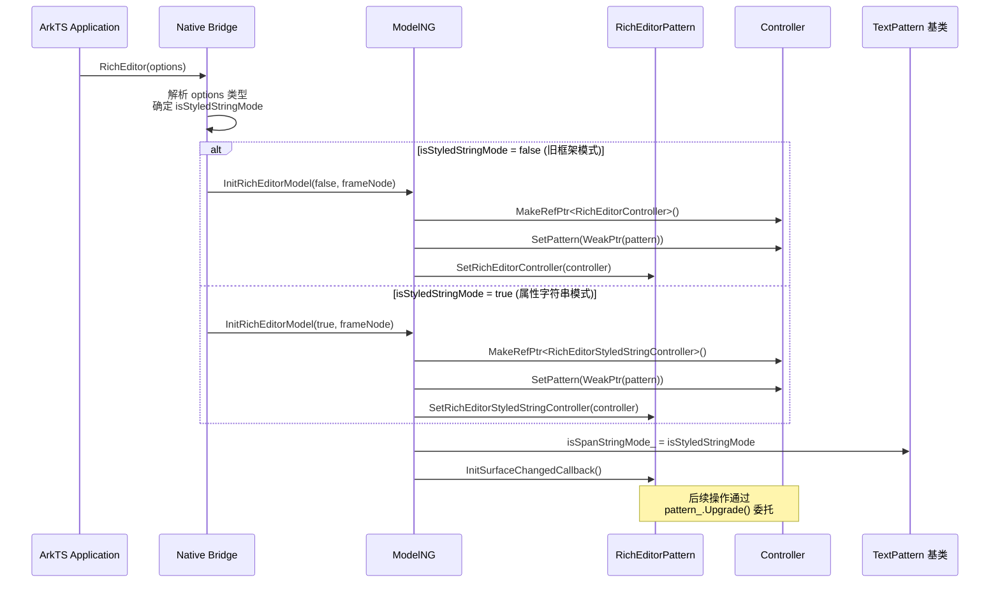

# 架构设计

> RichEditor 组件功能域的架构设计文档，补录已有实现。RichEditor 是基于 TextPattern 扩展的富文本编辑组件，支持双模式架构（旧框架模式与属性字符串模式）。

## 设计元数据

| 字段 | 内容 |
|------|------|
| Design ID | DESIGN-Func-05-09-02 |
| 关联需求 | 已有能力补录（无独立 requirement.md） |
| 关联 Epic | 无 |
| 目标 Feature | Feat-01 组件初始化与双模式架构；Feat-02 Span内容管理；Feat-03 属性字符串模式管理；Feat-04 文本排版与显示优化；Feat-05 视觉样式与交互反馈；Feat-06 键盘与输入法交互；Feat-07 编辑生命周期与内容变化事件；Feat-08 光标选择与编辑状态控制；Feat-09 剪贴板、数据检测与菜单定制 |
| 复杂度 | 复杂 |
| 目标版本 | API 10+（属性字符串模式 API 12+） |
| Owner | ArkUI SIG |
| 状态 | Baselined（已有实现补录） |

## 需求基线

| 项 | 补充说明 |
|----|----------|
| 问题陈述 | 开发者需要一个支持富文本编辑的组件，能够混合编排文本、图片、符号等多种 Span 类型，支持通过 Controller 进行内容增删改查，同时提供属性字符串（StyledString）模式以支持声明式样式绑定 |
| 核心目标 | 提供双模式架构：旧框架模式基于 `std::list<RefPtr<SpanItem>>` 的 Span 级 API（API 10+），属性字符串模式基于 `RefPtr<MutableSpanString>` 的 StyledString 级 API（API 12+），通过 `isSpanStringMode_` 标志位在 TextPattern 基类统一管理模式切换 |
| P0 AC | 组件创建后默认进入旧框架模式；传入 `RichEditorStyledStringOptions` 时进入属性字符串模式；两种模式下 Controller 均可正常代理 Pattern 操作；模式标志位 `isSpanStringMode_` 在基类 TextPattern 中统一存储 |

## 上下文和现状

### 涉及仓和模块

| 仓库 | 模块/路径 | 当前职责 | 本 Feature 影响 |
|------|-----------|----------|-----------------|
| ace_engine | `frameworks/core/components_ng/pattern/rich_editor/rich_editor_pattern.h/cpp` | 核心 Pattern：多继承 TextPattern + ScrollablePattern + TextInputClient + SpanWatcher | 核心逻辑 |
| ace_engine | `frameworks/core/components_ng/pattern/rich_editor/rich_editor_model_ng.cpp` | ModelNG 层：ArkTS 动态版入口，组件创建与初始化 | 初始化入口 |
| ace_engine | `frameworks/core/components_ng/pattern/rich_editor/rich_editor_model_static.cpp` | ModelStatic 层：ArkTS 静态版入口，支持运行时模式切换 | 静态版入口 |
| ace_engine | `frameworks/core/components_ng/pattern/rich_editor/rich_editor_controller.cpp` | 旧框架模式 Controller：持有 WeakPtr 委托 Pattern | 控制器层 |
| ace_engine | `frameworks/core/components_ng/pattern/rich_editor/rich_editor_styled_string_controller.cpp` | 属性字符串模式 Controller | 控制器层 |
| ace_engine | `frameworks/core/components_ng/pattern/text/text_pattern.h` | 基类 TextPattern：定义 `isSpanStringMode_`（:669）和 `styledString_`（:617） | 共享基础设施 |
| ace_engine | `frameworks/core/interfaces/native/generated/interface/arkoala_api_generated.h` | API 定义：双模式选项结构体（:9209-9228） | API 定义层 |

### 调用链层级分析

| 层 | 模块 | 职责 | 修改类型 |
|----|------|------|----------|
| ArkTS Application | RichEditor 组件 | 声明式 UI 构造，传入 RichEditorOptions 或 RichEditorStyledStringOptions | 无变更（补录） |
| JS/ArkTS Bridge | arkricheditor.js, ArkRichEditor.ts | 接口入口，参数收集与转换 | 无变更 |
| Native Bridge | `bridge/arkts_native_rich_editor_bridge.cpp` | 参数解析，类型转换，分发到 ModelNG/ModelStatic | 无变更 |
| API 定义 | `arkoala_api_generated.h` | Modifier 结构体、双模式选项结构体（`Ark_RichEditorOptions` / `Ark_RichEditorStyledStringOptions`） | 无变更 |
| Model Layer | `rich_editor_model_ng.cpp`, `rich_editor_model_static.cpp` | 业务逻辑：Pattern/EventHub 操作、Controller 绑定 | 无变更 |
| Pattern Layer | `rich_editor_pattern.h/cpp` | 核心 Pattern：多继承（TextPattern + ScrollablePattern + TextInputClient + SpanWatcher） | 无变更 |
| Controller Layer | `rich_editor_controller.cpp`, `rich_editor_styled_string_controller.cpp`, `rich_editor_base_controller.cpp` | 双模式 Controller，持有 WeakPtr 委托 Pattern | 无变更 |
| Layout Layer | `rich_editor_layout_algorithm.cpp` | 段落管理、LRU 缓存、多段落布局 | 无变更 |
| Render Layer | `rich_editor_content_modifier.cpp`, `rich_editor_paint_method.cpp` | Rosen + Skia 渲染 | 无变更 |

检查项：
- [x] 调用链每一层都已覆盖（从 ArkTS Application 到 Render Layer）
- [x] 每层职责边界清晰，无跨层违规调用
- [x] 每层修改类型明确（均为补录，无变更）

### 适用架构规则

| Rule ID | 适用原因 | 设计结论 | 验证方式 |
|---------|----------|----------|----------|
| OH-ARCH-LAYERING | 涉及 ArkTS → Bridge → Model → Pattern → Layout → Render 多层调用 | 调用方向严格自顶向下，Pattern 不反向调用 Bridge | 架构评审/依赖检查 |
| OH-ARCH-SUBSYSTEM | 涉及 IME、剪贴板、无障碍等子系统 | 通过 TextInputClient 接口与 IME 交互，通过 Clipboard API 访问剪贴板 | 集成测试 |
| OH-ARCH-API-LEVEL | 涉及 API 10 与 API 12 双版本入口 | 旧框架模式 API 10+，属性字符串模式 API 12+，通过 `isSpanStringMode_` 区分 | API 评审/XTS |
| OH-ARCH-COMPONENT-BUILD | 涉及 BUILD.gn 组件构建 | `rich_editor/BUILD.gn` 包含全部源文件 | 构建验证 |
| OH-ARCH-ERROR-LOG | 涉及 CHECK_NULL 防御性检查 | 所有跨层调用均使用 CHECK_NULL 宏进行空指针保护 | 单测/hilog |

## 不涉及项承接

| 维度 | 设计结论 |
|------|----------|
| 前端框架变更 | 无变更。RichEditor 在 Declarative Frontend 和 ArkTS Frontend 两种前端管线中均已实现，本次仅补录设计文档 |
| 公共 API 签名变更 | 无变更。所有 API 签名保持不变，双模式通过不同的 options 类型参数区分 |
| 构建依赖变更 | 无变更。`rich_editor/BUILD.gn` 依赖关系不变，不新增外部模块依赖 |
| C-API ABI 变更 | 无变更。RichEditor 的 C-API 通过 Arkoala modifier 桥接，无独立 NODE 层 C-API |

## 关键设计决策

| 决策 ID | 问题 | 推荐方案 | 探索过的替代方案 | 取舍理由 | 影响 |
|---------|------|----------|------------------|----------|------|
| ADR-1 | 模式标志位 `isSpanStringMode_` 应定义在哪个类 | 定义在基类 `TextPattern`（`text_pattern.h:669`） | 方案 A：定义在 `RichEditorPattern` 子类中；方案 B：通过独立 ModeManager 类管理 | `styledString_` 也存储在 TextPattern（`text_pattern.h:617`），标志与数据同一层级保持一致性，避免子类重复声明 | Text 和 RichEditor 共享基础设施，但基类承担了本应由子类管理的状态 |
| ADR-2 | Controller 绑定时机与方式 | 在 `InitRichEditorModel()` 中耦合创建与绑定（`rich_editor_model_ng.cpp:67-86`），通过 `isStyledStringMode` 参数分支选择 Controller 类型 | 方案 A：通过独立 setter 延迟绑定；方案 B：在 Pattern 构造函数中绑定 | 耦合创建减少 API 表面，保证 Controller 与 Pattern 生命周期一致性 | Controller 在组件创建时即完成绑定，动态版不支持创建后切换 |
| ADR-3 | 双模式分发机制 | 通过 tagged union selector 实现模式分发（`arkoala_api_generated.h:9209-9228`），`Ark_RichEditorOptions` 对应旧框架模式，`Ark_RichEditorStyledStringOptions` 对应属性字符串模式 | 方案 A：运行时 dynamic_cast；方案 B：枚举参数显式指定模式 | Tagged union 编译期确定类型，避免运行时类型检查开销 | API 层面类型安全，但增加 Bridge 层类型分发逻辑 |
| ADR-4 | 是否允许创建后切换模式 | 静态路径允许通过 `SetStyledStringMode()` 切换（`rich_editor_model_static.cpp:83-96`），动态路径不允许 | 方案 A：双路径均允许；方案 B：双路径均禁止 | 静态版需支持运行时切换以适应 ArkTS 静态编译约束 | 实现不一致：静态与动态路径在模式切换能力上存在差异 |
| ADR-5 | Controller 如何访问 Pattern | 所有 Controller 持有 `WeakPtr<RichEditorPattern>` 并通过 `pattern_.Upgrade()` 委托（`rich_editor_controller.cpp:20-25`） | 方案 A：持有 RawPtr；方案 B：持有 RefPtr 强引用 | WeakPtr 避免循环引用，Upgrade() 失败时 CHECK_NULL_RETURN 安全降级 | 所有操作方法均需 Upgrade + CHECK_NULL，存在重复防御性代码 |
| ADR-F2-1 | Span 字符长度约定不一致 | TextSpan 按实际文本长度计算；ImageSpan/BuilderSpan 占 1 字符（`u" "`）；SymbolSpan 占 2 字符（`u"  "`，`SYMBOL_SPAN_LENGTH=2`，`rich_editor_pattern.cpp:127`） | 方案 A：统一占 1 字符；方案 B：按实际内容长度 | 保持与 Text 组件一致，SymbolSpan 占 2 字符因符号渲染需预留宽度 | maxLength 校验逻辑需按 Span 类型分别处理 |
| ADR-F2-2 | maxLength 校验差异 | TextSpan 用 `CalculateTruncationLength` 按字符截断；Image/BuilderSpan 直接比较 `>= maxLength`；SymbolSpan 比较 `>= maxLength - 1` | 方案 A：统一截断逻辑 | 不同 Span 类型长度约定不同，需分别校验 | 超 maxLength 时截断行为不一致 |
| ADR-F3-1 | `onContentChanged` 不由 `setStyledString` 触发 | `SetStyledString` 调用 `ReportAfterContentChangeEvent()`（`rich_editor_pattern.cpp:274`），后台程序变更走 `BeforeStyledStringChange`→`AfterStyledStringChange`（`:596, :612`），两条路径不交叉 | 方案 A：统一触发路径 | `setStyledString` 是显式 API 调用，与后台程序自动变更语义不同 | 规格需明确 `onContentChanged` 的触发条件边界 |
| ADR-F4-1 | 排版属性存储层级分散 | `enableAutoSpacing` 存 `TextLayoutProperty` 基类；`compressLeadingPunctuation`/`punctuationOverflow` 存 `TextLineStyle` 属性组；`horizontalScrolling` 仅存 Pattern 成员（不写 LayoutProperty） | 方案 A：统一存 Pattern 成员；方案 B：统一存 LayoutProperty | 属性语义不同：布局属性影响段落排版，交互属性仅控制滚动行为 | `horizontalScrolling` 不触发 `MarkDirtyNode`，仅控制 `HandleFreeScroll`/`HandleFixedScroll` 分支 |
| ADR-F5-1 | `selectedBackgroundColor` 自动透明度降级 | Alpha=255（完全不透明）时自动降为 0.2 不透明度（`rich_editor_pattern.cpp:11935`） | 方案 A：按原始 Alpha 值渲染 | 避免完全不透明背景遮挡选中区域文本内容 | 开发者设置的 Alpha=255 与实际渲染效果不一致 |
| ADR-F5-2 | `barState` 存储在 LayoutProperty 而非 Pattern | 映射为 `DisplayMode` 枚举存入 `RichEditorLayoutProperty::DisplayMode`，非 Pattern 成员变量 | 方案 A：存 Pattern 成员 | 滚动条显示模式属于布局属性，参与布局计算 | 与其他视觉属性（caretColor_ 存 Pattern）存储策略不一致 |
| ADR-F6-1 | `aboutToIMEInput` 拦截模式 | 返回 boolean，false 拒绝输入（`rich_editor_pattern.cpp:7123-7135`），预览态 `IsPreviewTextInputting()` 覆盖拦截 | 方案 A：仅通知不拦截 | 允许应用层在 IME 输入前做最终校验 | 拦截逻辑与预览态存在交互复杂度 |
| ADR-F7-1 | `onReady` 单次触发守卫 | `isRichEditorInit_` 标志确保仅首次 `OnDirtyLayoutWrapperSwap` 触发一次（`rich_editor_pattern.cpp:841, 933-934`） | 方案 A：每次布局完成都触发 | 组件就绪是一次性事件 | 标志位在 Pattern 析构前不可重置 |
| ADR-F7-2 | `onSelectionChange` 四层守卫降低回调噪声 | 焦点检查/负值检查/闪烁单句柄/范围去重（`rich_editor_pattern.cpp:2552-2575`） | 方案 A：无守卫直接触发 | 高频选择变化时回调噪声大，四层守卫降低无效通知 | 守卫链可能延迟合法回调 |
| ADR-F8-1 | 双模式 `getSelection` 返回类型差异 | 旧框架模式返回 `RichEditorSelection`（含 spans 列表）；属性字符串模式返回 `RichEditorRange`（仅 start/end） | 方案 A：统一返回类型 | 两种模式的数据模型不同，span 列表在 StyledString 模式下无意义 | 开发者需根据模式处理不同返回类型 |
| ADR-F8-2 | 预输入态拒绝光标/选区操作 | `setCaretOffset`/`setSelection` 在 `IsPreviewTextInputting()` 为 true 时拒绝操作（`rich_editor_pattern.cpp:2405-2408, 10594-10597`） | 方案 A：预览态允许操作 | 预览态下光标位置由 IME 控制，外部修改会与预览态冲突 | 预览态期间控制器操作被静默拒绝 |
| ADR-F9-1 | `copyOption_` 默认值不一致 | `TextPattern` 基类定义默认 None（`text_pattern.h:648`），`OnModifyDone` 读取时缺省值为 Local（`rich_editor_pattern.cpp:712`） | 方案 A：统一默认值 | RichEditor 默认可复制（Local），Text 默认不可复制（None），语义不同 | 两阶段默认值在不同时机生效 |
| ADR-F9-2 | `DataDetectorAdapter` 双实例架构 | `dataDetectorAdapter_`（全文检测）和 `selectDetectorAdapter_`（选区检测）分别管理独立 AI span | 方案 A：单实例管理 | 全文检测和选区检测的生命周期和作用域不同 | 双实例增加管理复杂度 |

## 设计骨架

### 骨架范围

| 骨架项 | 目标 | 不包含 | 验证方式 |
|--------|------|--------|----------|
| 双模式架构 | 旧框架与属性字符串模式的初始化、标志位管理、Controller 绑定 | 具体 Span 内容操作（Feat-02）、StyledString 管理（Feat-03） | 单测：模式标志位与 Controller 绑定正确性 |
| 调用链完整覆盖 | 从 ArkTS Application 到 Render Layer 的全链路 | 各层内部实现细节 | 架构评审：调用链层级分析表 |
| ADR 基线 | 5 个关键架构决策的记录与取舍分析 | 后续 Feat 的增量决策（ADR-FX-N） | 设计评审：ADR 表完整性 |

### 骨架 Spec 拆分

| Task ID | 目标 | 受影响文件 | AC |
|---------|------|-----------|-----|
| TASK-SKELETON-1 | 组件初始化与双模式架构基线 | `rich_editor_pattern.h/cpp`, `rich_editor_model_ng.cpp`, `rich_editor_model_static.cpp`, `rich_editor_controller.cpp`, `rich_editor_styled_string_controller.cpp`, `rich_editor_base_controller.cpp` | AC-1.1 旧框架模式 `isSpanStringMode_` 为 false；AC-1.2 属性字符串模式为 true；AC-1.3 Controller 正确绑定并委托 Pattern |

## 后续 Task 拆分

| Task ID | 目标 | 受影响文件 | 依赖 |
|---------|------|-----------|------|
| TASK-01 | Feat-01 组件初始化与双模式架构 | `rich_editor_pattern.h/cpp`, `rich_editor_model_ng.cpp`, `rich_editor_model_static.cpp`, `rich_editor_controller.cpp`, `rich_editor_styled_string_controller.cpp`, `rich_editor_base_controller.cpp` | 无（基线） |
| TASK-02 | Feat-02 Span 内容管理：增删改查与跨模式转换 | `rich_editor_pattern.cpp`, `rich_editor_controller.cpp` | TASK-01 |
| TASK-03 | Feat-03 属性字符串模式管理 | `rich_editor_pattern.cpp`, `rich_editor_styled_string_controller.cpp` | TASK-01 |
| TASK-04 | Feat-04 文本排版与显示优化 | `rich_editor_layout_algorithm.cpp`, `rich_editor_paint_method.cpp` | TASK-01 |
| TASK-05 | Feat-05 视觉样式与交互反馈 | `rich_editor_content_modifier.cpp`, `rich_editor_theme.h/cpp` | TASK-01 |
| TASK-06 | Feat-06 键盘与输入法交互 | `rich_editor_pattern.cpp`（TextInputClient 实现） | TASK-01 |
| TASK-07 | Feat-07 编辑生命周期与内容变化事件 | `rich_editor_pattern.cpp`, `rich_editor_event_hub.cpp` | TASK-01 |
| TASK-08 | Feat-08 光标选择与编辑状态控制 | `rich_editor_pattern.cpp`, `rich_editor_select_overlay.cpp` | TASK-01 |
| TASK-09 | Feat-09 剪贴板、数据检测与菜单定制 | `rich_editor_pattern.cpp`, `rich_editor_event_hub.cpp` | TASK-01 |

## API 签名、Kit 与权限

> 本节为补录，所有 API 均为已有实现。

### 新增 API

| API 签名 | 类型 | Kit | d.ts 位置 | 权限要求 | SysCap |
|----------|------|-----|-----------|----------|--------|
| `RichEditor(options: RichEditorOptions): RichEditorAttribute` | Public | ArkUI | `api/@internal/component/ets/rich_editor.d.ts` | 无 | SystemCapability.ArkUI.ArkUI.Full |
| `RichEditor(options: RichEditorStyledStringOptions): RichEditorAttribute` | Public | ArkUI | `api/@internal/component/ets/rich_editor.d.ts` | 无 | SystemCapability.ArkUI.ArkUI.Full |
| `setRichEditorOptions(options: RichEditorOptions \| RichEditorStyledStringOptions): this` | Public | ArkUI | `api/@internal/component/ets/rich_editor.d.ts` | 无 | SystemCapability.ArkUI.ArkUI.Full |
| `attributeModifier(modifier: AttributeModifier<RichEditorAttribute>): this` | Public | ArkUI | `api/arkui/component/rich_editor.static.d.ets` | 无 | SystemCapability.ArkUI.ArkUI.Full |

### 变更/废弃 API

| 原有 API | 变更类型 | 新 API | 迁移说明 |
|----------|----------|--------|----------|
| 无 | 无 | 无 | 本次为补录文档，无 API 变更 |

## 构建系统影响

### BUILD.gn 变更

```text
文件路径: frameworks/core/components_ng/pattern/rich_editor/BUILD.gn
变更说明: 无变更（补录）。该 BUILD.gn 已包含 rich_editor 目录下全部源文件，
         作为 ace_engine 构建目标的组成部分参与编译。
```

### bundle.json 变更

无变更。RichEditor 组件不引入新的外部依赖，所有依赖均在现有 `ace_engine` 部件范围内。

## 可选设计扩展

### 架构图



### 数据流/控制流

| 步骤 | 调用方 | 被调用方 | 数据/接口 | 说明 |
|------|--------|----------|-----------|------|
| 1 | ArkTS Application | JS Bridge | `RichEditor(options)` | 声明式构造 |
| 2 | JS Bridge | Native Bridge | 参数序列化 | options → C++ 结构体 |
| 3 | Native Bridge | ModelNG | `InitRichEditorModel(isStyledStringMode, frameNode)` | 根据模式创建 Controller |
| 4 | ModelNG | RichEditorPattern | `SetRichEditorController()` / `SetRichEditorStyledStringController()` | Controller 绑定 |
| 5 | RichEditorPattern | TextPattern 基类 | `isSpanStringMode_` 设置 | 模式标志位写入基类 |
| 6 | Controller | RichEditorPattern | `pattern_.Upgrade()` 委托 | 弱引用升级执行操作 |
| 7 | RichEditorPattern | LayoutAlgorithm | `MeasureContent()` | 触发布局计算 |
| 8 | RichEditorPattern | ContentModifier / PaintMethod | `OnDraw()` / `UpdateContent()` | 触发渲染 |

### 时序设计



### 数据模型设计

**C++ 框架层结构体：**

```cpp
// Mode flag — stored in TextPattern base class (text_pattern.h:669)
bool isSpanStringMode_ = false;
// Styled string data — stored in TextPattern base class (text_pattern.h:617)
RefPtr<MutableSpanString> styledString_;
// Old framework spans — inherited from TextPattern
std::list<RefPtr<SpanItem>> spans_;
// Styled string controller — in RichEditorPattern (rich_editor_pattern.h:1379)
RefPtr<RichEditorStyledStringController> richEditorStyledStringController_;
// Old framework controller — in RichEditorPattern
RefPtr<RichEditorController> richEditorController_;
```

| 数据 | 存储方案 | 所在类 | 说明 |
|------|----------|--------|------|
| 模式标志 `isSpanStringMode_` | 基类成员 | `TextPattern` (`:669`) | 统一管理，Text 与 RichEditor 共享 |
| 属性字符串 `styledString_` | 基类成员 | `TextPattern` (`:617`) | `RefPtr<MutableSpanString>` |
| Span 列表 `spans_` | 基类成员 | `TextPattern` | `std::list<RefPtr<SpanItem>>` |
| StyledString Controller | 子类成员 | `RichEditorPattern` (`:1379`) | `RefPtr<RichEditorStyledStringController>` |
| Controller → Pattern 弱引用 | Controller 成员 | `RichEditorBaseController` | `WeakPtr<RichEditorPattern>` 避免循环引用 |

### 测试性设计

| 测试层级 | 测试目标 | Mock 策略 | 验证方式 |
|----------|----------|-----------|----------|
| Host 单元测试 | 模式标志位正确性 | Mock PipelineContext 和 Theme | `isSpanStringMode_` 在两种 options 下设置正确 |
| Host 单元测试 | Controller 绑定正确性 | Mock FrameNode | `SetRichEditorController` / `SetRichEditorStyledStringController` 调用正确 |
| Host 单元测试 | 弱引用安全降级 | Mock Pattern 销毁 | `Upgrade()` 返回 nullptr 时 CHECK_NULL_RETURN 安全返回 |

### 资源所有权矩阵

| 资源 | 创建方 | 持有方 | 销毁触发 | 异常回收 |
|------|--------|--------|----------|----------|
| `RichEditorController` / `RichEditorStyledStringController` | `InitRichEditorModel()` | `RichEditorPattern`（RefPtr） | Pattern 析构 | RefPtr 引用计数归零 |
| `MutableSpanString` | `CreateStyledString()` | `TextPattern`（RefPtr `styledString_`） | Pattern 析构或模式切换 | RefPtr 引用计数归零 |
| Controller → Pattern 引用 | Controller 持有 WeakPtr | Controller | Pattern 销毁后失效 | `Upgrade()` 返回 nullptr，CHECK_NULL 降级 |

### 线程与并发模型

| 操作 | 发起线程 | 跨进程边界 | 线程安全 | 重入约束 |
|------|----------|-----------|----------|----------|
| 组件创建与 Controller 委托 | UI 线程 | 无 | 单线程访问，WeakPtr 保证 Pattern 存活 | 不可重入 |
| IME 交互与剪贴板读写 | UI 线程 | 跨进程（IME/剪贴板服务） | TextInputConnection/Clipboard 代理 | 不可重入 |

## 详细设计

### 双模式架构与模式标志位

RichEditor 的双模式架构核心在于 `isSpanStringMode_` 标志位。该标志定义在 `TextPattern` 基类（`text_pattern.h:669`），而非 `RichEditorPattern` 子类。`styledString_` 数据也存储在基类（`text_pattern.h:617`），模式标志与数据存储保持同一层级。

模式选择发生在组件创建时。`RichEditorModelNG::InitRichEditorModel()`（`rich_editor_model_ng.cpp:67`）根据 `isStyledStringMode` 参数分支创建对应 Controller：

```cpp
// rich_editor_model_ng.cpp:76-86 — controller binding coupled with creation
if (isStyledStringMode) {
    auto controller = AceType::MakeRefPtr<RichEditorStyledStringController>();
    controller->SetPattern(WeakPtr(richEditorPattern));
    richEditorPattern->SetRichEditorStyledStringController(controller);
} else {
    auto controller = AceType::MakeRefPtr<RichEditorController>();
    controller->SetPattern(WeakPtr(richEditorPattern));
    richEditorPattern->SetRichEditorController(controller);
}
```

在 API 定义层，双模式通过 tagged union 结构体区分（`arkoala_api_generated.h:9209-9228`）：`Ark_RichEditorOptions` 包含 `Ark_RichEditorController`，`Ark_RichEditorStyledStringOptions` 包含 `Ark_RichEditorStyledStringController`。

### Controller 委托模式

所有 Controller 继承自 `RichEditorBaseController`，持有 `WeakPtr<RichEditorPattern>`。每个操作方法通过 `pattern_.Upgrade()` 升级弱引用并 CHECK_NULL_RETURN 保护：

```cpp
// rich_editor_controller.cpp:20-25 — delegation pattern
int32_t RichEditorController::AddImageSpan(const ImageSpanOptions& options)
{
    auto richEditorPattern = pattern_.Upgrade();
    CHECK_NULL_RETURN(richEditorPattern, 0);
    return richEditorPattern->AddImageSpan(options, TextChangeReason::CONTROLLER);
}
```

优点：避免 Pattern ↔ Controller 循环引用。缺点：每个操作方法均需 Upgrade + CHECK_NULL，存在重复防御性代码。

### 静态路径模式切换

静态路径允许通过 `RichEditorModelStatic::SetStyledStringMode()`（`rich_editor_model_static.cpp:83-96`）在创建后切换模式，切换时重建 Controller 和 UndoManager：

```cpp
// rich_editor_model_static.cpp:83-96 — post-creation mode switch (static only)
void RichEditorModelStatic::SetStyledStringMode(FrameNode* frameNode, bool isStyledStringMode)
{
    auto richEditorPattern = frameNode->GetPattern<RichEditorPattern>();
    richEditorPattern->SetSpanStringMode(isStyledStringMode);
    if (isStyledStringMode) {
        richEditorPattern->RecreateUndoManager();
        richEditorPattern->CreateStyledString();
        // create RichEditorStyledStringController and bind...
    } else {
        // create RichEditorController and bind...
    }
}
```

动态路径不支持创建后切换模式——模式在 `InitRichEditorModel()` 时确定后不可变更。这属于已知的实现不一致（见 ADR-4）。

### RichEditorPattern 多继承结构

`RichEditorPattern`（`rich_editor_pattern.h:251-253`）通过多继承组合多个能力接口：

```cpp
// rich_editor_pattern.h:251-253 — multi-inheritance declaration
class RichEditorPattern
    : public TextPattern, public ScrollablePattern, public TextInputClient, public SpanWatcher {
    DECLARE_ACE_TYPE(RichEditorPattern, TextPattern, ScrollablePattern, TextInputClient, SpanWatcher);
```

| 基类 | 提供的能力 |
|------|-----------|
| `TextPattern` | 文本基础设施：Span 管理、`isSpanStringMode_`、`styledString_`、段落管理 |
| `ScrollablePattern` | 滚动能力：滚动条、滚动事件、惯性滚动 |
| `TextInputClient` | 输入法交互：文本插入、删除、光标移动、IME 通信 |
| `SpanWatcher` | Span 变化监听：Span 增删改通知 |

### Span 内容管理与字符长度约定（Feat-02）

RichEditor 旧框架模式下，不同 Span 类型的字符长度约定不同：TextSpan 按实际文本长度计算；ImageSpan 和 BuilderSpan（AddPlaceholderSpan）各占 1 字符（`u" "`）；SymbolSpan 占 2 字符（`u"  "`，`SYMBOL_SPAN_LENGTH=2`，`rich_editor_pattern.cpp:127`）。这导致 `maxLength` 校验逻辑需按 Span 类型分别处理：TextSpan 用 `CalculateTruncationLength` 按字符截断；Image/BuilderSpan 直接比较 `>= maxLength`；SymbolSpan 比较 `>= maxLength - 1`。`updateSpanStyle` 存在双层 clamp：Controller 层先做 `max(0,start)`/`min(length,end)` clamp 和 swap，Pattern 层再做 `AdjustSelector` 和 `TextSpanSplit` 部分拆分。`toStyledString`/`fromStyledString` 的 -1 哨兵值表示"未指定"，默认取 `[0, GetTextContentLength()]` 全范围。

### 属性字符串模式内容变更通知（Feat-03）

`RichEditorPattern` 继承 `SpanWatcher`（`rich_editor_pattern.h:252`），在 `CreateStyledString` 中通过 `styledString_->SetSpanWatcher(WeakClaim(this))` 注册自身。`setStyledString` 调用 `ReportAfterContentChangeEvent()`（`rich_editor_pattern.cpp:274`），而后台程序变更走 `BeforeStyledStringChange`→`FireOnStyledStringWillChange`（`:596`）和 `AfterStyledStringChange`→`FireOnStyledStringDidChange`（`:612`）两条独立路径。`onContentChanged` 监听器仅响应后台程序变更，不响应 `setStyledString` 调用。`setStyledPlaceholder`（API 24+）优先级高于普通 `placeholder`，存储为 `styledPlaceholder_`（`:2656`）。

### 排版属性存储层级分布（Feat-04）

RichEditor 的排版优化属性存储在三个不同层级：`enableAutoSpacing` 存储在 `TextLayoutProperty` 基类属性中，变更时仅清除 `paragraphCache_`；`compressLeadingPunctuation`/`punctuationOverflow` 存储在 `TextLineStyle` 属性组中，经 `paragraph_util.cpp:45-46` 写入 ParagraphStyle；`includeFontPadding`/`fallbackLineSpacing` 额外触发 `MarkDirtyNode(PROPERTY_UPDATE_MEASURE)`；`horizontalScrolling` 仅存储为 Pattern 成员变量（不写入 LayoutProperty），控制 `HandleFreeScroll`/`HandleFixedScroll` 分支。`orphanCharOptimization`（API 26+）存在双消费路径：ParagraphStyle（`paragraph_util.cpp:44`）和 TextStyle（`multiple_paragraph_layout_algorithm.cpp:200`）。`SetMaxLength` 非 `INT_MAX` 时触发 `DeleteToMaxLength` 截断已有内容。

### 视觉样式渲染与交互反馈（Feat-05）

`caretColor_`/`selectedBackgroundColor_` 存储为 `std::optional<Color>` Pattern 成员变量，主题回退默认值为 `Color(0xff007dff)`。`selectedBackgroundColor` 存在自动透明度降级：Alpha=255 时自动降为 0.2 不透明度（`rich_editor_pattern.cpp:11935`）。`scrollBarColor` 使用 `arkui_Graphics_ColorMetrics` 类型和 `ParseColorMetricsToColor` 解析器，通过 `ScrollController::UpdateScrollBarColor` 更新。`barState` 映射为 `DisplayMode` 枚举存入 `RichEditorLayoutProperty::DisplayMode`（非 Pattern 成员）。`stopBackPress` 返回键拦截逻辑仅在 `#ifdef ANDROID_PLATFORM` 条件编译内生效。`enableHapticFeedback` 有双触发路径：长按触发 `longPress.light` 振动，滑动索引变化触发 `slide` 振动。

### 键盘与输入法交互架构（Feat-06）

`customKeyboard` 通过 `RequestCustomKeyboard`（`rich_editor_pattern.cpp:6319-6374`）替换系统输入法。`enablePreviewText` 控制预上屏功能，预览文本通过 `SetPreviewText`/`FinishTextPreview`（`:6425-6664`）管理。`aboutToIMEInput` 是拦截回调，返回 `false` 拒绝输入（`:7123-7135`），预览态 `IsPreviewTextInputting()` 覆盖拦截逻辑。`onWillAttachIME`（API 22+）在 IME 绑定前触发，允许 `IMEClient` 自定义。`enterKeyType` 通过 `PerformAction`（`:12228-12248`）处理回车键行为。`keyboardAppearance`（API 15+）控制键盘外观（`:15059-15076, 6006-6015`）。

### 编辑生命周期与事件守卫链（Feat-07）

`onReady` 由 `isRichEditorInit_` 守卫确保仅首次 `OnDirtyLayoutWrapperSwap` 触发一次（`rich_editor_pattern.cpp:841, 933-934`），触发后注册 `AfterRenderTask` 标脏。`onEditingChange` 在 `HandleOnEditChanged` 中通过 `isEditing_ != isEditing` 状态去重（`:12116-12126`），获焦/失焦/双击/长按多路径触发。`aboutToDelete`/`onDeleteComplete` 遵循 will/did 时序模式，`DoDeleteActions` 返回布尔值拦截。`onWillChange`/`onDidChange` 通过 `BeforeChangeText`/`AfterContentChange` 配对，双重守卫 `!HasOnWillChange() && !HasOnDidChange()` 跳过无效构造。`onSelectionChange` 有四层守卫（焦点/负值/闪烁单句柄/范围去重，`:2552-2575`）降低高频回调噪声。

### 光标选择与编辑状态控制（Feat-08）

所有方法定义在 `RichEditorBaseController`（`rich_editor_base_controller.h:29-59`），双模式共享。`getSelection` 在两种模式返回不同类型：旧框架模式通过 `RichEditorController::GetSelectionSpansInfo`（`rich_editor_controller.cpp:82-97`）返回 `SelectionInfo`（对应 `RichEditorSelection`，含 spans 列表）；属性字符串模式通过 `RichEditorStyledStringController::GetSelection`（`rich_editor_styled_string_controller.cpp:44-58`）返回 `SelectionRangeInfo`（对应 `RichEditorRange`，仅 start/end）。`setCaretOffset`/`setSelection` 在 `IsPreviewTextInputting()` 为 true 时拒绝操作（`rich_editor_pattern.cpp:2405-2408, 10594-10597`）。`setCaretOffset`(isMoveContent=true) 和 `setSelection`/`setTypingStyle`/`setTypingParagraphStyle`(isMoveContent=false) 在控制器层追加 `ForceTriggerAvoidOnCaretChange` 调用（`rich_editor_base_controller.cpp:71, 81, 96, 149`）。

### 剪贴板、数据检测与菜单定制（Feat-09）

`copyOption_` 定义在 `TextPattern` 基类（`text_pattern.h:648`，默认 None），但 RichEditor 的 `OnModifyDone` 读取时缺省值为 `Local`（`rich_editor_pattern.cpp:712`）——两阶段默认值在不同时机生效。`DataDetectorAdapter` 为双实例架构：`dataDetectorAdapter_`（全文检测，API 11+）和 `selectDetectorAdapter_`（选区检测，API 22+）分别管理独立 AI span。`selectionMenuMap_` 以 `(TextSpanType, TextResponseType)` 二元组为键，null builder 触发 `erase`（清除语义），非 null 触发覆盖。`EditMenuOptions` 含三个回调（`onCreateMenu`/`onMenuItemClick`/`onPrepareMenu`），解析失败时 `reset` 不修改现有配置。

## 风险和开放问题

| 项 | 类型 | 影响 | 处理方式 | Owner |
|----|------|------|----------|-------|
| 静态与动态路径模式切换能力不一致（ADR-4） | 架构 | 中 | 记录为已知风险，不修改现有行为（补录原则） | ArkUI SIG |
| `isSpanStringMode_`/`styledString_` 存储在 TextPattern 基类（ADR-1） | 架构 | 低 | 记录设计取舍，基类承担子类状态属于已知妥协 | ArkUI SIG |
| `SetStyledStringMode` 静态路径未做空指针检查（`rich_editor_model_static.cpp:85`） | API | 低 | 记录为风险，不修改现有行为 | ArkUI SIG |
| Controller 委托方法存在重复防御性代码（ADR-5） | 架构 | 低 | WeakPtr 安全性优先于代码简洁性 | ArkUI SIG |
| Span 字符长度约定不一致导致 maxLength 校验差异（ADR-F2-1/F2-2） | API | 中 | 记录为已知行为，不修改现有逻辑 | ArkUI SIG |
| `onContentChanged` 不由 `setStyledString` 触发（ADR-F3-1） | API | 中 | 规格明确触发条件边界，避免开发者误用 | ArkUI SIG |
| 排版属性存储层级分散（ADR-F4-1） | 架构 | 低 | 记录设计取舍，不同属性语义决定存储层级 | ArkUI SIG |
| `selectedBackgroundColor` 自动透明度降级（ADR-F5-1） | API | 中 | 记录为已知行为，Alpha=255 实际渲染为 0.2 不透明度 | ArkUI SIG |
| `barState` 存储在 LayoutProperty 而非 Pattern（ADR-F5-2） | 架构 | 低 | 与其他视觉属性存储策略不一致 | ArkUI SIG |
| `aboutToIMEInput` 拦截与预览态交互复杂度（ADR-F6-1） | 架构 | 中 | 记录拦截逻辑与预览态的交互关系 | ArkUI SIG |
| `onSelectionChange` 四层守卫可能延迟合法回调（ADR-F7-2） | 架构 | 低 | 守卫链降低回调噪声但增加延迟风险 | ArkUI SIG |
| 双模式 `getSelection` 返回类型差异（ADR-F8-1） | API | 中 | 记录为已知行为，开发者需根据模式处理 | ArkUI SIG |
| 预输入态拒绝光标/选区操作（ADR-F8-2） | API | 中 | 记录为已知行为，预览态期间控制器操作被静默拒绝 | ArkUI SIG |
| `copyOption_` 默认值不一致（ADR-F9-1） | API | 中 | 记录两阶段默认值在不同时机生效 | ArkUI SIG |
| `DataDetectorAdapter` 双实例增加管理复杂度（ADR-F9-2） | 架构 | 低 | 双实例架构满足不同检测场景需求 | ArkUI SIG |

## 设计审批

- [x] 需求基线已确认，设计覆盖 P0/P1 AC
- [x] 不涉及项已承接，N/A 和展开项都有结论
- [x] 涉及仓和模块职责清楚
- [x] 调用链层级分析完整，每层覆盖到位
- [x] 适用架构规则已识别并形成设计结论
- [x] 分层和子系统边界合规
- [x] API 变更有签名、权限、错误码和兼容性说明
- [x] BUILD.gn/bundle.json 影响明确
- [x] 设计输出和后续 Task 拆分明确
- [x] 关键设计决策有理由和影响说明
- [x] 风险和开放问题有 Owner

**结论:** 通过（已有实现补录）
