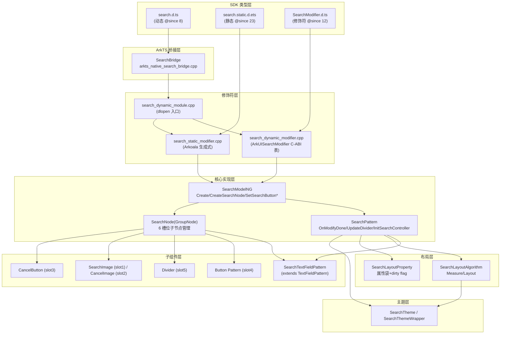
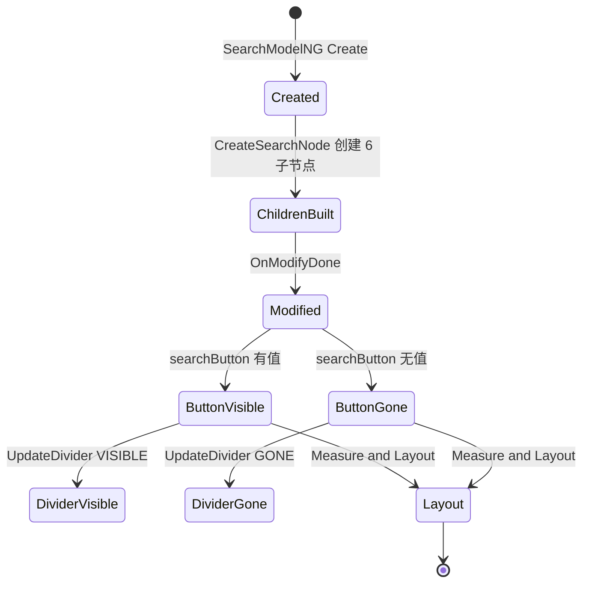

# 架构设计
> 确认目标仓和模块的架构约束、关键设计决策、Spec 拆分方向。

## 设计元数据

| Field | Content |
|-------|---------|
| Design ID | DESIGN-Func-05-09-03 |
| 关联需求 | 已有能力补录（无独立 requirement.md） |
| 关联 Epic | 无 |
| 目标 Feature | Feat-01..Feat-06（已 Baselined）；Feat-07 事件回调与控制器（当前，全部完成） |
| 复杂度 | 复杂 |
| 目标版本 | API 8 起，当前至 API 26 |
| Owner | ArkUI SIG |
| 状态 | Baselined（已有实现补录） |

## 需求基线

> 需求基线详见 proposal.md。以下仅列出设计阶段需要额外强调的要点。

| 项 | 补充说明 |
|----|----------|
| 已有实现补录 | Search 组件自 API 8 起持续演进至 API 26，本设计为存量实现反向规格化，不引入行为变更 |
| 多范式接入 | 同时存在动态 API（.d.ts @since 8）、静态 API（.static.d.ets @since 23）、C-API 修饰符（ArkUISearchModifier）、Cangjie FFI，规格需覆盖全部设置形态 |
| 组合组件 | Search 是 GroupNode 组合节点，内含 TextField/Button/Cancel/Image/Divider 六类子节点，架构约束子节点生命周期与可见性联动 |

## 上下文和现状

### 涉及仓和模块

| 仓库 | 补充架构说明 |
|------|-------------|
| arkui/ace_engine | Search 组件全部实现位于此仓；Pattern/Model/Node/Layout/Bridge/Modifier 均在此仓内 |
| interface/sdk-js | 公共 SDK 类型定义：`api/@internal/component/ets/search.d.ts`、`api/arkui/component/search.static.d.ets`、`api/arkui/SearchModifier.d.ts` |

### 调用链层级分析

> 从最上层到最底层逐层扫描调用链路。遗漏层意味着设计深度不足，实现阶段可能被迫返工。

| 层 | 模块 | 职责 | 修改类型 |
|----|------|------|----------|
| SDK 类型层 | `interface/sdk-js/api/@internal/component/ets/search.d.ts` | 动态 ArkTS 公共 API 契约（SearchInterface/SearchOptions/SearchAttribute/SearchController） | 不修改（补录） |
| SDK 静态类型层 | `interface/sdk-js/api/arkui/component/search.static.d.ets` | 静态 ArkTS 公共 API 契约（@since 23） | 不修改（补录） |
| SDK 修饰符层 | `interface/sdk-js/api/arkui/SearchModifier.d.ts` | SearchModifier 动态属性修饰符契约（@since 12） | 不修改（补录） |
| ArkTS 桥接层 | `frameworks/core/components_ng/pattern/search/bridge/arkts_native_search_bridge.cpp` | SearchBridge：JsCreate/SetSearchInitialize/SetSearchButton 等 ArkTS↔native 调用信息处理 | 不修改（补录） |
| 动态修饰符层 | `frameworks/core/components_ng/pattern/search/bridge/search_dynamic_modifier.cpp` | C-ABI 函数指针表 ArkUISearchModifier/CJUISearchModifier/ArkUISearchCustomModifier | 不修改（补录） |
| 静态修饰符层 | `frameworks/core/components_ng/pattern/search/bridge/search_static_modifier.cpp` | Arkoala 生成式 API（ConstructImpl/SetSearchOptionsImpl/SetSearchButtonImpl） | 不修改（补录） |
| 动态模块层 | `frameworks/core/components_ng/pattern/search/bridge/search_dynamic_module.cpp` | dlopen 入口 OHOS_ACE_DynamicModule_Create_Search，装配 RegisterAttributes/GetStaticModifier/GetDynamicModifier | 不修改（补录） |
| Model 层 | `frameworks/core/components_ng/pattern/search/search_model_ng.cpp`/`.h`、`search_model_static.cpp`/`.h` | SearchModelNG::Create/CreateSearchNode/CreateButton/CreateDivider/SetSearchButton* | 不修改（补录） |
| Pattern 层 | `frameworks/core/components_ng/pattern/search/search_pattern.cpp`/`.h` | SearchPattern：OnModifyDone/UpdateDivider/UpdateCancelButton/InitSearchController/InitAllEvent | 不修改（补录） |
| Node 层 | `frameworks/core/components_ng/pattern/search/search_node.cpp`/`.h` | SearchNode(GroupNode)：六槽位子节点管理、lazy id 分配、IconOptions | 不修改（补录） |
| 子组件层 | `search_text_field.cpp`/`.h`、`search_event_hub.cpp`/`.h`、`search_gesture_event_hub.cpp`/`.h` | SearchTextFieldPattern(extends TextFieldPattern)、SearchEventHub、SearchGestureEventHub | 不修改（补录） |
| 布局层 | `frameworks/core/components_ng/pattern/search/search_layout_algorithm.cpp`/`.h`、`search_layout_property.h` | SearchLayoutAlgorithm(Measure/Layout)、SearchLayoutProperty(属性袋+dirty flag) | 不修改（补录） |
| 主题层 | `frameworks/core/components/search/search_theme.h`、`search_theme_wrapper.h` | SearchTheme/SearchThemeWrapper（颜色/尺寸/间距默认值） | 不修改（补录） |
| C-API 节点层 | `frameworks/core/interfaces/native/node/search_modifier.h`、`implementation/search_modifier.cpp` | NodeModifier::GetSearchModifier/GetCJUISearchModifier/GetSearchCustomModifier + 独立事件 setter | 不修改（补录） |

检查项：
- [x] 调用链每一层都已覆盖（从最上层到最底层）
- [x] 每层职责边界清晰，无跨层违规调用
- [x] 每层修改类型明确（均为补录，不修改）

### 适用架构规则

| Rule ID | 适用原因 | 设计结论 | 验证方式 |
|---------|----------|----------|----------|
| OH-ARCH-LAYERING | 涉及 SDK→Bridge→Modifier→Model→Pattern→Node→Layout 多层调用 | 调用方向自上而下单向，下层不反向引用上层；Model 层为唯一写入点 | 架构评审/依赖检查 |
| OH-ARCH-SUBSYSTEM | 涉及 ace_engine 与 interface/sdk-js 跨仓 | ace_engine 实现，sdk-js 契约；实现不得偏离 SDK 契约 | 代码评审/XTS |
| OH-ARCH-API-LEVEL | 涉及 Public API（动态 @since 8 / 静态 @since 23 / Modifier @since 12） | 全部 Public，SysCap SystemCapability.ArkUI.ArkUI.Full，Kit ArkUI | API 评审/XTS |
| OH-ARCH-COMPONENT-BUILD | 涉及 BUILD.gn 动态模块编译 | search_dynamic_module 通过 OHOS_ACE_DynamicModule_Create 宏注册，无新增 BUILD 目标 | 构建验证 |
| OH-ARCH-ERROR-LOG | 不涉及错误码/日志 | N/A | N/A |

## 不涉及项承接

| 维度 | 设计结论 |
|------|----------|
| 数据持久化 | Search 为无状态组件，不涉及持久化存储 |
| IPC/SA 跨进程 | 不涉及跨进程通信，全部进程内调用 |
| 权限申请 | 仅 enableHapticFeedback 需 ohos.permission.VIBRATE（Feat-05 范围），本设计基线不涉及 |
| 安全/隐私 | enableSelectedDataDetector 涉及实体识别（Feat-06 范围），基线不涉及 |

## 关键设计决策

| 决策 ID | 问题 | 推荐方案 | 探索过的替代方案 | 取舍理由 | 影响 |
|---------|------|----------|------------------|----------|------|
| ADR-1 | Search 节点结构如何组织？ | 采用 GroupNode 组合模式，固定 6 槽位子节点：TextField(0)/SearchImage(1)/CancelImage(2)/CancelButton(3)/Button(4)/Divider(5) | 方案 B：单 FrameNode 直接绘制文本+图标（无子节点） | 组合模式可复用 TextField/Button 现成 Pattern 与布局算法，避免重写文本编辑/输入法/手势逻辑；6 槽位固定索引使布局算法可按索引直接取子节点 | SearchNode/CreateSearchNode/CreateButton/CreateDivider 全部基于固定索引；SearchLayoutAlgorithm.Measure/Layout 按固定顺序测量与定位 |
| ADR-2 | 分割线与搜索按钮的可见性关系？ | 分割线可见性严格绑定搜索按钮：`searchButton.has_value()` 同时决定 Button(slot4) 与 Divider(slot5) 的 VISIBLE/GONE | 方案 B：分割线独立可见性属性 | 实现中分割线语义即为"搜索按钮与文本框的分隔"，无按钮则无分隔需求；独立属性会引入无意义状态（有分割线无按钮） | OnModifyDone 中 UpdateDivider 与 Button visibility 共用同一谓词；layout_algorithm 的 DividerMeasure/Layout 受此约束 |
| ADR-3 | SearchController 如何获取？ | Controller 不作为 Create 参数，而是从子节点 TextFieldPattern 的 TextFieldController 取出后向上回传 | 方案 B：Create 时由调用方传入 Controller | Controller 的实际操作（caretPosition/stopEditing/setTextSelection）全部委托给子 TextField 执行，从子节点取出保证 Controller 与实际文本节点一一绑定；若由调用方传入则需额外维护映射 | CreateSearchNode 末尾 SetSearchController；InitSearchController 将 searchController_ 委托至 Handle* 方法；JS 侧 JSTextEditableController 在 JsCreate/SetSearchInitialize 后绑定 |
| ADR-4 | 搜索按钮的启用/禁用语义？ | 按钮创建即 disabled（默认文本 "Search"）；SetSearchButton(非空) 启用；autoDisable 控制输入为空时是否再禁用 | 方案 B：按钮始终启用，autoDisable 由业务层处理 | 框架层管理 enabled 状态可与 opacity(0.0)/GONE 联动，避免业务层遗漏；autoDisable 作为框架属性可参与布局（影响文本框宽度计算） | SetSearchButton 设置 enabled+opacity；layout_algorithm CalculateTextFieldWidth 仅在 IsEnabled() \|\| autoDisable 时扣减按钮宽度 |
| ADR-F2-1 | 搜索/取消图标如何选择 Symbol 与 Image 类型？ | 按 API≥12 + src 为空 + IsNeedSymbol() 三条件分派：满足走 Symbol(SYMBOL_ETS_TAG/TextPattern)，否则走 Image(IMAGE_ETS_TAG/ImagePattern) | 方案 B：始终用 Image；方案 C：由用户显式指定类型 | 框架自动选择可在无自定义 src 时优先使用更高质量的符号字体图标，同时保留旧 API 兼容；三条件决定避免在 API<12 或非符号环境强制 Symbol | CreateSearchIcon(:2518)/CreateCancelIcon(:2555) 分派逻辑 |
| ADR-F2-2 | CancelButtonStyle 三枚举的可见性语义如何实现？ | IsEventEnabled 判定：CONSTANT 恒 true、INVISIBLE 恒 false、INPUT 仅文本非空 true；隐藏时用 INVISIBLE（非 GONE）保留槽位空间 | 方案 B：INVISIBLE 用 GONE 折叠 | INVISIBLE 语义为"不可见但占位"，GONE 会折叠槽位导致布局抖动；保留空间使 CONSTANT/INPUT 切换无跳动 | search_pattern.cpp:225-229 IsEventEnabled；:174 INVISIBLE |
| ADR-F2-3 | 用户设置的图标颜色在深色模式切换时是否覆盖？ | 不覆盖：SearchIconColorSetByUser/CancelIconColorSetByUser 标志门控，用户设色后深色模式更新被跳过 | 方案 B：始终覆盖为主题色 | 用户显式设色表示意图，覆盖会破坏用户定制；但需记录标志以区分用户色与主题色 | search_pattern.cpp:2271/:2308 *ColorSetByUser 守卫；Symbol 用 TextColorFlagByUser(:2261/:2298) |
| ADR-F2-4 | Image 图标颜色更新是否对所有图片源生效？ | 仅对 SVG 源生效（imageSourceInfo.IsSvg() 守卫），非 SVG 光栅图不重染 | 方案 B：对所有源重染 | 光栅图（PNG/JPG）无矢量信息，无法在运行时重新着色；SVG 有 fillColor 可动态更新 | search_pattern.cpp:2273-2278/:2309-2314 IsSvg 守卫 |
| ADR-F2-5 | 取消按钮与取消图标为何分离为两个子节点？ | 取消按钮(slot3)为透明 CIRCLE Button（点击热区），取消图标(slot2)独立居中于按钮内；分离使热区大于图标、支持独立 visibility/opacity | 方案 B：图标即按钮（点击热区=图标尺寸） | 热区需大于图标以保证可点击性；分离后 button 可独立管理 enabled/visibility，icon 独立管理着色 | search_model_ng.cpp:1265 CreateCancelButton(BUTTON_ETS_TAG/CIRCLE/透明)；layout_algorithm.cpp:946 图标居中于按钮 |
| ADR-F2-6 | 取消按钮点击的完整行为是什么？ | 同时清空文本(ClearTextContent) + 重新聚焦文本框(RequestFocusImmediately)，而非仅清空 | 方案 B：仅清空不聚焦 | 清空后文本框为空，用户需继续输入，自动重新聚焦避免用户额外点击；同时触发无障碍 REQUEST_FOCUS 事件 | search_pattern.cpp:857-892 OnClickCancelButton |
| ADR-F3-1 | 17 个排版属性存储于何处？ | 15 个存于子 TextFieldLayoutProperty/PaintProperty（非 SearchLayoutProperty）；仅 fontFeature 存于 SearchLayoutProperty(MEASURE)；dividerColor 分裂存储（标志在 Search + 颜色在子 Divider） | 方案 B：全部存于 SearchLayoutProperty | 排版属性本质是子文本框的渲染属性，存于子节点使 Search 仅管理组合层逻辑；fontFeature 需参与 Search 级 MEASURE 故存于 Search；dividerColor 是子 Divider 节点属性故分裂 | search_layout_property.h:92-105 仅 FontFeature:98 + DividerColorSetByUser:103 在 Search；search_model_ng.cpp 各 setter 写入子 TextFieldLayoutProperty |
| ADR-F4-1 | 8 个自适应/描边/着色器属性存储于何处？ | 仅 strokeWidth/strokeColor 存于 SearchLayoutProperty(MEASURE)；其余 6 个（minFontSize/maxFontSize/minFontScale/maxFontScale/strokeJoinStyle/shaderStyle）存于子 TextFieldLayoutProperty | 同 ADR-F3-1 原理 | 描边宽/色需参与 Search 级 MEASURE 故存于 Search；自适应字号/缩放/连接样式/着色器是子文本框渲染属性 | search_layout_property.h:100-101 StrokeWidth/StrokeColor；search_model_ng.cpp:1938/1966/2768/2797 写入子 TextField |
| ADR-F4-2 | strokeColor 未设时如何处理？ | UpdateFontFeature 同步时回退到 text color（`search_layout_algorithm.cpp:261`），若 text color 也无则 Reset | 方案 B：使用固定默认色 | 描边色与文本色语义关联，回退 text color 保证视觉一致 | search_layout_algorithm.cpp:254-265 UpdateFontFeature |
| ADR-F4-3 | fontScale 的钳制范围？ | minFontScale 钳制到 [0,1]（`search_model_static.cpp:447`）；maxFontScale 下限 1.0 上限 2.0（MAX_FONT_SCALE，`search_model_ng.cpp:1986`） | 方案 B：不钳制 | 钳制防止极端缩放导致 UI 破裂；上限 2.0 与适老化策略一致 | search_model_ng.cpp:53/1986；search_model_static.cpp:447/456/48 |
| ADR-F4-4 | minFontSize/maxFontSize 是否可单独使用？ | 不可，须配对使用；单独设置不生效；≤0 或 max<min 时自适应不生效 | 方案 B：可单独设 min 或 max | 自适应需要明确范围上下界，缺一无法计算缩放区间 | search.d.ts:993/998/1021 |
| ADR-F5-1 | 11 个键盘/输入 API 存储于何处？ | 全部委托子 TextField：4 个存于 TextFieldLayoutProperty（InputFilter/TextInputType+TypeChanged/MaxLength/StopBackPress），7 个存于 TextFieldPattern 运行时；零个存于 SearchLayoutProperty | 同 ADR-F3-1 原理 | 键盘/输入行为本质是子文本框的能力，Search 仅做组合层转发 | search_model_ng.cpp 各 setter 经 GetChildren().front()；search_layout_property.h:92-105 无键盘属性 |
| ADR-F5-2 | SearchType 枚举值如何映射到内部 TextInputType？ | CastToTextInputType 对 URL(13)→URL(6)、ONE_TIME_CODE(14)→OTC(13) 做特殊重映射；其余 pass-through | 方案 B：直接透传 | IME 侧期望 ONE_TIME_CODE=13，但 SDK 暴露 OTC=14；URL 在内部 TextInputType 枚举中为 6 而非 13 | text_input_type.cpp:25-29 CastToTextInputType |
| ADR-F5-3 | enableHapticFeedback 如何触发振动？ | 子 TextFieldPattern.isEnableHapticFeedback_ 门控 VibratorUtils::StartVibraFeedback→Sensors::StartVibrator；需 ohos.permission.VIBRATE | 方案 B：框架直接振动 | 权限归属应用层，框架仅提供开关；未声明权限时振动 IPC 无效果 | vibrator_utils.cpp:76-83；text_field_pattern.cpp:2944/4982 |
| ADR-F5-4 | stopBackPress 如何控制返回键传播？ | OnBackPressed 返回 IsStopBackPress()：true（默认）消费 back 关闭键盘不导航；false 传播给页面导航 | 方案 B：始终消费 | 返回值 bool 语义：true=消费 false=传播，使应用可控制键盘关闭后是否导航 | text_field_pattern.cpp:8418/8436 OnBackPressed |
| ADR-F5-5 | enterKeyType=UNSPECIFIED 如何处理？ | 静默重映射为 SEARCH（默认值） | 方案 B：报错 | UNSPECIFIED 语义为"未指定"，Search 组件默认回车键为搜索，重映射合理 | search_model_ng.cpp:1384-1386 |
| ADR-F5-6 | inputFilter 与 type 过滤的关系？ | inputFilter 设后 type 的内置过滤不生效（互斥） | 方案 B：两者叠加 | 正则过滤与类型过滤语义重叠，叠加会导致预期不明；inputFilter 优先级更高 | search.d.ts:672 |
| ADR-F6-1 | 8 个选择/光标/菜单 API 存储于何处？ | 全部委托子 TextField（TextFieldLayoutProperty/PaintProperty/Pattern），零个存于 SearchLayoutProperty；CaretUDWidth 声明于 SearchLayoutProperty 但 caretStyle setter 不写入 | 同 ADR-F5-1 原理 | 选择/光标/菜单行为本质是子文本框的能力 | search_model_ng.cpp 各 setter 经 GetChildren().front()；search_layout_property.h:96 CaretUDWidth 未被写入 |
| ADR-F6-2 | selectionMenuOptions 如何存储？ | 3 回调存于 TextFieldPattern 运行时（OnSelectionMenuOptionsUpdate），非 layout property；C-API 分 3 个 *CallbackUpdate 方法 | 方案 B：存为属性 | 回调是运行时行为，非持久属性；C-API 按回调拆分便于独立清除 | search_model_ng.cpp:894/903；search_dynamic_modifier.cpp:1463/1470/1477 |
| ADR-F6-3 | enableSelectedDataDetector 的前置条件？ | 仅 CopyOptions=LocalDevice/CrossDevice 时生效；None 时不生效 | 方案 B：无条件生效 | 实体识别依赖复制能力，None 禁用复制时识别无意义 | search.d.ts:627-628 |
| ADR-F7-1 | 17 事件存储于何处？ | 仅 onSubmit(@since 14) 存于 SearchEventHub；其余 15 个委托子 TextFieldEventHub；onChange 额外包装调用 UpdateChangeEvent | 方案 B：全部存于 SearchEventHub | 大部分文本事件本质是子文本框能力；onSubmit 是 Search 特有提交行为故存于 Search | search_event_hub.h:140 onSubmit_；search_model_ng.cpp 各 SetOn* 经 GetChildren().front() |
| ADR-F7-2 | onSubmit 双重载如何处理？ | @since 8 Callback<string> 在 NG 管线下 no-op 空实现；仅 @since 14 SearchSubmitCallback 生效，携带 SubmitEvent.keepEditableState() 否决 | 方案 B：两重载都生效 | @since 8 重载是遗留 API，NG 管线下被废弃；@since 14 引入 SubmitEvent 提供编辑态控制 | search_model_ng.h:68 no-op `:69` 生效；search_pattern.cpp:847 IsKeepEditable |
| ADR-F7-3 | 文本变更事件链顺序与否决？ | onWillInsert→onWillDelete→onWillChange→(apply)→onDidInsert→onDidDelete；onWill* 返回 bool false 否决，onDid* 通知 | 方案 B：单一 onChange | 细粒度事件链支持分阶段否决与通知；onWillChange 是聚合门控 | text_field_event_hub.h:393/423/443/462/482 |
| ADR-F7-4 | SearchController 如何实现？ | 薄代理子 TextFieldController：InitSearchController 委托 6 入口至 Handle* 方法转发子 TextFieldPattern；setTextSelection 直接继承；无独立状态 | 方案 B：Controller 自持状态 | Controller 操作本质是子文本框操作，代理避免状态同步问题 | search_pattern.cpp:713-752 InitSearchController；text_field_controller.h:45 SetTextSelection 继承 |

## 设计骨架

### 骨架范围

| 骨架项 | 目标 | 不包含 | 验证方式 |
|--------|------|--------|----------|
| 六槽位组合结构 | 文档化 SearchNode 的 6 个子节点槽位、创建顺序、lazy id 分配 | 子节点内部实现细节（TextField 的输入法逻辑等） | 架构评审/源码检查 |
| 搜索按钮可见性联动 | 文档化 searchButton 属性对 Button+Divider 的可见性驱动 | 取消按钮可见性（Feat-02） | 源码检查 |
| Controller 绑定路径 | 文档化 Controller 从子节点取出并向上回传的机制 | Controller 具体方法行为（Feat-07） | 源码检查 |
| searchButton 属性袋与 dirty flag | 文档化 SearchLayoutProperty.SearchButton 的 PROPERTY_UPDATE_MEASURE 标记 | 其他属性（Feat-03/04/05） | 源码检查 |

### 骨架 Spec 拆分

| Task ID | 目标 | 受影响文件 | AC |
|---------|------|-----------|-----|
| TASK-SKELETON-1 | 建立 design.md 基线，覆盖 Feat-01 组件构建与搜索按钮 | design.md, Feat-01-search-construction-and-button-spec.md | AC-1.1..AC-1.10 |

## 后续 Task 拆分

| Task ID | 目标 | 受影响文件 | 依赖 |
|---------|------|-----------|------|
| TASK-01 | Feat-01 组件构建与搜索按钮规格 | Feat-01-search-construction-and-button-spec.md | 基线 |
| TASK-02 | Feat-02 搜索图标与取消按钮 | Feat-02-search-icon-and-cancel-button-spec.md | TASK-01 |
| TASK-03 | Feat-03 文本与占位排版 | Feat-03-text-and-placeholder-typography-spec.md | TASK-01 |
| TASK-04 | Feat-04 自适应字号与文本描边着色 | Feat-04-adaptive-font-and-stroke-shader-spec.md | TASK-03 |
| TASK-05 | Feat-05 键盘与输入控制 | Feat-05-keyboard-and-input-control-spec.md | TASK-01 |
| TASK-06 | Feat-06 选择、光标与菜单 | Feat-06-selection-caret-and-menu-spec.md | TASK-01 |
| TASK-07 | Feat-07 事件回调与控制器 | Feat-07-events-and-controller-spec.md | TASK-01 |

## API 签名、Kit 与权限

### 新增 API

> 补录已有 API，非新增。以下为 Search 域涉及的全部 Public API 签名摘要。

| API 签名 | 类型 | Kit | d.ts 位置 | 权限要求 | SysCap |
|----------|------|-----|----------|----------|--------|
| `Search(options?: SearchOptions): SearchAttribute` | Public | ArkUI | `@internal/component/ets/search.d.ts` | 无 | SystemCapability.ArkUI.ArkUI.Full |
| `interface SearchOptions { value?/placeholder?/icon?/controller? }` | Public | ArkUI | 同上 | 无 | 同上 |
| `class SearchController extends TextContentControllerBase` | Public | ArkUI | 同上 | 无 | 同上 |
| `searchButton(value: ResourceStr, option?: SearchButtonOptions): SearchAttribute` | Public | ArkUI | 同上 | 无 | 同上 |
| `interface SearchButtonOptions { fontSize?/fontColor?/autoDisable? }` | Public | ArkUI | 同上 | 无 | 同上 |
| `class SearchModifier extends SearchAttribute implements AttributeModifier<SearchAttribute>` | Public | ArkUI | `arkui/SearchModifier.d.ts` | 无 | 同上 |
| 静态 API（@since 23）同上述签名 | Public | ArkUI | `arkui/component/search.static.d.ets` | 无 | 同上 |
| `searchIcon(value: IconOptions \| SymbolGlyphModifier)` | Public | ArkUI | `@internal/component/ets/search.d.ts` | 无 | 同上（IconOptions @since 10；SymbolGlyphModifier @since 12） |
| `cancelButton(value: CancelButtonOptions \| CancelButtonSymbolOptions)` | Public | ArkUI | 同上 | 无 | 同上（CancelButtonOptions @since 10；CancelButtonSymbolOptions @since 12） |
| `enum CancelButtonStyle { CONSTANT, INVISIBLE, INPUT }` | Public | ArkUI | 同上 | 无 | 同上（@since 10） |
| `interface IconOptions { size?/color?/src? }` | Public | ArkUI | 同上 | 无 | 同上（@since 10） |
| `interface CancelButtonOptions { style?/icon? }` | Public | ArkUI | 同上 | 无 | 同上（@since 10） |
| `textFont`/`placeholderFont`/`placeholderColor`/`fontColor`/`textAlign`/`letterSpacing`/`lineHeight`/`halfLeading`/`textIndent`/`fontFeature`/`decoration`/`dividerColor`/`includeFontPadding`/`fallbackLineSpacing`/`textDirection`/`compressLeadingPunctuation`/`enableAutoSpacing` | Public | ArkUI | `@internal/component/ets/search.d.ts` | 无 | 同上（@since 8/9/10/12/18/20/23 分批引入） |
| `minFontSize`/`maxFontSize`/`minFontScale`/`maxFontScale`/`strokeWidth`/`strokeColor`/`strokeJoinStyle`/`shaderStyle` | Public | ArkUI | 同上 | 无 | 同上（@since 12/18/20/26 分批引入） |
| `enableKeyboardOnFocus`/`enterKeyType`/`type(SearchType)`/`maxLength`/`inputFilter`/`customKeyboard+KeyboardOptions`/`keyboardAppearance`/`enablePreviewText`/`autoCapitalizationMode`/`enableHapticFeedback(需VIBRATE)`/`stopBackPress` | Public | ArkUI | 同上 | VIBRATE(haptic) | 同上（@since 10/11/12/13/15/20 分批引入） |
| `copyOption`/`selectionMenuHidden`/`editMenuOptions(EditMenuOptions)`/`selectedBackgroundColor`/`selectedDragPreviewStyle`/`enableSelectedDataDetector`/`caretStyle(CaretStyle)`/`SearchController.caretPosition` | Public | ArkUI | 同上 | 无 | 同上（@since 8/9/10/12/22/23 分批引入） |
| 17 事件(onSubmit×2/onChange/onWillChange/onWillInsert/onDidInsert/onWillDelete/onDidDelete/onCopy/onWillCopy/onCut/onWillCut/onPaste/onTextSelectionChange/onContentScroll/onEditChange/onWillAttachIME) + SearchController(stopEditing/setTextSelection) | Public | ArkUI | 同上 | 无 | 同上（@since 8/10/12/14/15/20/26 分批引入） | @since 10 |

### 变更/废弃 API

无变更或废弃 API。本设计为已有实现补录。

## 构建系统影响

### BUILD.gn 变更

```text
文件路径: frameworks/core/components_ng/pattern/search/BUILD.gn
变更说明: 无新增。search 模块已纳入 components_ng 编译目标，包含 search_pattern/search_model_ng/search_node/search_layout_algorithm/search_layout_property/search_text_field/search_event_hub/search_gesture_event_hub 及 bridge 子目录。
```

### bundle.json 变更

无新增 component 或依赖关系修改。Search 组件属于 arkui ace_engine 部件。

## 可选设计扩展

### 架构图



### 数据模型设计

**SDK 层类型（search.d.ts 摘要）**

```typescript
interface SearchOptions {
  value?: ResourceStr;        // @since 8; ResourceStr @since 20
  placeholder?: ResourceStr;  // @since 8; ResourceStr @since 10
  icon?: string;              // @since 8
  controller?: SearchController; // @since 8
}
interface SearchButtonOptions {
  fontSize?: Length;           // @since 10
  fontColor?: ResourceColor;  // @since 10
  autoDisable?: Boolean;      // @since 18, default false
}
```

**C++ 框架层结构**

| 结构 | 文件:行 | 字段 |
|------|---------|------|
| `IconOptions` | `search_node.h:25-133` | `color_`/`size_`/`src_`/`bundleName_`/`moduleName_`（均 `std::optional`） |
| `SearchNode` | `search_node.h:135+` | `textFieldId_`/`buttonId_`/`cancelButtonId_`/`dividerId_`（lazy `optional<int32_t>`）、`searchIconNodeCreated_`/`cancelIconNodeCreated_`（bool）、`searchImageIconOptions_`/`cancelImageIconOptions_`（IconOptions） |
| `SearchLayoutProperty` | `search_layout_property.h:27+` | `SearchButton`(MEASURE)/`CancelButtonStyle`(MEASURE)/`SearchButtonFontSize`(MEASURE)/`BackgroundColor`(RENDER)/`StrokeWidth`(MEASURE) 等 + `SearchIconColorSetByUser`/`CancelIconColorSetByUser`/`DividerColorSetByUser` 标志 |
| `ArkUISearchButtonOptionsStruct` | `search_dynamic_modifier.cpp` | `value`/`sizeValue`/`sizeUnit`/`autoDisable`（C-ABI 打包结构） |

**存储方案**：Search 为无状态组合组件，属性存于 `SearchLayoutProperty`（MEASURE/RENDER/NORMAL dirty flag 驱动重布局/重绘），子节点状态存于各自 Pattern（TextField/Button/Divider）。无持久化。

### 算法与状态机



## 详细设计

### 组件构建与搜索按钮（Feat-01）

#### 构建流程

`SearchModelNG::Create(value, placeholder, icon)`（`search_model_ng.cpp:97-111`）是构建入口：
1. `ViewStackProcessor::ClaimNodeId()` 申请节点 id
2. `CreateSearchNode(nodeId, value, placeholder, icon)`（`search_model_ng.cpp:148-199`）：
   - `GetOrCreateSearchNode("Search", nodeId, SearchPattern)` 创建 `SearchNode`（GroupNode）
   - `CreateTextField(frameNode, placeholder, value, ...)`（slot 0）—— value 流入 `pattern->InitValueText(value)`（`:1091`），placeholder 流入 `UpdatePlaceholder`（`:1095`）
   - `pattern->CreateSearchIcon(src)`（slot 1）—— icon 流入此路径
   - `pattern->CreateCancelIcon()`（slot 2）
   - `CreateCancelButton(frameNode, ...)`（slot 3）
   - `CreateButton(frameNode, ...)`（slot 4）—— 默认文本 `u"Search"`、默认 disabled
   - `CreateDivider(frameNode, ...)`（slot 5）—— 颜色取 `searchTheme->GetSearchDividerColor()`
   - `pattern->SetSearchController(textFieldPattern->GetTextFieldController())`（`:195`）—— 从子节点 TextField 取出 Controller
3. API ≥ 26 时 `SetNeedCallChildrenUpdate(false)`（`:108`）

#### searchButton 属性写入与可见性联动

`SearchModelNG::SetSearchButton(text)`（`search_model_ng.cpp:247-274` 实例版 / `:1560-1586` 静态版）：
- 非空 text：`SetEnabled(true)` + `UpdateOpacity(1.0)` + `ACE_UPDATE_LAYOUT_PROPERTY(SearchButton, text)`
- 空 text：`SetEnabled(false)` + `UpdateOpacity(0.0)` + API≥18 时 `ACE_RESET_LAYOUT_PROPERTY(SearchButton)`
- `MarkModifyDone()` + `MarkDirtyNode(PROPERTY_UPDATE_MEASURE)`

`SearchPattern::OnModifyDone()`（`search_pattern.cpp:308-344`）：
- `layoutProperty->GetSearchButton()`（`:320`）→ 缓存到 `searchButton_`
- Button(slot4) visibility = `searchButton.has_value() ? VISIBLE : GONE`（`:330`）
- `updateLabelToLayoutProp(buttonHandle, searchButton_)` + `TextOverflow::ELLIPSIS`（`:334-335`）
- `UpdateDivider()`（`:342` → `:379-392`）：Divider(slot5) visibility = 同一谓词

#### searchButtonOptions 子属性分发

C-API `SetSearchSearchButton`（`search_dynamic_modifier.cpp:587-623`）打包 `ArkUISearchButtonOptionsStruct`，内部分发至：
- `SearchModelNG::SetSearchButton(frameNode, value->value, isJsView)`（`:593`）
- `SearchModelNG::SetSearchButtonFontSize(frameNode, CalcDimension(...))`（`:594-595`）→ 写入 `SearchLayoutProperty.SearchButtonFontSize`（MEASURE）+ button modifier `updateFontSizeToLayoutProp`
- `SearchModelNG::SetSearchButtonFontColor(frameNode, *colorPtr, isThemeColor)`（`:596`）→ button modifier `updateFontColorToLayoutProp` + `updateFontColorFlagByUserToLayoutProp(true)` + `pattern->SetIsSearchButtonUsingThemeColor(isTheme)`
- `SearchModelNG::SetSearchButtonAutoDisable(frameNode, value->autoDisable)`（`:597`）→ button modifier `updateAutoDisableToLayoutProp`

Arkoala 静态路径 `SetSearchButtonImpl`（`search_static_modifier.cpp:856-868`）经 `SearchModelStatic::SetSearchButtonFontSize/FontColor/AutoDisable`（`search_model_static.cpp:173-225`）做 optional 解包 + 主题默认值后转发至 `SearchModelNG`。

#### 布局算法

`SearchLayoutAlgorithm::Measure`（`search_layout_algorithm.cpp:622-647`）顺序：缓存 `searchHeight_`/font scale → SearchButtonMeasure → DividerMeasure → ImageMeasure → CancelImageMeasure → CancelButtonMeasure → TextFieldMeasure → SelfMeasure。

`SearchButtonMeasure`（`:351-398`）：按钮宽度上限 `searchWidthMax * MAX_SEARCH_BUTTON_RATE`（`:392`），取实际测量与上限较小值。

`CalculateTextFieldWidth`（`:195-240`）：仅在 `searchButtonEvent->IsEnabled() || needToDisable` 时从文本框宽度扣减 `buttonWidth + dividerWidth + 2*dividerSideSpace`（`:224-227`）。

`Layout`（`:713-757`）顺序：LayoutSearchIcon → LayoutSearchButton → LayoutDivider → LayoutCancelButton → LayoutCancelImage → LayoutTextField → CalcChildrenHotZone。

#### Controller 绑定

`InitSearchController`（`search_pattern.cpp:713-752`）将 `searchController_` 的 `SetCaretPosition/SetGetTextContentRect/SetGetTextContentLinesNum/SetGetCaretIndex/SetGetCaretPosition/SetStopEditing` 委托至 `SearchPattern::Handle*` 方法，后者转发至子 `TextFieldPattern`。JS 侧 `JSTextEditableController` 在 `JsCreate`（`arkts_native_search_bridge.cpp:516-517`）与 `SetSearchInitialize`（`:436-437`）后绑定。

### 搜索图标与取消按钮（Feat-02）

#### 图标 Symbol/Image 分派

`CreateSearchIcon(src)`（`search_pattern.cpp:2511-2526`）与 `CreateCancelIcon()`（`:2548-2563`）按三条件分派：
- API ≥ 12（`GreatOrEqualTargetAPIVersion(VERSION_TWELVE)`）**且** src 为空 **且** `SystemProperties::IsNeedSymbol()` → Symbol 路径：`CreateOrUpdateSymbol(index)`（`:2579-2632`），创建 `SYMBOL_ETS_TAG`/`TextPattern` 节点，使用 `searchTheme->GetSearchSymbolId()`/`GetCancelSymbolId()`
- 否则 → Image 路径：`CreateOrUpdateImage(index)`（`:2634-2664`），创建 `IMAGE_ETS_TAG`/`ImagePattern` 节点，src 空时回退 `InternalResource::SEARCH_SVG`（`:2941-2947`）

`HasSearchIconNodeCreated`/`HasCancelIconNodeCreated` 守卫保证幂等：已创建则仅刷新颜色（`UpdateSearchSymbolIconColor`），不重建节点。Symbol/Image 互斥切换时用 `ReplaceChild`（`:2625`）。

#### SymbolGlyphModifier 回调机制

`SymbolGlyphModifier.symbolApply`（`std::function<void(WeakPtr<FrameNode>)>`）存储为 `SearchLayoutProperty.searchIconSymbol_`/`cancelIconSymbol_` lambda（`search_layout_property.h:108-109, 77-90`），不参与 Clone/Reset。Symbol 节点创建后经 `UpdateSymbolLayoutProperty`（`search_pattern.cpp:3008-3037`）调用 `iconSymbol(weakFrameNode)` 应用修饰符。

#### CancelButtonStyle 可见性语义

`IsEventEnabled(textValue, style)`（`search_pattern.cpp:225-229`）：
- `CONSTANT` → 恒 true（始终可见）
- `INVISIBLE` → 恒 false（始终隐藏）
- `INPUT` → `!textValue.empty()`（文本非空可见）

`UpdateCancelButtonStatus`（`:145-182`）：可见时 opacity=1.0+VISIBLE+enabled=true；隐藏时 opacity=0.0+**INVISIBLE**（非 GONE，保留槽位空间）+disabled=false。设置 style 立即调 `UpdateChangeEvent` 重评估（`:116-143`）。

#### 用户设色保护与深色模式更新

`OnIconColorConfigrationUpdate`（`search_pattern.cpp:2229-2246`）→ `OnSearchColorConfigrationUpdate`/`OnCancelColorConfigrationUpdate`：
- Symbol 分支：`TextColorFlagByUser` 守卫，用户未设色时更新 `SymbolColorList`
- Image 分支：`*ColorSetByUser` 守卫 + `HasImageSourceInfo` 守卫；仅 SVG 源（`imageSourceInfo.IsSvg()`）更新 fillColor + SvgFillColor

#### 取消按钮+图标分离布局

`CreateCancelButton`（`search_model_ng.cpp:1265-1312`）：创建 `BUTTON_ETS_TAG`/CIRCLE/透明背景/默认 disabled。取消图标(slot2)经 `CreateCancelIcon` 创建。`LayoutCancelButton`（`search_layout_algorithm.cpp:873-926`）读 autoDisable 相对搜索按钮定位；`LayoutCancelImage`（`:928-951`）将图标居中于按钮内：`cancelImageHorizontalOffset = cancelButtonHorizontalOffset + (buttonWidth - imageWidth) / 2`。

#### 取消按钮点击行为

`OnClickCancelButton`（`search_pattern.cpp:857-892`）：拖拽守卫（`IsDragging`/`IsHandleDragging`）→ `ClearTextContent()` 清空 → `RequestFocusImmediately()` 重新聚焦 → `HandleFocusEvent` → 无障碍 `REQUEST_FOCUS_FOR_ACCESSIBILITY_NOT_INTERRUPT` 事件。

### 文本与占位排版（Feat-03）

#### 排版属性存储架构

17 个排版属性中 15 个存于子 `TextFieldLayoutProperty`/`TextFieldPaintProperty`（`search_model_ng.cpp` 各 setter 经 `frameNode->GetChildren().front()` 获取子文本框后写入）。仅以下例外存于 `SearchLayoutProperty`（`search_layout_property.h:92-105`）：
- `FontFeature`（`:98`, `PROPERTY_UPDATE_MEASURE`）— 唯一完整值存于 Search 自身的排版属性，因需参与 Search 级 MEASURE
- `DividerColorSetByUser`（`:103`, `PROPERTY_UPDATE_NORMAL`）— 仅 bool 标志；实际颜色存于子 Divider 节点 `DividerRenderProperty`（`search_model_ng.cpp:1912`）

#### dirty-flag 不对称

`placeholderColor`/`fontColor` 实例与 FrameNode 重载 dirty flag 不一致：
- `placeholderColor` 实例 Set 用 MEASURE（`:449`），FrameNode Set 用 RENDER（`:1711`）；实例 Reset 用 MEASURE_SELF（`:475`）
- `fontColor` 实例 Reset 用 MEASURE_SELF（`:580`），FrameNode Reset 用 RENDER（`:1662`）

#### 特殊值语义

- `letterSpacing` 百分比或 0 → 使用默认值（`search.d.ts:1125`）；负值压缩字间距
- `lineHeight` ≤0 → 行高不受限，字号自适应（`search.d.ts:1148`）
- `textAlign` JUSTIFY → 行为等同 Start（`search.d.ts:942`）

#### dividerColor 主题默认与分裂存储

`SetDividerColor`（`search_model_ng.cpp:1903-1914`）：写入子 Divider `DividerRenderProperty.DividerColor` + `SearchLayoutProperty.DividerColorSetByUser=true`。Reset 时 `SearchModelStatic`（`search_model_static.cpp:436`）读取 `SearchTheme::GetSearchDividerColor()` 恢复主题色——是唯一在静态层查主题色的排版 API。

#### textDirection 命名分裂

C-API 修饰符表暴露为 `setSearchDirection`/`resetSearchDirection`（`search_dynamic_modifier.cpp:2560-2562`），ArkTS 桥接用 `setTextDirection`（`arkts_native_search_bridge.cpp:242`）。

### 自适应字号与文本描边着色（Feat-04）

#### 存储分裂

8 属性中仅 strokeWidth/strokeColor 存于 `SearchLayoutProperty`（`:100-101`, MEASURE）；其余 6 个（AdaptMinFontSize/AdaptMaxFontSize/MinFontScale/MaxFontScale/StrokeJoinStyle/GradientShaderStyle/ColorShaderStyle）存于子 `TextFieldLayoutProperty`（`search_model_ng.cpp:1938/1952/1966/1978/2768/2797/2828`）。

#### strokeColor 回退 text color

`UpdateFontFeature`（`search_layout_algorithm.cpp:242-266`）在 `TextFieldMeasure` 时将 strokeWidth/strokeColor 从 `SearchLayoutProperty` 同步到子 `TextFieldLayoutProperty`。strokeColor 未设时回退到 text color（`:261`），若 text color 也无则 Reset（`:263`）。

#### fontScale 钳制

`MAX_FONT_SCALE = 2.0f`（`search_model_ng.cpp:53`）。minFontScale 钳制到 [0,1]（`search_model_static.cpp:447`）；maxFontScale 下限 1.0（`:456`）上限 2.0（`search_model_ng.cpp:1986`）。`CalculateMaxFontScale`/`CalculateMinFontScale`（`:54-84`）在 `Measure`（`:636-637`）缓存 `maxFontScale_`/`minFontScale_` 供 `ConvertToPxDistributeWithEnv` 使用。

#### 自适应字号配对约束

minFontSize/maxFontSize 须配对使用（`search.d.ts:993`）；≤0 或 max<min 时自适应不生效（`:998/:1021`）；自适应生效时 fontSize 被忽略（`:996`）。

#### shaderStyle 互斥与 C-API 拆分

GradientShaderStyle 与 ColorShaderStyle 互斥（设一个先 reset 另一个，`search_model_ng.cpp:2824/2836`）。C-API 拆为 5 字段：`setSearchLinearGradient`/`setSearchRadialGradient`/`resetSearchGradient`/`setSearchColorShaderColor`/`resetSearchColorShaderColor`（`search_dynamic_modifier.cpp:2586-2590`）。

### 键盘与输入控制（Feat-05）

#### 全委托子节点

11 个键盘/输入 API 全部委托子 TextField（`search_model_ng.cpp` 各 setter 经 `frameNode->GetChildren().front()`），零个存于 SearchLayoutProperty。状态位置分裂：
- 4 个存于 `TextFieldLayoutProperty`：InputFilter(MEASURE)、TextInputType+TypeChanged(MEASURE)、MaxLength(MEASURE)、StopBackPress(NORMAL)
- 7 个存于 `TextFieldPattern` 运行时：needToRequestKeyboardOnFocus_、TextInputAction、AutoCapitalizationMode、customKeyboard_+customKeyboardOption_、KeyboardAppearance、supportPreviewText_、isEnableHapticFeedback_

#### SearchType 值重映射

`CastToTextInputType`（`text_input_type.cpp:20-32`）对 URL/OTC 做特殊处理：SDK SearchType.URL(13)→内部 URL(6)，ONE_TIME_CODE(14)→内部 OTC(13)；其余 pass-through。SetType 设值时同时置 TypeChanged=true + IsFilterChanged=true 触发正则重建。

#### enableHapticFeedback 权限门控

`isEnableHapticFeedback_`（默认 true）门控 `VibratorUtils::StartVibraFeedback`（`vibrator_utils.cpp:76-83`）→ `Sensors::StartVibrator`。需 `ohos.permission.VIBRATE`。false 时 CHECK_NULL_VOID 短路。消费点：光标滑动（`text_field_pattern.cpp:2944`）和长按（`:4982`）。

#### stopBackPress 返回值语义

`OnBackPressed`（`text_field_pattern.cpp:8405-8444`）返回 `IsStopBackPress()`：true（默认）消费 back 关闭键盘不导航；false 传播给页面导航。存于 `TextFieldLayoutProperty.StopBackPress`(NORMAL)。

#### enterKeyType/inputFilter 约束

enterKeyType=UNSPECIFIED 静默重映射为 SEARCH（`search_model_ng.cpp:1384`）。inputFilter 设后 type 内置过滤不生效（互斥）。

### 选择、光标与菜单（Feat-06）

#### 全委托子节点

8 个 API 全部委托子 TextField（`search_model_ng.cpp` 各 setter 经 `GetChildren().front()`），零个存于 SearchLayoutProperty。状态位置：
- TextFieldLayoutProperty：copyOption(MEASURE)、selectionMenuHidden(MEASURE)、selectedDragPreviewStyle(MEASURE)
- TextFieldPaintProperty：selectedBackgroundColor(RENDER)、CursorWidth/CursorColor/CaretColorFlagByUser(RENDER)
- TextFieldPattern 运行时：selectionMenuOptions 3 回调、enableSelectedDataDetector 标志
- 命令式：caretPosition 经 SearchController 委托

注：`SearchLayoutProperty.CaretUDWidth`（`:96`）声明存在但 caretStyle setter 不写入此字段。

#### 菜单回调运行时存储

`selectionMenuOptions` 的 3 回调（onCreateMenu/onMenuItemClick/onPrepare）存于 `TextFieldPattern` 运行时（`OnSelectionMenuOptionsUpdate`），非 layout property。C-API 分 3 个 `*CallbackUpdate` 方法（`search_dynamic_modifier.cpp:1463/1470/1477`），传 `nullptr` 清除。

#### 数据检测器前置条件

`enableSelectedDataDetector`（默认 true，@since 22）仅 `CopyOptions=LocalDevice/CrossDevice` 时生效；None 时识别不生效（`search.d.ts:627-628`）。存于 TextFieldPattern 运行时。

#### caretStyle 拆分

`caretStyle(CaretStyle)` 单 SDK 属性经 C-API `SetSearchCaretStyle`（`search_dynamic_modifier.cpp:202`）内部分发为 `SetCaretWidth`(MEASURE) + `SetCaretColor`(RENDER)。仅设 width 时 `ResetSearchCaretColor`（`:1957`）保留宽度重置颜色。设色时 `CaretColorFlagByUser=true` 保护用户色。

### 事件回调与控制器（Feat-07）

#### 事件存储分裂

17 事件中仅 `onSubmit`(@since 14) 存于 `SearchEventHub`（`search_event_hub.h:140` onSubmit_）；其余 15 个全部委托子 `TextFieldEventHub`（`search_model_ng.cpp` 各 SetOn* 经 `GetChildren().front()`）。`onChange` 额外包装用户回调以调用 `SearchEventHub::UpdateChangeEvent` 同步 `SearchPattern::UpdateChangeEvent` + `NodeDataCache`。

#### onSubmit 双重载与 keepEditable 否决

`onSubmit` 有两重载：@since 8 `Callback<string>` 在 NG 管线下为 no-op 空实现（`search_model_ng.h:68`）；仅 @since 14 `SearchSubmitCallback` 生效，携带 `SubmitEvent.keepEditableState()`。`OnClickButtonAndImage`（`search_pattern.cpp:832-855`）构造 `TextFieldCommonEvent`，调 `FireOnSubmit`（`:845`），后检查 `IsKeepEditable()`（`:847`）：true 不退出编辑，false 调 `StopEditing()`。

#### 事件链否决

文本变更事件链：`onWillInsert`→`onWillDelete`→`onWillChange`→(apply)→`onDidInsert`→`onDidDelete`。`onWill*` 返回 bool false 否决（`text_field_event_hub.h:393/423/462`），`onDid*` 仅通知（`:443/482`）。`onWillCopy`/`onWillCut`（@since 26）同样 bool 否决。

#### SearchController 薄代理

`SearchPattern::searchController_`（`RefPtr<TextFieldController>`，`search_pattern.h:362`）是子 `TextFieldController` 代理。`InitSearchController`（`search_pattern.cpp:713-752`）委托 6 入口（caretPosition/getTextContentRect/getTextContentLinesNum/getCaretIndex/getCaretPosition/stopEditing）至 `Handle*` 方法转发子 `TextFieldPattern`。`setTextSelection` 直接继承 `TextFieldController::SetTextSelection`（`text_field_controller.h:45`），不经 Handle* 包装。Controller 无独立状态。

## 风险和开放问题

| 项 | 类型 | 影响 | 处理方式 | Owner |
|----|------|------|----------|-------|
| 空文本 searchButton 的 API 版本差异 | API | 中 | 规格兼容性声明标注 API 18 reset 行为差异 | ArkUI SIG |
| C-API 捆绑式 searchButton 与 SDK 分离式 sub-option 的认知差 | API | 低 | 接口规格与 API 变更分析双重文档化 | ArkUI SIG |
| searchButtonFontSize/FontColor 实际存于 Button 子节点 layout property 而非 SearchLayoutProperty | 架构 | 低 | 详细设计文档化存储位置差异 | ArkUI SIG |
| 六槽位固定索引在后续子节点增删时的扩展性 | 架构 | 低 | 当前实现稳定，新增子节点需重新分配索引；风险开放 | ArkUI SIG |
| Symbol/Image 分派的隐式行为（API+src+IsNeedSymbol 三条件）对用户不可见 | API | 中 | 规格接口规格文档化分派条件；用户无法显式指定图标类型 | ArkUI SIG |
| CancelButtonStyle.INVISIBLE 用 INVISIBLE 非 GONE 保留槽位 | 架构 | 低 | 布局约束文档化；与 GONE 行为差异需规格标注 | ArkUI SIG |
| Image 图标 SVG 重染色限制 | API | 中 | 规格兼容性声明标注非 SVG 源不重染色 | ArkUI SIG |
| symbolApply lambda 不参与 Clone/Reset | 架构 | 低 | 数据模型文档化 lambda 存储位置与生命周期 | ArkUI SIG |
| 取消按钮点击同时清空+聚焦的隐式行为 | API | 低 | 接口规格行为场景文档化双重行为 | ArkUI SIG |
| 17 排版属性中 15 个存于子 TextFieldLayoutProperty 而非 Search | 架构 | 中 | 详细设计文档化存储架构；fontFeature 唯一存于 Search | ArkUI SIG |
| placeholderColor/fontColor dirty-flag 实例与 FrameNode 不对称 | 架构 | 低 | 架构约束文档化 MEASURE vs RENDER vs MEASURE_SELF 差异 | ArkUI SIG |
| dividerColor 分裂存储（标志+颜色分离） | 架构 | 低 | 详细设计文档化分裂存储位置 | ArkUI SIG |
| textDirection C-API/ArkTS 命名不一致 | API | 低 | 架构约束文档化 setSearchDirection vs setTextDirection | ArkUI SIG |
| strokeWidth/strokeColor 存于 SearchLayoutProperty 而其余 6 个存于子 TextField | 架构 | 低 | 详细设计文档化存储分裂 | ArkUI SIG |
| strokeColor 未设时回退 text color | 架构 | 低 | 详细设计文档化 UpdateFontFeature 回退逻辑 | ArkUI SIG |
| maxFontScale 硬钳制到 2.0 (MAX_FONT_SCALE) | API | 低 | 兼容性声明标注 2 倍上限 | ArkUI SIG |
| minFontSize/maxFontSize 配对约束 | API | 低 | 接口规格文档化配对必要性 | ArkUI SIG |
| 11 键盘/输入 API 全委托子 TextField | 架构 | 中 | 详细设计文档化全委托架构 | ArkUI SIG |
| SearchType URL/OTC 值重映射 | API | 中 | 接口规格文档化 CastToTextInputType 重映射 | ArkUI SIG |
| enableHapticFeedback 需 VIBRATE 权限 | 安全 | 中 | 兼容性声明标注权限要求 | ArkUI SIG |
| stopBackPress OnBackPressed 返回值语义 | API | 低 | 接口规格文档化 bool 消费/传播 | ArkUI SIG |
| inputFilter 覆盖 type 过滤 | API | 低 | 架构约束文档化互斥 | ArkUI SIG |
| 8 选择/光标/菜单 API 全委托子 TextField | 架构 | 中 | 详细设计文档化全委托架构 | ArkUI SIG |
| selectionMenuOptions 3 回调运行时存储非属性 | 架构 | 低 | 详细设计文档化运行时回调存储 | ArkUI SIG |
| enableSelectedDataDetector 前置条件(CopyOptions 非 None) | API | 中 | 兼容性声明标注前置条件 | ArkUI SIG |
| caretStyle 单属性拆双 setter | 架构 | 低 | 详细设计文档化 SetCaretWidth+SetCaretColor 拆分 | ArkUI SIG |
| 17 事件存储分裂(仅 onSubmit 在 SearchEventHub) | 架构 | 中 | 详细设计文档化事件存储架构 | ArkUI SIG |
| onSubmit @since 8 在 NG no-op | API | 中 | 兼容性声明标注需迁移至 @since 14 | ArkUI SIG |
| 事件链否决(onWill* bool / onDid* 通知) | 架构 | 低 | 接口规格文档化事件链顺序 | ArkUI SIG |
| SearchController 薄代理子 TextFieldPattern | 架构 | 低 | 详细设计文档化代理架构 | ArkUI SIG |

## 设计审批

- [x] 需求基线已确认，设计覆盖 P0/P1 AC
- [x] 不涉及项已承接，N/A 和展开项都有结论
- [x] 涉及仓和模块职责清楚
- [x] 调用链层级分析完整，每层覆盖到位
- [x] 适用架构规则已识别并形成设计结论
- [x] 分层和子系统边界合规
- [x] API 变更有签名、权限、错误码和兼容性说明
- [x] BUILD.gn/bundle.json 影响明确
- [x] 设计输出和后续 Task 拆分明确
- [x] 关键设计决策有理由和影响说明
- [x] 风险和开放问题有 Owner

**结论:** 通过（已有实现补录）
