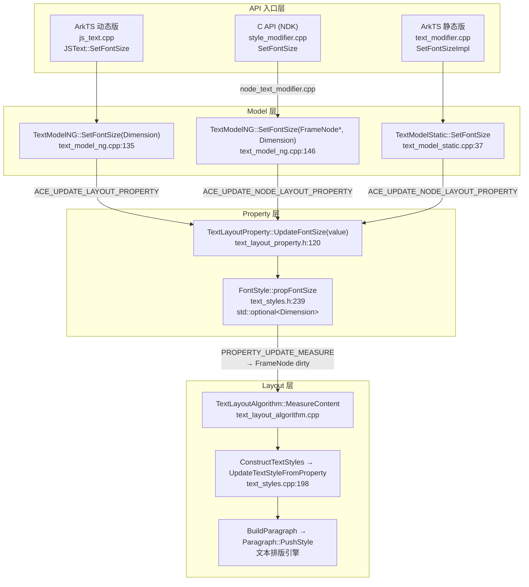
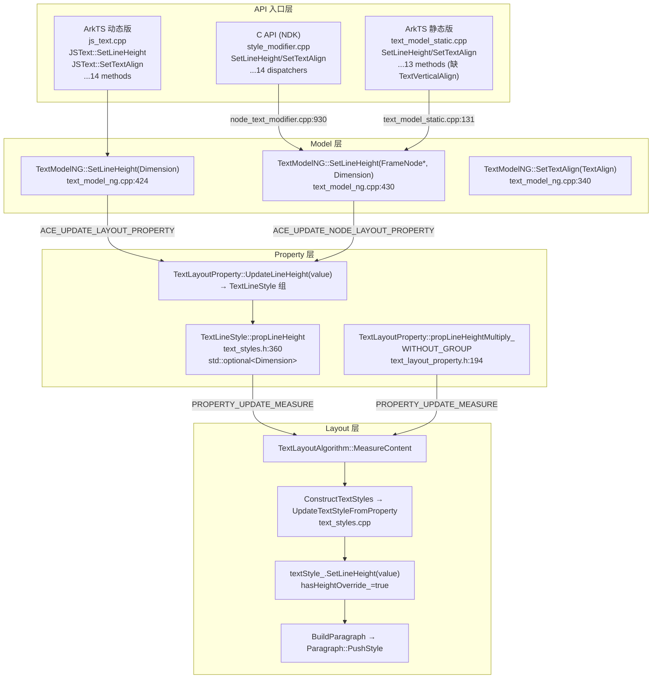
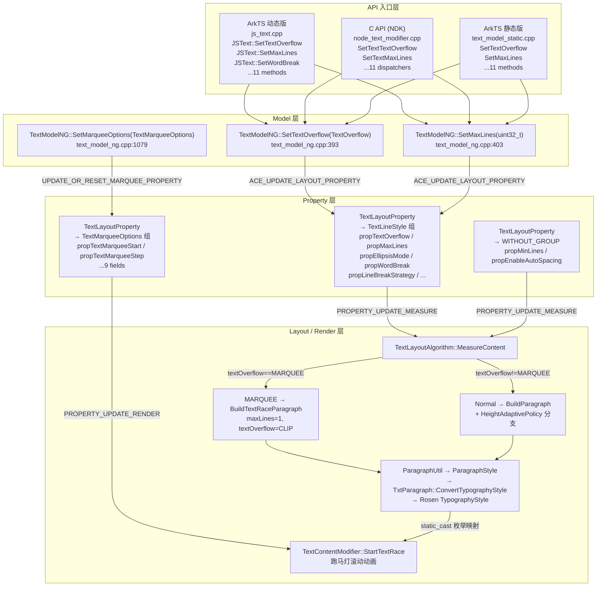
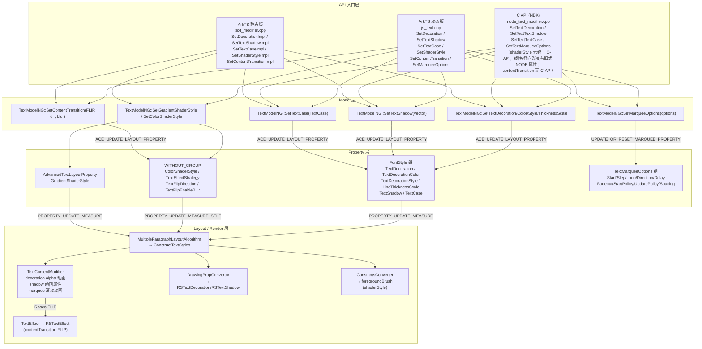
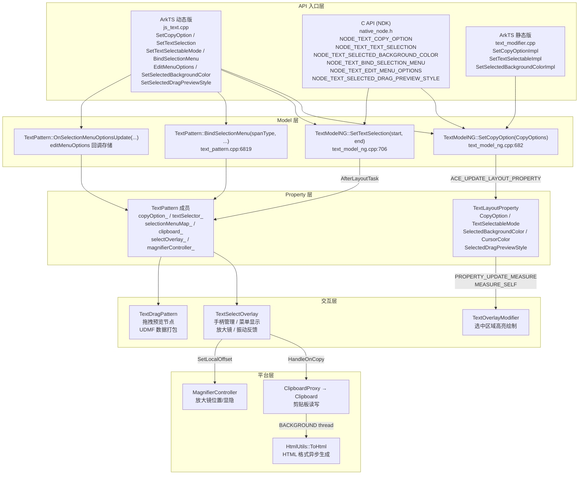
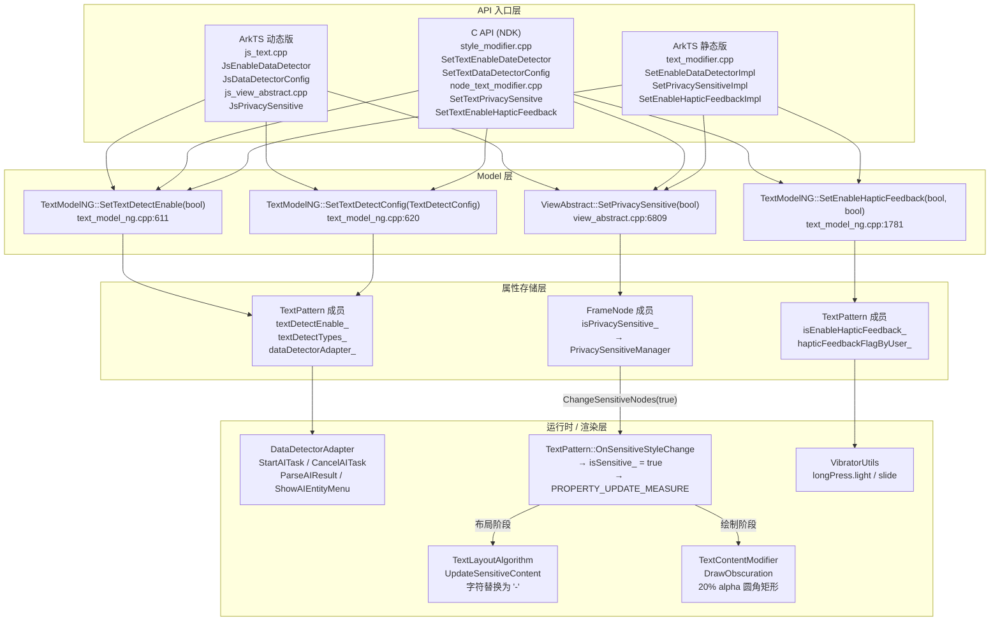
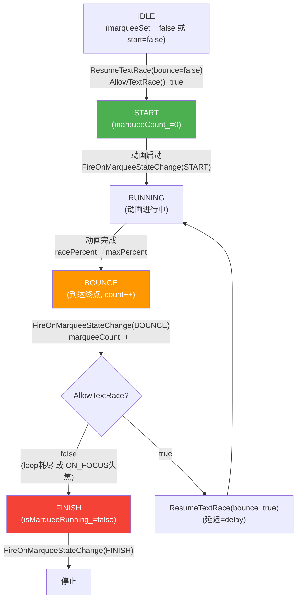

# 架构设计

> Text 组件功能域的架构设计文档，补录已有实现。

## 设计元数据

| 字段 | 内容 |
|------|------|
| Design ID | DESIGN-Func-05-09-04 |
| 关联需求 | 已有能力补录（无独立 requirement.md） |
| 关联 Epic | 无 |
| 目标 Feature | Feat-01 字体属性与自适应字体, Feat-02 行/段落布局, Feat-03 溢出与截断, Feat-04 装饰与样式, Feat-05 选择与复制, Feat-06 系统能力（数据检测、隐私敏感、震感反馈）, Feat-07 事件回调 (onCopy/onWillCopy/onTextSelectionChange/onMarqueeStateChange) |
| 复杂度 | 标准 |
| 目标版本 | API 7 起支持，API 10/12/26 有 API 新增 |
| Owner | ArkUI SIG |
| 状态 | Baselined（已有实现补录） |

## 需求基线

| 项 | 内容 |
|----|------|
| 问题陈述 | 开发者需要通过声明式 API 控制 Text 组件的字号、字色、字重、字族、斜体、OpenType 特性、可变字体轴等基本字体属性，以及自适应字号和字体缩放范围 |
| 核心目标 | （Feat-01）提供 font/fontSize/fontColor/fontWeight/fontFamily/fontStyle/fontFeature/fontVariations 八个核心字体属性以及 minFontSize/maxFontSize/minFontScale/maxFontScale/heightAdaptivePolicy 五个自适应字体属性，支持 ArkTS 动态版、ArkTS 静态版、C API (NDK) 三种入口（fontVariations 无公开 NODE 属性 C API，仅通过内部 Arkoala modifier 路径支持）；（Feat-02）提供 lineHeight/lineSpacing/lineHeightMultiple/minLineHeight/maxLineHeight/halfLeading/fallbackLineSpacing/includeFontPadding 八个行高行间距属性以及 textAlign/textVerticalAlign/textContentAlign/textIndent/baselineOffset/textDirection 六个对齐缩进属性，同样支持三种入口；（Feat-03）提供 textOverflow/maxLines/minLines/ellipsisMode/wordBreak/lineBreakStrategy 六个溢出截断核心属性以及 compressLeadingPunctuation/orphanCharOptimization/optimizeTrailingSpace/enableAutoSpacing 四个排版优化属性和 marqueeOptions/onMarqueeStateChange 跑马灯配套能力，同样支持三种入口；（Feat-04）提供 decoration/textShadow/textCase/shaderStyle/contentTransition/marqueeOptions 六个装饰与视觉样式属性，覆盖装饰线、文本阴影、大小写变换、渐变着色、数字翻页动画和跑马灯配置，支持三种入口（shaderStyle 无统一 C-API，线性/径向渐变子能力有旧式 NODE 属性 C API；contentTransition 暂无 C-API）；（Feat-05）提供 copyOption/selection/textSelectable/selectedBackgroundColor/caretColor/draggable/selectedDragPreviewStyle/bindSelectionMenu/editMenuOptions 九个选择与复制属性，覆盖复制权限、编程式选区、可选择性控制、选区外观、选中文本拖拽、选择菜单定制，支持三种入口；（Feat-06）提供 enableDataDetector/dataDetectorConfig/enableSelectedDataDetector 三个数据检测属性、privacySensitive 隐私敏感属性、enableHapticFeedback 震感反馈属性，覆盖 AI 实体识别与操作菜单、系统驱动的内容遮蔽（双机制：内容替换 + 视觉遮蔽）、文本选择触觉反馈（长按 + 手柄拖动），支持三种入口（数据检测 C-API @since 24 结构化 API；enableHapticFeedback 无公开 NODE 属性 C API，仅通过内部 node_text_modifier 桥接）；（Feat-07）提供 onCopy/onWillCopy/onTextSelectionChange/onMarqueeStateChange 四个 Text 专属事件回调，覆盖复制拦截与通知、选区变化监听（20+ 触发场景、去重机制）、跑马灯三状态生命周期，支持三种入口 |
| P0 AC | 各字体属性设置后渲染正确；font() 复合 API 分解语义正确（未指定字段不覆盖）；自适应字号在三方配合条件下正确缩放；字体缩放范围正确夹紧 |

## 上下文和现状

### 涉及仓和模块

| 仓库 | 模块/路径 | 当前职责 | 本 Feature 影响 |
|------|-----------|----------|-----------------|
| ace_engine | `frameworks/core/components_ng/pattern/text/text_styles.h` | FontStyle / TextLineStyle 属性组 struct 定义 | 核心数据结构 |
| ace_engine | `frameworks/core/components_ng/pattern/text/text_layout_property.h` | 聚合属性组，生成 Update/Get/Has/Reset 方法 | 属性存储 |
| ace_engine | `frameworks/core/components_ng/pattern/text/text_model_ng.h/cpp` | Model 层 — ArkTS 动态版入口 | API → Property 桥接 |
| ace_engine | `frameworks/core/components_ng/pattern/text/text_model_static.cpp` | 静态版 Model 代理 | 静态版入口 |
| ace_engine | `frameworks/core/components_ng/pattern/text/text_styles.cpp` | Property → TextStyle 转换（UpdateTextStyleFromProperty） | 布局准备 |
| ace_engine | `frameworks/core/components_ng/pattern/text/text_layout_algorithm.cpp` | 文本布局算法入口 (MeasureContent) | 消费字体属性 |
| ace_engine | `frameworks/core/components_ng/pattern/text/multiple_paragraph_layout_algorithm.cpp` | 多段落布局 (ConstructTextStyles) | 属性到 TextStyle 转换 |
| ace_engine | `frameworks/bridge/declarative_frontend/jsview/js_text.cpp` | ArkTS 动态版 JS 桥接 | 输入解析 |
| ace_engine | `frameworks/core/interfaces/native/node/node_text_modifier.cpp` | C API 到 Model 的桥接 | C API 入口 |
| ace_engine | `interfaces/native/node/style_modifier.cpp` | C API Set/Get/Reset 分发 | 多语言入口 |
| ace_engine | `frameworks/core/interfaces/native/implementation/text_modifier.cpp` | Arkoala 静态版桥接 | 静态版入口 |
| ace_engine | `frameworks/core/components_ng/property/property.h` | 属性组宏定义 | 基础设施 |
| ace_engine | `frameworks/core/components_ng/base/view_stack_processor.h` | ACE_UPDATE_LAYOUT_PROPERTY 宏 | 基础设施 |
| ace_engine | `frameworks/core/components/text/text_theme.h` | 主题默认值 | 默认值 |
| ace_engine | `interfaces/native/native_node.h` | C API 属性枚举 (NODE_FONT_*) | C API 定义 |
| ace_engine | `interfaces/native/native_type.h` | C API 类型 (ArkUI_FontStyle/ArkUI_FontWeight) | C API 定义 |
| sdk-js | `api/@internal/component/ets/text.d.ts` | ArkTS 动态版 API 声明 | 类型定义 |
| sdk-js | `api/arkui/component/text.static.d.ets` | ArkTS 静态版 API 声明 | 类型定义 |
| ace_engine | `frameworks/core/components_ng/pattern/text/text_styles.h:359-390` | Feat-02: TextLineStyle 属性组 struct 定义（行高/行间距/对齐/缩进） | 核心数据结构 |
| ace_engine | `frameworks/core/components_ng/pattern/text/text_layout_property.h:143-166,191-200` | Feat-02: TextLineStyle 组聚合 + WITHOUT_GROUP 属性（lineHeightMultiply/minLineHeight/maxLineHeight/includeFontPadding/fallbackLineSpacing） | 属性存储 |
| ace_engine | `frameworks/core/components_ng/pattern/text/text_model_ng.cpp:340-521,563-876,1764-1985,2088-2127` | Feat-02: Model 层行布局属性设置方法 | API → Property 桥接 |
| ace_engine | `frameworks/core/components_ng/pattern/text/text_model_static.cpp:103-149,280-299,429-506,517-543` | Feat-02: 静态版 Model 行布局属性 | 静态版入口 |
| ace_engine | `frameworks/bridge/declarative_frontend/jsview/js_text.cpp:531-714,813-827,1326-1415` | Feat-02: ArkTS 动态版 JS 桥接（行布局属性解析） | 输入解析 |
| ace_engine | `frameworks/core/interfaces/native/node/node_text_modifier.cpp:733-1060,1469-1518,2186-2200,2606-2794` | Feat-02: C API 到 Model 的行布局属性桥接 | C API 入口 |
| ace_engine | `frameworks/core/components/common/layout/constants.h:256-262,210-224,241-245,304-308,315-320` | Feat-03: TextOverflow/TextMarqueeState/MarqueeStartPolicy/MarqueeUpdatePolicy/LineBreakStrategy/TextHeightAdaptivePolicy/MarqueeDirection 枚举定义 | 枚举定义 |
| ace_engine | `frameworks/core/components/common/properties/text_enums.h:64-70,77` | Feat-03: EllipsisMode/WordBreak 枚举定义 | 枚举定义 |
| ace_engine | `frameworks/core/components_ng/pattern/text/text_layout_property.h:65-75,147-149,155-157,162-163,168-181,183,191` | Feat-03: 溢出截断属性存储（TextLineStyle 组 + TextMarqueeOptions 组 + WITHOUT_GROUP） | 属性存储 |
| ace_engine | `frameworks/core/components_ng/pattern/text/text_model_ng.cpp:315-411,778-791,901-922,1079-1155,1315-1354,1441-1452,1593-1598,1855-1950` | Feat-03: Model 层溢出截断属性设置方法 | API → Property 桥接 |
| ace_engine | `frameworks/core/components_ng/pattern/text/text_layout_algorithm.cpp:189-281,1124-1264` | Feat-03: MARQUEE/HeightAdaptivePolicy/maxLines 布局算法分支 | 布局消费 |
| ace_engine | `frameworks/core/components_ng/pattern/text/text_content_modifier.cpp:1428-1905` | Feat-03: 跑马灯滚动动画实现 | 动画渲染 |
| ace_engine | `frameworks/core/components_ng/render/adapter/txt_paragraph.cpp:78-115` | Feat-03: ParagraphStyle → Rosen TypographyStyle 转换（ellipsisMode/wordBreak/lineBreakStrategy/排版优化属性） | 排版引擎桥接 |
| ace_engine | `frameworks/core/components_ng/pattern/text/text_pattern.cpp:2969-2970,6988-7005,8041-8045` | Feat-03: MARQUEE 模式 copyOption 强制 None / onMarqueeStateChange 事件 / IsMarqueeOverflow 判断 | 模式控制 |
| ace_engine | `frameworks/core/components_ng/pattern/text/multiple_paragraph_layout_algorithm.cpp:1145-1189` | Feat-03: minLines 高度扩展算法（CalcHeightWithMinLines） | 布局消费 |
| ace_engine | `frameworks/core/interfaces/native/node/node_text_modifier.cpp:1072-1199,1605-1620,1622-1637,1971-1994,2346-2441` | Feat-03: C API 溢出截断属性桥接 | C API 入口 |
| ace_engine | `frameworks/bridge/declarative_frontend/jsview/js_text.cpp:357-421,506-529,1351-1388,1866-1875` | Feat-03: ArkTS 动态版 JS 桥接（溢出截断属性解析） | 输入解析 |
| ace_engine | `frameworks/core/components_ng/pattern/text/text_content_modifier.cpp:900-915,1307-1343` | Feat-04: decoration NONE↔UNDERLINE alpha 动画 + textShadow 动画属性 | 动画渲染 |
| ace_engine | `frameworks/core/components_ng/render/drawing_prop_convertor.cpp:169-224` | Feat-04: TextDecoration/TextDecorationStyle → RSTextDecoration/RSTextDecorationStyle 转换 | 排版引擎桥接 |
| ace_engine | `frameworks/core/components/font/constants_converter.cpp:404-411,799-817` | Feat-04: textShadow → Rosen::TextShadow 转换 + shaderStyle → foregroundBrush 转换 | 排版引擎桥接 |
| ace_engine | `frameworks/core/components_ng/pattern/text/advanced_text_layout_property.h:94-106` | Feat-04: GradientShaderStyle 存储 | 属性存储 |
| ace_engine | `frameworks/core/components_ng/render/text_effect.h:36-49` | Feat-04: TextEffect 抽象类（contentTransition 委托接口） | 动画渲染 |
| ace_engine | `frameworks/core/components_ng/render/adapter/txt_text_effect.cpp` | Feat-04: TxtTextEffect — Rosen TextEffect 适配器 | 动画渲染 |
| ace_engine | `frameworks/base/utils/string_utils.cpp:736-767` | Feat-04: TransformStrCase 大小写变换实现 | 文本预处理 |
| ace_engine | `interfaces/native/node/text_native_impl.cpp:517-643` | Feat-04: C-API marqueeOptions 访问器 | C API 入口 |
| sdk-js | `api/@internal/component/ets/text_common.d.ts` | Feat-04: ShaderStyle/ContentTransition/NumericTextTransition 类型定义 | 类型定义 |
| ace_engine | `frameworks/core/components_ng/pattern/text/text_pattern.cpp:1077-1114,3816-3822,691-750,3834-3895,4111-4246` | Feat-05: 选择/复制/拖拽核心逻辑（HandleOnCopy/IsSelectableAndCopy/HandleLongPress/OnDragStart/InitDragEvent） | 核心逻辑 |
| ace_engine | `frameworks/core/components_ng/pattern/text/text_select_overlay.h/cpp` | Feat-05: 选择覆盖层（手柄/菜单/放大镜管理） | 交互层 |
| ace_engine | `frameworks/core/components_ng/pattern/text/base_text_select_overlay.h/cpp` | Feat-05: 选择覆盖层基类（菜单显示/编辑菜单回调） | 交互层 |
| ace_engine | `frameworks/core/components_ng/pattern/text/text_overlay_modifier.h/cpp` | Feat-05: 选中区域高亮绘制 | 渲染层 |
| ace_engine | `frameworks/core/components_ng/pattern/text/text_base.h` | Feat-05: TextSelector 选区状态管理基类 | 数据结构 |
| ace_engine | `frameworks/core/components_ng/pattern/text_field/text_selector.h:82-324` | Feat-05: TextSelector struct / SelectionMenuParams / TextSpanType/TextResponseType 枚举 | 数据结构 |
| ace_engine | `frameworks/core/components_ng/pattern/text/text_menu_extension.h` | Feat-05: EditMenuOptions 回调类型（OnCreateMenuCallback/OnMenuItemClickCallback） | 回调定义 |
| ace_engine | `frameworks/core/components_ng/pattern/text_drag/text_drag_base.h` | Feat-05: TextDragBase 拖拽接口抽象 | 拖拽框架 |
| ace_engine | `frameworks/core/components_ng/pattern/text_drag/text_drag_pattern.h/cpp` | Feat-05: 拖拽预览节点创建/渲染（圆角背景/手柄） | 拖拽框架 |
| ace_engine | `frameworks/core/components_ng/pattern/rich_editor_drag/rich_editor_drag_info.h` | Feat-05: TextDragInfo 结构（含 dragBackgroundColor） | 拖拽框架 |
| ace_engine | `frameworks/core/components_ng/pattern/select_overlay/magnifier.h` | Feat-05: 放大镜组件 | 交互层 |
| ace_engine | `frameworks/core/common/clipboard/clipboard_proxy.h` | Feat-05: 剪贴板代理 | 平台桥接 |
| ace_engine | `frameworks/core/text/html_utils.h` | Feat-05: HTML 格式转换工具（ToHtml/ToHtmlForNormalType） | 数据转换 |
| ace_engine | `frameworks/core/components/common/layout/constants.h:269-273,732-737` | Feat-05: TextSelectableMode/CopyOptions 枚举定义 | 枚举定义 |
| sdk-js | `api/@internal/component/ets/text.d.ts:1257-1785` | Feat-05: 选择与复制动态版 API 声明 | 类型定义 |
| sdk-js | `api/arkui/component/text.static.d.ets:379-717` | Feat-05: 选择与复制静态版 API 声明 | 类型定义 |
| ace_engine | `frameworks/core/components_ng/pattern/text/text_pattern.h:638-639,673-675,818,845-846` | Feat-06: 数据检测/隐私/震感属性存储（TextPattern 成员变量） | 核心数据结构 |
| ace_engine | `frameworks/core/common/ai/data_detector_adapter.h` | Feat-06: DataDetectorAdapter — AI 检测运行时状态管理 | 核心逻辑 |
| ace_engine | `interfaces/inner_api/ace/ai/data_detector_interface.h` | Feat-06: DataDetectorInterface — 设备端 AI 检测抽象接口 | 平台桥接 |
| ace_engine | `frameworks/core/common/ai/data_detector_loader.h` | Feat-06: 动态加载 AI 检测实现 | 平台桥接 |
| ace_engine | `frameworks/core/components_ng/base/frame_node.h:681-689` | Feat-06: isPrivacySensitive_ 属性存储（FrameNode 级） | 属性存储 |
| ace_engine | `frameworks/core/components_ng/manager/privacy_sensitive/privacy_sensitive_manager.h` | Feat-06: PrivacySensitiveManager — 敏感节点注册与触发调度 | 核心逻辑 |
| ace_engine | `frameworks/core/components_ng/pattern/text/text_layout_algorithm.cpp:1277-1284` | Feat-06: UpdateSensitiveContent — 敏感内容字符替换 | 布局消费 |
| ace_engine | `frameworks/core/components_ng/pattern/text/text_content_modifier.cpp:765-809` | Feat-06: DrawObscuration — obscured 遮蔽矩形绘制 | 渲染层 |
| ace_engine | `frameworks/core/common/vibrator/vibrator_utils.h` | Feat-06: VibratorUtils — 振动反馈基础设施 | 平台桥接 |
| ace_engine | `frameworks/bridge/declarative_frontend/jsview/js_text.cpp:1173-1205` | Feat-06: ArkTS 动态版数据检测 JS 桥接 | 输入解析 |
| ace_engine | `frameworks/bridge/declarative_frontend/jsview/js_view_abstract.cpp:12433-12445` | Feat-06: privacySensitive 通用属性 JS 桥接 | 输入解析 |
| ace_engine | `frameworks/core/interfaces/native/node/node_text_modifier.cpp:1237-1251,2207-2218` | Feat-06: 隐私敏感/震感 C API 到 Model 桥接 | C API 入口 |
| ace_engine | `interfaces/native/native_node.h:2722-2733,2925` | Feat-06: C-API 数据检测属性枚举 | C API 定义 |
| ace_engine | `interfaces/native/native_type.h:2490-2497,6828,8492-8622` | Feat-06: C-API 数据检测类型/结构体定义 | C API 定义 |
| ace_engine | `interfaces/native/node/style_modifier.cpp:14269-14313` | Feat-06: C-API 数据检测 Set/Get/Reset 分发 | C API 入口 |
| sdk-js | `api/@internal/component/ets/text.d.ts:1589-1634` | Feat-06: 数据检测/选中检测动态版 API 声明 | 类型定义 |
| sdk-js | `api/@internal/component/ets/text.d.ts:1757,1816` | Feat-06: 隐私敏感/震感动态版 API 声明 | 类型定义 |
| sdk-js | `api/@internal/component/ets/text_common.d.ts:38-135` | Feat-06: TextDataDetectorType/TextDataDetectorConfig 类型定义 | 类型定义 |
| sdk-js | `api/arkui/component/text.static.d.ets:593-742,902` | Feat-06: 数据检测/隐私/震感/选中检测静态版 API 声明 | 类型定义 |

### 适用架构规则

| Rule ID | 适用原因 | 设计结论 | 验证方式 |
|---------|----------|----------|----------|
| OH-ARCH-LAYERING | 字体属性涉及 API 层 → Model 层 → Property 层 → Layout 层单向调用 | API(JSText/style_modifier) → Model(TextModelNG) → Property(TextLayoutProperty/FontStyle) → Layout(TextLayoutAlgorithm)，严格单向 | 代码评审/依赖检查 |
| OH-ARCH-API-LEVEL | 从 API 7 起支持核心字体属性，API 10/12/26 有新增 | 各 API 标注 @since 版本号，新 API 不破坏旧签名 | API 评审/XTS |
| OH-ARCH-COMPONENT-BUILD | 字体属性属于 text_pattern 模块，已在 ace_core_ng | 无需新增 BUILD.gn target | 构建验证 |

## 不涉及项承接

| 维度 | 需求阶段结论 | 设计阶段处理方式 | 设计结论 |
|------|---------|-------------|----------|
| 性能 | 是 | 展开设计 | 字体属性变更触发 PROPERTY_UPDATE_MEASURE，仅脏节点重新测量；（Feat-02）行布局属性同样触发 PROPERTY_UPDATE_MEASURE/MEASURE_SELF/LAYOUT，textContentAlign 仅触发 LAYOUT 不触发 MEASURE；（Feat-03）溢出截断属性均触发 PROPERTY_UPDATE_MEASURE；EllipsisMode.CENTER 强制 Paragraph 重建（`text_layout_algorithm.cpp:315`）；marqueeOptions 属性仅触发 PROPERTY_UPDATE_RENDER；（Feat-05）选择属性多数触发 PROPERTY_UPDATE_MEASURE_SELF（轻量级，仅自身重测量）；HTML 格式在后台线程异步生成不阻塞 UI；放大镜和覆盖层为独立渲染层不影响文本布局；（Feat-06）数据检测为异步 AI 任务不阻塞 UI，DataDetectorAdapter 懒创建未启用时不分配内存；privacySensitive 切换触发 PROPERTY_UPDATE_MEASURE 仅脏节点重测量；震感反馈仅在字符索引变化时触发 slide 振动非每帧触发 |
| 安全与权限 | 是 | 展开设计 | 字体属性无权限要求；（Feat-02）行布局属性同样无权限要求；（Feat-06）privacySensitive 在布局阶段替换文本内容，确保原始数据不泄露到渲染管线；数据检测依赖 @stagemodelonly SysCap；enableDataDetector 需要设备 AI 检测能力 |
| 兼容性 | 是 | 展开设计 | API 18 minFontSize/maxFontSize 扩展到子组件；API 12 新增 FontSettingOptions；（Feat-02）textContentAlign 动态版默认 CENTER、静态版默认 TOP；textVerticalAlign 静态版走 Arkoala modifier 直接调用路径而非 TextModelStatic facade；（Feat-03）textOverflow ArkTS 默认 Clip 与 C-API Reset 值 NONE 不一致（行为等价）；EllipsisMode 枚举名 ArkTS(START/CENTER/END) 与 C++(HEAD/MIDDLE/TAIL) 映射关系；（Feat-05）CopyOptions.CROSS_DEVICE @deprecated since 12（静态版无此值）；TextSelectableMode 在老式 C-API 无直接暴露；（Feat-06）数据检测 API 从 @since 11 到 @since 24 持续演进（详见 spec 兼容性声明）；enableHapticFeedback 无公开 NODE 属性 C-API 枚举；OH_ArkUI_TextDataDetectorConfig 结构体全套 API @since 24 |
| API/SDK | 是 | 展开设计 | ArkTS 动态版/静态版 + C API 三通道（注意区分公开 NODE 属性 C API 和内部 Arkoala modifier 路径：fontVariations/enableHapticFeedback 无公开 NODE 枚举，仅通过内部 modifier 桥接）；（Feat-02）14 个行布局属性均支持三通道，C API lineSpacing 不支持 onlyBetweenLines；（Feat-03）11 个溢出截断属性均支持三通道；（Feat-04）shaderStyle 无统一 C-API，但线性/径向渐变子能力有旧式 NODE 属性 C API（`native_node.h:2841,2873`，`style_modifier.cpp:20920` 分发）；contentTransition 无 C-API；（Feat-05）9 个选择与复制属性支持三通道，TextSelectableMode 在老式 C-API 无直接暴露（仅 Arkoala 支持）；（Feat-06）数据检测/隐私/震感 5 个属性均支持 ArkTS 动态版 + 静态版，C-API 数据检测 @since 24 提供结构化 API，enableHapticFeedback 仅通过内部 node_text_modifier 桥接（无公开 NODE 枚举） |
| IPC/跨进程 | N/A | 保持 N/A | 字体属性仅在 UI 线程内处理 |
| 构建与部件 | N/A | 保持 N/A | 无新增部件或 target |

## 关键设计决策

| 决策 ID | 问题 | 推荐方案 | 探索过的替代方案 | 取舍理由 | 影响 |
|---------|------|----------|-----------------|------|------|
| ADR-1 | 多字体属性如何统一存储 | FontStyle 属性组 struct（`text_styles.h:238`）+ `std::optional` 字段，通过 `unique_ptr<FontStyle>` 懒初始化 | 方案A：每个字体属性独立存储在 TextLayoutProperty（字段分散、无法区分"未设置"和"默认值"）；方案B：使用 map 存储（类型不安全、性能差） | 属性组懒初始化节省内存（未使用字体属性时不分配）；optional 区分"未设置"和"设为默认值"；宏生成避免手写样板代码 | 所有核心字体属性共享同一个 FontStyle 组实例 |
| ADR-2 | font() 复合 API 与单属性 API 的关系 | font() 内部分解为独立的 Set 调用（`text_model_ng.cpp:118`），仅在 `has_value()` 时调用 setter | 方案A：font() 全量替换所有字段（未指定字段被重置为默认值）；方案B：font() 存储为独立复合属性（与单属性冲突） | 分解语义复用存储路径且不覆盖已有值，与 CSS shorthand 行为对齐 | font() 中未指定的字段不覆盖已有值 |
| ADR-3 | C API 与 ArkTS 的 enableVariableFontWeight 路径差异 | ArkTS 通过 `FontSettingOptions.enableVariableFontWeight` 传入，内部同时设置 `EnableVariableFontWeight=true` 和 `VariableFontWeight=weight`；C API 使用独立的 `NODE_IMMUTABLE_FONT_WEIGHT` 直接设置 `VariableFontWeight` | 方案A：统一为一个属性（C API 无法表达 options 语义）；方案B：C API 也传 options struct（增加 NDK 复杂度） | C API 的 `NODE_IMMUTABLE_FONT_WEIGHT` 专门用于不受系统字重影响的场景，语义清晰；ArkTS 的 FontSettingOptions 更灵活 | 两条路径在内部映射到不同的属性字段组合 |
| ADR-4 | 自适应字号需要哪些条件配合 | 需要 minFontSize + maxFontSize + (maxLines 或布局约束) 三方同时具备才生效 | 方案A：仅需 minFontSize + maxFontSize（无约束时自适应无意义）；方案B：缺少条件时报错（破坏声明式静默语义） | 自适应字号本质上是在约束空间内寻找最优字号，无约束则无"优化目标"；静默不生效符合 ArkUI 声明式属性的一般行为 | 缺少配合条件时静默回退到 fontSize，无错误提示 |
| ADR-5 | heightAdaptivePolicy 为何存储在 TextLineStyle 组而非 FontStyle 组 | heightAdaptivePolicy 存储在 TextLineStyle 属性组（`text_styles.h:378`） | 方案A：存储在 FontStyle 组（与自适应字号属性物理聚合）| heightAdaptivePolicy 是行级布局策略（控制行数和行高），语义上属于行样式而非字体样式 | 自适应字号属性分散在两个属性组：FontStyle（minFontSize/maxFontSize）和 TextLineStyle（heightAdaptivePolicy） |
| ADR-F2-1 | lineHeightMultiple 为何会隐式修改 lineHeight | 设置 lineHeightMultiple 时先将 lineHeight 强制设为 28px（`DEFAULT_LINE_HEIGHT`，`js_text.cpp:647`），再设倍数 | 方案A：仅设倍数，lineHeight 为空时用排版引擎默认值；方案B：将 lineHeightMultiple 存储为独立属性，布局时动态计算 | lineHeightMultiple 在排版引擎中需要一个确定的基准行高进行乘法计算，28px 作为系统默认基准确保倍数计算结果确定；如果 lineHeight 未设置则排版引擎默认行高取决于字号，可能导致非预期结果 | JS Bridge、静态版、C API 三条路径均有此耦合副作用；Reset lineHeightMultiple 不会恢复 lineHeight |
| ADR-F2-2 | lineSpacing 的 onlyBetweenLines 如何存储 | 作为独立布尔属性 `IsOnlyBetweenLines` 存储在 TextLineStyle 组（`text_styles.h:377`），与 lineSpacing 值分开存储 | 方案A：将模式编码在 lineSpacing 值中（正值=全部，负值=仅行间）；方案B：使用复合 struct 包含值和模式 | 独立布尔属性语义清晰，可单独 Reset；FrameNode* 版 `SetLineSpacing` 方法同时设置值和模式（`text_model_ng.cpp:511-516`） | ArkTS 动态版通过 options 参数传入；C API 不支持 onlyBetweenLines（始终 false） |
| ADR-F2-3 | lineHeightMultiple/minLineHeight/maxLineHeight 为何不在 TextLineStyle 组内 | 这三个属性使用 `ACE_DEFINE_PROPERTY_ITEM_WITHOUT_GROUP` 宏直接存储在 TextLayoutProperty 上（`text_layout_property.h:194-196`） | 方案A：放入 TextLineStyle 组（与其他行样式属性物理聚合） | 这些属性是 @since 22 后增的，避免修改已稳定的 TextLineStyle struct；WITHOUT_GROUP 属性使用独立 optional 字段，不影响已有属性组的内存布局 | Getter 使用直接属性访问（而非通过属性组嵌套访问），路径不同 |
| ADR-F2-4 | textContentAlign 为何使用 PROPERTY_UPDATE_LAYOUT 而非 PROPERTY_UPDATE_MEASURE | textContentAlign 变更仅触发 `PROPERTY_UPDATE_LAYOUT`（`text_layout_property.h:166`） | 方案A：使用 PROPERTY_UPDATE_MEASURE（与其他属性一致，但触发不必要的重新测量） | textContentAlign 仅影响内容块在垂直方向的位置偏移，不改变文本测量尺寸，因此仅需重新布局；避免不必要的 Paragraph 重建开销 | 是 14 个属性中唯一使用 LAYOUT 标记的属性 |
| ADR-F2-5 | textVerticalAlign 在静态版中的实现路径 | `text_model_static.cpp` 未包含独立的 `SetTextVerticalAlign` facade 方法，但静态 SDK 已声明该 API（`text.static.d.ets:811`），Arkoala modifier 直接调用 `TextModelNG::SetTextVerticalAlign`（`text_modifier.cpp:793`）完成桥接 | 方案A：补充 TextModelStatic facade 方法（与其他属性保持一致）；方案B：保持现有 Arkoala modifier 直接调用路径 | 静态桥接路径已实现且功能正常——Arkoala generator 生成的 modifier 直接调用 TextModelNG 的 FrameNode* 版本方法，不依赖 TextModelStatic facade | 静态版 textVerticalAlign 通过 Arkoala modifier 路径生效，与多数属性走 TextModelStatic facade 的路径不同 |
| ADR-F3-1 | textOverflow 的 ArkTS 默认值（Clip）与 C-API Reset 值（NONE）不一致 | ArkTS getter 返回 `TextOverflow::CLIP`（`text_model_ng.cpp:1319`）；C-API ResetTextTextOverflow 重置为 `TextOverflow::NONE`（`node_text_modifier.cpp:1092`） | 方案A：统一两端默认值（可能破坏已有 C-API 行为） | NONE 和 CLIP 在 Rosen 排版引擎中行为完全一致，语义差异不影响渲染结果；修改 C-API Reset 值有兼容性风险 | 两条入口路径的 Reset 语义不同，但实际渲染行为一致 |
| ADR-F3-2 | EllipsisMode C++ 内部名（HEAD/MIDDLE/TAIL）与 ArkTS 外部名（START/CENTER/END）不同 | C++ 枚举 `EllipsisMode::HEAD/MIDDLE/TAIL/MULTILINE_HEAD/MULTILINE_MIDDLE`（`text_enums.h:64-70`）；ArkTS 枚举 `EllipsisMode.START/CENTER/END/MULTILINE_START/MULTILINE_CENTER`；映射通过 `ELLIPSIS_MODES` 查找数组和 `utils.h:622-633` 完成 | 方案A：统一命名（影响面太大） | 内部命名遵循排版引擎传统（head/middle/tail），外部 API 遵循前端习惯（start/center/end）；通过查找数组和索引映射桥接，对开发者透明 | 维护者需注意内外名称映射关系 |
| ADR-F3-3 | EllipsisMode.CENTER 强制 Paragraph 重建（不走缓存） | `AlwaysReCreateParagraph()` 在 `EllipsisMode::MIDDLE` 时返回 true（`text_layout_algorithm.cpp:315`），而 HEAD/TAIL/MULTILINE_* 不触发 | 方案A：所有 EllipsisMode 都强制重建（统一但性能差）；方案B：优化 CENTER 路径使其可缓存 | CENTER 模式的布局计算依赖当前约束宽度和分割比例，Paragraph 缓存的 key 无法包含这些变量，因此必须每次重建 | CENTER 模式性能略低于 HEAD/TAIL |
| ADR-F3-4 | enableAutoSpacing 使用 WITHOUT_GROUP 宏独立存储，不在 TextLineStyle 属性组内 | 其他 10 项溢出截断属性在 TextLineStyle 组内（`text_layout_property.h:147-163`）；enableAutoSpacing 使用 `ACE_DEFINE_TEXT_PROPERTY_ITEM_WITHOUT_GROUP`（`text_layout_property.h:183`） | 方案A：放入 TextLineStyle 组（与其他属性物理聚合） | enableAutoSpacing 属于后增属性（@since 20），避免修改已稳定的 TextLineStyle struct 内存布局；通过直接读取 LayoutProperty 而非 TextLineStyle 组传播（`multiple_paragraph_layout_algorithm.cpp:187`） | 属性传播路径不同：TextLineStyle 组属性走 `text_styles.cpp` 的 `UPDATE_TEXT_STYLE` 宏链路，enableAutoSpacing 在布局算法中直接读取 |
| ADR-F4-1 | decoration 内部以 `std::vector<TextDecoration>` 存储，但 JS 层仅传入单值 | 使用向量存储（`text_layout_property.h:130`），JS 桥接层将单个枚举值包装为单元素向量传入 | 方案A：直接存储 `TextDecoration` 枚举值（无法支持未来多装饰线叠加）；方案B：使用位标志（与 Rosen 引擎的位运算对齐更好，但与 ArkTS 单枚举 API 不一致） | 向量存储为未来多装饰线叠加预留能力（Rosen 引擎已支持 `ToRSTextDecoration` 按位 OR）；NONE↔UNDERLINE 切换支持 alpha 动画过渡（`text_content_modifier.cpp:1331`） | decoration type 存储为向量但 API 仅暴露单值；Rosen 层通过 bitwise OR 合并多装饰线 |
| ADR-F4-2 | shaderStyle 拆分为 GradientShaderStyle 和 ColorShaderStyle 双路径 | 渐变着色存储在 `AdvancedTextLayoutProperty`（`text_layout_property.h:197-198`）；纯色着色存储为 `ColorShaderStyle`（`text_layout_property.h:186`）；两者互斥 | 方案A：统一存储为 ShaderStyle 基类指针（需要运行时类型判断）；方案B：全部存为 Gradient（纯色是渐变的退化形式） | 分离存储避免运行时类型转换开销，互斥语义明确（`text_model_ng.cpp:2006-2013` 设置一个自动 reset 另一个）；最终通过 Rosen `TextStyle.foregroundBrush` 统一渲染，覆盖 fontColor | shaderStyle 无统一 C-API，但线性/径向渐变子能力有旧式 NODE 属性 C API（`native_node.h:2841,2873`，`style_modifier.cpp:20920` 分发）；渐变存储在 AdvancedTextLayoutProperty 扩展属性中 |
| ADR-F4-3 | textCase 在字符串层面预处理而非渲染层变换 | 在 `paragraph->AddText()` 前通过 `StringUtils::TransformStrCase()` 直接修改文本内容（`text_layout_algorithm.cpp:1081`） | 方案A：在渲染层变换（Rosen 排版引擎处理大小写）；方案B：在 Model 层变换（每次设置属性时转换） | 在 AddText 前变换确保排版引擎看到的是最终文本，测量和渲染一致；Unicode 大小写使用 `std::towupper/towlower`（`string_utils.cpp:762-767`） | textCase Span 级别触发 RE_CREATE（`span_node.h:1060`）而非 RE_LAYOUT，因为文本内容实质性变化 |
| ADR-F4-4 | contentTransition 完全委托 Rosen 图形引擎实现翻页动画 | ACE 通过 `TextEffect` 抽象类（`text_effect.h:36`）将配置（flipDirection/enableBlur）传递给 `RSTextEffectFactoryCreator`，不自行实现动画 | 方案A：ACE 自行实现逐字翻页动画（实现复杂度高，与 Rosen 渲染管线耦合） | Rosen 引擎已内置 FLIP 动画能力，委托减少 ACE 代码量和维护负担；仅在纯数字文本时生效（`text_pattern.cpp:5372`） | contentTransition 无 C-API；非数字文本静默忽略 |
| ADR-F5-1 | 选择与复制的三重门控设计 | `IsSelectableAndCopy()` 同时检查 `textSelectable != UNSELECTABLE` + `copyOption != None` + `!textEffect_`（`text_pattern.cpp:3816-3822`），作为所有选择/复制/拖拽路径的统一入口守卫 | 方案A：仅用 copyOption 单一控制（无法独立控制选择能力）；方案B：各入口独立检查（容易遗漏条件） | 三重门控确保 MARQUEE 等动效模式下自动禁用选择（`textEffect_` 条件），避免选择 UI 与动画冲突；统一入口减少条件分散导致的不一致 | MARQUEE 模式隐式禁用选择（CalcCopyOption 强制 None），draggable 仅在三重门控通过后初始化 |
| ADR-F5-2 | 剪贴板同时写入三种数据格式 | 复制操作同时写入纯文本、HTML、SpanString TLV 二进制到 `PasteDataMix`，通过 `MultiTypeRecordImpl` 打包（`text_pattern.cpp:1222-1248`） | 方案A：仅写入纯文本（丢失富文本格式信息）；方案B：仅写入 SpanString TLV（非 ArkUI 应用无法解析） | 纯文本确保跨应用/跨平台粘贴兼容；HTML 保留格式供富文本编辑器消费；SpanString TLV 保留 ArkUI 原生格式以实现无损粘贴；HTML 生成异步执行避免 UI 阻塞 | 后台线程 `HtmlUtils::ToHtml()` 异步生成 HTML，通过 TaskExecutor Post 回 UI 线程写入剪贴板 |
| ADR-F5-3 | caretColor 复用为选择手柄颜色 | `caretColor` 存储为 `CursorColor`（`text_layout_property.h:210`），在 `TextSelectOverlay::OnUpdateSelectOverlayInfo` 中映射为 `overlayInfo.handlerColor`（`text_select_overlay.cpp:386`） | 方案A：新增独立的 handleColor 属性（增加 API 数量）；方案B：手柄颜色仅从主题获取（不可定制） | 复用 caretColor 保持与 TextInput/TextArea 的 API 一致性（三者共享相同的属性名）；Text 是只读组件无可见光标，属性名"caret"虽有偏差但 API 统一性优先 | API 名称与实际用途存在偏差（命名为 caret 但用于 handle），需在文档中明确说明 |
| ADR-F5-4 | bindSelectionMenu 的 4 级回退查找策略 | 以 `(TextSpanType, TextResponseType)` 为 key 存储在 `selectionMenuMap_` 中，查找时按精确 → span 通配 → response 通配 → 双通配 4 级回退（`text_pattern.cpp:6897-6917`） | 方案A：仅支持精确匹配（开发者需为每种组合注册菜单）；方案B：支持正则匹配（实现复杂） | 4 级回退覆盖"按类型注册"和"全局默认"两种典型场景；`DEFAULT` 枚举值（JS 值 3 → C++ `NONE`）作为通配符简化注册 | editMenuOptions 与 bindSelectionMenu 互补而非互斥——builder 替换菜单 UI，editMenuOptions 定制系统菜单项 |
| ADR-F5-5 | 拖拽优先于重新选择 | 长按已选中区域时 `IsDraggable(localOffset)` 检查触摸点是否在选区内，通过后设置 `SetIsTextDraggable(true)` 并直接返回，跳过 `InitSelectionOnLongPress`（`text_pattern.cpp:718-727`） | 方案A：拖拽和重选由不同手势分别处理（手势冲突难以仲裁）；方案B：总是重选，拖拽需额外操作（用户体验差） | 拖拽是用户在已选中文本上的预期操作，重选可通过选区外长按触发；优先级判定简单（`LocalOffsetInSelectedArea` 几何检查） | 拖拽数据格式区分：有 Span 子节点使用 UDMF（纯文本 + SpanString + 图片），无子节点仅纯文本 |
| ADR-F5-6 | selectedDragPreviewStyle 仅含 color 字段 | `SelectedDragPreviewStyle` 接口仅含 `color?: ResourceColor`，存储为 `ACE_DEFINE_PROPERTY_ITEM_WITHOUT_GROUP(SelectedDragPreviewStyle, Color, PROPERTY_UPDATE_MEASURE)`（`text_layout_property.h:142`） | 方案A：包含更多样式属性（borderRadius/shadow/opacity）；方案B：不暴露自定义接口，完全使用主题值 | 最小 API 表面积——仅暴露最常见的定制需求（背景色）；圆角/阴影使用固定值（18vp 圆角，2in1 设备 8vp），符合系统视觉规范 | 默认亮色 #f2ffffff / 暗色 #202224，通过 `TextTheme::GetDragBackgroundColor()` 获取 |
| ADR-F6-1 | 数据检测属性为何存储在 TextPattern 成员变量而非 LayoutProperty | `textDetectEnable_`/`textDetectTypes_` 直接存储在 TextPattern（`text_pattern.h:673,818`），运行时状态委托 `DataDetectorAdapter`（`text_pattern.h:638`） | 方案A：存储在 TextLayoutProperty 属性组（与其他属性一致）；方案B：存储在 PaintProperty（不触发 measure） | 数据检测是异步 AI 任务，不参与布局计算，结果在 UI 线程回调后刷新；属性变更不需要触发 PROPERTY_UPDATE_MEASURE 重建 Paragraph；DataDetectorAdapter 封装了完整的检测生命周期（启动/取消/解析/菜单），需独立管理 | DataDetectorAdapter 懒创建，未启用时不分配内存 |
| ADR-F6-2 | privacySensitive 为何存储在 FrameNode 而非 TextPattern | `isPrivacySensitive_` 是 FrameNode 级属性（`frame_node.h:681`），由 `ViewAbstract::SetPrivacySensitive()` 设置（通用属性） | 方案A：存储在 TextPattern 或 TextLayoutProperty（各 Pattern 独立管理）；方案B：存储在 RenderContext（仅影响渲染） | privacySensitive 是通用组件属性（所有组件均可设置），由系统统一触发（`PrivacySensitiveManager`）；FrameNode 级存储确保 Pattern 无关的统一管理；TextPattern 仅通过 `OnSensitiveStyleChange` 回调响应 | privacySensitive(true) 触发 `PROPERTY_UPDATE_MEASURE`，因为内容替换需要重新测量 |
| ADR-F6-3 | privacySensitive 内容替换与 obscured 视觉遮蔽为何双机制共存 | privacySensitive 在布局阶段替换文本为 `-`（`text_layout_algorithm.cpp:1277`）；obscured 在绘制阶段画 20% alpha 圆角矩形（`text_content_modifier.cpp:765`） | 方案A：统一为一套机制；方案B：仅保留视觉遮蔽（不修改内容） | 两者触发源不同——privacySensitive 由系统敏感模式驱动（卡片后台），obscured 由开发者显式设置 `.obscured()` 属性；内容替换确保文本数据不泄露到渲染管线（安全性更高），视觉遮蔽仅是 UI 层覆盖；两者可独立或同时使用 | 双机制在安全等级和使用场景上互补而非冗余 |
| ADR-F6-4 | enableHapticFeedback 的容器继承与用户显式设置优先级 | `isEnableHapticFeedback_` 默认 true，可被父 `SelectionContainer` 覆盖；`hapticFeedbackFlagByUser_` 标记用户是否显式设置（`text_pattern.h:845-846`） | 方案A：无继承，每个组件独立管理；方案B：容器总是覆盖子组件 | SelectionContainer 提供批量控制能力（一次设置覆盖所有子 Text）；但用户显式设置应有最高优先级，否则无法单独定制某个 Text 的行为；`flagByUser` 区分"默认值"和"显式设置"，仅后者不受容器覆盖 | `CalcEnableHapticFeedback()` 实现优先级逻辑（`text_pattern.cpp:2905-2914`） |
| ADR-F6-5 | 实体重叠消歧策略 | 子集关系保留超集；非子集关系保留起始位置靠前者 | 方案A：保留所有重叠实体（UI 复杂）；方案B：按实体类型优先级排序（不够通用） | 子集规则避免小实体"挖掉"大实体的识别；起始位置规则确保确定性——同文本在不同运行中结果一致；规则在 SDK JSDoc 中明确定义，作为 API 契约 | 消歧在 `DataDetectorAdapter::ParseAIResult()` 中执行 |
| ADR-F7-1 | onWillCopy/onCopy 的调用顺序与拦截机制 | 固定调用链：onWillCopy → 剪贴板写入 → onCopy；onWillCopy 返回 false 时中断后续全部流程（`text_pattern.cpp:1094-1099`）；未注册 onWillCopy 时 `FireOnWillCopy` 默认返回 true（`text_event_hub.h:55`） | 方案A：onWillCopy/onCopy 独立触发互不影响（无法实现拦截）；方案B：使用事件系统的 `preventDefault()` 机制（ACE 事件系统不支持） | 串行调用链保证拦截语义确定性——开发者可在 onWillCopy 中审计内容后决定是否允许复制；默认 true 确保向后兼容（未注册时行为不变） | onWillCopy 是 Text 复制流程唯一的取消点 |
| ADR-F7-2 | HandleSelectionChange 去重机制 | 在 `HandleSelectionChange` 入口处比较 `(start, end)` 与 `textSelector_.GetStart(), textSelector_.GetEnd()`，完全相同时直接 return 不触发回调（`text_pattern.cpp:7033-7035`） | 方案A：不做去重，每次调用都触发回调（回调风暴风险——20+ 调用点）；方案B：在 FireOnSelectionChange 层做节流（无法区分有效变化和重复设置） | 入口去重兼顾性能和正确性——多个触发路径最终汇聚到同一方法，去重避免上层重复触发导致的回调噪声 | 依赖 `textSelector_` 内部状态为判等依据 |
| ADR-F7-3 | 跑马灯 BOUNCE/FINISH 可在同一轮动画结束时依次触发 | 动画完成回调中先检查 `racePercent == marqueeRaceMaxPercent_` → BOUNCE + marqueeCount_++，然后检查 `!AllowTextRace()` → FINISH（`text_content_modifier.cpp:1820-1826`）；最后一轮的 BOUNCE 递增 marqueeCount_ 后使 `AllowTextRace()` 返回 false | 方案A：BOUNCE 和 FINISH 互斥（最后一轮只触发 FINISH）；方案B：FINISH 独立于 BOUNCE 在单独回调中触发 | 顺序触发保持语义完整——BOUNCE 表示"到达终点"是物理事实，FINISH 表示"停止循环"是逻辑决策，两者不矛盾；开发者可在 BOUNCE 回调中做每轮统计，在 FINISH 回调中做最终清理 | 最后一轮动画结束时开发者会收到两次回调（BOUNCE + FINISH） |
| ADR-F7-4 | FireOnMarqueeStateChange 的副作用设计 | START 时关闭选择覆盖层 + 重置选区 + isMarqueeRunning_=true；FINISH 时 isMarqueeRunning_=false；所有状态变化后调用 RecoverCopyOption()（`text_pattern.cpp:6996-7004`） | 方案A：不在状态变化中执行副作用，让调用方负责（分散管理） | 集中在 `FireOnMarqueeStateChange` 中管理副作用确保一致性——跑马灯启动时必须清除选区（否则选择 UI 与滚动动画冲突），结束后必须恢复 copyOption（否则用户无法复制） | RecoverCopyOption 与 Feat-05 的三重门控（ADR-F5-1）联动 |

## 设计骨架

### 骨架范围

| 骨架项 | 目标 | 不包含 | 验证方式 |
|--------|------|--------|----------|
| 属性组骨架 | FontStyle struct 定义 + TextLayoutProperty 聚合 | 具体布局算法逻辑 | 编译通过 |
| API 入口骨架 | 三条入口路径（ArkTS 动态/静态/C API）到 TextModelNG | 渲染细节 | 单测通过 |
| 布局消费骨架 | TextLayoutAlgorithm 读取 FontStyle 属性并构建 TextStyle | 排版引擎内部 | 单测通过 |

### 骨架 Spec 拆分

| Task ID | 目标 | 受影响文件 | AC |
|---------|------|------------|-----|
| TASK-SKELETON-1 | FontStyle 属性组定义 + TextLayoutProperty 聚合 | `text_styles.h`, `text_layout_property.h` | WHEN 属性组定义完整 THEN 所有 Update/Get/Has/Reset 方法可用 |

## 后续 Task 拆分

| Task ID | 目标 | 受影响文件 | 依赖 |
|---------|------|------------|------|
| TASK-1 | Feat-01 字体属性与自适应字体（存量补录） | spec + design | design.md Baselined |
| TASK-2 | Feat-02 行/段落布局（存量补录） | spec + design | design.md Baselined |
| TASK-3 | Feat-03 溢出与截断（存量补录） | spec + design | design.md Baselined |
| TASK-4 | Feat-04 装饰与样式（存量补录） | spec + design | design.md Baselined |
| TASK-5 | Feat-05 选择与复制（存量补录） | spec + design | design.md Baselined |
| TASK-6 | Feat-06 系统能力（数据检测、隐私敏感、震感反馈）（存量补录） | spec + design | design.md Baselined |
| TASK-7 | Feat-07 事件回调 (onCopy/onWillCopy/onTextSelectionChange/onMarqueeStateChange)（存量补录） | spec + design | design.md Baselined |

## API 签名与权限

> 本节承接 spec.md"API 变更分析"中识别的 API，给出签名、d.ts 位置、权限等实现细节。

### 新增 API

| API 签名 | 类型 | d.ts 位置 | 权限要求 | SysCap |
|----------|------|-----------|----------|--------|
| `font(value: Font): TextAttribute` | Public | `api/@internal/component/ets/text.d.ts:211` | - | SystemCapability.ArkUI.ArkUI.Full |
| `font(fontValue: Font, options?: FontSettingOptions): TextAttribute` | Public | `api/@internal/component/ets/text.d.ts:230` | - | 同上 |
| `fontColor(value: ResourceColor): TextAttribute` | Public | `api/@internal/component/ets/text.d.ts:270` | - | 同上 |
| `fontSize(value: number\|string\|Resource): TextAttribute` | Public | `api/@internal/component/ets/text.d.ts:314` | - | 同上 |
| `fontWeight(value: number\|FontWeight\|ResourceStr): TextAttribute` | Public | `api/@internal/component/ets/text.d.ts:590` | - | 同上 |
| `fontWeight(weight, options?: FontSettingOptions): TextAttribute` | Public | `api/@internal/component/ets/text.d.ts:627` | - | 同上 |
| `fontFamily(value: string\|Resource): TextAttribute` | Public | `api/@internal/component/ets/text.d.ts:951` | - | 同上 |
| `fontStyle(value: FontStyle): TextAttribute` | Public | `api/@internal/component/ets/text.d.ts:530` | - | 同上 |
| `fontFeature(value: string): TextAttribute` | Public | `api/@internal/component/ets/text.d.ts:1712` | - | 同上 |
| `fontVariations(fontVariations: Array<FontVariation>): TextAttribute` | Public | `api/@internal/component/ets/text.d.ts:1958` | - | 同上 |
| `minFontSize(value: number\|string\|Resource): TextAttribute` | Public | `api/@internal/component/ets/text.d.ts:366` | - | 同上 |
| `maxFontSize(value: number\|string\|Resource): TextAttribute` | Public | `api/@internal/component/ets/text.d.ts:418` | - | 同上 |
| `minFontScale(scale: number\|Resource): TextAttribute` | Public | `api/@internal/component/ets/text.d.ts:455` | - | 同上 |
| `maxFontScale(scale: number\|Resource): TextAttribute` | Public | `api/@internal/component/ets/text.d.ts:490` | - | 同上 |
| `heightAdaptivePolicy(value: TextHeightAdaptivePolicy): TextAttribute` | Public | `api/@internal/component/ets/text.d.ts:1365` | - | 同上 |
| `lineHeight(value: number\|string\|Resource): TextAttribute` | Public | `api/@internal/component/ets/text.d.ts:837` | - | 同上 |
| `lineSpacing(value: LengthMetrics): TextAttribute` | Public | `api/@internal/component/ets/text.d.ts:644` | - | 同上 |
| `lineSpacing(value: LengthMetrics, options?: LineSpacingOptions): TextAttribute` | Public | `api/@internal/component/ets/text.d.ts:712` | - | 同上 |
| `lineHeightMultiple(value: number\|undefined): TextAttribute` | Public | `api/@internal/component/ets/text.d.ts:698` | - | 同上 |
| `minLineHeight(value: LengthMetrics\|undefined): TextAttribute` | Public | `api/@internal/component/ets/text.d.ts:662` | - | 同上 |
| `maxLineHeight(value: LengthMetrics\|undefined): TextAttribute` | Public | `api/@internal/component/ets/text.d.ts:680` | - | 同上 |
| `halfLeading(halfLeading: boolean): TextAttribute` | Public | `api/@internal/component/ets/text.d.ts:1803` | - | 同上 |
| `fallbackLineSpacing(enabled: Optional<boolean>): TextAttribute` | Public | `api/@internal/component/ets/text.d.ts:1891` | - | 同上 |
| `includeFontPadding(include: Optional<boolean>): TextAttribute` | Public | `api/@internal/component/ets/text.d.ts:1878` | - | 同上 |
| `textAlign(value: TextAlign): TextAttribute` | Public | `api/@internal/component/ets/text.d.ts:764` | - | 同上 |
| `textVerticalAlign(textVerticalAlign: Optional<TextVerticalAlign>): TextAttribute` | Public | `api/@internal/component/ets/text.d.ts:777` | - | 同上 |
| `textContentAlign(textContentAlign: Optional<TextContentAlign>): TextAttribute` | Public | `api/@internal/component/ets/text.d.ts:791` | - | 同上 |
| `textIndent(value: Length): TextAttribute` | Public | `api/@internal/component/ets/text.d.ts:1388` | - | 同上 |
| `baselineOffset(value: number\|ResourceStr): TextAttribute` | Public | `api/@internal/component/ets/text.d.ts:1219` | - | 同上 |
| `textDirection(direction: TextDirection\|undefined): TextAttribute` | Public | `api/@internal/component/ets/text.d.ts:1932` | - | 同上 |
| `textOverflow(options: TextOverflowOptions): TextAttribute` | Public | `api/@internal/component/ets/text.d.ts:905` | - | 同上 |
| `maxLines(value: number): TextAttribute` | Public | `api/@internal/component/ets/text.d.ts:997` | - | 同上 |
| `minLines(minLines: Optional<number>): TextAttribute` | Public | `api/@internal/component/ets/text.d.ts:1010` | - | 同上 |
| `ellipsisMode(value: EllipsisMode): TextAttribute` | Public | `api/@internal/component/ets/text.d.ts:1546` | - | 同上 |
| `wordBreak(value: WordBreak): TextAttribute` | Public | `api/@internal/component/ets/text.d.ts:1406` | - | 同上 |
| `lineBreakStrategy(strategy: LineBreakStrategy): TextAttribute` | Public | `api/@internal/component/ets/text.d.ts:1424` | - | 同上 |
| `compressLeadingPunctuation(enabled: Optional<boolean>): TextAttribute` | Public | `api/@internal/component/ets/text.d.ts` | - | 同上 |
| `orphanCharOptimization(enabled: Optional<boolean>): TextAttribute` | Public | `api/@internal/component/ets/text.d.ts` | - | 同上 |
| `optimizeTrailingSpace(optimize: Optional<boolean>): TextAttribute` | Public | `api/@internal/component/ets/text.d.ts` | - | 同上 |
| `enableAutoSpacing(enabled: Optional<boolean>): TextAttribute` | Public | `api/@internal/component/ets/text.d.ts` | - | 同上 |
| `marqueeOptions(options: Optional<TextMarqueeOptions>): TextAttribute` | Public | `api/@internal/component/ets/text.d.ts:1725` | - | 同上 |
| `onMarqueeStateChange(callback: Callback<MarqueeState>): TextAttribute` | Public | `api/@internal/component/ets/text.d.ts:1738` | - | 同上 |
| `decoration(value: DecorationStyleInterface): TextAttribute` | Public | `api/@internal/component/ets/text.d.ts:1065` | - | 同上 |
| `textShadow(value: ShadowOptions \| Array<ShadowOptions>): TextAttribute` | Public | `api/@internal/component/ets/text.d.ts:1322` | - | 同上 |
| `textCase(value: TextCase): TextAttribute` | Public | `api/@internal/component/ets/text.d.ts:1163` | - | 同上 |
| `shaderStyle(shader: ShaderStyle): TextAttribute` | Public | `api/@internal/component/ets/text.d.ts:1517` | - | 同上 |
| `contentTransition(transition: Optional<ContentTransition>): TextAttribute` | Public | `api/@internal/component/ets/text.d.ts:1865` | - | 同上 |
| `copyOption(value: CopyOptions): TextAttribute` | Public | `api/@internal/component/ets/text.d.ts:1257` | - | 同上 |
| `selection(selectionStart: number, selectionEnd: number): TextAttribute` | Public | `api/@internal/component/ets/text.d.ts:1478` | - | 同上 |
| `textSelectable(mode: TextSelectableMode): TextAttribute` | Public | `api/@internal/component/ets/text.d.ts:1770` | - | 同上 |
| `selectedBackgroundColor(color: ResourceColor): TextAttribute` | Public | `api/@internal/component/ets/text.d.ts:1504` | - | 同上 |
| `caretColor(color: ResourceColor): TextAttribute` | Public | `api/@internal/component/ets/text.d.ts:1491` | - | 同上 |
| `selectedDragPreviewStyle(value: SelectedDragPreviewStyle \| undefined): TextAttribute` | Public | `api/@internal/component/ets/text.d.ts:1906` | - | 同上 |
| `bindSelectionMenu(spanType: TextSpanType, content: CustomBuilder, responseType: TextResponseType, options?: SelectionMenuOptions): TextAttribute` | Public | `api/@internal/component/ets/text.d.ts:1670` | - | 同上 |
| `editMenuOptions(editMenu: EditMenuOptions): TextAttribute` | Public | `api/@internal/component/ets/text.d.ts:1785` | - | 同上 |
| `enableDataDetector(enable: boolean): TextAttribute` | Public | `api/@internal/component/ets/text.d.ts:1589` | - | SystemCapability.ArkUI.ArkUI.Full |
| `dataDetectorConfig(config: TextDataDetectorConfig): TextAttribute` | Public | `api/@internal/component/ets/text.d.ts:1622` | - | 同上 |
| `enableSelectedDataDetector(enable: boolean \| undefined): TextAttribute` | Public | `api/@internal/component/ets/text.d.ts:1634` | - | 同上 |
| `privacySensitive(supported: boolean): TextAttribute` | Public | `api/@internal/component/ets/text.d.ts:1757` | - | 同上 |
| `enableHapticFeedback(isEnabled: boolean): TextAttribute` | Public | `api/@internal/component/ets/text.d.ts:1816` | - | 同上 |
| `onCopy(callback: (value: string) => void): TextAttribute` | Public | `api/@internal/component/ets/text.d.ts:1438` | - | 同上 |
| `onWillCopy(callback: Callback<string, boolean>): TextAttribute` | Public | `api/@internal/component/ets/text.d.ts:1452` | - | 同上 |
| `onTextSelectionChange(callback: (selectionStart: number, selectionEnd: number) => void): TextAttribute` | Public | `api/@internal/component/ets/text.d.ts:1694` | - | 同上 |

### 变更/废弃 API

无。

## 构建系统影响

### BUILD.gn 变更

无 — 字体属性已包含在现有 text_pattern 模块的 BUILD.gn 中。

### bundle.json 变更

无新增部件或依赖。

## 可选设计扩展

### 架构图

<!-- 展开 -->



#### 行布局属性架构图（Feat-02）



#### 溢出截断属性架构图（Feat-03）



#### 装饰与样式属性架构图（Feat-04）



#### 选择与复制属性架构图（Feat-05）



#### 系统能力属性架构图（Feat-06）



### 数据模型设计

**ArkTS API 层类型：**

```typescript
interface Font {
  size?: Length;
  weight?: FontWeight | number | string;
  family?: string | Resource;
  style?: FontStyle;
}

interface FontSettingOptions {
  enableVariableFontWeight?: boolean;  // @since 12
}

enum TextHeightAdaptivePolicy {
  MAX_LINES_FIRST,        // 优先 maxLines
  MIN_FONT_SIZE_FIRST,    // 优先 minFontSize
  LAYOUT_CONSTRAINT_FIRST // 优先布局约束
}
```

#### 行布局 API 层类型（Feat-02）

```typescript
// lineSpacing 选项 (@since 20)
interface LineSpacingOptions {
  onlyBetweenLines?: boolean;  // 仅行间生效，不含首行前/末行后
}

// 文本水平对齐 (@since 7)
enum TextAlign {
  Start,     // 起始边对齐
  Center,    // 居中
  End,       // 末端对齐
  JUSTIFY,   // 两端对齐
  LEFT,      // 左对齐 (@since 23 C API)
  RIGHT      // 右对齐 (@since 23 C API)
}

// 文本行内垂直对齐 (@since 20)
enum TextVerticalAlign {
  BASELINE,  // 基线对齐（默认）
  BOTTOM,    // 底部对齐
  CENTER,    // 垂直居中
  TOP        // 顶部对齐
}

// 文本内容块垂直对齐 (@since 21)
enum TextContentAlign {
  TOP,       // 顶部对齐
  CENTER,    // 垂直居中（动态版默认）
  BOTTOM     // 底部对齐
}

// 文本方向 (@since 23)
enum TextDirection {
  LTR,       // 从左到右
  RTL,       // 从右到左
  DEFAULT,   // 继承（C++ 中为 INHERIT）
  AUTO       // 自动判断
}
```

#### 溢出截断 API 层类型（Feat-03）

```typescript
// 文本溢出选项 (@since 18，替代之前的 {overflow: TextOverflow} 字面量)
interface TextOverflowOptions {
  overflow: TextOverflow;
}

// 文本溢出模式 (@since 7)
enum TextOverflow {
  None,      // 不截断（行为等同 Clip）
  Clip,      // 裁剪
  Ellipsis,  // 省略号
  MARQUEE,   // 跑马灯 (@since 10)
}

// 省略号位置 (@since 11)
enum EllipsisMode {
  START = 0,           // 开头省略
  CENTER = 1,          // 中间省略
  END = 2,             // 末尾省略（默认）
  MULTILINE_START = 3, // 多行开头省略 (@since 24)
  MULTILINE_CENTER = 4,// 多行中间省略 (@since 24)
}

// 断词策略 (@since 11)
enum WordBreak {
  NORMAL = 0,      // 默认 Unicode 断行规则
  BREAK_ALL = 1,   // 允许任意字符间断行
  BREAK_WORD = 2,  // 优先词边界断行（默认）
  HYPHENATION = 3, // 连字符断词 (@since 18)
}

// 换行质量策略 (@since 12)
enum LineBreakStrategy {
  GREEDY = 0,       // 贪心填充（默认）
  HIGH_QUALITY = 1, // 全局优化
  BALANCED = 2,     // 均衡行宽
}

// 跑马灯选项 (@since 18)
interface TextMarqueeOptions {
  start?: boolean;
  step?: number;
  spacing?: LengthMetrics;          // @since 23
  loop?: number;
  fromStart?: boolean;
  delay?: number;
  fadeout?: boolean;
  marqueeStartPolicy?: MarqueeStartPolicy;
  marqueeUpdatePolicy?: MarqueeUpdatePolicy; // @since 23
}

// 跑马灯启动策略 (@since 18)
enum MarqueeStartPolicy {
  DEFAULT = 0,  // 默认启动
  ON_FOCUS = 1, // 获焦时启动
}

// 跑马灯更新策略 (@since 23)
enum MarqueeUpdatePolicy {
  DEFAULT = 0,          // 属性变更时重置位置
  PRESERVE_POSITION = 1,// 属性变更时保持位置
}

// 跑马灯状态回调 (@since 18)
enum MarqueeState {
  START = 0,  // 开始滚动
  BOUNCE = 1, // 一轮完成（将回弹/循环）
  FINISH = 2, // 全部循环结束
}
```

**C++ 框架层属性组（`text_styles.h:238`）：**

```cpp
struct FontStyle {
    ACE_DEFINE_PROPERTY_GROUP_ITEM(FontSize, Dimension);           // 字号
    ACE_DEFINE_PROPERTY_GROUP_ITEM(TextColor, Color);              // 字色
    ACE_DEFINE_PROPERTY_GROUP_ITEM(ItalicFontStyle, Ace::FontStyle); // 斜体
    ACE_DEFINE_PROPERTY_GROUP_ITEM(FontWeight, FontWeight);        // 字重
    ACE_DEFINE_PROPERTY_GROUP_ITEM(VariableFontWeight, int32_t);   // 可变字重值
    ACE_DEFINE_PROPERTY_GROUP_ITEM(EnableVariableFontWeight, bool); // 可变字重开关
    ACE_DEFINE_PROPERTY_GROUP_ITEM(FontFamily, std::vector<std::string>); // 字族
    ACE_DEFINE_PROPERTY_GROUP_ITEM(FontFeature, FONT_FEATURES_LIST);      // OpenType 特性
    ACE_DEFINE_PROPERTY_GROUP_ITEM(FontVariations, FONT_VARIATIONS_LIST); // 可变字体轴
    ACE_DEFINE_PROPERTY_GROUP_ITEM(AdaptMinFontSize, Dimension);   // 自适应最小字号
    ACE_DEFINE_PROPERTY_GROUP_ITEM(AdaptMaxFontSize, Dimension);   // 自适应最大字号
    ACE_DEFINE_PROPERTY_GROUP_ITEM(MinFontScale, float);           // 缩放下限
    ACE_DEFINE_PROPERTY_GROUP_ITEM(MaxFontScale, float);           // 缩放上限
    // ... 其他字段
};
```

#### 行布局 C++ 属性组（Feat-02，`text_styles.h:359-390`）

```cpp
struct TextLineStyle {
    ACE_DEFINE_PROPERTY_GROUP_ITEM(LineHeight, Dimension);              // 行高
    ACE_DEFINE_PROPERTY_GROUP_ITEM(LineSpacing, Dimension);             // 行间距
    ACE_DEFINE_PROPERTY_GROUP_ITEM(IsOnlyBetweenLines, bool);          // 仅行间生效
    ACE_DEFINE_PROPERTY_GROUP_ITEM(TextBaseline, TextBaseline);        // 文本基线
    ACE_DEFINE_PROPERTY_GROUP_ITEM(BaselineOffset, Dimension);         // 基线偏移
    ACE_DEFINE_PROPERTY_GROUP_ITEM(TextOverflow, TextOverflow);        // 溢出模式
    ACE_DEFINE_PROPERTY_GROUP_ITEM(TextAlign, TextAlign);              // 水平对齐
    ACE_DEFINE_PROPERTY_GROUP_ITEM(TextVerticalAlign, TextVerticalAlign); // 行内垂直对齐
    ACE_DEFINE_PROPERTY_GROUP_ITEM(TextIndent, Dimension);             // 首行缩进
    ACE_DEFINE_PROPERTY_GROUP_ITEM(WordBreak, WordBreak);              // 断词策略
    ACE_DEFINE_PROPERTY_GROUP_ITEM(LineBreakStrategy, LineBreakStrategy); // 换行策略
    ACE_DEFINE_PROPERTY_GROUP_ITEM(HalfLeading, bool);                 // 半行距
    ACE_DEFINE_PROPERTY_GROUP_ITEM(TextContentAlign, TextContentAlign); // 内容块垂直对齐
    ACE_DEFINE_PROPERTY_GROUP_ITEM(TextDirection, TextDirection);       // 文本方向
    ACE_DEFINE_PROPERTY_GROUP_ITEM(MaxLines, uint32_t);                // 最大行数
    ACE_DEFINE_PROPERTY_GROUP_ITEM(HeightAdaptivePolicy, TextHeightAdaptivePolicy); // 自适应策略
    ACE_DEFINE_PROPERTY_GROUP_ITEM(EllipsisMode, EllipsisMode);        // 省略号位置
    // ... 其他字段
};

// WITHOUT_GROUP 属性（直接存储在 TextLayoutProperty 上）
// text_layout_property.h:191-200
ACE_DEFINE_PROPERTY_ITEM_WITHOUT_GROUP(MinLines, uint32_t, PROPERTY_UPDATE_MEASURE);
ACE_DEFINE_PROPERTY_ITEM_WITHOUT_GROUP(LineHeightMultiply, double, PROPERTY_UPDATE_MEASURE);
ACE_DEFINE_PROPERTY_ITEM_WITHOUT_GROUP(MinimumLineHeight, Dimension, PROPERTY_UPDATE_MEASURE);
ACE_DEFINE_PROPERTY_ITEM_WITHOUT_GROUP(MaximumLineHeight, Dimension, PROPERTY_UPDATE_MEASURE);
ACE_DEFINE_PROPERTY_ITEM_WITHOUT_GROUP(IncludeFontPadding, bool, PROPERTY_UPDATE_MEASURE);
ACE_DEFINE_PROPERTY_ITEM_WITHOUT_GROUP(FallbackLineSpacing, bool, PROPERTY_UPDATE_MEASURE);
```

#### 装饰与样式 API 层类型（Feat-04）

```typescript
// 装饰线接口 (@since 12，替代之前的 object 类型)
interface DecorationStyleInterface {
  type: TextDecorationType;           // 装饰线类型（必填）
  color?: ResourceColor;              // 装饰线颜色（默认 Black）
  style?: TextDecorationStyle;        // 装饰线样式（默认 SOLID，@since 12）
  thicknessScale?: number;            // 粗细倍率（默认 1.0，@since 20）
}

// 装饰线类型 (@since 7)
enum TextDecorationType {
  None,        // 无装饰线
  Underline,   // 下划线
  Overline,    // 上划线
  LineThrough, // 删除线
}

// 装饰线样式 (@since 12)
enum TextDecorationStyle {
  SOLID = 0,   // 实线
  DOUBLE = 1,  // 双线
  DOTTED = 2,  // 点线
  DASHED = 3,  // 虚线
  WAVY = 4,    // 波浪线
}

// 大小写变换 (@since 7)
enum TextCase {
  Normal,    // 不变换
  LowerCase, // 全部小写
  UpperCase, // 全部大写
}

// 着色基类 (@since 20)
class ShaderStyle {}
class LinearGradientStyle extends ShaderStyle {
  constructor(options: LinearGradientOptions);
  options: LinearGradientOptions;
}
class RadialGradientStyle extends ShaderStyle {
  constructor(options: RadialGradientOptions);
  options: RadialGradientOptions;
}
class ColorShaderStyle extends ShaderStyle {
  constructor(color: ResourceColor);
  color: ResourceColor;
}

// 内容过渡基类 (@since 20)
class ContentTransition {}
class NumericTextTransition extends ContentTransition {
  constructor(options?: NumericTextTransitionOptions);
  flipDirection?: FlipDirection;  // DOWN(默认) / UP
  enableBlur?: boolean;           // 默认 false
}
```

#### 装饰与样式 C++ 属性存储（Feat-04）

```cpp
// FontStyle 组内 — decoration 相关（text_layout_property.h:130-139）
ACE_DEFINE_PROPERTY_ITEM_WITH_GROUP(FontStyle, TextDecoration, std::vector<TextDecoration>, PROPERTY_UPDATE_MEASURE);
ACE_DEFINE_PROPERTY_ITEM_WITH_GROUP(FontStyle, TextDecorationColor, Color, PROPERTY_UPDATE_MEASURE);
ACE_DEFINE_PROPERTY_ITEM_WITH_GROUP(FontStyle, TextDecorationStyle, TextDecorationStyle, PROPERTY_UPDATE_MEASURE);
ACE_DEFINE_PROPERTY_ITEM_WITH_GROUP(FontStyle, LineThicknessScale, float, PROPERTY_UPDATE_MEASURE);
ACE_DEFINE_PROPERTY_ITEM_WITH_GROUP(FontStyle, TextShadow, std::vector<Shadow>, PROPERTY_UPDATE_MEASURE);
ACE_DEFINE_PROPERTY_ITEM_WITH_GROUP(FontStyle, TextCase, TextCase, PROPERTY_UPDATE_MEASURE);

// WITHOUT_GROUP — shaderStyle/contentTransition（text_layout_property.h:186-193）
ACE_DEFINE_TEXT_PROPERTY_ITEM_WITHOUT_GROUP(ColorShaderStyle, Color, PROPERTY_UPDATE_MEASURE);
ACE_DEFINE_TEXT_COMMON_PROPERTY_ITEM_IN_ADVANCE_PROPS(GradientShaderStyle, Gradient, PROPERTY_UPDATE_MEASURE);
ACE_DEFINE_TEXT_PROPERTY_ITEM_WITHOUT_GROUP(TextEffectStrategy, TextEffectStrategy, PROPERTY_UPDATE_MEASURE_SELF);
ACE_DEFINE_PROPERTY_ITEM_WITHOUT_GROUP(TextFlipDirection, TextFlipDirection, PROPERTY_UPDATE_NORMAL);
ACE_DEFINE_PROPERTY_ITEM_WITHOUT_GROUP(TextFlipEnableBlur, bool, PROPERTY_UPDATE_NORMAL);
```

#### 选择与复制 API 层类型（Feat-05）

```typescript
// 复制选项 (@since 9)
enum CopyOptions {
  None = 0,        // 不可复制
  InApp = 1,       // 应用内粘贴
  LocalDevice = 2, // 本设备粘贴
  CROSS_DEVICE = 3,// 跨设备粘贴 (@deprecated since 12，静态版无此值)
}

// 文本可选择模式 (@since 12)
enum TextSelectableMode {
  SELECTABLE_UNFOCUSABLE = 0, // 可选不可焦（默认）
  SELECTABLE_FOCUSABLE = 1,   // 可选可焦
  UNSELECTABLE = 2,           // 不可选
}

// 选中内容类型 (@since 11)
enum TextSpanType {
  TEXT = 0,    // 纯文本
  IMAGE = 1,   // 纯图片
  MIXED = 2,   // 文本+图片混合
  DEFAULT = 3, // 通配（JS 3 → C++ NONE）(@since 15)
}

// 选择响应类型 (@since 11)
enum TextResponseType {
  RIGHT_CLICK = 0,  // 右键
  LONG_PRESS = 1,   // 长按
  SELECT = 2,       // 鼠标选中
  DEFAULT = 3,      // 通配（JS 3 → C++ NONE）(@since 15)
}

// 拖拽预览样式 (@since 23)
interface SelectedDragPreviewStyle {
  color?: ResourceColor; // 拖拽预览背景色
}

// 编辑菜单选项 (@since 12)
interface EditMenuOptions {
  onCreateMenu(menuItems: Array<TextMenuItem>): Array<TextMenuItem>;
  onMenuItemClick(menuItem: TextMenuItem, range: TextRange): boolean;
  onPrepareMenu?: OnPrepareMenuCallback; // @since 20
}
```

#### 选择与复制 C++ 属性存储（Feat-05）

```cpp
// TextLayoutProperty 上的选择相关属性（text_layout_property.h）
ACE_DEFINE_PROPERTY_ITEM_WITHOUT_GROUP(CopyOption, CopyOptions, PROPERTY_UPDATE_MEASURE);         // line 207
ACE_DEFINE_PROPERTY_ITEM_WITHOUT_GROUP(CursorColor, Color, PROPERTY_UPDATE_MEASURE_SELF);          // line 210（caretColor）
ACE_DEFINE_PROPERTY_ITEM_WITHOUT_GROUP(SelectedBackgroundColor, Color, PROPERTY_UPDATE_MEASURE_SELF); // line 211
ACE_DEFINE_PROPERTY_ITEM_WITHOUT_GROUP(TextSelectableMode, TextSelectableMode, PROPERTY_UPDATE_MEASURE_SELF); // line 213
ACE_DEFINE_PROPERTY_ITEM_WITHOUT_GROUP(SelectedDragPreviewStyle, Color, PROPERTY_UPDATE_MEASURE);  // line 142

// TextPattern 运行时成员（text_pattern.h）
CopyOptions copyOption_ = CopyOptions::None;                       // line 645
TextSelector textSelector_;                                        // 继承自 TextBase (text_base.h:316)
RefPtr<TextSelectOverlay> selectOverlay_;                          // line 803
RefPtr<Clipboard> clipboard_;                                      // line 619
RefPtr<MagnifierController> magnifierController_;                  // lazy init
std::map<std::pair<TextSpanType, TextResponseType>,
         std::shared_ptr<SelectionMenuParams>> selectionMenuMap_;  // line 629

// TextSelector 核心字段（text_selector.h:82-160）
int32_t baseOffset;              // 选区锚点
int32_t destinationOffset;       // 选区移动端
RectF firstHandle, secondHandle; // 手柄矩形
```

#### 系统能力 API 层类型（Feat-06）

```typescript
// 数据检测类型 (@since 11, @atomicservice @since 12 dynamic)
enum TextDataDetectorType {
  PHONE_NUMBER = 0,  // 电话号码
  URL = 1,           // 网址
  EMAIL = 2,         // 邮箱
  ADDRESS = 3,       // 地址
  DATE_TIME = 4,     // 日期时间 (@since 12 dynamic)
}

// 数据检测配置 (@since 11, @atomicservice @since 12 dynamic)
interface TextDataDetectorConfig {
  types: TextDataDetectorType[];             // 检测类型数组
  onDetectResultUpdate?: Callback<string>;   // 检测结果回调
  color?: ResourceColor;                     // 实体颜色 (@since 12 dynamic)
  decoration?: DecorationStyleInterface;     // 实体装饰线 (@since 12 dynamic)
  enablePreviewMenu?: boolean;               // 启用预览菜单 (@since 20 dynamic)
}
```

#### 系统能力 C++ 属性存储（Feat-06）

```cpp
// TextPattern 成员变量 — 数据检测（text_pattern.h:638-675,818）
bool textDetectEnable_ = false;                          // 主开关
bool selectDetectEnabled_ = true;                        // 选中文本检测开关
std::string textDetectTypes_ = "";                       // 检测类型字符串
RefPtr<DataDetectorAdapter> dataDetectorAdapter_;        // 检测适配器（懒创建）
RefPtr<DataDetectorAdapter> selectDetectorAdapter_;      // 选中文本检测适配器
std::unordered_map<TextDataDetectType, AISpan> aiMenuOptions_; // AI 菜单选项

// FrameNode 成员变量 — 隐私敏感（frame_node.h:681-689）
bool isPrivacySensitive_ = false;                        // 敏感标记

// TextPattern 成员变量 — 隐私运行时（text_pattern.h:843）
bool isSensitive_ = false;                               // 系统触发的敏感模式激活状态

// TextPattern 成员变量 — 震感反馈（text_pattern.h:845-846）
bool isEnableHapticFeedback_ = true;                     // 震感开关（默认启用）
bool hapticFeedbackFlagByUser_ = false;                  // 用户是否显式设置

// C-API 类型定义（native_type.h）
// ArkUI_TextDataDetectorType @since 12: PHONE_NUMBER/URL/EMAIL/ADDRESS
// OH_ArkUI_TextDataDetectorConfig 结构体 @since 24: Create/Destroy/SetTypes/GetTypes/...全套 API
// OH_ArkUI_HapticFeedbackMode @since 18: DISABLED/ENABLED/AUTO (用于菜单，非 Text 直接使用)
```

**C API 属性映射：**

| NODE 枚举 | 数据格式 | 桥接函数 | Model 方法 |
|-----------|----------|----------|------------|
| `NODE_FONT_COLOR` | `.value[0].u32` (0xARGB) | `SetFontColor` → `node_text_modifier.cpp` | `TextModelNG::SetTextColor(FrameNode*, Color)` |
| `NODE_FONT_SIZE` | `.value[0].f32` (fp) | `SetFontSize` → `node_text_modifier.cpp:897` | `TextModelNG::SetFontSize(FrameNode*, Dimension)` |
| `NODE_FONT_STYLE` | `.value[0].i32` (ArkUI_FontStyle) | `SetFontStyle` | `TextModelNG::SetItalicFontStyle(FrameNode*, FontStyle)` |
| `NODE_FONT_WEIGHT` | `.value[0].i32` (ArkUI_FontWeight) | `SetFontWeight` | `TextModelNG::SetFontWeight(FrameNode*, FontWeight)` |
| `NODE_FONT_FAMILY` | `.string` (逗号分隔) | `SetTextFontFamily` | `TextModelNG::SetFontFamily(FrameNode*, vector<string>)` |
| `NODE_TEXT_FONT` | `.string?`+`.value[0..2]` | `SetTextFont` | `TextModelNG::SetFont(FrameNode*, Font)` |
| `NODE_TEXT_FONT_FEATURE` | `.string` | `SetFontFeature` | `TextModelNG::SetFontFeature(FrameNode*, FONT_FEATURES_LIST)` |
| `NODE_IMMUTABLE_FONT_WEIGHT` (@since 15) | `.value[0].i32` | `SetImmutableFontWeight` | `TextModelNG::SetVariableFontWeight(FrameNode*, int32_t)` |
| `NODE_TEXT_MIN_FONT_SIZE` | `.value[0].f32` (fp) | `SetTextMinFontSize` | `TextModelNG::SetAdaptMinFontSize(FrameNode*, Dimension)` |
| `NODE_TEXT_MAX_FONT_SIZE` | `.value[0].f32` (fp) | `SetTextMaxFontSize` | `TextModelNG::SetAdaptMaxFontSize(FrameNode*, Dimension)` |
| `NODE_TEXT_HEIGHT_ADAPTIVE_POLICY` | `.value[0].i32` | `SetTextHeightAdaptivePolicy` | `TextModelNG::SetHeightAdaptivePolicy(FrameNode*, TextHeightAdaptivePolicy)` |
| `NODE_TEXT_LINE_HEIGHT` | `.value[0].f32` (fp) | `SetTextLineHeight` → `node_text_modifier.cpp:930` | `TextModelNG::SetLineHeight(FrameNode*, Dimension)` |
| `NODE_TEXT_LINE_SPACING` | `.value[0].f32` (fp, ≥0) | `SetTextLineSpacing` → `node_text_modifier.cpp:1866` | `TextModelNG::SetLineSpacing(FrameNode*, Dimension, false)` |
| `NODE_TEXT_LINE_HEIGHT_MULTIPLE` (@since 22) | `.value[0].f32` (≥0) | `SetTextLineHeightMultiply` → `node_text_modifier.cpp:960` | 先 `SetLineHeight(DEFAULT)` 再 `SetLineHeightMultiply(FrameNode*, double)` |
| `NODE_TEXT_MIN_LINE_HEIGHT` (@since 22) | `.value[0].f32` (fp, ≥0) | `SetTextMinimumLineHeight` → `node_text_modifier.cpp:1014` | `TextModelNG::SetMinimumLineHeight(FrameNode*, Dimension)` |
| `NODE_TEXT_MAX_LINE_HEIGHT` (@since 22) | `.value[0].f32` (fp, ≥0) | `SetTextMaximumLineHeight` → `node_text_modifier.cpp:1043` | `TextModelNG::SetMaximumLineHeight(FrameNode*, Dimension)` |
| `NODE_TEXT_HALF_LEADING` | `.value[0].i32` (0/1) | `SetTextHalfLeading` → `node_text_modifier.cpp:2186` | `TextModelNG::SetHalfLeading(FrameNode*, bool)` |
| `NODE_TEXT_FALLBACK_LINE_SPACING` (@since 23) | `.value[0].i32` (0/1) | `SetFallbackLineSpacing` → `node_text_modifier.cpp:2780` | `TextModelNG::SetFallbackLineSpacing(FrameNode*, bool)` |
| `NODE_TEXT_INCLUDE_FONT_PADDING` (@since 23) | `.value[0].i32` (0/1) | `SetIncludeFontPadding` → `node_text_modifier.cpp:2759` | `TextModelNG::SetIncludeFontPadding(FrameNode*, bool)` |
| `NODE_TEXT_ALIGN` | `.value[0].i32` (ArkUI_TextAlignment) | `SetTextAlign` → `node_text_modifier.cpp:733` | `TextModelNG::SetTextAlign(FrameNode*, TextAlign)` |
| `NODE_TEXT_VERTICAL_ALIGN` (@since 20) | `.value[0].i32` (ArkUI_TextVerticalAlignment) | `SetTextVerticalAlign` → `node_text_modifier.cpp:2606` | `TextModelNG::SetTextVerticalAlign(FrameNode*, TextVerticalAlign)` |
| `NODE_TEXT_CONTENT_ALIGN` (@since 21) | `.value[0].i32` (ArkUI_TextContentAlign) | `SetTextContentAlign` → `node_text_modifier.cpp:784` | `TextModelNG::SetTextContentAlign(FrameNode*, TextContentAlign)` |
| `NODE_TEXT_INDENT` | `.value[0].f32` (fp) | `SetTextTextIndent` → `node_text_modifier.cpp:1469` | `TextModelNG::SetTextIndent(FrameNode*, Dimension)` |
| `NODE_TEXT_BASELINE_OFFSET` | `.value[0].f32` (fp) | `SetTextBaselineOffset` → `node_text_modifier.cpp:1497` | `TextModelNG::SetBaselineOffset(FrameNode*, Dimension)` |
| `NODE_TEXT_DIRECTION` (@since 23) | `.value[0].i32` (ArkUI_TextDirection) | `SetTextDirection` → `node_text_modifier.cpp:758` | `TextModelNG::SetTextDirection(FrameNode*, TextDirection)` |
| `NODE_TEXT_OVERFLOW` | `.value[0].i32` (ArkUI_TextOverflow) | `SetTextTextOverflow` → `node_text_modifier.cpp:1072` | `TextModelNG::SetTextOverflow(FrameNode*, TextOverflow)` |
| `NODE_TEXT_MAX_LINES` | `.value[0].i32` | `SetTextMaxLines` → `node_text_modifier.cpp:1160` | `TextModelNG::SetMaxLines(FrameNode*, uint32_t)` |
| `NODE_TEXT_MIN_LINES` (@since 22) | `.value[0].i32` | `SetTextMinLines` → `node_text_modifier.cpp:1181` | `TextModelNG::SetMinLines(FrameNode*, uint32_t)` |
| `NODE_TEXT_ELLIPSIS_MODE` (@since 12) | `.value[0].u32` (ArkUI_EllipsisMode) | `SetEllipsisMode` → `node_text_modifier.cpp:1622` | `TextModelNG::SetEllipsisMode(FrameNode*, EllipsisMode)` |
| `NODE_TEXT_WORD_BREAK` (@since 12) | `.value[0].i32` (ArkUI_WordBreak) | `SetWordBreak` → `node_text_modifier.cpp:1605` | `TextModelNG::SetWordBreak(FrameNode*, WordBreak)` |
| `NODE_TEXT_LINE_BREAK_STRATEGY` (@since 24) | `.value[0].i32` (OH_ArkUI_LineBreakStrategy) | `SetLineBreakStrategy` → `node_text_modifier.cpp:1971` | `TextModelNG::SetLineBreakStrategy(FrameNode*, LineBreakStrategy)` |
| `NODE_TEXT_COMPRESS_LEADING_PUNCTUATION` (@since 23) | `.value[0].i32` (0/1) | `SetTextCompressLeadingPunctuation` → `node_text_modifier.cpp:2388` | `TextModelNG::SetCompressLeadingPunctuation(FrameNode*, bool)` |
| `NODE_TEXT_ORPHAN_CHAR_OPTIMIZATION` (@since 26) | `.value[0].i32` (0/1) | `SetTextOrphanCharOptimization` → `node_text_modifier.cpp:2367` | `TextModelNG::SetOrphanCharOptimization(FrameNode*, bool)` |
| `NODE_TEXT_OPTIMIZE_TRAILING_SPACE` (@since 20) | `.value[0].i32` (0/1) | `SetTextOptimizeTrailingSpace` → `node_text_modifier.cpp:2346` | `TextModelNG::SetOptimizeTrailingSpace(FrameNode*, bool)` |
| `NODE_TEXT_ENABLE_AUTO_SPACING` (@since 20) | `.value[0].i32` (0/1) | `SetEnableAutoSpacing` → `node_text_modifier.cpp:2430` | `TextModelNG::SetEnableAutoSpacing(FrameNode*, bool)` |
| `NODE_TEXT_DECORATION` | `.value[0].i32`(type) + `.value[1].u32`(color ARGB) + `.value[2].i32`(style) + `.value[3].f32`(thicknessScale) | `SetTextDecoration` → `node_text_modifier.cpp:1095` | `TextModelNG::SetTextDecoration/Color/Style/LineThicknessScale` |
| `NODE_TEXT_CASE` | `.value[0].i32` (0=Normal, 1=Lower, 2=Upper) | `SetTextTextCase` → `node_text_modifier.cpp:1138` | `TextModelNG::SetTextCase(FrameNode*, TextCase)` |
| `NODE_TEXT_TEXT_SHADOW` | `.value[0].f32`(radius) + `.value[1].i32`(type) + `.value[2].u32`(color) + `.value[3].f32`(offsetX) + `.value[4].f32`(offsetY)；多阴影通过 size 传入数量 | `SetTextTextShadow` → `node_text_modifier.cpp:1367` | `TextModelNG::SetTextShadow(FrameNode*, vector<Shadow>)` |
| `NODE_TEXT_MARQUEE_OPTIONS` (@since 18) | `OH_ArkUI_TextMarqueeOptions` 结构体 | `SetTextMarqueeOptions` → `text_native_impl.cpp:517` | `TextModelNG::SetMarqueeOptions(FrameNode*, TextMarqueeOptions)` |
| shaderStyle | ❌ 无统一 C-API（线性/径向渐变有旧式 NODE 属性） | — | — |
| contentTransition | ❌ 无 C-API | — | — |
| `NODE_TEXT_COPY_OPTION` (@since 9) | `.value[0].i32` (ArkUI_CopyOptions) | `SetTextCopyOption` → `node_text_modifier.cpp` | `TextModelNG::SetCopyOption(FrameNode*, CopyOptions)` |
| `NODE_TEXT_TEXT_SELECTION` (@since 22) | `.value[0].i32`(start) + `.value[1].i32`(end) | `SetTextTextSelection` | `TextModelNG::SetTextSelection(FrameNode*, int, int)` |
| `NODE_TEXT_SELECTED_BACKGROUND_COLOR` (@since 12) | `.value[0].u32` (0xARGB) | `SetTextSelectedBackgroundColor` | `TextModelNG::SetSelectedBackgroundColor(FrameNode*, Color)` |
| `NODE_TEXT_SELECTED_DRAG_PREVIEW_STYLE` (@since 23) | `.value[0].u32` (0xARGB) | `SetTextSelectedDragPreviewStyle` → `text_modifier.cpp:881` | `TextModelNG::SetSelectedDragPreviewStyle(FrameNode*, Color)` |
| `NODE_TEXT_BIND_SELECTION_MENU` (@since 22) | `.object` (ArkUI_TextSelectionMenuOptions) | `SetTextBindSelectionMenu` → `text_native_impl.h:51` | `TextPattern::BindSelectionMenu(...)` |
| `NODE_TEXT_EDIT_MENU_OPTIONS` (@since 22) | `.object` (OH_ArkUI_EditMenuOptions) | `SetTextEditMenuOptions` → `text_native_impl.h:41` | `TextPattern::OnSelectionMenuOptionsUpdate(...)` |
| textSelectable (C-API) | ❌ 老式 NODE_TEXT_* 无直接暴露 | Arkoala: `SetTextSelectableImpl` (`text_modifier.cpp:653`) | `TextModelNG::SetTextSelectableMode(FrameNode*, TextSelectableMode)` |
| `NODE_TEXT_ENABLE_DATA_DETECTOR` | `.value[0].i32` (0/1) | `SetTextEnableDateDetector` → `style_modifier.cpp:14269` | `TextModelNG::SetTextDetectEnable(FrameNode*, bool)` |
| `NODE_TEXT_ENABLE_DATA_DETECTOR_CONFIG` | `.value[0..N].i32` (ArkUI_TextDataDetectorType 数组) | `SetTextDataDetectorConfig` → `style_modifier.cpp:14288` | `TextModelNG::SetTextDetectConfig(FrameNode*, string)` |
| `NODE_TEXT_ENABLE_SELECTED_DATA_DETECTOR` (@since 22) | `.value[0].i32` (0/1) | `SetTextSelectDetectorEnable` | `TextPattern::SetSelectDetectEnable(bool)` |
| `OH_ArkUI_TextDataDetectorConfig` (@since 24) | 结构体：Types/Color/Decoration/PreviewMenu/Callback | `OH_ArkUI_TextDataDetectorConfig_Create/SetTypes/...` | `TextModelNG::SetTextDetectConfig(FrameNode*, TextDetectConfig)` |
| privacySensitive (内部桥接) | `.value[0].u32` (0/1) | `SetTextPrivacySensitve` → `node_text_modifier.cpp:1237` | `FrameNode::SetPrivacySensitive(bool)` |
| enableHapticFeedback (内部桥接) | `.value[0].i32` (0/1) | `SetTextEnableHapticFeedback` → `node_text_modifier.cpp:2207` | `TextModelNG::SetEnableHapticFeedback(FrameNode*, bool, true)` |

### 接口参数规约

| 接口 | 参数 | 类型 | 合法范围 | 非法处理 | 边界说明 |
|------|------|------|----------|----------|----------|
| `fontSize` | value | `number\|string\|Resource` | 正数值 | 0 或负数时使用主题默认值 | 单位 fp；string 支持 `'16fp'`/`'20px'` |
| `fontWeight` | value | `number\|FontWeight\|string` | 100~900 (number)；FontWeight 枚举；`"bold"`/`"400"` 等 | 非法字符串使用默认 400 | 100~900 间按百位取值，非百位值映射到最近预设档位 |
| `fontFamily` | value | `string\|Resource` | 有效字族名 | 无效字族回退到系统默认 | form 场景仅支持 HarmonyOS Sans |
| `fontFeature` | value | `string` | OpenType 特性标签格式 `"tag [on\|off\|int]"` | `"normal"` 重置为字体默认特性 | 多特性逗号分隔 |
| `minFontSize` | value | `number\|string\|Resource` | 正数值 (fp) | ≤ 0 时自适应不生效 | 需配合 maxFontSize + maxLines/约束 |
| `maxFontSize` | value | `number\|string\|Resource` | 正数值 (fp) | ≤ 0 时自适应不生效 | 需配合 minFontSize + maxLines/约束 |
| `minFontScale` | scale | `number\|Resource` | [0, 1] | < 0 按 0；> 1 按 1 | 限制系统字体缩放对文本的影响下限 |
| `maxFontScale` | scale | `number\|Resource` | [1, +∞) | < 1 按 1 | 限制系统字体缩放对文本的影响上限 |
| `lineHeight` | value | `number\|string\|Resource` | 任意值 | ≤ 0 时行高不受限制 | 单位 fp；正值启用 hasHeightOverride_ |
| `lineSpacing` | value | `LengthMetrics` | ≥ 0 | < 0 时 Reset 为 0 | 默认 0；C API 不支持 onlyBetweenLines |
| `lineHeightMultiple` | value | `number\|undefined` | > 0 | ≤ 0 或 undefined 时 Reset | 设置时隐式将 lineHeight 设为 28px |
| `minLineHeight` | value | `LengthMetrics\|undefined` | ≥ 0 | < 0 时按 0（C API 返回错误码） | undefined 时不限制 |
| `maxLineHeight` | value | `LengthMetrics\|undefined` | ≥ 0 | < 0 时按 0（C API 返回错误码） | undefined 时不限制 |
| `halfLeading` | halfLeading | `boolean` | true/false | 非布尔值时设为 false | 默认从 pipeline 全局配置获取 |
| `fallbackLineSpacing` | enabled | `Optional<boolean>` | true/false | 非布尔值时设为 false | 默认 false |
| `includeFontPadding` | include | `Optional<boolean>` | true/false | 非布尔值时设为 false | 默认 false |
| `textAlign` | value | `TextAlign` | Start/Center/End/JUSTIFY/LEFT/RIGHT | 非法值 API≥12 回退 Start | 穿戴设备默认 Center |
| `textVerticalAlign` | textVerticalAlign | `Optional<TextVerticalAlign>` | BASELINE/TOP/CENTER/BOTTOM | 默认 BASELINE | 静态版走 Arkoala modifier 路径（`text_modifier.cpp:793`）而非 TextModelStatic facade |
| `textContentAlign` | textContentAlign | `Optional<TextContentAlign>` | TOP/CENTER/BOTTOM | 非法值 Reset | 动态版默认 CENTER；静态版默认 TOP |
| `textIndent` | value | `Length` | 任意值 | 无钳位 | 默认 0；允许负值 |
| `baselineOffset` | value | `number\|ResourceStr` | 任意值 | 百分比使用默认值 0 | 正值上移，负值下移；|值|加入内容高度 |
| `textDirection` | direction | `TextDirection\|undefined` | LTR/RTL/AUTO/undefined | 非法值 Reset 为 INHERIT | 触发 MEASURE_SELF |
| `textOverflow` | options.overflow | `TextOverflow` | None/Clip/Ellipsis/MARQUEE | 非法值按 NONE 处理 | ArkTS 默认 Clip；C-API Reset 为 NONE（行为等价） |
| `maxLines` | value | `number` | 正整数 / Infinity | 0 或负值可能导致不显示 | 默认 UINT32_MAX；C-API 默认 Infinity |
| `minLines` | minLines | `Optional<number>` | ≥ 1 的正整数 | ≤ 0 或非数字时 Reset | 默认 0（不限制）；钳位到 maxLines |
| `ellipsisMode` | value | `EllipsisMode` | START/CENTER/END/MULTILINE_START/MULTILINE_CENTER | 超出范围按 END 处理 | 需配合 textOverflow=Ellipsis |
| `wordBreak` | value | `WordBreak` | NORMAL/BREAK_ALL/BREAK_WORD/HYPHENATION | 超出范围按 BREAK_WORD 处理 | 默认 BREAK_WORD |
| `lineBreakStrategy` | strategy | `LineBreakStrategy` | GREEDY/HIGH_QUALITY/BALANCED | 超出范围按 GREEDY 处理 | 默认 GREEDY |
| `compressLeadingPunctuation` | enabled | `Optional<boolean>` | true/false | 非布尔值时 Reset 为 false | 默认 false |
| `orphanCharOptimization` | enabled | `Optional<boolean>` | true/false | 非布尔值时 Reset 为 false | 默认 false |
| `optimizeTrailingSpace` | optimize | `Optional<boolean>` | true/false | 非布尔值时 Reset 为 false | 默认 false |
| `enableAutoSpacing` | enabled | `Optional<boolean>` | true/false | 非布尔值时 Reset 为 false | 默认 false；WITHOUT_GROUP 存储 |
| `copyOption` | value | `CopyOptions` | None(0)/InApp(1)/LocalDevice(2)/CROSS_DEVICE(3) | 非法枚举值按 None 处理 | 默认 None；MARQUEE 模式强制 None |
| `selection` | selectionStart, selectionEnd | `number` | [0, textLength] | start >= end 时无选中效果；超界自动钳位 | 通过 AfterLayoutTask 延迟执行 |
| `textSelectable` | mode | `TextSelectableMode` | SELECTABLE_UNFOCUSABLE(0)/SELECTABLE_FOCUSABLE(1)/UNSELECTABLE(2) | 非法值按 SELECTABLE_UNFOCUSABLE | 默认 SELECTABLE_UNFOCUSABLE；FOCUSABLE 启用键盘选择 |
| `selectedBackgroundColor` | color | `ResourceColor` | 合法颜色值 | 默认取 TextTheme 选中背景色 | alpha=255 时自动降为 20% 不透明度 |
| `caretColor` | color | `ResourceColor` | 合法颜色值 | 默认取 TextTheme::GetCaretColor() | 实际用于选择手柄颜色（Text 无可见光标） |
| `draggable` | value | `boolean` | true/false | 默认 false（但 TextTheme 可配置默认值） | 需配合 IsSelectableAndCopy()=true 才能拖拽选中文本 |
| `selectedDragPreviewStyle` | value | `SelectedDragPreviewStyle` | { color?: ResourceColor } | undefined 时 Reset；默认亮色 #f2ffffff / 暗色 #202224 | 仅含 color 字段；圆角半径固定 18vp（2in1 设备 8vp） |
| `bindSelectionMenu` | spanType, content, responseType, options? | `TextSpanType, CustomBuilder, TextResponseType, SelectionMenuOptions?` | spanType: TEXT/IMAGE/MIXED/DEFAULT；responseType: RIGHT_CLICK/LONG_PRESS/SELECT/DEFAULT | content 为 null 时移除绑定 | 4 级回退查找策略 |
| `editMenuOptions` | editMenu | `EditMenuOptions` | onCreateMenu + onMenuItemClick + onPrepareMenu? | — | 与 bindSelectionMenu 互补 |
| `decoration` | value | `DecorationStyleInterface` | type: TextDecorationType 枚举；color: ResourceColor；style: TextDecorationStyle 枚举；thicknessScale: 正数 | style 非法回退 SOLID；thicknessScale < 0 回退 1.0 | @since 12 类型从 object 变为 DecorationStyleInterface；@since 20 新增 thicknessScale |
| `textShadow` | value | `ShadowOptions \| Array<ShadowOptions>` | radius ≥ 0；offsetX/offsetY 任意值 | radius = 0 或负数时无阴影 | @since 10 单值；@since 11 支持数组；fill 在 Text 上不生效 |
| `textCase` | value | `TextCase` | Normal (0) / LowerCase (1) / UpperCase (2) | 超出 [0, 2] 时 Reset 为 Normal | @since 7；字符串层面预处理 |
| `shaderStyle` | shader | `ShaderStyle` | LinearGradientStyle / RadialGradientStyle / ColorShaderStyle | undefined 时 Reset 回退 fontColor | @since 20；无统一 C-API，线性/径向渐变有旧式 NODE 属性（`native_node.h:2841,2873`）；gradient 与 color 互斥 |
| `contentTransition` | transition | `Optional<ContentTransition>` | NumericTextTransition { flipDirection, enableBlur } | undefined 时 Reset；非数字文本静默忽略 | @since 20；无 C-API；委托 Rosen 引擎 |
| `enableDataDetector` | enable | `boolean` | true/false | 非布尔值时设为 false | @since 11；默认 false；需设备 AI 能力支持；MARQUEE 模式下不生效 |
| `dataDetectorConfig` | config | `TextDataDetectorConfig` | types: TextDataDetectorType[]；color: ResourceColor；decoration: DecorationStyleInterface；enablePreviewMenu: boolean；onDetectResultUpdate: Callback | 空 types 时检测所有类型 | @since 11；需配合 enableDataDetector(true)；@since 12 新增 color/decoration；@since 20 新增 enablePreviewMenu |
| `enableSelectedDataDetector` | enable | `boolean \| undefined` | true/false/undefined | undefined 时 Reset | @since 22 dynamic；默认 true |
| `privacySensitive` | supported | `boolean` | true/false/null | null 时禁用隐私模式 | @since 12 dynamic；需卡片框架支持；激活时禁用选择/AI 检测/复制 |
| `enableHapticFeedback` | isEnabled | `boolean` | true/false | 非布尔值时设为 true | @since 13 dynamic；默认 true；可被父 SelectionContainer 覆盖（除非用户显式设置） |

## 详细设计

### 属性组宏系统

Text 组件的字体属性通过 `property.h` 中定义的宏系统管理：

| 宏 | 定义位置 | 作用 |
|----|----------|------|
| `ACE_DEFINE_PROPERTY_GROUP(GroupName, Type)` | `property.h:79` | 在 TextLayoutProperty 中生成 `propGroupName_`（unique_ptr）、`GetOrCreateGroupName()`、`GetGroupName()` |
| `ACE_DEFINE_PROPERTY_ITEM_WITH_GROUP(Group, Name, Type, Flag)` | `property.h:174` | 在 TextLayoutProperty 中生成 `UpdateName(value)` 方法，内部调用属性组的 setter 并标记脏位 |
| `ACE_DEFINE_PROPERTY_GROUP_ITEM(Name, Type)` | `property.h:314` | 在 FontStyle struct 内生成 `propName`（optional）+ Get/Has/Update/Check/Reset 方法 |

TextLayoutProperty 聚合三个属性组（`text_layout_property.h`）：
- `ACE_DEFINE_PROPERTY_GROUP(FontStyle, FontStyle)` (line 119) — 核心字体属性 + 自适应字号属性
- `ACE_DEFINE_PROPERTY_GROUP(TextLineStyle, TextLineStyle)` (line 143) — 行样式（含 heightAdaptivePolicy）
- `ACE_DEFINE_PROPERTY_GROUP(TextMarqueeOptions, TextMarqueeOptions)` (line 168) — 跑马灯

### 属性更新到布局的数据流

```
1. API 调用 → TextModelNG::SetFontSize(value)
2. 宏展开   → TextLayoutProperty::UpdateFontSize(value)
3. 属性存储 → FontStyle::propFontSize = value (std::optional<Dimension>)
4. 脏标记   → UpdatePropertyChangeFlag(PROPERTY_UPDATE_MEASURE) → FrameNode dirty
5. 下一帧   → TextLayoutAlgorithm::MeasureContent()
6. 转换     → ConstructTextStyles() → UpdateTextStyleFromProperty()
              → UPDATE_TEXT_STYLE(fontStyle, FontSize, SetFontSize) [text_styles.cpp:223]
              → textStyle_.SetFontSize(propFontSize.value())
7. 排版     → BuildParagraph(textStyle_, ...) → Paragraph::PushStyle → 文本排版引擎
```

### font() 复合 API 分解逻辑

`TextModelNG::SetFont()` (`text_model_ng.cpp:118`) 对 Font 对象逐字段判断 `has_value()`：

```cpp
void TextModelNG::SetFont(const Font& value) {
    if (value.fontSize.has_value()) {
        SetFontSize(value.fontSize.value());
    }
    if (value.fontWeight.has_value()) {
        SetFontWeight(value.fontWeight.value());
    }
    if (value.fontFamilies.size() > 0) {
        SetFontFamily(value.fontFamilies);
    }
    if (value.fontStyle.has_value()) {
        SetItalicFontStyle(value.fontStyle.value());
    }
}
```

未指定的字段不会调用 setter，因此不会覆盖已有值。这与 CSS shorthand 的"全量重置"语义不同。

### enableVariableFontWeight 双路径实现

**ArkTS 路径**（`js_text.cpp` → `TextModelNG`）：
- `fontWeight(weight, { enableVariableFontWeight: true })` 同时调用：
  - `SetFontWeight(weight)` — 更新 FontStyle::propFontWeight
  - `SetEnableVariableFontWeight(true)` — 更新 FontStyle::propEnableVariableFontWeight
  - `SetVariableFontWeight(weight)` — 更新 FontStyle::propVariableFontWeight

**C API 路径**（`style_modifier.cpp` → `node_text_modifier.cpp`）：
- `NODE_IMMUTABLE_FONT_WEIGHT` 仅调用 `SetVariableFontWeight(weight)` — 更新 FontStyle::propVariableFontWeight
- 不设置 EnableVariableFontWeight 标志（C API 通过独立属性表达，无需开关）

### 行布局属性数据流（Feat-02）

```
1. API 调用 → TextModelNG::SetLineHeight(value) / SetTextAlign(value) / ...
2. 宏展开   → TextLayoutProperty::UpdateLineHeight(value) [TextLineStyle 组]
              或 TextLayoutProperty::UpdateLineHeightMultiply(value) [WITHOUT_GROUP]
3. 属性存储 → TextLineStyle::propLineHeight = value (std::optional<Dimension>)
              或 propLineHeightMultiply_ = value (std::optional<double>)
4. 脏标记   → PROPERTY_UPDATE_MEASURE / MEASURE_SELF / LAYOUT → FrameNode dirty
5. 下一帧   → TextLayoutAlgorithm::MeasureContent()
6. 转换     → ConstructTextStyles() → UpdateTextStyleFromProperty()
              → UPDATE_TEXT_STYLE(textLineStyle, LineHeight, SetLineHeight) [text_styles.cpp]
              → textStyle_.SetLineHeight(propLineHeight.value())
              → 若 lineHeight > 0，设置 hasHeightOverride_=true
7. 排版     → BuildParagraph(textStyle_, ...) → Paragraph::PushStyle → 文本排版引擎
```

**脏标记差异：**

| 属性 | 脏标记 | 含义 |
|------|--------|------|
| lineHeight/lineSpacing/textAlign/textIndent/baselineOffset 等大多数属性 | `PROPERTY_UPDATE_MEASURE` | 触发完整重新测量（自身+子组件） |
| halfLeading/textDirection/paragraphSpacing | `PROPERTY_UPDATE_MEASURE_SELF` | 仅自身重新测量，不级联子组件 |
| textContentAlign | `PROPERTY_UPDATE_LAYOUT` | 仅重新布局（位置偏移），不重新测量 |

### lineHeightMultiple 耦合副作用（Feat-02）

`lineHeightMultiple` 设置时会先将 `lineHeight` 强制设为 `28px`（`DEFAULT_LINE_HEIGHT`）：

**JS Bridge 路径**（`js_text.cpp:634-649`）：
```cpp
void JSText::SetLineHeightMultiply(const JSCallbackInfo& info) {
    // ... 解析 double value ...
    if (LessNotEqual(value, 0.0)) {
        TextModel::GetInstance()->ResetLineHeightMultiply();
        return;
    }
    // 隐式副作用：先设置 lineHeight=28px
    TextModel::GetInstance()->SetLineHeight(CalcDimension(DEFAULT_LINE_HEIGHT, DimensionUnit::PX));
    TextModel::GetInstance()->SetLineHeightMultiply(value);
}
```

**C API 路径**（`style_modifier.cpp:14083`）：
- 设置正值时先调 `setTextLineHeight(handle, DEFAULT, px, nullptr)` 再调 `setTextLineHeightMultiply(handle, f32, nullptr)`

**恢复要点**：Reset lineHeightMultiple 时仅清除倍数属性，lineHeight 不会自动恢复。

### baselineOffset 影响内容高度（Feat-02）

`baselineOffset` 的绝对值会加入段落总高度计算（`text_layout_algorithm.cpp:230`）：

```
contentHeight = paragraphHeight + |baselineOffset|
```

正值将文本向上偏移，负值向下偏移。计算后的 baselineOffset 值存储回 `TextPattern`（`text_pattern.cpp:5146`）。

### textContentAlign 仅触发 LAYOUT（Feat-02）

`textContentAlign` 是 14 个行布局属性中唯一使用 `PROPERTY_UPDATE_LAYOUT` 标记的属性：
- 变更时不触发 Paragraph 重建和重新测量
- 仅在布局阶段计算垂直偏移量，将内容块移动到组件内的目标位置
- Reset 时同样使用 `PROPERTY_UPDATE_LAYOUT` 标记（`text_model_ng.cpp:388`）

### 动态版/静态版差异（Feat-02）

| 属性 | 差异点 | 影响 |
|------|--------|------|
| textVerticalAlign | 静态版 `text_model_static.cpp` 未包含独立 `SetTextVerticalAlign` facade 方法，但 Arkoala modifier 直接调用 `TextModelNG::SetTextVerticalAlign`（`text_modifier.cpp:793`） | 静态版通过 Arkoala modifier 路径生效，与多数属性走 facade 的路径不同 |
| textContentAlign | 动态版默认 `CENTER`；静态版 `text.static.d.ets` 标注默认 `TOP` | 同一应用在两种版本下可能有布局差异 |
| baselineOffset | 动态版支持 `ResourceStr`（@since 20）；静态版仅支持 `double\|string` | 静态版不支持 Resource 类型参数 |
| lineHeight/lineHeightMultiple/baselineOffset | 静态版使用 `double` 替代动态版的 `number` | 语义一致，类型系统差异 |
| 所有属性 | 静态版参数均追加 `\| undefined`；动态版部分属性不接受 undefined | 静态版通过 undefined 触发 Reset |

### 溢出截断属性数据流（Feat-03）

```
1. API 调用 → TextModelNG::SetTextOverflow(value) / SetMaxLines(value) / SetWordBreak(value) / ...
2. 宏展开   → TextLayoutProperty::UpdateTextOverflow(value) [TextLineStyle 组]
              或 TextLayoutProperty::UpdateMinLines(value) / UpdateEnableAutoSpacing(value) [WITHOUT_GROUP]
3. 属性存储 → TextLineStyle::propTextOverflow = value (std::optional<TextOverflow>)
              或 propMinLines_ = value (std::optional<uint32_t>)
4. 脏标记   → PROPERTY_UPDATE_MEASURE → FrameNode dirty
5. 下一帧   → TextLayoutAlgorithm::MeasureContent()
6. 分支     → textOverflow == MARQUEE ? BuildTextRaceParagraph() : BuildParagraph()
              heightAdaptivePolicy 决定 BuildParagraph / BuildParagraphAdaptUseMinFontSize / BuildParagraphAdaptUseLayoutConstraint
7. 属性传递 → ParagraphUtil::GetParagraphStyle() 将 TextStyle 中的 textOverflow/ellipsisMode/wordBreak/lineBreakStrategy 等传递到 ParagraphStyle
8. 排版引擎 → TxtParagraph::ConvertTypographyStyle() 通过 static_cast 映射到 Rosen 排版引擎枚举
```

### textOverflow 与 MARQUEE 模式的分支逻辑（Feat-03）

`TextLayoutAlgorithm::AddPropertiesAndAnimations`（`text_layout_algorithm.cpp:189-281`）按 textOverflow 值分为两条主路径：

**MARQUEE 路径**（`text_layout_algorithm.cpp:189-197`）：
- 调用 `BuildTextRaceParagraph()`（`text_layout_algorithm.cpp:1210-1264`）
- 强制覆盖：`maxLines=1`、`textOverflow=CLIP`、`textIndent=0`
- 文本中所有换行符替换为空格
- 先以无限宽度测量文本自然宽度，再约束到容器宽度
- 仅当文本自然宽度 > 容器宽度时，由 `TextPaintMethod`（`text_paint_method.cpp:110`）启动 `TextContentModifier::StartTextRace()` 滚动动画

**非 MARQUEE 路径**（`text_layout_algorithm.cpp:199-281`）：
- 按 `heightAdaptivePolicy` 枚举值分为三个子分支
- `MAX_LINES_FIRST`：直接 `BuildParagraph()`，maxLines 作为硬限制
- `MIN_FONT_SIZE_FIRST`：先缩小字号到 minFontSize，再应用 maxLines 截断
- `LAYOUT_CONSTRAINT_FIRST`：从约束高度计算可容纳行数，循环减少 maxLines

### EllipsisMode 内部名称映射（Feat-03）

C++ 内部枚举值与 ArkTS 外部 API 名称的映射关系：

| 索引 | C++ 枚举 (`text_enums.h:64`) | ArkTS 枚举 | C-API 枚举 (`native_type.h`) |
|------|-----|-----|-----|
| 0 | `EllipsisMode::HEAD` | `EllipsisMode.START` | `ARKUI_ELLIPSIS_MODE_START` |
| 1 | `EllipsisMode::MIDDLE` | `EllipsisMode.CENTER` | `ARKUI_ELLIPSIS_MODE_CENTER` |
| 2 | `EllipsisMode::TAIL` | `EllipsisMode.END` | `ARKUI_ELLIPSIS_MODE_END` |
| 3 | `EllipsisMode::MULTILINE_HEAD` | `EllipsisMode.MULTILINE_START` | `ARKUI_ELLIPSIS_MODE_MULTILINE_START` |
| 4 | `EllipsisMode::MULTILINE_MIDDLE` | `EllipsisMode.MULTILINE_CENTER` | `ARKUI_ELLIPSIS_MODE_MULTILINE_CENTER` |

映射通过 `ELLIPSIS_MODES` 查找数组完成（`common_text_constants.cpp:51-52`），JS/C-API 传入索引值，查找数组返回 C++ 枚举值。

### enableAutoSpacing 独立存储路径（Feat-03）

`enableAutoSpacing` 与其他 10 项溢出截断属性的存储路径不同：

| 属性 | 存储宏 | 属性组 | 传播链路 |
|------|--------|--------|----------|
| textOverflow/maxLines/ellipsisMode/wordBreak/lineBreakStrategy 等 | `ACE_DEFINE_PROPERTY_ITEM_WITH_GROUP` | TextLineStyle | `text_styles.cpp` → `UPDATE_TEXT_STYLE` 宏 → TextStyle setter |
| minLines | `ACE_DEFINE_PROPERTY_ITEM_WITHOUT_GROUP` | 无 | `multiple_paragraph_layout_algorithm.cpp:1145` 直接读取 |
| enableAutoSpacing | `ACE_DEFINE_TEXT_PROPERTY_ITEM_WITHOUT_GROUP` | 无 | `multiple_paragraph_layout_algorithm.cpp:187` 直接读取 |

WITHOUT_GROUP 属性不参与 TextLineStyle 属性组的批量传播（`text_styles.cpp` 中的 `UPDATE_TEXT_STYLE_WITH_THEME` 和 `UPDATE_TEXT_STYLE` 宏不处理它们），而是在布局算法中直接从 `TextLayoutProperty` 读取。

### decoration 装饰线数据流与动画（Feat-04）

```
1. API 调用 → TextModelNG::SetTextDecoration(value)
2. 宏展开   → TextLayoutProperty::UpdateTextDecoration({value}) [单枚举包装为向量]
3. 属性存储 → FontStyle::propTextDecoration = std::vector<TextDecoration>
              FontStyle::propTextDecorationColor = Color
              FontStyle::propTextDecorationStyle = TextDecorationStyle
              FontStyle::propLineThicknessScale = float
4. 脏标记   → PROPERTY_UPDATE_MEASURE → FrameNode dirty
5. 下一帧   → MultipleParagraphLayoutAlgorithm::SetDecorationPropertyToModifier()
              将 type/color 传给 TextContentModifier
6. 动画判断 → TextContentModifier::SetTextDecoration(type)
              NONE↔UNDERLINE: textDecorationAnimatable_=true，通过 textDecorationColorAlpha_ 插值
              其他切换: textDecorationAnimatable_=false，立即生效
7. 渲染     → DrawingPropConvertor::ToRSTextDecoration(vector) 按位 OR 合并
              → RSTextStyle.decoration / decorationColor / decorationStyle
              → Rosen 引擎绘制装饰线
```

### shaderStyle 双路径与互斥逻辑（Feat-04）

shaderStyle 在 Model 层根据子类分发到两条存储路径：

```
shaderStyle(LinearGradientStyle/RadialGradientStyle)
    → TextModelNG::SetGradientShaderStyle(gradient)
      → RESET ColorShaderStyle [text_model_ng.cpp:2006]
      → SET AdvancedTextLayoutProperty::gradientShaderStyle_

shaderStyle(ColorShaderStyle)
    → TextModelNG::SetColorShaderStyle(color)
      → RESET GradientShaderStyle [text_model_ng.cpp:2012]
      → SET TextLayoutProperty::propColorShaderStyle_

布局层优先级 [multiple_paragraph_layout_algorithm.cpp:207-222]:
    GradientShaderStyle > ColorShaderStyle > fontColor/foregroundColor
    → ConstantsConverter::ConvertForegroundPaint()
    → RSBrush + DrawingDecorationPainter::CreateGradientShader()
    → Rosen TextStyle.foregroundBrush
```

### textCase 字符串预处理时机（Feat-04）

textCase 不影响渲染参数，而是在文本添加到 Paragraph 之前直接修改字符串内容：

| 调用点 | 文件:行号 | 场景 |
|--------|-----------|------|
| `TextLayoutAlgorithm` | `text_layout_algorithm.cpp:1081` | 纯文本 |
| `TextLayoutAlgorithm` 分段 | `text_layout_algorithm.cpp:782` | 混合样式文本分段 |
| `SpanItem::Build` | `span_node.cpp:1270-1271` | Span 子组件 |
| `SpanString` | `span_string.cpp:206-207` | StyledString |
| `TextFieldLayoutAlgorithm` | `text_field_layout_algorithm.cpp:1127` | 输入框 |

Unicode 支持：`std::u16string` 特化使用 `std::towupper`/`std::towlower`（`string_utils.cpp:762-767`）。

### contentTransition Rosen 委托机制（Feat-04）

ACE 不自行实现翻页动画，通过 `TextEffect` 抽象类委托 Rosen：

```
TextPattern::textEffect_ [text_pattern.h:800]
    → TextEffect::CreateTextEffect() [text_effect.h:36]
    → TxtTextEffect [txt_text_effect.cpp:33]
        → RSTextEffectFactoryCreator::GetInstance().CreateTextEffect(FLIP)
        → UpdateEffectConfig(direction, enableBlur) [txt_text_effect.cpp:41]
        → AppendTypography(paragraphs) [注册段落内容]
        → UpdateTypography(old, new) [内容变化时差异更新]
        → StartEffect(canvas, x, y) [绘制时触发动画]
```

仅在文本内容为纯数字时创建 TextEffect（`text_pattern.cpp:5372`）。

### 选择与复制三重门控（Feat-05）

`IsSelectableAndCopy()` 是所有选择/复制/拖拽功能的统一入口守卫（`text_pattern.cpp:3816-3822`）：

```
IsSelectableAndCopy() = true 当且仅当：
    ① textSelectableMode_ != UNSELECTABLE
    ② copyOption_ != CopyOptions::None
    ③ !textEffect_ （无跑马灯/FLIP 等动效）
```

门控失败时的影响链：
- 选择入口（长按/双击/鼠标拖选/编程式 selection）全部在入口处返回
- `InitCopyOption()` 不初始化 clipboard_ 和拖拽事件
- `InitDragEvent()` 不注册拖拽手势
- MARQUEE 模式通过 `CalcCopyOption()` 强制 `copyOption_ = None`（`text_pattern.cpp:2969`），从而间接触发门控失败

### 剪贴板三格式写入流程（Feat-05）

复制操作（`HandleOnCopy`）的完整数据写入流程：

```
HandleOnCopy [text_pattern.cpp:1077]
    ├── GetSelectedText(start, end)
    ├── eventHub->FireOnWillCopy(value) → 返回 false 时中断
    ├── SpanString 模式:
    │   └── AsyncHandleOnCopySpanStringHtml [line 1222]
    │       ├── 获取 subSpanString = styledString_->GetSubSpanString(start, len)
    │       ├── UI 线程: multiTypeRecord->SetPlainText(text)
    │       ├── UI 线程: subSpanString->EncodeTlv(buffer)  → SpanString TLV
    │       ├── BACKGROUND 线程: HtmlUtils::ToHtml(spans) → HTML
    │       └── Post 回 UI 线程: clipboard_->SetData(pasteDataMix, copyOption)
    └── 非 SpanString 模式:
        └── AsyncHandleOnCopyWithoutSpanStringHtml [line 1366]
            ├── 有 Span 子节点: EncodeTlvSpanItems() + HtmlUtils::ToHtml(spans)
            ├── 无 Span 子节点: EncodeTlvNoChild() + HtmlUtils::ToHtmlForNormalType()
            └── 同上: plainText + TLV + HTML → PasteDataMix → clipboard
```

`CopyOptions` 枚举决定剪贴板作用域，由系统剪贴板服务强制执行：
- `None` (0): 不写入剪贴板
- `InApp` (1): 仅同应用可读
- `Local` (2): 同设备可读
- `Distributed` (3): 跨设备可读（@deprecated since 12）

### 选择菜单查找与互补机制（Feat-05）

`bindSelectionMenu` 以 `(TextSpanType, TextResponseType)` 为 key 存储菜单绑定：

```
selectionMenuMap_: map<pair<TextSpanType, TextResponseType>, SelectionMenuParams>

查找策略 (GetMenuParams, text_pattern.cpp:6897-6917):
    优先级 1: 精确匹配 (spanType, responseType)
    优先级 2: span 通配 (spanType, NONE)
    优先级 3: response 通配 (NONE, responseType)
    优先级 4: 双通配 (NONE, NONE)
```

`editMenuOptions` 与 `bindSelectionMenu` 的交互（`OnUpdateSelectOverlayInfo`）：

```
Step 1 (line 383): CopySelectionMenuParams → overlayInfo.menuInfo.menuBuilder
    → 若匹配到绑定, menuBuilder 非空, 自定义 builder 替换系统菜单
Step 2 (line 387): OnUpdateOnCreateMenuCallback → overlayInfo.onCreateCallback
    → onCreateMenuCallback / onMenuItemClick / onPrepareMenuCallback 挂载

渲染优先级: menuBuilder 非空 → 自定义 builder 渲染; 否则 → 系统菜单 + editMenuOptions 定制
```

Text 只读组件的系统菜单项配置（`OnUpdateMenuInfo`，`text_select_overlay.cpp:348-375`）：
- `showCopy = true`（选区非空时）
- `showCopyAll = !IsSelectAll()`
- `showCut = false`、`showPaste = false`（只读）
- `showTranslate`/`showSearch`/`showShare` 按平台能力条件开启

### 拖拽与选择交互机制（Feat-05）

拖拽初始化条件（`InitCopyOption()`，`text_pattern.cpp:3070-3099`）：

```
IsSelectableAndCopy() == true
    && host->IsDraggable()
    && !shiftFlag_
    → InitDragEvent()  → 注册 DefaultOnDragStart + OnDragMove + OnDragEnd + 缩略图回调
```

长按交互优先级（`HandleLongPress`，`text_pattern.cpp:718-727`）：

```
长按触发
    → IsDraggable(localOffset)?  [检查触摸点是否在选区内]
        ├── YES: SetIsTextDraggable(true), return  [拖拽优先]
        └── NO:  InitSelectionOnLongPress(localOffset)  [正常选择]
```

拖拽数据格式区分：
| 场景 | 入口 | 数据格式 |
|------|------|----------|
| 有 Span 子节点 | `OnDragStart()` | UDMF: PlainTextRecord + SpanStringRecord(TLV) + ImageRecord |
| SpanString 模式 | `OnDragStart()` | UDMF: PlainTextRecord + SpanStringRecord(TLV) |
| 无子节点纯文本 | `OnDragStartNoChild()` | UDMF: PlainTextRecord 仅纯文本 |

拖拽预览生成（`GetThumbnailCallback`，`text_pattern.cpp:4185-4219`）：
1. `BetweenContainerSelectedPosition(point)` 验证触摸点
2. `CreateTextDragInfo()` 构建 `TextDragInfo`（含 `dragBackgroundColor` from `SelectedDragPreviewStyle`）
3. `RichEditorDragPattern::CreateDragNode()` 创建带圆角背景和手柄的拖拽预览节点
4. 圆角半径: `TEXT_DRAG_RADIUS = 18.0_vp`（2in1 设备 `8.0_vp`）

### 选择覆盖层手柄与放大镜（Feat-05）

手柄拖动更新选区（`TextSelectOverlay`，`text_select_overlay.cpp`）：

```
OnHandleMoveStart [line 569]
    → ChangeHandleHeight() + SetupMagnifier()

OnHandleMove [line 161]
    → magnifierController_->SetLocalOffset(pos)  [放大镜跟随]
    → UpdateSelectorOnHandleMove(offset, isFirst)
        → GetHandleIndex(offset) → pManager_->GetGlyphIndexByCoordinate()
        → StartVibratorByIndexChange()  [索引变化时振动]
        → HandleSelectionChange(base, dest)
            → textSelector_.Update(start, end)
            → FireOnSelectionChange(min, max)

OnHandleMoveDone [line 224]
    → RemoveMagnifierFrameNode()
    → 更新选区类型 + 重新计算手柄位置 + 显示菜单
```

放大镜生命周期：
| 场景 | 显示 | 隐藏 |
|------|------|------|
| 长按初始选择 | `HandleLongPress:744` | 手指抬起后 gesture end |
| 手指拖动扩展选区 | `OnTextGestureSelectionUpdate:8156` | `gesture end:8183` |
| 手柄拖动 | `OnHandleMoveStart:581` | `OnHandleMoveDone:229` |
| 覆盖层关闭 | — | `OnCloseOverlay:507` |
| 触摸取消 | — | `DoTextSelectionTouchCancel:8382` |

### 数据检测 AI 任务生命周期（Feat-06）

```
1. enableDataDetector(true) → TextPattern::SetTextDetectEnable(true)
   → textDetectEnable_ = true

2. 文本布局完成 → CanStartAITask() 检查：
   - textDetectEnable_ == true
   - !aiDetectInitialized_ (未初始化或内容变化)
   - DataDetectorInterface::IsDataDetectorSupported() == true
   - IsSensitiveEnable() == false (非隐私模式)
   → 通过则 dataDetectorAdapter_->StartAITask()

3. StartAITask():
   - 收集 textForAI_ (当前文本内容)
   - 构建 TextDataDetectInfo {text, module, isWordPosEnabled}
   - 调用 DataDetectorInterface::DataDetect() (异步)

4. AI 检测完成回调:
   - ParseAIResult(code, entity) → ParseAIJson(entity)
   - 实体重叠消歧：子集保留超集，起始位置优先
   - 构建 aiSpanMap_ (offset → AISpan)
   - 触发 MarkDirtyNode 刷新实体样式
   - 若有 onResult_ 回调，返回 JSON 结果

5. 用户点击实体:
   - ShowAIEntityMenu() → 弹出实体操作菜单
   - 或 ResponseBestMatchItem() → 直接执行第一个选项
```

### 隐私敏感双机制数据流（Feat-06）

**机制一：privacySensitive 内容替换（布局阶段）**

```
ArkTS privacySensitive(true)
  → ViewAbstract::SetPrivacySensitive(true)
    → FrameNode::SetPrivacySensitive(true) + isPrivacySensitive_=true
    → PrivacySensitiveManager::StoreNode(weakRef)

系统触发:
  UIContentImpl::ChangeSensitiveNodes(true)
    → PipelineContext::ChangeSensitiveNodes(true)
      → PrivacySensitiveManager::TriggerFrameNodesSensitive(true)
        → FrameNode::ChangeSensitiveStyle(true)
          → TextPattern::OnSensitiveStyleChange(true)
            → isSensitive_ = true
            → MarkDirtyNode(PROPERTY_UPDATE_MEASURE)

下一帧布局:
  TextLayoutAlgorithm::MeasureContent()
    → IsSensitiveEnable() == true
    → UpdateSensitiveContent(content)
      → 每个字符(除 \n)替换为 '-'
    → 替换后文本参与 Paragraph 构建和测量
```

**机制二：obscured 视觉遮蔽（绘制阶段）**

```
ArkTS .obscured([ObscuredReasons.PLACEHOLDER])
  → RenderContext::UpdateObscured(vector<ObscuredReasons>)

绘制时:
  TextPaintMethod::UpdateContentModifier()
    → renderContext->GetObscured() 包含 PLACEHOLDER
    → UpdateObscuredRects()
      → 从段落管理器获取每行文本矩形
      → 传入 TextContentModifier::SetDrawObscuredRects()
    → SetIfPaintObscuration(true)

  TextContentModifier::onDraw()
    → ifPaintObscuration_ == true
    → DrawObscuration(context)
      → 遍历每行矩形
      → 填充颜色 = textColor * OBSCURED_ALPHA(0.2f)
      → 绘制 2vp 圆角矩形
```

### 震感反馈触发与继承机制（Feat-06）

**两个振动触发点：**

| 触发点 | 振动类型 | 条件 | 源码位置 |
|--------|----------|------|----------|
| 长按选择 | `longPress.light` | `isEnableHapticFeedback_==true` | `text_pattern.cpp:685-688` |
| 手柄拖动 | `slide` | `isEnableHapticFeedback_==true` 且 `currentIndex!=preIndex` | `text_pattern.cpp:7019-7022` |

**容器继承优先级：**

```
CalcEnableHapticFeedback() [text_pattern.cpp:2905-2914]:
  if (hapticFeedbackFlagByUser_)
    → 使用 Text 自身设置
  else
    → 从父 SelectionContainer 获取 enableHapticFeedback
    → 使用容器设置

OnContainerEnableHapticFeedbackUpdate() [text_pattern.cpp:2895-2903]:
  → 父容器 enableHapticFeedback 变化时触发
  → 调用 CalcEnableHapticFeedback() 重新计算
```

### 事件回调存储与分发架构（Feat-07）

Text 组件的 4 个专属事件回调通过 `TextEventHub`（`text_event_hub.h:26-88`）集中管理，每个回调以 `std::function` 成员变量存储，通过 `Set<Event>` 注册、`Fire<Event>` 触发。

```
TextEventHub 存储结构:
  onWillCopy_           : std::function<bool(const std::u16string&)>
  onCopy_               : std::function<void(const std::u16string&)>
  onSelectionChange_    : std::function<void(int32_t, int32_t)>
  onMarqueeStateChange_ : std::function<void(int32_t)>

注册路径:
  JS Bridge (js_text.cpp)
    → TextModelNG::Set<Event>() (text_model_ng.cpp)
      → EventHub::Set<Event>() (text_event_hub.h)

  FrameNode 路径:
    TextModelNG::Set<Event>(FrameNode*, ...) (text_model_ng.cpp)
      → EventHub::Set<Event>() (text_event_hub.h)
```

### onWillCopy/onCopy 复制拦截链数据流（Feat-07）

```
用户触发复制（菜单"复制" / Ctrl+C）
  → TextPattern::HandleOnCopy() [text_pattern.cpp:1077]
    ├── 守卫: clipboard_ == null → return
    ├── 守卫: dataDetectorAdapter == null → return
    ├── 零宽选区 (start==end && !AI选中) → HandleSelectionChange(-1,-1) → return
    │
    ├── GetSelectedText(start, end) → value
    │
    ├── value 非空时:
    │   ├── eventHub->FireOnWillCopy(value) → isAllowCopy [text_pattern.cpp:1094]
    │   │   ├── 回调已注册 → 调用 onWillCopy_(value) → 返回 bool
    │   │   └── 回调未注册 → 默认返回 true [text_event_hub.h:55]
    │   │
    │   └── isAllowCopy == false → HiddenMenu() → return (中断)
    │
    ├── 剪贴板写入:
    │   ├── SpanString 模式 → HandleOnCopySpanString() [text_pattern.cpp:1103]
    │   └── 非 SpanString → HandleOnCopyWithoutSpanString() [text_pattern.cpp:1106]
    │
    ├── HiddenMenu() [text_pattern.cpp:1109]
    │
    └── value 非空时:
        └── eventHub->FireOnCopy(value) [text_pattern.cpp:1113]
```

### HandleSelectionChange 去重与触发场景（Feat-07）

`HandleSelectionChange(start, end)` 是选区变化的唯一汇聚点（`text_pattern.cpp:7025`），共 20+ 个调用点。核心流程：

```
HandleSelectionChange(start, end) [text_pattern.cpp:7025]
  ├── 去重: textSelector_.GetStart()==start && textSelector_.GetEnd()==end → return
  │
  ├── SymbolSpan 效果切换:
  │   └── 有效选区(-1,-1 以外) → 暂停 SymbolEffect
  │   └── 无效选区(-1,-1) → 恢复 SymbolEffect
  │
  ├── textSelector_.Update(start, end)
  │
  ├── SelectOverlay holder 注册/注销
  │
  ├── UpdateSelectionSpanType(min, max) → 更新选中内容类型
  │
  └── FireOnSelectionChange(min(start,end), max(start,end)) [text_pattern.cpp:7057]
      ├── 有效选区 → ResetHighLightValue() [text_pattern.cpp:6981]
      └── eventHub->FireOnSelectionChange(start, end) [text_pattern.cpp:6985]
```

触发场景分类：

| 场景 | 调用点 | 参数特征 |
|------|--------|----------|
| 长按选中 | `InitSelection()` → line 363 | 词边界 (start, end) |
| 双击选中 | 同 `InitSelection` 路径 | 词边界 (start, end) |
| 鼠标拖选 | `HandleMouseEvent` → line 3415 | (baseOffset, glyphIndex) |
| 手柄拖动 | `UpdateSelectorOnHandleMove` → line 968/973 | (start, newEnd) 或 (newStart, end) |
| Ctrl+A 全选 | `HandleOnSelectAll` → line 1799 / key event → line 3645 | (0, textSize) |
| Shift+点击扩展 | `HandleMouseLeftPressForLocal` → line 3272 | (lastValidStart, end) |
| Shift+方向键 | 键盘处理 → line 3763 | 逐字符/逐行扩展 |
| 鼠标自动滚动 | `HandleMouseAutoScroll` → line 8034 | (baseOffset, glyphIndex) |
| `selection()` API | `SetTextSelection` → line 5018 | 钳位后的 (start, end) |
| `setTextSelection()` 控制器 | line 7220 | 钳位后的 (start, end) |
| AI 实体选中 | `OnClickAIMenuOption` → line 2328 | (aiSpan.start, aiSpan.end) |
| AI 实体长按 | line 515 | (start, end) |
| 取消选区 | `ResetAllSelection` → line 314 / 复制零宽选区 → line 1082 | (-1, -1) |
| 拖拽恢复 | `OnDragEnd` → line 4068/4091 | (recoverStart_, recoverEnd_) |

### 跑马灯状态机与 onMarqueeStateChange 触发（Feat-07）



**AllowTextRace() 判定条件**（`text_content_modifier.cpp:1860-1872`）：

```
AllowTextRace():
  if (!marqueeSet_ || !marqueeOption_.start)   → false (未配置)
  if (loop > 0 && marqueeCount_ >= loop)       → false (循环耗尽)
  if (startPolicy == ON_FOCUS && !(focused || hovered)) → false (失焦)
  else                                         → true (继续)
```

**副作用矩阵**（`text_pattern.cpp:6996-7004`）：

| 状态 | CloseSelectOverlay | ResetSelection | isMarqueeRunning_ | RecoverCopyOption |
|------|:------------------:|:--------------:|:-----------------:|:-----------------:|
| START | Yes | Yes | → true | Yes |
| BOUNCE | - | - | - | Yes |
| FINISH | - | - | → false | Yes |

## 风险和开放问题

| 项 | 类型 | 影响 | 处理方式 | Owner |
|----|------|------|----------|-------|
| 自适应字号缺少配合条件时静默不生效，开发者可能误以为属性设置失败 | API | 低 | 文档明确三方配合要求 | ArkUI SIG |
| enableVariableFontWeight 双路径可能导致 ArkTS 和 C API 设置同一属性时行为不完全一致 | 兼容性 | 低 | spec 中明确记录差异（BR-3） | ArkUI SIG |
| fontVariations (@since 26.0.0) 为新增 API，类型来源为外部模块 `@ohos.graphics.text` | API | 低 | 跨模块依赖已建立 | ArkUI SIG |
| lineHeightMultiple 设置时隐式修改 lineHeight 为 28px，Reset 后 lineHeight 不恢复（Feat-02） | API | 中 | spec 明确记录耦合副作用（BR-2, RC-2），文档提示开发者需显式 Reset lineHeight | ArkUI SIG |
| textContentAlign 动态版默认 CENTER、静态版默认 TOP，同一应用跨版本可能有布局差异（Feat-02） | 兼容性 | 低 | spec 明确记录差异（BR-4），文档提示开发者显式设置避免依赖默认值 | ArkUI SIG |
| textVerticalAlign 在 ArkTS 静态版中走 Arkoala modifier 直接调用路径而非 TextModelStatic facade（Feat-02） | 实现 | 低 | 功能正常但实现路径与多数属性不一致，spec 记录差异（ADR-F2-5） | ArkUI SIG |
| C API lineSpacing 不支持 onlyBetweenLines 参数，与 ArkTS 动态版能力不对等（Feat-02） | API | 低 | spec 记录差异（AC-2.5），C API 始终使用 false | ArkUI SIG |
| textOverflow ArkTS 默认值 Clip 与 C-API Reset 值 NONE 不一致（Feat-03） | 兼容性 | 低 | 两者在排版引擎中行为相同，spec 记录差异（BR-1, ADR-F3-1） | ArkUI SIG |
| EllipsisMode.CENTER 强制 Paragraph 重建，性能低于 HEAD/TAIL（Feat-03） | 性能 | 低 | CENTER 模式的布局依赖约束宽度和分割比例，无法缓存；spec 记录（ADR-F3-3） | ArkUI SIG |
| enableAutoSpacing 独立存储（WITHOUT_GROUP），不走 TextLineStyle 属性组传播链路（Feat-03） | 实现 | 低 | 后增属性避免修改已稳定 struct；布局算法直接读取（ADR-F3-4） | ArkUI SIG |
| TextOverflow.MARQUEE 隐式覆盖 maxLines/textIndent/copyOption（Feat-03） | API | 中 | spec 明确记录隐式行为（AC-1.5），文档提示开发者 MARQUEE 模式下这些属性不可控 | ArkUI SIG |
| decoration @since 12 参数类型从 object 变为 DecorationStyleInterface，@since 20 新增 thicknessScale 字段（Feat-04） | 兼容性 | 低 | 向后兼容——新字段缺省使用默认值；spec 记录版本变迁（AC-1.12, BR-2） | ArkUI SIG |
| textShadow @since 11 参数从单值扩展为数组，旧代码传入单值仍兼容（Feat-04） | 兼容性 | 低 | 向后兼容——单值等同单元素数组；spec 记录（AC-2.4） | ArkUI SIG |
| shaderStyle 无统一 C-API，但线性/径向渐变子能力有旧式 NODE 属性 C API（`native_node.h:2841,2873`）；contentTransition 无 C-API（Feat-04） | API | 中 | ArkTS shaderStyle 无统一 C API；NDK 开发者可通过旧式 NODE 属性分别设置线性/径向渐变（`style_modifier.cpp:20920` 分发）；contentTransition NDK 不可用；spec 记录（架构约束表） | ArkUI SIG |
| shaderStyle GradientShaderStyle 与 ColorShaderStyle 互斥——设置一个隐式重置另一个，开发者可能未预期（Feat-04） | API | 低 | spec 明确记录互斥逻辑（BR-7, ADR-F4-2） | ArkUI SIG |
| contentTransition 仅在纯数字文本生效，非数字文本静默忽略——开发者可能误以为属性不工作（Feat-04） | API | 低 | spec 明确记录限制条件（BR-9, AC-5.4） | ArkUI SIG |
| caretColor 属性名为"caret"但 Text 组件无可见光标，实际用于选择手柄着色——API 名称与实际用途偏差（Feat-05） | API | 低 | spec 和文档明确说明 caretColor 在 Text 组件上的实际用途（ADR-F5-3, FR-9） | ArkUI SIG |
| MARQUEE 模式隐式禁用选择与复制（CalcCopyOption 强制 copyOption=None），开发者可能未预期（Feat-05） | API | 中 | spec 记录隐式行为（AC-1.5, BR-2），文档提示 MARQUEE 模式下选择不可用 | ArkUI SIG |
| 剪贴板 HTML 格式在后台线程异步生成——若复制后立即粘贴，HTML 格式可能尚未就绪（Feat-05） | 性能/可靠性 | 低 | 纯文本和 SpanString TLV 同步写入，HTML 为补充格式；系统剪贴板 API 支持异步追加 | ArkUI SIG |
| TextSelectableMode 在老式 C-API (NODE_TEXT_*) 中无直接暴露，仅在 Arkoala 生成 API 中支持（Feat-05） | API | 低 | NDK 开发者需通过其他方式控制选择能力；spec 记录差异 | ArkUI SIG |
| 数据检测依赖设备端 AI 能力，不同设备支持程度不同，开发者无法确定性判断可用性（Feat-06） | API/兼容性 | 中 | `DataDetectorInterface::IsDataDetectorSupported()` 静默回退；spec 记录设备依赖（EX-2, AC-1.12） | ArkUI SIG |
| 数据检测默认实体样式 `#ff007dff` 不随深色模式变化，可能导致深色模式下对比度问题（Feat-06） | UI | 低 | 开发者可通过 `dataDetectorConfig.color` 自定义颜色适配深色模式 | ArkUI SIG |
| privacySensitive 与 obscured 双机制共存可能导致开发者混淆——两者触发条件、视觉效果、安全等级不同（Feat-06） | API | 低 | spec 明确区分两套机制（BR-4, AC-4.3），design 记录 ADR-F6-3 | ArkUI SIG |
| enableHapticFeedback 无独立 C-API NODE 枚举，NDK 开发者仅可通过内部桥接设置（Feat-06） | API | 低 | spec 架构约束表记录，后续版本可补齐公开 C-API | ArkUI SIG |
| 数据检测 API 从 @since 11 到 @since 24 持续演进，各版本可用字段不同（Feat-06） | 兼容性 | 中 | spec 兼容性声明详细列出各版本字段；C-API 结构化 API @since 24 提供完整能力 | ArkUI SIG |
| privacySensitive 激活时禁用 AI 检测和文本选择，三个子能力间存在隐式互斥关系（Feat-06） | API | 低 | spec BR-3 记录功能禁用列表，AC-3.4 可验证 | ArkUI SIG |
| bindSelectionMenu 的 JS TextSpanType 值 3 映射到 C++ NONE（通配）而非 BUILDER——BUILDER 类型不可从 JS 直接设置（Feat-05） | API | 低 | BUILDER 类型为内部保留值；DEFAULT(3) 作为通配符已满足场景需求 | ArkUI SIG |
| 拖拽预览圆角半径在 2in1 设备上为 8vp（非 2in1 为 18vp），设备类型判断可能影响一致性（Feat-05） | UI | 低 | 遵循系统视觉规范，设备类型由平台层提供 | ArkUI SIG |
| 跑马灯最后一轮 BOUNCE 和 FINISH 在同一动画完成回调中依次触发，开发者可能未预期收到两次连续回调（Feat-07） | API | 低 | spec 明确记录 BOUNCE+FINISH 顺序语义（AC-3.6, ADR-F7-3） | ArkUI SIG |
| onTextSelectionChange 的 (-1,-1) 特殊值语义未在 SDK d.ts 的 JSDoc 中明确说明，开发者可能不知道如何判断"无选区"状态（Feat-07） | API | 低 | spec 记录特殊值语义（AC-2.9, FR-5），建议 SDK 文档补充 | ArkUI SIG |
| onWillCopy @since 26.0.0 为最新 API，低版本设备不支持复制拦截——仅有 onCopy 通知能力（Feat-07） | 兼容性 | 低 | spec 兼容性声明列出各回调最低版本 | ArkUI SIG |

## 设计审批

- [x] 需求基线已确认，设计覆盖 P0/P1 AC
- [x] 不涉及项已承接，N/A 和展开项都有结论
- [x] 涉及仓和模块职责清楚
- [x] 适用架构规则已识别并形成设计结论
- [x] 分层和子系统边界合规
- [x] API 变更有签名、权限、错误码和兼容性说明
- [x] BUILD.gn/bundle.json 影响明确
- [x] 设计输出和后续 Task 拆分明确
- [x] 关键设计决策有理由和影响说明
- [x] 风险和开放问题有 Owner

**结论:** 通过（已有实现补录）
