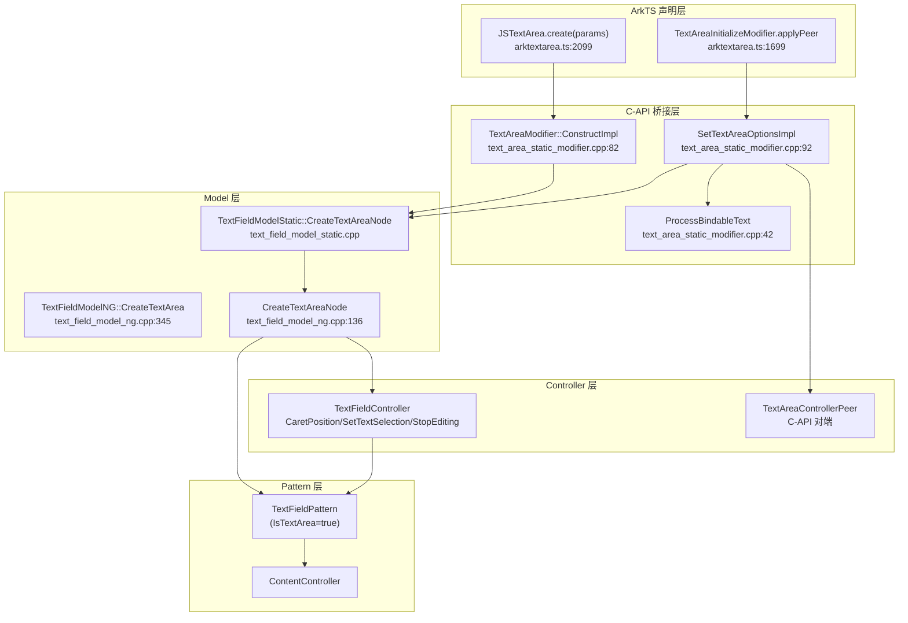
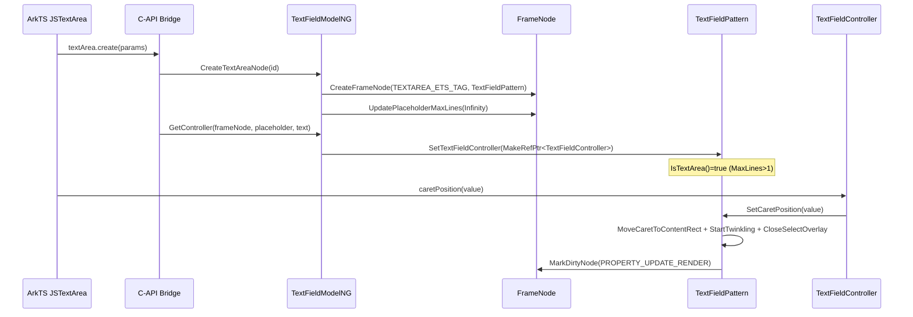

# 架构设计

> TextArea 组件功能域的架构设计文档，补录已有实现。TextArea 与 TextInput 共用 TextFieldPattern，通过 `IsTextArea()` 属性判别与 `TEXTAREA_ETS_TAG` 标签区分多行行为。

## 设计元数据

| 字段 | 内容 |
|------|------|
| Design ID | DESIGN-Func-05-09-05 |
| 关联需求 | 已有能力补录（无独立 requirement.md） |
| 关联 Epic | 无 |
| 目标 Feature | Feat-01 内容创建与控制器（TextAreaOptions/TextArea 构造/setTextAreaOptions/TextAreaController:caretPosition/setTextSelection/stopEditing）, Feat-02 字体与文本样式, Feat-03 行布局与溢出截断, Feat-04 键盘与输入法交互, Feat-05 光标选择与剪贴板, Feat-06 编辑事件回调 |
| 复杂度 | 标准 |
| 目标版本 | API 7 起支持，API 8/10/12/23/24/26 有 API 新增；静态版 @since 23 static |
| Owner | ArkUI SIG |
| 状态 | Baselined（已有实现补录） |

## 需求基线

| 项 | 内容 |
|----|------|
| 问题陈述 | 开发者需要通过声明式 API 创建多行文本输入区域，控制占位文本、当前值、光标位置、选区与编辑状态生命周期；TextArea 需与 TextInput 共享底层 Pattern/Model/Controller 以复用编辑能力 |
| 核心目标 | （Feat-01）提供 TextAreaOptions（placeholder/text/controller）、TextArea 构造、setTextAreaOptions、TextAreaController（caretPosition/setTextSelection/stopEditing）四组创建与控制器能力，支持 ArkTS 动态版（@since 7/8/10）、ArkTS 静态版（@since 23 static）、C-API 三种入口；setTextAreaOptions 为静态专属未发布 API（@since 26.1.0 staticonly） |
| P0 AC | TextArea 创建后以 `TEXTAREA_ETS_TAG` 标签与 `PlaceholderMaxLines=Infinity` 配置 TextFieldPattern，`IsTextArea()` 返回 true；controller.caretPosition 移动光标并关闭选区覆盖层；controller.setTextSelection 钳制到文本长度并按 start/end 相等与否分别走光标/选区分支；controller.stopEditing 执行失焦→提交选区→停闪烁→关 IME→标记渲染五步且幂等 |

## 上下文和现状

### 涉及仓和模块

| 仓库 | 模块/路径 | 当前职责 | 本 Feature 影响 |
|------|-----------|----------|-----------------|
| ace_engine | `frameworks/core/components_ng/pattern/text_field/text_field_pattern.h/cpp` | TextFieldPattern — TextArea 实际使用的 Pattern（含 IsTextArea/SetCaretPosition/SetSelectionFlag/StopEditing） | 核心逻辑 |
| ace_engine | `frameworks/core/components_ng/pattern/text_field/text_field_model_ng.h/cpp` | TextFieldModelNG — Model 层 CreateTextArea/CreateTextAreaNode/CreateNode | 创建入口 |
| ace_engine | `frameworks/core/components_ng/pattern/text_field/text_field_model_static.h/cpp` | TextFieldModelStatic — 静态版 Model 代理 | 静态版入口 |
| ace_engine | `frameworks/core/components_ng/pattern/text_field/text_field_controller.h/cpp` | TextFieldController — Controller 层（CaretPosition/SetTextSelection/StopEditing） | 控制器 |
| ace_engine | `frameworks/core/components_ng/pattern/text_field/text_field_model.h` | TextFieldControllerBase（=TS TextContentControllerBase）+ SelectionOptions/MenuPolicy/HandlePolicy 定义 | 抽象基类 |
| ace_engine | `frameworks/core/components_ng/pattern/text_field/text_field_layout_property.h` | TextFieldLayoutProperty — Placeholder 等 属性存储 | 属性存储 |
| ace_engine | `frameworks/core/components_ng/pattern/text_field/content_controller.h` | ContentController — text 值运行时存储（content_ 成员） | 数据存储 |
| ace_engine | `frameworks/core/components_ng/pattern/text_field/text_field_content_modifier.h/cpp` | TextFieldContentModifier — textValue_/placeholderValue_ 渲染属性 | 渲染层 |
| ace_engine | `frameworks/core/components_ng/pattern/text_field/text_field_pattern_multi_thread.cpp` | 多线程变体 SetCaretPositionMultiThread/SetSelectionFlagMultiThread/StopEditingMultiThread | 并发模型 |
| ace_engine | `frameworks/core/components_ng/pattern/text_area/text_area_pattern.h` | TextAreaPattern 声明（**未实例化，死代码/脚手架**） | 架构约束 |
| ace_engine | `frameworks/core/components_ng/pattern/text_area/bridge/text_area_static_modifier.cpp` | C-API 静态桥 — ConstructImpl/SetTextAreaOptionsImpl/ProcessBindableText | 静态版桥接 |
| ace_engine | `frameworks/core/components_ng/pattern/text_area/bridge/text_area_dynamic_modifier.cpp` | C-API 动态桥 — CreateTextArea | 动态版桥接 |
| ace_engine | `frameworks/core/components_ng/pattern/text_area/bridge/text_area_model_common.h` | 动态模型加载器 GetTextFieldModelImpl | 模块加载 |
| ace_engine | `frameworks/core/components_ng/pattern/text_area/bridge/text_area_dynamic_module.cpp` | GetModel() 返回 &TextFieldModelNG 实例 | 模块加载 |
| ace_engine | `frameworks/core/interfaces/native/implementation/text_area_controller_peer.h` | TextAreaControllerPeer — C-API 控制器对端 | C-API 入口 |
| ace_engine | `frameworks/core/interfaces/native/implementation/text_area_controller_accessor.cpp` | CaretPositionImpl/SetTextSelectionImpl/StopEditingImpl | C-API 入口 |
| ace_engine | `frameworks/core/interfaces/native/implementation/text_content_controller_base_peer.h` | TextContentControllerBasePeer — 基类对端 | C-API 入口 |
| ace_engine | `frameworks/core/interfaces/native/generated/interface/arkoala_api_generated.h` | Ark_TextAreaOptions/Opt_TextAreaOptions 结构 + setTextAreaOptions 函数指针 | 静态版 vtable |
| ace_engine | `frameworks/bridge/declarative_frontend/jsview/js_textarea.h/cpp` | JSTextAreaController — 39 行桩，别名 JSTextEditableController 为 "TextAreaController" | JS 桥接（仅控制器） |
| ace_engine | `frameworks/bridge/declarative_frontend/jsview/js_text_editable_controller.h/cpp` | JSTextEditableController — 共享控制器实现（CaretPosition/SetTextSelection/StopEditing） | JS 桥接 |
| ace_engine | `frameworks/bridge/declarative_frontend/jsview/js_text_editable_controller_binding.h/cpp` | JSTextEditableControllerBinding — SetTextSelection 等 CustomMethod | JS 桥接 |
| ace_engine | `frameworks/bridge/declarative_frontend/ark_direct_component/src/arktextarea.ts` | ArkTS 视图桥 — JSTextArea.create / ArkTextAreaComponent / TextAreaInitializeModifier | ArkTS 视图桥 |
| ace_engine | `frameworks/bridge/declarative_frontend/engine/jsi/jsi_declarative_engine.cpp` | "TextArea" → "arkui.components.arktextarea" 模块映射 | 引擎注册 |
| ace_engine | `frameworks/bridge/declarative_frontend/engine/jsi/jsi_view_register_impl.cpp` | "TextAreaController" → JSTextAreaController::JSBind 注册 | 引擎注册 |
| ace_engine | `frameworks/core/components_ng/pattern/text_field/text_field_paint_method.cpp` | 推送 placeholder 到 ContentModifier | 渲染层 |
| ace_engine | `frameworks/core/components_v2/inspector/inspector_constants.h` | TEXTAREA_ETS_TAG 常量定义 | 标签定义 |
| sdk-js | `api/@internal/component/ets/text_area.d.ts` | ArkTS 动态版 API 声明 | 类型定义 |
| sdk-js | `api/arkui/component/textArea.static.d.ets` | ArkTS 静态版 API 声明 | 类型定义 |
| sdk-js | `api/arkui/TextAreaModifier.d.ts` / `TextAreaModifier.static.d.ets` | Modifier 声明 | 类型定义 |

### 调用链层级分析

| 层 | 模块 | 职责 | 修改类型 |
|----|------|------|----------|
| L1 ArkTS 声明层 | `arktextarea.ts` JSTextArea.create / ArkTextAreaComponent.initialize / TextAreaInitializeModifier.applyPeer | 解析 TextAreaOptions，调用 napi textArea.create / setTextAreaInitialize | 复用 |
| L2 C-API 静态桥 | `text_area_static_modifier.cpp` ConstructImpl / SetTextAreaOptionsImpl / ProcessBindableText | 创建 FrameNode（TextFieldModelStatic::CreateTextAreaNode），解析 placeholder/text/controller，处理 Bindable text 的 onChange 回调注册 | 复用 |
| L3 C-API 动态桥 | `text_area_dynamic_modifier.cpp` CreateTextArea | 动态创建路径，返回 controller 句柄 | 复用 |
| L4 Model 层 | `text_field_model_ng.cpp` CreateTextArea / CreateTextAreaNode / CreateNode / UpdateTextFieldPattern | 创建 FrameNode（TEXTAREA_ETS_TAG + TextFieldPattern），设置 PlaceholderMaxLines=Infinity，初始化 ContentController、主题、默认样式 | 复用 |
| L5 Controller 层 | `text_field_controller.cpp` CaretPosition / SetTextSelection / StopEditing | 持有 pattern 弱引用，转发到 TextFieldPattern；SetTextSelection 做 end<start 早退 + 钳制 + ScheduleTaskWithLayoutDeferral 延迟 | 复用 |
| L6 Pattern 层 | `text_field_pattern.cpp` SetCaretPosition / SetSelectionFlag / StopEditing / IsTextArea | 光标移动/选区手柄/IME 关闭/失焦；IsTextArea 基于 MaxLines 判别 | 复用 |
| L7 多线程 Pattern | `text_field_pattern_multi_thread.cpp` SetCaretPositionMultiThread / SetSelectionFlagMultiThread / StopEditingMultiThread | 跨实例场景下 PostAfterAttachMainTreeTask 延迟执行 | 复用 |
| L8 属性存储层 | `text_field_layout_property.h` Placeholder (PROPERTY_UPDATE_MEASURE) / `content_controller.h` content_ | placeholder 存布局属性，text 存 ContentController 运行时对象 | 复用 |
| L9 渲染层 | `text_field_content_modifier.cpp` textValue_ / placeholderValue_ / `text_field_paint_method.cpp` SetPlaceholderValue | PropertyU16String 动画属性，paint 推送 placeholder | 复用 |
| L10 JS 控制器桥 | `js_textarea.cpp` JSBind / `js_text_editable_controller.cpp` CaretPosition/SetTextSelection/StopEditing | C++ JS 桥，caretPosition 含 API 12 负值钳制 guard | 复用 |
| L11 C-API 控制器桥 | `text_area_controller_accessor.cpp` CaretPositionImpl/SetTextSelectionImpl/StopEditingImpl | C-API 控制器入口，caretPosition 始终钳制 max(value,0) | 复用 |

检查项：
- [x] 调用链每一层都已覆盖（从 ArkTS 声明层到渲染层、JS/C-API 双入口控制器）
- [x] 每层职责边界清晰：ArkTS 解析 → C-API 桥创建 → Model 创建节点 → Controller 转发 → Pattern 执行 → 属性/渲染存储
- [x] 每层修改类型明确（均为"复用"，TextArea 无独立 Pattern/Model/Controller 类实例）

### 适用架构规则

| Rule ID | 适用原因 | 设计结论 | 验证方式 |
|---------|----------|----------|----------|
| OH-ARCH-LAYERING | ArkTS → C-API 桥 → Model → Pattern 多层调用 | 调用方向自上而下单向；JS 控制器桥与 C-API 控制器桥为并列入口 | 架构评审/依赖检查 |
| OH-ARCH-SUBSYSTEM | TextArea 与 TextInput 共享 text_field 子系统 | 允许共享，通过 IsTextArea() 属性判别区分行为 | 代码评审 |
| OH-ARCH-API-LEVEL | 涉及 Public API（TextAreaOptions/TextAreaController）+ 静态专属未发布 API（setTextAreaOptions）| Public API @since 7/8/10 dynamic、@since 23 static；setTextAreaOptions @since 26.1.0 staticonly @unpublished | API 评审/XTS |
| OH-ARCH-COMPONENT-BUILD | 无新增 BUILD 目标，复用 text_field 模块 | 无 BUILD.gn/bundle.json 变更 | 构建验证 |
| OH-ARCH-ERROR-LOG | StopEditing 含 TAG_LOGI 日志 | 日志 tag ACE_TEXT_FIELD | hilog |

## 不涉及项承接

| 维度 | 设计结论 |
|------|----------|
| 独立 Pattern 类 | 不涉及：TextAreaPattern 头文件存在但从未实例化，TextArea 复用 TextFieldPattern，靠 IsTextArea() 属性判别 |
| 独立 Model 类 | 不涉及：TextArea 复用 TextFieldModelNG/TextFieldModelStatic，text_area/bridge 仅做转发 |
| 独立 Controller 类 | 不涉及：TextAreaController(TS) → TextFieldController(C++) via JSTextEditableController 别名 |
| 新增构建目标 | 不涉及：复用现有 text_field BUILD 目标 |
| 新增权限 | 不涉及：TextAreaOptions/Controller 不要求权限（voiceButton 系统权限属 Feat-04 范围） |

## 关键设计决策

| 决策 ID | 问题 | 推荐方案 | 探索过的替代方案 | 取舍理由 | 影响 |
|---------|------|----------|------------------|----------|------|
| ADR-1 | TextArea 应否独立 Pattern 类？ | **共用 TextFieldPattern，属性判别 IsTextArea()**：CreateTextAreaNode 创建 TextFieldPattern + TEXTAREA_ETS_TAG + PlaceholderMaxLines=Infinity，运行时 IsTextArea() 返回 true | (a) 独立 TextAreaPattern 子类（已存在头文件脚手架）；(b) 完全合并无判别 | TextArea 与 TextInput 编辑逻辑高度重叠（光标/选区/IME/剪贴板），独立 Pattern 会重复 90%+ 代码；属性判别零成本复用 | 所有行为规格均标注"TextFieldPattern 提供，IsTextArea() 区分"；TextAreaPattern 头文件为死代码/脚手架，不写入规格行为 |
| ADR-2 | C++ JS 桥是否包含 TextArea 视图创建？ | **三层桥接分裂**：C++ js_textarea.cpp 仅 39 行桩（只注册控制器别名），视图创建与 TextAreaOptions 解析在 ArkTS arktextarea.ts + C-API text_area_static_modifier.cpp | (a) C++ JSTextArea::Create 全量解析（传统模式）；(b) 纯 ArkTS 无 C-API 桥 | 静态版/ASTC 架构要求 C-API 统一入口；ArkTS 桥可生成化；C++ JS 桥仅保留控制器以兼容旧运行时 | 调用链分析需跨三层；Bindable text 处理仅在 C-API 桥 |
| ADR-3 | text 属性的 Bindable 形式如何处理？ | **ProcessBindableText 分发联合类型**：Bindable<string>/Bindable<ResourceStr> 注册 onChange 回调到 SetOnChangeEvent；Bindable<Resource> no-op（注释"应从 SDK 删除"）；纯 ResourceStr 直接转 u16string | (a) 在 C++ JS 桥处理（不可行，JS 桥不接触 Bindable）；(b) 在 ArkTS 层展开（丢失类型信息） | C-API 桥是唯一能访问联合类型的层；onChange 回调实现双向绑定语义 | 规格需记录三种 Bindable 分支；Bindable<Resource> 标记为风险项 |
| ADR-4 | caretPosition 负值如何处理？ | **API 12 行为边界**：C++ JS 桥仅在 GreatOrEqualTargetAPIVersion(VERSION_TWELVE) 时钳负值为 0；C-API 访问器始终钳制 max(value,0) | (a) 统一始终钳制（破坏 API<12 兼容）；(b) 不钳制（历史 bug） | 历史 API<12 透传负值，API12+ 修复为钳制；C-API 作为新入口采用修复后行为 | 兼容性声明标注 API 12 边界；AC 需覆盖两版本行为 |
| ADR-5 | setTextSelection start==end 时按选区还是光标？ | **相等即光标**：selectionStart==selectionEnd 走 MoveCaretToContentRect+StartTwinkling；不等走 HandleSetSelection+MoveHandle | (a) 相等时也走选区分支（空选区）；(b) 早退不处理 | 相等选区无意义，光标模式更符合预期 | AC 需覆盖相等/不等/反向/超范围分支 |
| ADR-6 | stopEditing 是否幂等？ | **幂等**：!HasFocus() 时直接 return，不重复关闭 IME | (a) 不幂等，重复调用重复关 IME（浪费）；(b) 抛错 | 调用方可能多次调用，幂等避免副作用 | AC 需覆盖已失焦/未失焦两场景 |
| ADR-7 | setTextAreaOptions 归属哪个 API 平面？ | **静态专属未发布**：仅在 textArea.static.d.ets @since 26.1.0 staticonly @unpublished + C-API 桥；动态 API 与 C++ JS 桥均无 | (a) 三平面统一（不可行，动态 API 无 setTextAreaOptions）；(b) 仅 C++ 桥 | 静态版/ASTC 引入运行时重设 options 能力，动态版无此需求 | 规格标注该 API 静态专属未发布；不写入动态版行为 |
| ADR-F2-1 | placeholderColor 为何双存储（paint flag + layout color）？ | **paint bool flag + layout color**：SetPlaceholderColor 写 LayoutProperty PlaceholderTextColor + paint PlaceholderColorFlagByUser=true；paint PlaceholderColor 字段为 inspector-only 从不写入 | (a) 仅 paint color；(b) 仅 layout color | paint flag 区分用户设置 vs 主题默认，主题切换时回退；layout color 实际渲染 | Feat-02 AC-2.x |
| ADR-F2-2 | strokeWidth 负值为何切换 fill-brush？ | **符号语义**：>0=RSPen stroke；<0=RSBrush fill（用 textColor）；=0=无 | (a) 负值拒绝；(b) 统一 pen | 负值描边无意义，fill 模式复用语义 | Feat-02 AC-6.1~6.3 |
| ADR-F2-3 | shaderStyle gradient/color 为何互斥？ | **后设 reset 先设**：SetGradientShaderStyle reset ColorShaderStyle；SetColorShaderStyle reset GradientShaderStyle；color shader 仅 strokeWidth=0 时构造 brush | (a) 共存（渲染冲突）；(b) 优先级链 | 互斥避免渲染歧义；color shader 与 pen 冲突 | Feat-02 AC-6.6~6.8 |
| ADR-F3-1 | textOverflow 为何仅在非 DEFAULT 时截断？ | **显式截断**：HasTextOverflow && value!=DEFAULT 才截断；DEFAULT 时 TextArea=CLIP，INLINE+非TextArea=ELLIPSIS | (a) DEFAULT 也截断；(b) 始终 ELLIPSIS | DEFAULT 表示"未显式设置"，按 style 给隐式默认 | Feat-03 AC-2.1,2.2 |
| ADR-F3-2 | maxLines 为何拆为 MaxViewLines/NormalMaxViewLines/OverflowMode？ | **三属性协作**：C-API SetMaxLinesImpl 拆写三者；ShouldUseInfiniteMaxLines(OverflowMode=Scroll+非ELLIPSIS)→无限 | (a) 单 MaxLines；(b) 不区分 view/normal | INLINE 与 DEFAULT 模式行数上限不同；Scroll 模式需无限 | Feat-03 AC-2.4,2.6 |
| ADR-F3-3 | horizontalScrolling 静态 SetHorizontalScrollingImpl 为何是 no-op 桩？ | **静态桩+动态桥**：text_area_static_modifier.cpp:995-1000 为空体；实际经 text_area_dynamic_modifier.cpp:2173 | (a) 静态桥完整实现；(b) 仅动态 | 静态桥未实现该属性，遗留动态桥路径 | Feat-03 AC-5.5 风险项 |
| ADR-F3-4 | textDirection 为何不重赋 algorithm 成员？ | **主段落内容推导**：direction_=AUTO/textDirection_=INHERIT 从不在 algorithm 中重赋；ParagraphUtil::GetTextOwnDirection 按内容推导 | (a) 用属性值覆盖；(b) 完全忽略属性 | 内容推导保证混合文本方向正确；属性值用于 autofill/selection 对齐 | Feat-03 AC-7.3 |
| ADR-F3-5 | style 为何是 paint 属性而非 layout？ | **InputStyle 存 paint PROPERTY_UPDATE_RENDER**：INLINE/DEFAULT 影响 overflow 默认/maxViewLines/counter，但样式本身是渲染级 | (a) layout 属性；(b) pattern 成员 | style 切换触发渲染更新即可；MaxLines 等联动属性单独处理 | Feat-03 AC-8.1 |
| ADR-F4-1 | customKeyboard 为何不获焦但阻断手势？ | **overlay 呈现+手势拦截**：customKeyboard 经 overlayManager BindKeyboard 呈现；不获焦避免抢编辑焦点；阻断手势防止误触 | (a) 获焦；(b) 不阻断手势 | 不获焦保持 TextArea 焦点；阻断手势避免误操作 | Feat-04 AC-3.x |
| ADR-F4-2 | enablePreviewText 预览文本为何走独立操作队列？ | **SET_PREVIEW_TEXT/SET_PREVIEW_FINISH 独立队列**：绕过 ExecuteInsertValueCommand，不触发 Will/Did 四回调 | (a) 复用插入队列；(b) 预览即时触发回调 | 预览为临时态，不应触发插入/删除语义回调；仅触发 WillChange/onChange | Feat-04 AC-6.5, Feat-06 AC-7.1 |
| ADR-F4-3 | maxLength 超限为何抖动+变红？ | **UltralimitShake+HandleCountStyle**：showCountBorderStyle_=true→underlineWidth=ERROR/borderColor=red+InterpolatingSpring 抖动 | (a) 静默截断；(b) 仅变红 | 抖动提供强视觉反馈；emoji 感知截断避免半字符 | Feat-04 AC-12.1,12.8 |
| ADR-F4-4 | ProcessAutoFillOnFocus 为何 API18 门控？ | **API18 早退**：host->LessThanAPITargetVersion(VERSION_EIGHTEEN) 时 ProcessAutoFillOnFocus return | (a) 无门控；(b) API12 门控 | 自动填充聚焦触发为 API18 新能力，低版本不支持 | Feat-04 AC-8.5 |
| ADR-F5-1 | caretColor 为何自 API12 起驱动手柄颜色？ | **统一颜色**：selectOverlay handleColor = paintProperty CursorColor（API12 起）；API<12 手柄用主题色 | (a) 始终统一；(b) 手柄独立属性 | API12 统一视觉，减少属性；旧版本兼容 | Feat-05 AC-1.4 |
| ADR-F5-2 | selectedBackgroundColor 为何不透明自动 0.2？ | **ChangeOpacity(DEFAULT_OPACITY=0.2)**：SetSelectedBackgroundColor 检测 alpha==255(不透明) 则 ChangeOpacity(0.2) | (a) 原样存储；(b) 强制 0.2 | 用户传纯色时给合理透明度；已设透明度则尊重 | Feat-05 AC-2.1 |
| ADR-F5-3 | copyOption=None 为何禁用拖拽？ | **InitDragEvent 门控**：GetCopyOptionsValue!=None && !password && draggable 才 InitDragDropEvent；None→ClearDragDropEvent | (a) None 仅禁用复制；(b) 不禁用拖拽 | None 语义为"不可复制/剪切/分享/拖拽"，统一禁用 | Feat-05 AC-5.1,5.2 |
| ADR-F5-4 | onWillCopy/onWillCut 为何 @since 26 新增？ | **拦截回调**：Callback<string,boolean> 返回 false 取消 clipboard SetData/DeleteRange | (a) 仅 onCopy/onCut 通知；(b) 早期即拦截 | 通知型回调无法取消操作；@since 26 补齐拦截能力 | Feat-05 AC-4.3,4.7 |
| ADR-F6-1 | onChange 为何布局后延迟触发？ | **AddTextFireOnChange 延迟任务**：经 after-layout task 构建 ChangeValueInfo 并 FireOnChange | (a) 即时触发；(b) 布局前触发 | 布局后值已稳定，避免布局中值变化导致重复/错误回调 | Feat-06 AC-1.2 |
| ADR-F6-2 | onWillChange 返回 false 为何回滚已应用变更？ | **RecoverTextValueAndCaret/SetTextValue 回滚**：onWillChange 在变更已应用后触发，返回 false 则恢复旧值+光标 | (a) 变更前拦截（如 onWillInsert）；(b) 不回滚 | onWillChange 在 onWillInsert/onWillDelete 之后、变更已应用时触发，需回滚机制 | Feat-06 AC-3.3 |
| ADR-F6-3 | Will/Did 四回调为何仅系统输入法触发？ | **isIMEOrAutoFill 门控**：ExecuteInsertValueCommand 中 isIMEOrAutoFill=(reason==IME)||(reason==AUTO_FILL)；编程式插入 reason=NONE 跳过 | (a) 所有插入触发；(b) 仅 IME（不含 AutoFill） | 系统输入法有预编辑/候选词语义；编程式插入无此语义；AutoFill 视同 IME | Feat-06 AC-8.x |

## 设计骨架

### 骨架范围

| 骨架项 | 目标 | 不包含 | 验证方式 |
|--------|------|--------|----------|
| TextArea 创建 | TEXTAREA_ETS_TAG + TextFieldPattern + PlaceholderMaxLines=Infinity | TextInput 创建路径 | 单测/XTS |
| Controller 三方法 | caretPosition/setTextSelection/stopEditing 完整行为 | 其他控制器方法（addText/deleteText 等属 RichEditor 共享） | 单测/XTS |
| Bindable text | 三种 Bindable 形式 + onChange 注册 | Bindable<Resource> no-op 不展开 | 集成测试 |
| setTextAreaOptions | 静态专属运行时重设 options | 动态版无对应 | 静态版测试 |

### 骨架 Spec 拆分

| Task ID | 目标 | 受影响文件 | AC |
|---------|------|-----------|-----|
| TASK-SKELETON-1 | 创建 + Controller 三方法 + Bindable text + setTextAreaOptions | text_field_model_ng.cpp, text_field_controller.cpp, text_field_pattern.cpp, text_area_static_modifier.cpp, js_text_editable_controller.cpp | Feat-01 AC-1.x~AC-6.x |

## 后续 Task 拆分

| Task ID | 目标 | 受影响文件 | 依赖 |
|---------|------|-----------|------|
| TASK-01 | Feat-01 内容创建与控制器规格补录 | specs/.../05-text-area/Feat-01-content-creation-controller-spec.md | 无（基线） |
| TASK-02 | Feat-02 字体与文本样式规格补录 | specs/.../05-text-area/Feat-02-font-text-styles-spec.md | TASK-01 |
| TASK-03 | Feat-03 行布局与溢出截断规格补录 | specs/.../05-text-area/Feat-03-layout-overflow-spec.md | TASK-01 |
| TASK-04 | Feat-04 键盘与输入法交互规格补录 | specs/.../05-text-area/Feat-04-keyboard-ime-spec.md | TASK-01 |
| TASK-05 | Feat-05 光标选择与剪贴板规格补录 | specs/.../05-text-area/Feat-05-caret-selection-clipboard-spec.md | TASK-01 |
| TASK-06 | Feat-06 编辑事件回调规格补录 | specs/.../05-text-area/Feat-06-editing-events-spec.md | TASK-01 |

## API 签名、Kit 与权限

### 新增 API

| API 签名 | 类型 | Kit | d.ts 位置 | 权限要求 | SysCap |
|----------|------|-----|----------|---------|--------|
| `TextArea(value?: TextAreaOptions): TextAreaAttribute` | Public | ArkUI | `api/@internal/component/ets/text_area.d.ts` (@since 7) / `api/arkui/component/textArea.static.d.ets` (@since 23 static) | 无 | SystemCapability.ArkUI.ArkUI.Full |
| `class TextAreaController extends TextContentControllerBase` | Public | ArkUI | 同上 (@since 8 / @since 23 static) | 无 | 同上 |
| `TextAreaController.caretPosition(value: number): void` | Public | ArkUI | 同上 (@since 8 / @since 23 static 用 int) | 无 | 同上 |
| `TextAreaController.setTextSelection(start: number, end: number, options?: SelectionOptions): void` | Public | ArkUI | 同上 (@since 10 / @since 23 static 用 int) | 无 | 同上 |
| `TextAreaController.stopEditing(): void` | Public | ArkUI | 同上 (@since 10 / @since 23 static) | 无 | 同上 |
| `interface TextAreaOptions { placeholder?: ResourceStr; text?: ResourceStr \| Bindable<...>; controller?: TextAreaController }` | Public | ArkUI | 同上 (@since 7 / @since 23 static 含 Bindable 联合) | 无 | 同上 |
| `TextAreaAttribute.setTextAreaOptions(value?: TextAreaOptions): this` | InnerApi(未发布) | ArkUI | `api/arkui/component/textArea.static.d.ets` (@since 26.1.0 staticonly @unpublished) | 无 | 同上 |

### 变更/废弃 API

| 原有 API | 变更类型 | 新 API | 迁移说明 |
|----------|----------|--------|----------|
| `caretPosition(value: number)` (dynamic @since 8) | 变更 | `caretPosition(value: int)` (static @since 23 static) | 静态版参数类型 number→int，语义不变 |
| `setTextSelection(start: number, end: number, ...)` (dynamic @since 10) | 变更 | `setTextSelection(start: int, end: int, ...)` (static @since 23 static) | 参数类型 number→int |
| `text?: ResourceStr` (dynamic @since 7) | 变更 | `text?: ResourceStr \| Bindable<ResourceStr> \| Bindable<Resource> \| Bindable<string>` (static @since 23 static) | 静态版新增 Bindable 联合类型，支持双向绑定 |

## 构建系统影响

### BUILD.gn 变更

```text
文件: 无变更
说明: TextArea 复用 text_field 模块现有 BUILD 目标，无新增源文件
```

### bundle.json 变更

```text
无新增 component / 修改依赖关系
```

## 可选设计扩展

### 架构图



### 数据流/控制流

| 步骤 | 调用方 | 被调用方 | 数据/接口 | 说明 |
|------|--------|----------|-----------|------|
| 1 | ArkTS JSTextArea.create | napi textArea.create | TextAreaOptions | 解析参数 |
| 2 | napi | ConstructImpl | FrameNode | 创建节点 |
| 3 | ConstructImpl | TextFieldModelStatic::CreateTextAreaNode | id,u"",u"" | 静态创建 |
| 4 | CreateTextAreaNode | FrameNode::CreateFrameNode | TEXTAREA_ETS_TAG+TextFieldPattern | 节点+Pattern |
| 5 | CreateTextAreaNode | UpdatePlaceholderMaxLines | Infinity | 使 IsTextArea()=true |
| 6 | SetTextAreaOptionsImpl | ProcessBindableText | text 联合类型 | 解析 Bindable |
| 7 | SetTextAreaOptionsImpl | TextFieldModelStatic::GetController | placeholder,text | 绑定 controller |
| 8 | TextFieldController::CaretPosition | TextFieldPattern::SetCaretPosition | position | 光标移动 |
| 9 | SetCaretPosition | MoveCaretToContentRect+StartTwinkling+CloseSelectOverlay | position | 光标+关选区 |
| 10 | TextFieldController::StopEditing | TextFieldPattern::StopEditing | — | 失焦+关IME |

### 时序设计



### 数据模型设计

| 层 | 类型 | 文件 | 字段/说明 |
|----|------|------|-----------|
| TS API | `TextAreaOptions` | text_area.d.ts / textArea.static.d.ets | placeholder?: ResourceStr; text?: ResourceStr \| Bindable<...>; controller?: TextAreaController |
| C-API | `Ark_TextAreaOptions` | arkoala_api_generated.h:22363 | placeholder; text(union); controller |
| C++ 属性 | `TextFieldLayoutProperty::Placeholder` | text_field_layout_property.h:290 | std::u16string, PROPERTY_UPDATE_MEASURE |
| C++ 运行时 | `ContentController::content_` | content_controller.h:110 | std::u16string (text 真值) |
| C++ 渲染 | `TextFieldContentModifier::textValue_` | text_field_content_modifier.h:133 | RefPtr<PropertyU16String> |
| C++ 渲染 | `TextFieldContentModifier::placeholderValue_` | text_field_content_modifier.h:135 | RefPtr<PropertyU16String> |

### 线程与并发模型

| 操作 | 发起线程 | 回调线程 | 跨实例边界 | 线程安全 | 重入约束 |
|------|----------|----------|-----------|----------|----------|
| SetCaretPosition | 主线程 | 主线程 | FREE_NODE_CHECK 检测多实例 | SetCaretPositionMultiThread 延迟到 PostAfterAttachMainTreeTask | 不可重入 |
| SetSelectionFlag | 主线程 | 主线程 | 同上 | SetSelectionFlagMultiThread | 不可重入 |
| StopEditing | 主线程 | 主线程 | 同上 | StopEditingMultiThread | 幂等可重入 |

## 详细设计

### TextArea 创建流程

`TextFieldModelNG::CreateTextArea` (`text_field_model_ng.cpp:345-354`) 调用 `CreateNode(placeholder, value, true)`（isTextArea=true），后者走 `CreateTextAreaNode` 分支（`text_field_model_ng.cpp:136-147`）：

1. `FrameNode::CreateFrameNode(TEXTAREA_ETS_TAG, nodeId, MakeRefPtr<TextFieldPattern>())` — 创建节点，Pattern 为 TextFieldPattern（非 TextAreaPattern）
2. `textFieldLayoutProperty->UpdatePlaceholder(placeholder.value_or(u""))` — 写入 placeholder 到布局属性
3. `textFieldLayoutProperty->UpdatePlaceholderMaxLines(Infinity<uint32_t>())` — 设置占位最大行数为无穷，使 `IsTextArea()` 返回 true
4. `UpdateTextFieldPattern(frameNode, value)` — 初始化主题、InitEditingValueText、SetTextChangedAtCreation、ProcessDefaultStyleAndBehaviors

`IsTextArea()` (`text_field_pattern.cpp:1311-1319`) 判别逻辑：`HasMaxLines() ? GetMaxLinesValue(1) > 1 : true`。TextArea 未设 MaxLines 或设为 >1 即为 true。

### Controller caretPosition

C++ JS 桥 `JSTextEditableController::CaretPosition` (`js_text_editable_controller.cpp:65-78`)：
- API 版本 guard（`js_text_editable_controller.cpp:69`）：`GreatOrEqualTargetAPIVersion(VERSION_TWELVE)` 时负值钳为 0
- 调用 `controller->CaretPosition(caretPosition)`

C-API 桥 `CaretPositionImpl` (`text_area_controller_accessor.cpp:36-41`)：始终 `std::max(value, 0)` 钳制。

`TextFieldController::CaretPosition` (`text_field_controller.cpp:33-42`)：升级 pattern 弱引用，调 `textFieldPattern->SetCaretPosition(caretPosition)`。

`TextFieldPattern::SetCaretPosition` (`text_field_pattern.cpp:8311-8327`)：
1. `FREE_NODE_CHECK(host, SetCaretPosition, ...)` — 多实例时转 SetCaretPositionMultiThread
2. `selectController_->MoveCaretToContentRect(position, DOWNSTREAM, true, moveContent)`
3. `UpdateCaretInfoToController()`
4. `HasFocus() && !magnifierController_->GetShowMagnifier()` → `StartTwinkling()`
5. `CloseSelectOverlay()` / `CancelDelayProcessOverlay()`
6. `TriggerAvoidOnCaretChange()`
7. `host->MarkDirtyNode(PROPERTY_UPDATE_RENDER)`

### Controller setTextSelection

`JSTextEditableControllerBinding::SetTextSelection` (`js_text_editable_controller.cpp:100-132`)：要求 info.Length()>=2，解析 start/end 为 int32_t，可选第三参解析为 SelectionOptions（含 menuPolicy），调 `controller->SetTextSelection(...)`。

`TextFieldController::SetTextSelection` (`text_field_controller.cpp:70-88`)：
1. `selectionEnd < selectionStart` → 直接 return（早退）
2. 钳制 start/end 到 `[0, textLength]`
3. `ScheduleTaskWithLayoutDeferral` 延迟执行 `pattern->SetSelectionFlag(...)`

`TextFieldPattern::SetSelectionFlag` (`text_field_pattern.cpp:8335-8383`)：
1. `FREE_NODE_CHECK` → 多实例转 SetSelectionFlagMultiThread
2. `!HasFocus() || GetIsPreviewText()` → return
3. re-clamp start/end 到 `[0, length]`
4. `selectionStart == selectionEnd` → MoveCaretToContentRect + StartTwinkling（光标模式）
5. 不等 → cursorVisible_=false; showSelect_=true; HandleSetSelection; MoveFirst/SecondHandleToContentRect（顺序由 isForward 决定）
6. RequestKeyboardNotByFocusSwitch(SET_SELECTION) 成功 → NotifyOnEditChanged(true)
7. SetIsSingleHandle(!IsSelected())
8. forceShowHandle = options.forceShowHandle；!IsShowHandle()&&!forceShowHandle → CloseSelectOverlay(true)
9. else: isShowMenu = IsShowMenu(options, isShowMenu)；!isShowMenu&&IsUsingMouse() → CloseSelectOverlay()；else ProcessOverlay
10. TriggerAvoidWhenCaretGoesDown(); MarkDirtyNode(PROPERTY_UPDATE_RENDER)

`SelectionOptions` (`text_field_model.h:204-208`)：`MenuPolicy menuPolicy=DEFAULT; HandlePolicy handlePolicy=DEFAULT; bool forceShowHandle=false`。

`MenuPolicy` (`text_field_model.h:195`)：`DEFAULT=0, HIDE, SHOW`。

`IsShowMenu` (`text_field_pattern.cpp:8391-8403`)：HIDE→false；SHOW→true；DEFAULT→defaultValue。

### Controller stopEditing

`JSTextEditableController::StopEditing` (`js_text_editable_controller.cpp:333-341`)：升级 controller 弱引用，调 `controller->StopEditing()`。

`TextFieldController::StopEditing` (`text_field_controller.cpp:133-142`)：调 `textFieldPattern->StopEditing()`。

`TextFieldPattern::StopEditing` (`text_field_pattern.cpp:9803-9818`)：
1. `FREE_NODE_CHECK(host, StopEditing)` → 多实例转 StopEditingMultiThread
2. `!HasFocus()` → return（幂等早退）
3. `FocusHub::LostFocusToViewRoot()` — 失焦
4. `UpdateSelection(selectController_->GetCaretIndex())` — 提交选区
5. `StopTwinkling()` — 停光标闪烁
6. `CloseKeyboard(true)` — 关 IME
7. `host->MarkDirtyNode(PROPERTY_UPDATE_RENDER)` — 标记渲染

### Bindable text 处理

`ProcessBindableText` (`text_area_static_modifier.cpp:42-73`) 使用 `Converter::VisitUnion` 分发：
- `Ark_ResourceStr` → `Converter::OptConvert<std::u16string>(src)`（无回调）
- `Ark_Bindable_String` → 提取 src.value + 注册 onChange 回调（CallbackHelper 包装）→ `TextFieldModelStatic::SetOnChangeEvent`
- `Ark_Bindable_ResourceStr` → 提取 src.value + 注册 onChange 回调（转回 Ark_ResourceStr）
- `Ark_Bindable_Resource` → **no-op**（注释 "Invalid case, should be deleted from SDK"）

### setTextAreaOptions

`SetTextAreaOptionsImpl` (`text_area_static_modifier.cpp:92-126`)：
1. 解析 `Opt_TextAreaOptions` → placeholder（OptConvert u16string）、text（ProcessBindableText）、controller（GetOpt → peerPtr）
2. `TextFieldModelStatic::GetController(frameNode, placeholder, text)` — 获取/创建 TextFieldController
3. `peerPtr->SetController(controller)` — 绑定 peer 到 native controller
4. flush 缓存的 styledPlaceholder

### 字体与文本样式（Feat-02）

字体核心五属性（fontColor/fontSize/fontStyle/fontWeight/fontFamily）存 FontStyle 组（`text_field_layout_property.h:218-227`），设置后触发 `PreferredTextLineHeightNeedToUpdate`（`text_field_model_ng.cpp:548,554,579,584`）。placeholderColor 双存储：LayoutProperty PlaceholderTextColor + paint PlaceholderColorFlagByUser（`text_field_model_ng.cpp:387-390`）；paint PlaceholderColor 字段为 inspector-only 从不写入。fontFeature 字符串经 `ParseFontFeatureSettings`（`text_style_parser.cpp:341-354`）解析为 FONT_FEATURES_LIST，经 `constants_converter.cpp:717-723` 构造 Rosen::FontFeatures。decoration 拆写四属性（TextDecoration/Color/Style/LineThicknessScale），LineThicknessScale 负值钳为默认（`text_field_model_static.cpp:691`）。strokeWidth 符号语义：>0=RSPen stroke，<0=RSBrush fill（用 textColor），=0=无（`constants_converter.cpp:671-686`）。shaderStyle gradient/color 互斥（`text_field_model_ng.cpp:3088/3093/3099`）。排版辅助四 bool（halfLeading/includeFontPadding/fallbackLineSpacing/enableAutoSpacing）透传 Rosen（`txt_paragraph.cpp:89-109`）。attributeModifier 经 TextAreaModifier applyAndMergeModifier 回放 ModifierMap（`text_area_modifier.ts:491-494`）。

### 行布局与溢出截断（Feat-03）

textAlign JUSTIFY 对 TextInput 强制 START（`text_field_model_ng.cpp:503-505`），TextArea 支持 JUSTIFY。textOverflow 截断仅当非 DEFAULT（`text_field_layout_algorithm.cpp:172-174`）；DEFAULT 时 TextArea=CLIP，INLINE+非TextArea=ELLIPSIS。maxLines C-API 拆写 MaxViewLines/NormalMaxViewLines/OverflowMode（`text_area_static_modifier.cpp:1055-1068`）；ShouldUseInfiniteMaxLines（OverflowMode=Scroll+非ELLIPSIS）→无限（`text_field_layout_algorithm.cpp:1701`）。heightAdaptivePolicy 三策略经 AddAdaptFontSizeAndAnimations 分支（`text_field_layout_algorithm.cpp:1317-1336`）；minFontScale clamp[0,1]，maxFontScale max(,1)（`text_field_model_static.cpp:814,823`）。wordBreak/lineBreakStrategy/ellipsisMode 透传 Rosen（`txt_paragraph.cpp:85,86,88`）。horizontalScrolling 存 pattern 成员 isHorizontalScrolling_（`text_field_pattern.h:2624`），静态 SetHorizontalScrollingImpl 为 no-op 桩（`text_area_static_modifier.cpp:995-1000`），实际经动态桥；IsHorizontalScrollEnabled 门控仅 TextArea+非INLINE+无voiceButton（`text_field_pattern.h:1980-1982`）。textDirection 主段落内容推导（algorithm 成员不重赋，`paragraph_util.cpp:66-79`）。style 存 paint InputStyle（PROPERTY_UPDATE_RENDER），INLINE 需 type=UNSPECIFIED/TEXT（`text_field_pattern.cpp:9360-9370`）。

### 键盘与输入法交互（Feat-04）

enterKeyType TextArea 默认 NEW_LINE（`text_field_model_ng.cpp:435`）；onSubmit 不触发于 NEW_LINE（`text_field_pattern.cpp:7313`）。enableKeyboardOnFocus 经 showKeyBoardOnFocus_ 门控 RequestKeyboard（`text_field_pattern.cpp:5914`）。customKeyboard 经 overlayManager BindKeyboard 呈现，不获焦但阻断手势（`text_field_pattern.cpp:6215-6272`）；跨主机关闭经 ProcessCustomKeyboard（`text_field_pattern.cpp:2079`）。keyboardAppearance/autoCapitalizationMode 传 IME（`text_field_pattern.cpp:6097-6100`）。onWillAttachIME 在 IME attach 前触发，可注入 extraConfig（`text_field_pattern.cpp:5936-5941`）。enablePreviewText 经 hasSupportedPreviewText_ 传 IME isTextPreviewSupported（`text_field_pattern.cpp:6096`）；预览走 SET_PREVIEW_TEXT/SET_PREVIEW_FINISH 独立队列绕过 ExecuteInsertValueCommand（`text_field_pattern.cpp:900-906`）。enableHapticFeedback 长按/拖动振动（`text_field_pattern.cpp:4982,2944`）。enableAutoFill/contentType 经 CheckAutoFill→ProcessAutoFill→container RequestAutoFill（`text_field_pattern.cpp:3869-3943`）；ProcessAutoFillOnFocus API18 门控（`text_field_pattern.cpp:1611`）。stopBackPress 控制 OnBackPressed 消费（`text_field_pattern.cpp:8405-8437`）。voiceButton 系统API，IsShowVoiceButtonMode 门控（`text_field_pattern.cpp:10448-10456`）。type 变化触发 FilterInitializeText 重新过滤（`text_field_pattern.cpp:4828`）。maxLength 超限 showCountBorderStyle_=true→HandleCountStyle 边框红+UltralimitShake 抖动（`text_field_pattern.cpp:4377-4417,6678-6701`）；emoji 感知截断 TextEmojiProcessor::SubU16string（`content_controller.cpp:223-227`）。inputFilter 正则经 FilterWithRegex 剥离+FireOnInputFilterError（`content_controller.cpp:314-411`）。showCounter 需配合 maxLength，INLINE 模式不显示计数器（`text_component_decorator.cpp:336`）。

### 光标选择与剪贴板（Feat-05）

caretColor 写 paint CursorColor + CaretColorFlagByUser（`text_field_model_ng.cpp:452`）；API12 起手柄颜色=光标颜色（`text_field_select_overlay.cpp:379-380`）；CreateTextDragInfo 用 caretColor 作 handleColor（`text_field_pattern.cpp:3110`）。caretStyle 拆为 CursorWidth+CursorColor（`text_area_static_modifier.cpp:227`）。selectedBackgroundColor 不透明自动 ChangeOpacity(0.2)（`text_field_model_static.cpp:259-263`）。editMenuOptions 注册 onCreateMenu/onMenuItemClick/onPrepareMenu 三回调到 BaseTextSelectOverlay（`base_text_select_overlay.h:429-431`）。onWillCopy/onWillCut @since 26 拦截模式返回 false 取消（`text_field_pattern.cpp:2387,2739`）。copyOption=None 禁用复制/剪切/分享/拖拽（`text_field_pattern.cpp:2368,3045-3058`）。onTextSelectionChange 经 TextSelectController 比较 prev vs new index 去重触发（`text_select_controller.cpp:711-734`）。onContentScroll 经 UpdateOverlayModifier 计算 totalOffset 去重触发（`text_field_paint_method.cpp:75-93`）。selectedDragPreviewStyle 用作 dragBackgroundColor（`text_field_pattern.cpp:3131`）。enableSelectedDataDetector 控制 AI 实体检测菜单（`text_field_pattern.cpp:5175,3983-4020`）。scrollBarColor thumb 颜色（`text_field_free_scroller.cpp:243-258`）。barState=Off 内部滚动启用但条隐藏（`text_field_pattern.cpp:4254`）。selectionMenuHidden=true 系统菜单不显示（`text_field_select_overlay.cpp:322,334-340`）。

### 编辑事件回调（Feat-06）

onChange 经 AddTextFireOnChange 布局后延迟触发，携带 previewText，按 value+previewText 去重（`text_field_pattern.cpp:4749-4784`；`text_field_event_hub.h:199-201`）。onEditChange 经 NotifyOnEditChanged 焦点变化触发，按 isEdit_ 去重（`text_field_pattern.cpp:10371-10379`）。onWillChange @since 15 在变更已应用后触发，返回 false 经 RecoverTextValueAndCaret/SetTextValue 回滚（`text_field_pattern.cpp:12777,12806,12833`；`6587-6602,7924`）。onWillInsert/onDidInsert @since 12 仅 isIMEOrAutoFill 触发（`text_field_pattern.cpp:6560,6612`）；BeforeIMEInsertValue 用预插入偏移，AfterIMEInsertValue 用后插入光标（`text_field_pattern.cpp:6404,6431`）。onWillDelete/onDidDelete 同理（`text_field_pattern.cpp:7918,7931`）。回调管道：插入=WillInsert→WillChange→DidInsert→onChange；删除=WillDelete→WillChange→DidDelete→onChange；替换=WillInsert→WillDelete→WillChange→DidDelete→DidInsert→onChange（`text_field_pattern.cpp:6530-6614`）。预览文本走独立操作队列不触发 Will/Did 四回调（`text_field_pattern.cpp:900-906`）。Will/Did 四回调仅系统输入法/AutoFill 触发，编程式插入不触发（`text_field_pattern.cpp:6533`）。

## 风险和开放问题

| 项 | 类型 | 影响 | 处理方式 | Owner |
|----|------|------|----------|-------|
| TextAreaPattern 头文件为死代码/脚手架，从未实例化 | 架构 | 低 | 规格标注共享 Pattern 模式；不在 Feat 行为中引用 TextAreaPattern | ArkUI SIG |
| `Bindable<Resource>` 在 ProcessBindableText 中为 no-op，SDK 注释"应删除" | API | 中 | 规格风险表标注；兼容性声明记录 Bindable<Resource> 无效 | ArkUI SDK |
| caretPosition 负值在 API<12 透传、API12+ 钳制，C-API 始终钳制 | API | 中 | 兼容性声明标注 API 12 行为边界 | ArkUI SIG |
| setTextAreaOptions 为静态专属未发布（@unpublished 26.1.0 staticonly），动态版无对应 | API | 中 | 规格标注静态专属；不写入动态版行为 | ArkUI SDK |
| js_textarea.cpp 仅 39 行桩，TextAreaController 与 TextInputController 为同一 C++ 类（JSTextEditableController） | 架构 | 低 | 规格标注控制器共享；行为规格基于 TextFieldControllerBase | ArkUI SIG |
| SetTextSelection 使用 ScheduleTaskWithLayoutDeferral 延迟执行，实际选区生效在布局延迟后 | 架构 | 中 | 规格行为场景标注延迟语义 | ArkUI SIG |
| placeholderColor 双存储（paint flag + layout color），paint PlaceholderColor 字段为 inspector-only 从不写入 | 架构 | 低 | Feat-02 规格标注双存储机制 | ArkUI SIG |
| strokeWidth 负值切换 fill-brush 模式，使用 textColor 而非 strokeColor | API | 低 | Feat-02 规格标注符号语义 | ArkUI SIG |
| shaderStyle gradient/color 互斥，后设 reset 先设；color shader 仅 strokeWidth=0 时构造 brush | API | 中 | Feat-02 规格风险表标注互斥 | ArkUI SIG |
| textDirection 不重赋 algorithm 成员，主段落方向为内容推导 | 架构 | 中 | Feat-03 规格标注内容推导；属性值仅用于 autofill/selection | ArkUI SIG |
| horizontalScrolling 静态 SetHorizontalScrollingImpl 为 no-op 桩，实际经动态桥 | API | 中 | Feat-03 规格风险表标注静态桩；静态版该属性可能不生效 | ArkUI SDK |
| customKeyboard + stopBackPress=false 时返回可能无法关闭自定义键盘（警告日志） | API | 中 | Feat-04 规格标注需 stopBackPress=true | ArkUI SIG |
| enablePreviewText 预览文本走独立操作队列，不触发 Will/Did 四回调 | 架构 | 低 | Feat-04/Feat-06 规格标注预览独立队列 | ArkUI SIG |
| maxLength 超限 emoji 感知截断 TextEmojiProcessor::SubU16string，避免半字符 | 架构 | 低 | Feat-04 规格标注 emoji 感知 | ArkUI SIG |
| ProcessAutoFillOnFocus API18 门控，低版本不触发聚焦自动填充 | API | 中 | Feat-04 规格兼容性声明标注 API18 边界 | ArkUI SIG |
| caretColor 自 API12 起驱动手柄颜色，API<12 手柄用主题色 | API | 中 | Feat-05 规格兼容性声明标注 API12 边界 | ArkUI SIG |
| selectedBackgroundColor 不透明输入自动 ChangeOpacity(0.2)，已设透明度则尊重 | API | 低 | Feat-05 规格标注透明度处理 | ArkUI SIG |
| copyOption=None 禁用复制/剪切/分享/拖拽全部路径 | API | 低 | Feat-05 规格标注 None 语义 | ArkUI SIG |
| onWillCopy/onWillCut @since 26 新增拦截回调，返回 false 取消操作 | API | 低 | Feat-05 规格标注 @since 26 拦截模式 | ArkUI SDK |
| onChange 布局后延迟触发，携带 previewText，开发者需基于 previewText 调整光标逻辑 | API | 中 | Feat-06 规格标注延迟+previewText 语义 | ArkUI SIG |
| onWillChange 返回 false 回滚已应用变更（RecoverTextValueAndCaret），与 onWillInsert 早退不同 | 架构 | 中 | Feat-06 规格标注回滚 vs 早退区别 | ArkUI SIG |
| Will/Did 四回调仅系统输入法/AutoFill 触发，第三方输入法不触发 | API | 中 | Feat-06 规格兼容性声明标注系统输入法限制 | ArkUI SIG |

## 设计审批

- [x] 需求基线已确认，设计覆盖 P0/P1 AC
- [x] 不涉及项已承接，N/A 和展开项都有结论
- [x] 涉及仓和模块职责清楚
- [x] 调用链层级分析完整，每层覆盖到位
- [x] 适用架构规则已识别并形成设计结论
- [x] 分层和子系统边界合规
- [x] API 变更有签名、权限、错误码和兼容性说明
- [x] BUILD.gn/bundle.json 影响明确
- [x] 设计输出和后续 Task 拆分明确
- [x] 关键设计决策有理由和影响说明
- [x] 风险和开放问题有 Owner

**结论:** 通过（已有实现补录）
