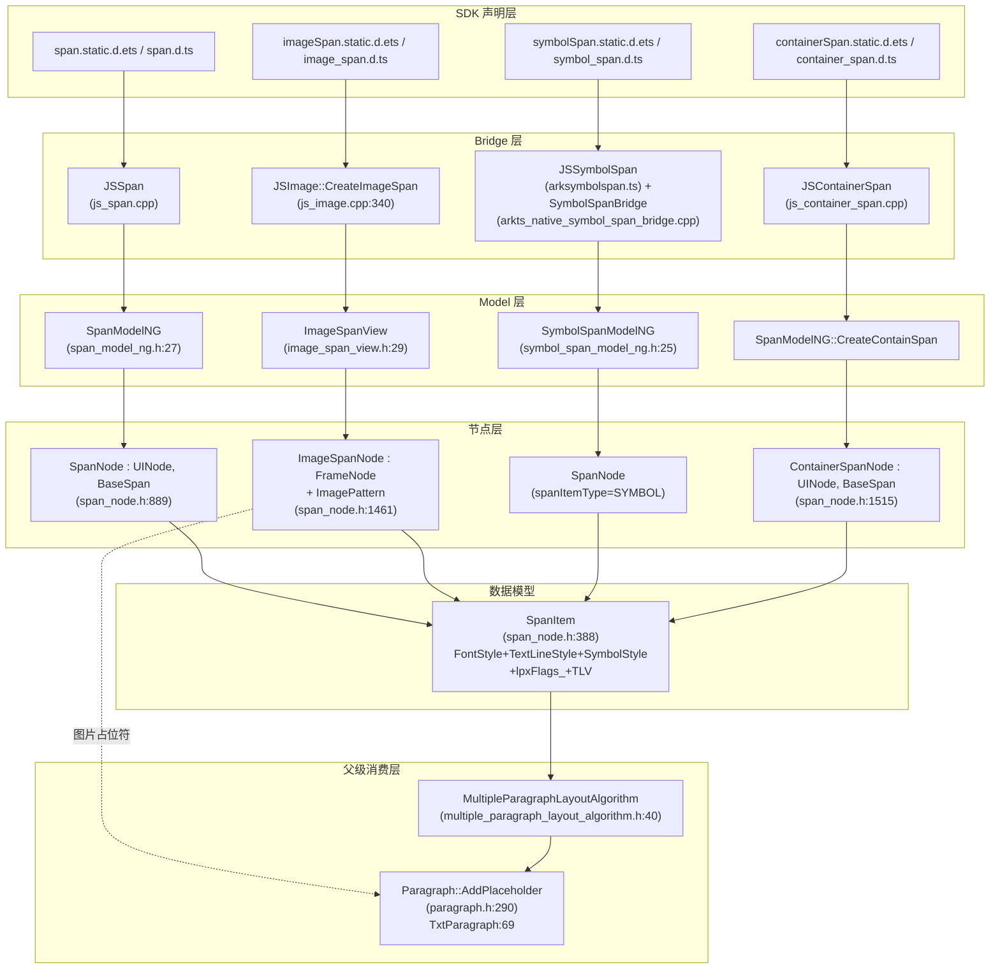

# 架构设计

> 确认目标仓和模块的架构约束、关键设计决策、Spec 拆分方向。
> 本设计覆盖 Span 类（Span/ImageSpan/SymbolSpan/ContainerSpan）四个片段组件的共享架构基线。

## 设计元数据

| Field | Content |
|-------|---------|
| Design ID | DESIGN-Func-05-09-06 |
| 关联需求 | 已有能力补录（无独立 requirement.md） |
| 关联 Epic | 无 |
| 目标 Feature | Feat-01 Span 文本片段组件规格 / Feat-02 ImageSpan 图片片段组件规格 / Feat-03 SymbolSpan 符号片段组件规格 / Feat-04 ContainerSpan 容器片段组件规格 |
| 复杂度 | 复杂 |
| 目标版本 | API 7（Span dynamic 基线）至 API 23（static 全量）至 API 26（dynamic/static 增强） |
| Owner | ArkUI SIG |
| 状态 | Baselined（已有实现补录） |

## 需求基线

| 项 | 补充说明 |
|----|------------------|
| Span 类为 Text/RichEditor 的子片段 | 四个片段组件均不能独立布局/绘制，必须挂载于 Text 或 RichEditor 之下，由父级 Paragraph 管线消费 |
| 覆盖 dynamic + static 双 API 表面 | dynamic 模式（`.d.ts`）自 API 7/10/11 起，static 模式（`.static.d.ets`）自 API 23 起；逐 API 标注 `@since` 版本差异 |
| 不覆盖属性字符串基础设施 | SpanString/MutableSpanString/ArkUI_StyledString/CustomSpan 归属 FuncID 05-09-10（属性字符串），本域仅覆盖组件节点本身 |
| 不覆盖 @unpublished 26.x 预览 API | setXxxOptions/applyAttributesFinish/@Builder 构造等 `@unpublished` 标记 API 不纳入规格契约 |

## 上下文和现状

### 涉及仓和模块

| 仓库 | 补充架构说明 |
|------|-------------|
| ace_engine | Span 类全部实现层（NG 管线）；不含 legacy `frameworks/core/components/text_span/`（冻结） |
| interface/sdk-js | Span 族 12 个 SDK 文件（4 组件 × {static.d.ets, dynamic.d.ts} + 4 个 Modifier 双态文件） |
| interface/sdk-js | NDK 公共 C-API 头 `interfaces/native/native_node.h`、`native_styled_string.h` |

### 调用链层级分析

| 层 | 模块 | 职责 | 修改类型 |
|----|------|------|----------|
| SDK 声明层 | `interface/sdk-js/api/arkui/component/{span,imageSpan,symbolSpan,containerSpan}.static.d.ets`；`interface/sdk-js/api/@internal/component/ets/{span,image_span,symbol_span,container_span}.d.ts`；`interface/sdk-js/api/arkui/{Span,ImageSpan,SymbolSpan,ContainerSpan}Modifier.{d.ts,static.d.ets}` | 四组件 public ArkTS 契约（dynamic + static 双态）+ AttributeModifier 契约 | 补录（无变更） |
| ArkTS Bridge 层 | `frameworks/bridge/declarative_frontend/jsview/js_span.cpp`（JSSpan）；`frameworks/bridge/declarative_frontend/jsview/js_container_span.cpp`（JSContainerSpan）；`frameworks/bridge/declarative_frontend/jsview/js_image.cpp:340`（JSImage::CreateImageSpan）；`frameworks/bridge/declarative_frontend/ark_direct_component/src/arksymbolspan.ts`（JSSymbolSpan） | Span/ContainerSpan 走 JSContainerBase；ImageSpan 复用 JSImage；SymbolSpan 走 ArkTS-native TS | 补录 |
| ArkTS-native Bridge 层 | `frameworks/core/components_ng/pattern/text/span/bridge/image_span/arkts_native_image_span_bridge.cpp`；`frameworks/core/components_ng/pattern/text/span/bridge/symbol_span/arkts_native_symbol_span_bridge.cpp` | ImageSpan/SymbolSpan 的 ArkTS-native 属性注册（Create/SetXxx/Reset） | 补录 |
| Model 层 | `frameworks/core/components_ng/pattern/text/span_model.h:33`（SpanModel）；`span_model_ng.h:27`（SpanModelNG）；`span_model_static.h`（SpanModelStatic）；`pattern/text/span/image_span_view.h:29`（ImageSpanView）；`pattern/text/span/symbol_span_model.h:32`（SymbolSpanModel）；`symbol_span_model_ng.h:25`（SymbolSpanModelNG）；`pattern/text/span/image_span_view_static.h`（ImageSpanViewStatic）；`symbol_span_model_static.h`（SymbolSpanModelStatic） | 四组件创建与属性下发 façade；SpanModelNG 同时服务 ArkTS 与 C-API | 补录 |
| 节点层 | `frameworks/core/components_ng/pattern/text/span_node.h:889`（SpanNode : UINode, BaseSpan）；`span_node.h:1461`（ImageSpanNode : FrameNode）；`span_node.h:1515`（ContainerSpanNode : UINode, BaseSpan）；`span_node.h:1259`（PlaceholderSpanNode : FrameNode）；`span_node.h:1325`（PlaceholderSpanPattern : Pattern） | SpanNode/ContainerSpanNode 为语法节点（非 FrameNode）；ImageSpanNode 复用 ImagePattern；PlaceholderSpanPattern 为全族唯一 Pattern 子类 | 补录 |
| 数据模型层 | `frameworks/core/components_ng/pattern/text/span_node.h:388`（SpanItem）；`span_node.h:1221`（PlaceholderSpanItem）；`span_node.h:1350`（CustomSpanItem）；`span_node.h:1433`（ImageSpanItem）；`pattern/text/text_styles.h:238`（FontStyle）；`text_styles.h:315`（SymbolStyle）；`text_styles.h:361`（TextLineStyle）；`text_styles.h:195`（ImageSpanOptions）；`text_styles.h:44`（CustomSpanOptions） | SpanItem 持有 FontStyle/TextLineStyle/SymbolStyle unique_ptr + lpxFlags_ 位掩码；支持 EncodeTlv/DecodeTlv | 补录 |
| 布局算法层 | `frameworks/core/components_ng/pattern/text/multiple_paragraph_layout_algorithm.h:40`（MultipleParagraphLayoutAlgorithm）；`pattern/text/text_layout_algorithm.h:59`（TextLayoutAlgorithm）；`pattern/rich_editor/rich_editor_layout_algorithm.h`（RichEditorLayoutAlgorithm） | 父级消费 `std::list<RefPtr<SpanItem>>` 构建 Paragraph；UpdateParagraphBySpan 为每 span 段落构建入口 | 补录 |
| 渲染层 | `frameworks/core/components_ng/render/paragraph.h:272`（Paragraph 抽象，AddPlaceholder:290）；`render/adapter/txt_paragraph.h:29`（TxtParagraph，AddPlaceholder:69）；`pattern/text/text_paint_method.h`（TextPaintMethod）；`pattern/rich_editor/rich_editor_paint_method.h`（RichEditorPaintMethod）；`pattern/image/image_paint_method.h`（ImageSpan 经 ImagePattern 使用的 ImagePaintMethod） | Paragraph 管线绘制 span 文本与占位符；ImageSpan 经 ImagePattern 独立绘制图像 | 补录 |
| C-API NDK 层 | `interfaces/native/native_node.h:59`（ARKUI_NODE_SPAN）、`:61`（ARKUI_NODE_IMAGE_SPAN）、`:143`（ARKUI_NODE_CUSTOM_SPAN）；`NODE_SPAN_*`（:3161/3183/3195/3217/3232）、`NODE_IMAGE_SPAN_*`（:3244/3258）；`interfaces/native/node/span_style_native_impl.h`（SpanStyleModel 转换器）；`frameworks/core/interfaces/native/implementation/span_modifier.cpp`、`image_span_modifier.cpp`、`symbol_span_modifier.cpp`、`container_span_modifier.cpp` | Span/ImageSpan/CustomSpan 有公共 NDK 节点类型；SymbolSpan/ContainerSpan 无独立 NDK 节点类型 | 补录 |
| C-API styled-string 层（跨域） | `frameworks/core/components_ng/render/adapter/span_model_adapter.cpp`（SpanModelNG::CreateSpanItem/CreateParagraphStyle）；`interfaces/native/native_styled_string.h` | ArkUI_StyledString/ArkUI_SpanItem → SpanItem 适配（归属 FuncID 05-09-10，本域仅引用） | 引用（不归属本域） |

### 适用架构规则

| Rule ID | 适用原因 | 设计结论 | 验证方式 |
|---------|----------|----------|----------|
| OH-ARCH-LAYERING | Span 类跨 SDK/Bridge/Model/节点/布局/渲染/C-API 七层调用链 | 调用方向：ArkTS → Bridge → Model → SpanNode/SpanItem → 父级 LayoutAlgorithm → Paragraph；无跨层违规 | 架构评审/依赖检查 |
| OH-ARCH-SUBSYSTEM | Span 节点由父级 Text/RichEditor 消费，跨 pattern 子系统协作 | Span 不自持布局/绘制，依赖 Text/RichEditor pattern；允许单向依赖 | 代码评审 |
| OH-ARCH-API-LEVEL | 四组件 public ArkTS API + Span/ImageSpan/CustomSpan 的 NDK C-API | Span/ImageSpan/CustomSpan Public C-API；SymbolSpan/ContainerSpan 无 NDK 节点类型 | API 评审/XTS |
| OH-ARCH-COMPONENT-BUILD | `frameworks/core/components_ng/pattern/text/span/BUILD.gn` 组织 image_span/symbol_span bridge 子目录 | bridge/ 为 ark_sources，image_span_view_*.cpp/symbol_span_model_*.cpp 为 always-built | 构建验证 |
| OH-ARCH-ERROR-LOG | 无独立错误码；图片加载失败经 onError 回调暴露 | 错误码范围 N/A，以回调事件表达 | 单测 |

## 不涉及项承接

| 维度 | 设计结论 |
|------|----------|
| 属性字符串基础设施 | SpanString/MutableSpanString/SpanObject 层级（FontSpan/DecorationSpan 等）归属 FuncID 05-09-10，本域仅引用 SpanItem 数据模型 |
| CustomSpan 自定义测量/绘制 | CustomSpan 经 ARKUI_NODE_CUSTOM_SPAN + onMeasure/onDraw 回调暴露，但属性字符串侧归 05-09-10；本域仅记录节点路径 |
| PlaceholderSpan 占位符 | PlaceholderSpanItem/PlaceholderSpanNode/PlaceholderSpanPattern 用于 RichEditor 占位 span，属公共基础设施，本域记录于数据模型但不单列 Feat |
| legacy 非 NG 管线 | `frameworks/core/components/text_span/` 已冻结，不在本设计范围 |
| @unpublished 26.x 预览 API | setXxxOptions/applyAttributesFinish/@Builder 构造不纳入 public 契约 |

## 关键设计决策

| 决策 ID | 问题 | 推荐方案 | 探索过的替代方案 | 取舍理由 | 影响 |
|---------|------|----------|------------------|----------|------|
| ADR-1 | Span 族节点模型应如何组织 | 采用非标准节点模型：SpanNode/ContainerSpanNode 直接继承 UINode+BaseSpan（语法节点，非 FrameNode）；ImageSpanNode 继承 FrameNode 并复用 ImagePattern；PlaceholderSpanPattern 为全族唯一 Pattern 子类 | 方案 B：为每类 span 独立 Pattern（SpanPattern/ImageSpanPattern/SymbolSpanPattern/ContainerSpanPattern） | span 不自持布局/绘制，独立 Pattern 会引入空壳类；语法节点模型贴合 Text 子片段语义；ImageSpan 需要图像布局/绘制能力故复用 ImagePattern | 节点创建/属性下发/布局消费路径均按此三分；C-API 节点类型仅暴露 Span/ImageSpan/CustomSpan |
| ADR-2 | span 如何布局与绘制 | span 无独立布局/渲染层：作为 `std::list<RefPtr<SpanItem>>` 被父级 Text/RichEditor 的 MultipleParagraphLayoutAlgorithm 消费，经 Paragraph（TxtParagraph）统一绘制 | 方案 B：每 span 独立 LayoutAlgorithm + PaintMethod | span 是行内片段，独立布局无法处理跨 span 的换行/对齐；集中段落构建才能保证文本流连续性 | 布局/渲染规格须声明"span 不可独立布局"；dirty 传播经 BaseSpan::MarkTextDirty → 父级 RequestTextFlushDirty |
| ADR-3 | span 属性如何存储与序列化 | SpanItem 为中央数据模型，持有 FontStyle/TextLineStyle/SymbolStyle 三元组 unique_ptr + lpxFlags_ 位掩码（追踪 LPX 单位属性）；支持 EncodeTlv/DecodeTlv 用于协同/剪贴板/撤销重做 | 方案 B：扁平属性散落各节点；方案 C：仅 JSON 序列化 | 三元组隔离字体/行/符号关注点；lpxFlags_ 支持布局像素缩放；TLV 二进制序列化高效且跨语言 | 数据模型章节以 SpanItem 为核心；PlaceholderSpanItem/ImageSpanItem/CustomSpanItem 为子类型扩展 |
| ADR-4 | 四组件 Bridge 路径为何分化 | 按组件类型分化：JSSpan/JSContainerSpan 走 JSContainerBase→SpanModelNG；ImageSpan 复用 JSImage::CreateImageSpan→ImageModel(isImageSpan=true)；SymbolSpan 走 ArkTS-native SymbolSpanBridge + TS(arksymbolspan.ts) | 方案 B：四组件统一 JSContainerBase 子类 | ImageSpan 与 Image 共享 src/objectFit/colorFilter/alt/onComplete/onError 等图像语义，复用避免重复；SymbolSpan 走 ArkTS-native 因符号资源解析需 native 侧；Span/ContainerSpan 属性简单走标准 JSView | 调用链层级分析需分别标注四路径；ImageSpan/SymbolSpan 的 ArkTS-native bridge 为独立模块 |
| ADR-5 | NDK 节点类型覆盖范围 | 仅 Span(ARKUI_NODE_SPAN=2)/ImageSpan(=3)/CustomSpan 暴露公共 NDK 节点类型与属性枚举；SymbolSpan/ContainerSpan 不暴露独立 NDK 节点类型，仅经 ArkTS 组件或 styled-string 暴露 | 方案 B：四组件均暴露 NDK 节点类型 | SymbolSpan 依赖符号资源解析（native 侧 SymbolSpanModelNG），NDK 直接暴露需带额外符号查询 API；ContainerSpan 为容器语义，NDK 场景下可用 styled-string 替代 | 兼容性声明须显式标注 NDK 缺失项；C-API 通道仅覆盖 Span/ImageSpan/CustomSpan |
| ADR-6 | static 与 dynamic API 继承为何分野 | static 模式 SymbolSpanAttribute/ContainerSpanAttribute 不继承 CommonMethod/BaseSpan（无通用属性/事件）；dynamic 模式 SpanAttribute/ImageSpanAttribute 继承 BaseSpan<T>，SymbolSpan 继承 CommonMethod | 方案 B：static/dynamic 继承一致 | static 模式按需暴露，避免 SymbolSpan/ContainerSpan 继承无意义通用属性；dynamic 历史契约保留 BaseSpan 继承以兼容 | API 契约风险表须标注 static/dynamic 通用属性/事件支持范围差异；onClick/onHover 仅 Span/ImageSpan 支持 |

## 设计骨架

### 骨架范围

| 骨架项 | 目标 | 不包含 | 验证方式 |
|--------|------|--------|----------|
| Span 类节点模型 | 三种节点形态（SpanNode/ImageSpanNode/ContainerSpanNode）创建与属性下发 | CustomSpan onMeasure/onDraw 回调（归 05-09-10） | 源码核对 |
| Span 类数据模型 | SpanItem 三元组 + lpxFlags_ + TLV 序列化 | SpanString 容器（归 05-09-10） | 源码核对 |
| Span 类布局/渲染契约 | 父级 Paragraph 管线消费 span | 独立 span 布局算法 | 源码核对 |
| 四组件 API 契约 | dynamic + static 双态属性/方法/事件清单 | @unpublished 26.x 预览 API | SDK d.ts/d.ets 核对 |

### 骨架 Spec 拆分

| Task ID | 目标 | 受影响文件 | AC |
|---------|------|-----------|-----|
| TASK-SKELETON-1 | Span 文本片段规格（text/font/decoration/letterSpacing/textCase/lineHeight/textShadow/textBackgroundStyle/baselineOffset/fontVariations/onClick/onHover） | `05-ui-components/09-text-components/06-span-components/Feat-01-span-text-spec.md` | 见 Feat-01 AC |
| TASK-SKELETON-2 | ImageSpan 图片片段规格 | `05-ui-components/09-text-components/06-span-components/Feat-02-image-span-spec.md` | 见 Feat-02 AC |
| TASK-SKELETON-3 | SymbolSpan 符号片段规格 | `05-ui-components/09-text-components/06-span-components/Feat-03-symbol-span-spec.md` | 见 Feat-03 AC |
| TASK-SKELETON-4 | ContainerSpan 容器片段规格 | `05-ui-components/09-text-components/06-span-components/Feat-04-container-span-spec.md` | 见 Feat-04 AC |

## 后续 Task 拆分

| Task ID | 目标 | 受影响文件 | 依赖 |
|---------|------|-----------|------|
| TASK-01 | Span 文本片段规格补录 | `Feat-01-span-text-spec.md` | 无（baseline） |
| TASK-02 | ImageSpan 图片片段规格补录 | `Feat-02-image-span-spec.md` | TASK-01（共享 SpanItem/SpanNode baseline） |
| TASK-03 | SymbolSpan 符号片段规格补录 | `Feat-03-symbol-span-spec.md` | TASK-01 |
| TASK-04 | ContainerSpan 容器片段规格补录 | `Feat-04-container-span-spec.md` | TASK-01 |

## API 签名、Kit 与权限

### 新增 API

> 本域为已有能力补录，API 签名见 SDK 文件；此处仅列 d.ts 位置与 Kit/SysCap 归属。

| API 签名 | 类型 | Kit | d.ts 位置 | 权限要求 | SysCap |
|----------|------|-----|-----------|----------|--------|
| `Span(value: string \| Resource): SpanAttribute` | Public | ArkUI | `interface/sdk-js/api/@internal/component/ets/span.d.ts`；`interface/sdk-js/api/arkui/component/span.static.d.ets` | 无 | ArkUI_WebRunTime |
| `ImageSpan(value: ResourceStr \| PixelMap): ImageSpanAttribute` | Public | ArkUI | `interface/sdk-js/api/@internal/component/ets/image_span.d.ts`；`interface/sdk-js/api/arkui/component/imageSpan.static.d.ets` | 无 | ArkUI_WebRunTime |
| `SymbolSpan(value: Resource): SymbolSpanAttribute` | Public | ArkUI | `interface/sdk-js/api/@internal/component/ets/symbol_span.d.ts`；`interface/sdk-js/api/arkui/component/symbolSpan.static.d.ets` | 无 | ArkUI_WebRunTime |
| `ContainerSpan(content_?: CustomBuilder): ContainerSpanAttribute` | Public | ArkUI | `interface/sdk-js/api/@internal/component/ets/container_span.d.ts`；`interface/sdk-js/api/arkui/component/containerSpan.static.d.ets` | 无 | ArkUI_WebRunTime |
| `class SpanModifier extends SpanAttribute implements AttributeModifier<SpanAttribute>` | Public | ArkUI | `interface/sdk-js/api/arkui/SpanModifier.d.ts`；`SpanModifier.static.d.ets` | 无 | ArkUI_WebRunTime |
| `class ImageSpanModifier extends ImageSpanAttribute implements AttributeModifier<ImageSpanAttribute>` | Public | ArkUI | `interface/sdk-js/api/arkui/ImageSpanModifier.d.ts`；`ImageSpanModifier.static.d.ets` | 无 | ArkUI_WebRunTime |
| `class SymbolSpanModifier extends SymbolSpanAttribute implements AttributeModifier<SymbolSpanAttribute>` | Public | ArkUI | `interface/sdk-js/api/arkui/SymbolSpanModifier.d.ts`；`SymbolSpanModifier.static.d.ets` | 无 | ArkUI_WebRunTime |
| `class ContainerSpanModifier extends ContainerSpanAttribute implements AttributeModifier<ContainerSpanAttribute>` | Public | ArkUI | `interface/sdk-js/api/arkui/ContainerSpanModifier.d.ts`；`ContainerSpanModifier.static.d.ets` | 无 | ArkUI_WebRunTime |
| NDK `ArkUI_NodeHandle` 创建 `ARKUI_NODE_SPAN`/`ARKUI_NODE_IMAGE_SPAN`/`ARKUI_NODE_CUSTOM_SPAN` 及 `NODE_SPAN_*`/`NODE_IMAGE_SPAN_*` 属性枚举 | Public | ArkUI NDK | `interface/sdk-js/api/arkui/native_node.h`（实为 `interfaces/native/native_node.h`） | 无 | ArkUI_NativeComponent |

### 变更/废弃 API

| 原有 API | 变更类型 | 新 API | 迁移说明 |
|----------|----------|--------|----------|
| `SpanItem::children`（`span_node.h:446`） | 废弃（`[[deprecated]]`） | 无独立替代，子 span 经父级 SpanItem 列表管理 | 不再使用 SpanItem 内嵌 children 链；span 平铺于父级 list |

## 构建系统影响

### BUILD.gn 变更

```text
文件: frameworks/core/components_ng/pattern/text/span/BUILD.gn
变更说明: image_span_view.cpp/image_span_view_static.cpp/symbol_span_model_ng.cpp/symbol_span_model_static.cpp 为 always-built 源；bridge/image_span 与 bridge/symbol_span 子目录为 ark_sources（穿戴形态排除 static_modifier.cpp）
本设计为补录，无新增 BUILD.gn 变更
```

### bundle.json 变更

无新增 component 或依赖关系变更。

## 可选设计扩展

### 架构图



### 数据流/控制流

| 步骤 | 调用方 | 被调用方 | 数据/接口 | 说明 |
|------|--------|----------|-----------|------|
| 1 | ArkTS `Span(value)` | JSSpan::Create | `string\|Resource` | 解析文本内容 |
| 2 | JSSpan | SpanModelNG::Create | content, id | 构建 SpanNode（V2::SPAN_ETS_TAG） |
| 3 | SpanNode | SpanItem | fontStyle/textLineStyle | 装配三元组 |
| 4 | 挂载 | Text/RichEditor FrameNode | 子节点 | span 作为 Text 子节点挂载 |
| 5 | TextLayoutAlgorithm::MeasureContent | UpdateParagraphBySpan | `list<RefPtr<SpanItem>>` | 父级消费 span 列表构建 Paragraph |
| 6 | TxtParagraph | AddPlaceholder | PlaceholderRun | ImageSpan/Image 占位符插入段落 |
| 7 | BaseSpan::MarkTextDirty | 父级 RequestTextFlushDirty | dirty 标记 | span 属性变更触发父级重排 |

### 数据模型设计

**TypeScript（API 层类型，来自 SDK）**

```typescript
// span.d.ts (dynamic, @since 7/11)
interface TextBackgroundStyle { color?: ResourceColor; radius?: Dimension | BorderRadiuses; }  // @since 11 dynamic / 23 static
class BaseSpan<T> extends CommonMethod<T> { textBackgroundStyle(style): T; baselineOffset(value: LengthMetrics): T; }  // @since 11 dynamic
interface SpanInterface { (value: string | Resource): SpanAttribute; }  // @since 7 dynamic
interface ImageSpanInterface { (value: ResourceStr | PixelMap): ImageSpanAttribute; }  // @since 10 dynamic
interface SymbolSpanInterface { (value: Resource): SymbolSpanAttribute; }  // @since 11 dynamic
interface ContainerSpanInterface { (): ContainerSpanAttribute; }  // @since 11 dynamic
```

**C++（框架层结构，来自 span_node.h / text_styles.h）**

```cpp
// span_node.h:388
struct SpanItem : public AceType {
    std::unique_ptr<FontStyle> fontStyle;        // text_styles.h:238
    std::unique_ptr<TextLineStyle> textLineStyle; // text_styles.h:361
    std::unique_ptr<SymbolStyle> symbolStyle;     // text_styles.h:315
    std::string content;
    SpanItemType spanItemType = SpanItemType::NORMAL; // NORMAL/SYMBOL/PLACEHOLDER/IMAGE/CUSTOM_SPAN
    uint32_t lpxFlags_ = 0;                        // LPX_FLAG_FontSize|...|LPX_FLAG_BACKGROUND_RADIUS
    // EncodeTlv/DecodeTlv 协同/剪贴板序列化
};
// span_node.h:1221 PlaceholderSpanItem : SpanItem (spanItemType=PLACEHOLDER)
// span_node.h:1350 CustomSpanItem : PlaceholderSpanItem (spanItemType=CUSTOM_SPAN)
// span_node.h:1433 ImageSpanItem : PlaceholderSpanItem (spanItemType=IMAGE, 持有 ImageSpanOptions)
// span_node.h:889 SpanNode : UINode, BaseSpan (持有 RefPtr<SpanItem>)
// span_node.h:1461 ImageSpanNode : FrameNode (复用 ImagePattern, 包装 ImageSpanItem)
// span_node.h:1515 ContainerSpanNode : UINode, BaseSpan
```

**存储方案**

| 数据 | 存储位置 | 持有方 | 生命周期 |
|------|----------|--------|----------|
| span 文本与样式 | SpanItem (fontStyle/textLineStyle/symbolStyle) | SpanNode/ImageSpanNode | 随父级 Text/RichEditor 节点 |
| LPX 单位标记 | SpanItem::lpxFlags_ 位掩码 | SpanItem | 同上 |
| 协同/剪贴板序列化 | EncodeTlv → 二进制 TLV | SpanString | 跨进程传输后解码 |

## 详细设计

### Span 文本片段

**节点创建路径**：`JSSpan::Create`（`js_span.cpp`）→ `SpanModelNG::Create`（`span_model_ng.h:27`）→ 构造 `SpanNode`（`span_node.h:889`，tag `V2::SPAN_ETS_TAG`）→ 装配 `SpanItem`（`span_node.h:388`）持有 `FontStyle`+`TextLineStyle`。

**属性下发**：`DEFINE_SPAN_FONT_STYLE_ITEM` / `DEFINE_SPAN_TEXT_LINE_STYLE_ITEM` 宏（`span_node.h:44–350`）生成类型化属性访问器，委托 `spanItem_->fontStyle/textLineStyle` 并触发 `RequestTextFlushDirty()`（标记父级 Text/RichEditor 重排）。

**事件支持**：仅 `onClick`（2 overloads，含 distanceThreshold）与 `onHover`；不支持 onTouch/onKeyEvent/onGesture。dynamic 模式经 `BaseSpan<T> → CommonMethod<T>` 继承；static 模式在 `SpanAttribute` 显式声明。

**版本演进**：
- dynamic 自 API 7（fontColor/fontSize/fontStyle/fontWeight/fontFamily/decoration/letterSpacing/textCase）
- dynamic API 10 增 lineHeight
- dynamic API 11 增 textShadow/textBackgroundStyle（TextBackgroundStyle）/baselineOffset
- dynamic API 20 fontWeight 参数形态变化、letterSpacing/fontWeight 支持 Resource
- dynamic API 24 增 font(fontConfigs)/fontWeight(fontConfigs) overload
- dynamic API 26 增 fontVariations
- static 全量自 API 23，font/fontWeight/fontVariations 增强于 26.0.0

### ImageSpan 图片片段（Feat-02）

> 增量合并自 Feat-02，详见 Feat-02 规格。

**节点创建路径**：`JSImage::CreateImageSpan`（`js_image.cpp:340`）→ `CreateImage(info, /*isImageSpan=*/true)`（`js_image.cpp:442`）→ `config.isImageSpan = true`（`:463`）→ `ImageModel` → 构造 `ImageSpanNode`（`span_node.h:1461`，继承 FrameNode 并默认构造 `ImagePattern`）→ 包装 `ImageSpanItem`（`span_node.h:1433`，`spanItemType = IMAGE`）。

**布局/绘制**：ImageSpan 经 `ImageLayoutAlgorithm`（`pattern/image/image_layout_algorithm.h`）测量图像内在尺寸，父级 `Paragraph::AddPlaceholder`（`paragraph.h:290`，`TxtParagraph:69`）在段落中预留占位符槽位，再由 `ImagePaintMethod`（`pattern/image/image_paint_method.h`）在槽位内绘制图像。

### SymbolSpan 符号片段（Feat-03）

> 增量合并自 Feat-03，详见 Feat-03 规格。

**节点创建路径**：`arksymbolspan.ts` `JSSymbolSpan` → `getUINativeModule().symbolSpan.jsCreate` → C++ `SymbolSpanBridge::JsCreate`（`arkts_native_symbol_span_bridge.cpp`）→ `SymbolSpanModelNG::Create(unicode)`（`symbol_span_model_ng.h:25`）→ 构造 `SpanNode`（`spanItemType = SYMBOL`）并填充 `SymbolStyle`。

### ContainerSpan 容器片段（Feat-04）

> 增量合并自 Feat-04，详见 Feat-04 规格。

**节点创建路径**：`JSContainerSpan::Create`（`js_container_span.cpp`）→ `SpanModel::GetInstance()->CreateContainSpan()` → `SpanModelNG::CreateContainSpan()` → 构造 `ContainerSpanNode`（`span_node.h:1515`，tag `V2::CONTAINER_SPAN_ETS_TAG`，非原子，可持有子 span）。

## 风险和开放问题

| 项 | 类型 | 影响 | 处理方式 | Owner |
|----|------|------|----------|-------|
| SDK 文档注释复制粘贴错误：`ImageSpanModifier.static.d.ets` 注释写成 "Defines TextInput Modifier"；`SymbolSpanModifier.static.d.ets` 写成 "Defines ContainerSpan Modifier" | API | 中 | 标注为待修复文档缺陷；类名本身正确，不影响 API 表面；规格风险表记录 | ArkUI SDK |
| static 模式 SymbolSpan/ContainerSpan 不继承 CommonMethod | API | 中 | API 契约风险表显式标注通用属性/事件支持范围差异；static 模式下两组件不支持任何通用事件 | ArkUI SDK |
| NDK 缺少 SymbolSpan/ContainerSpan 节点类型 | API | 中 | 兼容性声明标注；C-API 通道仅覆盖 Span/ImageSpan/CustomSpan；NDK 场景需经 styled-string 或 ArkTS 组件 | ArkUI NDK |
| `SpanItem::children` 已 `[[deprecated]]`（`span_node.h:446`） | 架构 | 低 | 不再使用内嵌 children 链；规格以父级 list 为权威 | ArkUI |

## 设计审批

- [x] 需求基线已确认，设计覆盖 P0/P1 AC
- [x] 不涉及项已承接，N/A 和展开项都有结论
- [x] 涉及仓和模块职责清楚
- [x] 调用链层级分析完整，每层覆盖到位
- [x] 适用架构规则已识别并形成设计结论
- [x] 分层和子系统边界合规
- [x] API 变更有签名、权限、错误码和兼容性说明
- [x] BUILD.gn/bundle.json 影响明确
- [x] 设计输出和后续 Task 拆分明确
- [x] 关键设计决策有理由和影响说明
- [x] 风险和开放问题有 Owner

**结论:** 通过（已有实现补录）
