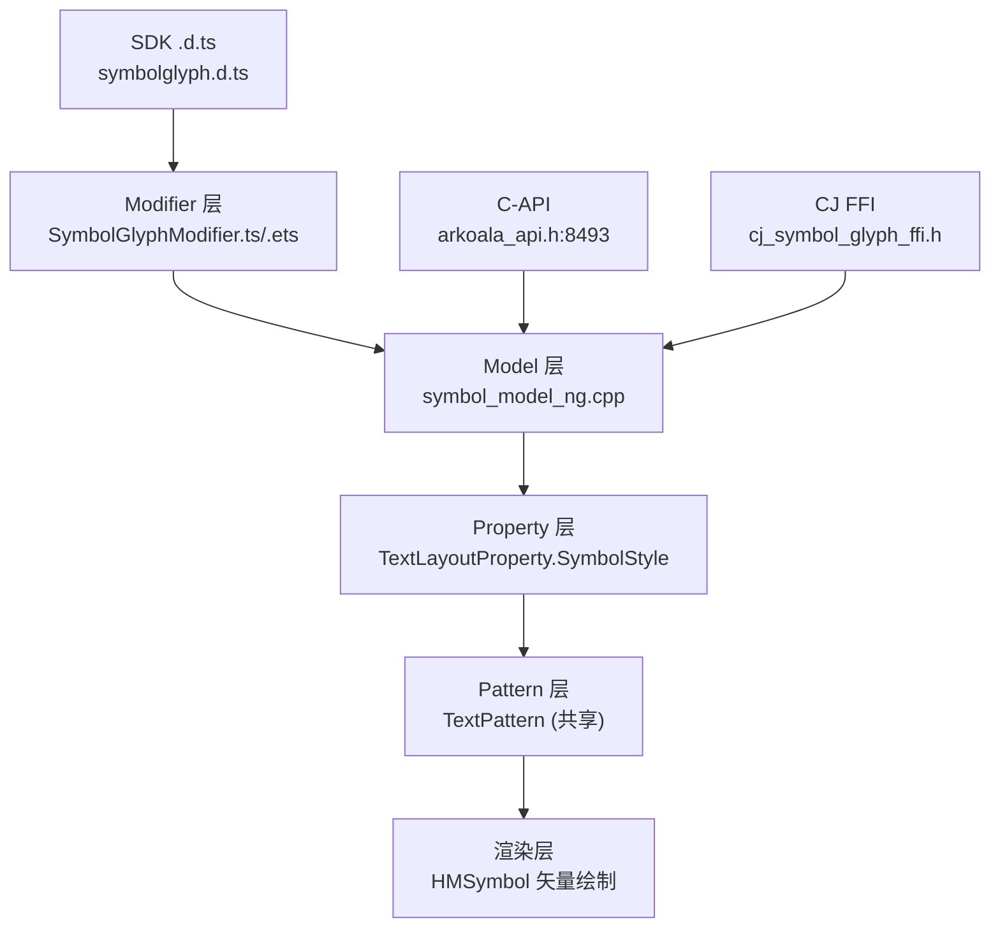
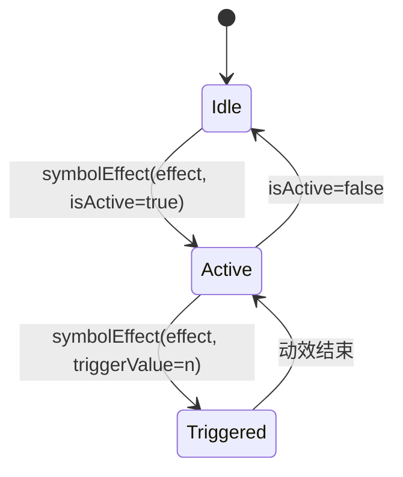

# 架构设计
> 确认目标仓和模块的架构约束、关键设计决策、Spec 拆分方向。

## 设计元数据

| Field | Content |
|-------|---------|
| Design ID | DESIGN-Func-05-09-07 |
| 关联需求 | 已有能力补录（无独立 requirement.md） |
| 关联 Epic | 无 |
| 目标 Feature | Feat-01 字形选择与创建；Feat-02 字体属性；Feat-03 颜色与渐变填充；Feat-04 渲染策略；Feat-05 动效策略与选项；Feat-06 SymbolEffect 子类与参数；Feat-07 符号阴影；Feat-08 多范式接口与通用能力 |
| 复杂度 | 复杂 |
| 目标版本 | API 11–18（基线 @since 11/12，minFontScale/maxFontScale @since 18） |
| Owner | ArkUI SIG |
| 状态 | Baselined（已有实现补录） |

## 需求基线

| 项 | 补充说明 |
|----|------------------|
| 符号字体渲染 | SymbolGlyph 渲染 HMSymbol 矢量字体，支持多色/多层透明度/动效，需复用 TextPattern 的排版能力 |
| 动效能力 | 支持 Scale/Hierarchical/Appear/Disappear/Bounce/Pulse/Replace 共 7 类 typed effect，需可由 active/trigger 触发 |
| 多范式接入 | 动态 ArkTS（SymbolGlyphModifier）、静态 ArkTS（koala）、CJ、C-API modifier 四路并存 |

## 上下文和现状

### 涉及仓和模块

| 仓库 | 补充架构说明 |
|------|--------------|
| ace_engine | SymbolGlyph 无独立 Pattern，复用 `TextPattern`；Model/Property/bridge/C-API 独立 |

### 调用链层级分析

| 层 | 模块 | 职责 | 修改类型 |
|-----|------|------|----------|
| SDK 契约层 | `interface/sdk-js/api/@internal/component/ets/symbolglyph.d.ts` | 公共 ArkTS 契约（@since 11/12/18） | 既有 |
| 静态 ArkTS 层 | `frameworks/bridge/arkts_frontend/.../generated/component/symbolglyph.ets` | 静态组件 + Modifier 生成 | 既有 |
| 动态 ArkTS Modifier 层 | `frameworks/bridge/declarative_frontend/ark_modifier/src/symbol_glyph_modifier.ts` | 动态属性下发 | 既有 |
| Model 层 | `frameworks/core/components_ng/pattern/symbol/symbol_model_ng.cpp` | Create/Set 全量属性下发到 TextLayoutProperty | 既有 |
| Property 层 | `frameworks/core/components_ng/pattern/text/text_layout_property.h`（SymbolStyle 组 L248–264） | 存储 SymbolSourceInfo/SymbolColorList/SymbolRenderingStrategy 等 | 既有 |
| Pattern 层 | `frameworks/core/components_ng/pattern/text/text_pattern.*` | 排版/绘制/选择/拖拽（共享） | 既有 |
| C-API 层 | `frameworks/core/interfaces/native/node/node_symbol_glyph_modifier.h` + `frameworks/core/interfaces/arkoala/arkoala_api.h:8493` | NDK modifier 函数指针表 | 既有 |
| 桥接层 | `frameworks/core/components_ng/pattern/symbol/bridge/`（dynamic/static/arkts_native/cj_ffi） | 多范式桥 | 既有 |

### 适用架构规则

| Rule ID | 适用原因 | 设计结论 | 验证方式 |
|---------|----------|----------|----------|
| OH-ARCH-LAYERING | SDK→Modifier→Model→Property→Pattern 多层 | 调用方向 SDK→Model→Property，禁止反向 | 代码评审 |
| OH-ARCH-API-LEVEL | 公共 ArkTS API + C-API modifier | Public ArkTS（@since 11/12/18）+ System C-API（@since 12） | API 评审/XTS |
| OH-ARCH-COMPONENT-BUILD | pattern/symbol BUILD.gn target `symbol_pattern_ng` | 部件内目标，无跨部件依赖 | 构建验证 |

## 不涉及项承接

| 维度 | 设计结论 |
|------|----------|
| 独立 Pattern | 不新增 SymbolGlyphPattern，行为复用 TextPattern；SymbolGlyph 专属逻辑经 SymbolType/SymbolSourceInfo 字段在共享 Pattern 分支 |
| 公共 ArkTS 之外的属性 | symbolColor/shaderStyle/symbolShadow/fontWeightConfigs 不在公共 .d.ts，仅 C-API/koala 内部面，记为风险 |

## 关键设计决策

| 决策 ID | 问题 | 推荐方案 | 探索过的替代方案 | 取舍理由 | 影响 |
|---------|------|----------|------------------|----------|------|
| ADR-1 | 是否为 SymbolGlyph 新建独立 Pattern | 复用 TextPattern，符号专属属性存于 TextLayoutProperty.SymbolStyle 组 | 新建 SymbolGlyphPattern | 符号排版复用文本段落能力，避免重复实现 measure/paint；新建 Pattern 会割裂共享路径 | 降低维护成本，但 SymbolGlyph 行为耦合 TextPattern 分支 |
| ADR-2 | 符号属性 dirty flag 策略 | SymbolColorList→MEASURE_SELF，其余 SymbolStyle→MEASURE_SELF，SymbolSourceInfo→MEASURE | 全部 MEASURE | 颜色/渲染策略变更需重测自绘；SourceInfo 变更需重排 | 平衡刷新开销 |
| ADR-3 | 动效触发模型 | symbolEffect(effect, isActive?) 与 (effect, triggerValue?) 双重载，C-API updateSymbolEffect(type, isActive, isTxtActiveSource) | 单一 active 布尔 | triggerValue 支持数值触发（如进度），isTxtActiveSource 区分文本/控件触发源 | 接口面增大但表达力强 |
| ADR-4 | 公共 ArkTS 缺少 symbolColor/shaderStyle/symbolShadow | 文档仅覆盖 C-API/内部面，公共 ArkTS 缺口记为兼容性风险 | 反向补齐公共 .d.ts | 当前实现 IS the spec，不擅自改 SDK 契约 | 下游 SDD 需感知差异 |

## 设计骨架

### 骨架范围

| 骨架项 | 目标 | 不包含 | 验证方式 |
|--------|------|--------|----------|
| 符号源 | system/custom 字形选择 | 字体文件加载 | 单测 |
| 字体属性 | size/weight/scale/可变字体 | 通用 fontFeature | 单测 |
| 颜色/渐变 | fontColor/symbolColor/shader | 通用背景 | 单测 |
| 动效 | 7 类 effect + 策略 | 通用属性动画 | 单测 |

### 骨架 Spec 拆分

| Task ID | 目标 | 受影响文件 | AC |
|---------|------|-----------|----|
| TASK-SKELETON-1 | 8 个 Feat 规格补录 | specs/05-ui-components/09-text-components/07-symbol-glyph/Feat-0[1-8]-*-spec.md | 见各 Feat |

## 后续 Task 拆分

| Task ID | 目标 | 受影响文件 | 依赖 |
|---------|------|-----------|------|
| TASK-01 | Feat-01 字形选择与创建规格 | Feat-01-glyph-selection-creation-spec.md | 无 |
| TASK-02 | Feat-02 字体属性规格 | Feat-02-font-properties-spec.md | Feat-01 |
| TASK-03 | Feat-03 颜色与渐变填充规格 | Feat-03-color-gradient-fill-spec.md | Feat-01 |
| TASK-04 | Feat-04 渲染策略规格 | Feat-04-rendering-strategy-spec.md | Feat-01 |
| TASK-05 | Feat-05 动效策略与选项规格 | Feat-05-effect-strategy-options-spec.md | Feat-01 |
| TASK-06 | Feat-06 SymbolEffect 子类规格 | Feat-06-symbol-effect-subclasses-spec.md | Feat-05 |
| TASK-07 | Feat-07 符号阴影规格 | Feat-07-symbol-shadow-spec.md | Feat-01 |
| TASK-08 | Feat-08 多范式接口规格 | Feat-08-multi-paradigm-interface-spec.md | Feat-01..07 |

## API 签名、Kit 与权限

### 新增 API

| API 签名 | 类型 | Kit | d.ts 位置 | 权限要求 | SysCap |
|----------|------|-----|-----------|----------|--------|
| `SymbolGlyph(value?: Resource)` | Public | ArkUI | interface/sdk-js/api/@internal/component/ets/symbolglyph.d.ts | 无 | SystemCapability.ArkUI.ArkUI.Full |
| `fontSize/fontColor/fontWeight/effectStrategy/renderingStrategy/symbolEffect` | Public | ArkUI | 同上 | 无 | 同上 |
| `minFontScale/maxFontScale` | Public | ArkUI | 同上（@since 18） | 无 | 同上 |
| C-API `getSymbolGlyphModifier`（43 函数指针） | System | ArkUI | frameworks/core/interfaces/arkoala/arkoala_api.h:8493 | 无 | 同上 |

### 变更/废弃 API

| 原有 API | 变更类型 | 新 API | 迁移说明 |
|----------|----------|--------|----------|
| 无 | — | — | 纯补录 |

## 构建系统影响

### BUILD.gn 变更
```
文件: frameworks/core/components_ng/pattern/symbol/BUILD.gn
变更说明: 既有 target symbol_pattern_ng，无新增依赖
```

### bundle.json 变更
无新增部件；SymbolGlyph 随 ace_engine 部件发布。

## 可选设计扩展

### 架构图



### 数据模型设计

TypeScript（公共契约）见 `symbolglyph.d.ts`：`SymbolGlyphAttribute extends CommonMethod`、`SymbolEffect` 子类、枚举 `SymbolRenderingStrategy/SymbolEffectStrategy/EffectDirection/EffectScope/EffectFillStyle`。

C++（框架层）：`SymbolSourceInfo`（unicode，`frameworks/core/components_ng/pattern/symbol/symbol_source_info.h:29`）、`SymbolEffectOptions`（`symbol_effect_options.h:26`）、`SymbolGradient`/`SymbolShadow`（`pattern/symbol/constants.h:96/123`）、`SymbolType`/`SymbolEffectType`/`SymbolGradientType` 枚举（constants.h:27–60）。存储于 `TextLayoutProperty` SymbolStyle 组（text_layout_property.h:248–264）。

### 算法与状态机



## 详细设计

### 字形选择与创建
`SymbolModelNG::Create(unicode)` 经 `FrameNode::GetOrCreateFrameNode("SymbolGlyph", nodeId, TextPattern)`（symbol_model_ng.cpp:28–29）创建节点；`SetSymbolGlyphType/SetSymbolType` 区分 SYSTEM/CUSTOM；自定义字形经 `SetSymbolFontFamilies` + `InitialCustomSymbol`。

### 字体属性
`SetFontSize/SetFontWeight` 写入 TextLayoutProperty.FontStyle 组；可变字体经 `SetVariableFontWeight/SetEnableVariableFontWeight/SetEnableDeviceFontWeightCategory`（symbol_model_ng.h:48–53）；`SetMinFontScale/SetMaxFontScale` 写入 FontStyle 组（@since 18）。

### 颜色与渐变
`SetFontColor` 写 SymbolColorList（MEASURE_SELF）；`SetShaderStyle` 写 ShaderStyle（vector<SymbolGradient>），支持 COLOR_SHADER/RADIAL_GRADIENT/LINEAR_GRADIENT；资源态经 `RegisterSymbolFontColorResource/IsFontColorResource/FontColorResource`。

### 渲染策略
`SetSymbolRenderingStrategy` 写 SymbolRenderingStrategy（uint32），SINGLE/MULTIPLE_COLOR/MULTIPLE_OPACITY 决定多色/多层透明度绘制路径。

### 动效
`SetSymbolEffect(uint32)` + `SetSymbolEffectOptions` 写 SymbolEffectStrategy/SymbolEffectOptions；`UpdateSymbolEffect(type, isActive, isTxtActiveSource)` 运行时切换；7 类 typed effect 经 `SymbolEffectType`（constants.h:27，含 APPEAR/DISAPPEAR/BOUNCE/PULSE/REPLACE/SCALE/HIERARCHICAL）映射到 effect 子类参数（scope/direction/fillStyle/replaceType）。

### 符号阴影
`SetSymbolShadow` 写 SymbolShadow（color/offset/radius/resource map），资源态经 `SetSymbolShadowResObj`（symbol_model_ng.cpp:373–390）。

## 风险和开放问题

| 项 | 类型 | 影响 | 处理方式 | Owner |
|----|------|------|----------|-------|
| 公共 ArkTS 缺 symbolColor/shaderStyle/symbolShadow | API | 高 | 记兼容性风险，下游 SDD 感知 | ArkUI SIG |
| 无独立 Pattern，行为耦合 TextPattern | 架构 | 中 | 分支隔离，长期观察解耦机会 | ArkUI SIG |
| 公共 .d.ts @since 双值（11 基线/12 atomicservice） | API | 低 | 规格统一标注 @since 11/12 | ArkUI SIG |

## 设计审批

- [x] 需求基线已确认，设计覆盖 P0/P1 AC
- [x] 不涉及项已承接，N/A 和展开项都有结论
- [x] 涉及仓和模块职责清楚
- [x] 调用链层级分析完整，每层覆盖到位
- [x] 适用架构规则已识别并形成设计结论
- [x] 分层和子系统边界合规
- [x] API 变更有签名、权限、错误码和兼容性说明
- [x] BUILD.gn/bundle.json 影响明确
- [x] 设计输出和后续 Task 拆分明确
- [x] 关键设计决策有理由和影响说明
- [x] 风险和开放问题有 Owner

**结论:** 通过（已有实现补录）
