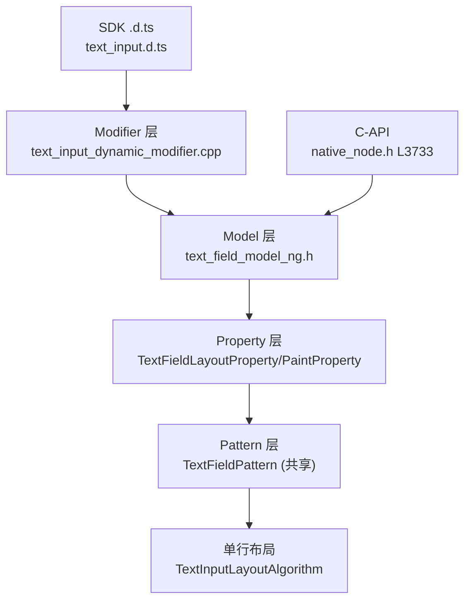
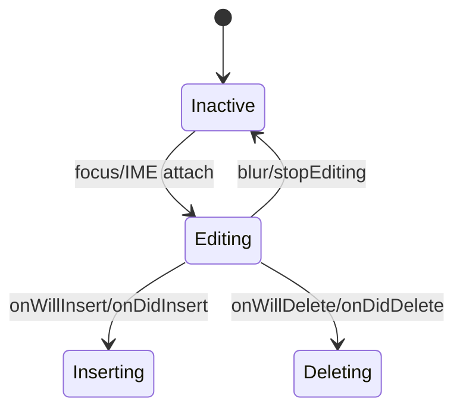

# 架构设计
> 确认目标仓和模块的架构约束、关键设计决策、Spec 拆分方向。

## 设计元数据

| Field | Content |
|-------|---------|
| Design ID | DESIGN-Func-05-09-08 |
| 关联需求 | 已有能力补录（无独立 requirement.md） |
| 关联 Epic | 无 |
| 目标 Feature | Feat-01 基础显示与字体样式；Feat-02 Placeholder 与错误提示；Feat-03 输入类型与控制；Feat-04 文本筛选与 maxLength/计数器；Feat-05 光标与选择；Feat-06 编辑与内容事件回调；Feat-07 键盘/IME/自定义键盘；Feat-08 密码与自动填充；Feat-09 取消按钮/响应区域；Feat-10 C-API/NDK Modifier 桥与无障碍 |
| 复杂度 | 关键 |
| 目标版本 | API 7–26（基线 @since 7/10/11/12，增量 13/15/16/18/20/22/23/24/26） |
| Owner | ArkUI SIG |
| 状态 | Baselined（已有实现补录） |

## 需求基线

| 项 | 补充说明 |
|----|------------------|
| 单行编辑 | TextInput 为单行文本编辑组件，与 TextArea 共享 TextFieldPattern，单行布局走 TextInputLayoutAlgorithm |
| IME/键盘 | 支持 EnterKeyType、自定义键盘、keyboardAppearance/keyboardAppearanceConfig、autoCapitalizationMode |
| 自动填充 | contentType（38 类）+ enableAutoFill + 自动填充图标布局 |
| 多版本演进 | API 7 起步，11/12 atomicservice 大扩，13–26 持续增量（copy/cut/paste will 系列 @since 26） |

## 上下文和现状

### 涉及仓和模块

| 仓库 | 补充架构说明 |
|------|--------------|
| ace_engine | TextInput 与 TextArea 共享 TextFieldPattern/TextFieldModelNG；单行差异化在 TextInputLayoutAlgorithm |

### 调用链层级分析

| 层 | 模块 | 职责 | 修改类型 |
|-----|------|------|----------|
| SDK 契约层 | `interface/sdk-js/api/@internal/component/ets/text_input.d.ts` | 公共 ArkTS 契约（@since 7..26） | 既有 |
| 静态 ArkTS 层 | `frameworks/bridge/arkts_frontend/.../src/typedNode/ArkTextInputNode.ets` | 静态 typed node | 既有 |
| Model 层 | `frameworks/core/components_ng/pattern/text_field/text_field_model_ng.h`（CreateTextInput L30） | Create/Set 全量 | 既有 |
| Property 层 | `text_field_layout_property.h`（400 行）、`text_field_paint_property.h`（118 行）、`text_content_type.h` | 属性存储 | 既有 |
| Pattern 层 | `text_field_pattern.h`（2637 行）、`text_field_event_hub.h`、`text_field_controller.h`、`text_field_accessibility_property.h` | 编辑/光标/选择/IME/自动填充 | 既有 |
| 布局算法层 | `pattern/text_input/text_input_layout_algorithm.h`（继承 TextFieldLayoutAlgorithm） | 单行 measure/layout | 既有 |
| JS/ArkTS bridge | `js_textinput.h/.cpp`（仅 Controller）、`js_textfield.cpp`、`arktextinput.ts` | 桥 | 既有 |
| C-API 层 | `interfaces/native/native_node.h`（ARKUI_NODE_TEXT_INPUT=7，attrs L3733–4463，events L10801–11026）、`node_text_input_modifier.h` | NDK 面 | 既有 |
| 动态 modifier 桥 | `pattern/text_input/bridge/text_input_dynamic_modifier.cpp` | AttributeItem→Set* | 既有 |

### 适用架构规则

| Rule ID | 适用原因 | 设计结论 | 验证方式 |
|---------|----------|----------|----------|
| OH-ARCH-LAYERING | SDK→modifier→Model→Property→Pattern→Layout | 单向调用 | 代码评审 |
| OH-ARCH-API-LEVEL | 公共 ArkTS + System C-API | Public @since 7..26；C-API @since 12..26 | API 评审/XTS |
| OH-ARCH-COMPONENT-BUILD | text_field/text_input BUILD.gn | 部件内目标 | 构建验证 |

## 不涉及项承接

| 维度 | 设计结论 |
|------|----------|
| TextArea | 不在本域（属 05-09-05），但共享 Pattern/Model/Property，规格在相关 AC 标注共享 |
| 通用属性/事件 | CommonMethod 通用面不在本域展开 |

## 关键设计决策

| 决策 ID | 问题 | 推荐方案 | 探索过的替代方案 | 取舍理由 | 影响 |
|---------|------|----------|------------------|----------|------|
| ADR-1 | 单行/多行是否独立 Pattern | 共享 TextFieldPattern，单行经 TextInputLayoutAlgorithm 差异化 | 各自独立 Pattern | 共享编辑/光标/IME/选择逻辑，避免重复；单行布局差异小 | 降低维护成本 |
| ADR-2 | Property 分层 | TextFieldLayoutProperty（值/样式/行控制）+ TextFieldPaintProperty（颜色/光标/选中底色/边框） | 合并 | paint 与 measure 关注点分离 | 清晰 |
| ADR-3 | 事件 will/did 双轨 | onWillInsert/onDidInsert、onWillDelete/onDidDelete、onWillChange（拦截）/onChange | 单轨 | will 可拦截（返回 bool），did 通知 | 接口面大但表达力强 |
| ADR-4 | C-API 版本边界 | attrs L3733–4463 混排 @since 12/15/16/20/22/23/24/26，id 跳号 7032+ 为增量 | 重排 id | 保持 id 稳定不破坏 ABI | 下游需按 @since 判定 |
| ADR-5 | 自动填充图标 | MeasureAutoFillIcon/LayoutAutoFillIcon 在 TextInputLayoutAlgorithm 独立布局 | 通用 overlay | 图标与文本协同布局 | 布局复杂 |

## 设计骨架

### 骨架范围

| 骨架项 | 目标 | 不包含 | 验证方式 |
|--------|------|--------|----------|
| 显示/字体 | 基础样式 | 通用 background | 单测 |
| 输入控制 | type/contentType/editing | — | 单测 |
| 光标/选择 | caret/selection | — | 单测 |
| 事件 | will/did/copy/cut/paste | — | 单测 |
| 键盘 | IME/custom keyboard | — | 单测 |
| C-API | 51 attrs + 18 events | — | C-API 单测 |

### 骨架 Spec 拆分

| Task ID | 目标 | 受影响文件 | AC |
|---------|------|-----------|----|
| TASK-SKELETON-TI | 10 个 Feat 规格补录 | Feat-01..10-*-spec.md | 见各 Feat |

## 后续 Task 拆分

| Task ID | 目标 | 受影响文件 | 依赖 |
|---------|------|-----------|------|
| TASK-TI-01 | Feat-01 基础显示与字体样式 | Feat-01-base-display-font-style-spec.md | 无 |
| TASK-TI-02 | Feat-02 Placeholder 与错误提示 | Feat-02-placeholder-error-spec.md | Feat-01 |
| TASK-TI-03 | Feat-03 输入类型与控制 | Feat-03-input-type-control-spec.md | Feat-01 |
| TASK-TI-04 | Feat-04 文本筛选与 maxLength/计数器 | Feat-04-filter-maxlength-counter-spec.md | Feat-01 |
| TASK-TI-05 | Feat-05 光标与选择 | Feat-05-caret-selection-spec.md | Feat-01 |
| TASK-TI-06 | Feat-06 编辑与内容事件回调 | Feat-06-editing-content-events-spec.md | Feat-05 |
| TASK-TI-07 | Feat-07 键盘/IME/自定义键盘 | Feat-07-keyboard-ime-spec.md | Feat-03 |
| TASK-TI-08 | Feat-08 密码与自动填充 | Feat-08-password-autofill-spec.md | Feat-03 |
| TASK-TI-09 | Feat-09 取消按钮/响应区域 | Feat-09-cancel-button-response-area-spec.md | Feat-01 |
| TASK-TI-10 | Feat-10 C-API/NDK Modifier 桥与无障碍 | Feat-10-capi-ndk-bridge-a11y-spec.md | Feat-01..09 |

## API 签名、Kit 与权限

### 新增 API

| API 签名 | 类型 | Kit | d.ts 位置 | 权限要求 | SysCap |
|----------|------|-----|-----------|----------|--------|
| `TextInput(value?: TextInputOptions)` | Public | ArkUI | interface/sdk-js/api/@internal/component/ets/text_input.d.ts | 无 | SystemCapability.ArkUI.ArkUI.Full |
| ~63 ArkTS 属性/事件 | Public | ArkUI | 同上 | 无 | 同上 |
| C-API `ARKUI_NODE_TEXT_INPUT` + 51 attrs + 18 events | System | ArkUI | interfaces/native/native_node.h | 无 | 同上 |

### 变更/废弃 API

| 原有 API | 变更类型 | 新 API | 迁移说明 |
|----------|----------|--------|----------|
| `onEditChanged` | 废弃（@deprecated since 8） | `onEditChange` | 改用 onEditChange |

## 构建系统影响

### BUILD.gn 变更
```
文件: frameworks/core/components_ng/pattern/text_field/BUILD.gn, pattern/text_input/BUILD.gn
变更说明: 既有 target，无新增依赖
```

### bundle.json 变更
无新增部件。

## 可选设计扩展

### 架构图



### 数据模型设计

TypeScript 契约见 `text_input.d.ts`：`TextInputOptions`（placeholder/text/controller）、`InputType`（14 值）、`ContentType`（38 值）、`EnterKeyType`、`TextInputStyle`、`PasswordIcon`、`UnderlineColor`、`SubmitEvent`、`OnSubmitCallback` 等。

C++ 存储：`TextFieldLayoutProperty`（Value/PreviewText/Placeholder/Type/ContentType/InputFilter/ShowCounter/ShowUnderline/CleanNodeStyle/FontStyle 组/TextLineStyle 组含 MaxLength/LineHeight/WordBreak/TextOverflow/EllipsisMode/OrphanCharOptimization 等/CopyOptions）、`TextFieldPaintProperty`（PlaceholderColor/CursorColor/CursorWidth/SelectedBackgroundColor/InputStyle/各 *FlagByUser）、`TextContentType` 枚举（38 值）。

### 算法与状态机



## 详细设计

### 基础显示与字体
type/style/fontColor/fontSize/fontWeight/fontFamily/fontFeature/fontStyle/textAlign/textIndent/letterSpacing/lineHeight/halfLeading/textOverflow/wordBreak/lineBreakStrategy/ellipsisMode/numberOfLines/includeFontPadding/fallbackLineSpacing/compressLeadingPunctuation/orphanCharOptimization/punctuationOverflow/direction/barState 经 TextFieldModelNG::Set* 写入 FontStyle 组与 TextLineStyle 组；@since 7/10/11/12（基线）+ 16/20/23/24/26（增量）。

### Placeholder 与错误提示
placeholderColor/placeholderFont 写 PlaceholderFontStyle/PlaceholderColor；showError/showUnit/showUnderline/underlineColor（typing/normal/error/disable）写 ShowUnderline/UnderlineColor/ErrorText。

### 输入类型与控制
type（InputType 14 值）/contentType（38 值）/enableKeyboardOnFocus/showKeyboardOnFocus/editing/selectAll/copyOption/selectionMenuHidden/editMenuOptions/enablePreviewText（@since 16）/enableSelectedDataDetector（@since 22）。

### 文本筛选与 maxLength/计数器
maxLength/inputFilter（regex+onInputFilterError）/showCounter（bool+InputCounterOptions，@since 22，含 MeasureCounterWithPolicy）。

### 光标与选择
caretColor/caretStyle/caretPosition/selectedBackgroundColor/textSelection（start/end）/selectedDragPreviewStyle（@since 23）/onTextSelectionChange/onContentScroll/contentRect/contentLineCount。

### 编辑与内容事件回调
onChange/onWillChange（@since 15，拦截）/onChangeWithPreviewText（@since 16）/onSubmit/onEditChange/onWillInsert/onDidInsert/onWillDelete/onDidDelete/onCopy（@since 26）/onWillCopy（@since 26）/onCut/onWillCut（@since 26）/onPaste（@since 26）/onSecurityStateChange。

### 键盘/IME
enterKeyType/keyboardAppearance（@since 15）/keyboardAppearanceConfig（gradientMode/fluidLightMode）/customKeyboard（+KeyboardOptions supportAvoidance）/customKeyboardWithNode/autoCapitalizationMode（@since 20）/enableFillAnimation（@since 20）/blurOnSubmit。

### 密码与自动填充
passwordIcon/showPasswordIcon/showPassword（@since 12）/passwordRules/enableAutoFill/enableAutoFillAnimation/onSecurityStateChange；MeasureAutoFillIcon/LayoutAutoFillIcon 布局图标。

### 取消按钮/响应区域
cancelButton（CancelButtonOptions + CancelButtonSymbolOptions 重载，@since 18）/cleanNodeStyle/isShowCancelButton/isShowVoiceButton/cancelButtonSymbol。

### C-API/NDK 桥
ARKUI_NODE_TEXT_INPUT=7 + 51 NODE_TEXT_INPUT_* attrs（id 跳号 7032+ 为增量）+ 18 events + ArkUI_TextInputType/CancelButtonStyle/TextInputContentType/TextInputStyle 枚举 + userAccessibilityText + text_field_accessibility_property。

## 风险和开放问题

| 项 | 类型 | 影响 | 处理方式 | Owner |
|----|------|------|----------|-------|
| C-API attrs id 跳号混排 @since | API | 中 | 规格 id→@since 映射表 | ArkUI SIG |
| onCopy/onWillCopy/onWillCut/onPaste @since 26 为最新增量 | API | 中 | 标注 @since 26 | ArkUI SIG |
| contentType 38 值含 @since 18 增量 | API | 低 | 标注 | ArkUI SIG |

## 设计审批

- [x] 需求基线已确认，设计覆盖 P0/P1 AC
- [x] 不涉及项已承接
- [x] 涉及仓和模块职责清楚
- [x] 调用链层级分析完整
- [x] 适用架构规则已识别
- [x] 分层和子系统边界合规
- [x] API 变更有签名、权限、错误码和兼容性说明
- [x] BUILD.gn/bundle.json 影响明确
- [x] 设计输出和后续 Task 拆分明确
- [x] 关键设计决策有理由和影响说明
- [x] 风险和开放问题有 Owner

**结论:** 通过（已有实现补录）
