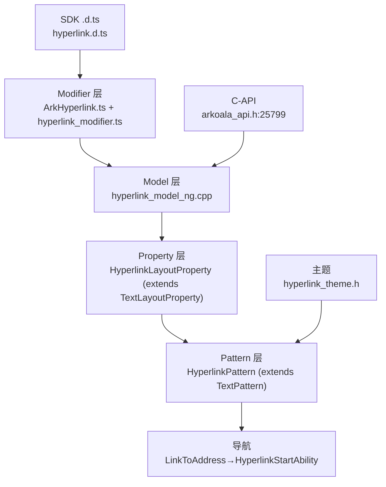
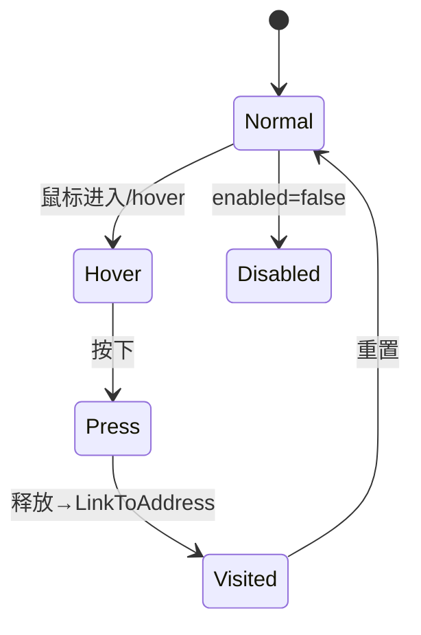

# 架构设计
> 确认目标仓和模块的架构约束、关键设计决策、Spec 拆分方向。

## 设计元数据

| Field | Content |
|-------|---------|
| Design ID | DESIGN-Func-05-09-09 |
| 关联需求 | 已有能力补录（无独立 requirement.md） |
| 关联 Epic | 无 |
| 目标 Feature | Feat-01 链接配置与颜色样式；Feat-02 拖拽/响应区域/状态视觉/导航；Feat-03 键盘无障碍与多前端 C-API 桥 |
| 复杂度 | 标准 |
| 目标版本 | API 7–26（基线 @since 7/11，颜色主题派生 @since 18，orphanOptimization @since 26） |
| Owner | ArkUI SIG |
| 状态 | Baselined（已有实现补录） |

## 需求基线

| 项 | 补充说明 |
|----|------------------|
| 超链接导航 | Hyperlink(address,content) 经 LinkToAddress→HyperlinkStartAbility 拉起能力；无独立 SDK Type/usageAddress 字段，实际属性为 Address |
| 共享 Text 排版 | HyperlinkLayoutProperty 继承 TextLayoutProperty，复用 Text 排版/选择/绘制 |
| 多态视觉 | hover/press/visited/disabled 状态视觉 + HAND_POINTING 光标 |

## 上下文和现状

### 涉及仓和模块

| 仓库 | 补充架构说明 |
|------|--------------|
| ace_engine | Hyperlink 有独立 HyperlinkPattern(继承 TextPattern)；Model/Property/bridge/C-API 独立 |

### 调用链层级分析

| 层 | 模块 | 职责 | 修改类型 |
|-----|------|------|----------|
| SDK 契约层 | `interface/sdk-js/api/@internal/component/ets/hyperlink.d.ts` | 公共 ArkTS 契约（@since 7/11） | 既有 |
| 静态 ArkTS 层 | `frameworks/bridge/arkts_frontend/.../generated/component/hyperlink.ets` | 静态组件 + Modifier 生成 | 既有 |
| 动态 ArkTS 层 | `frameworks/bridge/declarative_frontend/ark_component/src/ArkHyperlink.ts` + `ark_modifier/src/hyperlink_modifier.ts` | 动态属性下发 | 既有 |
| Model 层 | `hyperlink_model_ng.h/.cpp`（Create L25） | Create/Set | 既有 |
| Property 层 | `hyperlink_layout_property.h`（继承 TextLayoutProperty，Color/Address） | 属性存储 | 既有 |
| Pattern 层 | `hyperlink_pattern.h/.cpp`（继承 TextPattern，434 行） | 导航/状态视觉/拖拽/键盘 | 既有 |
| C-API 层 | `frameworks/core/interfaces/native/node/hyperlink_modifier.h` + `arkoala_api_generated.h:25799` | NDK modifier | 既有 |
| 主题层 | `frameworks/core/components/hyperlink/hyperlink_theme.h` | 默认色/状态色 | 既有 |

### 适用架构规则

| Rule ID | 适用原因 | 设计结论 | 验证方式 |
|---------|----------|----------|----------|
| OH-ARCH-LAYERING | SDK→Modifier→Model→Property→Pattern | 单向调用 | 代码评审 |
| OH-ARCH-API-LEVEL | 公共 ArkTS（@since 7/11）+ System C-API | Public + System | API 评审/XTS |

## 不涉及项承接

| 维度 | 设计结论 |
|------|----------|
| 公共 draggable/responseRegion | draggable/responseRegion 为 CommonMethod 通用属性，Hyperlink 在 ArkHyperlink.ts 重导出 hyperlink 专属 reset；规格记为通用属性复用 |
| Type/usageAddress | SDK 无此字段，实际为 Address（单 URL string），规格以 Address 为准 |

## 关键设计决策

| 决策 ID | 问题 | 推荐方案 | 探索过的替代方案 | 取舍理由 | 影响 |
|---------|------|----------|------------------|----------|------|
| ADR-1 | 是否独立 Pattern | 独立 HyperlinkPattern 继承 TextPattern | 纯 TextPattern 分支 | 链接导航/状态视觉/键盘激活独立逻辑清晰 | 增加一个 Pattern 类 |
| ADR-2 | 颜色默认值 | API<18 硬编码 Color::BLUE；API≥18 主题派生 HyperlinkTheme::GetTextColor() | 全主题派生 | 保持兼容，逐步迁移 | API 18 行为分支 |
| ADR-3 | 拖拽 | EnableDrag 生成 Udmf link record {url,title} | 仅 onClick 导航 | 支持拖拽到其他应用传递链接 | 增加拖拽复杂度 |
| ADR-4 | 导航实现 | LinkToAddress→pipeline->HyperlinkStartAbility(address) | 直接隐式 Want | 走 pipeline 统一入口，PREVIEW 跳过 | 预览态不可用 |

## 设计骨架

### 骨架范围

| 骨架项 | 目标 | 不包含 | 验证方式 |
|--------|------|--------|----------|
| 链接配置 | address/content/color | 通用 Text 样式 | 单测 |
| 状态视觉/导航 | hover/press/visited/disabled + LinkToAddress | — | 单测 |
| C-API/无障碍 | modifier 桥 + 键盘激活 | — | C-API 单测 |

### 骨架 Spec 拆分

| Task ID | 目标 | 受影响文件 | AC |
|---------|------|-----------|----|
| TASK-SKELETON-HL | 3 个 Feat 规格补录 | Feat-0[1-3]-*-spec.md | 见各 Feat |

## 后续 Task 拆分

| Task ID | 目标 | 受影响文件 | 依赖 |
|---------|------|-----------|------|
| TASK-HL-01 | Feat-01 链接配置与颜色样式 | Feat-01-link-config-color-style-spec.md | 无 |
| TASK-HL-02 | Feat-02 拖拽/响应区域/状态视觉/导航 | Feat-02-drag-response-state-navigation-spec.md | Feat-01 |
| TASK-HL-03 | Feat-03 键盘无障碍与多前端 C-API 桥 | Feat-03-keyboard-a11y-capi-bridge-spec.md | Feat-01 |

## API 签名、Kit 与权限

### 新增 API

| API 签名 | 类型 | Kit | d.ts 位置 | 权限要求 | SysCap |
|----------|------|-----|-----------|----------|--------|
| `Hyperlink(address: string\|Resource, content?: string\|Resource)` | Public | ArkUI | interface/sdk-js/api/@internal/component/ets/hyperlink.d.ts | 无 | SystemCapability.ArkUI.ArkUI.Full |
| `color(value)` | Public | ArkUI | 同上 | 无 | 同上 |
| C-API `getHyperlinkModifier`（construct/setHyperlinkOptions/setColor + 动态 setHyperlinkColor/setHyperlinkDraggable/setHyperlinkResponseRegion/createHyperlinkFrameNode/pop） | System | ArkUI | frameworks/core/interfaces/arkoala/arkoala_api.h:25799 | 无 | 同上 |

### 变更/废弃 API
无。

## 构建系统影响

### BUILD.gn 变更
```
文件: frameworks/core/components_ng/pattern/hyperlink/BUILD.gn
变更说明: 既有 target，无新增依赖
```

### bundle.json 变更
无新增部件。

## 可选设计扩展

### 架构图



### 数据模型设计

TypeScript 契约见 `hyperlink.d.ts`：`HyperlinkAttribute extends CommonMethod`（仅 color）、`HyperlinkInterface(address, content?)`。

C++ 存储：`HyperlinkLayoutProperty`（继承 TextLayoutProperty，新增 Color（MEASURE）+ Address（NORMAL））、`HyperlinkTheme`（textColor_=0xff007dff, textTouchedColor_=0x19182431, textLinkedColor_=0x66182431, textSelectedDecoration_=UNDERLINE, draggable_=false）。

### 算法与状态机



## 详细设计

### 链接配置与颜色样式
`HyperlinkModelNG::Create(address, content)` 创建 HYPERLINK_ETS_TAG 节点 + HyperlinkPattern + SetTextStyle；Address/Content 写入 HyperlinkLayoutProperty；content 为空时兜底用 address；`SetColor` 写入 TextColor/Color/ForegroundColor；API 18+ 默认色经 HyperlinkTheme::GetTextColor() 派生，API<18 硬编码 Color::BLUE（hyperlink_layout_property.h:66）；资源态经 ResourceObj 注册。

### 拖拽/响应区域/状态视觉/导航
`SetDraggable` + EnableDrag 生成 DragDropInfo{url,title} + Udmf link record；DefaultSupportDrag()=true，主题默认 draggable_=false；`SetResponseRegion`（3 重载）+ Enabled 控制响应区域；hover→HAND_POINTING 光标 + UNDERLINE；press→textTouchedColor + UNDERLINE；visited→textLinkedColor；disabled→opacity 混合；LinkToAddress 设置访问色/装饰并调 pipeline->HyperlinkStartAbility(address)（PREVIEW 跳过）；isTouchPreventDefault_/IsPreventDefault() 拦截。

### 键盘无障碍与多前端 C-API 桥
OnKeyEvent KEY_SPACE/KEY_ENTER 激活；GetFocusPattern={NODE,true,OUTER_BORDER}；OnInjectionEvent({"cmd":"click"}) 测试注入；C-API GENERATED_ArkUIHyperlinkModifier（construct/setHyperlinkOptions/setColor）+ 动态 ArkUIHyperlinkModifier（color/draggable/responseRegion + reset/createFrameNode/pop）+ CJ CJUIHyperlinkModifier（color/draggable）+ 静态 modifier；ToJsonValue/ToTreeJson 序列化 content/color/address（API 18 色分支）。

## 风险和开放问题

| 项 | 类型 | 影响 | 处理方式 | Owner |
|----|------|------|----------|-------|
| 公共 ArkTS 声明面≤5（constructor/color），draggable/responseRegion 为通用属性复用 | API | 中 | 规格明确区分专属 vs 通用 | ArkUI SIG |
| API 18 默认色派生行为分支 | API | 中 | 标 @since 18 兼容性 | ArkUI SIG |
| 无独立 C-API 节点类型，仅 modifier | 架构 | 低 | 记风险 | ArkUI SIG |

## 设计审批

- [x] 需求基线已确认，设计覆盖 P0/P1 AC
- [x] 不涉及项已承接
- [x] 涉及仓和模块职责清楚
- [x] 调用链层级分析完整
- [x] 适用架构规则已识别
- [x] 分层和子系统边界合规
- [x] API 变更有签名、权限、错误码和兼容性说明
- [x] BUILD.gn/bundle.json 影响明确
- [x] 设计输出和后续 Task 拆分明确
- [x] 关键设计决策有理由和影响说明
- [x] 风险和开放问题有 Owner

**结论:** 通过（已有实现补录）
