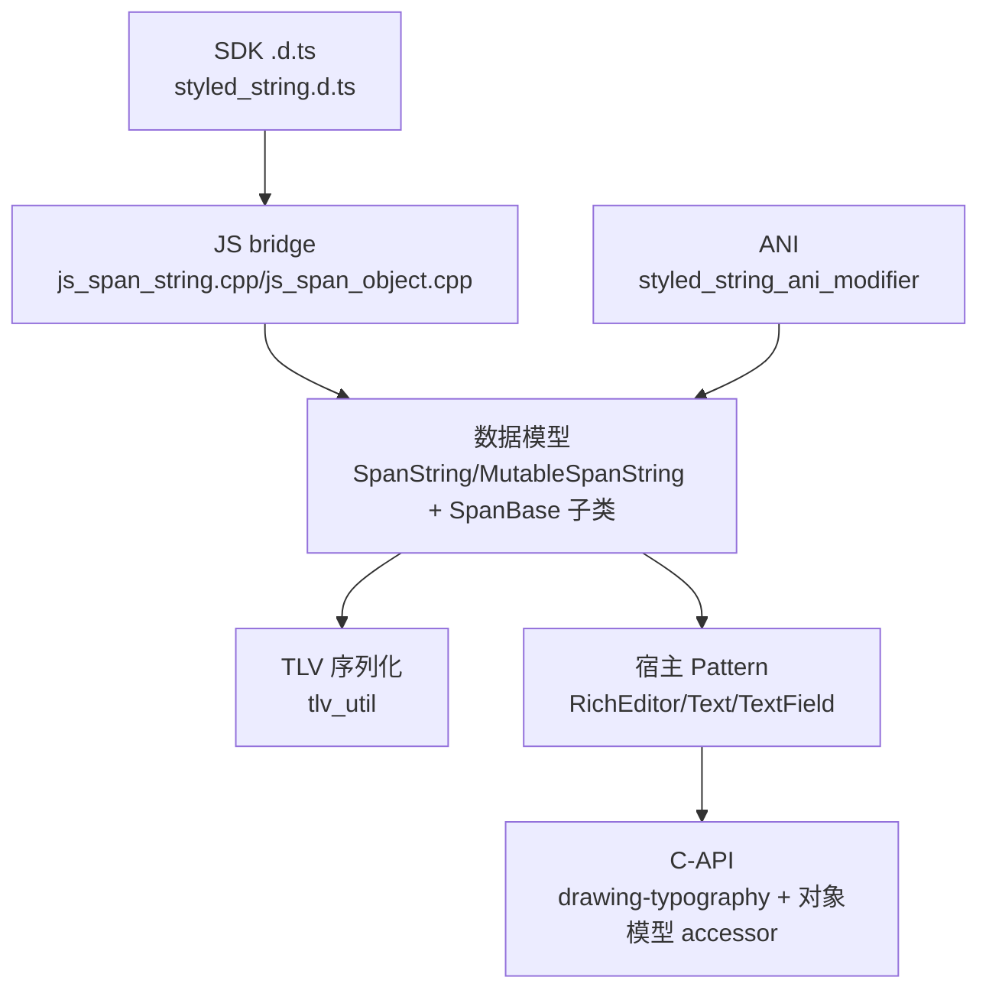
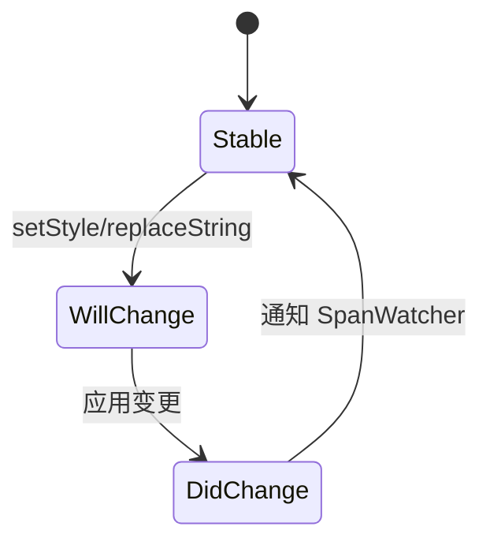

# 架构设计
> 确认目标仓和模块的架构约束、关键设计决策、Spec 拆分方向。

## 设计元数据

| Field | Content |
|-------|---------|
| Design ID | DESIGN-Func-05-09-10 |
| 关联需求 | 已有能力补录（无独立 requirement.md） |
| 关联 Epic | 无 |
| 目标 Feature | Feat-01 容器与核心操作；Feat-02 TextStyle 字体属性；Feat-03 装饰排版 Style；Feat-04 背景/超链接 Style；Feat-05 ParagraphStyle 段落属性；Feat-06 GestureStyle 手势；Feat-07 图片/自定义/UserData Span；Feat-08 宿主集成；Feat-09 C-API/NDK/ANI |
| 复杂度 | 关键 |
| 目标版本 | API 12–24（基线 @since 12，toHtml @since 14，marshalling @since 13/18，BackgroundColorStyle/UrlStyle @since 14，CustomSpan invalidate @since 13，ImageAttachment 扩展 @since 15，paragraphSpacing @since 18，LayoutManager @since 22，char 位置 @since 24） |
| Owner | ArkUI SIG |
| 状态 | Baselined（已有实现补录） |

## 需求基线

| 项 | 补充说明 |
|----|------------------|
| 属性字符串对象模型 | StyledString（不可变）/MutableStyledString（可变）+ ~14 个 *Style 构建类，被 Text/RichEditor/TextField 宿主消费 |
| 序列化 | TLV marshalling/unmarshalling（@since 13/18）、HTML 往返（@since 12/14）、UserDataSpan↔ExtSpan 序列化回调（@since 18） |
| 多范式 | 动态 ArkTS（style_string/ bridge）、C-API drawing-typography（@since 12）+ 对象模型 accessor + ANI modifier（静态 ArkTS） |

## 上下文和现状

### 涉及仓和模块

| 仓库 | 补充架构说明 |
|------|--------------|
| ace_engine | 属性字符串纯 components_ng 能力，无 legacy 路径；核心在 pattern/text/span/ |

### 调用链层级分析

| 层 | 模块 | 职责 | 修改类型 |
|-----|------|------|----------|
| SDK 契约层 | `interface/sdk-js/api/@internal/component/ets/styled_string.d.ts` | 公共 ArkTS 契约（@since 12–24） | 既有 |
| 消费者契约 | `text_common.d.ts`（StyledStringController/ChangedListener/LayoutManager）、`text.d.ts`（TextController）、`rich_editor.d.ts`（RichEditorStyledStringController） | 宿主接口 | 既有 |
| JS bridge 层 | `frameworks/bridge/declarative_frontend/style_string/js_span_string.cpp`（JSSpanString→"StyledString"、JSMutableSpanString→"MutableStyledString"）、`js_span_object.cpp`（各 *Style builder） | 桥 | 既有 |
| 数据模型层 | `frameworks/core/components_ng/pattern/text/span/span_object.h`（SpanBase + 14 子类）、`span_string.h`（SpanString）、`mutable_span_string.h`（MutableSpanString）、`tlv_util.h` | 核心对象模型 | 既有 |
| 宿主 Pattern 层 | `rich_editor_pattern.h`（~40 styled-string 方法）、`rich_editor_styled_string_controller.h`、`rich_editor_undo_manager.h`、`text_field_pattern.h`（SetPlaceholderStyledString）、`text/styled_string_change_value.h` | 宿主集成 | 既有 |
| C-API 层 | `interfaces/native/native_styled_string.h`（drawing-typography @since 12/22/24）、`frameworks/core/interfaces/native/implementation/styled_string_accessor.cpp`（对象模型 accessor）、`ani/styled_string_ani_modifier.*`（@since 2025）、`arkts_frontend/.../styled_string_module.*`（arkoala） | NDK/ANI | 既有 |

### 适用架构规则

| Rule ID | 适用原因 | 设计结论 | 验证方式 |
|---------|----------|----------|----------|
| OH-ARCH-LAYERING | SDK→JS bridge→SpanString 数据模型→宿主 Pattern | 单向调用 | 代码评审 |
| OH-ARCH-API-LEVEL | 公共 ArkTS + System C-API + ANI | Public @since 12–24；C-API @since 12/22/24；ANI @since 2025 | API 评审/XTS |
| OH-ARCH-COMPONENT-BUILD | span BUILD.gn | 部件内目标 | 构建验证 |

## 不涉及项承接

| 维度 | 设计结论 |
|------|----------|
| legacy | 无 legacy 路径（纯 components_ng） |
| 通用宿主组件规格 | Text/RichEditor/TextField 各自规格在 05-09-04/02/05/08，本域仅 styled-string 集成面 |

## 关键设计决策

| 决策 ID | 问题 | 推荐方案 | 探索过的替代方案 | 取舍理由 | 影响 |
|---------|------|----------|------------------|----------|------|
| ADR-1 | Span 类型枚举 | SpanType（Font=0...UserData=500，含 LineSpacing=8/HalfLeading/ExtSpan=500） | 完全对齐 SDK | 内部多 LineSpacing/HalfLeading，ExtSpan=UserDataSpan | 与 SDK 微差异记风险 |
| ADR-2 | 序列化方案 | TLV（Type-Length-Value）+ marshalling 回调（@since 13/18） | JSON | TLV 紧凑高效；ExtSpan 经回调 | marshalling 版本分支 |
| ADR-3 | 桥接扩展 | JSFontSpan/JSParagraphStyleSpan 暴露 SDK 之外的 strokeWidth/superscript/fontConfigs/fontVariations/textVerticalAlign/textDirection/shaderStyle/tailIndents | 严格对齐 SDK | 文本效果扩展能力 | 公共 .d.ts 缺口记风险 |
| ADR-4 | 双 C-API | drawing-typography（OH_ArkUI_StyledString_*）与对象模型 accessor 并存 | 统一 | drawing C-API 早于对象模型，兼容并存 | 两套 C-API 记风险 |
| ADR-5 | 宿主集成 | RichEditor styled-string-mode 生命周期 + Undo/Redo + IME 插入删除 + 拖拽/复制/HTML | 各宿主独立 | RichEditor 最重，跨 3 宿主 | Feat-08 Very High |

## 设计骨架

### 骨架范围

| 骨架项 | 目标 | 不包含 | 验证方式 |
|--------|------|--------|----------|
| 容器 | StyledString/MutableStyledString | 宿主 UI | 单测 |
| Style 类 | 14 个 *Style | — | 单测 |
| 宿主集成 | Controller/Listener | — | 单测 |
| C-API | drawing + accessor + ANI | — | C-API 单测 |

### 骨架 Spec 拆分

| Task ID | 目标 | 受影响文件 | AC |
|---------|------|-----------|----|
| TASK-SKELETON-AS | 9 个 Feat 规格补录 | Feat-01..09-*-spec.md | 见各 Feat |

## 后续 Task 拆分

| Task ID | 目标 | 受影响文件 | 依赖 |
|---------|------|-----------|------|
| TASK-AS-01 | Feat-01 容器与核心操作 | Feat-01-container-core-operations-spec.md | 无 |
| TASK-AS-02 | Feat-02 TextStyle 字体属性 | Feat-02-textstyle-font-spec.md | Feat-01 |
| TASK-AS-03 | Feat-03 装饰排版 Style | Feat-03-decoration-typography-style-spec.md | Feat-01 |
| TASK-AS-04 | Feat-04 背景/超链接 Style | Feat-04-background-url-style-spec.md | Feat-01 |
| TASK-AS-05 | Feat-05 ParagraphStyle 段落属性 | Feat-05-paragraph-style-spec.md | Feat-01 |
| TASK-AS-06 | Feat-06 GestureStyle 手势 | Feat-06-gesture-style-spec.md | Feat-01 |
| TASK-AS-07 | Feat-07 图片/自定义/UserData Span | Feat-07-image-custom-userdata-span-spec.md | Feat-01 |
| TASK-AS-08 | Feat-08 宿主集成 | Feat-08-host-integration-spec.md | Feat-01..07 |
| TASK-AS-09 | Feat-09 C-API/NDK/ANI | Feat-09-capi-ndk-ani-spec.md | Feat-01 |

## API 签名、Kit 与权限

### 新增 API

| API 签名 | 类型 | Kit | d.ts 位置 | 权限要求 | SysCap |
|----------|------|-----|-----------|----------|--------|
| `StyledString`/`MutableStyledString` + 14 *Style 类 + `StyledStringKey` + `ImageAttachment`/`CustomSpan`/`UserDataSpan` | Public | ArkUI | interface/sdk-js/api/@internal/component/ets/styled_string.d.ts | 无 | SystemCapability.ArkUI.ArkUI.Full |
| `StyledStringController`/`StyledStringChangedListener`/`LayoutManager` | Public | ArkUI | text_common.d.ts | 无 | 同上 |
| `TextController.setStyledString/getLayoutManager` | Public | ArkUI | text.d.ts | 无 | 同上 |
| `RichEditorStyledStringController`/`RichEditorController.from/toStyledString` | Public | ArkUI | rich_editor.d.ts | 无 | 同上 |
| C-API `OH_ArkUI_StyledString_*`（drawing-typography）+ 对象模型 accessor + ANI modifier | System | ArkUI | interfaces/native/native_styled_string.h | 无 | 同上 |

### 变更/废弃 API
无。

## 构建系统影响

### BUILD.gn 变更
```
文件: frameworks/core/components_ng/pattern/text/span/BUILD.gn, pattern/rich_editor/BUILD.gn
变更说明: 既有 target，无新增依赖
```

### bundle.json 变更
无新增部件。

## 可选设计扩展

### 架构图



### 数据模型设计

TypeScript 契约见 `styled_string.d.ts`：`StyledString`/`MutableStyledString` + `StyleOptions`/`SpanStyle`/`StyledStringKey` + 14 *Style 类 + `ImageAttachment`/`CustomSpan`/`UserDataSpan`。

C++ 对象模型：`SpanBase`（抽象）← {FontSpan, DecorationSpan, BaselineOffsetSpan, LetterSpacingSpan, TextShadowSpan, BackgroundColorSpan, LineHeightSpan, LineSpacingSpan, UrlSpan, GestureSpan, ParagraphStyleSpan, ImageSpan, CustomSpan, ExtSpan}；`SpanString`（不可变，EncodeTlv/DecodeTlv/13 ToXxxSpan）、`MutableSpanString`（可变，ReplaceString/InsertString/RemoveString/ReplaceSpan/SetStyle/RemoveSpans/ClearAllSpans/ReplaceSpanString/InsertSpanString/AppendSpanString + SpanWatcher）。

### 算法与状态机



## 详细设计

### 容器与核心操作
SpanString/MutableSpanString 提供 getString/length/equals/subStyledString/getStyles/fromHtml(@since 12)/toHtml(@since 14)/marshalling(@since 13/18, systemapi)/unmarshalling；StyleOptions(start,length,styledKey,styledValue) + SpanStyle + StyledStringKey 枚举；TLV 编解码（tlv_util）。

### TextStyle
FontSpan + JSFontSpan，fontColor/fontFamily/fontSize/fontWeight/fontStyle；JSFontSpan 扩展 strokeWidth/strokeColor/strokeJoinStyle/superscript/fontConfigs/fontVariations（桥接扩展）。

### 装饰排版 Style
DecorationSpan（type/color/style，含 ProcessMultiDecorationSpan 多装饰交集逻辑）/BaselineOffsetSpan/LetterSpacingSpan/LineHeightSpan/TextShadowSpan。

### 背景/超链接 Style
BackgroundColorSpan（@since 14）/UrlSpan（@since 14）。

### ParagraphStyle
ParagraphStyleSpan + JSParagraphStyleSpan，textAlign/textIndent/maxLines/overflow/wordBreak/leadingMargin/paragraphSpacing(@since 18)；扩展 textVerticalAlign/textDirection/shaderStyle/tailIndents；leadingMargin 支持 LeadingMarginPlaceholder + 自定义绘制回调。

### GestureStyle
GestureSpan + JSGestureSpan，onClick/onLongPress + span 级命中测试。

### 图片/自定义/UserData Span
ImageSpan + JSImageAttachment（value/size/verticalAlign/objectFit/layoutStyle/colorFilter @since 15）；CustomSpan（抽象 onMeasure/onDraw/invalidate @since 13）/JSCustomSpan/JSNativeCustomSpan；UserDataSpan↔ExtSpan（@since 18 marshalling 回调）。

### 宿主集成
StyledStringController/StyledStringChangedListener/StyledStringChangeValue；RichEditor styled-string-mode（~40 方法）+ StyledStringUndoManager + 事件 Will/DidChange；Text TextController.setStyledString/getLayoutManager；TextField SetPlaceholderStyledString；LayoutManager（getLineCount/getRectsForRange @since 14/getGlyphPositionAtCoordinate/getLineMetrics）。

### C-API/NDK/ANI
drawing-typography OH_ArkUI_StyledString_*（Create/Destroy/PushTextStyle/AddText/PopTextStyle/CreateTypography/AddPlaceholder @since 12；ArkUI_TextLayoutManager @since 22；char 位置/range @since 24）；对象模型 accessor（StyledStringAccessor/StyledStringControllerAccessor/RichEditorStyledStringControllerAccessor，arkoala_api_generated.h 类型 Ark_StyledStringKey/Ark_StyleOptions/Ark_SpanStyle）；ANI modifier（styled_string_ani_modifier @since 2025）；arkoala styled_string_module。

## 风险和开放问题

| 项 | 类型 | 影响 | 处理方式 | Owner |
|----|------|------|----------|-------|
| SpanType 与 SDK StyledStringKey 微差异（LineSpacing=8/HalfLeading/ExtSpan=500） | API | 中 | 规格对齐表 | ArkUI SIG |
| 桥接扩展暴露 SDK 之外的 strokeWidth/superscript/fontConfigs 等 | API | 中 | 公共 .d.ts 缺口记风险 | ArkUI SIG |
| 双 C-API（drawing vs 对象模型）并存 | 架构 | 中 | 两套记风险 | ArkUI SIG |
| marshalling @since 13/18 + ExtSpan 回调版本分支 | API | 中 | 标 @since | ArkUI SIG |

## 设计审批

- [x] 需求基线已确认，设计覆盖 P0/P1 AC
- [x] 不涉及项已承接
- [x] 涉及仓和模块职责清楚
- [x] 调用链层级分析完整
- [x] 适用架构规则已识别
- [x] 分层和子系统边界合规
- [x] API 变更有签名、权限、错误码和兼容性说明
- [x] BUILD.gn/bundle.json 影响明确
- [x] 设计输出和后续 Task 拆分明确
- [x] 关键设计决策有理由和影响说明
- [x] 风险和开放问题有 Owner

**结论:** 通过（已有实现补录）
