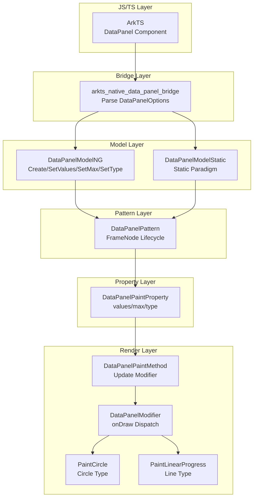

# 架构设计
> 确认目标仓和模块的架构约束、关键设计决策、Spec 拆分方向。

## 设计元数据

| Field | Content |
|-------|---------|
| Design ID | DESIGN-Func-05-10-01 |
| 关联需求 | 已有能力补录（无独立 requirement.md） |
| 关联 Epic | 无 |
| 目标 Feature | Feat-01（DataPanel 基础构造参数）, Feat-02（DataPanel 样式属性）, Feat-03（DataPanel 高级能力） |
| 复杂度 | 标准 |
| 目标版本 | API 8+（无 @since 标注，初始版本已包含） |
| Owner | ArkUI SIG |
| 状态 | Baselined（已有实现补录） |

## 需求基线

> 需求基线详见 proposal.md。以下仅列出设计阶段需要额外强调的要点。

| 项 | 补充说明 |
|----|----------|
| 构造参数验证 | values 数组长度限制、负值处理、max 回退逻辑、type 不可变性是核心边界行为 |
| 样式属性约束 | closeEffect 反转存储、valueColors 最多 9 段、strokeWidth 不能为负/百分比、borderRadius 仅限 LINE 类型（Feat-02） |

## 上下文和现状

### 涉及仓和模块

| 仓库 | 补充架构说明 |
|------|--------------|
| arkui_ace_engine | DataPanel 组件完整实现位于 `frameworks/core/components_ng/pattern/data_panel/`，包含 Pattern、Model、Paint Property、Paint Method、Modifier、Layout Algorithm |

### 调用链层级分析

| 层 | 模块 | 职责 | 修改类型 |
|----|------|------|----------|
| JS Bridge | `arkts_native_data_panel_bridge.cpp` | 解析 JS 侧 DataPanelOptions，验证 values/max/type | 已有实现 |
| Model | `data_panel_model_ng.cpp` / `data_panel_model_static.cpp` | 提供 Create/SetValues/SetMax/SetType 接口，更新 PaintProperty | 已有实现 |
| Pattern | `data_panel_pattern.cpp` | 管理 FrameNode 生命周期，处理 contentModifier 配置 | 已有实现 |
| Paint Property | `data_panel_paint_property.h` | 存储 values/max/type，定义 DataPanelShadow 结构 | 已有实现 |
| Paint Method | `data_panel_paint_method.cpp` | 读取 PaintProperty，更新 DataPanelModifier | 已有实现 |
| Modifier | `data_panel_modifier.cpp` | 执行 onDraw，根据 type 分发到 PaintCircle/PaintLinearProgress | 已有实现 |
| Layout Algorithm | `data_panel_layout_algorithm.cpp` | 继承 BoxLayoutAlgorithm，处理尺寸约束 | 已有实现 |

### 适用架构规则

| Rule ID | 适用原因 | 设计结论 | 验证方式 |
|---------|----------|----------|----------|
| OH-ARCH-LAYERING | 涉及 Bridge→Model→Pattern→Property→Paint 分层调用 | 调用方向严格单向，无跨层违规 | 代码评审 |
| OH-ARCH-API-LEVEL | 涉及 Public API（DataPanel 组件构造） | Public API，无权限要求，无 SysCap 约束 | API 评审 |
| OH-ARCH-COMPONENT-BUILD | 组件独立模块 | 无 BUILD.gn/bundle.json 变更，属于 ace_engine 部件 | 构建验证 |

## 不涉及项承接

| 维度 | 设计结论 |
|------|----------|
| 性能 | 无特殊性能要求，常规渲染组件 |
| 功耗 | 无特殊功耗要求 |
| 内存 | 无特殊内存优化需求 |
| 安全 | 无权限校验，无敏感数据 |

## 关键设计决策

| 决策 ID | 问题 | 推荐方案 | 探索过的替代方案 | 取舍理由 | 影响 |
|---------|------|----------|------------------|----------|------|
| ADR-1 | values 数组长度限制 | 最多支持 9 个数据段，超出截断 | 不限制长度 | 主题系统预定义 9 色对，超出无默认色 | 渲染逻辑、主题集成 |
| ADR-2 | 负值处理 | 自动钳制为 0.0 | 抛出异常 / 忽略 | 静默处理更友好，避免运行时崩溃 | 数据验证层 |
| ADR-3 | max <= 0 处理 | 回退为所有 values 总和 | 使用默认值 100 | 总和更符合"占比"语义 | 渲染计算 |
| ADR-4 | type 可变性 | 创建后不可变（isFirstCreate_ 标志） | 允许运行时切换 | 切换 type 需重建 Modifier，成本高 | API 约束 |
| ADR-5 | 存储位置 | values/max/type 全部存储在 PaintProperty | 部分存 LayoutProperty | 三者均影响绘制，不影响布局 | 属性分类 |
| ADR-F2-1 | closeEffect 存储反转 | PaintProperty 存储为 Effect = !closeEffect | 直接存储布尔值 | 动画效果默认开启，closeEffect 语义为"关闭效果" | 数据模型 |
| ADR-F2-2 | valueColors 长度限制 | 最多 9 段，缺失用主题默认色 | 无限制 | 主题预定义 9 色对，超出无默认色；缺失保持主题色 | 渲染逻辑 |
| ADR-F2-3 | strokeWidth 约束 | 不能为负数或百分比，回退主题厚度 | 允许负数 | 厚度必须有实际意义，负数/百分比无几何意义 | 数据验证 |
| ADR-F2-4 | borderRadius 类型限制 | 仅 LINE 类型生效，需 API 12+ | 全类型支持 | Circle 类型本身无角概念；圆角属后期增强能力 | API 约束 |
| ADR-F3-1 | trackShadow 颜色回退 | 未指定时使用 valueColors | 无回退 | 简化 API 使用，避免颜色不匹配 | 渲染逻辑 |
| ADR-F3-2 | ContentModifier 跳过默认渲染 | useContentModifier_ 标志控制 | 无法跳过 | 完全自定义渲染需要绕过默认管线 | 渲染架构 |
| ADR-F3-3 | C-API 双范式支持 | Dynamic + Static modifier 分离 | 单一范式 | 动态/静态范式有不同的属性传递机制 | API 设计 |

## 设计骨架

### 骨架范围

| 骨架项 | 目标 | 不包含 | 验证方式 |
|--------|------|--------|----------|
| DataPanelOptions 解析 | 验证 values/max/type 边界行为 | 样式属性（closeEffect/valueColors 等） | 单元测试 |
| PaintProperty 存储 | values/max/type 存取逻辑 | 阴影配置 | 代码评审 |

### 骨架 Spec 拆分

| Task ID | 目标 | 受影响文件 | AC |
|---------|------|------------|----|
| TASK-SKELETON-1 | 补录 Feat-01 规格 | design.md, Feat-01-*-spec.md | AC-1.1 ~ AC-1.8 |

## 后续 Task 拆分

| Task ID | 目标 | 受影响文件 | 依赖 |
|---------|------|------------|------|
| TASK-1 | 补录 Feat-01 规格（基础构造参数） | Feat-01-data-panel-ctor-spec.md | 无 |
| TASK-2 | 补录 Feat-02 规格（样式属性） | Feat-02-data-panel-style-spec.md | TASK-1 |
| TASK-3 | 补录 Feat-03 规格（高级能力） | Feat-03-data-panel-advanced-spec.md | TASK-1 |

## API 签名、Kit 与权限

### 新增 API

| API 签名 | 类型 | Kit | d.ts 位置 | 权限要求 | SysCap |
|----------|------|-----|-----------|----------|--------|
| `DataPanel(values: number[], max?: number, type?: DataPanelType)` | Public | ArkUI | 嵌入在 arkComponent.d.ts | 无 | SystemCapability.ArkUI.ArkUI.Full |
| `closeEffect(value: boolean)` | Public | ArkUI | 嵌入在 arkComponent.d.ts | 无 | SystemCapability.ArkUI.ArkUI.Full |
| `valueColors(value: Array<ResourceColor \| LinearGradient>)` | Public | ArkUI | 嵌入在 arkComponent.d.ts | 无 | SystemCapability.ArkUI.ArkUI.Full |
| `trackBackgroundColor(value: ResourceColor)` | Public | ArkUI | 嵌入在 arkComponent.d.ts | 无 | SystemCapability.ArkUI.ArkUI.Full |
| `strokeWidth(value: Length)` | Public | ArkUI | 嵌入在 arkComponent.d.ts | 无 | SystemCapability.ArkUI.ArkUI.Full |
| `borderRadius(value: Length \| BorderRadiuses)` | Public | ArkUI | 嵌入在 arkComponent.d.ts | 无 | SystemCapability.ArkUI.ArkUI.Full |

### 变更/废弃 API

无变更或废弃 API。

## 构建系统影响

### BUILD.gn 变更

无新增 BUILD.gn 文件。DataPanel 属于 ace_engine 部件的一部分。

### bundle.json 变更

无变更。DataPanel 随 ace_engine 部件发布。

## 可选设计扩展

### 架构图



### 数据流/控制流

| 步骤 | 调用方 | 被调用方 | 数据/接口 | 说明 |
|------|--------|----------|-----------|------|
| 1 | ArkTS | Bridge | DataPanelOptions | JS 构造参数传入 |
| 2 | Bridge | Model | values/max/type | 解析后调用 Model 接口 |
| 3 | Model | PaintProperty | ACE_UPDATE_PAINT_PROPERTY | 更新属性存储 |
| 4 | PaintMethod | Modifier | SetValues/SetMax/SetDataPanelType | 渲染前同步数据 |
| 5 | Modifier | onDraw | type 判断 | 分发到 Circle/Line 渲染 |

## 详细设计

### values 数组验证逻辑

```cpp
// frameworks/core/components_ng/pattern/data_panel/arkts_native_data_panel_bridge.cpp:370
size_t count = std::min(length, MAX_COUNT);  // MAX_COUNT = 9

// frameworks/core/components_ng/pattern/data_panel/arkts_native_data_panel_bridge.cpp:377-379
if (LessOrEqual(value, 0.0)) {
    value = 0.0;  // 负值钳制为 0.0
}
```

### max 计算逻辑

```cpp
// frameworks/core/components_ng/pattern/data_panel/arkts_native_data_panel_bridge.cpp:361
double max = maxArg->IsNumber() ? maxArg->ToNumber(vm)->Value() : 100.0;  // 默认 100

// frameworks/core/components_ng/pattern/data_panel/arkts_native_data_panel_bridge.cpp:388-390
if (LessOrEqual(max, 0.0)) {
    max = dataSum;  // max <= 0 时使用总和
}
```

### type 不可变实现

```cpp
// frameworks/core/components_ng/pattern/data_panel/data_panel_modifier.h:104-110
void SetDataPanelType(size_t dataPanelType)
{
    if (isFirstCreate_) {
        dataPanelType_ = dataPanelType;
        isFirstCreate_ = false;  // 仅首次设置
    }
}
```

### closeEffect 反转存储（Feat-02）

```cpp
// frameworks/core/components_ng/pattern/data_panel/data_panel_paint_property.h:279
ACE_DEFINE_PROPERTY_ITEM_WITHOUT_GROUP(Effect, bool, PROPERTY_UPDATE_RENDER);

// frameworks/core/components_ng/pattern/data_panel/data_panel_model_ng.cpp:71-74
void DataPanelModelNG::SetEffect(bool isEffect)
{
    ACE_UPDATE_PAINT_PROPERTY(DataPanelPaintProperty, Effect, isEffect);
}

// 存储为 Effect = !closeEffect
// closeEffect(false) → Effect = true（启用效果）
// closeEffect(true) → Effect = false（关闭效果）
```

### valueColors 渐变处理（Feat-02）

```cpp
// frameworks/core/components_ng/pattern/data_panel/arkts_native_data_panel_bridge.cpp:276-301
// 渐变偏移量钳制
if (Negative(offset.ConvertToVp())) {
    offset = Dimension(0.0, DimensionUnit::VP);
}
if (GreatNotEqual(offset.ConvertToVp(), 1.0)) {
    offset = Dimension(1.0, DimensionUnit::VP);
}

// frameworks/core/components_ng/pattern/data_panel/data_panel_modifier.cpp:129-134
// 长度限制
auto updateCount = std::min(valueColors.size(), valueColors_.size());
updateCount = std::min(updateCount, MAX_COUNT);  // MAX_COUNT = 9
```

### strokeWidth 约束验证（Feat-02）

```cpp
// frameworks/core/components_ng/pattern/data_panel/arkts_native_data_panel_bridge.cpp:663-666
if (strokeWidth.IsNegative() || strokeWidth.Unit() == DimensionUnit::PERCENT) {
    strokeWidth = theme->GetThickness();  // 回退主题默认值
    isSetByUser = false;  // 标记为非用户设置，允许主题更新
}
```

### borderRadius 类型限制（Feat-02）

```cpp
// frameworks/core/components_ng/pattern/data_panel/arkts_native_data_panel_bridge.cpp:705-712
if (dataPanelType_ != TYPE_CYCLE) {
    // LINE 类型：应用主题默认圆角
    ViewAbstractModel::GetInstance()->SetBorderRadius(theme->GetDefaultBorderRadius());
} else {
    // CIRCLE 类型：清除圆角
    ViewAbstractModel::GetInstance()->SetBorderRadius(Dimension {});
}

// frameworks/core/components_ng/pattern/data_panel/arkts_native_data_panel_bridge.cpp:692-700
// API 版本检查
if (Container::LessThanAPITargetVersion(PlatformVersion::VERSION_TWELVE)) {
    return panda::JSValueRef::Undefined(vm);  // API < 12 不生效
}
```

### trackShadow 颜色回退（Feat-03）

```cpp
// frameworks/core/components_ng/pattern/data_panel/data_panel_paint_method.cpp:86-110
void DataPanelPaintMethod::UpdateShadow(...)
{
    // Line 98: 颜色回退逻辑
    if (shadowOption.colors.size() == 0) {
        shadowOption.colors = valuesColor;  // 使用 valueColors
    }
}
```

### ContentModifier 渲染绕过（Feat-03）

```cpp
// frameworks/core/components_ng/pattern/data_panel/data_panel_modifier.cpp:112-122
void DataPanelModifier::onDraw(DrawingContext& context)
{
    // Line 114: 跳过默认渲染
    if (useContentModifier_->Get()) {
        return;  // ContentModifier 已设置，不执行默认绘制
    }
    
    if (dataPanelType_ == 0) {
        PaintCircle(context, offset_);
    } else {
        PaintLinearProgress(context, offset_);
    }
}
```

### C-API 接口结构（Feat-03）

```cpp
// frameworks/core/interfaces/native/generated/interface/arkoala_api_generated.h:25468-25481
typedef struct GENERATED_ArkUIDataPanelModifier {
    Ark_NativePointer (*construct)(Ark_Int32 id, Ark_Int32 flags);
    void (*setDataPanelOptions)(Ark_NativePointer node, const Ark_DataPanelOptions* options);
    void (*setCloseEffect)(Ark_NativePointer node, const Opt_Boolean* value);
    void (*setValueColors)(Ark_NativePointer node, const Opt_Array_Union_ResourceColor_LinearGradient* value);
    void (*setTrackBackgroundColor)(Ark_NativePointer node, const Opt_ResourceColor* value);
    void (*setStrokeWidth)(Ark_NativePointer node, const Opt_Length* value);
} GENERATED_ArkUIDataPanelModifier;

// frameworks/core/interfaces/native/generated/interface/arkoala_api_generated.h:29723-29727
typedef struct GENERATED_ArkUIDataPanelExtenderAccessor {
    void (*setTrackShadow)(Ark_NativePointer node, const Opt_DataPanelShadowOptions* options);
    void (*nullTrackShadow)(Ark_NativePointer node);
} GENERATED_ArkUIDataPanelExtenderAccessor;
```

## 风险和开放问题

| 项 | 类型 | 影响 | 处理方式 | Owner |
|----|------|------|----------|-------|
| 无独立 SDK .d.ts | 架构 | 低 | API 定义嵌入 arkComponent.d.ts，不影响功能 | ArkUI SIG |

## 设计审批

- [x] 需求基线已确认，设计覆盖 P0/P1 AC
- [x] 不涉及项已承接，N/A 和展开项都有结论
- [x] 涉及仓和模块职责清楚
- [x] 调用链层级分析完整，每层覆盖到位
- [x] 适用架构规则已识别并形成设计结论
- [x] 分层和子系统边界合规
- [x] API 变更有签名、权限、错误码和兼容性说明
- [x] BUILD.gn/bundle.json 影响明确
- [x] 设计输出和后续 Task 拆分明确
- [x] 关键设计决策有理由和影响说明
- [x] 风险和开放问题有 Owner

**结论:** 通过（已有实现补录）