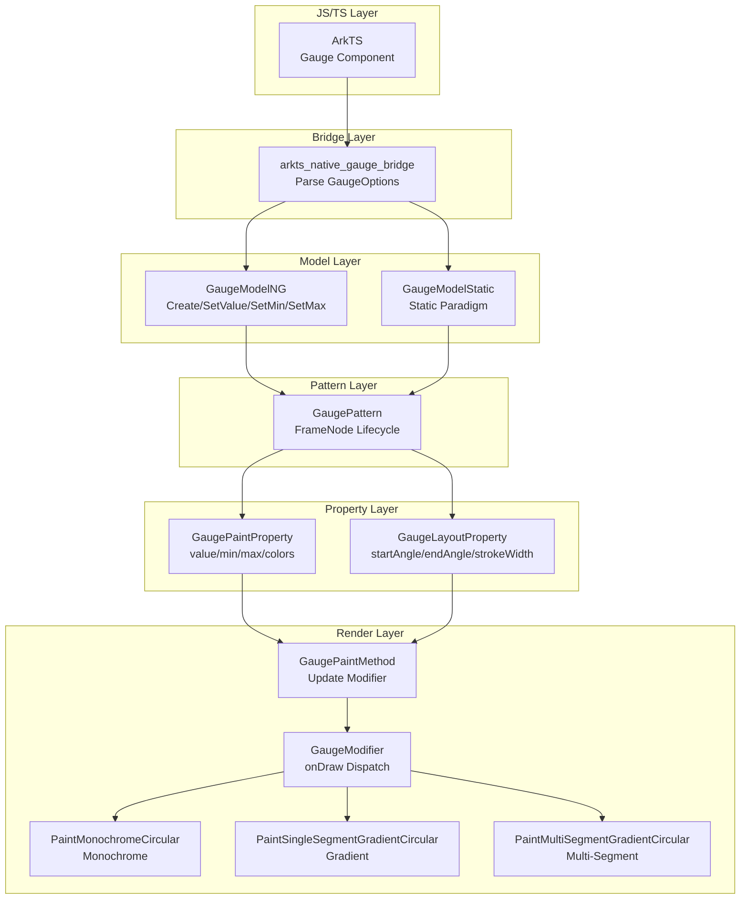

# 架构设计
> 确认目标仓和模块的架构约束、关键设计决策、Spec 拆分方向。

## 设计元数据

| Field | Content |
|-------|---------|
| Design ID | DESIGN-Func-05-10-02 |
| 关联需求 | 已有能力补录（无独立 requirement.md） |
| 关联 Epic | 无 |
| 目标 Feature | Feat-01（Gauge 核心属性）, Feat-02（Gauge 高级配置）, Feat-03（Gauge 高级能力） |
| 复杂度 | 标准 |
| 目标版本 | API 8+ |
| Owner | ArkUI SIG |
| 状态 | Baselined（已有实现补录） |

## 需求基线

> 需求基线详见 proposal.md。以下仅列出设计阶段需要额外强调的要点。

| 项 | 补充说明 |
|----|----------|
| 核心属性验证 | value 范围钳制、min/max 默认值、角度归一化、颜色类型分发是核心边界行为 |

## 上下文和现状

### 涉及仓和模块

| 仓库 | 补充架构说明 |
|------|--------------|
| arkui_ace_engine | Gauge 组件完整实现位于 `frameworks/core/components_ng/pattern/gauge/`，包含 Pattern、Model、Paint Property、Layout Property、Modifier、Layout Algorithm |

### 调用链层级分析

| 层 | 模块 | 职责 | 修改类型 |
|----|------|------|----------|
| JS Bridge | `arkts_native_gauge_bridge.cpp` | 解析 JS 侧 GaugeOptions，验证 value/min/max | 已有实现 |
| Model | `gauge_model_ng.cpp` / `gauge_model_static.cpp` | 提供 Create/SetValue/SetMin/SetMax 等接口，更新 PaintProperty | 已有实现 |
| Pattern | `gauge_pattern.cpp` | 管理 FrameNode 生命周期，处理 description/indicator 配置 | 已有实现 |
| Paint Property | `gauge_paint_property.h` | 存储 value/min/max/startAngle/endAngle/colors/strokeWidth，定义 GaugeType 枚举 | 已有实现 |
| Layout Property | `gauge_layout_property.h` | 存储 startAngle/endAngle/strokeWidth（影响布局） | 已有实现 |
| Paint Method | `gauge_paint_method.cpp` | 读取 PaintProperty，更新 GaugeModifier | 已有实现 |
| Modifier | `gauge_modifier.cpp` | 执行 onDraw，根据 GaugeType 分发到三种绘制方法 | 已有实现 |
| Layout Algorithm | `gauge_layout_algorithm.cpp` | 计算仪表盘尺寸和子节点布局 | 已有实现 |

### 适用架构规则

| Rule ID | 适用原因 | 设计结论 | 验证方式 |
|---------|----------|----------|----------|
| OH-ARCH-LAYERING | 涉及 Bridge→Model→Pattern→Property→Paint 分层调用 | 调用方向严格单向，无跨层违规 | 代码评审 |
| OH-ARCH-API-LEVEL | 涉及 Public API（Gauge 组件构造） | Public API，无权限要求，无 SysCap 约束 | API 评审 |
| OH-ARCH-COMPONENT-BUILD | 组件独立模块 | 无 BUILD.gn/bundle.json 变更，属于 ace_engine 部件 | 构建验证 |

## 不涉及项承接

| 维度 | 设计结论 |
|------|----------|
| 性能 | 无特殊性能要求，常规渲染组件 |
| 功耗 | 无特殊功耗要求 |
| 内存 | 无特殊内存优化需求 |
| 安全 | 无权限校验，无敏感数据 |

## 关键设计决策

| 决策 ID | 问题 | 推荐方案 | 探索过的替代方案 | 取舍理由 | 影响 |
|---------|------|----------|------------------|----------|------|
| ADR-1 | value 范围验证 | JS Bridge 和 Modifier 两级钳制到 [min, max] | 仅在 Bridge 验证 | 双重保护避免渲染异常 | 数据验证层 |
| ADR-2 | min >= max 处理 | 重置为默认值 (0, 100) | 抛出异常 | 静默处理更友好 | 数据验证层 |
| ADR-3 | GaugeType 分发 | 3 种类型：Monochrome/Gradient/MultiSegment | 单一渐变类型 | 支持不同视觉需求 | 渲染架构 |
| ADR-4 | startAngle == endAngle | 绘制完整 360 度圆 | 不绘制 | 符合直觉，避免空白 | 渲染逻辑 |
| ADR-5 | strokeWidth 约束 | 不支持百分比，超过半径时钳制到半径 | 允许任意值 | 保证视觉合理性 | 属性验证 |
| ADR-6 | 权重归一化 | 按总权重归一化，总和为 0 时跳过绘制 | 强制要求和为 1 | 灵活性与容错性平衡 | 渲染计算 |

## 设计骨架

### 骨架范围

| 骨架项 | 目标 | 不包含 | 验证方式 |
|--------|------|--------|----------|
| GaugeOptions 解析 | 验证 value/min/max 边界行为 | 高级配置（description/indicator/shadow） | 单元测试 |
| PaintProperty 存储 | value/min/max/startAngle/endAngle/colors/strokeWidth 存取逻辑 | ContentModifier | 代码评审 |

### 骨架 Spec 拆分

| Task ID | 目标 | 受影响文件 | AC |
|---------|------|------------|----|
| TASK-SKELETON-1 | 补录 Feat-01 规格 | design.md, Feat-01-*-spec.md | AC-1.1 ~ AC-1.14 |

## 后续 Task 拆分

| Task ID | 目标 | 受影响文件 | 依赖 |
|---------|------|------------|------|
| TASK-1 | 补录 Feat-01 规格（核心属性） | Feat-01-gauge-core-spec.md | 无 |
| TASK-2 | 补录 Feat-02 规格（高级配置） | Feat-02-gauge-advanced-config-spec.md | TASK-1 |
| TASK-3 | 补录 Feat-03 规格（高级能力） | Feat-03-gauge-advanced-spec.md | TASK-1 |

## API 签名、Kit 与权限

### 新增 API

| API 签名 | 类型 | Kit | d.ts 位置 | 权限要求 | SysCap |
|----------|------|-----|-----------|----------|--------|
| `Gauge(options?: GaugeOptions)` | Public | ArkUI | 嵌入在 arkComponent.d.ts | 无 | SystemCapability.ArkUI.ArkUI.Full |
| `value(value: number)` | Public | ArkUI | 嵌入在 arkComponent.d.ts | 无 | SystemCapability.ArkUI.ArkUI.Full |
| `min(min: number)` | Public | ArkUI | 嵌入在 arkComponent.d.ts | 无 | SystemCapability.ArkUI.ArkUI.Full |
| `max(max: number)` | Public | ArkUI | 嵌入在 arkComponent.d.ts | 无 | SystemCapability.ArkUI.ArkUI.Full |
| `startAngle(angle: number)` | Public | ArkUI | 嵌入在 arkComponent.d.ts | 无 | SystemCapability.ArkUI.ArkUI.Full |
| `endAngle(angle: number)` | Public | ArkUI | 嵌入在 arkComponent.d.ts | 无 | SystemCapability.ArkUI.ArkUI.Full |
| `colors(colors: ResourceColor \| LinearGradient \| Array<[ResourceColor \| LinearGradient, number]>)` | Public | ArkUI | 嵌入在 arkComponent.d.ts | 无 | SystemCapability.ArkUI.ArkUI.Full |
| `strokeWidth(length: Length)` | Public | ArkUI | 嵌入在 arkComponent.d.ts | 无 | SystemCapability.ArkUI.ArkUI.Full |

### 变更/废弃 API

无变更或废弃 API。

## 构建系统影响

### BUILD.gn 变更

无新增 BUILD.gn 文件。Gauge 属于 ace_engine 部件的一部分。

### bundle.json 变更

无变更。Gauge 随 ace_engine 部件发布。

## 可选设计扩展

### 架构图



### 数据流/控制流

| 步骤 | 调用方 | 被调用方 | 数据/接口 | 说明 |
|------|--------|----------|-----------|------|
| 1 | ArkTS | Bridge | GaugeOptions | JS 构造参数传入 |
| 2 | Bridge | Model | value/min/max | 解析后调用 Model 接口 |
| 3 | Model | PaintProperty | ACE_UPDATE_PAINT_PROPERTY | 更新属性存储 |
| 4 | PaintMethod | Modifier | SetValue/SetMin/SetMax | 渲染前同步数据 |
| 5 | Modifier | onDraw | GaugeType 判断 | 分发到三种绘制方法 |

## 详细设计

### value 范围钳制逻辑

```cpp
// frameworks/core/components_ng/pattern/gauge/arkts_native_gauge_bridge.cpp:376-382
if (LessNotEqual(gaugeValue, gaugeMin) || GreatNotEqual(gaugeValue, gaugeMax)) {
    gaugeValue = gaugeMin;  // 超出范围时使用 min
}

// frameworks/core/components_ng/pattern/gauge/gauge_modifier.cpp:63
value = std::clamp(value, min, max);  // Modifier 层再次钳制
```

### min/max 默认值处理

```cpp
// frameworks/core/components_ng/pattern/gauge/gauge_theme.h:31-32
inline constexpr float DEFAULT_MIN_VALUE = 0.0f;
inline constexpr float DEFAULT_MAX_VALUE = 100.0f;

// frameworks/core/components_ng/pattern/gauge/arkts_native_gauge_bridge.cpp:376-379
if (LessNotEqual(gaugeMax, gaugeMin)) {  // max < min 时重置
    gaugeMin = NG::DEFAULT_MIN_VALUE;
    gaugeMax = NG::DEFAULT_MAX_VALUE;
}
```

### GaugeType 分发机制

```cpp
// frameworks/core/components_ng/pattern/gauge/gauge_paint_property.h:30-34
enum class GaugeType : int32_t {
    TYPE_CIRCULAR_MULTI_SEGMENT_GRADIENT = 0,  // 多段渐变（带权重）
    TYPE_CIRCULAR_SINGLE_SEGMENT_GRADIENT = 1, // 单段渐变
    TYPE_CIRCULAR_MONOCHROME = 2,              // 单色
};

// frameworks/core/components_ng/pattern/gauge/gauge_modifier.cpp:391-407
switch (paintProperty->GetGaugeTypeValue(GaugeType::TYPE_CIRCULAR_SINGLE_SEGMENT_GRADIENT)) {
    case GaugeType::TYPE_CIRCULAR_MULTI_SEGMENT_GRADIENT:
        PaintMultiSegmentGradientCircular(canvas, data, paintProperty);
        break;
    case GaugeType::TYPE_CIRCULAR_SINGLE_SEGMENT_GRADIENT:
        PaintSingleSegmentGradientCircular(canvas, data, paintProperty);
        break;
    case GaugeType::TYPE_CIRCULAR_MONOCHROME:
        PaintMonochromeCircular(canvas, data, paintProperty);
        break;
}
```

### 角度归一化逻辑

```cpp
// frameworks/core/components_ng/pattern/gauge/gauge_modifier.cpp:843-852
float sweepDegree = endAngle - startAngle;
// 归一化到 [0, 360)
if (GreatNotEqual(sweepDegree, DEFAULT_END_DEGREE) || LessNotEqual(sweepDegree, DEFAULT_START_DEGREE)) {
    sweepDegree = sweepDegree - floor(sweepDegree / WHOLE_CIRCLE) * WHOLE_CIRCLE;
}
if (NearZero(sweepDegree)) {
    sweepDegree = WHOLE_CIRCLE;  // startAngle == endAngle 时绘制完整圆
}
```

### strokeWidth 约束验证

```cpp
// frameworks/core/components_ng/pattern/gauge/gauge_model_ng.cpp:340-341
if (!ResourceParseUtils::ParseResDimensionVpNG(resObj, result) || result.Unit() == DimensionUnit::PERCENT) {
    result = CalcDimension(0);  // 不支持百分比
}

// frameworks/core/components_ng/pattern/gauge/gauge_modifier.cpp:838-841
if (paintProperty->HasStrokeWidth() && (paintProperty->GetStrokeWidth()->Value() > 0)) {
    data.thickness = std::min(static_cast<float>(paintProperty->GetStrokeWidth()->ConvertToPx()),
        data.contentSize.Width() * PERCENT_HALF);  // 最大为半径
}
```

### 权重归一化处理

```cpp
// frameworks/core/components_ng/pattern/gauge/gauge_modifier.cpp:604-609
float totalWeight = ZERO_CIRCLE;
for (auto& weight : weights) {
    totalWeight += weight;
}
if (NearEqual(totalWeight, 0.0)) {  // 总和为 0 时跳过绘制
    return;
}

// frameworks/core/components_ng/pattern/gauge/gauge_modifier.cpp:622
info.drawSweepDegree = (weights[index] / totalWeight) * sweepDegree;  // 按权重比例绘制
```

## 风险和开放问题

| 项 | 类型 | 影响 | 处理方式 | Owner |
|----|------|------|----------|-------|
| 无独立 SDK .d.ts | 架构 | 低 | API 定义嵌入 arkComponent.d.ts，不影响功能 | ArkUI SIG |

## 设计审批

- [x] 需求基线已确认，设计覆盖 P0/P1 AC
- [x] 不涉及项已承接，N/A 和展开项都有结论
- [x] 涉及仓和模块职责清楚
- [x] 调用链层级分析完整，每层覆盖到位
- [x] 适用架构规则已识别并形成设计结论
- [x] 分层和子系统边界合规
- [x] API 变更有签名、权限、错误码和兼容性说明
- [x] BUILD.gn/bundle.json 影响明确
- [x] 设计输出和后续 Task 拆分明确
- [x] 关键设计决策有理由和影响说明
- [x] 风险和开放问题有 Owner

**结论:** 通过（已有实现补录）