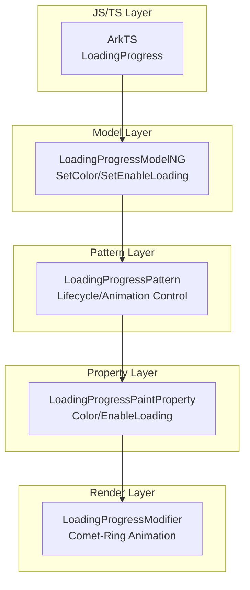

# 架构设计
> 确认目标仓和模块的架构约束、关键设计决策、Spec 拆分方向。

## 设计元数据

| Field | Content |
|-------|---------|
| Design ID | DESIGN-Func-05-10-03 |
| 关联需求 | 已有能力补录（无独立 requirement.md） |
| 关联 Epic | 无 |
| 目标 Feature | Feat-01（LoadingProgress 全量规格） |
| 复杂度 | 标准 |
| 目标版本 | API 8+ |
| Owner | ArkUI SIG |
| 状态 | Baselined（已有实现补录） |

## 需求基线

| 项 | 补充说明 |
|----|----------|
| 动画机制 | 彗星-环动画分 5 阶段，时长 1200ms，visibility 联动 |
| 颜色管理 | color/foregroundColor 共享属性，优先级链为用户设置 > 主题默认 |

## 上下文和现状

### 涉及仓和模块

| 仓库 | 补充架构说明 |
|------|--------------|
| arkui_ace_engine | LoadingProgress 组件位于 `frameworks/core/components_ng/pattern/loading_progress/`，包含 Pattern、Model、Modifier、Paint Property、Layout Algorithm |

### 调用链层级分析

| 层 | 模块 | 职责 | 修改类型 |
|----|------|------|----------|
| TS Modifier | `loading_progress_modifier.ts` | ArkTS 动态范式入口，lazyComponent.color/enableLoading | 已有实现 |
| Native Bridge | `arkts_native_loading_progress_bridge.cpp` | 解析 JS 侧属性，调用 Dynamic Modifier | 已有实现 |
| Dynamic Modifier | `loading_progress_dynamic_modifier.cpp` | 统一 Bridge 入口，资源对象处理 | 已有实现 |
| Model | `loading_progress_model_ng.cpp` | 提供 SetColor/SetEnableLoading 接口，资源解析 | 已有实现 |
| Pattern | `loading_progress_pattern.cpp` | 管理生命周期、四重条件检查、动画启停、主题更新 | 已有实现 |
| Paint Property | `loading_progress_paint_property.h` | 存储 Color/EnableLoading/Owner/ColorSetByUser | 已有实现 |
| Modifier | `loading_progress_modifier.cpp` | 执行彗星-环动画绘制，5阶段关键帧控制 | 已有实现 |
| C-API | `style_modifier.cpp` | NODE_LOADING_PROGRESS_COLOR/ENABLE_LOADING 分发 | 已有实现 |
| Layout Algorithm | `loading_progress_layout_algorithm.cpp` | 计算默认尺寸 | 已有实现 |

### 适用架构规则

| Rule ID | 适用原因 | 设计结论 | 验证方式 |
|---------|----------|----------|----------|
| OH-ARCH-LAYERING | Bridge→Model→Pattern→Modifier 分层 | 调用方向单向 | 代码评审 |
| OH-ARCH-API-LEVEL | Public API | 无权限要求 | API 评审 |

## 不涉及项承接

| 维度 | 设计结论 |
|------|----------|
| 性能 | 无特殊要求 |
| 功耗 | 无特殊要求 |
| 安全 | 无权限校验 |

## 关键设计决策

| 决策 ID | 问题 | 推荐方案 | 探索过的替代方案 | 取舍理由 | 影响 |
|---------|------|----------|------------------|----------|------|
| ADR-1 | 动画阶段划分 | 5 阶段（STAGE1-5），1200ms 总时长 | 单一动画 | 彗星尾部效果需要分阶段控制 | 动画逻辑 |
| ADR-2 | 颜色属性合并 | color/foregroundColor 设置同一属性 | 分开存储 | 简化实现，colorSetByUser 标志区分来源 | 数据模型 |
| ADR-3 | visibility 联动 | 可见性变化自动启停动画 | 手动控制 | 性能优化，避免不可见时消耗资源 | 渲染逻辑 |
| ADR-4 | enableLoading 控制 | false 时完全停止动画 | 继续绘制静态帧 | 节省资源，避免无效渲染 | 状态管理 |
| ADR-F1-1 | 动画启停条件 | 四重条件检查（isVisibleArea_ && isVisible_ && isShow_ && enableLoading_） | 单一条件 | 确保所有可见性相关状态一致才启动动画，避免资源浪费 | 性能、可靠性 |
| ADR-F1-2 | C-API 颜色格式 | 直接使用 uint32_t (0xARGB)，无需转换 | ARGB→RGBA 转换 | Color 构造函数直接接受 u32，减少转换开销 | 性能 |
| ADR-F1-3 | contentModifier 集成 | useContentModifier_ 标志控制 onDraw 跳过 | 运行时判断 Builder | 标志位检查比 Builder 空指针判断更快 | 性能 |
| ADR-F1-4 | 资源动态更新 | AddResObj 注册资源更新回调，ParseResColor 解析 | 每次访问重新解析 | 支持动态切换，仅资源对象时注册回调 | 功能完整性 |

## 设计骨架

| 骨架项 | 目标 | 不包含 | 验证方式 |
|--------|------|--------|----------|
| LoadingProgress 属性解析 | color/enableLoading/foregroundColor 边界行为 | contentModifier 自定义 | 单元测试 |

## 后续 Task 拆分

| Task ID | 目标 | 受影响文件 | 依赖 |
|---------|------|------------|------|
| TASK-1 | 补录 LoadingProgress 全量规格 | Feat-01-loading-progress-full-spec.md | 无 |

## API 签名、Kit 与权限

### 新增 API

| API 签名 | 类型 | Kit | d.ts 位置 | 权限要求 | SysCap |
|----------|------|-----|-----------|----------|--------|
| `color(value: ResourceColor)` | Public | ArkUI | 嵌入在 arkComponent.d.ts | 无 | SystemCapability.ArkUI.ArkUI.Full |
| `enableLoading(value: boolean)` | Public | ArkUI | 嵌入在 arkComponent.d.ts | 无 | SystemCapability.ArkUI.ArkUI.Full |
| `foregroundColor(value: ResourceColor)` | Public | ArkUI | 嵌入在 arkComponent.d.ts | 无 | SystemCapability.ArkUI.ArkUI.Full |
| `contentModifier(value: ContentModifier<LoadingProgressConfiguration>)` | Public | ArkUI | 嵌入在 arkComponent.d.ts | 无 | SystemCapability.ArkUI.ArkUI.Full |

## 构建系统影响

无变更。LoadingProgress 属于 ace_engine 部件。

## 可选设计扩展

### 架构图



## 详细设计

### 动画阶段划分

```cpp
// frameworks/core/components_ng/pattern/loading_progress/loading_progress_modifier.cpp:52-56
constexpr float STAGE1 = 0.25f;  // 25% 进度
constexpr float STAGE2 = 0.65f;  // 65% 进度
constexpr float STAGE3 = 0.75f;  // 75% 进度
constexpr float STAGE4 = 0.85f;  // 85% 进度
constexpr float STAGE5 = 1.0f;   // 100% 进度（完成）

// 动画时长
constexpr int32_t LOADING_DURATION = 1200;  // 1200ms
```

### 颜色优先级链

```cpp
// frameworks/core/components_ng/pattern/loading_progress/loading_progress_pattern.cpp:66-74
if (!rendContext->GetForegroundColorFlag().value_or(false)) {
    // 用户未设置 foregroundColor，使用主题颜色
    paintProperty->UpdateColor(theme->GetLoadingColor());
    rendContext->UpdateForegroundColor(theme->GetLoadingColor());
}
```

### enableLoading 控制

```cpp
// frameworks/core/components_ng/pattern/loading_progress/loading_progress_pattern.cpp:93-94
enableLoading_ = paintProperty->GetEnableLoadingValue(true);
enableLoading_ ? StartAnimation() : StopAnimation();
```

### visibility 联动

```cpp
// frameworks/core/components_ng/pattern/loading_progress/loading_progress_pattern.cpp:98-102
void LoadingProgressPattern::OnVisibleChange(bool isVisible) {
    isVisible_ = isVisible;
    isVisible_ ? StartAnimation() : StopAnimation();
}
```

### 四重条件检查机制

```cpp
// frameworks/core/components_ng/pattern/loading_progress/loading_progress_pattern.cpp:104-116
void LoadingProgressPattern::StartAnimation()
{
    CHECK_NULL_VOID(loadingProgressModifier_);
    if (loadingProgressModifier_->GetVisible()) {
        return;  // 已在运行，避免重复启动
    }
    // 四重条件检查
    if (isVisibleArea_ && isVisible_ && isShow_ && enableLoading_) {
        loadingProgressModifier_->SetVisible(true);
        auto host = GetHost();
        CHECK_NULL_VOID(host);
        host->MarkDirtyNode(PROPERTY_UPDATE_RENDER);
    }
}
```

**条件说明**：
- `isVisibleArea_`: 组件在可见区域内（滚动出屏幕时为 false）
- `isVisible_`: 组件可见性标志（通用属性 visibility 控制）
- `isShow_`: 窗口显示状态（OnWindowHide/OnWindowShow 更新）
- `enableLoading_`: 用户设置的加载启用状态（默认 true）

### C-API 颜色格式

```cpp
// frameworks/core/components_ng/pattern/loading_progress/bridge/loading_progress_dynamic_modifier.cpp:75-94
void SetLoadingProgressColor(ArkUINodeHandle node, uint32_t colorValue)
{
    auto* frameNode = GetFrameNode(node);
    CHECK_NULL_VOID(frameNode);
    
    // 关键：直接将 u32 转换为 Color 对象，无需 ARGB→RGBA 转换
    LoadingProgressModelNG::SetColorByUser(frameNode, true);
    LoadingProgressModelNG::SetColor(frameNode, Color(colorValue));
}
```

**颜色格式说明**：
- C-API 传入: `uint32_t` 类型，格式为 **0xARGB**（例如 `0xFFFF0000` 表示红色）
- 内部转换: `Color(colorValue)` 构造函数直接接受 u32 值
- 底层存储: `Color` 类内部使用 `uint32_t` 存储颜色值，GetValue() 返回原始 u32

### 资源动态更新

```cpp
// frameworks/core/components_ng/pattern/loading_progress/loading_progress_model_ng.cpp:189-211
void HandleColorResource(const RefPtr<LoadingProgressPattern>& pattern, const RefPtr<ResourceObject>& resObj)
{
    std::string key = "loadingProgress.Color";
    pattern->RemoveResObj(key);
    CHECK_NULL_VOID(resObj);
    auto&& updateFunc = [weak, key](const RefPtr<ResourceObject>& resObj, bool isFirstLoad) {
        Color result;
        if (!ResourceParseUtils::ParseResColor(resObj, result)) {
            // 解析失败，使用主题默认值
            auto progressTheme = pipeline->GetTheme<ProgressTheme>();
            result = progressTheme->GetLoadingColor();
        }
        pattern->UpdateColor(result, isFirstLoad);
    };
    pattern->AddResObj(key, resObj, std::move(updateFunc));  // 注册资源更新回调
}
```

### contentModifier 集成路径

```cpp
// frameworks/core/components_ng/pattern/loading_progress/loading_progress_pattern.cpp:173-195
void LoadingProgressPattern::FireBuilder()
{
    auto host = GetHost();
    CHECK_NULL_VOID(host);
    
    // 无 Builder，移除自定义内容，恢复默认动画
    if (!makeFunc_.has_value()) {
        host->RemoveChildAtIndex(0);
        host->GetRenderContext()->SetClipToFrame(true);
        host->GetRenderContext()->SetClipToBounds(true);
        host->MarkNeedFrameFlushDirty(PROPERTY_UPDATE_MEASURE);
        return;
    }
    
    // 构建 contentModifier 节点
    auto node = BuildContentModifierNode();
    if (contentModifierNode_ == node) {
        return;  // 未变化，跳过
    }
    
    // 移除旧节点，添加新节点
    host->GetRenderContext()->SetClipToFrame(false);
    host->GetRenderContext()->SetClipToBounds(false);
    host->RemoveChildAndReturnIndex(contentModifierNode_);
    contentModifierNode_ = node;
    CHECK_NULL_VOID(contentModifierNode_);
    host->AddChild(contentModifierNode_, 0);
    host->MarkNeedFrameFlushDirty(PROPERTY_UPDATE_MEASURE);
}

// frameworks/core/components_ng/pattern/loading_progress/loading_progress_modifier.cpp:100-107
void LoadingProgressModifier::onDraw(DrawingContext& context)
{
    if (useContentModifier_->Get()) {
        return;  // 跳过默认动画绘制，由 contentModifierNode_ 子节点渲染
    }
    // ... 默认彗星-环动画绘制
}
```

### 深色模式处理

```cpp
// frameworks/core/components_ng/pattern/loading_progress/loading_progress_modifier.cpp:148-168
if (ColorMode::DARK) {
    // 绘制环背景（模糊效果）
    DrawRingBackground(context, ringParam, ringColor);
    
    // 应用模糊滤镜
    RSFilter filter;
    filter.SetImageFilter(RSRecordingImageFilter::CreateBlurImageFilter(...));
    pen.SetFilter(filter);
}

// 彗星透明度调整
if (Container::CurrentColorMode() == ColorMode::DARK && 
    cometColor.GetValue() == DEFAULT_COLOR_DARK.GetValue()) {
    colorAlpha = OPACITY3;  // 1.0
}
```

## 风险和开放问题

| 项 | 类型 | 影响 | 处理方式 | Owner |
|----|------|------|----------|-------|
| 无独立 SDK .d.ts | 架构 | 低 | API 定义嵌入 arkComponent.d.ts | ArkUI SIG |
| 四重条件状态同步 | 可靠性 | 中 | 确保所有状态变量原子性更新，避免竞态 | ArkUI SIG |
| C-API 颜色格式误解 | 兼容性 | 低 | 文档明确 0xARGB 格式，无需转换 | ArkUI SIG |
| contentBuilder 与 contentModifier 优先级 | 功能 | 低 | 明确 contentModifier 优先，跳过默认动画 | ArkUI SIG |

## 设计审批

- [x] 需求基线已确认
- [x] 不涉及项已承接
- [x] 涉及仓和模块职责清楚
- [x] 调用链层级分析完整
- [x] 适用架构规则已识别
- [x] 分层边界合规
- [x] API 签名明确
- [x] 设计输出明确

**结论:** 通过（已有实现补录）