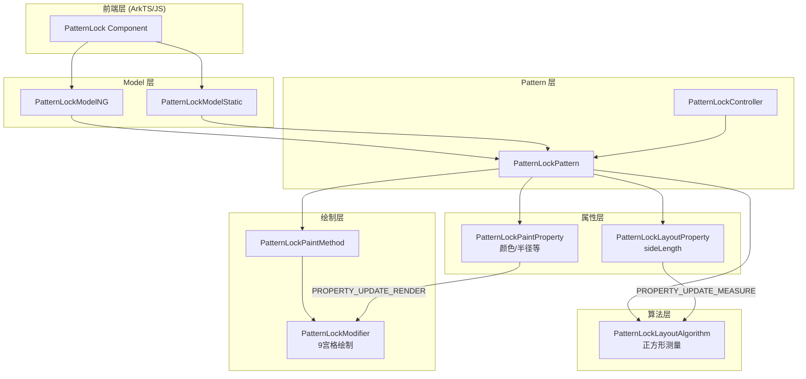

# 架构设计

> 确认目标仓和模块的架构约束、关键设计决策、Spec 拆分方向。

## 设计元数据

| Field | Content |
|-------|---------|
| Design ID | DESIGN-Func-05-10-04 |
| 关联需求 | 已有能力补录（无独立 requirement.md） |
| 关联 Epic | 无 |
| 目标 Feature | Feat-01: PatternLock 创建、核心属性与视觉样式；Feat-02: 交互行为、事件与控制器；Feat-03: 多范式接口与 C-API |
| 复杂度 | 标准 |
| 目标版本 | API 8+ |
| Owner | ArkUI SIG |
| 状态 | Baselined（已有实现补录） |

## 需求基线

> 需求基线详见 proposal.md。以下仅列出设计阶段需要额外强调的要点。

| 项 | 补充说明 |
|----|------------------|
| 九宫格图案锁组件 | 提供 3x3 点阵布局，支持手势滑动连接，用于安全解锁场景 |
| 视觉样式自定义 | 支持颜色、圆点半径、线宽、侧边长度等 9 个核心属性配置 |
| 多范式接口 | 动态 API (ModelNG)、静态 API (ModelStatic)、C-API (Native Modifier) |
| （Feat-02）交互行为 | 手势检测、点选逻辑、自动重置、跳过未选中点、波纹效果 |
| （Feat-02）事件回调 | patternComplete（图案完成）、dotConnect（点连接）事件 |

## 上下文和现状

### 涉及仓和模块

| 仓库 | 补充架构说明 |
|------|--------------|
| arkui_ace_engine | 核心渲染引擎，包含 PatternLock 的完整实现 |

| 模块 | 路径 | 当前职责 | 影响类型 |
|------|------|----------|----------|
| PatternLockPattern | frameworks/core/components_ng/pattern/patternlock/patternlock_pattern.cpp | Pattern 层核心逻辑 | 无变更（补录） |
| PatternLockModelNG | frameworks/core/components_ng/pattern/patternlock/patternlock_model_ng.cpp | 动态范式 Model 层 | 无变更（补录） |
| PatternLockModelStatic | frameworks/core/components_ng/pattern/patternlock/patternlock_model_static.cpp | 静态范式 Model 层 | 无变更（补录） |
| PatternLockPaintProperty | frameworks/core/components_ng/pattern/patternlock/patternlock_paint_property.h | 绘制属性存储 | 无变更（补录） |
| PatternLockLayoutProperty | frameworks/core/components_ng/pattern/patternlock/patternlock_layout_property.h | 布局属性存储 | 无变更（补录） |
| PatternLockModifier | frameworks/core/components_ng/pattern/patternlock/patternlock_modifier.cpp | 绘制修饰器 | 无变更（补录） |
| PatternLockPaintMethod | frameworks/core/components_ng/pattern/patternlock/patternlock_paint_method.cpp | 绘制方法 | 无变更（补录） |
| PatternLockLayoutAlgorithm | frameworks/core/components_ng/pattern/patternlock/patternlock_layout_algorithm.cpp | 布局算法 | 无变更（补录） |

### 调用链层级分析

| 层 | 模块 | 职责 | 修改类型 |
|----|------|------|----------|
| 前端层 | ArkTS/JS | 组件接口暴露，链式调用入口 | 无变更 |
| Model 层 | PatternLockModelNG/Static | 属性分发，FrameNode 创建与属性设置 | 无变更 |
| Pattern 层 | PatternLockPattern | 生命周期管理，触摸事件处理，控制器绑定 | 无变更 |
| LayoutProperty 层 | PatternLockLayoutProperty | sideLength 属性存储（PROPERTY_UPDATE_MEASURE） | 无变更 |
| PaintProperty 层 | PatternLockPaintProperty | 颜色、半径等属性存储（PROPERTY_UPDATE_RENDER） | 无变更 |
| LayoutAlgorithm 层 | PatternLockLayoutAlgorithm | 正方形尺寸测量，sideLength 计算 | 无变更 |
| PaintMethod 层 | PatternLockPaintMethod | 属性传递到 Modifier，主题默认值获取 | 无变更 |
| Modifier 层 | PatternLockModifier | 9 宫格绘制，路径连接，动画属性管理 | 无变更 |

检查项：
- [x] 调用链每一层都已覆盖（从最上层到最下层）
- [x] 每层职责边界清晰，无跨层违规调用
- [x] 每层修改类型明确（无变更，补录规格）

### 适用架构规则

| Rule ID | 适用原因 | 设计结论 | 验证方式 |
|---------|----------|----------|----------|
| OH-ARCH-LAYERING | 涉及多层调用（前端→Model→Pattern→Property→Render） | 调用方向为单向向下，无跨层回调 | 代码评审 |
| OH-ARCH-API-LEVEL | 涉及公开 API（ArkTS 组件属性） | API 8+ 支持，无权限要求 | API 评审 |
| OH-ARCH-COMPONENT-BUILD | 涉及组件构建 | 已在 components.gni 中注册 | 构建验证 |

## 不涉及项承接

> proposal.md 已完成 N/A 判定。本节仅对 proposal 中标记为"涉及"且需展开设计的维度给出结论。

| 维度 | 设计结论 |
|------|----------|
| 安全性 | 组件本身不存储密码，仅返回图案序列，安全验证由应用层实现 |
| 性能 | 已有波纹动画优化，每点 4 个动画属性独立管理 |

## 关键设计决策

| 决策 ID | 问题 | 推荐方案 | 探索过的替代方案 | 取舍理由 | 影响 |
|---------|------|----------|------------------|----------|------|
| ADR-1 | sideLength 存储位置 | 存储在 LayoutProperty，其他属性存储在 PaintProperty | 所有属性统一存储 | sideLength 影响布局测量（MEASURE），颜色/半径仅影响渲染（RENDER） | 脏标记策略差异：sideLength 触发重新测量，其他触发重新渲染 |
| ADR-2 | 颜色属性追踪机制 | 每个颜色属性有对应的 SetByUser 标志位 | 无追踪，每次都覆盖 | 支持主题切换时区分用户设置和主题默认值 | 影响主题切换时的属性覆盖优先级 |
| ADR-3 | 单元格中心计算 | 公式：`offset + sideLength/6 * (2*x - 1)`，x,y 为 1-3 | 固定偏移计算 | 简洁且自适应 sideLength 变化 | 影响热区检测精度验证 |
| ADR-4 | 圆点半径转换 | circleRadius 依赖 sideLength 进行 px 转换：`ConvertToPxWithSize(sideLength)` | 独立转换 | 保证圆点半径与组件尺寸成比例 | 影响尺寸属性的计算顺序依赖 |
| ADR-5 | API 版本绘制差异 | API 10+ 支持前景/背景模式切换，API 9 使用旧版绘制 | 统一绘制逻辑 | 兼容旧版本行为 | 影响多版本兼容性测试 |
| ADR-6 | 动画属性管理 | 每个点有 4 个独立动画属性：backgroundRadius、activeRadius、lightRingRadius、lightRingAlphaF | 统一动画对象 | 支持每点独立动画状态 | 影响动画规格和性能测试 |
| ADR-F2-1 | 多点触控处理 | 只跟踪第一个按下的手指（fingerId_），忽略其他手指 | 追踪所有手指 | 简化交互逻辑，避免多点冲突 | 影响并发触控行为 |
| ADR-F2-2 | 自动重置策略 | autoReset=true 时在 OnTouchDown 触发重置；autoReset=false 时保留选择状态 | 手动重置 | 支持查看已绘制图案 | 影响用户体验和控制器 Reset() 调用时机 |
| ADR-F2-3 | 跳过未选中点 | 通过共线检测自动添加中间点，code 计算公式：`COL_COUNT * (row-1) + (column-1)` | 不自动添加 | 符合 Android 图案锁行为 | 影响图案路径计算 |
| ADR-F2-4 | 波纹效果控制 | enableWaveEffect=true 时启动光圈动画（lightRingRadius + lightRingAlphaF） | 固定启用 | 允许用户禁用以提升性能或简化视觉 | 影响绘制性能和视觉效果 |
| ADR-F2-5 | 事件回调设计 | patternComplete 返回选中点 code 数组，dotConnect 返回单个 code | 返回完整 PatternLockCell 对象 | 简化应用层处理 | 影响 API 签名设计 |
| ADR-F3-1 | 动态 API 设计 | Create() 返回 PatternLockController，属性通过 ViewStackProcessor 传递 | 返回 FrameNode | 符合 ArkTS 链式调用习惯 | 影响动态范式接口 |
| ADR-F3-2 | 静态 API 设计 | CreateFrameNode() 返回 FrameNode，属性使用 std::optional 支持重置 | 直接传值 | 支持静态编译优化和属性重置 | 影响静态范式接口 |
| ADR-F3-3 | C-API 架构 | 采用 ARKUI_NATIVE_NODE_NATIVE_MODIFIER 模式，分离动态/静态接口 | 统一 C 接口 | 兼容新旧管线，支持多前端 | 影响 NDK 开发体验 |

## 设计骨架

### 骨架范围

| 骨架项 | 目标 | 不包含 | 验证方式 |
|--------|------|--------|----------|
| 核心属性 | sideLength, circleRadius, strokeWidth, selectedColor, pathColor, activeColor, regularColor, activeCircleColor, activeCircleRadius | 交互行为属性（autoReset, enableWaveEffect, skipUnselectedPoint） | 单元测试 |
| 视觉样式 | 9 宫格圆点绘制，路径连接线 | 波纹动画详细规格 | 渲染测试 |
| （Feat-02）交互行为 | 手势检测、点选逻辑、自动重置、跳过未选中点、波纹效果 | 控制器接口规格 | 交互测试 |
| （Feat-02）事件回调 | patternComplete、dotConnect 事件 | C-API 事件接口 | 事件测试 |

### 骨架 Spec 拆分

| Task ID | 目标 | 受影响文件 | AC |
|---------|------|------------|----|
| TASK-SKELETON-1 | 创建 design.md 和 Feat-01 规格文档 | design.md, Feat-01-*-spec.md | 规格覆盖核心属性和视觉样式 |

## 后续 Task 拆分

| Task ID | 目标 | 受影响文件 | 依赖 |
|---------|------|------------|------|
| TASK-1 | Feat-01 规格生成 | Feat-01-pattern-lock-core-properties-visual-spec.md | 无 |
| TASK-2 | Feat-02 规格生成（交互行为、事件与控制器） | Feat-02-*-spec.md | TASK-1 |
| TASK-3 | Feat-03 规格生成（多范式接口与 C-API） | Feat-03-*-spec.md | TASK-1 |

## API 签名、Kit 与权限

### 新增 API

> 已有实现补录，无新增 API。

### 变更/废弃 API

> 无变更或废弃 API。

## 构建系统影响

### BUILD.gn 变更

> 无构建系统变更，组件已在 components.gni 中注册。

### bundle.json 变更

> 无变更。

## 可选设计扩展

### 架构图



### 数据流/控制流

| 步骤 | 调用方 | 被调用方 | 数据/接口 | 说明 |
|------|--------|----------|-----------|------|
| 1 | ArkTS | ModelNG.SetSideLength() | Dimension | 设置侧边长度 |
| 2 | ModelNG | LayoutProperty.UpdateSideLength() | Dimension | 存储到布局属性 |
| 3 | LayoutAlgorithm | MeasureContent() | sideLength | 计算正方形尺寸 |
| 4 | ArkTS | ModelNG.SetSelectedColor() | Color | 设置选中颜色 |
| 5 | ModelNG | PaintProperty.UpdateSelectedColor() | Color | 存储到绘制属性 |
| 6 | PaintMethod | UpdateContentModifier() | 所有属性 | 传递到 Modifier |
| 7 | Modifier | onDraw() | 绘制参数 | 执行 9 宫格绘制 |

### 数据模型设计

| 层级 | 类型定义 | 存储方案 |
|------|----------|----------|
| ArkTS API | `selectedColor: ResourceColor` | 通过 ModelNG 传递 |
| LayoutProperty | `propSideLength_: Dimension` | `ACE_DEFINE_PROPERTY_ITEM_WITHOUT_GROUP` |
| PaintProperty | `propCircleRadius_: Dimension`<br/>`propSelectedColor_: Color`<br/>`propPathColor_: Color`<br/>... | `ACE_DEFINE_PROPERTY_ITEM_WITHOUT_GROUP` |
| Modifier 动画 | `backgroundRadius_: AnimatablePropertyFloat`<br/>`activeRadius_: AnimatablePropertyFloat`<br/>`lightRingRadius_: AnimatablePropertyFloat`<br/>`lightRingAlphaF_: AnimatablePropertyFloat` | 每点 4 个动画属性（共 9×4=36 个） |

### 接口参数规约

| 接口 | 参数 | 类型 | 合法范围 | 非法处理 | 边界说明 |
|------|------|------|----------|----------|----------|
| SetSideLength | sideLength | Dimension | >0 vp | <=0 时使用主题默认值 | 最小 0vp |
| SetCircleRadius | radius | Dimension | >0 vp | <=0 时使用主题默认值 | 依赖 sideLength 进行 px 转换 |
| SetSelectedColor | color | Color | 有效颜色值 | 忽略无效值 | 支持 ResourceColor |

## 详细设计

### sideLength 属性处理

**源码**: `patternlock_model_ng.cpp:118-122`

```cpp
void PatternLockModelNG::SetSideLength(const Dimension& sideLength)
{
    ACE_UPDATE_LAYOUT_PROPERTY(PatternLockLayoutProperty, SideLength, sideLength);
    ACE_CHECK_LPX_ATTRIBUTE(sideLength, LpxAttribute::LPX_PATTERNLOCK_SIDE_LENGTH);
}
```

**关键逻辑**:
1. 使用 `ACE_UPDATE_LAYOUT_PROPERTY` 宏，触发 `PROPERTY_UPDATE_MEASURE`
2. 支持 LPX 属性检查（响应式设计）

**布局算法处理** (`patternlock_layout_algorithm.cpp:30-50`):
```cpp
// 1. 从主题获取默认值
sideLength_ = patternLockTheme->GetSideLength();

// 2. 属性覆盖
sideLength_ = patternLockLayoutProperty->GetSideLength().value_or(sideLength_);

// 3. 转换为像素
auto length = static_cast<float>(sideLength_.ConvertToPxWithSize(std::min(size.Height(), size.Width())));

// 4. 强制正方形
float maxLength = std::min(selfIdealWidth, selfIdealHeight);
length = std::min(maxLength, length);
return SizeF(length, length);
```

### 颜色属性 SetByUser 追踪机制

**源码**: `patternlock_model_ng.cpp:63-67`

```cpp
void PatternLockModelNG::SetSelectedColor(const Color& selectedColor)
{
    ACE_UPDATE_PAINT_PROPERTY(PatternLockPaintProperty, SelectedColor, selectedColor);
    ACE_UPDATE_PAINT_PROPERTY(PatternLockPaintProperty, SelectedColorSetByUser, true);
}
```

**追踪属性列表**:
- `SelectedColorSetByUser`
- `PathColorSetByUser`
- `ActiveColorSetByUser`
- `RegularColorSetByUser`
- `ActiveCircleColorSetByUser`

**用途**: 在主题切换时，通过 `IsSystemColorChange()` 判断是否覆盖用户设置。

### 单元格中心计算

**源码**: `patternlock_modifier.cpp:478-486`

```cpp
OffsetF PatternLockModifier::GetCircleCenterByXY(const OffsetF& offset, int32_t x, int32_t y)
{
    float sideLength = sideLength_->Get();
    OffsetF cellCenter;
    int32_t scale = RADIUS_TO_DIAMETER;  // = 2
    cellCenter.SetX(offset.GetX() + sideLength / PATTERN_LOCK_COL_COUNT / scale * (x * scale - 1));
    cellCenter.SetY(offset.GetY() + sideLength / PATTERN_LOCK_COL_COUNT / scale * (y * scale - 1));
    return cellCenter;
}
```

**公式展开**:
- `PATTERN_LOCK_COL_COUNT = 3`
- `scale = 2`
- `centerX = offset.x + sideLength / 6 * (2x - 1)`
- 当 x=1: `centerX = offset.x + sideLength / 6`（第一列）
- 当 x=2: `centerX = offset.x + sideLength / 2`（第二列）
- 当 x=3: `centerX = offset.x + sideLength * 5 / 6`（第三列）

**网格布局**:
```
(1,1)  (2,1)  (3,1)
(1,2)  (2,2)  (3,2)
(1,3)  (2,3)  (3,3)
```

### 圆点半径转换依赖

**源码**: `patternlock_paint_method.cpp:63`

```cpp
patternlockModifier_->SetCircleRadius(circleRadius_.ConvertToPxWithSize(sideLength_));
```

**依赖关系**:
1. `sideLength` 在 `MeasureContent()` 中确定
2. `circleRadius` 需要在绘制时转换为像素
3. 使用 `ConvertToPxWithSize(sideLength)` 保证比例正确

### API 版本绘制差异

**源码**: `patternlock_modifier.cpp:143-166`

```cpp
void PatternLockModifier::onDraw(DrawingContext& context)
{
    if (Container::LessThanAPIVersion(PlatformVersion::VERSION_TEN)) {
        DrawForApiNine(context);  // 旧版绘制
        return;
    }
    
    if (!enableForeground_->Get()) {
        // 默认模式: Line -> ActiveCircle -> Circles
        PaintLockLine(canvas, offset);
        PaintActiveCircle(canvas, offset);
        // ... 画 9 个圆点
    } else {
        // 前景模式: Circles -> Line
        // ... 先画 9 个圆点
        PaintLockLine(canvas, offset);
        PaintActiveCircle(canvas, offset);
    }
}
```

### 动画属性架构

**源码**: `patternlock_modifier.cpp:120-136`

每点 4 个动画属性：
```cpp
for (size_t count = 0; count < PATTERN_LOCK_POINT_COUNT; count++) {  // 9 点
    auto backgroundRadius = AceType::MakeRefPtr<AnimatablePropertyFloat>(0.0f);
    auto activeRadius = AceType::MakeRefPtr<AnimatablePropertyFloat>(0.0f);
    auto lightRingRadius = AceType::MakeRefPtr<AnimatablePropertyFloat>(0.0f);
    auto lightRingAlphaF = AceType::MakeRefPtr<AnimatablePropertyFloat>(0.0f);
}
```

| 属性 | 用途 |
|------|------|
| backgroundRadius | 背景圆半径动画 |
| activeRadius | 激活圆半径动画 |
| lightRingRadius | 光环半径动画 |
| lightRingAlphaF | 光环透明度动画 |

### 触摸事件处理（Feat-02）

**源码**: `patternlock_pattern.cpp:284-307`

```cpp
void PatternLockPattern::HandleTouchEvent(const TouchEventInfo& info)
{
    auto touchList = info.GetChangedTouches();
    // Finger ID initialization (tracks FIRST finger only)
    if (fingerId_ == -1) {
        fingerId_ = touchList.front().GetFingerId();
    }
    // Process only events from tracked finger
    for (const auto& touchInfo : touchList) {
        if (touchInfo.GetFingerId() == fingerId_) {
            auto touchType = touchInfo.GetTouchType();
            if (touchType == TouchType::DOWN) {
                OnTouchDown(touchInfo);
            } else if (touchType == TouchType::MOVE) {
                OnTouchMove(touchInfo);
            } else if (touchType == TouchType::UP) {
                OnTouchUp();
            }
            break;
        }
    }
}
```

**多点触控策略**:
- 只跟踪第一个按下的手指
- 后续手指的触摸事件被忽略
- `fingerId_` 在 `OnTouchUp()` 时重置为 `-1`

### 热区检测算法（Feat-02）

**源码**: `patternlock_pattern.cpp:338-360`

```cpp
bool PatternLockPattern::CheckInHotSpot(const OffsetF& offset, int32_t x, int32_t y)
{
    float sideLength = host->GetGeometryNode()->GetContentSize().Width();
    
    // Calculate cell center position
    float offsetX = sideLength / PATTERN_LOCK_COL_COUNT / scale * (scale * x - 1);
    float offsetY = sideLength / PATTERN_LOCK_COL_COUNT / scale * (scale * y - 1);
    
    // Calculate distance from touch point to cell center
    float distance = std::sqrt((touchX - centerX)^2 + (touchY - centerY)^2);
    
    // Check if within radius
    return LessOrEqual(distance, handleCircleRadius);
}
```

**检测条件**: `distance <= handleCircleRadius`

### 自动重置机制（Feat-02）

**源码**: `patternlock_pattern.cpp:470-479`

```cpp
bool PatternLockPattern::CheckAutoReset() const
{
    if (patternLockPaintProperty->HasAutoReset()) {
        autoReset_ = patternLockPaintProperty->GetAutoResetValue();
    }
    // Return false only if autoReset disabled AND points exist AND no active gesture
    return !(!autoReset_ && !choosePoint_.empty() && !isMoveEventValid_);
}
```

**触发时机**:
- `OnTouchDown()`: 调用 `HandleReset()` 清空状态
- 控制器 `Reset()`: 通过 `SetResetImpl()` 回调触发
- 键盘 ESC 键: 触发重置

### 跳过未选中点逻辑（Feat-02）

**源码**: `patternlock_pattern.cpp:420-454`

**code 计算公式**: `code = COL_COUNT * (row - 1) + (column - 1)`

```
  0   1   2   (column)
0 [0] [1] [2]
1 [3] [4] [5]
2 [6] [7] [8]
```

**共线检测**: 通过斜率相等 `(lastX - i) / (lastY - j) == (i - x) / (j - y)` 判断中间点

### 波纹效果控制（Feat-02）

**源码**: `patternlock_modifier.cpp:900-909`

```cpp
void PatternLockModifier::StartConnectedCircleAnimate(int32_t x, int32_t y)
{
    SetBackgroundCircleRadius(index);
    SetActiveCircleRadius(index);
    
    // Wave effect only if enabled
    if (enableWaveEffect_->Get()) {
        SetLightRingCircleRadius(index);  // Expanding ring animation
        SetLightRingAlphaF(index);         // Fade-in/out animation
    }
}
```

**动画参数**:
- `LIGHT_RING_RADIUS_ANIMATION_DURATION`: 500ms
- `LIGHT_RING_LINE_WIDTH`: 2.5vp
- `LIGHT_RING_MASK_RADIUS`: 10vp（模糊半径）

### 事件回调设计（Feat-02）

**源码**: `patternlock_pattern.cpp:386-393`

```cpp
void PatternLockPattern::UpdateDotConnectEvent()
{
    auto eventHub = host->GetEventHub<PatternLockEventHub>();
    // Get code from the last selected point
    eventHub->UpdateDotConnectEvent(choosePoint_.back().GetCode());
}
```

**源码**: `patternlock_pattern.cpp:531-549`

```cpp
void PatternLockPattern::AddPointEnd()
{
    // Build vector of selected cell codes
    std::vector<int> chooseCellVec;
    for (auto& it : choosePoint_) {
        chooseCellVec.emplace_back(it.GetCode());
    }
    
    // Create and fire PatternCompleteEvent
    auto patternCompleteEvent = V2::PatternCompleteEvent(chooseCellVec);
    eventHub->UpdateCompleteEvent(&patternCompleteEvent);
}
```

**事件参数**:
- `patternComplete`: 返回 `std::vector<int>`（选中点的 code 数组）
- `dotConnect`: 返回 `int32_t`（单个点的 code）

### 动态 API 设计（Feat-03）

**源码**: `patternlock_model_ng.cpp:23-43`

```cpp
RefPtr<V2::PatternLockController> PatternLockModelNG::Create()
{
    auto* stack = ViewStackProcessor::GetInstance();
    int32_t nodeId = stack->ClaimNodeId();
    auto frameNode = FrameNode::GetOrCreateFrameNode(
        PATTERN_LOCK_ETS_TAG, nodeId, []() { return AceType::MakeRefPtr<PatternLockPattern>(); });
    ViewStackProcessor::GetInstance()->Push(frameNode);

    auto pattern = frameNode->GetPattern<PatternLockPattern>();
    pattern->SetPatternLockController(AceType::MakeRefPtr<V2::PatternLockController>());
    return pattern->GetPatternLockController();  // Returns PatternLockController
}
```

**特点**:
- `Create()` 返回 `PatternLockController` 而非 `FrameNode`
- 属性设置通过 `ViewStackProcessor::GetInstance()->GetMainFrameNode()` 获取节点
- 支持 SetByUser 追踪机制

### 静态 API 设计（Feat-03）

**源码**: `patternlock_model_static.cpp:21-38`

```cpp
RefPtr<FrameNode> PatternLockModelStatic::CreateFrameNode(int32_t nodeId)
{
    auto frameNode = FrameNode::GetOrCreateFrameNode(
        PATTERN_LOCK_ETS_TAG, nodeId, []() { return AceType::MakeRefPtr<PatternLockPattern>(); });
    CHECK_NULL_RETURN(frameNode, frameNode);
    auto pattern = frameNode->GetPattern<PatternLockPattern>();
    pattern->SetPatternLockController(AceType::MakeRefPtr<V2::PatternLockController>());
    return frameNode;  // Returns FrameNode directly
}

const RefPtr<V2::PatternLockController> PatternLockModelStatic::GetController(FrameNode* frameNode)
{
    CHECK_NULL_RETURN(frameNode, nullptr);
    auto pattern = frameNode->GetPattern<PatternLockPattern>();
    CHECK_NULL_RETURN(pattern, nullptr);
    return pattern->GetPatternLockController();
}
```

**std::optional 重置模式**:
```cpp
void PatternLockModelStatic::SetActiveColor(FrameNode* frameNode, const std::optional<Color>& activeColor)
{
    if (activeColor.has_value()) {
        ACE_UPDATE_NODE_PAINT_PROPERTY(PatternLockPaintProperty, ActiveColor, activeColor.value(), frameNode);
    } else {
        ACE_RESET_NODE_PAINT_PROPERTY(PatternLockPaintProperty, ActiveColor, frameNode);
    }
}
```

### C-API 架构（Feat-03）

**动态 C-API 结构**: `arkoala_api.h:9091-9133`

```cpp
struct ArkUIPatternLockModifier {
    void (*createModel)(ArkUI_Bool isObject, void* controller);
    void (*setPatternLockActiveColor)(ArkUINodeHandle node, ArkUI_Uint32 value);
    void (*setPatternLockActiveColorRes)(ArkUINodeHandle node, ArkUI_Uint32 value, void* activeColorRawPtr);
    void (*resetPatternLockActiveColor)(ArkUINodeHandle node);
    void (*setPatternLockCircleRadius)(ArkUINodeHandle node, ArkUI_Float32 number, ArkUI_Int32 unit);
    // ... 其他属性设置/重置函数
    ArkUINodeHandle (*createFrameNode)(ArkUI_Int32 nodeId);
};
```

**静态 C-API 结构**: `arkoala_api_generated.h:26382-26413`

```cpp
typedef struct GENERATED_ArkUIPatternLockModifier {
    Ark_NativePointer (*construct)(Ark_Int32 id, Ark_Int32 flags);
    void (*setPatternLockOptions)(Ark_NativePointer node, const Opt_PatternLockController* controller);
    void (*setSideLength)(Ark_NativePointer node, const Opt_Length* value);
    void (*setCircleRadius)(Ark_NativePointer node, const Opt_Length* value);
    void (*setSelectedColor)(Ark_NativePointer node, const Opt_ResourceColor* value);
    // ... 使用 Opt_* 类型支持可选值
} GENERATED_ArkUIPatternLockModifier;
```

**控制器访问器**: `pattern_lock_controller_accessor.cpp:34-68`

```cpp
void ResetImpl(Ark_PatternLockController peer);
void SetChallengeResultImpl(Ark_PatternLockController peer, Ark_PatternLockChallengeResult result);
```

### 多范式对比（Feat-03）

| 特性 | 动态 API (ModelNG) | 静态 API (ModelStatic) | C-API |
|------|-------------------|----------------------|-------|
| 创建返回 | PatternLockController | FrameNode | ArkUINodeHandle |
| 属性参数类型 | 直接值 | std::optional | Opt_*/直接值 |
| 重置机制 | 无 | std::nullopt | reset* 函数 |
| 控制器获取 | Create() 返回 | GetController(node) | createModel 参数 |
| SetByUser 追踪 | 有 | 无 | 无 |

## 风险和开放问题

| 项 | 类型 | 影响 | 处理方式 | Owner |
|----|------|------|----------|-------|
| sideLength=0 边界处理 | 边界 | 低 | 使用主题默认值 | PatternLockPattern |
| 颜色属性性能 | 性能 | 低 | 已有 SetByUser 追踪避免冗余更新 | PatternLockModelNG |
| （Feat-02）多点触控行为 | 兼容性 | 低 | 已有 fingerId_ 追踪机制，忽略后续手指 | PatternLockPattern |
| （Feat-02）跳过逻辑正确性 | 正确性 | 中 | 共线检测需覆盖所有情况（对角线、直线） | PatternLockPattern |
| （Feat-03）C-API 版本兼容 | 兼容性 | 中 | 动态/静态接口分离，旧管线兼容 | PatternLockModifier |
| （Feat-03）std::optional 参数处理 | 正确性 | 低 | has_value() 检查后再访问 | PatternLockModelStatic |

## 设计审批

- [x] 需求基线已确认，设计覆盖 P0/P1 AC
- [x] 不涉及项已承接，N/A 和展开项都有结论
- [x] 涉及仓和模块职责清楚
- [x] 调用链层级分析完整，每层覆盖到位
- [x] 适用架构规则已识别并形成设计结论
- [x] 分层和子系统边界合规
- [x] API 变更有签名、权限、错误码和兼容性说明
- [x] BUILD.gn/bundle.json 影响明确
- [x] 设计输出和后续 Task 拆分明确
- [x] 关键设计决策有理由和影响说明
- [x] 风险和开放问题有 Owner

**结论:** 通过（已有实现补录）