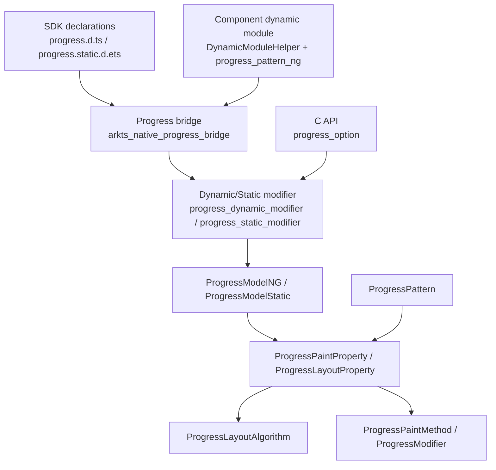
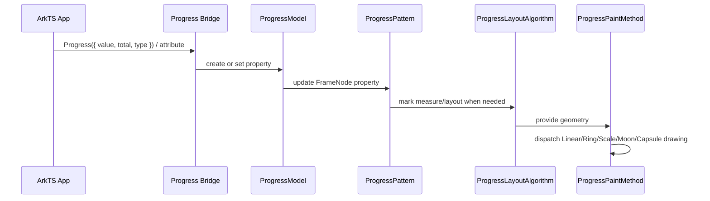
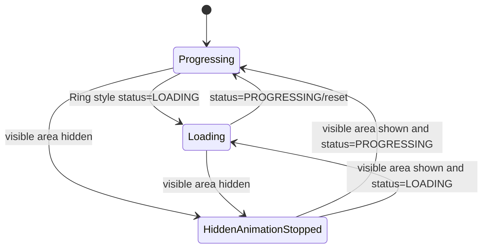
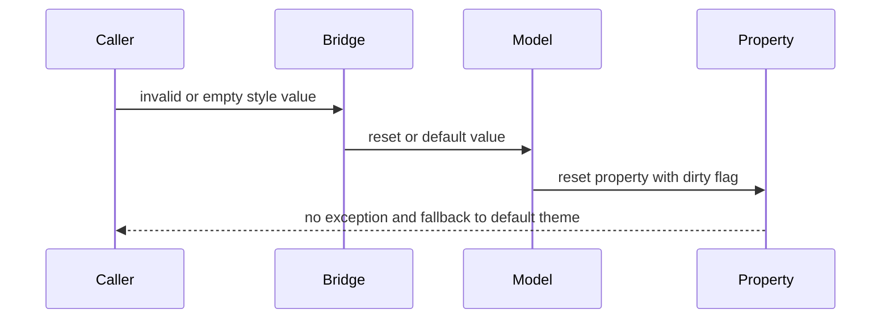

# 架构设计
> 确认目标仓和模块的架构约束、关键设计决策、Spec 拆分方向。

## 设计元数据

| 字段 | 值 |
|------|----|
| Design ID | DESIGN-Func-05-10-05 |
| 关联需求 | 已有能力补录（无独立 requirement.md） |
| 关联 Epic | 信息展示类组件 |
| 目标 Feature | Feat-01 Progress 组件全量规格 |
| 复杂度 | 复杂 |
| 目标版本 | API 7-26 |
| Owner | ArkUI SIG |
| 状态 | Baselined（已有实现补录） |

## 需求基线

| 项 | 补充说明（如需） |
|----|------------------|
| 存量能力补录 | 本设计只记录 ace_engine 当前实现，不引入新接口或行为变更。 |
| 组件范围 | 覆盖 Progress 创建、数值、颜色、类型专属样式、动画、Capsule 文本与交互、隐私模式、contentModifier、C API Linear style option。 |
| API 范式 | 同时记录 ArkTS 动态 API、ArkTS 静态 API、Modifier 和 NDK C API 入口。 |
| 验证基线 | 以 SDK 声明、`frameworks/core/components_ng/pattern/progress/`、`interfaces/native/node/progress_option.*` 和 Progress 单测目录为证据。 |

## 上下文和现状

### 涉及仓和模块

| 仓库 | 补充结构说明 |
|------|--------------|
| ace_engine | Progress NG 组件位于 `frameworks/core/components_ng/pattern/progress/`，包含 Pattern、Model、LayoutAlgorithm、PaintMethod、Modifier、bridge、theme wrapper 和 BUILD.gn。 |
| ace_engine | C API Linear style option 位于 `interfaces/native/node/progress_option.h` 和 `interfaces/native/node/progress_option.cpp`。 |
| interface_sdk-js | 动态声明位于 `api/@internal/component/ets/progress.d.ts`，静态声明位于 `api/arkui/component/progress.static.d.ets`，Modifier 声明位于 `api/arkui/ProgressModifier*.d.ts/.d.ets`。 |
| arkui-specs | 本功能域路径为 `05-ui-components/10-information-display-components/05-progress/`。 |

### 调用链层级分析

| 层 | 模块 | 职责 | 修改类型 |
|----|------|------|----------|
| SDK 动态声明 | `interface/sdk-js/api/@internal/component/ets/progress.d.ts` | 定义 `Progress(options)`、`ProgressType`、`ProgressStatus`、`.value()`、`.color()`、`.style()`、`.privacySensitive()`、`.contentModifier()`。 | 存量记录 |
| SDK 静态声明 | `interface/sdk-js/api/arkui/component/progress.static.d.ets` | 定义静态 `Progress(options)`、Builder 形式、`setProgressOptions()` 和静态属性方法。 | 存量记录 |
| 组件化加载 | `adapter/ohos/osal/dynamic_module_helper.cpp`、`frameworks/core/components_ng/pattern/progress/BUILD.gn` | 将 Progress 注册为组件化动态模块，构建 `progress_pattern_ng` 并包含 bridge 源。 | 存量记录 |
| ArkTS bridge | `frameworks/core/components_ng/pattern/progress/bridge/arkts_native_progress_bridge.cpp` | 解析 ArkTS 入参，区分 JSView/新范式并转发到 Progress modifier/model。 | 存量记录 |
| Dynamic/Static Modifier | `frameworks/core/components_ng/pattern/progress/bridge/progress_dynamic_modifier.cpp`、`progress_static_modifier.cpp` | 动态和静态属性写入入口，转换 ProgressType/ProgressStatus/style option。 | 存量记录 |
| Model 层 | `frameworks/core/components_ng/pattern/progress/progress_model_ng.cpp`、`progress_model_static.cpp` | 创建 FrameNode，更新 PaintProperty/LayoutProperty，创建或移除 Capsule Text 子节点。 | 存量记录 |
| Pattern 层 | `frameworks/core/components_ng/pattern/progress/progress_pattern.cpp` | 注册可见区变化、焦点/悬停/触摸事件、主题和语言更新、隐私文本遮蔽、Inspector/Dump。 | 存量记录 |
| Layout 层 | `frameworks/core/components_ng/pattern/progress/progress_layout_algorithm.cpp` | 根据 ProgressType、strokeWidth、API 版本和 Capsule 文本计算尺寸。 | 存量记录 |
| Paint 层 | `frameworks/core/components_ng/pattern/progress/progress_paint_method.cpp`、`progress_modifier.cpp` | 为 Linear/Ring/ScaleRing/Eclipse/Capsule 选择绘制路径，处理渐变、RTL、扫光和 loading 动画。 | 存量记录 |
| C API | `interfaces/native/node/progress_option.h`、`progress_option.cpp` | 提供 `OH_ArkUI_ProgressLinearStyleOption_*` 创建、销毁、Set/Get。 | 存量记录 |
| 测试 | `test/unittest/core/pattern/progress/`、`test/unittest/capi/modifiers/progress_modifier_test.cpp`、`test/unittest/capi/modifiers/generated/progress_modifier_test.cpp` | 覆盖核心组件行为、静态/生成 Modifier、C API modifier。 | 存量记录 |

### 适用架构规则

| Rule ID | 适用原因 | 设计结论 | 验证方式 |
|---------|----------|----------|----------|
| OH-ARCH-LAYERING | Progress 覆盖 SDK、Bridge、Model、Pattern、Layout、Paint、C API 多层 | 上层只做参数解析和转发；属性状态集中在 PaintProperty/LayoutProperty；渲染细节在 PaintMethod/Modifier。 | 源码审阅、单测 |
| OH-ARCH-SUBSYSTEM | 组件依赖主题、资源、Text 子节点、UiSessionManager 和无障碍接口 | Progress 不新增跨子系统依赖；存量依赖通过现有组件框架和条件 BUILD.gn 管理。 | 源码审阅、构建检查 |
| OH-ARCH-API-LEVEL | Progress API 从 API 7 延续到 API 26，且存在 dynamic/static 差异 | 规格以 SDK 声明为契约，源码差异在风险中显式记录。 | SDK 声明审阅 |
| OH-ARCH-COMPONENT-BUILD | Progress 已组件化，BUILD.gn 中 `is_component_model = true` | KB 和设计均按组件化路径路由，不再使用旧 JSView 作为主入口。 | BUILD.gn 与 dynamic module 检查 |
| OH-ARCH-ERROR-LOG | C API option 对 null 入参安全返回，不抛异常 | 规格记录 null 安全行为，不新增错误码。 | C API 单测和源码审阅 |

## 不涉及项承接

| 维度 | 设计结论 |
|------|----------|
| 新增公开 API | 不涉及；本次为长期规格补录。 |
| ABI 结构变更 | 不涉及；`ArkUI_ProgressLinearStyleOption` 仅记录现有字段和函数。 |
| BUILD.gn 新依赖 | 不涉及；只记录已有 `progress_pattern_ng` 构建组织。 |
| 设备端验证 | 不涉及；本次不修改业务代码，验证以文档校验和已有测试入口映射为主。 |

## 关键设计决策

| 决策 ID | 问题 | 推荐方案 | 探索过的替代方案 | 取舍理由 | 影响 |
|---------|------|----------|------------------|----------|------|
| ADR-1 | Progress 规格是否拆分多个 Feat | 先建立单个 `Feat-01-progress-full-spec.md` 全量基线 | 按 Linear/Ring/Capsule/C API 多文件拆分 | 当前 `05-10-05` 在规格仓无任何 Feat，先形成完整路由和基线更利于后续增量；后续新增能力再按 Feat-02+ 拆分。 | Feat-01 覆盖所有存量公共能力。 |
| ADR-2 | API 契约以源码还是 SDK 声明为准 | 外部 API 以 SDK `.d.ts/.d.ets` 为准，源码作为行为证据 | 直接从 C++ Model/Bridge 反推 API | SDK 文件明确 `@since`、SysCap、static/dynamic 范式；源码入参名和枚举映射可能不同。 | API 章节列出 dynamic/static 差异。 |
| ADR-3 | Progress 路由使用旧 JSView 还是组件化 bridge | 以 `pattern/progress/bridge/` 和动态模块为主入口 | 保留旧 JSView 路由 | `BUILD.gn` 设置 `is_component_model = true`，`dynamic_module_helper.cpp` 注册 `"Progress"` 动态模块，Progress 源目录已有完整 bridge。 | KB 的 API 解析路径按组件化写法维护。 |
| ADR-4 | Capsule 文本是否视为 Progress 内部状态 | 视为 Progress 内部 Text 子节点，规格记录其创建、更新、隐私遮蔽和布局影响 | 将 Capsule 文本当作普通外部子组件 | Model 在 Capsule 类型创建内部 Text FrameNode，Pattern/StaticModel 直接更新 TextLayoutProperty。 | 影响 content、showDefaultPercentage、font、privacySensitive 和 fontScale。 |
| ADR-5 | C API 覆盖范围 | 仅记录 `OH_ArkUI_ProgressLinearStyleOption_*` | 推断 Ring/Capsule C API | 当前 ace_engine 中只找到 Linear style option 专用 C API。 | 规格明确 C API 范围边界。 |

## 设计骨架

### 骨架范围

| 骨架项 | 目标 | 不包含 | 验证方式 |
|--------|------|--------|----------|
| 组件创建与类型 | 记录 `Progress(options)` 到 FrameNode/Pattern 的初始化链路 | 不改变默认值或类型映射 | SDK + Model + Bridge 审阅 |
| 样式与渲染 | 记录 `value/color/style` 对 Paint/Layout 属性和绘制分派的影响 | 不重写绘制算法 | Model + Layout + Paint 审阅 |
| Capsule 增强 | 记录 Text 子节点、交互、隐私和字体缩放 | 不扩展 Text API | Pattern + StaticModel + Layout 审阅 |
| 扩展入口 | 记录 contentModifier、privacySensitive、C API Linear option | 不新增 C API | SDK + C API + 单测审阅 |

### 骨架 Spec 拆分

| Task ID | 目标 | 受影响文件 | AC |
|---------|------|------------|----|
| TASK-SKELETON-1 | 建立 Progress 全量长期规格基线 | `Feat-01-progress-full-spec.md` | AC-1.1 至 AC-10.2 |

## 后续 Task 拆分

| Task ID | 目标 | 受影响文件 | 依赖 |
|---------|------|------------|------|
| TASK-05-10-05-F01 | Progress 组件全量规格补录 | `design.md`、`Feat-01-progress-full-spec.md`、registry | SDK 声明、ace_engine 源码、Progress 单测 |
| TASK-05-10-05-F02 | 后续新增 Progress 能力按独立 Feat 增量合入 | 后续 `Feat-02-*.md` 和本 `design.md` | Feat-01 基线 |

## API 签名、Kit 与权限

### 新增 API

本次为已有能力补录，无新增 API。以下为已存在 API 契约清单。

| API 签名 | 类型 | Kit | d.ts 位置 | 权限要求 | SysCap |
|----------|------|-----|-----------|----------|--------|
| `Progress(options: ProgressOptions<Type>): ProgressAttribute<Type>` | Public | ArkUI | `<OH_ROOT>/interface/sdk-js/api/@internal/component/ets/progress.d.ts` | 无 | `SystemCapability.ArkUI.ArkUI.Full` |
| `Progress(options: ProgressOptions): ProgressAttribute` | Public static | ArkUI | `<OH_ROOT>/interface/sdk-js/api/arkui/component/progress.static.d.ets` | 无 | `SystemCapability.ArkUI.ArkUI.Full` |
| `Progress<T>(style: CustomBuilderT<ProgressAttribute<T>>): ProgressAttribute<T>` | Public static | ArkUI | `<OH_ROOT>/interface/sdk-js/api/arkui/component/progress.static.d.ets` | 无 | `SystemCapability.ArkUI.ArkUI.Full` |
| `ProgressAttribute.value(value)` | Public | ArkUI | `<OH_ROOT>/interface/sdk-js/api/@internal/component/ets/progress.d.ts`、`progress.static.d.ets` | 无 | `SystemCapability.ArkUI.ArkUI.Full` |
| `ProgressAttribute.color(value)` | Public | ArkUI | `<OH_ROOT>/interface/sdk-js/api/@internal/component/ets/progress.d.ts`、`progress.static.d.ets` | 无 | `SystemCapability.ArkUI.ArkUI.Full` |
| `ProgressAttribute.style(value)` | Public | ArkUI | `<OH_ROOT>/interface/sdk-js/api/@internal/component/ets/progress.d.ts`、`progress.static.d.ets` | 无 | `SystemCapability.ArkUI.ArkUI.Full` |
| `ProgressAttribute.privacySensitive(value)` | Public | ArkUI | `<OH_ROOT>/interface/sdk-js/api/@internal/component/ets/progress.d.ts`、`progress.static.d.ets` | 无 | `SystemCapability.ArkUI.ArkUI.Full` |
| `ProgressAttribute.contentModifier(modifier)` | Public | ArkUI | `<OH_ROOT>/interface/sdk-js/api/@internal/component/ets/progress.d.ts`、`progress.static.d.ets` | 无 | `SystemCapability.ArkUI.ArkUI.Full` |
| `ProgressAttribute.setProgressOptions(options?)` | Public static | ArkUI | `<OH_ROOT>/interface/sdk-js/api/arkui/component/progress.static.d.ets` | 无 | `SystemCapability.ArkUI.ArkUI.Full` |
| `OH_ArkUI_ProgressLinearStyleOption_*` | Public C API | ArkUI NDK | `interfaces/native/node/progress_option.h` | 无 | ArkUI Native Node |

### 变更/废弃 API

| 原有 API | 变更类型 | 新 API | 迁移说明 |
|----------|----------|--------|----------|
| `ProgressOptions.style?: ProgressStyle` | 废弃 | `ProgressOptions.type?: ProgressType` | 动态声明中 `style` 标注 `@deprecated since 8`、`@useinstead type`。 |
| `ProgressStyle` | 存量兼容 | `ProgressType` | `ProgressStyle` 保留历史兼容，类型化 style map 以 `ProgressType` 为主。 |

## 构建系统影响

### BUILD.gn 变更

```text
无新增 BUILD.gn 变更。
现有 `frameworks/core/components_ng/pattern/progress/BUILD.gn` 中 `build_component_ng("progress_pattern_ng")`
设置 `is_component_model = true`，并纳入 Progress 源文件和 bridge 源文件。
```

### bundle.json 变更

无 bundle.json 变更。

## 可选设计扩展

### 架构图



### 数据流/控制流

| 步骤 | 调用方 | 被调用方 | 数据/接口 | 说明 |
|------|--------|----------|-----------|------|
| 1 | ArkTS/Static API | Progress bridge/static modifier | `ProgressOptions`、style options | 解析 value/total/type/style。 |
| 2 | Bridge/Modifier | ProgressModelNG/Static | `SetValue`、`SetColor`、`SetStrokeWidth` 等 | 写入 PaintProperty/LayoutProperty。 |
| 3 | FrameNode | ProgressPattern | `OnModifyDone`、主题/语言/可见区回调 | 注册交互和动画回调，处理 Capsule 特殊逻辑。 |
| 4 | LayoutWrapper | ProgressLayoutAlgorithm | LayoutProperty + theme + API version | 计算 Linear/Ring/Scale/Moon/Capsule 尺寸。 |
| 5 | PaintWrapper | ProgressPaintMethod/Modifier | PaintProperty + Geometry | 分派绘制路径并处理 RTL、渐变、扫光。 |
| 6 | Native caller | C API option | `OH_ArkUI_ProgressLinearStyleOption_*` | 创建并配置 Linear style option。 |

### 时序设计



### 数据模型设计

| 数据模型 | 存储位置 | 主要字段 | 说明 |
|----------|----------|----------|------|
| `ProgressOptions` | SDK 声明 / bridge 入参 | `value`、`total`、`type` | 组件创建配置。 |
| `ProgressStyleOptions` 及子接口 | SDK 声明 / bridge 入参 | `strokeWidth`、`scaleCount`、`scaleWidth`、`enableSmoothEffect` 等 | 通用和类型专属样式。 |
| `ProgressPaintProperty` | `progress_paint_property.h` | value/max/color/gradient/status/scan/sensitive/capsule 文本和颜色 | 绘制态和可视状态。 |
| `ProgressLayoutProperty` | `progress_layout_property.h` | type/strokeWidth | 布局态。 |
| `ProgressModifier` | `progress_modifier.h/.cpp` | animatable/property fields | 实际绘制和动画状态。 |
| `ArkUI_ProgressLinearStyleOption` | `progress_option.h` | scan/smooth/strokeWidth/strokeRadius | C API Linear style option。 |

### 算法与状态机



### 测试性设计

| 测试层级 | 测试目标 | Mock 策略 | 验证方式 |
|----------|----------|-----------|----------|
| Core unit | Pattern、Layout、Paint、Modifier、ContentModifier、ToJson | 使用 ace_engine 既有 mock pipeline/theme | `test/unittest/core/pattern/progress/` |
| C API modifier | 静态/生成 modifier 入参转换和属性写入 | 使用 ModifierTestBase 和 JSON 属性读取 | `test/unittest/capi/modifiers/progress_modifier_test.cpp`、`generated/progress_modifier_test.cpp` |
| C API accessor | Progress accessor/content modifier/mask | 使用 C API accessor 单测框架 | `test/unittest/capi/accessors/progress_*` |

### 异常传播时序图



### 资源所有权矩阵

| 资源 | 创建方 | 持有方 | 销毁触发 | 实际释放 | 异常回收 |
|------|--------|--------|----------|----------|----------|
| Progress FrameNode | Model/Static constructor | UINode tree | 节点卸载 | 框架引用计数释放 | 框架树清理 |
| Capsule Text FrameNode | ProgressModelNG/Static | Progress FrameNode | 类型切换为非 Capsule 或节点卸载 | RemoveChild / 引用计数释放 | 节点树清理 |
| ProgressModifier | PaintMethod | Render pipeline | PaintMethod 生命周期结束 | RefPtr 释放 | 渲染管线清理 |
| `ArkUI_ProgressLinearStyleOption` | `OH_ArkUI_ProgressLinearStyleOption_Create` | Native 调用方 | `OH_ArkUI_ProgressLinearStyleOption_Destroy` | `delete` | null Destroy 安全返回 |

### 接口参数规约

| 接口 | 参数 | 类型 | 合法范围 | 非法处理 | 边界说明 |
|------|------|------|----------|----------|----------|
| `Progress(options)` | `value` | number/double | 实现侧截断到 `[0,total]` | 小于 0 归 0，大于 total 归 total | total 缺省为 100 |
| `Progress(options)` | `type` | ProgressType | Linear/Ring/Eclipse/ScaleRing/Capsule | 无效值走默认/重置路径 | C++ 内部 Eclipse 映射为 MOON，ScaleRing 映射为 SCALE |
| `.style()` | style option | object | 与 ProgressType 匹配的 option | undefined/null 走 reset/default | 静态声明 union 不包含 EclipseStyleOptions 单独形态 |
| C API option Set/Get | option | pointer | 非 null | null Set/Destroy return，Get 返回默认 | 默认 scan=false、smooth=true、strokeWidth=4.0、strokeRadius=-1.0 |

### 线程与并发模型

| 操作 | 发起线程 | 回调线程 | 跨进程边界 | 线程安全 | 重入约束 |
|------|----------|----------|------------|----------|----------|
| ArkTS 属性设置 | UI 线程 | UI 线程 | 无 | 依赖 UI 框架串行属性更新 | 同帧多次设置以后写入为准 |
| 可见区动画控制 | UI/渲染调度相关回调 | UI 线程 | 无 | 通过 Pattern/Modifier 状态更新 | 隐藏时停止 loop animation |
| C API option Set/Get | Native 调用方线程 | 无回调 | 无 | 调用方负责 option 生命周期 | Destroy 后不得继续访问 |

## 详细设计

### 组件创建和类型初始化

`ProgressModelNG::Create` 创建或复用 Progress FrameNode，写入 Value、MaxValue、ProgressType 和 LayoutProperty Type，并在 Capsule 类型时创建内部 Text 子节点；对应实现位于 `frameworks/core/components_ng/pattern/progress/progress_model_ng.cpp:31`、`progress_model_static.cpp` 的 `Initialize`。默认类型保存在 `frameworks/core/components_ng/pattern/progress/progress_pattern.h:244`。

### 属性更新和脏标记

value、color、backgroundColor、strokeWidth、status 等属性通过 `ProgressModelNG` 和 `ProgressModelStatic` 写入 PaintProperty/LayoutProperty。`ProgressPaintProperty` 中 GradientColor、IsSensitive、GradientColorSetByUser 等属性使用 `PROPERTY_UPDATE_MEASURE`，入口见 `frameworks/core/components_ng/pattern/progress/progress_paint_property.h:97`、`progress_paint_property.h:101`、`progress_paint_property.h:103`。

### 布局和绘制分派

`ProgressLayoutAlgorithm::MeasureContent` 根据 ProgressType、strokeWidth、内容约束和 API 版本计算尺寸，API 9 路径由 `MeasureContentForApiNine` 承接，入口见 `frameworks/core/components_ng/pattern/progress/progress_layout_algorithm.cpp:39` 和 `progress_layout_algorithm.cpp:126`。绘制侧由 `ProgressModifier` 在不同 ProgressType 下分派到 Linear/Ring/ScaleRing/Moon/Capsule 路径，入口见 `frameworks/core/components_ng/pattern/progress/progress_modifier.cpp:829`。

### Capsule 文本、交互和隐私

Capsule 类型在 Pattern `OnModifyDone` 阶段注册触摸、悬停、焦点事件，入口见 `frameworks/core/components_ng/pattern/progress/progress_pattern.cpp:550`、`progress_pattern.cpp:554`、`progress_pattern.cpp:555`、`progress_pattern.cpp:556`。隐私模式由 PaintProperty `IsSensitive` 和 Pattern `ObscureText` 协同，入口见 `frameworks/core/components_ng/pattern/progress/progress_pattern.cpp:759`。

### 主题、RTL 和动画

主题更新通过 `ProgressPattern::OnThemeScopeUpdate` 处理用户未显式设置的颜色、背景和 Capsule 边框颜色，入口见 `frameworks/core/components_ng/pattern/progress/progress_pattern.cpp:866`。语言方向变化通过 `OnLanguageConfigurationUpdate` 刷新 RTL 状态，入口见 `frameworks/core/components_ng/pattern/progress/progress_pattern.cpp:604`。Ring LOADING 动画由 `ProgressModifier` 的 loading 状态路径处理，入口见 `frameworks/core/components_ng/pattern/progress/progress_modifier.cpp:324`。

### C API Linear Style Option

`OH_ArkUI_ProgressLinearStyleOption_Create` 返回带默认值的堆对象，Set/Get/Destroy 对 null 指针安全处理，入口见 `interfaces/native/node/progress_option.cpp:27`、`progress_option.cpp:38`、`progress_option.cpp:46`、`progress_option.cpp:78`。

## 风险和开放问题

| 项 | 类型 | 影响 | 处理方式 | Owner |
|----|------|------|----------|-------|
| 动态 API 与静态 API since 版本不同 | API | 中 | 规格分别列出 dynamic API 7/8/10/12/18/20 与 static API 23/26 差异。 | ArkUI SIG |
| SDK 声明与 C++ 内部枚举命名不同 | API | 中 | 规格明确 ArkTS `Eclipse/ScaleRing` 到 C++ `MOON/SCALE` 的映射风险。 | ArkUI SIG |
| 部分 generated modifier 单测存在 DISABLED 用例 | 测试 | 低 | 验证映射仅作为现有测试入口，不宣称所有路径已运行通过。 | ArkUI SIG |
| KB 使用 `specs/` 路径而本次规格仓为 `arkui-specs/` | 架构 | 低 | ace_engine 的 KB validator 仍以本仓 `specs/` 为路由；本文档记录实际规格仓路径，KB 保持 registry 可校验路径。 | ArkUI SIG |

## 设计审批

- [x] 需求基线已确认，设计覆盖 P0/P1 AC
- [x] 不涉及项已承接，N/A 和展开项都有结论
- [x] 涉及仓和模块职责清晰
- [x] 调用链层级分析完整，每层覆盖到位
- [x] 适用架构规则已识别并形成设计结论
- [x] 分层和子系统边界合规
- [x] API 变更有签名、权限、错误码和兼容性说明
- [x] BUILD.gn/bundle.json 影响明确
- [x] 设计输出和后续 Task 拆分明确
- [x] 关键设计决策有理由和影响说明
- [x] 风险和开放问题有 Owner

**结论:** 通过（已有实现补录）
