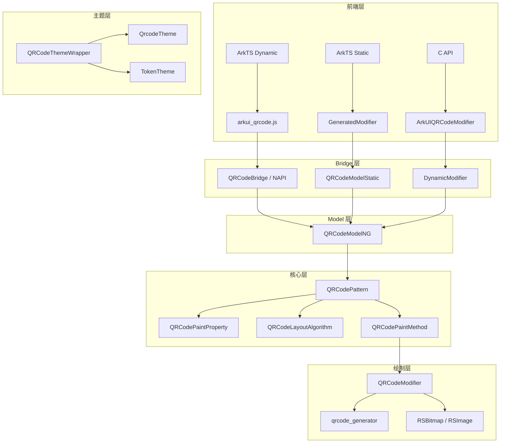
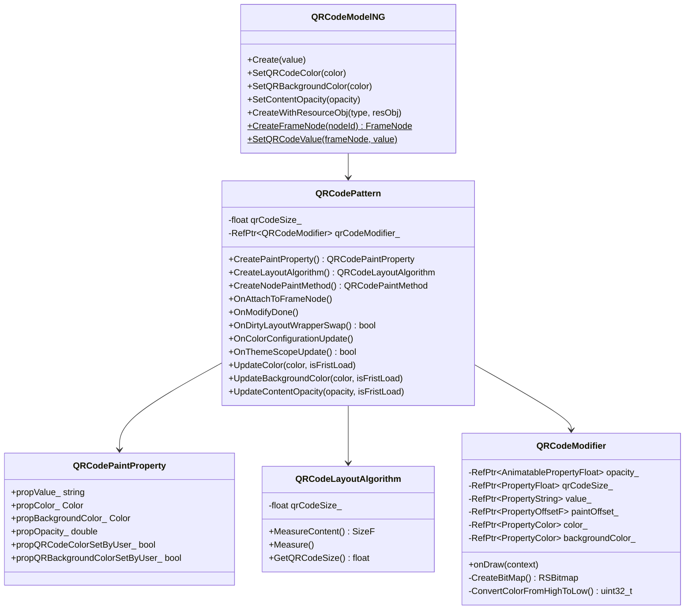

# 架构设计

## 设计元数据

| 字段 | 值 |
|------|-----|
| Design ID | DESIGN-Func-05-10-06 |
| 特性编号 | Func-05-10-06-Feat-01 |
| 状态 | Baselined（已有实现补录） |
| 作者 | ACE Engine Team |
| 版本 | 1.0 |
| 日期 | 2026-07-29 |

## 需求基线

QRCode 组件将字符串内容编码为二维码图像并显示。核心需求：
- 字符串编码为二维码（使用 qrcode_generator 外部库）
- 自定义前景色、背景色、内容透明度
- 主题配置和系统颜色变化响应
- 始终正方形布局
- 支持动态/静态两种前端管线
- 支持组件化按需加载

## 上下文和现状

### 涉及仓和模块

| 仓/模块 | 路径 | 职责 |
|---------|------|------|
| ace_engine | `frameworks/core/components_ng/pattern/qrcode/` | 核心组件实现 |
| ace_engine | `frameworks/core/components/qrcode/` | 旧版组件和主题定义 |
| ace_engine | `frameworks/core/interfaces/native/node/qrcode_modifier.h` | C API Modifier 声明 |
| qrcode_generator | 外部依赖 | 二维码编码库 |

### 调用链层级分析

```
Layer 1: ArkTS 前端
  QRCode('value').qrCodeColor(Color.Black).qrBackgroundColor(Color.White)
    ↓
Layer 2: JS Bridge (arkui_qrcode.js)
  QRCode.create(value) / QRCode.color(value) / QRCode.backgroundColor(value)
    ↓
Layer 3: NAPI (qrcode_napi.cpp)
  JsCreate() / JsColor() / JsBackgroundColor()
    ↓
Layer 4: Model (qrcode_model_ng.cpp)
  QRCodeModelNG::Create() / SetQRCodeColor() / SetQRBackgroundColor()
    ↓
Layer 5: Pattern (qrcode_pattern.cpp)
  QRCodePattern::OnAttachToFrameNode() / OnModifyDone() / OnColorConfigurationUpdate()
    ↓
Layer 6: Layout (qrcode_layout_algorithm.cpp)
  QRCodeLayoutAlgorithm::MeasureContent() / Measure()
    ↓
Layer 7: Paint Method (qrcode_paint_method.cpp)
  QRCodePaintMethod::UpdateContentModifier()
    ↓
Layer 8: Modifier (qrcode_modifier.cpp)
  QRCodeModifier::onDraw() / CreateBitMap()
    ↓
Layer 9: Rendering (qrcode_generator + RSBitmap/RSImage)
  QrcodeImageEncodeString() / Canvas::DrawImage()
```

替代路径（动态管线）：
```
ArkTS → QRCodeBridge::CreateQRCode() → GetArkUINodeModifiers()->getQRCodeModifier()->createModel()
```

替代路径（静态管线）：
```
ArkTS Static → GeneratedModifier::QRCodeModifier::ConstructImpl() → QRCodeModelNG::CreateFrameNode()
```

### 适用架构规则

- NG 组件四层架构：Model → Pattern → Property → Modifier
- 组件化模式：is_component_model = true，动态加载
- ForegroundColor 机制：颜色通过 RenderContext.ForegroundColor 传递
- 主题 Token 映射：QRCodeThemeWrapper → TokenTheme

## 不涉及项承接

| 不涉及项 | 原因 |
|----------|------|
| 二维码纠错等级配置 | 硬编码为 QRCODE_ECC_MEDIUM，无用户 API |
| 二维码扫描功能 | QRCode 组件仅负责生成和显示 |
| 二维码编码缓存 | 每次绘制重新编码，无缓存机制 |
| C API 直接创建节点 | 无 qrcode_native_impl.cpp，仅通过 Modifier 桥接 |

## 关键设计决策

### ADR-1: 使用 qrcode_generator 替代 qrcodegen

**决策**: 使用 OpenHarmony qrcode_generator 库（QrcodeImageEncodeString C API）替代原始 qrcodegen 库（qrcodegen::QrCode C++ API）。

**背景**: 旧版 CLAUDE.md 和旧 KB 文档引用 qrcodegen::QrCode::encodeText()，但实际源码 qrcode_modifier.cpp:44 使用 QrcodeImageEncodeString()。

**影响**: C API 风格（QrcodeImage* + QrcodeImageFree），而非 C++ 对象风格。

### ADR-2: 正方形布局策略

**决策**: MeasureContent 始终返回 min(width, height) 的正方形尺寸。

**背景**: 二维码本质是正方形，非正方形会导致拉伸变形。组件在 MeasureContent 中强制取最小边。

**影响**: 开发者设置 width/height 不等时，组件实际尺寸取较小值。

### ADR-3: API 版本分界行为

**决策**: API 11 分界布局计算，API 12 分界背景填充，API 26 分界主题作用域。

**背景**: 不同 API 版本的行为兼容性需求。

**影响**: 需在多处检查 PlatformVersion，增加代码复杂度。

### ADR-4: ForegroundColor 机制

**决策**: 前景色通过 RenderContext.ForegroundColor 传递，而非直接使用 PaintProperty.Color。

**背景**: ForegroundColor 是 NG 框架的标准颜色传递机制，支持 ForegroundColorStrategy（如 INVERT）。

**影响**: 当 RenderContext 有 ForegroundColor 但与 PaintProperty 不一致时，使用 Color::FOREGROUND。

### ADR-5: 组件化动态加载

**决策**: QRCode 组件已组件化，通过 DynamicModule + DynamicModifier 支持按需加载。

**背景**: 组件化减少主包体积，支持运行时动态加载。

**影响**: 存在两套 Modifier 函数指针表（NG 管线 vs 旧管线），通过 Container::IsCurrentUseNewPipeline() 切换。

## 设计骨架

### 骨架范围

```
QRCode 组件骨架
├── Model 层 (qrcode_model.h, qrcode_model_ng.h/cpp, qrcode_model_static.h/cpp)
├── Pattern 层 (qrcode_pattern.h/cpp)
├── Property 层 (qrcode_paint_property.h)
├── Layout 层 (qrcode_layout_algorithm.h/cpp)
├── Paint 层 (qrcode_paint_method.h/cpp, qrcode_modifier.h/cpp)
├── Theme 层 (qrcode_theme_wrapper.h)
├── Bridge 层 (bridge/arkts_native_qrcode_bridge.h/cpp)
├── 组件化 (bridge/qrcode_dynamic_module.h/cpp, bridge/qrcode_dynamic_modifier.cpp, bridge/qrcode_static_modifier.cpp)
├── NAPI 层 (qrcode_napi.h/cpp, arkui_qrcode.js)
└── C API (qrcode_modifier.h → NodeModifier)
```

### 骨架 Spec 拆分

| Spec | 范围 |
|------|------|
| Feat-01-qrcode-display-spec | QRCode 显示与样式规格（本文档） |

## 后续 Task 拆分

无（已有实现补录）。

## API 签名、Kit 与权限

### 新增 API

无新增 API。

### 变更/废弃 API

无变更或废弃 API。

现有 API 清单：

| API | 签名 | 管线 |
|-----|------|------|
| QRCode 构造 | `QRCode(value: string)` | 动态/静态 |
| qrCodeColor | `qrCodeColor(value: ResourceColor)` | 动态/静态 |
| qrBackgroundColor | `qrBackgroundColor(value: ResourceColor)` | 动态/静态 |
| contentOpacity | `contentOpacity(value: number \| Resource)` | 动态/静态 |

## 构建系统影响

### BUILD.gn 变更

无变更。

当前 BUILD.gn 结构（`frameworks/core/components_ng/pattern/qrcode/BUILD.gn`）：

```
build_component_ng("qrcode_pattern_ng"):
  is_component_model = true
  sources: qrcode_layout_algorithm.cpp, qrcode_model_ng.cpp, qrcode_model_static.cpp,
           qrcode_modifier.cpp, qrcode_paint_method.cpp, qrcode_pattern.cpp
  ark_sources: arkts_native_qrcode_bridge.cpp, qrcode_dynamic_module.cpp,
               qrcode_dynamic_modifier.cpp
  (非 wearable) ark_sources += qrcode_static_modifier.cpp
  external_deps: qrcode_generator:qrcodegen

build_component_plugin("qrcode_source"):
  js_source: arkui_qrcode
  sources: (同上 + qrcode_napi.cpp)
  external_deps: qrcode_generator:qrcodegen
```

### bundle.json 变更

无变更。

## 可选设计扩展

### 架构图



### 数据模型设计



## 详细设计

### QRCodePattern 生命周期

1. **OnAttachToFrameNode**（qrcode_pattern.cpp:35）: SetClipToFrame(true)，背景色白色
2. **OnModifyDone**（qrcode_pattern.cpp:56）: 对齐方式 CENTER，更新焦点颜色
3. **OnDirtyLayoutWrapperSwap**（qrcode_pattern.cpp:43）: 从 LayoutAlgorithm 获取 qrCodeSize_，返回 true 触发重绘
4. **OnColorConfigurationUpdate**（qrcode_pattern.cpp:189）: 系统颜色变化时，仅更新用户未设置的颜色
5. **OnThemeScopeUpdate**（qrcode_pattern.cpp:213）: API >= 26 时，根据主题作用域更新颜色

### QRCodeModifier 绘制流程

1. 获取所有属性值（opacity, qrCodeSize, value, paintOffset, color, backgroundColor）
2. 调用 QrcodeImageEncodeString(value, QRCODE_ECC_MEDIUM) 编码
3. 验证编码结果有效性（非 null、width > 0、data 非 null）
4. 验证 qrCodeSize >= qrWidth
5. 应用透明度到颜色（color.BlendOpacity(opacity)）
6. 调用 CreateBitMap 生成位图
7. 构建 RSImage，计算缩放比例
8. Canvas::DrawImage 绘制

### 颜色更新路径

- **SetQRCodeColor**（Model 层）: ACE_UPDATE_PAINT_PROPERTY + ACE_UPDATE_RENDER_CONTEXT(ForegroundColor) + ResetForegroundColorStrategy + ForegroundColorFlag=true
- **UpdateColor**（Pattern 层）: 仅在 IsSystemColorChange() 或 isFristLoad 时更新 PaintProperty + RenderContext
- **UpdateContentModifier**（Paint Method 层）: 当 RenderContext.HasForegroundColor() 且与 PaintProperty 不一致时，使用 Color::FOREGROUND

## 风险和开放问题

| 风险 | 等级 | 说明 |
|------|------|------|
| 编码无缓存 | 低 | 每次绘制重新编码，长字符串可能影响性能 |
| Bitmap 每次创建 | 低 | 每次绘制创建新 RSBitmap，无复用 |
| 旧 KB 文档引用 qrcodegen | 低 | 旧 KB 文档引用 qrcodegen::QrCode::encodeText()，实际源码使用 QrcodeImageEncodeString()，旧文档已标记删除 |
| BGRA 联合体命名 | 低 | QRCodeModifier::BGRA 联合体中 argb 子结构体实际按 BGRA 排列，命名可能误导 |

## 设计审批

- [x] 架构设计符合 NG 组件四层架构
- [x] API 签名与源码实现一致
- [x] 外部依赖已确认（qrcode_generator）
- [x] 版本兼容性行为已标注
- [x] 组件化状态已确认
- [x] 动态/静态管线覆盖完整
- [x] 测试覆盖已评估
- [x] 构建系统影响已分析
- [x] 风险已识别
- [x] ADR 已编号
- [x] 架构图使用 Mermaid 语法
