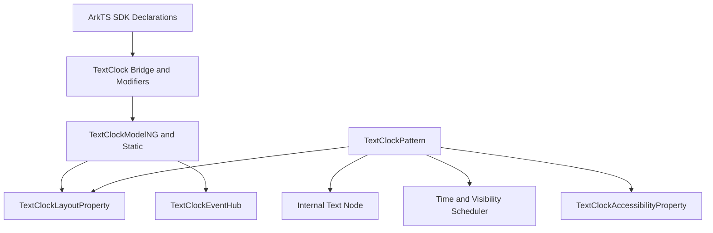

# 架构设计

## 设计元数据

| 字段 | 值 |
|------|----|
| Design ID | DESIGN-Func-05-10-07 |
| 关联需求 | 已有能力补录（无独立 requirement.md） |
| 关联 Epic | 信息展示类组件 |
| 目标 Feature | Feat-01 至 Feat-04 TextClock 组件长期规格 |
| 复杂度 | 中 |
| 目标版本 | API 8-26 |
| Owner | ArkUI SIG |
| 状态 | Baselined（已有实现补录） |

## 需求基线

| 项 | 补充说明（如需） |
|----|------------------|
| 存量能力补录 | 本设计只记录 ace_engine 当前实现，不引入新接口或行为变更。 |
| 组件范围 | 覆盖 TextClock 创建、时间格式化、时区偏移、12/24 小时制、控制器启停、可见区优化、ContentModifier、自定义文本样式和配置变更响应。 |
| API 范式 | 同时记录 ArkTS 动态 API、ArkTS 静态 API、Modifier、组件化 bridge 和 C API node modifier 入口。 |
| 验证基线 | 以 SDK 声明、`frameworks/core/components_ng/pattern/text_clock/`、TextClock bridge、C API modifier 和 TextClock 单测目录为证据。 |

## 上下文和现状

### 涉及仓和模块

| 仓库 | 补充结构说明 |
|------|--------------|
| ace_engine | TextClock NG 组件位于 `frameworks/core/components_ng/pattern/text_clock/`，包含 Pattern、Model、LayoutProperty、LayoutAlgorithm、EventHub、Accessibility、bridge 和 BUILD.gn。 |
| ace_engine | 控制器定义位于 `frameworks/core/components/text_clock/text_clock_controller.h`，C API node modifier 位于 `frameworks/core/interfaces/native/node/text_clock_modifier.cpp`。 |
| interface_sdk-js | 动态声明位于 `api/@internal/component/ets/text_clock.d.ts`，静态声明位于 `api/arkui/component/textClock.static.d.ets`，Modifier 声明位于 `api/arkui/TextClockModifier*.d.ts/.d.ets`。 |
| arkui-specs | 本功能域路径为 `05-ui-components/10-information-display-components/07-text-clock/`。 |

### 调用链层级分析

| 层 | 模块 | 职责 | 修改类型 |
|----|------|------|----------|
| SDK 动态声明 | `text_clock.d.ts` | 定义 `TextClock(options)`、`format()`、`font*()`、`onDateChange()` 和 controller 形态。 | 存量记录 |
| SDK 静态声明 | `textClock.static.d.ets` | 定义静态范式 TextClock 构造与属性接口。 | 存量记录 |
| 组件化加载 | `pattern/text_clock/bridge/`、`BUILD.gn` | 注册 TextClock 动态模块和 static/dynamic modifier。 | 存量记录 |
| Bridge/Modifier | `arkts_native_text_clock_bridge.cpp`、`text_clock_*_modifier.cpp` | 解析 ArkTS 参数并分发到 Model/FrameNode。 | 存量记录 |
| Model 层 | `text_clock_model_ng.cpp`、`text_clock_model_static.cpp`、`text_clock_model_impl.cpp` | 写入布局属性、事件和 controller。 | 存量记录 |
| Pattern 层 | `text_clock_pattern.cpp`、`text_clock_pattern_multi_thread.cpp` | 处理生命周期、时间更新、可见区、语言/颜色配置变更和内部 Text 子节点。 | 存量记录 |
| Layout/Access | `text_clock_layout_property.*`、`text_clock_layout_algorithm.*`、`text_clock_accessibility_property.*` | 保存格式/时区/文本样式属性，提供测量和无障碍文本。 | 存量记录 |

### 适用架构规则

| Rule ID | 适用原因 | 设计结论 | 验证方式 |
|---------|----------|----------|----------|
| OH-ARCH-LAYERING | TextClock 覆盖 SDK、Bridge、Model、Pattern、Layout 和 C API 多层 | 上层只做参数解析；时间更新与内部 Text 管理集中在 Pattern；文本属性保存在 LayoutProperty。 | 源码审阅、单测 |
| OH-ARCH-API-LEVEL | TextClock 存在 dynamic/static API 和历史 JSView 兼容路径 | 外部契约以 SDK 声明为准，源码实现差异写入 Feat 风险和兼容章节。 | SDK 声明审阅 |
| OH-ARCH-RESOURCE | TextClock 依赖主题、系统时间、语言和 12/24 小时制配置 | 资源变化只触发已有属性刷新，不引入新系统依赖。 | 源码审阅 |

## 不涉及项承接

| 维度 | 设计结论 |
|------|----------|
| 新增公开 API | 不涉及；本次为长期规格补录。 |
| ABI 结构变更 | 不涉及；只记录现有 controller 和 C API modifier 路径。 |
| BUILD.gn 新依赖 | 不涉及；只记录已有 `text_clock_pattern_ng` 构建组织。 |
| 时间服务能力扩展 | 不涉及；组件只消费系统时间、时区和语言配置。 |

## 关键设计决策

| 决策 ID | 问题 | 推荐方案 | 探索过的替代方案 | 取舍理由 | 影响 |
|---------|------|----------|------------------|----------|------|
| ADR-1 | TextClock 规格如何拆分 Feat | 按时间格式、调度、样式自定义、事件组件化四个能力簇拆分 | 单个 core spec 承载全部能力 | TextClock 已覆盖时间、事件、样式和组件化多条用户可感知能力，拆分后更接近 Text 组件规格风格。 | Feat-01 至 Feat-04 分别覆盖存量公共能力。 |
| ADR-2 | 默认内容如何渲染 | 继续使用内部 Text 子节点承载显示文本 | Pattern 直接绘制字符串 | 内部 Text 能复用文本布局、样式和无障碍能力。 | Pattern 需要同步 Text 子节点属性。 |
| ADR-3 | 时间更新频率如何控制 | 根据格式是否包含秒/毫秒选择秒级或分钟级更新，并受可见区控制 | 固定每秒刷新 | 可降低不可见或分钟格式场景下的无效更新。 | Feat 中列出可见区和分钟级更新 AC。 |
| ADR-4 | 时区缺省如何表达 | 使用 NaN 表示跟随系统本地时区 | 使用 0 作为缺省 | 0 是有效 UTC 偏移，NaN 可区分未设置。 | 规格显式记录时区偏移边界。 |

## 设计骨架

### 骨架范围

| 骨架项 | 目标 | 不包含 | 验证方式 |
|--------|------|--------|----------|
| 创建与格式化 | 记录 `TextClock(options)` 到 FrameNode/Pattern 的初始化链路，以及 format 默认值和解析行为。 | 不新增格式字符。 | SDK + Pattern 审阅 |
| 时区与系统配置 | 记录时区偏移、12/24 小时制、语言/颜色变化响应。 | 不改变系统属性读取方式。 | Pattern + LayoutProperty 审阅 |
| 更新调度 | 记录 start/stop、可见区和分钟级优化。 | 不替换调度器实现。 | Pattern + 单测审阅 |
| 自定义内容和样式 | 记录 ContentModifier 和文本样式属性向内部 Text 子节点同步。 | 不扩展 Text 组件规格。 | Model + Pattern 审阅 |

### 骨架 Spec 拆分

| Task ID | 目标 | 受影响文件 | AC |
|---------|------|------------|----|
| TASK-SKELETON-1 | 建立 TextClock 时间显示与格式化规格 | `Feat-01-time-format-spec.md` | Feat-01 AC |
| TASK-SKELETON-2 | 建立 TextClock 控制器与更新调度规格 | `Feat-02-controller-scheduling-spec.md` | Feat-02 AC |
| TASK-SKELETON-3 | 建立 TextClock 文本样式与 ContentModifier 规格 | `Feat-03-style-content-modifier-spec.md` | Feat-03 AC |
| TASK-SKELETON-4 | 建立 TextClock 事件、配置变更与组件化规格 | `Feat-04-events-config-componentization-spec.md` | Feat-04 AC |

## 后续 Task 拆分

| Task ID | 目标 | 受影响文件 | 依赖 |
|---------|------|------------|------|
| TASK-05-10-07-F01 | TextClock 时间显示与格式化规格补录 | `Feat-01-time-format-spec.md` | SDK 声明、Pattern、LayoutProperty |
| TASK-05-10-07-F02 | TextClock 控制器与更新调度规格补录 | `Feat-02-controller-scheduling-spec.md` | Controller、Pattern、单测 |
| TASK-05-10-07-F03 | TextClock 文本样式与 ContentModifier 规格补录 | `Feat-03-style-content-modifier-spec.md` | Model、Bridge、Pattern |
| TASK-05-10-07-F04 | TextClock 事件、配置变更与组件化规格补录 | `Feat-04-events-config-componentization-spec.md` | EventHub、Bridge、BUILD.gn |
| TASK-05-10-07-F05 | 后续新增 TextClock 能力按独立 Feat 增量合入 | 后续 `Feat-05-*.md` 和本 `design.md` | Feat-01 至 Feat-04 基线 |

## API 签名、Kit 与权限

本次为已有能力补录，无新增 API。以下为已存在 API 契约清单。

| API 签名 | 类型 | Kit | d.ts 位置 | 权限要求 | SysCap |
|----------|------|-----|-----------|----------|--------|
| `TextClock(options?: TextClockOptions): TextClockAttribute` | Public | ArkUI | `<OH_ROOT>/interface/sdk-js/api/@internal/component/ets/text_clock.d.ts` | 无 | `SystemCapability.ArkUI.ArkUI.Full` |
| `TextClock(options?: TextClockOptions): TextClockAttribute` | Public static | ArkUI | `<OH_ROOT>/interface/sdk-js/api/arkui/component/textClock.static.d.ets` | 无 | `SystemCapability.ArkUI.ArkUI.Full` |
| `.format(value)`、`.fontColor(value)`、`.fontSize(value)`、`.fontWeight(value)`、`.fontFamily(value)`、`.fontStyle(value)` | Public | ArkUI | TextClock dynamic/static declarations | 无 | `SystemCapability.ArkUI.ArkUI.Full` |
| `.onDateChange(callback)` | Public | ArkUI | TextClock dynamic/static declarations | 无 | `SystemCapability.ArkUI.ArkUI.Full` |

### 新增 API

无。

### 变更/废弃 API

无。

## 构建系统影响

### BUILD.gn 变更

无。本设计只记录现有 `frameworks/core/components_ng/pattern/text_clock/BUILD.gn` 组织。

### bundle.json 变更

无。

## 可选设计扩展

### 架构图

### 数据模型设计

| 数据模型 | 存储位置 | 主要字段 | 说明 |
|----------|----------|----------|------|
| `TextClockOptions` | SDK 声明 / bridge 入参 | `timeZoneOffset`、`controller` | 创建配置。 |
| `TextClockLayoutProperty` | `text_clock_layout_property.h` | format、timeZoneOffset、字体样式、资源对象 | 布局态和文本样式状态。 |
| `TextClockEventHub` | `text_clock_event_hub.h` | onDateChange | 时间变化事件回调。 |
| `TextClockPattern` | `text_clock_pattern.cpp` | isStart、delayTask、lastTimeText、content modifier 状态 | 生命周期和更新调度。 |

### 接口参数规约

| 接口 | 参数 | 类型 | 合法范围 | 非法处理 | 边界说明 |
|------|------|------|----------|----------|----------|
| `TextClock(options)` | `timeZoneOffset` | number | 有效时区偏移 | 未设置使用系统本地时区 | NaN 表示未设置。 |
| `.format()` | `format` | string/Resource | 支持实现内格式字符 | 空值或无效值走默认格式 | 12/24 小时制影响默认值。 |
| `.fontSize()` | `value` | Length/Resource | Text 支持范围 | 无效值走重置/默认路径 | 同步到内部 Text。 |
| `.onDateChange()` | `callback` | function | 可调用函数 | 未设置不触发 | 参数为时间戳字符串。 |

## 详细设计

### Text 子节点同步

TextClock 默认通过内部 Text 子节点显示当前时间。Pattern 在创建、属性变更、配置变更和时间更新时刷新 Text 内容和文本样式；启用 ContentModifier 后，由自定义节点接管显示内容，默认 Text 节点保留为布局/兼容辅助。

### 时间更新调度

Pattern 根据 format 判断是否需要秒级刷新。包含秒或毫秒信息时以秒级任务更新；否则可按分钟级更新。组件不可见时取消延迟任务，可见后恢复更新。

### 时区与系统格式

`timeZoneOffset` 未设置时跟随系统本地时区；设置后按偏移换算时间。默认格式受系统 12/24 小时制影响，语言变化会触发重新格式化。

## 风险和开放问题

| 项 | 类型 | 影响 | 处理方式 | Owner |
|----|------|------|----------|-------|
| dynamic/static API 声明差异 | API | 中 | Feat 中分别记录声明路径和行为边界。 | ArkUI SIG |
| 时间更新依赖可见区回调 | 行为 | 中 | 单测和源码审阅覆盖可见区暂停/恢复。 | ArkUI SIG |
| ContentModifier 与默认 Text 共存 | 架构 | 低 | 规格明确默认 Text 同步和自定义内容接管边界。 | ArkUI SIG |

## 设计审批

| 角色 | 状态 | 说明 |
|------|------|------|
| ArkUI SIG | 待确认 | 已有实现补录，等待长期规格评审。 |
