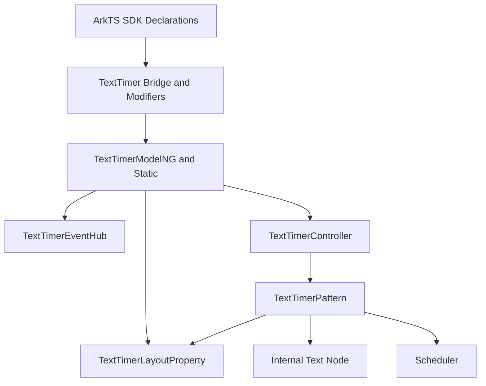

# 架构设计

## 设计元数据

| 字段 | 值 |
|------|----|
| Design ID | DESIGN-Func-05-10-08 |
| 关联需求 | 已有能力补录（无独立 requirement.md） |
| 关联 Epic | 信息展示类组件 |
| 目标 Feature | Feat-01 至 Feat-04 TextTimer 组件长期规格 |
| 复杂度 | 中 |
| 目标版本 | API 8-26 |
| Owner | ArkUI SIG |
| 状态 | Baselined（已有实现补录） |

## 需求基线

| 项 | 补充说明（如需） |
|----|------------------|
| 存量能力补录 | 本设计只记录 ace_engine 当前实现，不引入新接口或行为变更。 |
| 组件范围 | 覆盖 TextTimer 创建、正计时、倒计时、format、自定义字体、controller、onTimer、可见区优化、ContentModifier 和系统配色变更响应。 |
| API 范式 | 同时记录 ArkTS 动态 API、ArkTS 静态 API、Modifier 和组件化 bridge 入口。 |
| 验证基线 | 以 SDK 声明、`frameworks/core/components_ng/pattern/texttimer/`、TextTimer bridge、controller 和 TextTimer 单测目录为证据。 |

## 上下文和现状

### 涉及仓和模块

| 仓库 | 补充结构说明 |
|------|--------------|
| ace_engine | TextTimer NG 组件位于 `frameworks/core/components_ng/pattern/texttimer/`，包含 Pattern、Model、LayoutProperty、LayoutAlgorithm、EventHub、Accessibility、bridge 和 BUILD.gn。 |
| ace_engine | 控制器定义位于 `frameworks/core/components/texttimer/texttimer_controller.h`。 |
| interface_sdk-js | 动态声明位于 `api/@internal/component/ets/text_timer.d.ts`，静态声明位于 `api/arkui/component/textTimer.static.d.ets`，Modifier 声明位于 `api/arkui/TextTimerModifier*.d.ts/.d.ets`。 |
| arkui-specs | 本功能域路径为 `05-ui-components/10-information-display-components/08-text-timer/`。 |

### 调用链层级分析

| 层 | 模块 | 职责 | 修改类型 |
|----|------|------|----------|
| SDK 动态声明 | `text_timer.d.ts` | 定义 `TextTimer(options)`、文本样式、`onTimer()` 和 controller。 | 存量记录 |
| SDK 静态声明 | `textTimer.static.d.ets` | 定义静态范式 TextTimer 构造与属性接口。 | 存量记录 |
| 组件化加载 | `pattern/texttimer/bridge/`、`BUILD.gn` | 注册 TextTimer 动态模块和 static/dynamic modifier。 | 存量记录 |
| Bridge/Modifier | `arkts_native_text_timer_bridge.cpp`、`text_timer_*_modifier.cpp` | 解析 ArkTS 参数、校验 count/format 并分发到 Model/FrameNode。 | 存量记录 |
| Model 层 | `text_timer_model_ng.cpp`、`text_timer_model_static.cpp` | 写入布局属性、事件和 controller。 | 存量记录 |
| Pattern 层 | `text_timer_pattern.cpp` | 处理生命周期、计时调度、倒计时暂停、可见区和内部 Text 子节点。 | 存量记录 |
| Layout/Access | `text_timer_layout_property.*`、`text_timer_layout_algorithm.*`、`text_timer_accessibility_property.*` | 保存计时配置和文本样式，提供测量和无障碍文本。 | 存量记录 |

### 适用架构规则

| Rule ID | 适用原因 | 设计结论 | 验证方式 |
|---------|----------|----------|----------|
| OH-ARCH-LAYERING | TextTimer 覆盖 SDK、Bridge、Model、Pattern、Layout 和事件层 | 上层只做参数解析；计时状态和调度集中在 Pattern；文本属性保存在 LayoutProperty。 | 源码审阅、单测 |
| OH-ARCH-API-LEVEL | TextTimer 存在 dynamic/static API 差异 | 外部契约以 SDK 声明为准，源码行为作为验证证据。 | SDK 声明审阅 |
| OH-ARCH-PERF | TextTimer 存在持续计时任务 | 可见区外停止默认 Text 节点更新，减少无效调度。 | Pattern 和单测审阅 |

## 不涉及项承接

| 维度 | 设计结论 |
|------|----------|
| 新增公开 API | 不涉及；本次为长期规格补录。 |
| ABI 结构变更 | 不涉及；只记录现有 controller 和 modifier 行为。 |
| BUILD.gn 新依赖 | 不涉及；只记录已有 `text_timer_pattern_ng` 构建组织。 |
| 高精度计时能力扩展 | 不涉及；组件按现有 Scheduler 和格式化逻辑显示。 |

## 关键设计决策

| 决策 ID | 问题 | 推荐方案 | 探索过的替代方案 | 取舍理由 | 影响 |
|---------|------|----------|------------------|----------|------|
| ADR-1 | TextTimer 规格如何拆分 Feat | 按计时模式、控制事件、样式自定义、可见区组件化四个能力簇拆分 | 单个 core spec 承载全部能力 | TextTimer 覆盖计时、事件、样式和组件化多条用户可感知能力，拆分后更接近 Text 组件规格风格。 | Feat-01 至 Feat-04 分别覆盖存量公共能力。 |
| ADR-2 | 默认内容如何渲染 | 继续使用内部 Text 子节点承载计时文本 | Pattern 直接绘制字符串 | 内部 Text 能复用文本布局、样式和无障碍能力。 | Pattern 需要同步 Text 子节点属性。 |
| ADR-3 | 计时如何驱动 | 使用 Scheduler 驱动周期更新，controller 控制 start/pause/reset | 使用固定延迟任务替代帧调度 | Scheduler 与渲染帧同步，适合计时展示。 | Feat 中列出 controller 和 onTimer AC。 |
| ADR-4 | 倒计时结束如何处理 | 倒计时到达边界后自动暂停 | 继续递减到负值 | 符合倒计时语义，避免显示越界。 | 规格记录边界暂停行为。 |

## 设计骨架

### 骨架范围

| 骨架项 | 目标 | 不包含 | 验证方式 |
|--------|------|--------|----------|
| 创建与模式 | 记录 `TextTimer(options)` 到 FrameNode/Pattern 的初始化链路，区分正计时和倒计时。 | 不新增计时模式。 | SDK + Pattern 审阅 |
| 格式与样式 | 记录 format、fontColor、fontSize、fontWeight、fontFamily、fontStyle、textShadow。 | 不扩展 Text 组件规格。 | Bridge + LayoutProperty 审阅 |
| 调度与事件 | 记录 controller、Scheduler、onTimer 和倒计时结束。 | 不替换调度器实现。 | Pattern + EventHub 审阅 |
| 自定义内容 | 记录 ContentModifier 和可见区优化。 | 不新增自定义节点协议。 | Pattern + bridge 审阅 |

### 骨架 Spec 拆分

| Task ID | 目标 | 受影响文件 | AC |
|---------|------|------------|----|
| TASK-SKELETON-1 | 建立 TextTimer 计时模式与格式化规格 | `Feat-01-timing-modes-format-spec.md` | Feat-01 AC |
| TASK-SKELETON-2 | 建立 TextTimer 控制器与事件规格 | `Feat-02-controller-events-spec.md` | Feat-02 AC |
| TASK-SKELETON-3 | 建立 TextTimer 文本样式与 ContentModifier 规格 | `Feat-03-style-content-modifier-spec.md` | Feat-03 AC |
| TASK-SKELETON-4 | 建立 TextTimer 可见区优化与组件化规格 | `Feat-04-visibility-componentization-spec.md` | Feat-04 AC |

## 后续 Task 拆分

| Task ID | 目标 | 受影响文件 | 依赖 |
|---------|------|------------|------|
| TASK-05-10-08-F01 | TextTimer 计时模式与格式化规格补录 | `Feat-01-timing-modes-format-spec.md` | SDK 声明、Pattern、Bridge |
| TASK-05-10-08-F02 | TextTimer 控制器与事件规格补录 | `Feat-02-controller-events-spec.md` | Controller、EventHub、Pattern |
| TASK-05-10-08-F03 | TextTimer 文本样式与 ContentModifier 规格补录 | `Feat-03-style-content-modifier-spec.md` | Model、Bridge、Pattern |
| TASK-05-10-08-F04 | TextTimer 可见区优化与组件化规格补录 | `Feat-04-visibility-componentization-spec.md` | Pattern、Bridge、BUILD.gn |
| TASK-05-10-08-F05 | 后续新增 TextTimer 能力按独立 Feat 增量合入 | 后续 `Feat-05-*.md` 和本 `design.md` | Feat-01 至 Feat-04 基线 |

## API 签名、Kit 与权限

本次为已有能力补录，无新增 API。以下为已存在 API 契约清单。

| API 签名 | 类型 | Kit | d.ts 位置 | 权限要求 | SysCap |
|----------|------|-----|-----------|----------|--------|
| `TextTimer(options?: TextTimerOptions): TextTimerAttribute` | Public | ArkUI | `<OH_ROOT>/interface/sdk-js/api/@internal/component/ets/text_timer.d.ts` | 无 | `SystemCapability.ArkUI.ArkUI.Full` |
| `TextTimer(options?: TextTimerOptions): TextTimerAttribute` | Public static | ArkUI | `<OH_ROOT>/interface/sdk-js/api/arkui/component/textTimer.static.d.ets` | 无 | `SystemCapability.ArkUI.ArkUI.Full` |
| `.format(value)`、`.fontColor(value)`、`.fontSize(value)`、`.fontWeight(value)`、`.fontFamily(value)`、`.fontStyle(value)` | Public | ArkUI | TextTimer dynamic/static declarations | 无 | `SystemCapability.ArkUI.ArkUI.Full` |
| `.onTimer(callback)` | Public | ArkUI | TextTimer dynamic/static declarations | 无 | `SystemCapability.ArkUI.ArkUI.Full` |
| `TextTimerController.start/pause/reset()` | Public | ArkUI | TextTimer dynamic/static declarations | 无 | `SystemCapability.ArkUI.ArkUI.Full` |

### 新增 API

无。

### 变更/废弃 API

无。

## 构建系统影响

### BUILD.gn 变更

无。本设计只记录现有 `frameworks/core/components_ng/pattern/texttimer/BUILD.gn` 组织。

### bundle.json 变更

无。

## 可选设计扩展

### 架构图

### 数据模型设计

| 数据模型 | 存储位置 | 主要字段 | 说明 |
|----------|----------|----------|------|
| `TextTimerOptions` | SDK 声明 / bridge 入参 | `isCountDown`、`count`、`controller` | 创建配置。 |
| `TextTimerLayoutProperty` | `text_timer_layout_property.h` | format、inputCount、startTime、isCountDown、字体样式 | 布局态和文本样式状态。 |
| `TextTimerEventHub` | `text_timer_event_hub.h` | onTimer | 计时事件回调。 |
| `TextTimerPattern` | `text_timer_pattern.cpp` | elapsedTime、scheduler、controller、content modifier 状态 | 生命周期和计时调度。 |

### 接口参数规约

| 接口 | 参数 | 类型 | 合法范围 | 非法处理 | 边界说明 |
|------|------|------|----------|----------|----------|
| `TextTimer(options)` | `isCountDown` | boolean | true/false | 未设置使用默认正计时 | 决定计时方向。 |
| `TextTimer(options)` | `count` | number | 实现约束范围内 | 无效值走默认倒计时时长 | 倒计时模式使用。 |
| `.format()` | `format` | string/Resource | 支持实现内格式字符 | 无效值走默认格式 | 默认 `HH:mm:ss.SS`。 |
| `.onTimer()` | `callback` | function | 可调用函数 | 未设置不触发 | 参数包含当前时间和已计时时间。 |

## 详细设计

### Text 子节点同步

TextTimer 默认通过内部 Text 子节点显示格式化后的计时文本。Pattern 在创建、属性变更、计时 tick、配置变更和可见区变化时维护 Text 子节点；启用 ContentModifier 后由自定义节点接管展示。

### 计时调度

Pattern 使用 Scheduler 驱动周期更新，并由 `TextTimerController` 触发 start、pause 和 reset。倒计时到达边界后停止，正计时从 startTime 或默认值开始累加。

### 资源和可见区响应

系统配色变化时，未被用户设置的文本样式跟随 TextTheme 刷新。组件离开可见区时移除或停止默认内容更新，重新可见后恢复。

## 风险和开放问题

| 项 | 类型 | 影响 | 处理方式 | Owner |
|----|------|------|----------|-------|
| 计时精度依赖调度器 | 行为 | 中 | Feat 中不承诺实时系统计时精度，只记录现有显示更新语义。 | ArkUI SIG |
| format 校验边界 | API | 中 | Feat 中保留 bridge 校验和默认格式回退说明。 | ArkUI SIG |
| ContentModifier 与默认 Text 共存 | 架构 | 低 | 规格明确自定义内容接管边界。 | ArkUI SIG |

## 设计审批

| 角色 | 状态 | 说明 |
|------|------|------|
| ArkUI SIG | 待确认 | 已有实现补录，等待长期规格评审。 |
