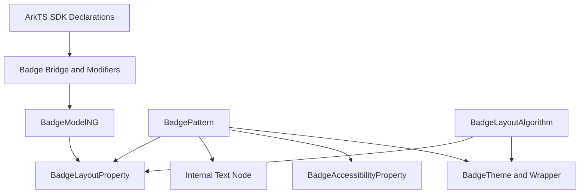

# 架构设计

## 设计元数据

| 字段 | 值 |
|------|----|
| Design ID | DESIGN-Func-05-10-09 |
| 关联需求 | 已有能力补录（无独立 requirement.md） |
| 关联 Epic | 信息展示类组件 |
| 目标 Feature | Feat-01 至 Feat-04 Badge 组件长期规格 |
| 复杂度 | 中 |
| 目标版本 | API 7-26 |
| Owner | ArkUI SIG |
| 状态 | Baselined（已有实现补录） |

## 需求基线

| 项 | 补充说明（如需） |
|----|------------------|
| 存量能力补录 | 本设计只记录 ace_engine 当前实现，不引入新接口或行为变更。 |
| 组件范围 | 覆盖 Badge 数字标记、文字标记、圆点模式、位置控制、样式定制、老年模式、主题更新、无障碍和组件化 bridge。 |
| API 范式 | 同时记录 ArkTS 动态 API、ArkTS 静态 API、Modifier、ContentModifier 和组件化动态模块入口。 |
| 验证基线 | 以 SDK 声明、`frameworks/core/components_ng/pattern/badge/`、Badge bridge、主题文件和 Badge 单测目录为证据。 |

## 上下文和现状

### 涉及仓和模块

| 仓库 | 补充结构说明 |
|------|--------------|
| ace_engine | Badge NG 组件位于 `frameworks/core/components_ng/pattern/badge/`，包含 Pattern、Model、LayoutProperty、LayoutAlgorithm、Accessibility、bridge 和 BUILD.gn。 |
| ace_engine | 默认主题定义位于 `frameworks/core/components/badge/badge_theme.h`，Token 主题适配位于 `frameworks/core/components_ng/pattern/badge/badge_theme_wrapper.h`。 |
| interface_sdk-js | 动态声明位于 `api/@internal/component/ets/badge.d.ts`，静态声明位于 `api/arkui/component/badge.static.d.ets`。 |
| arkui-specs | 本功能域路径为 `05-ui-components/10-information-display-components/09-badge/`。 |

### 调用链层级分析

| 层 | 模块 | 职责 | 修改类型 |
|----|------|------|----------|
| SDK 动态声明 | `badge.d.ts` | 定义 `Badge(options)`、数字/字符串/圆点参数和样式属性。 | 存量记录 |
| SDK 静态声明 | `badge.static.d.ets` | 定义静态范式 Badge 构造与属性接口。 | 存量记录 |
| 组件化加载 | `pattern/badge/bridge/`、`BUILD.gn` | 注册 Badge 动态模块和 static/dynamic/custom modifier。 | 存量记录 |
| Bridge/Modifier | `arkts_native_badge_bridge.cpp`、`badge_*_modifier.cpp` | 解析 ArkTS 参数并分发到 Model/FrameNode。 | 存量记录 |
| Model 层 | `badge_model_ng.cpp` | 写入 Badge 参数、位置、颜色、边框、字体和自动避让属性。 | 存量记录 |
| Pattern 层 | `badge_pattern.cpp` | 管理内部 Text 子节点、可见性、主题更新和无障碍内容。 | 存量记录 |
| Layout/Theme | `badge_layout_algorithm.cpp`、`badge_layout_property.h`、`badge_theme*.h` | 计算 Badge 尺寸与位置，提供默认主题值和老年模式尺寸。 | 存量记录 |

### 适用架构规则

| Rule ID | 适用原因 | 设计结论 | 验证方式 |
|---------|----------|----------|----------|
| OH-ARCH-LAYERING | Badge 覆盖 SDK、Bridge、Model、Pattern、Layout、Theme 和无障碍多层 | 上层只做参数解析；可见性和主题更新集中在 Pattern；布局和位置计算集中在 LayoutAlgorithm。 | 源码审阅、单测 |
| OH-ARCH-RESOURCE | Badge 依赖主题默认值和字体缩放 | 用户设置标记保护自定义值，未设置项跟随主题更新。 | Pattern + Theme 审阅 |
| OH-ARCH-I18N | Badge 需要支持 RTL 位置计算 | 布局算法按方向调整右上角/左右位置。 | LayoutAlgorithm 审阅 |

## 不涉及项承接

| 维度 | 设计结论 |
|------|----------|
| 新增公开 API | 不涉及；本次为长期规格补录。 |
| ABI 结构变更 | 不涉及；只记录现有 Badge 参数和 modifier 行为。 |
| BUILD.gn 新依赖 | 不涉及；只记录已有 Badge 构建组织。 |
| 通知系统集成 | 不涉及；Badge 只负责标记展示，不读取通知数量。 |

## 关键设计决策

| 决策 ID | 问题 | 推荐方案 | 探索过的替代方案 | 取舍理由 | 影响 |
|---------|------|----------|------------------|----------|------|
| ADR-1 | Badge 规格如何拆分 Feat | 按内容模式、位置布局、样式主题、无障碍组件化四个能力簇拆分 | 单个 core spec 承载全部能力 | Badge 覆盖内容、布局、主题和无障碍/组件化多条用户可感知能力，拆分后更接近 Text 组件规格风格。 | Feat-01 至 Feat-04 分别覆盖存量公共能力。 |
| ADR-2 | Badge 内容如何渲染 | 继续使用内部 Text 子节点 | 直接在 Pattern 绘制文字 | 内部 Text 能复用文本布局、样式和无障碍能力。 | Pattern 需要管理 Text 子节点内容和样式。 |
| ADR-3 | 位置能力如何表达 | 枚举位置和 X/Y 坐标并存 | 只保留枚举位置 | 枚举覆盖常见场景，X/Y 支持微调。 | LayoutAlgorithm 需要同时处理两套定位规则。 |
| ADR-4 | 主题更新如何保护用户值 | 使用 `*Byuser` 标记区分用户设置和主题默认 | 主题切换时全部覆盖 | 保留开发者自定义样式，避免深色模式切换误覆盖。 | 规格记录主题更新边界。 |

## 设计骨架

### 骨架范围

| 骨架项 | 目标 | 不包含 | 验证方式 |
|--------|------|--------|----------|
| 内容模式 | 记录 count、value、圆点模式和 maxCount 展示规则。 | 不接入通知数据源。 | SDK + Pattern 审阅 |
| 样式系统 | 记录颜色、字体、边框、圆形尺寸、外边框和主题更新。 | 不扩展 Text 样式规格。 | Model + Theme 审阅 |
| 布局定位 | 记录 BadgePosition、X/Y 坐标、RTL、自动避让和老年模式尺寸。 | 不新增布局容器能力。 | LayoutAlgorithm 审阅 |
| 组件化路径 | 记录 bridge、dynamic/static/custom modifier 和动态模块。 | 不改构建组织。 | BUILD.gn + bridge 审阅 |

### 骨架 Spec 拆分

| Task ID | 目标 | 受影响文件 | AC |
|---------|------|------------|----|
| TASK-SKELETON-1 | 建立 Badge 内容模式规格 | `Feat-01-content-modes-spec.md` | Feat-01 AC |
| TASK-SKELETON-2 | 建立 Badge 位置与布局规格 | `Feat-02-position-layout-spec.md` | Feat-02 AC |
| TASK-SKELETON-3 | 建立 Badge 样式、主题与老年模式规格 | `Feat-03-style-theme-aging-spec.md` | Feat-03 AC |
| TASK-SKELETON-4 | 建立 Badge 无障碍与组件化规格 | `Feat-04-accessibility-componentization-spec.md` | Feat-04 AC |

## 后续 Task 拆分

| Task ID | 目标 | 受影响文件 | 依赖 |
|---------|------|------------|------|
| TASK-05-10-09-F01 | Badge 内容模式规格补录 | `Feat-01-content-modes-spec.md` | SDK 声明、Pattern、Model |
| TASK-05-10-09-F02 | Badge 位置与布局规格补录 | `Feat-02-position-layout-spec.md` | LayoutAlgorithm、LayoutProperty |
| TASK-05-10-09-F03 | Badge 样式、主题与老年模式规格补录 | `Feat-03-style-theme-aging-spec.md` | Model、Pattern、Theme |
| TASK-05-10-09-F04 | Badge 无障碍与组件化规格补录 | `Feat-04-accessibility-componentization-spec.md` | Accessibility、Bridge、BUILD.gn |
| TASK-05-10-09-F05 | 后续新增 Badge 能力按独立 Feat 增量合入 | 后续 `Feat-05-*.md` 和本 `design.md` | Feat-01 至 Feat-04 基线 |

## API 签名、Kit 与权限

本次为已有能力补录，无新增 API。以下为已存在 API 契约清单。

| API 签名 | 类型 | Kit | d.ts 位置 | 权限要求 | SysCap |
|----------|------|-----|-----------|----------|--------|
| `Badge(value: BadgeParamWithNumber): BadgeAttribute` | Public | ArkUI | `<OH_ROOT>/interface/sdk-js/api/@internal/component/ets/badge.d.ts` | 无 | `SystemCapability.ArkUI.ArkUI.Full` |
| `Badge(value: BadgeParamWithString): BadgeAttribute` | Public | ArkUI | `<OH_ROOT>/interface/sdk-js/api/@internal/component/ets/badge.d.ts` | 无 | `SystemCapability.ArkUI.ArkUI.Full` |
| `Badge(value: BadgeParamWithNumber | BadgeParamWithString): BadgeAttribute` | Public static | ArkUI | `<OH_ROOT>/interface/sdk-js/api/arkui/component/badge.static.d.ets` | 无 | `SystemCapability.ArkUI.ArkUI.Full` |
| Badge 样式属性 | Public | ArkUI | Badge dynamic/static declarations | 无 | `SystemCapability.ArkUI.ArkUI.Full` |

### 新增 API

无。

### 变更/废弃 API

无。

## 构建系统影响

### BUILD.gn 变更

无。本设计只记录现有 `frameworks/core/components_ng/pattern/badge/BUILD.gn` 组织。

### bundle.json 变更

无。

## 可选设计扩展

### 架构图

### 数据模型设计

| 数据模型 | 存储位置 | 主要字段 | 说明 |
|----------|----------|----------|------|
| `BadgeParamWithNumber` | SDK 声明 / bridge 入参 | count、maxCount、position、style | 数字标记配置。 |
| `BadgeParamWithString` | SDK 声明 / bridge 入参 | value、position、style | 文字标记配置。 |
| `BadgeLayoutProperty` | `badge_layout_property.h` | 内容、位置、颜色、边框、字体、自动避让和用户设置标记 | 布局态和显示状态。 |
| `BadgeTheme` | `badge_theme.h`、`badge_theme_wrapper.h` | 默认颜色、字体、尺寸、老年模式尺寸 | 主题默认值来源。 |

### 接口参数规约

| 接口 | 参数 | 类型 | 合法范围 | 非法处理 | 边界说明 |
|------|------|------|----------|----------|----------|
| `Badge({ count })` | `count` | number | 整数 | 小于等于 0 时不显示数字内容 | 超过 maxCount 显示上限格式。 |
| `Badge({ value })` | `value` | string | 字符串 | 空字符串使用占位显示路径 | 文字模式优先显示 value。 |
| `Badge({ position })` | `position` | BadgePosition / positionX/Y | 预设或坐标 | 未设置使用默认位置 | RTL 影响左右位置。 |
| 样式属性 | color/size/border/font | ResourceColor/Length/FontWeight | SDK 支持类型 | 无效值走默认/重置路径 | 用户设置标记保护主题更新。 |

## 详细设计

### 内容可见性

Badge 根据 count、value 和圆点配置决定内部 Text 子节点内容。数字模式在 count 大于 0 时显示；文字模式显示 value；圆点模式可通过尺寸和内容规则形成无文本标记。

### 尺寸和位置计算

LayoutAlgorithm 根据文本宽度、圆形直径、padding、老年模式字体和父组件尺寸计算 Badge 大小。位置优先使用 X/Y 坐标；否则按 BadgePosition 预设和 RTL 方向计算。

### 主题更新

Pattern 在主题或颜色模式变化时读取 BadgeTheme。用户主动设置的颜色、字体、尺寸和边框通过 `*Byuser` 标记保留，未设置项跟随主题更新。

## 风险和开放问题

| 项 | 类型 | 影响 | 处理方式 | Owner |
|----|------|------|----------|-------|
| `*Byuser` 标记拼写历史遗留 | 可读性 | 低 | 规格沿用源码字段命名，不改实现。 | ArkUI SIG |
| 位置规则和自动避让组合复杂 | 行为 | 中 | Feat 中用 AC 覆盖枚举、X/Y、RTL 和自动避让。 | ArkUI SIG |
| 老年模式阈值依赖主题/字体缩放 | 兼容 | 中 | 规格记录阈值和默认值来源。 | ArkUI SIG |

## 设计审批

| 角色 | 状态 | 说明 |
|------|------|------|
| ArkUI SIG | 待确认 | 已有实现补录，等待长期规格评审。 |
