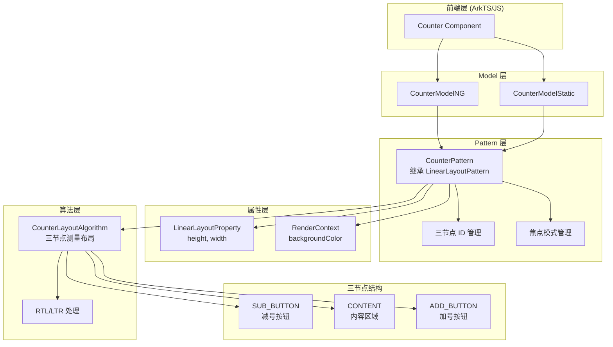

# 架构设计

> 确认目标仓和模块的架构约束、关键设计决策、Spec 拆分方向。

## 设计元数据

| Field | Content |
|-------|---------|
| Design ID | DESIGN-Func-05-10-10 |
| 关联需求 | 已有能力补录（无独立 requirement.md） |
| 关联 Epic | 无 |
| 目标 Feature | Feat-01: Counter 创建、尺寸与基础样式；Feat-02: Counter 按钮控制与事件回调；Feat-03: Counter 多范式接口与 C-API |
| 复杂度 | 标准 |
| 目标版本 | API 8+ |
| Owner | ArkUI SIG |
| 状态 | Baselined（已有实现补录） |

## 需求基线

> 需求基线详见 proposal.md。以下仅列出设计阶段需要额外强调的要点。

| 项 | 补充说明 |
|----|------------------|
| 三节点计数器组件 | 由减号按钮、内容区域、加号按钮三部分组成，用于数量选择 |
| 尺寸与样式配置 | height、width、backgroundColor 属性设置 |
| 多范式接口 | 动态 API (ModelNG)、静态 API (ModelStatic)、C-API (Native Modifier) |

## 上下文和现状

### 涉及仓和模块

| 仓库 | 补充架构说明 |
|------|--------------|
| arkui_ace_engine | 核心渲染引擎，包含 Counter 的完整实现 |

| 模块 | 路径 | 当前职责 | 影响类型 |
|------|------|----------|----------|
| CounterPattern | frameworks/core/components_ng/pattern/counter/counter_pattern.cpp | Pattern 层核心逻辑，三节点管理 | 无变更（补录） |
| CounterModelNG | frameworks/core/components_ng/pattern/counter/counter_model_ng.cpp | 动态范式 Model 层 | 无变更（补录） |
| CounterModelStatic | frameworks/core/components_ng/pattern/counter/counter_model_static.cpp | 静态范式 Model 层 | 无变更（补录） |
| CounterLayoutAlgorithm | frameworks/core/components_ng/pattern/counter/counter_layout_algorithm.cpp | 布局算法 | 无变更（补录） |
| CounterNode | frameworks/core/components_ng/pattern/counter/counter_node.cpp | CounterNode (GroupNode) | 无变更（补录） |
| CounterTheme | frameworks/core/components_ng/pattern/counter/counter_theme.h | 主题常量 | 无变更（补录） |

### 调用链层级分析

| 层 | 模块 | 职责 | 修改类型 |
|----|------|------|----------|
| 前端层 | ArkTS/JS | 组件接口暴露，链式调用入口 | 无变更 |
| Model 层 | CounterModelNG/Static | 属性分发，FrameNode 创建与属性设置，三子节点创建 | 无变更 |
| Pattern 层 | CounterPattern | 三节点 ID 管理，焦点模式，主题更新 | 无变更 |
| LayoutProperty 层 | LinearLayoutProperty | height、width 属性存储 | 无变更 |
| RenderContext 层 | RenderContext | backgroundColor 属性存储 | 无变更 |
| LayoutAlgorithm 层 | CounterLayoutAlgorithm | 三节点测量布局，RTL/LTR 处理 | 无变更 |

检查项：
- [x] 调用链每一层都已覆盖（从最上层到最下层）
- [x] 每层职责边界清晰，无跨层违规调用
- [x] 每层修改类型明确（无变更，补录规格）

### 适用架构规则

| Rule ID | 适用原因 | 设计结论 | 验证方式 |
|---------|----------|----------|----------|
| OH-ARCH-LAYERING | 涉及多层调用（前端→Model→Pattern→Property→Render） | 调用方向为单向向下，无跨层回调 | 代码评审 |
| OH-ARCH-API-LEVEL | 涉及公开 API（ArkTS 组件属性） | API 8+ 支持，无权限要求 | API 评审 |
| OH-ARCH-COMPONENT-BUILD | 涉及组件构建 | 已在 components.gni 中注册 | 构建验证 |

## 不涉及项承接

> proposal.md 已完成 N/A 判定。本节仅对 proposal 中标记为"涉及"且需展开设计的维度给出结论。

| 维度 | 设计结论 |
|------|----------|
| 数值管理 | 组件本身不存储数值，由外部状态管理，通过 onInc/onDec 回调处理 |
| RTL 支持 | 布局算法自动处理，无需应用层干预 |

## 关键设计决策

| 决策 ID | 问题 | 推荐方案 | 探索过的替代方案 | 取舍理由 | 影响 |
|---------|------|----------|------------------|----------|------|
| ADR-1 | 三节点结构 | 固定顺序：SUB_BUTTON(0) → CONTENT(1) → ADD_BUTTON(2) | 动态添加节点 | 简化布局计算和索引管理 | 影响布局算法和子节点访问 |
| ADR-2 | 高度属性传播 | SetHeight() 更新 Counter + 所有子节点高度 | 仅更新容器高度 | 保证三节点高度一致，避免视觉错位 | 影响子节点布局测量 |
| ADR-3 | 宽度属性处理 | SetWidth() 仅更新 Counter 容器，子节点使用 LayoutWeight | 所有子节点都设置宽度 | 内容区域自动填充剩余空间，按钮宽度由主题控制 | 影响宽度计算逻辑 |
| ADR-4 | 背景色存储位置 | 存储在 RenderContext，非 LayoutProperty | 统一存储在 LayoutProperty | 背景色是渲染属性，不影响布局测量 | 影响脏标记策略 |
| ADR-5 | RTL/LTR 自动切换 | 布局算法根据 TextDirection 调整按钮位置 | 固定位置 | 符合国际化标准，自动适配 | 影响布局 Layout() 实现 |
| ADR-6 | 焦点模式版本差异 | API 18+ 使用 FocusType::SCOPE，之前使用 FocusType::NODE | 统一焦点模式 | 新版本支持更好的键盘导航体验 | 影响焦点测试 |

## 设计骨架

### 骨架范围

| 骨架项 | 目标 | 不包含 | 验证方式 |
|--------|------|--------|----------|
| 核心属性 | height, width, backgroundColor | 按钮控制属性（enableInc, enableDec） | 单元测试 |
| 基础样式 | 三节点结构、布局算法 | 事件回调详细规格 | 渲染测试 |

### 骨架 Spec 拆分

| Task ID | 目标 | 受影响文件 | AC |
|---------|------|------------|----|
| TASK-SKELETON-1 | 创建 design.md 和 Feat-01 规格文档 | design.md, Feat-01-*-spec.md | 规格覆盖核心属性和基础样式 |

## 后续 Task 拆分

| Task ID | 目标 | 受影响文件 | 依赖 |
|---------|------|------------|------|
| TASK-1 | Feat-01 规格生成 | Feat-01-counter-creation-size-style-spec.md | 无 |
| TASK-2 | Feat-02 规格生成（按钮控制与事件回调） | Feat-02-*-spec.md | TASK-1 |
| TASK-3 | Feat-03 规格生成（多范式接口与 C-API） | Feat-03-*-spec.md | TASK-1 |

## API 签名、Kit 与权限

### 新增 API

> 已有实现补录，无新增 API。

### 变更/废弃 API

> 无变更或废弃 API。

## 构建系统影响

### BUILD.gn 变更

> 无构建系统变更，组件已在 components.gni 中注册。

### bundle.json 变更

> 无变更。

## 可选设计扩展

### 架构图



### 三节点结构图

```
Counter FrameNode
├── Button FrameNode (SUB_BUTTON, index=0)
│   └── Text FrameNode ("-")
├── Row FrameNode (CONTENT, index=1)
│   └── [用户内容]
└── Button FrameNode (ADD_BUTTON, index=2)
    └── Text FrameNode ("+")
```

### 数据流/控制流

| 步骤 | 调用方 | 被调用方 | 数据/接口 | 说明 |
|------|--------|----------|-----------|------|
| 1 | ArkTS | ModelNG.SetHeight() | Dimension | 设置高度 |
| 2 | ModelNG | LayoutProperty.UpdateUserDefinedIdealSize() | CalcSize | 更新 Counter 容器高度 |
| 3 | ModelNG | 子节点 LayoutProperty.UpdateUserDefinedIdealSize() | CalcSize | 传播到三子节点 |
| 4 | ArkTS | ModelNG.SetWidth() | Dimension | 设置宽度 |
| 5 | ModelNG | LayoutProperty.UpdateUserDefinedIdealSize() | CalcSize | 仅更新容器宽度 |
| 6 | ArkTS | ModelNG.SetBackgroundColor() | Color | 设置背景色 |
| 7 | ModelNG | RenderContext.UpdateBackgroundColor() | Color | 更新渲染上下文 |
| 8 | LayoutAlgorithm | Measure() | 布局约束 | 测量三节点 |
| 9 | LayoutAlgorithm | Layout() | 位置偏移 | 布局三节点（RTL/LTR） |

### 接口参数规约

| 接口 | 参数 | 类型 | 合法范围 | 非法处理 | 边界说明 |
|------|------|------|----------|----------|----------|
| SetHeight | value | Dimension | >0 vp | 无特殊处理 | 默认主题值 32vp |
| SetWidth | value | Dimension | >0 vp | 无特殊处理 | 默认主题值 100vp |
| SetBackgroundColor | value | Color | 有效颜色值 | 忽略无效值 | 支持 ResourceColor |

## 详细设计

### 三节点结构管理

**源码**: `counter_pattern.h:275-277`

```cpp
std::optional<int32_t> subId_;    // Decrement button
std::optional<int32_t> contentId_; // Content area
std::optional<int32_t> addId_;    // Increment button
```

**节点索引常量** (`counter_layout_algorithm.cpp:25-27`):
```cpp
constexpr int32_t SUB_BUTTON = 0;   // 减号按钮（索引 0）
constexpr int32_t CONTENT = 1;       // 内容区域（索引 1）
constexpr int32_t ADD_BUTTON = 2;    // 加号按钮（索引 2）
```

### 高度属性传播机制

**源码**: `counter_model_ng.cpp:210-244`

```cpp
void CounterModelNG::SetHeight(const Dimension& value)
{
    // 1. 更新 Counter 容器
    layoutProperty->UpdateUserDefinedIdealSize(CalcSize(std::nullopt, CalcLength(value)));

    // 2. 更新减号按钮及其文本子节点
    auto subNode = ...;
    subLayoutProperty->UpdateUserDefinedIdealSize(CalcSize(std::nullopt, CalcLength(value)));
    auto subTextNode = AceType::DynamicCast<FrameNode>(subNode->GetFirstChild());
    subTextLayoutProperty->UpdateUserDefinedIdealSize(CalcSize(std::nullopt, CalcLength(value)));

    // 3. 更新内容区域
    contentLayoutProperty->UpdateUserDefinedIdealSize(CalcSize(std::nullopt, CalcLength(value)));

    // 4. 更新加号按钮及其文本子节点
    auto addNode = ...;
    addLayoutProperty->UpdateUserDefinedIdealSize(CalcSize(std::nullopt, CalcLength(value)));
    auto addTextNode = AceType::DynamicCast<FrameNode>(addNode->GetFirstChild());
    addTextLayoutProperty->UpdateUserDefinedIdealSize(CalcSize(std::nullopt, CalcLength(value)));
}
```

**传播路径**: Counter → Sub Button → Sub Text → Content → Add Button → Add Text

### 宽度属性处理

**源码**: `counter_model_ng.cpp:246-253`

```cpp
void CounterModelNG::SetWidth(const Dimension& value)
{
    auto layoutProperty = frameNode->GetLayoutProperty();
    layoutProperty->UpdateUserDefinedIdealSize(CalcSize(CalcLength(value), std::nullopt));
}
```

**特点**:
- 仅更新 Counter 容器宽度
- 按钮宽度由主题 `controlWidth` 控制
- 内容区域使用 `LayoutWeight` 自动填充剩余空间

### 布局算法

**源码**: `counter_layout_algorithm.cpp:40-214`

**Measure 流程**:
1. **Counter 自身测量** (lines 40-75): 计算帧大小，处理布局策略
2. **内容区域测量** (lines 83-131): 宽度 = `width - 2 * buttonWidth`
3. **减号按钮测量** (lines 133-178): 设置边框圆角（LTR 左侧圆角）
4. **加号按钮测量** (lines 179-213): 设置边框圆角（LTR 右侧圆角）

**Layout 流程** (`counter_layout_algorithm.cpp:258-266`):
```cpp
void CounterLayoutAlgorithm::Layout(LayoutWrapper* layoutWrapper)
{
    auto layoutDirection = layoutWrapper->GetLayoutProperty()->GetNonAutoLayoutDirection();
    if (layoutDirection == TextDirection::RTL) {
        LayoutItem(layoutWrapper, ADD_BUTTON, SUB_BUTTON);  // RTL: + 在左，- 在右
    } else {
        LayoutItem(layoutWrapper, SUB_BUTTON, ADD_BUTTON);  // LTR: - 在左，+ 在右
    }
}
```

**RTL/LTR 布局对比**:
```
LTR (默认):
┌─────┬────────────┬─────┐
│  -  │   Content   │  +  │
└─────┴────────────┴─────┘

RTL:
┌─────┬────────────┬─────┐
│  +  │   Content   │  -  │
└─────┴────────────┴─────┘
```

### 主题默认值

**源码**: `counter_theme.h:140-144`

| 属性 | 默认值 |
|------|--------|
| height | 32.0_vp |
| width | 100.0_vp |
| controlWidth | 32.0_vp |
| contentWidth | 36.0_vp |
| alphaDisabled | 0.4 |

### 按钮启用状态管理（Feat-02）

**源码**: `counter_model_ng.cpp:132-174`

```cpp
void CounterModelNG::SetEnableDec(bool enableDec)
{
    auto subNode = ...;
    auto eventHub = subNode->GetEventHub<EventHub>();
    eventHub->SetEnabled(enableDec);  // 存储到 EventHub
    
    if (!eventHub->IsEnabled()) {
        subNode->GetRenderContext()->UpdateOpacity(counterTheme->GetAlphaDisabled());  // 0.4
    } else {
        subNode->GetRenderContext()->UpdateOpacity(1.0);
    }
}
```

**存储位置**:
- 启用状态：`EventHub::enabled_` 和 `EventHub::developerEnabled_`
- 禁用透明度：`RenderContext::opacity`

**禁用效果**: 透明度从 1.0 变为 0.4（40%）

### 事件回调注册（Feat-02）

**源码**: `counter_model_ng.cpp:176-208`

```cpp
void CounterModelNG::SetOnInc(CounterEventFunc&& onInc)
{
    auto addNode = ...;
    auto gestureHub = addNode->GetOrCreateGestureEventHub();
    
    // 包装为 GestureEventFunc
    GestureEventFunc gestureEventFunc = [clickEvent = std::move(onInc)](GestureEvent& /*unused*/) {
        clickEvent();  // 调用 Counter 回调
    };
    gestureHub->SetUserOnClick(std::move(gestureEventFunc));
}
```

**事件类型**:
- `CounterEventFunc`: `std::function<void()>` (无参数)
- `GestureEventFunc`: `std::function<void(GestureEvent&)>` (有参数)

**包装机制**: CounterEventFunc 被包装为 GestureEventFunc，忽略 GestureEvent 参数

### 按钮创建（Feat-02）

**源码**: `counter_model_ng.cpp:72-113`

**创建流程**:
1. 使用 `ButtonCustomModifier` 创建 Button FrameNode
2. 应用主题样式（尺寸、边框、背景透明）
3. 创建内部 Text 节点显示符号（"+" 或 "-"）
4. 挂载 Text 到 Button

**符号常量**:
- `SUB[] = u"-"` - 减号按钮
- `ADD[] = u"+"` - 加号按钮

### 动态 API 设计（Feat-03）

**源码**: `counter_model_ng.cpp:33-70`

```cpp
void CounterModelNG::Create()
{
    auto* stack = ViewStackProcessor::GetInstance();
    auto nodeId = stack->ClaimNodeId();
    auto counterNode = CounterNode::GetOrCreateCounterNode(
        COUNTER_ETS_TAG, nodeId, []() { return AceType::MakeRefPtr<CounterPattern>(); });
    // 创建三子节点并挂载
    stack->Push(counterNode);
}
```

**特点**:
- `Create()` 不返回值（void），不同于其他组件返回 Controller
- 使用 `ViewStackProcessor` 管理节点栈
- 子节点在 Create() 中同步创建

### 静态 API 设计（Feat-03）

**源码**: `counter_model_static.cpp:34-69`

```cpp
RefPtr<FrameNode> CounterModelStatic::CreateFrameNode(int32_t nodeId)
{
    auto counterNode = CounterNode::GetOrCreateCounterNode(
        COUNTER_ETS_TAG, nodeId, []() { return AceType::MakeRefPtr<CounterPattern>(); });
    // 创建三子节点并挂载
    return counterNode;  // 返回 FrameNode
}
```

**与动态 API 的差异**:
- 返回 `RefPtr<FrameNode>` 而非 void
- 参数为显式 `nodeId`
- 不使用 ViewStackProcessor

### 多范式对比（Feat-03）

| 特性 | 动态 API (ModelNG) | 静态 API (ModelStatic) |
|------|-------------------|----------------------|
| 创建返回 | void | RefPtr<FrameNode> |
| 参数类型 | Dimension | CalcLength |
| 子节点创建 | Create() 中同步创建 | CreateFrameNode() 中同步创建 |
| ViewStackProcessor | 使用 | 不使用 |

## 风险和开放问题

| 项 | 类型 | 影响 | 处理方式 | Owner |
|----|------|------|----------|-------|
| ControlWidth 未实现 | 功能 | 低 | SetControlWidth() 为空实现，预留接口 | CounterModelNG |
| StateChange 未实现 | 功能 | 低 | SetStateChange() 为空实现，预留接口 | CounterModelNG |
| 高度传播性能 | 性能 | 低 | 每次设置高度遍历 5 个节点 | CounterModelNG |

## 设计审批

- [x] 需求基线已确认，设计覆盖 P0/P1 AC
- [x] 不涉及项已承接，N/A 和展开项都有结论
- [x] 涉及仓和模块职责清楚
- [x] 调用链层级分析完整，每层覆盖到位
- [x] 适用架构规则已识别并形成设计结论
- [x] 分层和子系统边界合规
- [x] API 变更有签名、权限、错误码和兼容性说明
- [x] BUILD.gn/bundle.json 影响明确
- [x] 设计输出和后续 Task 拆分明确
- [x] 关键设计决策有理由和影响说明
- [x] 风险和开放问题有 Owner

**结论:** 通过（已有实现补录）