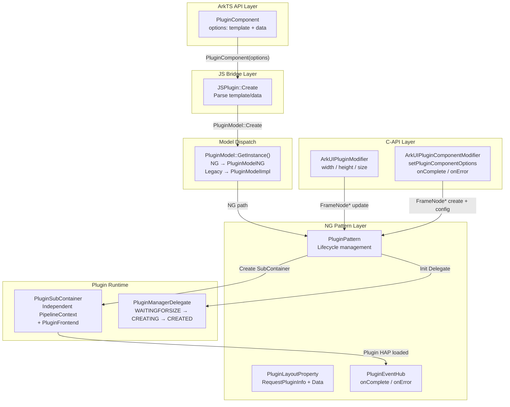
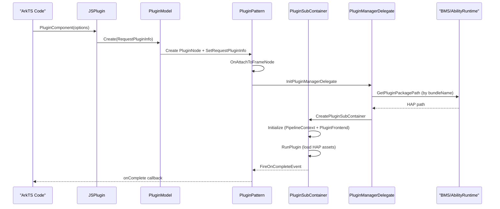

# 架构设计

> PluginComponent 显示嵌入组件——用于在宿主应用页面中嵌入外部 Plugin 的 UI 内容，通过 PluginSubContainer 创建独立渲染管线加载 Plugin HAP/JS bundle，并通过 PluginComponentManager 提供跨组件 Push/Request 通信机制。

## 设计元数据

| 字段 | 内容 |
|------|------|
| Design ID | DESIGN-Func-05-12-01 |
| 关联需求 | 已有能力补录（无独立 requirement.md） |
| 关联 Epic | 无 |
| 目标 Feature | Feat-01 PluginComponent创建/模板/数据与事件回调 |
| 复杂度 | 标准 |
| 目标版本 | API 9+（@systemapi），后续 Feat-02 覆盖 Manager API 8+ |
| Owner | ArkUI SIG / 嵌入组件团队 |
| 状态 | Baselined（已有实现补录） |

## 需求基线

| 项 | 补充说明 |
|----|----------|
| 组件创建与模板 | PluginComponent 接受 `PluginComponentOptions { template, data }` 创建，template 包含 source/bundleName，用于定位 Plugin HAP |
| 独立渲染管线 | PluginSubContainer 创建独立 PipelineContext + PluginFrontend 加载 Plugin 内容，与宿主页面渲染隔离 |
| 事件回调 | onComplete（加载成功）和 onError（加载失败）两个回调 |
| 跨组件通信 | PluginComponentManager 提供 push/request/on/off 机制，通过 UIService IPC 实现跨组件数据传递 |

## 上下文和现状

### 涉及仓和模块

| 仓库 | 补充架构说明 |
|------|-------------|
| ace_engine/frameworks/core/components_ng/pattern/plugin/ | NG Pattern 层：PluginPattern、PluginModelNG、PluginModelStatic、PluginLayoutProperty、PluginEventHub、PluginNode |
| ace_engine/frameworks/core/components/plugin/ | Legacy Component 层：PluginComponent、PluginElement、PluginSubContainer、PluginComponentManager、PluginManagerDelegate、PluginWindow |
| ace_engine/frameworks/bridge/declarative_frontend/jsview/ | JS 桥接层：JSPlugin、PluginModelImpl（legacy model） |
| ace_engine/frameworks/core/interfaces/native/ | C-API 层：plugin_modifier（dynamic width/height）、plugin_component_modifier（static Arkoala bridge） |
| ace_engine/interfaces/napi/kits/plugincomponent/ | NAPI Manager 层：@ohos.pluginComponent push/request/on/off |
| interface/sdk-js/api/@internal/component/ets/plugin_component.d.ts | SDK 组件级声明（@systemapi, since 9） |
| interface/sdk-js/api/@ohos.pluginComponent.d.ts | SDK Manager 级声明（public, since 8/12） |

### 调用链层级分析

| 层 | 模块 | 职责 | 修改类型 |
|----|------|------|----------|
| ArkTS API 层 | `PluginComponent(options)` 声明式调用 | 创建组件、传入 template/data | 已有实现 |
| JS Bridge 层 | `js_plugin.cpp` JSPlugin::Create | 解析 template/data，调用 PluginModel::GetInstance()->Create | 已有实现 |
| Model Dispatch 层 | `PluginModel::GetInstance()` | 根据 IsCurrentUseNewPipeline() 返回 PluginModelNG 或 PluginModelImpl | 已有实现 |
| NG Pattern 层 | `PluginPattern` | 管理插件生命周期：创建 PluginSubContainer、注册回调、检测属性变更 | 已有实现 |
| Sub-Container 层 | `PluginSubContainer` | 创建独立 PipelineContext + PluginFrontend，加载 Plugin HAP | 已有实现 |
| Manager Delegate 层 | `PluginManagerDelegate` | 管理平台侧插件资源生命周期（WAITINGFORSIZE→CREATING→CREATED） | 已有实现 |
| Legacy Component 层 | `PluginComponent/PluginElement` | Legacy 管线渲染路径 | 已有实现 |
| C-API 层 | `plugin_modifier.cpp / plugin_component_modifier.cpp` | Dynamic: width/height/size; Static: setPluginComponentOptions/onComplete/onError | 已有实现 |
| NAPI Manager 层 | `js_plugin_component.cpp` | push/request/on/off 跨组件 IPC | 已有实现 |

### 适用架构规则

| Rule ID | 适用原因 | 设计结论 | 验证方式 |
|---------|----------|----------|----------|
| OH-ARCH-LAYERING | 跨层调用：ArkTS → JS Bridge → Model → Pattern → SubContainer | 调用方向严格自上而下；SubContainer 创建独立管线不反向依赖宿主 | 代码评审 |
| OH-ARCH-IPC-SAF | PluginComponentManager 通过 UIService Stub 实现跨进程 Push/Request | IPC 通道为 AAFwk::Want → UIService，ace_engine 不定义 SAF | 集成测试 |
| OH-ARCH-API-LEVEL | 组件级 API 为 @systemapi（since 9），Manager 级 API 为 public（since 8） | 两级 API 分别在 `@internal` 和 `@ohos` d.ts 中声明，权限边界明确 | API 评审 |
| OH-ARCH-SUBSYSTEM | PluginComponent 跨子系统依赖：bundle_framework（BMS）、ability_runtime（AppManager）、ipc | 依赖通过 adapter 层桥接，核心 Pattern 不直接引用系统服务头文件 | 依赖检查 |

## 不涉及项承接

| 维度 | 设计结论 |
|------|----------|
| 性能 | 不量化指标；PluginSubContainer 创建独立管线有固有的初始化延迟 |
| 安全与权限 | 组件级 @systemapi 限制系统应用使用；Manager 级 public 对所有应用开放 |
| 兼容性 | AbilityComponent 已废弃（since 10），本 Feat 不覆盖废弃迁移 |
| 持久化 | Plugin 无持久化需求；data 为一次性传递 |
| 构建与部件 | 无新部件引入；已有 plugin_pattern_ng 和 plugin BUILD.gn target |

## 关键设计决策

| 决策 ID | 问题 | 推荐方案 | 探索过的替代方案 | 取舍理由 | 影响 |
|---------|------|----------|-----------------|----------|------|
| ADR-1 | Plugin 渲染为何使用独立管线 | PluginSubContainer 创建独立 PipelineContext + PluginFrontend，与宿主页面渲染完全隔离 | 共用宿主 PipelineContext | Plugin HAP 有自己的 JS bundle 和组件树，共用管线会导致状态/事件/VSync 串扰 | plugin_sub_container.h |
| ADR-2 | Model Dispatch 为何保留 legacy 路径 | PluginModel::GetInstance() 根据 IsCurrentUseNewPipeline() 返回 PluginModelNG 或 PluginModelImpl | 仅保留 NG 路径 | FA 模型应用仍在使用 legacy 管线，强行切换会导致功能断裂 | plugin_model.h:44 |
| ADR-3 | C-API 为何拆分 Dynamic 和 Static 两套 | Dynamic modifier 仅覆盖 width/height/size（运行时更新）；Static modifier（Arkoala）覆盖 setPluginComponentOptions/onComplete/onError（创建时配置） | 合并为单一 modifier | Dynamic modifier 操作已有 FrameNode，Static modifier 需 ConstructImpl 创建新节点，职责不同 | plugin_modifier.h, plugin_component_modifier.cpp |
| ADR-4 | PluginComponentManager 为何使用 UIService IPC | push/request 通过 AAFwk::UIServiceStub 跨进程传递 Want + data | 直接在宿主进程内调用 | Plugin 运行在独立进程，宿主无法直接访问其 JS 环境 | plugin_component_manager.h |

## 设计骨架

### 骨架范围

| 骨架项 | 目标 | 不包含 | 验证方式 |
|--------|------|--------|----------|
| 组件创建与模板 | 锁定 PluginComponent 创建流程、template/data 传递、PluginSubContainer 初始化 | Manager push/request 机制 | 代码评审 |
| 事件回调 | 锁定 onComplete/onError 触发条件与数据格式 | Manager on/off 回调 | 代码评审 |
| C-API 双通道 | 锁定 Dynamic modifier 和 Static modifier 覆盖范围 | CJUI bridge | C-API 单测 |

### 骨架 Spec 拆分

| Task ID | 目标 | 受影响文件 | AC |
|---------|------|------------|----|
| TASK-SKELETON-1 | PluginComponent 创建/模板/数据 + 事件回调 | plugin_pattern.cpp, plugin_sub_container.cpp, js_plugin.cpp, plugin_component_modifier.cpp | Feat-01 AC |
| TASK-SKELETON-2 | PluginComponentManager push/request/on/off | plugin_component_manager.cpp, js_plugin_component.cpp | Feat-02 AC |

## 后续 Task 拆分

| Task ID | 目标 | 受影响文件 | 依赖 |
|---------|------|------------|------|
| TASK-1 | PluginComponent创建/模板/数据与事件回调 | Feat-01-plugin-component-creation-events-spec.md | 无（基线） |
| TASK-2 | PluginComponent跨组件Push/Request Manager | Feat-02-plugin-component-manager-spec.md | TASK-1 |

## API 签名、Kit 与权限

### 新增 API

| API 签名 | 类型 | Kit | d.ts 位置 | 权限要求 | SysCap |
|----------|------|-----|-----------|----------|--------|
| `PluginComponent(options: PluginComponentOptions)` | System | ArkUI | `@internal/component/ets/plugin_component.d.ts` | @systemapi | SystemCapability.ArkUI.ArkUI.Full |
| `PluginComponentTemplate { source, bundleName }` | System | ArkUI | `@internal/component/ets/plugin_component.d.ts` | @systemapi | SystemCapability.ArkUI.ArkUI.Full |
| `PluginComponentOptions { template, data }` | System | ArkUI | `@internal/component/ets/plugin_component.d.ts` | @systemapi | SystemCapability.ArkUI.ArkUI.Full |
| `onComplete(callback: VoidCallback)` | System | ArkUI | `@internal/component/ets/plugin_component.d.ts` | @systemapi | SystemCapability.ArkUI.ArkUI.Full |
| `onError(callback: PluginErrorCallback)` | System | ArkUI | `@internal/component/ets/plugin_component.d.ts` | @systemapi | SystemCapability.ArkUI.ArkUI.Full |
| `PluginErrorData { errcode, msg }` | System | ArkUI | `@internal/component/ets/plugin_component.d.ts` | @systemapi | SystemCapability.ArkUI.ArkUI.Full |

### 变更/废弃 API

无。

## 构建系统影响

### BUILD.gn 变更

```text
文件: frameworks/core/components_ng/pattern/plugin/BUILD.gn
变更说明: 定义 plugin_pattern_ng target（plugin_model_ng.cpp, plugin_model_static.cpp, plugin_node.cpp, plugin_pattern.cpp）
依赖: ability_base:want, ability_runtime:app_manager, bundle_framework:appexecfwk_core, graphic_2d, ipc
```

### bundle.json 变更

无新增 component 依赖。

## 可选设计扩展

### 架构图



### 时序设计



### 数据模型设计

**SDK 层 TypeScript 类型：**
```typescript
interface PluginComponentTemplate {
  source: string;      // Plugin source name (@since 9)
  bundleName: string;  // Bundle name (@since 9)
}

interface PluginComponentOptions {
  template: PluginComponentTemplate;  // (@since 9/18 rectified)
  data: any;                           // (@since 9/18 rectified)
}

interface PluginErrorData {
  errcode: number;  // Error code (@since 9/18 rectified)
  msg: string;      // Error message (@since 9/18 rectified)
}
```

**C++ 层核心数据结构：**

| 结构 | 位置 | 关键字段 |
|------|------|----------|
| `RequestPluginInfo` | `plugin_request_data.h` | id, pluginName, bundleName, abilityName, moduleName, source, moduleResPath, dimension, allowUpdate, width, height, index |
| `PluginLayoutProperty` | `plugin_layout_property.h` | REQUEST_PLUGIN_INFO (RequestPluginInfo), DATA (string) |
| `PluginEventHub` | `plugin_event_hub.h` | onError_ (function<void(string)>), OnComplete_ (function<void(string)>) |

## 详细设计

### PluginPattern 生命周期管理

**OnAttachToFrameNode** (`plugin_pattern.cpp`):
- 注册 OnComplete/OnError 事件回调到 PluginEventHub
- 初始化 PluginManagerDelegate：注册 complete/update/error 回调
- 设置 DrawDelegate 用于 PluginSubContainer 渲染结果挂载

**OnDirtyLayoutWrapperSwap** (`plugin_pattern.cpp`):
- 比较新旧 RequestPluginInfo
- 若 template 变化（bundleName/abilityName/source 不同）：销毁旧 SubContainer，创建新 SubContainer
- 若仅 dimension/size 变化：更新 SubContainer 窗口尺寸

**PluginSubContainer 创建流程** (`plugin_sub_container.cpp`):
1. 创建独立 PipelineContext（独立 TaskExecutor + ThreadModel）
2. 创建 PluginFrontend（处理 Plugin JS bundle）
3. 初始化 AssetProvider（从 HAP 包加载资源）
4. RunPlugin / RunDecompressedPlugin：加载 JS bundle 并启动渲染
5. 挂载结果到宿主 PluginNode 下

**PluginManagerDelegate 状态机** (`plugin_manager_delegate.h`):
- WAITINGFORSIZE → CREATING → CREATED / CREATEFAILED → RELEASED
- 注册 OnSizeChanged / OnComplete / OnUpdate / OnError 回调

### C-API 双通道

**Dynamic Modifier** (`plugin_modifier.cpp`):
- `SetPluginWidth/SetPluginHeight/SetPluginSize`：运行时修改 Plugin 尺寸
- 操作已存在的 FrameNode*，调用 PluginModelNG::SetWidth/SetHeight/SetPluginSize

**Static Modifier (Arkoala)** (`plugin_component_modifier.cpp`):
- `ConstructImpl`：创建 FrameNode（PluginModelStatic::CreateFrameNode）
- `SetPluginComponentOptionsImpl`：设置 RequestPluginInfo + Data
- `SetOnCompleteImpl/SetOnErrorImpl`：设置事件回调

## 风险和开放问题

| 项 | 类型 | 影响 | 处理方式 | Owner |
|----|------|------|----------|-------|
| PluginComponent 为 @systemapi 组件 | API | 中 | 仅系统应用可使用；EmbeddedComponent 为 @atomicservice 替代 | ArkUI SIG |
| PluginSubContainer 创建独立管线有初始化延迟 | 架构 | 中 | 不量化指标，标注为已知特性 | ArkUI SIG |
| Model Dispatch 保留 legacy 路径 | 架构 | 低 | FA 模型仍依赖 legacy；标注为兼容性约束 | ArkUI SIG |
| Dynamic C-API 仅覆盖 width/height，不覆盖 template/data | API | 低 | template/data 变更通过 Static modifier 或 ArkTS API | ArkUI SIG |

## 设计审批

- [x] 需求基线已确认，设计覆盖 P0/P1 AC
- [x] 不涉及项已承接，N/A 和展开项都有结论
- [x] 涉及仓和模块职责清楚
- [x] 调用链层级分析完整，每层覆盖到位
- [x] 适用架构规则已识别并形成设计结论
- [x] 分层和子系统边界合规
- [x] API 变更有签名、权限、错误码和兼容性说明
- [x] BUILD.gn/bundle.json 影响明确
- [x] 设计输出和后续 Task 拆分明确
- [x] 关键设计决策有理由和影响说明
- [x] 风险和开放问题有 Owner

**结论:** 通过（已有实现补录）
