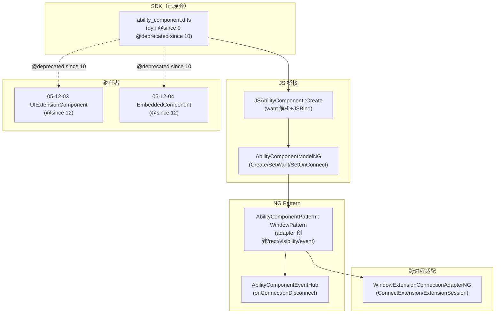
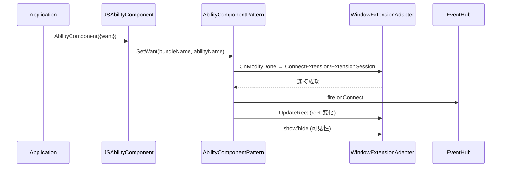

# 架构设计

> 确认目标仓和模块的架构约束、关键设计决策、Spec 拆分方向。

## 设计元数据

| Field | Content |
|-------|---------|
| Design ID | `DESIGN-Func-05-12-02` |
| 关联需求 | 已有能力补录——废弃组件 |
| 关联 Epic | 无 |
| 目标 Feature | Feat-01 AbilityComponent 跨进程能力嵌入（已废弃）（基线） |
| 复杂度 | 标准 |
| 目标版本 | dynamic `@since 9 dynamiconly`（全套 5 SDK 符号）；`@deprecated since 10`（`@useinstead UIExtensionComponent`）；仅 `@internal`+`@syscap`（无 static） |
| Owner | ArkUI SIG |
| 状态 | Baselined（已废弃，存量补录） |

## 需求基线

> 需求基线详见 proposal.md。以下仅列出设计阶段需要额外强调的要点。

| 项 | 补充说明 |
|----|---------|
| 补录而非新增 | 当前实现即规格，可疑行为只能标注为风险/备注 |
| 已废弃 | `@deprecated since 10`，`@useinstead UIExtensionComponent`；继任者 05-12-03（UIExtensionComponent `@since 12`）/ 05-12-04（EmbeddedComponent `@since 12`） |
| 仅系统 API | 无 static `.d.ets`，仅 `@internal`+`@syscap` |
| SceneBoard 行为分支 | `IsSceneBoardEnabled()` → ExtensionSession；否则 legacy `ConnectExtension` |

## 上下文和现状

### 涉及仓和模块

| 仓库 | 补充架构说明 |
|------|-------------|
| `arkui_ace_engine` | AbilityComponent 全部实现（NG Pattern/Model/Layout/EventHub/RenderProperty、JS 桥接、legacy Model）均在本仓 |
| `interface/sdk-js` | `@internal/component/ets/ability_component.d.ts`（`@since 9` `@syscap` `@deprecated since 10`） |

### 调用链层级分析

| 层 | 模块 | 职责 | 修改类型 |
|----|------|------|---------|
| 1. SDK 契约层 | `ability_component.d.ts`（`@internal`+`@syscap`） | `AbilityComponent({want})` + `onConnect`/`onDisconnect` + `@deprecated since 10` | 不修改（外部 API 权威） |
| 2. JS 桥接层 | `frameworks/bridge/declarative_frontend/jsview/js_ability_component.cpp` | `JSAbilityComponent::Create` 解析 want + `JSBind` 绑定 create/onConnect/onDisconnect/legacy 方法 | 现状 |
| 3. NG Model 层 | `frameworks/core/components_ng/pattern/ability_component/ability_component_model_ng.cpp` | `Create`/`SetWant`/`SetOnConnect`/`SetOnDisConnect`/`SetWidth`/`SetHeight` | 现状 |
| 4. NG Pattern 层 | `frameworks/core/components_ng/pattern/ability_component/ability_component_pattern.cpp` | `AbilityComponentPattern : WindowPattern`；adapter 创建（SceneBoard vs legacy）、rect/visibility 同步、event 转发 | 现状 |
| 5. NG EventHub 层 | `ability_component_event_hub.h` | onConnect/onDisconnect 回调存储+fire | 现状 |
| 6. NG Layout 层 | `ability_component_layout_algorithm.cpp` | extension surface 尺寸 | 现状 |
| 7. NG RenderProperty 层 | `ability_component_render_property.h` | render 属性 bag | 现状 |
| 8. Adapter 层 | `WindowExtensionConnectionAdapterNG` | WindowExtension 跨进程连接适配 | 现状 |
| 9. 继任者 | 05-12-03（UIExtensionComponent）/ 05-12-04（EmbeddedComponent） | 现代跨进程/嵌入替代 | 现状（独立 FuncID） |

检查项：
- [x] 调用链每一层都已覆盖（SDK→JS→Model→Pattern→EventHub→Layout→Render→Adapter→继任者）
- [x] 每层职责边界清晰
- [x] 每层修改类型明确（均为「现状」，存量补录）

### 适用架构规则

| Rule ID | 适用原因 | 设计结论 | 验证方式 |
|---------|---------|---------|---------|
| OH-ARCH-LAYERING | SDK→JS→Model→Pattern→Adapter 多层 | 调用方向自顶向下 | 架构评审 |
| OH-ARCH-API-LEVEL | `@since 9` `@deprecated since 10` | System API，已废弃 | API 评审 |
| OH-ARCH-ERROR-LOG | 无独立错误码 | — | UT |

## 不涉及项承接

| 维度 | 设计结论 |
|------|---------|
| 跨进程/SA | 涉及（WindowExtension 跨进程），但属 Adapter 层既有能力 |
| 持久化 | 不涉及 |
| 权限 | `@syscap` 系统 API |
| 多范式兼容 | 仅 dynamic `@internal`+`@syscap`（无 static） |
| 范围边界 | 继任者 05-12-03/04 为独立 FuncID |

## 关键设计决策

| 决策 ID | 问题 | 推荐方案 | 探索过的替代方案 | 取舍理由 | 影响 |
|--------|------|---------|----------------|---------|------|
| ADR-1 | 跨进程嵌入机制 | `AbilityComponentPattern : WindowPattern`，经 `WindowExtensionConnectionAdapterNG` 跨进程连接；SceneBoard 启用时用 `ExtensionSession`，否则 legacy `ConnectExtension` | (a) 独立实现；(b) 仅 ExtensionSession | 兼容旧设备（无 SceneBoard）+ 新设备；adapter 层屏蔽差异 | SceneBoard 行为分支 |
| ADR-2 | 废弃与继任 | `@deprecated since 10` `@useinstead UIExtensionComponent`；继任 05-12-03（`@since 12`）+ 05-12-04（`@since 12`） | (a) 不废弃；(b) 直接移除 | UIExtension/Embedded 提供更丰富的回调（onRemoteReady/onRelease/termination/error）；AbilityComponent 冻结 | 下游应迁移 |

## 设计骨架

| 骨架项 | 目标 | 不包含 | 验证方式 |
|--------|------|--------|---------|
| 构造+want | 固化 AbilityComponent({want}) + want 解析 + 废弃标注 | — | UT + SDK |
| 连接生命周期 | 固化 onConnect/onDisconnect + EventHub | 继任者 05-12-03/04 | UT |
| 跨进程嵌入 | 固化 Pattern OnModifyDone/SceneBoard/rect/visibility/event | Adapter 内部 | UT |

### 骨架 Spec 拆分

| Task ID | 目标 | 受影响文件 | AC |
|---------|------|----------|-----|
| TASK-SKELETON-1 | Feat-01 废弃组件全量基线 | `ability_component_pattern.*`、`js_ability_component.cpp`、`ability_component_model_ng.*` | AC-1.1~3.5 |

## 后续 Task 拆分

| Task ID | 目标 | 受影响文件 | 依赖 |
|---------|------|----------|------|
| T-1 | Feat-01 AbilityComponent 跨进程能力嵌入（已废弃）（基线） | `Feat-01-*-spec.md` + 本 design.md | — |

## API 签名、Kit 与权限

### 新增 API

无新增（存量补录）。

### 变更/废弃 API

| 原有 API | 变更类型 | 新 API | 迁移说明 |
|---------|---------|--------|---------|
| `AbilityComponent({want})` + `onConnect`/`onDisconnect`（dyn `@since 9`） | 废弃（`@deprecated since 10`） | `@useinstead UIExtensionComponent`（05-12-03 `@since 12`） | onConnect→onRemoteReady，onDisconnect→onRelease |

> d.ts：`interface/sdk-js/api/@internal/component/ets/ability_component.d.ts`。Kit：ArkUI（`@syscap`）；SysCap：`SystemCapability.ArkUI.ArkUI.Full`。

## 构建系统影响

无变更（存量补录）。

## 可选设计扩展

### 架构图



### 数据流/控制流

| 步骤 | 调用方 | 被调用方 | 数据/接口 | 说明 |
|------|--------|---------|----------|------|
| 1 | JSAbilityComponent::Create | AbilityComponentModelNG | SetWant | want 下发 |
| 2 | ModelNG | AbilityComponentPattern | Create FrameNode+Pattern | 节点创建 |
| 3 | Pattern OnModifyDone | Adapter | ConnectExtension/ExtensionSession | 跨进程连接 |
| 4 | Pattern | EventHub | fire onConnect | 连接成功 |
| 5 | Pattern | Adapter | UpdateRect | rect 同步 |

### 时序设计



### 数据模型设计

**API 层（TypeScript）**

```typescript
interface AbilityComponentInterface { (value: { want: Want }): AbilityComponentAttribute; }
declare class AbilityComponentAttribute extends CommonMethod {
  onConnect(callback: () => void): AbilityComponentAttribute;
  onDisconnect(callback: () => void): AbilityComponentAttribute;
}
declare const AbilityComponent: AbilityComponentInterface;  // @since 9 @deprecated since 10
```

**Framework 层（C++）**

```cpp
class AbilityComponentPattern : public WindowPattern {
    RefPtr<WindowExtensionConnectionAdapterNG> adapter_;  // 跨进程连接适配
    // OnModifyDone: SceneBoard → ExtensionSession; else → ConnectExtension
    // UpdateRect → adapter_->UpdateRect; visibility → show/hide
};
```

### 测试性设计

| 测试层级 | 测试目标 | Mock 策略 | 验证方式 |
|---------|---------|----------|---------|
| UT | Pattern OnModifyDone/SceneBoard | Mock adapter + ExtensionSession | pattern UT |
| UT | EventHub onConnect/onDisconnect | Mock callback | event_hub UT |
| UT | Model Create/SetWant | Mock pipeline | model UT |

## 详细设计

### 构造与 Want 解析

`AbilityComponent({want})`（`ability_component.d.ts` `@since 9 dynamiconly` `@syscap` `@deprecated since 10`）返回 `AbilityComponentAttribute`（extends `CommonMethod`）。`JSAbilityComponent::Create` 从 JS 对象读 `want.bundleName`+`want.abilityName`，经 `AbilityComponentModel::GetInstance()->SetWant` 下发。仅 `@internal`+`@syscap`（无 static `.d.ets`）。`@deprecated since 10` `@useinstead UIExtensionComponent`，继任 05-12-03/05-12-04。

### 连接生命周期

`AbilityComponentAttribute.onConnect(callback)` / `.onDisconnect(callback)`（`@since 9` `@deprecated since 10`）经 `AbilityComponentEventHub` 存储+fire；`onConnect` `@useinstead UIExtensionComponent#onRemoteReady`，`onDisconnect` `@useinstead #onRelease`。JS 桥接 `JSAbilityComponent::JSBind` 额外绑定 legacy `onReady`/`onDestroy`/`onAbilityCreated`/`onAbilityMoveToFront`/`onAbilityWillRemove`/`width`/`height`——不在当前 `.d.ts` 公开面。

### 跨进程嵌入与 SceneBoard 分支

`AbilityComponentPattern : WindowPattern` 在 `OnModifyDone` 创建 `WindowExtensionConnectionAdapterNG`（`adapter_`）；`IsSceneBoardEnabled()` → `ExtensionSessionManager::RequestExtensionSession`+`SetExtensionSession`；否则 legacy `adapter_->ConnectExtension(host, windowId)`。`UpdateRect`→`adapter_->UpdateRect` 同步 rect；可见性/active/window-show 变化→转发 show/hide；`InitEvent` 转发 touch/mouse/key/focus 到嵌入能力 surface。

## 风险和开放问题

| 项 | 类型 | 影响 | 处理方式 | Owner |
|----|------|------|---------|-------|
| RISK-1 SceneBoard vs legacy `ConnectExtension` 行为分支——设备能力不同导致连接路径差异 | 架构 | 中 | 规格 AC-3.1/AC-3.2/ADR-1 标注；adapter 层屏蔽 | ArkUI SIG |
| RISK-2 已废弃 `@deprecated since 10`，JSBind 额外绑定非公开面方法（onReady/onDestroy 等） | API | 低 | 规格 AC-2.3/R-9 标注；不在 `.d.ts` 公开面 | ArkUI SIG |

## 设计审批

- [x] 需求基线已确认（废弃组件）
- [x] 不涉及项已承接
- [x] 涉及仓和模块职责清楚
- [x] 调用链层级分析完整
- [x] 关键设计决策有理由和影响说明
- [x] 风险和开放问题有 Owner

**结论:** 通过（已废弃，存量补录）
