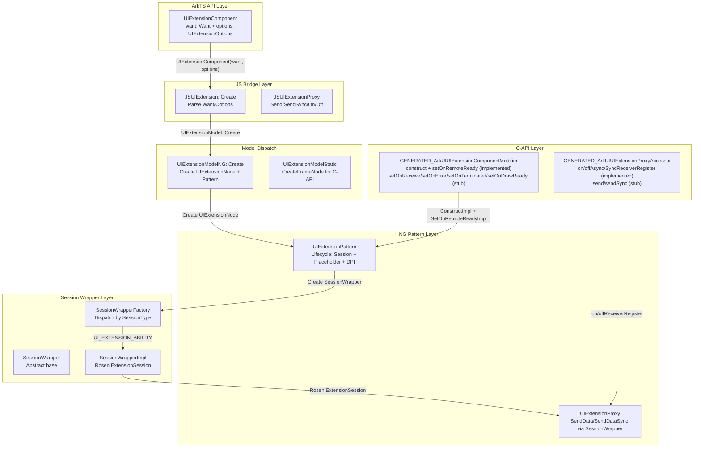
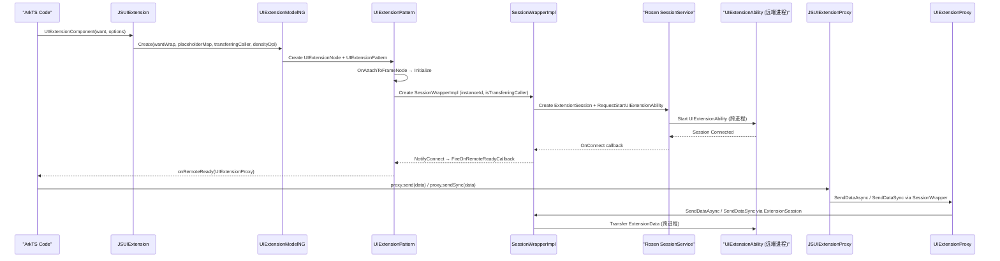

# 架构设计

> UIExtensionComponent 显示嵌入组件——用于在宿主应用页面中嵌入远程 UIExtensionAbility 的 UI 内容，通过 Rosen ExtensionSession 跨进程 Session 机制加载远端 UI，并通过 UIExtensionProxy 提供宿主→远端数据通信能力。与 PluginComponent 使用独立管线 + PluginSubContainer 的模式不同，UIExtensionComponent 依赖 Rosen 窗管 Session 实现跨进程渲染挂载。

## 设计元数据

| 字段 | 内容 |
|------|------|
| Design ID | DESIGN-Func-05-12-03 |
| 关联需求 | 已有能力补录（无独立 requirement.md） |
| 关联 Epic | 无 |
| 目标 Feature | Feat-01 创建/选项/Proxy通信；Feat-02 事件回调；Feat-03 废弃事件与兼容性 |
| 复杂度 | 标准 |
| 目标版本 | API 10+（@systemapi） |
| Owner | ArkUI SIG / 嵌入组件团队 |
| 状态 | Baselined（已有实现补录） |

## 需求基线

| 项 | 补充说明 |
|----|----------|
| 组件创建与 Want 传递 | UIExtensionComponent 接受 `Want + UIExtensionOptions` 创建，Want 定位远端 UIExtensionAbility，Options 配置 isTransferringCaller/placeholder/dpiFollowStrategy/windowModeFollowStrategy |
| 跨进程 Session 机制 | UIExtensionPattern 通过 SessionWrapperImpl 创建 Rosen ExtensionSession，实现跨进程 UI 渲染挂载；SessionType = UI_EXTENSION_ABILITY (1) |
| Proxy 通信 | UIExtensionProxy 在 onRemoteReady 回调中返回，提供 send/sendSync/on/offAsyncReceiverRegister/on/offSyncReceiverRegister 机制 |
| Placeholder 机制 | 支持 PlaceholderType (UNDEFINED/ROTATION/FOLD_TO_EXPAND/INITIAL) 占位节点，在远端连接未建立或尺寸变化时显示 |
| 事件回调 | onRemoteReady(proxy)、onReceive、onResult（废弃 since 12）、onRelease（废弃 since 12）、onError、onTerminated、onDrawReady |
| DPI 策略 | DpiFollowStrategy 枚举：FOLLOW_HOST_DPI (0) / FOLLOW_UI_EXTENSION_ABILITY_DPI (1) |
| 窗口模式策略 | WindowModeFollowStrategy 枚举：FOLLOW_HOST_WINDOW_MODE (0) / FOLLOW_UI_EXTENSION_ABILITY_WINDOW_MODE (1)（since 18） |

## 上下文和现状

### 涉及仓和模块

| 仓库 | 补充架构说明 |
|------|-------------|
| ace_engine/frameworks/core/components_ng/pattern/ui_extension/ui_extension_component/ | NG Pattern 层：UIExtensionPattern（继承 Pattern，非 PlatformPattern）、UIExtensionProxy、UIExtensionModelNG、UIExtensionModelStatic、UIExtensionNode、SessionWrapperImpl |
| ace_engine/frameworks/core/components_ng/pattern/ui_extension/ | 共享基础设施：SessionWrapper 抽象基类、SessionWrapperFactory、UIExtensionManager、UIExtensionConfig、PlatformEventProxy、AccessibilitySessionAdapter |
| ace_engine/frameworks/bridge/declarative_frontend/jsview/ | JS 桥接层：JSUIExtension::Create/OnRemoteReady 等、JSUIExtensionProxy::Send/SendSync/On/Off |
| ace_engine/frameworks/core/interfaces/native/implementation/ | C-API 层（Static modifier）：UIExtensionComponentModifier（ConstructImpl + SetOnRemoteReadyImpl 仅实现，SetOnReceive/OnError/OnTerminated/OnDrawReady 为 stub） |
| ace_engine/frameworks/core/interfaces/native/implementation/ | C-API 层（Proxy accessor）：UIExtensionProxyAccessor（on/offAsync/SyncReceiverRegister 实现，send/sendSync 为 stub） |
| ace_engine/frameworks/core/interfaces/native/generated/interface/ | C-API 生成层：GENERATED_ArkUIUIExtensionComponentModifier + GENERATED_ArkUIUIExtensionProxyAccessor |
| interface/sdk-js/api/@internal/component/ets/ui_extension_component.d.ts | SDK 组件级声明（@systemapi, since 10） |

### 调用链层级分析

| 层 | 模块 | 职责 | 修改类型 |
|----|------|------|----------|
| ArkTS API 层 | `UIExtensionComponent(want, options?)` 声明式调用 | 创建组件、传入 Want + Options | 已有实现 |
| JS Bridge 层 | `JSUIExtension::Create` | 解析 Want/Options，调用 UIExtensionModel::GetInstance()→Create | 已有实现 |
| Model Dispatch 层 | `UIExtensionModelNG::Create` | 创建 UIExtensionNode + UIExtensionPattern，设置 Want/Options/Placeholder/DPI | 已有实现 |
| NG Pattern 层 | `UIExtensionPattern` | 管理生命周期：OnAttachToFrameNode→InitSession→NotifyForeground/Background/Destroy；管理 Placeholder、DPI、WindowMode | 已有实现 |
| Session Wrapper 层 | `SessionWrapperImpl` | 创建 Rosen ExtensionSession，通过 SessionService 跨进程启动 UIExtensionAbility，挂载远端 SurfaceNode | 已有实现 |
| Proxy 层 | `UIExtensionProxy` | 封装 SessionWrapper 的 SendDataAsync/SendDataSync，提供宿主→远端通信 | 已有实现 |
| C-API Static Modifier 层 | `UIExtensionComponentModifier` | ConstructImpl（创建 FrameNode）、SetOnRemoteReadyImpl（仅实现）；SetOnReceive/OnError/OnTerminated/OnDrawReady 为 stub | 已有实现（部分 stub） |
| C-API Proxy Accessor 层 | `UIExtensionProxyAccessor` | on/offAsync/SyncReceiverRegister（仅实现）；send/sendSync 为 stub | 已有实现（部分 stub） |

### 适用架构规则

| Rule ID | 适用原因 | 设计结论 | 验证方式 |
|---------|----------|----------|----------|
| OH-ARCH-LAYERING | 跨层调用：ArkTS → JS Bridge → Model → Pattern → SessionWrapper → Rosen Session | 调用方向严格自上而下；SessionWrapper 不反向依赖宿主 Pattern | 代码评审 |
| OH-ARCH-IPC-SAF | UIExtensionProxy 通过 ExtensionSession 实现跨进程 send/sendSync | IPC 通道为 Rosen ExtensionSession → SessionService，ace_engine 不定义 SAF | 集成测试 |
| OH-ARCH-API-LEVEL | 组件级 API 为 @systemapi（since 10），Options 子项 since 11/12/14/18 | 多版本 API 分别在 d.ts 中声明，权限边界明确 | API 评审 |
| OH-ARCH-SUBSYSTEM | UIExtensionComponent 跨子系统依赖：ability_runtime（Want/AbilityManager）、window_manager（Rosen Session）、ipc | 依赖通过 SessionWrapper 抽象层桥接，Pattern 不直接引用系统服务头文件 | 依赖检查 |
| OH-ARCH-C-API-STUB | C-API Static modifier 部分方法为 stub（LOGE 不支持） | stub 方法不修改 FrameNode 状态，返回空值；仅 SetOnRemoteReady 和 on/offReceiverRegister 为实现 | C-API 单测 |

## 不涉及项承接

| 维度 | 设计结论 |
|------|----------|
| 性能 | 不量化指标；SessionWrapperImpl 创建 Rosen Session 有固有的初始化延迟 |
| 安全与权限 | 组件级 @systemapi 限制系统应用使用；EmbeddedComponent 为 @atomicservice 替代 |
| 兼容性 | onResult/onRelease 废弃（since 12），由 onTerminated/onError 替代；Feat-03 覆盖 |
| 持久化 | 无持久化需求；Want 为一次性传递 |
| 构建与部件 | 无新部件引入；已有 ui_extension BUILD.gn target |
| SecurityUIExtension | 本 Feat 不覆盖 SecurityUIExtensionPattern/SecurityUIExtensionProxy，由同目录 security_ui_extension_component/ 子目录独立管理 |
| Dynamic/Isolated Component | 本 Feat 不覆盖 DynamicComponent/IsolatedComponent，由同目录 dynamic_component/ 和 isolated_component/ 子目录独立管理 |

## 关键设计决策

| 决策 ID | 问题 | 推荐方案 | 探索过的替代方案 | 取舍理由 | 影响 |
|---------|------|----------|-----------------|----------|------|
| ADR-FX-1 | UIExtension 渲染为何使用 Rosen Session 而非独立管线 | SessionWrapperImpl 创建 Rosen ExtensionSession，通过 SessionService 跨进程挂载远端 SurfaceNode | PluginComponent 的独立 PipelineContext + PluginFrontend 模式 | UIExtensionAbility 运行在独立进程，其窗口由 Rosen 管理；独立管线模式无法接入窗口管理系统的事件/焦点/避让机制 | session_wrapper_impl.h |
| ADR-FX-2 | UIExtensionPattern 为何继承 Pattern 而非 PlatformPattern | UIExtensionPattern 继承 Pattern（非 PlatformPattern）；SecurityUIExtensionPattern 继承 PlatformPattern | 统一继承 PlatformPattern | UIExtensionComponent 需要完整的 NG Pattern 生命周期（OnModifyDone/OnAttachToFrameNode/OnDetachFromFrameNode），PlatformPattern 为简化生命周期基类 | ui_extension_pattern.h:102 |
| ADR-FX-3 | C-API Static modifier 为何仅实现 setOnRemoteReady 而其他事件为 stub | SetOnRemoteReadyImpl 有完整实现（构造 UIExtensionProxyPeer 并传递到 ArkTS callback）；SetOnReceive/OnError/OnTerminated/OnDrawReady 为 stub（LOGE "not supported"） | 完整实现所有事件回调 | onRemoteReady 是最关键的初始化回调，Proxy 通信依赖其返回的 UIExtensionProxy；其余事件回调在 C-API 场景下的需求优先级较低，后续 Feat 可逐步补齐 | ui_extension_component_modifier.cpp:68-111 |
| ADR-FX-4 | UIExtensionProxyAccessor 的 send/sendSync 为何为 stub | SendImpl 和 SendSyncImpl 仅输出 LOGE "not supported"，不实际调用 SessionWrapper 通信 | 完整实现 send/sendSync | C-API Proxy 的 send/sendSync 需要完整的 WantParams 序列化/反序列化链路，当前 C-API Converter 对 WantParams 的支持尚未完备；on/offReceiverRegister 是优先级更高的通信通道 | ui_extension_proxy_accessor.cpp:42-51 |
| ADR-FX-5 | Placeholder 机制为何使用 PlaceholderType 枚举而非单一 placeholder 属性 | PlaceholderType (NONE/UNDEFINED/ROTATION/FOLD_TO_EXPAND/INITIAL) 对应不同尺寸变化场景，通过 placeholderMap 映射到不同占位节点 | 单一 ComponentContent placeholder | 折叠屏/旋转等场景需要显示不同类型的占位内容；单一 placeholder 无法区分加载/旋转/折叠等状态 | ui_extension_config.h:24-30, ui_extension_pattern.h:115-118 |

## 设计骨架

### 骨架范围

| 骨架项 | 目标 | 不包含 | 验证方式 |
|--------|------|--------|----------|
| 组件创建与 Want/Options | 锁定 UIExtensionComponent 创建流程、Want/Options 传递、SessionWrapperImpl 初始化 | SecurityUIExtension / DynamicComponent / IsolatedComponent | 代码评审 |
| UIExtensionProxy 通信 | 锁定 send/sendSync/on/offReceiverRegister 行为规格 | Proxy 的 C-API stub 补齐（后续 Feat） | 代码评审 |
| Placeholder/DPI/WindowMode 机制 | 锁定 PlaceholderType 占位节点挂载/移除、DpiFollowStrategy/WindowModeFollowStrategy 配置传递 | areaChangePlaceholder (since 14) | 代码评审 |
| 事件回调 | 锁定 onRemoteReady/onReceive/onError/onTerminated/onDrawReady 触发条件 | 废弃事件 onResult/onRelease（Feat-03） | 代码评审 |
| C-API 双通道 | 锁定 Static modifier 覆盖范围和 Proxy accessor 覆盖范围，标注 stub 状态 | Dynamic modifier（UIExtensionComponent 无 Dynamic modifier） | C-API 单测 |

### 骨架 Spec 拆分

| Task ID | 目标 | 受影响文件 | AC |
|---------|------|------------|----|
| TASK-SKELETON-1 | UIExtensionComponent 创建/选项/Proxy 通信 | ui_extension_pattern.cpp, ui_extension_model_ng.cpp, js_ui_extension.cpp, ui_extension_component_modifier.cpp, ui_extension_proxy_accessor.cpp | Feat-01 AC |
| TASK-SKELETON-2 | 事件回调（onRemoteReady/onReceive/onError/onTerminated/onDrawReady） | ui_extension_pattern.cpp, ui_extension_model_ng.cpp, js_ui_extension.cpp | Feat-02 AC |
| TASK-SKELETON-3 | 废弃事件 onResult/onRelease 兼容性规格 | ui_extension_pattern.cpp, ui_extension_component.d.ts | Feat-03 AC |

## 后续 Task 拆分

| Task ID | 目标 | 受影响文件 | 依赖 |
|---------|------|------------|------|
| TASK-1 | UIExtensionComponent 创建/选项/Proxy 通信 | Feat-01-ui-extension-creation-proxy-spec.md | 无（基线） |
| TASK-2 | 事件回调（onRemoteReady/onReceive/onError/onTerminated/onDrawReady） | Feat-02-ui-extension-event-callbacks-spec.md | TASK-1 |
| TASK-3 | 废弃事件与兼容性（onResult/onRelease） | Feat-03-ui-extension-deprecated-compat-spec.md | TASK-2 |

## API 签名、Kit 与权限

### 新增 API

| API 签名 | 类型 | Kit | d.ts 位置 | 权限要求 | SysCap |
|----------|------|-----|-----------|----------|--------|
| `UIExtensionComponent(want: Want, options?: UIExtensionOptions)` | System | ArkUI | `@internal/component/ets/ui_extension_component.d.ts` | @systemapi | SystemCapability.ArkUI.ArkUI.Full |
| `UIExtensionOptions { isTransferringCaller?, placeholder?, dpiFollowStrategy?, areaChangePlaceholder?, windowModeFollowStrategy? }` | System | ArkUI | `@internal/component/ets/ui_extension_component.d.ts` | @systemapi | SystemCapability.ArkUI.ArkUI.Full |
| `onRemoteReady(callback: Callback<UIExtensionProxy>)` | System | ArkUI | `@internal/component/ets/ui_extension_component.d.ts` | @systemapi | SystemCapability.ArkUI.ArkUI.Full |
| `onReceive(callback: ReceiveCallback)` | System | ArkUI | `@internal/component/ets/ui_extension_component.d.ts` | @systemapi | SystemCapability.ArkUI.ArkUI.Full |
| `onResult(callback: Callback<{code, want?}>)` | System (废弃) | ArkUI | `@internal/component/ets/ui_extension_component.d.ts` | @systemapi | SystemCapability.ArkUI.ArkUI.Full |
| `onRelease(callback: Callback<number>)` | System (废弃) | ArkUI | `@internal/component/ets/ui_extension_component.d.ts` | @systemapi | SystemCapability.ArkUI.ArkUI.Full |
| `onError(callback: ErrorCallback)` | System | ArkUI | `@internal/component/ets/ui_extension_component.d.ts` | @systemapi | SystemCapability.ArkUI.ArkUI.Full |
| `onTerminated(callback: Callback<TerminationInfo>)` | System | ArkUI | `@internal/component/ets/ui_extension_component.d.ts` | @systemapi | SystemCapability.ArkUI.ArkUI.Full |
| `onDrawReady(callback: Callback<void>)` | System | ArkUI | `@internal/component/ets/ui_extension_component.d.ts` | @systemapi | SystemCapability.ArkUI.ArkUI.Full |
| `UIExtensionProxy { send, sendSync, on/off('asyncReceiverRegister'), on/off('syncReceiverRegister') }` | System | ArkUI | `@internal/component/ets/ui_extension_component.d.ts` | @systemapi | SystemCapability.ArkUI.ArkUI.Full |
| `DpiFollowStrategy { FOLLOW_HOST_DPI=0, FOLLOW_UI_EXTENSION_ABILITY_DPI=1 }` | System | ArkUI | `@internal/component/ets/ui_extension_component.d.ts` | @systemapi | SystemCapability.ArkUI.ArkUI.Full |
| `WindowModeFollowStrategy { FOLLOW_HOST_WINDOW_MODE=0, FOLLOW_UI_EXTENSION_ABILITY_WINDOW_MODE=1 }` | System | ArkUI | `@internal/component/ets/ui_extension_component.d.ts` | @systemapi | SystemCapability.ArkUI.ArkUI.Full |
| `TerminationInfo { code: number, want?: Want }` | System | ArkUI | `@internal/component/ets/ui_extension_component.d.ts` | @systemapi | SystemCapability.ArkUI.ArkUI.Full |

### 变更/废弃 API

| API 签名 | 变更类型 | 废弃版本 | 替代 API | 说明 |
|----------|----------|----------|----------|------|
| `onResult(callback)` | 废弃 | since 12 | `onTerminated` | onResult 仅返回 {code, want?}，onTerminated 返回 TerminationInfo 更完整 |
| `onRelease(callback)` | 废弃 | since 12 | `onTerminated` + `onError` | onRelease 仅区分正常/异常断连，onTerminated 覆盖正常终止，onError 覆盖异常 |

## 构建系统影响

### BUILD.gn 变更

```text
文件: frameworks/core/components_ng/pattern/ui_extension/BUILD.gn
变更说明: 定义 ui_extension_pattern target（ui_extension_model_ng.cpp, ui_extension_model_static.cpp, ui_extension_pattern.cpp, ui_extension_proxy.cpp, session_wrapper_impl.cpp, ui_extension_node.cpp 等）
依赖: ability_base:want, ability_runtime:app_manager, graphic_2d:rosen_session, ipc, window_manager
编译开关: WINDOW_SCENE_SUPPORTED（控制 Session 路径编译/空壳编译）
```

### bundle.json 变更

无新增 component 依赖。

## 可选设计扩展

### 架构图



### 时序设计



### 数据模型设计

**SDK 层 TypeScript 类型：**
```typescript
interface UIExtensionOptions {
  isTransferringCaller?: boolean;       // (@since 11)
  placeholder?: ComponentContent;       // (@since 12)
  areaChangePlaceholder?: Record<string, ComponentContent>;  // (@since 14)
  dpiFollowStrategy?: DpiFollowStrategy;  // (@since 12)
  windowModeFollowStrategy?: WindowModeFollowStrategy;  // (@since 18)
}

enum DpiFollowStrategy {
  FOLLOW_HOST_DPI = 0,
  FOLLOW_UI_EXTENSION_ABILITY_DPI = 1,
}

enum WindowModeFollowStrategy {
  FOLLOW_HOST_WINDOW_MODE = 0,
  FOLLOW_UI_EXTENSION_ABILITY_WINDOW_MODE = 1,
}

interface UIExtensionProxy {
  send(data: Record<string, Object>): void;
  sendSync(data: Record<string, Object>): Record<string, Object>;
  on(type: 'asyncReceiverRegister', callback: Callback<UIExtensionProxy>): void;
  on(type: 'syncReceiverRegister', callback: Callback<UIExtensionProxy>): void;
  off(type: 'asyncReceiverRegister', callback?: Callback<UIExtensionProxy>): void;
  off(type: 'syncReceiverRegister', callback?: Callback<UIExtensionProxy>): void;
}

interface TerminationInfo {
  code: number;
  want?: Want;
}
```

**C++ 层核心数据结构：**

| 结构 | 位置 | 关键字段 |
|------|------|----------|
| `UIExtensionPattern` | `ui_extension_pattern.h` | isTransferringCaller_, isModal_, placeholderMap_, densityDpi_, isWindowModeFollowHost_, curPlaceholderType_, sessionWrapper_, onRemoteReadyCallback_, onReleaseCallback_, onResultCallback_, onTerminatedCallback_, onReceiveCallback_, onErrorCallback_, onDrawReadyCallback_, usage_ |
| `UIExtensionProxy` | `ui_extension_proxy.h` | sessionWrapper_, pattern_ (WeakPtr) |
| `SessionWrapperImpl` | `session_wrapper_impl.h` | hostPattern_ (WeakPtr), instanceId_, isTransferringCaller_, session_ (sptr<ExtensionSession>), sessionType_ |
| `SessionViewportConfig` | `ui_extension_pattern.h` | isDensityFollowHost_, density_, displayId_, orientation_, transform_ |
| `PlaceholderType` | `ui_extension_config.h` | NONE=0, UNDEFINED=1, ROTATION=2, FOLD_TO_EXPAND=3, INITIAL=4 |
| `UIExtensionUsage` | `session_wrapper.h` | MODAL=0, EMBEDDED=1, CONSTRAINED_EMBEDDED=2, PREVIEW_EMBEDDED=3 |
| `SessionType` | `session_wrapper.h` | UI_EXTENSION_ABILITY=1 |

## 详细设计

### UIExtensionPattern 生命周期管理

**OnAttachToFrameNode** (`ui_extension_pattern.cpp`):
- 注册 WindowStateChanged 回调到 PipelineContext
- 初始化 SessionWrapper（通过 SessionWrapperFactory::Create）
- 设置 Placeholder 节点挂载

**OnModifyDone** (`ui_extension_pattern.cpp`):
- 注册 touch/mouse/hover/key 事件到对应 Hub
- 初始化 Accessibility 适配
- 注册 VisibleAreaChange 监听

**NotifyForeground/Background/Destroy** (`ui_extension_pattern.cpp`):
- 通过 SessionWrapper 调用 ExtensionSession 的 Foreground/Background/Destroy
- AbilityState 状态机：NONE → FOREGROUND → BACKGROUND → DESTRUCTION

**SessionWrapperImpl 创建流程** (`session_wrapper_impl.cpp`):
1. 创建 Rosen ExtensionSession（跨进程 Session 对象）
2. 通过 SessionService::RequestStartUIExtensionAbility 启动远端 UIExtensionAbility
3. 注册 OnConnect/OnDisconnect/OnRelease/OnTransferAbilityResult/OnTransferExtensionData/OnRemoteReady 回调
4. 挂载 ExtensionSession 的 SurfaceNode 到宿主 UIExtensionNode 下

**Placeholder 机制** (`ui_extension_pattern.cpp`):
- MountPlaceholderNode(PlaceholderType)：根据 PlaceholderType 从 placeholderMap_ 取对应 FrameNode 挂载
- RemovePlaceholderNode()：连接建立后移除占位节点
- curPlaceholderType_ 状态追踪：NONE → UNDEFINED/ROTATION/FOLD_TO_EXPAND/INITIAL
- PostDelayRemovePlaceholder：延迟移除防止闪烁

### UIExtensionProxy 通信

**SendData/SendDataAsync** (`ui_extension_proxy.cpp`):
- 通过 SessionWrapper::SendDataAsync 将 WantParams 异步发送到远端 UIExtensionAbility
- 不等待回复

**SendDataSync/SendDataSyncReply** (`ui_extension_proxy.cpp`):
- 通过 SessionWrapper::SendDataSync 同步发送 WantParams，等待远端回复 WantParams
- 返回 int32_t 错误码

**on/offReceiverRegister** (`js_ui_extension.cpp → ui_extension_pattern.cpp`):
- onAsyncReceiverRegister/onSyncReceiverRegister：注册回调列表，远端 UIExtensionAbility 注册 async/sync 数据接收回调时触发
- offAsyncReceiverRegister/offSyncReceiverRegister：移除指定回调或清空列表
- C-API 层通过 UIExtensionProxyAccessor 的 on/offAsync/SyncReceiverRegisterImpl 实现

### C-API 静态 Modifier

**ConstructImpl** (`ui_extension_component_modifier.cpp`):
- UIExtensionStatic::CreateFrameNode(id) → 创建 UIExtensionNode（UIExtensionPattern）
- WINDOW_SCENE_SUPPORTED 控制编译；PREVIEW 模式使用 Placeholder 节点

**SetOnRemoteReadyImpl** (`ui_extension_component_modifier.cpp`):
- 完整实现：构造 UIExtensionProxyPeer → 设置 Proxy → 通过 CallbackHelper 调用 ArkTS callback

**Stub 方法** (`ui_extension_component_modifier.cpp`):
- SetOnReceiveImpl: LOGE "not supported"
- SetOnErrorImpl: LOGE "not supported"
- SetOnTerminatedImpl: LOGE "not supported"
- SetOnDrawReadyImpl: LOGE "not supported"

### C-API Proxy Accessor

**Implemented** (`ui_extension_proxy_accessor.cpp`):
- OnAsyncReceiverRegisterImpl/OnSyncReceiverRegisterImpl：添加回调到 peer 列表，调用 Pattern::SetAsyncCallbacks/SetSyncCallbacks
- OffAsyncReceiverRegisterImpl/OffSyncReceiverRegisterImpl：从 peer 列表删除回调

**Stub** (`ui_extension_proxy_accessor.cpp`):
- SendImpl: LOGE "not supported"
- SendSyncImpl: LOGE "not supported"，返回空 Map

## 风险和开放问题

| 项 | 类型 | 影响 | 处理方式 | Owner |
|----|------|------|----------|-------|
| UIExtensionComponent 为 @systemapi 组件 | API | 中 | 仅系统应用可使用；EmbeddedComponent 为 @atomicservice 替代 | ArkUI SIG |
| C-API Static modifier 多个事件回调为 stub | API | 中 | 当前仅 setOnRemoteReady 实现，其余事件 stub；后续 Feat 逐步补齐 | ArkUI SIG |
| C-API ProxyAccessor send/sendSync 为 stub | API | 中 | C-API 场景下无法通过 Proxy 发送数据；仅 on/offReceiverRegister 可用 | ArkUI SIG |
| SessionWrapperImpl 创建 Session 有初始化延迟 | 架构 | 低 | 不量化指标，标注为已知特性 | ArkUI SIG |
| onResult/onRelease 废弃但仍保留实现代码 | 兼容性 | 低 | 1.2 兼容需要保留；标注为 deprecated，由 onTerminated/onError 替代 | ArkUI SIG |
| WINDOW_SCENE_SUPPORTED 编译开关影响完整编译 | 构建 | 低 | 不支持时编译为空壳；Preview 模式使用 Placeholder | ArkUI SIG |

## 设计审批

- [x] 需求基线已确认，设计覆盖 P0/P1 AC
- [x] 不涉及项已承接，N/A 和展开项都有结论
- [x] 涉及仓和模块职责清楚
- [x] 调用链层级分析完整，每层覆盖到位
- [x] 适用架构规则已识别并形成设计结论
- [x] 分层和子系统边界合规
- [x] API 变更有签名、权限、错误码和兼容性说明
- [x] BUILD.gn/bundle.json 影响明确
- [x] 设计输出和后续 Task 拆分明确
- [x] 关键设计决策有理由和影响说明
- [x] 风险和开放问题有 Owner

**结论:** 通过（已有实现补录）
