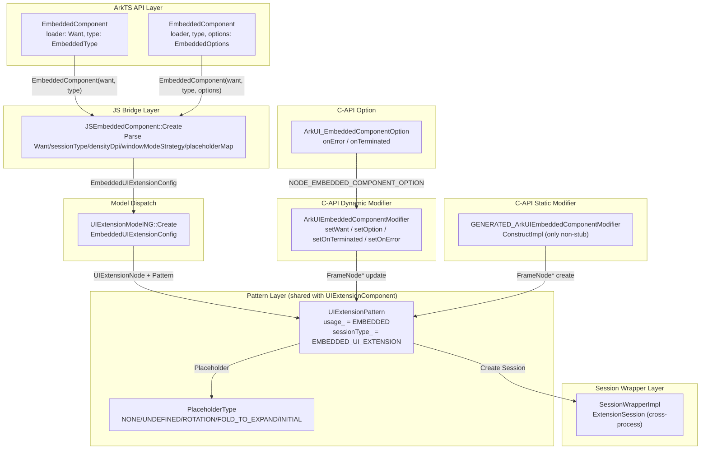
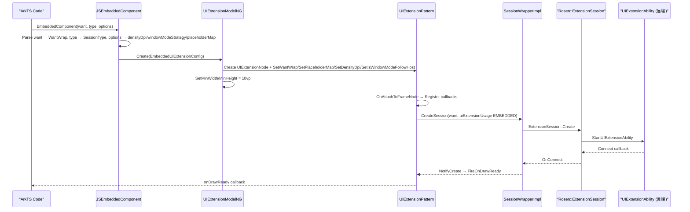

# 架构设计

> EmbeddedComponent 嵌入式组件——用于在宿主应用页面中嵌入 UIExtensionAbility 的 UI 内容，通过 SessionWrapperImpl 创建跨进程 ExtensionSession 实现基于 session 的 UI 渲染，与 UIExtensionComponent 共享 UIExtensionPattern 但以 UIExtensionUsage::EMBEDDED 区分嵌入行为。相比 UIExtensionComponent（@systemapi），EmbeddedComponent 为 @atomicservice，面向三方应用开放。

## 设计元数据

| 字段 | 内容 |
|------|------|
| Design ID | DESIGN-Func-05-12-04 |
| 关联需求 | 已有能力补录（无独立 requirement.md） |
| 关联 Epic | 无 |
| 目标 Feature | Feat-01 EmbeddedComponent创建/选项/DPI策略；Feat-02 事件回调 |
| 复杂度 | 标准 |
| 目标版本 | API 12+（@atomicservice @stagemodelonly），选项增强 API 26.0.0 |
| Owner | ArkUI SIG / 嵌入组件团队 |
| 状态 | Baselined（已有实现补录） |

## 需求基线

| 项 | 补充说明 |
|----|----------|
| 组件创建与 Want | EmbeddedComponent 接受 `Want + EmbeddedType` 创建（@since 12），通过 EmbeddedUIExtensionConfig 传入 WantWrap 和 SessionType=EMBEDDED_UI_EXTENSION |
| 选项增强 | API 26.0.0 增加 EmbeddedOptions：placeholder、areaChangePlaceholder、dpiFollowStrategy、windowModeFollowStrategy |
| DPI 跟随策略 | EmbeddedDpiFollowStrategy { FOLLOW_HOST_DPI = 0, FOLLOW_UI_EXTENSION_ABILITY_DPI = 1 }，densityDpi=true 表示跟随宿主 |
| 窗口模式跟随策略 | EmbeddedWindowModeFollowStrategy { FOLLOW_HOST_WINDOW_MODE = 0, FOLLOW_UI_EXTENSION_ABILITY_WINDOW_MODE = 1 } |
| Placeholder 机制 | placeholder（INITIAL）和 areaChangePlaceholder（UNDEFINED/ROTATION/FOLD_TO_EXPAND）通过 PlaceholderType 映射到 FrameNode |
| 事件回调 | onTerminated(TerminationInfo)、onError(ErrorCallback)、onDrawReady(VoidCallback) |
| 最小尺寸约束 | 组件默认尺寸 10vp × 10vp，强制最小尺寸 10vp × 10vp |
| @atomicservice | 面向三方应用开放（与 UIExtensionComponent 的 @systemapi 关键区别） |

## 上下文和现状

### 涉及仓和模块

| 仓库 | 补充架构说明 |
|------|-------------|
| ace_engine/frameworks/core/components_ng/pattern/ui_extension/ui_extension_component/ | Pattern 层：UIExtensionPattern（EMBEDDED 用法）、UIExtensionModelNG（EmbeddedUIExtensionConfig）、UIExtensionAdapter、SessionWrapperImpl、UIExtensionModelStatic |
| ace_engine/frameworks/core/components_ng/pattern/ui_extension/ui_extension_config.h | 配置定义：PlaceholderType、UIExtCallbackEventId |
| ace_engine/frameworks/core/components_ng/pattern/ui_extension/session_wrapper.h | Session 层：SessionType::EMBEDDED_UI_EXTENSION=0、UIExtensionUsage::EMBEDDED=1、SessionWrapper 抽象 |
| ace_engine/frameworks/core/components_ng/pattern/ui_extension/ui_extension_model.h | Model 层：UIExtensionModel::Create(EmbeddedUIExtensionConfig)、EmbeddedUIExtensionConfig 定义 |
| ace_engine/frameworks/bridge/declarative_frontend/jsview/ | JS 桥接层：JSEmbeddedComponent（Create/OnTerminated/OnError/JsOnDrawReady） |
| ace_engine/frameworks/bridge/declarative_frontend/engine/jsi/nativeModule/ | ArkTS Dynamic Bridge：EmbeddedComponentBridge（SetOnTerminated/SetOnError） |
| ace_engine/interfaces/native/node_attributes/embedded_component.h | C-API 层：OH_ArkUI_EmbeddedComponentOption_Create/Dispose/SetOnError/SetOnTerminated @since 20 |
| ace_engine/interfaces/native/native_node.h | C-API NDK：ARKUI_NODE_EMBEDDED_COMPONENT、NODE_EMBEDDED_COMPONENT_WANT/OPTION @since 20 |
| ace_engine/interfaces/native/node/embeddedComponent_modifier.cpp | C-API Dynamic modifier：ArkUIEmbeddedComponentModifier { setWant, setOption, setOnTerminated, setOnError } |
| ace_engine/frameworks/core/interfaces/native/implementation/embedded_component_modifier.cpp | C-API Static modifier：GENERATED_ArkUIEmbeddedComponentModifier — 仅 ConstructImpl 有效，其余为 stub（LOGE "not supported"） |
| ace_engine/frameworks/core/components_ng/pattern/ui_extension/ui_extension_component/ui_extension_model_static.h | 静态范式适配：UIExtensionStatic::CreateFrameNode(SessionType::EMBEDDED_UI_EXTENSION) |

### 调用链层级分析

| 层 | 模块 | 职责 | 修改类型 |
|----|------|------|----------|
| ArkTS API 层 | `EmbeddedComponent(loader, type)` / `EmbeddedComponent(loader, type, options)` 声明式调用 | 创建组件、传入 Want/EmbeddedType/EmbeddedOptions | 已有实现 |
| JS Bridge 层 | `js_embedded_component.cpp` JSEmbeddedComponent::Create | 解析 Want/sessionType/dpiFollowStrategy/windowModeFollowStrategy/placeholderMap，构建 EmbeddedUIExtensionConfig | 已有实现 |
| Model Dispatch 层 | `UIExtensionModel::GetInstance()` → `UIExtensionModelNG::Create(EmbeddedUIExtensionConfig)` | 创建 UIExtensionNode（tag=EMBEDDED_COMPONENT_ETS_TAG），设置 Pattern 属性 | 已有实现 |
| Pattern 层 | `UIExtensionPattern`（usage_=EMBEDDED, sessionType_=EMBEDDED_UI_EXTENSION） | 管理生命周期：session 创建/销毁、placeholder 挂载/移除、回调注册/触发 | 共享 UIExtensionComponent |
| Session Wrapper 层 | `SessionWrapperImpl` | 创建跨进程 ExtensionSession，通过 Rosen::Session 实现渲染面挂载和事件分发 | 共享 UIExtensionComponent |
| C-API Dynamic 层 | `embeddedComponent_modifier.cpp` ArkUIEmbeddedComponentModifier | setWant / setOption（含 onError/onTerminated）/ setOnTerminated / setOnError | 已有实现 |
| C-API Static 层 | `embedded_component_modifier.cpp` GENERATED_ArkUIEmbeddedComponentModifier | 仅 ConstructImpl 创建 FrameNode，其他方法为 stub | 已有实现（stub） |
| ArkTS Dynamic Bridge | `arkts_native_embedded_component_bridge.cpp` EmbeddedComponentBridge | SetOnTerminated / ResetOnTerminated / SetOnError / ResetOnError | 已有实现 |
| C-API Option 层 | `embeddedComponent_option.h` ArkUI_EmbeddedComponentOption | 结构体 { onError*, onTerminated* } 用于 NODE_EMBEDDED_COMPONENT_OPTION 属性 | 已有实现 |

### 适用架构规则

| Rule ID | 适用原因 | 设计结论 | 验证方式 |
|---------|----------|----------|----------|
| OH-ARCH-LAYERING | 跨层调用：ArkTS → JS Bridge → Model → Pattern → SessionWrapper | 调用方向自上而下；SessionWrapper 通过 Rosen::ExtensionSession 与远端通信 | 代码评审 |
| OH-ARCH-IPC-SAF | SessionWrapperImpl 通过 ExtensionSession 实现跨进程渲染面和事件通信 | 依赖 Rosen::scene_session 和 ability_runtime:abilitykit_native | 集成测试 |
| OH-ARCH-API-LEVEL | 组件级 API 为 @atomicservice @stagemodelonly（since 12），选项增强为 @since 26.0.0 | 三方应用可直接使用；C-API NDK 为 @since 20 | API 评审 |
| OH-ARCH-SUBSYSTEM | EmbeddedComponent 跨子系统依赖：ability_runtime（AppManager）、window_manager（Rosen::Session）、ipc | 依赖通过 session_wrapper_factory 和 adapter 层桥接 | 依赖检查 |
| OH-ARCH-PATTERN-SHARE | EmbeddedComponent 与 UIExtensionComponent 共享 UIExtensionPattern | 通过 UIExtensionUsage::EMBEDDED 区分嵌入行为；UIExtensionPattern 按 sessionType 和 usage_ 分支处理 | 代码评审 |

## 不涉及项承接

| 维度 | 设计结论 |
|------|----------|
| 性能 | 不量化指标；跨进程 Session 创建有固有延迟 |
| 安全与权限 | @atomicservice 面向三方应用开放；不限制为系统应用 |
| 兼容性 | EmbeddedComponent 仅支持 Stage 模型（@stagemodelonly）；FA 模型不适用 |
| 持久化 | 无持久化需求；Want 为一次性传递 |
| 构建与部件 | 无新部件引入；使用已有 ui_extension_pattern_ng 和 libace_ndk BUILD.gn target |

## 关键设计决策

| 决策 ID | 问题 | 推荐方案 | 探索过的替代方案 | 取舍理由 | 影响 |
|---------|------|----------|-----------------|----------|------|
| ADR-1 | EmbeddedComponent 为何与 UIExtensionComponent 共享 Pattern | 使用同一 UIExtensionPattern，通过 UIExtensionUsage::EMBEDDED 区分行为 | 独立创建 EmbeddedPattern | 两者核心行为（session 创建/销毁、placeholder、回调）一致，区分仅在 usage 标记和最小尺寸约束 | ui_extension_pattern.h:498 |
| ADR-2 | C-API Static modifier 为何全部为 stub（仅 ConstructImpl 有效） | GENERATED_ArkUIEmbeddedComponentModifier 的 SetEmbeddedComponentOptions/OnTerminated/OnError/OnDrawReady 均输出 LOGE "not supported" | 实现 Static modifier 完整功能 | Static 范式（Arkoala）尚未完整支持 EmbeddedComponent 的选项和回调配置，当前仅提供节点创建入口 | embedded_component_modifier.cpp:44-78 |
| ADR-3 | DPI 策略为何用 bool densityDpi 而非枚举 | JSEmbeddedComponent::Create 将 EmbeddedDpiFollowStrategy.FOLLOW_HOST_DPI(0) 映射为 densityDpi=true，FOLLOW_UI_EXTENSION_ABILITY_DPI(1) 映射为 false | C++ 层使用 EmbeddedDpiFollowStrategy 枚举 | Pattern 层已使用 bool densityDpi（isDensityFollowHost 语义），枚举仅在 SDK 层存在；C++ 层保持 bool 保持与 UIExtensionPattern 一致 | js_embedded_component.cpp:166 |
| ADR-4 | EmbeddedComponent 为何强制最小尺寸 10vp × 10vp | JSEmbeddedComponent::Create 和 UIExtensionModelStatic::CreateEmbeddedComponent 均设置 minWidth/minHeight=10vp | 不设最小尺寸 | 嵌入式组件需要最小可见区域保证 Extension 内容可展示；10vp 为保证最小可见度的经验值 | js_embedded_component.cpp:42-43, ui_extension_model_static.cpp:25-26 |
| ADR-5 | C-API 为何拆分 Dynamic 和 Static 两套 modifier | Dynamic modifier（ArkUIEmbeddedComponentModifier）覆盖 setWant/setOption/setOnTerminated/setOnError，运行时操作已有 FrameNode；Static modifier 仅覆盖 ConstructImpl | 合并为单一 modifier | Dynamic modifier 操作已有 FrameNode*，Static modifier 需 ConstructImpl 创建新节点，职责不同 | embeddedComponent_modifier.cpp, embedded_component_modifier.cpp |
| ADR-6 | Placeholder 机制为何使用 map<PlaceholderType, FrameNode> | 支持 INITIAL（默认 placeholder）、UNDEFINED/ROTATION/FOLD_TO_EXPAND（areaChangePlaceholder）多种场景类型 | 仅支持单一 placeholderNode | 嵌入式组件在不同状态（旋转、折叠）下需要不同 placeholder 内容；UIExtensionPattern 通过 IsCanMountPlaceholder 判断挂载优先级 | ui_extension_config.h:24-30, ui_extension_model.h:47 |

## 设计骨架

### 骨架范围

| 骨架项 | 目标 | 不包含 | 验证方式 |
|--------|------|--------|----------|
| 组件创建与 Want | 锁定 EmbeddedComponent 创建流程、Want/SessionType 传递、EmbeddedUIExtensionConfig 构建 | DynamicComponent/IsolatedComponent 其他 sessionType | 代码评审 |
| 选项/DPI/窗口模式策略 | 锁定 dpiFollowStrategy/windowModeFollowStrategy 到 Pattern 层 densityDpi/isWindowModeFollowHost 的映射 | SDK 层 EmbeddedType/EmbeddedDpiFollowStrategy 枚举定义（在 SDK repo） | 代码评审 |
| Placeholder 机制 | 锁定 placeholder/areaChangePlaceholder 到 placeholderMap 的解析和 UIExtensionPattern 的挂载逻辑 | Placeholder 组件内容定义（由应用开发者提供） | 代码评审 |
| 最小尺寸约束 | 锁定 10vp × 10vp 最小尺寸的设置 | 尺寸变更的运行时动态调整 | 代码评审 |
| C-API 双通道 | 锁定 Dynamic modifier 和 Static modifier 覆盖范围和 stub 状态 | CJUI bridge | C-API 单测 |

### 骨架 Spec 拆分

| Task ID | 目标 | 受影响文件 | AC |
|---------|------|------------|----|
| TASK-SKELETON-1 | EmbeddedComponent 创建/选项/DPI/窗口模式/Placeholder/最小尺寸/C-API | js_embedded_component.cpp, ui_extension_model_ng.cpp, embeddedComponent_modifier.cpp, embedded_component_modifier.cpp | Feat-01 AC |
| TASK-SKELETON-2 | EmbeddedComponent 事件回调（onTerminated/onError/onDrawReady） | js_embedded_component.cpp, embeddedComponent_modifier.cpp, embeddedComponent_option.h | Feat-02 AC |

## 后续 Task 拆分

| Task ID | 目标 | 受影响文件 | 依赖 |
|---------|------|------------|------|
| TASK-1 | EmbeddedComponent创建/选项/DPI策略 | Feat-01-embedded-creation-dpi-spec.md | 无（基线） |
| TASK-2 | EmbeddedComponent事件回调 | Feat-02-embedded-events-spec.md | TASK-1 |

## API 签名、Kit 与权限

### 新增 API

| API 签名 | 类型 | Kit | d.ts 位置 | 权限要求 | SysCap |
|----------|------|-----|-----------|----------|--------|
| `EmbeddedComponent(loader: Want, type: EmbeddedType)` | AtomicService | ArkUI | SDK repo（ace_engine 无 d.ts） | @atomicservice | SystemCapability.ArkUI.ArkUI.Full |
| `EmbeddedComponent(loader: Want, type: EmbeddedType, options: EmbeddedOptions)` | AtomicService | ArkUI | SDK repo | @atomicservice @since 26.0.0 | SystemCapability.ArkUI.ArkUI.Full |
| `EmbeddedOptions { placeholder?, areaChangePlaceholder?, dpiFollowStrategy?, windowModeFollowStrategy? }` | AtomicService | ArkUI | SDK repo | @atomicservice @since 26.0.0 | SystemCapability.ArkUI.ArkUI.Full |
| `EmbeddedDpiFollowStrategy { FOLLOW_HOST_DPI = 0, FOLLOW_UI_EXTENSION_ABILITY_DPI = 1 }` | AtomicService | ArkUI | SDK repo | @atomicservice @since 26.0.0 | SystemCapability.ArkUI.ArkUI.Full |
| `EmbeddedWindowModeFollowStrategy { FOLLOW_HOST_WINDOW_MODE = 0, FOLLOW_UI_EXTENSION_ABILITY_WINDOW_MODE = 1 }` | AtomicService | ArkUI | SDK repo | @atomicservice @since 26.0.0 | SystemCapability.ArkUI.ArkUI.Full |
| `onTerminated(callback: (info: TerminationInfo) => void)` | AtomicService | ArkUI | SDK repo | @atomicservice | SystemCapability.ArkUI.ArkUI.Full |
| `onError(callback: ErrorCallback)` | AtomicService | ArkUI | SDK repo | @atomicservice | SystemCapability.ArkUI.ArkUI.Full |
| `onDrawReady(callback: VoidCallback)` | AtomicService | ArkUI | SDK repo | @atomicservice | SystemCapability.ArkUI.ArkUI.Full |
| `TerminationInfo { code: number, want?: Want }` | AtomicService | ArkUI | SDK repo | @atomicservice | SystemCapability.ArkUI.ArkUI.Full |

**C-API (NDK) 接口：**

| 接口签名 | 功能 | @since |
|----------|------|--------|
| `ARKUI_NODE_EMBEDDED_COMPONENT` | NDK 节点类型枚举 | 20 |
| `NODE_EMBEDDED_COMPONENT_WANT` | NDK Want 属性枚举 | 20 |
| `NODE_EMBEDDED_COMPONENT_OPTION` | NDK Option 属性枚举（含 onError/onTerminated） | 20 |
| `OH_ArkUI_EmbeddedComponentOption_Create()` | 创建 Option 对象 | 20 |
| `OH_ArkUI_EmbeddedComponentOption_Dispose(option)` | 销毁 Option 对象 | 20 |
| `OH_ArkUI_EmbeddedComponentOption_SetOnError(option, callback)` | 设置 onError 回调 | 20 |
| `OH_ArkUI_EmbeddedComponentOption_SetOnTerminated(option, callback)` | 设置 onTerminated 回调 | 20 |

### 变更/废弃 API

无。

## 构建系统影响

### BUILD.gn 变更

```text
文件: frameworks/core/components_ng/pattern/ui_extension/BUILD.gn
变更说明: ui_extension_pattern_ng target 包含 ui_extension_adapter.cpp（EmbeddedComponent 创建/Want/回调适配）和 ui_extension_model_static.cpp（静态范式创建）
依赖: ability_runtime:abilitykit_native, window_manager:libwm, window_manager:scene_session, ipc:ipc_single
```

### bundle.json 变更

无新增 component 依赖。

## 可选设计扩展

### 架构图



### 时序设计



### 数据模型设计

**SDK 层 TypeScript 类型（推测，ace_engine 无 d.ts）：**
```typescript
enum EmbeddedType {
  // 枚举值在 SDK repo 定义，ace_engine 未包含
}

interface EmbeddedOptions {
  placeholder?: ComponentContent;              // @since 26.0.0
  areaChangePlaceholder?: {                    // @since 26.0.0
    UNDEFINED?: ComponentContent;
    ROTATION?: ComponentContent;
    FOLD_TO_EXPAND?: ComponentContent;
  };
  dpiFollowStrategy?: EmbeddedDpiFollowStrategy;    // @since 26.0.0
  windowModeFollowStrategy?: EmbeddedWindowModeFollowStrategy; // @since 26.0.0
}

enum EmbeddedDpiFollowStrategy {
  FOLLOW_HOST_DPI = 0,
  FOLLOW_UI_EXTENSION_ABILITY_DPI = 1,
}

enum EmbeddedWindowModeFollowStrategy {
  FOLLOW_HOST_WINDOW_MODE = 0,
  FOLLOW_UI_EXTENSION_ABILITY_WINDOW_MODE = 1,
}

interface TerminationInfo {
  code: number;
  want?: Want;
}
```

**C++ 层核心数据结构：**

| 结构 | 位置 | 关键字段 |
|------|------|----------|
| `EmbeddedUIExtensionConfig` | `ui_extension_model.h:44-50` | wantWrap, sessionType=EMBEDDED_UI_EXTENSION, placeholderMap(PlaceholderType→FrameNode), densityDpi(bool), isWindowModeFollowHost(bool) |
| `PlaceholderType` | `ui_extension_config.h:24-30` | NONE=0, UNDEFINED=1, ROTATION=2, FOLD_TO_EXPAND=3, INITIAL=4 |
| `SessionType` | `session_wrapper.h:58-67` | EMBEDDED_UI_EXTENSION=0, UI_EXTENSION_ABILITY=1, ... |
| `UIExtensionUsage` | `session_wrapper.h:69-74` | MODAL=0, EMBEDDED=1, CONSTRAINED_EMBEDDED=2, PREVIEW_EMBEDDED=3 |
| `ArkUI_EmbeddedComponentOption` | `embeddedComponent_option.h:25-28` | onError(void*), onTerminated(void*) |

## 详细设计

### UIExtensionModelNG::Create(EmbeddedUIExtensionConfig)

**创建流程** (`ui_extension_model_ng.cpp:100-122`):
1. ClaimNodeId → 创建 UIExtensionNode（tag=EMBEDDED_COMPONENT_ETS_TAG）
2. Pattern 构造参数：transferringCaller=false, isModal=false, isAsyncModalBinding=false, sessionType=EMBEDDED_UI_EXTENSION
3. 设置 Pattern 属性：SetNeedCheckWindowSceneId(true), SetWantWrap, SetPlaceholderMap, SetDensityDpi, SetIsWindowModeFollowHost
4. 若 NodeStatus==NORMAL_NODE → UpdateWant
5. Push frameNode 到 ViewStackProcessor
6. 注册 WindowStateChangedCallback

**最小尺寸设置** (`js_embedded_component.cpp:185-188`):
- SetWidth/SetHeight/SetMinWidth/SetMinHeight = EMBEDDED_COMPONENT_MIN_WIDTH/HEIGHT (10vp)

### Placeholder 机制

**placeholder 解析** (`js_embedded_component.cpp:68-144`):
- options.placeholder → PlaceholderType::INITIAL → placeholderMap
- options.areaChangePlaceholder.UNDEFINED/ROTATION/FOLD_TO_EXPAND → 对应 PlaceholderType → placeholderMap
- placeholderMap 传入 EmbeddedUIExtensionConfig → UIExtensionPattern::SetPlaceholderMap

**Pattern 挂载逻辑** (`ui_extension_pattern.h:194-202`):
- IsShowPlaceholder: curPlaceholderType_ != NONE
- IsCanMountPlaceholder: type > curPlaceholderType_（按优先级挂载）
- MountPlaceholderNode: 挂载对应 PlaceholderType 的 FrameNode
- ReplacePlaceholderByContent: Extension 内容就绪后替换 placeholder

### DPI 和窗口模式策略

**DPI 策略映射** (`js_embedded_component.cpp:164-167`):
- dpiFollowStrategy=FOLLOW_HOST_DPI(0) → densityDpi=true（isDensityFollowHost）
- dpiFollowStrategy=FOLLOW_UI_EXTENSION_ABILITY_DPI(1) → densityDpi=false
- Pattern: SetDensityDpi → UIExtensionPattern::densityDpi_ → SessionViewportConfig.isDensityFollowHost_

**窗口模式策略映射** (`js_embedded_component.cpp:168-170`):
- windowModeFollowStrategy=FOLLOW_HOST_WINDOW_MODE(0) → isWindowModeFollowHost=true
- windowModeFollowStrategy=FOLLOW_UI_EXTENSION_ABILITY_WINDOW_MODE(1) → isWindowModeFollowHost=false
- Pattern: SetIsWindowModeFollowHost → UIExtensionPattern::isWindowModeFollowHost_ → NotifyHostWindowMode

### C-API 双通道

**Dynamic Modifier** (`embeddedComponent_modifier.cpp`):
- `setEmbeddedComponentWant`: CWant → AAFwk::Want → UIExtensionAdapter::SetEmbeddedComponentWant → Pattern::UpdateWant
- `setEmbeddedComponentOption`: 从 ArkUI_EmbeddedComponentOption 提取 onError/onTerminated → UIExtensionAdapter::SetEmbeddedComponentOnError/SetEmbeddedComponentOnTerminated → Pattern::SetOnErrorCallback/SetOnTerminatedCallback
- `setOnTerminated/resetOnTerminated`: 直接通过 UIExtensionAdapter 设置/清除 onTerminated 回调
- `setOnError/resetOnError`: 直接通过 UIExtensionAdapter 设置/清除 onError 回调

**Static Modifier (Arkoala)** (`embedded_component_modifier.cpp`):
- `ConstructImpl`: UIExtensionStatic::CreateFrameNode(id, EMBEDDED_UI_EXTENSION) → 创建 UIExtensionNode + Pattern（含 10vp 最小尺寸）
- `SetEmbeddedComponentOptions0Impl/1Impl`: stub — LOGE "not supported"
- `SetOnTerminatedImpl/SetOnErrorImpl/SetOnDrawReadyImpl`: stub — LOGE "not supported"

### ArkTS Dynamic Bridge

**EmbeddedComponentBridge** (`arkts_native_embedded_component_bridge.cpp`):
- SetOnTerminated: 获取 ArkUINodeModifiers → getEmbeddedComponentModifier()->setOnTerminated
- ResetOnTerminated: getEmbeddedComponentModifier()->resetOnTerminated
- SetOnError: getEmbeddedComponentModifier()->setOnError
- ResetOnError: getEmbeddedComponentModifier()->resetOnError

## 风险和开放问题

| 项 | 类型 | 影响 | 处理方式 | Owner |
|----|------|------|----------|-------|
| EmbeddedType 枚举不在 ace_engine 中定义 | 外部依赖 | 低 | SDK repo 定义，ace_engine 仅接收 int32_t sessionType；推测推测 EmbeddedType 映射到 SessionType | ArkUI SIG |
| C-API Static modifier 为 stub 状态 | API | 中 | 仅 ConstructImpl 可用，其他方法返回 LOGE；标注为已知限制 | ArkUI SIG |
| DPI/窗口模式策略使用 bool 而非枚举 | 架构 | 低 | SDK 层枚举→C++层 bool 映射为设计决策（ADR-3） | ArkUI SIG |
| 与 UIExtensionComponent 共享 Pattern 可能导致行为耦合 | 架构 | 中 | UIExtensionUsage::EMBEDDED 区分分支；需持续验证分支隔离 | ArkUI SIG |
| @atomicservice 开放性意味着三方应用可直接使用 | API | 低 | 与 UIExtensionComponent(@systemapi) 的权限差异；需关注安全边界 | ArkUI SIG |

## 设计审批

- [x] 需求基线已确认，设计覆盖 P0/P1 AC
- [x] 不涉及项已承接，N/A 和展开项都有结论
- [x] 涉及仓和模块职责清楚
- [x] 调用链层级分析完整，每层覆盖到位
- [x] 适用架构规则已识别并形成设计结论
- [x] 分层和子系统边界合规
- [x] API 变更有签名、权限、错误码和兼容性说明
- [x] BUILD.gn/bundle.json 影响明确
- [x] 设计输出和后续 Task 拆分明确
- [x] 关键设计决策有理由和影响说明
- [x] 风险和开放问题有 Owner

**结论:** 通过（已有实现补录）
