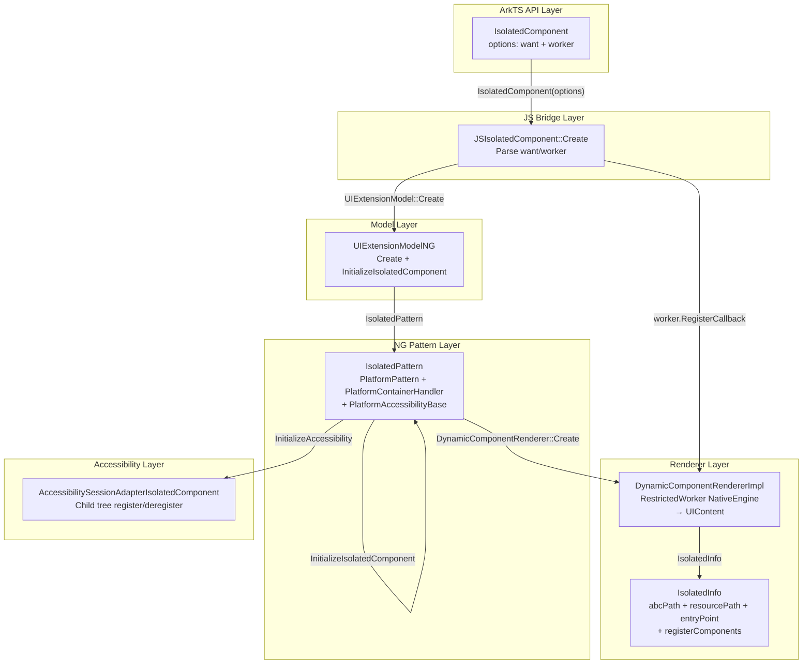
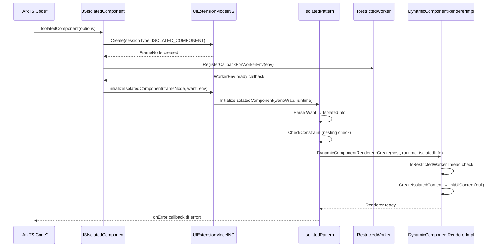

# 架构设计

> IsolatedComponent 隔离组件——用于在宿主应用页面中通过 RestrictedWorker 线程加载外部 ABC 包的 UI 内容，IsolatedPattern 继承 PlatformPattern + PlatformContainerHandler + PlatformAccessibilityBase，DynamicComponentRenderer 在 RestrictedWorker 的 NativeEngine 中创建 UIContent 实现同进程隔离线程渲染。

## 设计元数据

| 字段 | 内容 |
|------|------|
| Design ID | DESIGN-Func-05-12-05 |
| 关联需求 | 已有能力补录（无独立 requirement.md） |
| 关联 Epic | 无 |
| 目标 Feature | Feat-01 IsolatedComponent完整规格 |
| 复杂度 | 简单 |
| 目标版本 | API 12+（@systemapi, @stagemodelonly, @dynamiconly, @noninterop） |
| Owner | ArkUI SIG / 嵌入组件团队 |
| 状态 | Baselined（已有实现补录） |

## 需求基线

| 项 | 补充说明 |
|----|----------|
| 组件创建与 Want 解析 | IsolatedComponent 接受 `IsolatedOptions { want, worker }` 创建，Want 中携带 abcPath/resourcePath/entryPoint/registerComponents 参数，用于定位 ABC 包 |
| RestrictedWorker 线程渲染 | DynamicComponentRendererImpl 在 RestrictedWorker 的 NativeEngine 中创建 UIContent，实现同进程隔离线程渲染（非跨进程） |
| 事件回调 | onError（ErrorCallback）唯一事件回调，错误码 10001 (paramError) 和 10002 (restrictedWorkerError) |
| 嵌套约束 | IsolatedComponent 不能嵌套在 IsolatedComponent 或 DynamicComponent 内 |
| Worker 约束 | IsolatedComponent 最多使用 1 个 Worker，每个 Worker 最多承载 4 个组件 |

## 上下文和现状

### 涉及仓和模块

| 仓库 | 补充架构说明 |
|------|-------------|
| ace_engine/frameworks/core/components_ng/pattern/ui_extension/isolated_component/ | NG Pattern 层：IsolatedPattern（继承 PlatformPattern + PlatformContainerHandler + PlatformAccessibilityBase） |
| ace_engine/frameworks/core/common/dynamic_component_renderer.h | Renderer 抽象层：DynamicComponentRenderer 报告、IsolatedInfo 数据结构定义 |
| ace_engine/adapter/ohos/entrance/dynamic_component/dynamic_component_renderer_impl.h | Renderer 实现层：DynamicComponentRendererImpl（创建 UIContent、管理 Worker 约束） |
| ace_engine/frameworks/bridge/declarative_frontend/jsview/ | JS 桥接层：JSIsolatedComponent（create、onError、width、height） |
| ace_engine/frameworks/core/components_ng/pattern/ui_extension/ui_extension_model_ng.h | Model 层：UIExtensionModelNG（Create、InitializeIsolatedComponent、SetPlatformOnError） |
| interface/sdk-js/api/@internal/component/ets/isolated_component.d.ts | SDK 组件级声明（@systemapi, since 12, @stagemodelonly, @dynamiconly, @noninterop） |

### 调用链层级分析

| 层 | 模块 | 职责 | 修改类型 |
|----|------|------|----------|
| ArkTS API 层 | `IsolatedComponent(options)` 声明式调用 | 创建组件、传入 want/worker | 已有实现 |
| JS Bridge 层 | `js_isolated_component.cpp` JSIsolatedComponent::Create | 解析 want/worker，注册 Worker 环境回调，调用 UIExtensionModel::Create | 已有实现 |
| Model 层 | `UIExtensionModelNG` | 创建 IsolatedPattern FrameNode，InitializeIsolatedComponent，SetPlatformOnError | 已有实现 |
| Pattern 层 | `IsolatedPattern` | 管理隔离组件生命周期：解析 Want → IsolatedInfo、创建 DynamicComponentRenderer、检测嵌套约束 | 已有实现 |
| Renderer 层 | `DynamicComponentRendererImpl` | 在 RestrictedWorker NativeEngine 中创建 UIContent，加载 ABC 包内容 | 已有实现 |
| Accessibility 层 | `AccessibilitySessionAdapterIsolatedComponent` | 管理无障碍子树注册/注销 | 已有实现 |

### 适用架构规则

| Rule ID | 适用原因 | 设计结论 | 验证方式 |
|---------|----------|----------|----------|
| OH-ARCH-LAYERING | 跨层调用：ArkTS → JS Bridge → Model → Pattern → Renderer | 调用方向严格自上而下；Renderer 创建隔离线程 UIContent 不反向依赖宿主 | 代码评审 |
| OH-ARCH-API-LEVEL | 组件级 API 为 @systemapi + @stagemodelonly + @dynamiconly + @noninterop | 仅动态范式系统应用可使用，无 C-API 和 Static ArkTS 桥接 | API 评审 |
| OH-ARCH-SUBSYSTEM | IsolatedComponent 同进程线程隔离，不跨子系统 | 不涉及 IPC/SAF，Worker 通信为同进程线程级 | 架构评审 |

## 不涉及项承接

| 维度 | 设计结论 |
|------|----------|
| 性能 | 不量化指标；RestrictedWorker 初始化和 ABC 加载有固有延迟 |
| 安全与权限 | @systemapi + @stagemodelonly + @dynamiconly 限制系统应用使用 |
| 兼容性 | IsolatedComponent 为 API 12 新组件，无废弃迁移 |
| 持久化 | 无持久化需求 |
| 构建与部件 | 无新部件引入 |
| C-API | 无 C-API modifier，仅 Dynamic ArkTS 桥接（JSView） |
| Static ArkTS | 无 Static ArkTS 桥接，仅动态范式 |
| 通信代理 | 无 Proxy 对象（无 send/sendSync 机制） |

## 关键设计决策

| 决策 ID | 问题 | 推荐方案 | 探索过的替代方案 | 取舍理由 | 影响 |
|---------|------|----------|-----------------|----------|------|
| ADR-1 | IsolatedComponent 为何使用 RestrictedWorker 线程而非跨进程 | DynamicComponentRendererImpl 在 RestrictedWorker 的 NativeEngine 中创建 UIContent，同进程线程级隔离 | 跨进程渲染（如 UIExtensionComponent） | 同进程线程隔离避免了 IPC 通信开销，适合轻量级 ABC 包渲染场景 | `dynamic_component_renderer_impl.cpp` |
| ADR-2 | IsolatedPattern 为何继承 PlatformPattern + PlatformContainerHandler + PlatformAccessibilityBase | IsolatedPattern 三重继承获得平台生命周期管理、容器状态管理、无障碍子树管理能力 | 仅继承 PlatformPattern | IsolatedComponent 需要独立容器管理和无障碍子树接入，单继承无法覆盖 | `isolated_pattern.h` |
| ADR-3 | 为何无 C-API modifier | IsolatedComponent 为 @dynamiconly + @noninterop 组件，仅服务于动态范式系统应用 | 添加 C-API modifier | @noninterop 标注明确排除静态范式/C-API 场景 | `isolated_component.d.ts` |
| ADR-4 | Worker 约束为何限制 1 Worker / 4 组件 | WORKER_MAX_NUM=1, DC_MAX_NUM_IN_WORKER=4，避免线程资源过度占用 | 放宽 Worker 数量 | RestrictedWorker 资源有限，1 Worker + 4 组件上限保障性能稳定性 | `dynamic_component_renderer_impl.cpp` |
| ADR-5 | 嵌套约束为何禁止在 IsolatedComponent/DynamicComponent 内嵌套 | CheckConstraint 检查 UIContentType，若宿主容器为 ISOLATED_COMPONENT 或 DYNAMIC_COMPONENT 则拒绝创建 | 允许嵌套 | 隔离线程内再创建隔离线程会导致线程资源递归消耗 | `isolated_pattern.cpp` |

## 设计骨架

### 骨架范围

| 骨架项 | 目标 | 不包含 | 验证方式 |
|--------|------|--------|----------|
| 组件创建与 Want 解析 | 锁定 IsolatedComponent 创建流程、Want → IsolatedInfo 解析、RestrictedWorker 注册回调 | send/sendSync 通信机制 | 代码评审 |
| 事件回调 | 锁定 onError 触发条件与错误码 | onComplete 回调（无此回调） | 代码评审 |
| Worker 约束与嵌套约束 | 锁定 Worker 最大数量和组件最大数量约束、嵌套禁止约束 | DynamicComponent Worker 约束 | 代码评审 |

### 骨架 Spec 拆分

| Task ID | 目标 | 受影响文件 | AC |
|---------|------|------------|----|
| TASK-SKELETON-1 | IsolatedComponent完整规格 | isolated_pattern.cpp, js_isolated_component.cpp, dynamic_component_renderer_impl.cpp | Feat-01 AC |

## 后续 Task 拆分

| Task ID | 目标 | 受影响文件 | 依赖 |
|---------|------|------------|------|
| TASK-1 | IsolatedComponent完整规格 | Feat-01-isolated-component-spec.md | 无（基线） |

## API 签名、Kit 与权限

### 新增 API

| API 签名 | 类型 | Kit | d.ts 位置 | 权限要求 | SysCap |
|----------|------|-----|-----------|----------|--------|
| `IsolatedComponent(options: IsolatedOptions)` | System | ArkUI | `@internal/component/ets/isolated_component.d.ts` | @systemapi, @stagemodelonly, @dynamiconly, @noninterop | SystemCapability.ArkUI.ArkUI.Full |
| `IsolatedOptions { want: Want, worker: RestrictedWorker }` | System | ArkUI | `@internal/component/ets/isolated_component.d.ts` | @systemapi, @stagemodelonly, @dynamiconly | SystemCapability.ArkUI.ArkUI.Full |
| `onError(callback: ErrorCallback)` | System | ArkUI | `@internal/component/ets/isolated_component.d.ts` | @systemapi, @stagemodelonly, @dynamiconly | SystemCapability.ArkUI.ArkUI.Full |

### 变更/废弃 API

无。

## 构建系统影响

### BUILD.gn 变更

无新增 GN target；IsolatedPattern 随 `ui_extension` pattern 目标编译，DynamicComponentRendererImpl 隶属于 `ace_container` target。

### bundle.json 变更

无新增 component 依赖。

## 可选设计扩展

### 架构图



### 时序设计



### 数据模型设计

**SDK 层 TypeScript 类型：**
```typescript
interface IsolatedOptions {
  want: Want;                                    // (@since 12, @systemapi, @stagemodelonly, @dynamiconly)
  worker: RestrictedWorker;                      // (@since 12, @systemapi, @stagemodelonly, @dynamiconly)
}

type IsolatedComponentInterface = (options: IsolatedOptions) => IsolatedComponentAttribute;

class IsolatedComponentAttribute extends CommonMethod<IsolatedComponentAttribute> {
  onError(callback: ErrorCallback): IsolatedComponentAttribute;
}
```

**C++ 层核心数据结构：**

| 结构 | 位置 | 关键字段 |
|------|------|----------|
| `IsolatedInfo` | `dynamic_component_renderer.h` | abcPath, resourcePath, entryPoint, registerComponents |
| `IsolatedPattern` | `isolated_pattern.h` | curIsolatedInfo_, dynamicComponentRenderer_, adaptiveWidth_, adaptiveHeight_, uiExtensionId_ |
| `IsolatedDumpInfo` | `isolated_pattern.h` | createLimitedWorkerTime |
| `ErrorMsg` | `platform_pattern.h` | code, name, message |

**错误码定义：**

| 错误码 | 名称 | 触发条件 | 来源 |
|--------|------|----------|------|
| 10001 | paramError | abcPath/resourcePath/entryPoint/runtime 为空 | `isolated_pattern.cpp` |
| 10002 | restrictedWorkerError | 运行环境不是 RestrictedWorker 线程 | `isolated_pattern.cpp`, `dynamic_component_renderer_impl.cpp` |

## 详细设计

### IsolatedPattern 生命周期管理

**JSIsolatedComponent::Create** (`js_isolated_component.cpp`):
- 解析 options 中的 want 和 worker
- 调用 UIExtensionModel::Create(sessionType=ISOLATED_COMPONENT) 创建 FrameNode
- 注册 Worker 环境回调：worker->RegisterCallbackForWorkerEnv
- Worker 环境就绪后，PostTask 到 UI 线程执行 InitializeIsolatedComponent

**IsolatedPattern::InitializeIsolatedComponent** (`isolated_pattern.cpp`):
- 从 WantWrap 解析 IsolatedInfo（abcPath、resourcePath、entryPoint、registerComponents）
- 若 abcPath/resourcePath/entryPoint/runtime 任一为空 → FireOnErrorCallback(10001, "paramError", "The param is empty")
- 调用 InitializeRender(runtime)

**IsolatedPattern::InitializeRender** (`isolated_pattern.cpp`):
- CheckConstraint：检测宿主 UIContentType，若为 ISOLATED_COMPONENT 或 DYNAMIC_COMPONENT 则拒绝创建
- 创建 DynamicComponentRenderer::Create(host, runtime, curIsolatedInfo_)
- IsRestrictedWorkerThread 检查：若非 RestrictedWorker 线程 → FireOnErrorCallbackOnUI(10002)
- 设置 UIContentType::ISOLATED_COMPONENT、adaptiveSize、backgroundTransparent
- 调用 CreateContent → CreateIsolatedContent → InitUiContent

**IsolatedPattern::OnDirtyLayoutWrapperSwap** (`isolated_pattern.cpp`):
- 触发 DynamicComponentRenderer::UpdateViewportConfig 更新隔离组件视口尺寸

**IsolatedPattern::OnDetachFromFrameNode** (`isolated_pattern.cpp`):
- 调用 DestroyContent销毁 UIContent
- dynamicComponentRenderer_ = nullptr

### DynamicComponentRendererImpl Worker 约束管理

**CheckWorkerMaxConstraint** (`dynamic_component_renderer_impl.cpp`):
- usingWorkers_ 全局 map 记录 Worker 使用情况
- WORKER_MAX_NUM = 1：最多 1 个 Worker
- 新 Worker 请求：usingWorkers_.size() < WORKER_MAX_NUM

**CheckDCMaxConstraintInWorker** (`dynamic_component_renderer_impl.cpp`):
- DC_MAX_NUM_IN_WORKER = 4：每个 Worker 最多承载 4 个组件
- 查找 Worker 对应计数：iter->second < DC_MAX_NUM_IN_WORKER

### JS Bridge 层

**JSIsolatedComponent::JSBind** (`js_isolated_component.cpp`):
- 声明 IsolatedComponent 类
- StaticMethod：create、onError、onAppear、onDisAppear、width、height

**JSIsolatedComponent::JsOnError** (`js_isolated_component.cpp`):
- 注册 onError 回调到 UIExtensionModel::SetPlatformOnError
- 回调参数为 JSObject { code: int32_t, name: string, message: string }

### 无障碍架构

**AccessibilitySessionAdapterIsolatedComponent** (`accessibility_session_adapter_isolated_component.h`):
- 持有 DynamicComponentRenderer 引用
- 通过 DynamicComponentRenderer 的 TransferAccessibilityChildTreeRegister/Deregister 接入宿主无障碍树

## 风险和开放问题

| 项 | 类型 | 影响 | 处理方式 | Owner |
|----|------|------|----------|-------|
| IsolatedComponent 为 @systemapi + @dynamiconly + @noninterop | API | 中 | 仅动态范式系统应用可使用；无 C-API 和 Static 桥接 | ArkUI SIG |
| RestrictedWorker 初始化延迟 | 架构 | 中 | Worker 环境就绪后才执行 InitializeIsolatedComponent | ArkUI SIG |
| Worker 约束上限 1/4 | 架构 | 低 | 标注为已知约束，不量化指标 | ArkUI SIG |
| 嵌套约束禁止在 Isolated/Dynamic 内嵌套 | 架构 | 中 | CheckConstraint 硬性拒绝 | ArkUI SIG |

## 设计审批

- [x] 需求基线已确认，设计覆盖 P0/P1 AC
- [x] 不涉及项已承接，N/A 和展开项都有结论
- [x] 涉及仓和模块职责清楚
- [x] 调用链层级分析完整，每层覆盖到位
- [x] 适用架构规则已识别并形成设计结论
- [x] 分层和子系统边界合规
- [x] API 变更有签名、权限、错误码和兼容性说明
- [x] BUILD.gn/bundle.json 影响明确
- [x] 设计输出和后续 Task 拆分明确
- [x] 关键设计决策有理由和影响说明
- [x] 风险和开放问题有 Owner

**结论:** 通过（已有实现补录）
