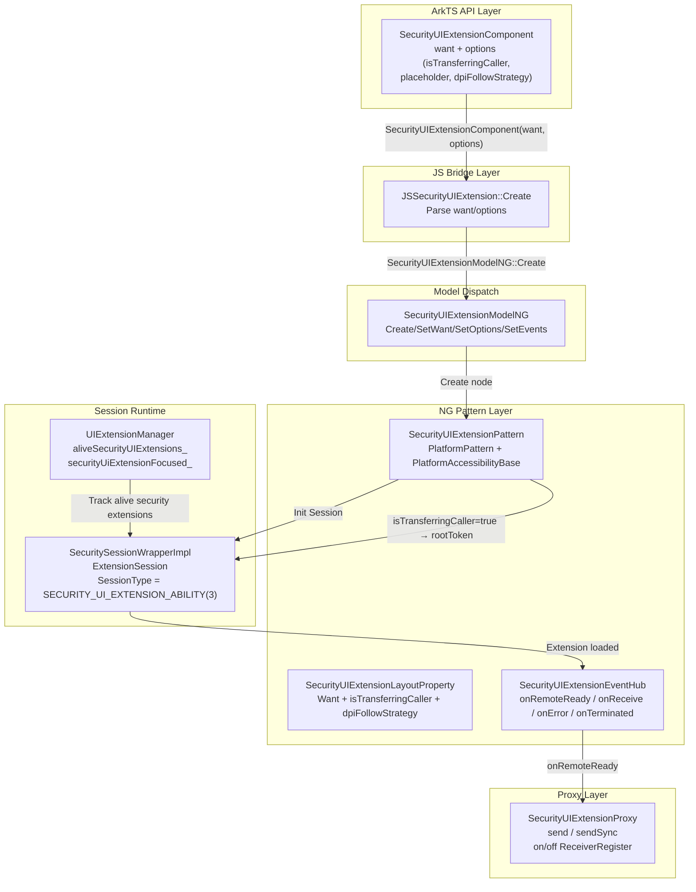
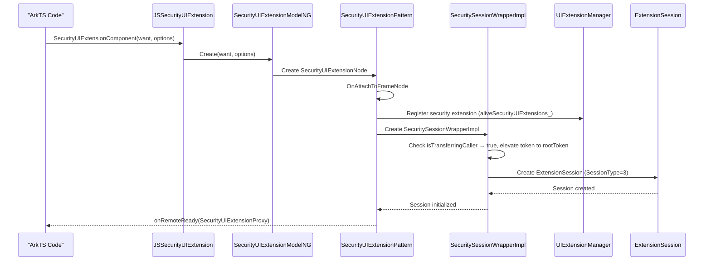

# 架构设计

> SecurityUIExtensionComponent 安全嵌入组件——用于在宿主应用页面中嵌入安全级 UIExtensionAbility 的 UI 内容，通过 SecuritySessionWrapperImpl 创建独立渲染管线加载 Extension 会话，支持 isTransferringCaller 安全策略提升调用方 Token 权限，并通过 SecurityUIExtensionProxy 提供安全级数据通信机制。

## 设计元数据

| 字段 | 内容 |
|------|------|
| Design ID | DESIGN-Func-05-12-06 |
| 关联需求 | 已有能力补录（无独立 requirement.md） |
| 关联 Epic | 无 |
| 目标 Feature | Feat-01 SecurityUIExtension创建/Proxy/安全策略；Feat-02 事件回调 |
| 复杂度 | 标准 |
| 目标版本 | API 20+（static）；Proxy send/sendSync/receiver @since 22 static |
| Owner | ArkUI SIG / 嵌入组件团队 |
| 状态 | Baselined（已有实现补录） |

## 需求基线

| 项 | 补充说明 |
|----|----------|
| 组件创建与 Want | SecurityUIExtensionComponent 接受 `Want` + `SecurityUIExtensionOptions` 创建，options 包含 isTransferringCaller、placeholder、dpiFollowStrategy |
| 安全策略 | isTransferringCaller=true 时将调用方 Token 提升为 rootToken，核心安全级区分 |
| DPI 策略 | SecurityDpiFollowStrategy 支持 FOLLOW_HOST_DPI(0) 和 FOLLOW_UI_EXTENSION_ABILITY_DPI(1)，默认 FOLLOW_UI_EXTENSION_ABILITY_DPI |
| 独立渲染管线 | SecuritySessionWrapperImpl 基于 ExtensionSession 创建独立渲染管线，与宿主页面渲染隔离 |
| Proxy 数据通信 | SecurityUIExtensionProxy 提供 send/sendSync（同步/异步数据传递）、onAsyncReceiverRegister/onSyncReceiverRegister/on/off 注册机制 |
| 事件回调 | 仅支持 onRemoteReady、onReceive、onError、onTerminated；不支持 onRelease/onResult/onDrawReady |
| C-API | 无 C-API modifier（@noninterop 标记），仅 ArkTS static 范式 |

## 上下文和现状

### 涉及仓和模块

| 仓库 | 补充架构说明 |
|------|-------------|
| ace_engine/frameworks/core/components_ng/pattern/security_ui_extension/ | NG Pattern 层：SecurityUIExtensionPattern、SecurityUIExtensionModelNG、SecurityUIExtensionLayoutProperty、SecurityUIExtensionEventHub、SecurityUIExtensionNode |
| ace_engine/frameworks/core/components_ng/pattern/ui_extension/ | UIExtension 共享层：PlatformPattern、PlatformAccessibilityBase、UIExtensionPattern 基类 |
| ace_engine/frameworks/core/components_ng/manager/ui_extension_manager/ | UIExtensionManager：aliveSecurityUIExtensions_、securityUiExtensionFocused_ 独立追踪 |
| ace_engine/frameworks/bridge/declarative_frontend/jsview/ | JS 桥接层：JSSecurityUIExtension |
| ace_engine/frameworks/bridge/arkts_frontend/ | ArkTS static 桥接层 |
| interface/sdk-js/api/@internal/component/ets/security_ui_extension_component.d.ts | SDK 组件级声明（@since 20 static） |

### 调用链层级分析

| 层 | 模块 | 职责 | 修改类型 |
|----|------|------|----------|
| ArkTS API 层 | `SecurityUIExtensionComponent(want, options?, content_?)` 声明式调用 | 创建组件、传入 Want 和安全选项 | 已有实现 |
| JS Bridge 层 | `js_security_ui_extension.cpp` JSSecurityUIExtension::Create | 解析 Want/options，调用 SecurityUIExtensionModelNG | 已有实现 |
| Model Dispatch 层 | `SecurityUIExtensionModelNG` | 创建 SecurityUIExtensionPattern 节点、设置属性和事件 | 已有实现 |
| NG Pattern 层 | `SecurityUIExtensionPattern` | 管理安全级 Extension 生命周期：创建 SessionWrapper、注册回调、处理 isTransferringCaller 安全策略 | 已有实现 |
| Session Wrapper 层 | `SecuritySessionWrapperImpl` | 基于 ExtensionSession 创建独立渲染管线，SessionType=SECURITY_UI_EXTENSION_ABILITY(3) | 已有实现 |
| Manager 层 | `UIExtensionManager` | aliveSecurityUIExtensions_ 独立追踪安全级 Extension、securityUiExtensionFocused_ 焦点管理 | 已有实现 |
| Proxy 层 | `SecurityUIExtensionProxy` | send/sendSync 数据通信、receiver 注册/注销 | 已有实现 |

### 适用架构规则

| Rule ID | 适用原因 | 设计结论 | 验证方式 |
|---------|----------|----------|----------|
| OH-ARCH-LAYERING | 跨层调用：ArkTS → JS Bridge → ModelNG → Pattern → SessionWrapper | 调用方向严格自上而下；SessionWrapper 创建独立管线不反向依赖宿主 | 代码评审 |
| OH-ARCH-API-LEVEL | 组件级 API @since 20 static；Proxy send/sendSync/receiver @since 22 static | 两级 API 在同一 d.ts 中声明，版本边界明确 | API 评审 |
| OH-ARCH-SECURITY | isTransferringCaller=true 提升 Token 为 rootToken | 安全策略在 SessionWrapper 初始化阶段执行，仅安全级组件支持 | 安全评审 |
| OH-ARCH-SUBSYSTEM | SecurityUIExtensionComponent 跨子系统依赖：ability_runtime（ExtensionSession）、ipc（Token） | 依赖通过 adapter 层桥接，核心 Pattern 不直接引用系统服务头文件 | 依赖检查 |

## 不涉及项承接

| 维度 | 设计结论 |
|------|----------|
| C-API | 无 C-API modifier（@noninterop 标记），仅 ArkTS static 范式可用 |
| 性能 | 不量化指标；SecuritySessionWrapperImpl 创建独立管线有固有的初始化延迟 |
| 安全与权限 | isTransferringCaller 为组件级安全策略，不涉及系统权限声明 |
| 兼容性 | 与 UIExtensionComponent/IsolatedComponent 共享 PlatformPattern 基类，但不共享 Proxy |
| 持久化 | SecurityUIExtension 无持久化需求 |
| 构建与部件 | 无新部件引入 |

## 关键设计决策

| 决策 ID | 问题 | 推荐方案 | 探索过的替代方案 | 取舍理由 | 影响 |
|---------|------|----------|-----------------|----------|------|
| ADR-1 | SecurityUIExtension 为何使用独立 Proxy | SecurityUIExtensionProxy 独立于 UIExtensionProxy，send/sendSync/receiver 机制为安全级专用 | 共用 UIExtensionProxy | 安全级 Extension 数据通信需要独立权限边界和接收器注册机制 | security_ui_extension_proxy.h |
| ADR-2 | isTransferringCaller 为何提升 Token | isTransferringCaller=true 时将调用方 Token 提升为 rootToken，使安全级 Extension 获得更高权限访问 | 不提升 Token | 安全级组件需要以更高权限运行（如访问受限系统资源），rootToken 提升是核心安全级区分 | security_session_wrapper_impl.cpp |
| ADR-3 | 为何不支持 onRelease/onResult/onDrawReady | SecurityUIExtension 仅支持 onRemoteReady/onReceive/onError/onTerminated 四种回调 | 支持全部 UIExtension 回调 | 安全级 Extension 的生命周期管理更严格，onRelease/onResult/onDrawReady 不适用于安全场景 | security_ui_extension_pattern.cpp |
| ADR-4 | 为何无 C-API modifier | SecurityUIExtensionComponent 标记为 @noninterop，不提供 C-API modifier | 提供完整 C-API modifier | 安全级组件涉及 Token 权限提升，C-API 层面无法安全传递 Token 上下文 | d.ts @noninterop |
| ADR-5 | DPI 策略为何默认 FOLLOW_UI_EXTENSION_ABILITY_DPI | 默认 dpiFollowStrategy=FOLLOW_UI_EXTENSION_ABILITY_DPI(1)，安全级 Extension 通常有独立 DPI 需求 | 默认 FOLLOW_HOST_DPI | 安全级 Extension 界面通常由系统安全框架定义，跟随其自身 DPI 更合理 | security_ui_extension_layout_property.h |

## 设计骨架

### 骨架范围

| 骨架项 | 目标 | 不包含 | 验证方式 |
|--------|------|--------|----------|
| 组件创建与 Want | 锁定 SecurityUIExtensionComponent 创建流程、Want 传递、options 解析、SecuritySessionWrapperImpl 初始化 | UIExtensionComponent/IsolatedComponent 创建流程 | 代码评审 |
| 安全策略 | 锁定 isTransferringCaller Token 提升机制、dpiFollowStrategy DPI 策略 | 其他 Extension 类型安全策略 | 安全评审 |
| Proxy 通信 | 锁定 SecurityUIExtensionProxy send/sendSync/receiver 注册/注销 | UIExtensionProxy 通信机制 | 代码评审 |
| 事件回调 | 锁定 onRemoteReady/onReceive/onError/onTerminated 四种回调 | onRelease/onResult/onDrawReady | 代码评审 |

### 骨架 Spec 拆分

| Task ID | 目标 | 受影响文件 | AC |
|---------|------|------------|----|
| TASK-SKELETON-1 | SecurityUIExtension创建/Proxy/安全策略 | security_ui_extension_pattern.cpp, security_session_wrapper_impl.cpp, js_security_ui_extension.cpp | Feat-01 AC |
| TASK-SKELETON-2 | 事件回调 | security_ui_extension_pattern.cpp, security_ui_extension_event_hub.h | Feat-02 AC |

## 后续 Task 拆分

| Task ID | 目标 | 受影响文件 | 依赖 |
|---------|------|------------|------|
| TASK-1 | SecurityUIExtension创建/Proxy/安全策略 | Feat-01-security-creation-proxy-spec.md | 无（基线） |
| TASK-2 | SecurityUIExtension事件回调 | Feat-02-security-events-spec.md | TASK-1 |

## API 签名、Kit 与权限

### 新增 API

| API 签名 | 类型 | Kit | d.ts 位置 | 权限要求 | SysCap |
|----------|------|-----|-----------|----------|--------|
| `SecurityUIExtensionComponent(want: Want, options?: SecurityUIExtensionOptions, content_?: CustomBuilder)` | Static | ArkUI | `@internal/component/ets/security_ui_extension_component.d.ts` | — | SystemCapability.ArkUI.ArkUI.Full |
| `SecurityUIExtensionOptions { isTransferringCaller?, placeholder?, dpiFollowStrategy? }` | Static | ArkUI | `@internal/component/ets/security_ui_extension_component.d.ts` | — | SystemCapability.ArkUI.ArkUI.Full |
| `SecurityDpiFollowStrategy { FOLLOW_HOST_DPI = 0, FOLLOW_UI_EXTENSION_ABILITY_DPI = 1 }` | Static | ArkUI | `@internal/component/ets/security_ui_extension_component.d.ts` | — | SystemCapability.ArkUI.ArkUI.Full |
| `onRemoteReady(callback: (proxy: SecurityUIExtensionProxy) => void)` | Static | ArkUI | `@internal/component/ets/security_ui_extension_component.d.ts` | — | SystemCapability.ArkUI.ArkUI.Full |
| `onReceive(callback: ReceiveCallback)` | Static | ArkUI | `@internal/component/ets/security_ui_extension_component.d.ts` | — | SystemCapability.ArkUI.ArkUI.Full |
| `onError(callback: ErrorCallback)` | Static | ArkUI | `@internal/component/ets/security_ui_extension_component.d.ts` | — | SystemCapability.ArkUI.ArkUI.Full |
| `onTerminated(callback: (info: TerminationInfo) => void)` | Static | ArkUI | `@internal/component/ets/security_ui_extension_component.d.ts` | — | SystemCapability.ArkUI.ArkUI.Full |
| `SecurityUIExtensionProxy.send(data)` | Static | ArkUI | `@internal/component/ets/security_ui_extension_component.d.ts` | — | @since 22 |
| `SecurityUIExtensionProxy.sendSync(data)` | Static | ArkUI | `@internal/component/ets/security_ui_extension_component.d.ts` | — | @since 22, throws 100011/100012 |
| `SecurityUIExtensionProxy.onAsyncReceiverRegister/onSyncReceiverRegister/offAsyncReceiverRegister/offSyncReceiverRegister` | Static | ArkUI | `@internal/component/ets/security_ui_extension_component.d.ts` | — | @since 22 |

### 变更/废弃 API

无。

## 构建系统影响

### BUILD.gn 变更

```text
文件: frameworks/core/components_ng/pattern/security_ui_extension/BUILD.gn
变更说明: 定义 security_ui_extension_pattern_ng target（security_ui_extension_pattern.cpp, security_ui_extension_model_ng.cpp, security_ui_extension_node.cpp）
依赖: ability_base:want, ability_runtime:extension_session, ipc:token, graphic_2d
```

### bundle.json 变更

无新增 component 依赖。

## 可选设计扩展

### 架构图



### 时序设计



### 数据模型设计

**SDK 层 TypeScript 类型：**
```typescript
interface SecurityUIExtensionOptions {
  isTransferringCaller?: boolean;     // @since 20, default false
  placeholder?: CustomBuilder;        // @since 20
  dpiFollowStrategy?: SecurityDpiFollowStrategy; // @since 20, default FOLLOW_UI_EXTENSION_ABILITY_DPI
}

enum SecurityDpiFollowStrategy {
  FOLLOW_HOST_DPI = 0,                    // @since 20
  FOLLOW_UI_EXTENSION_ABILITY_DPI = 1,    // @since 20
}

interface TerminationInfo {
  code: number;    // Termination code
}

interface ReceiveCallback {
  (data: Object): void;
}

interface ErrorCallback {
  (error: Object): void;
}
```

**C++ 层核心数据结构：**

| 结构 | 位置 | 关键字段 |
|------|------|----------|
| `SecurityUIExtensionLayoutProperty` | `security_ui_extension_layout_property.h` | WANT (WantParam), IS_TRANSFERRING_CALLER (bool), DPI_FOLLOW_STRATEGY (SecurityDpiFollowStrategy) |
| `SecurityUIExtensionEventHub` | `security_ui_extension_event_hub.h` | onRemoteReady_, onReceive_, onError_, onTerminated_ |
| `SecurityUIExtensionProxy` | `security_ui_extension_proxy.h` | send_, sendSync_, onAsyncReceiverRegister_, onSyncReceiverRegister_, offAsyncReceiverRegister_, offSyncReceiverRegister_ |
| `SecuritySessionWrapperImpl` | `security_session_wrapper_impl.h` | ExtensionSession, SessionType=SECURITY_UI_EXTENSION_ABILITY(3), isTransferringCaller token elevation |

## 详细设计

### SecurityUIExtensionPattern 生命周期管理

**OnAttachToFrameNode** (`security_ui_extension_pattern.cpp`):
- 注册 onRemoteReady/onReceive/onError/onTerminated 事件回调到 SecurityUIExtensionEventHub
- 创建 SecuritySessionWrapperImpl：初始化 ExtensionSession，SessionType=SECURITY_UI_EXTENSION_ABILITY(3)
- 若 isTransferringCaller=true，在 SessionWrapper 初始化阶段将调用方 Token 提升为 rootToken
- 注册到 UIExtensionManager aliveSecurityUIExtensions_ 列表

**OnModifyDone** (`security_ui_extension_pattern.cpp`):
- 检查 isTransferringCaller 属性变化
- 检查 dpiFollowStrategy 属性变化并更新 DPI 策略
- 处理 Want 变化：销毁旧 SessionWrapper，创建新 SessionWrapper

### SecuritySessionWrapperImpl 安全策略

**isTransferringCaller Token 提升** (`security_session_wrapper_impl.cpp`):
- isTransferringCaller=false（默认）：使用调用方原始 Token
- isTransferringCaller=true：将调用方 Token 提升为 rootToken，使安全级 Extension 获得更高权限

**SessionType 区分** (`security_session_wrapper_impl.cpp`):
- SessionType=SECURITY_UI_EXTENSION_ABILITY(3)，区别于 UI_EXTENSION_ABILITY(1) 和 ISOLATED_EXTENSION_ABILITY(2)

### SecurityUIExtensionProxy 数据通信

**send(data)** (`security_ui_extension_proxy.cpp`):
- 异步发送数据到 Extension 端

**sendSync(data)** (`security_ui_extension_proxy.cpp`):
- 同步发送数据到 Extension 端
- 异常：100011（连接失败）、100012（发送失败）

**Receiver 注册/注销** (`security_ui_extension_proxy.cpp`):
- onAsyncReceiverRegister：注册异步数据接收器
- onSyncReceiverRegister：注册同步数据接收器
- offAsyncReceiverRegister：注销异步数据接收器
- offSyncReceiverRegister：注销同步数据接收器

### UIExtensionManager 安全级追踪

**aliveSecurityUIExtensions_** (`ui_extension_manager.h`):
- UIExtensionManager 维护独立的 aliveSecurityUIExtensions_ 映射表追踪安全级 Extension
- securityUiExtensionFocused_ 标识当前获得焦点的安全级 Extension

## 风险和开放问题

| 项 | 类型 | 影响 | 处理方式 | Owner |
|----|------|------|----------|-------|
| isTransferringCaller Token 提升为 rootToken | 安全 | 高 | 仅安全级组件支持；需要系统安全评审确认 rootToken 提升范围 | ArkUI SIG |
| 无 C-API modifier | API | 低 | @noninterop 标记明确限制，NDK 场景不适用 | ArkUI SIG |
| SecurityUIExtensionProxy 独立于 UIExtensionProxy | 架构 | 中 | 安全级 Proxy 有独立的权限边界和接收器注册机制 | ArkUI SIG |
| 不支持 onRelease/onResult/onDrawReady | API | 低 | 安全级 Extension 生命周期更严格，仅四种回调 | ArkUI SIG |

## 设计审批

- [x] 需求基线已确认，设计覆盖 P0/P1 AC
- [x] 不涉及项已承接，N/A 和展开项都有结论
- [x] 涉及仓和模块职责清楚
- [x] 调用链层级分析完整，每层覆盖到位
- [x] 适用架构规则已识别并形成设计结论
- [x] 分层和子系统边界合规
- [x] API 变更有签名、权限、错误码和兼容性说明
- [x] BUILD.gn/bundle.json 影响明确
- [x] 设计输出和后续 Task 拆分明确
- [x] 关键设计决策有理由和影响说明
- [x] 风险和开放问题有 Owner

**结论:** 通过（已有实现补录）
