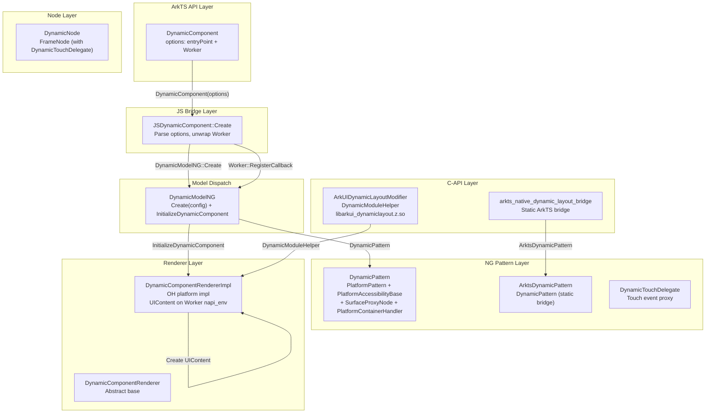
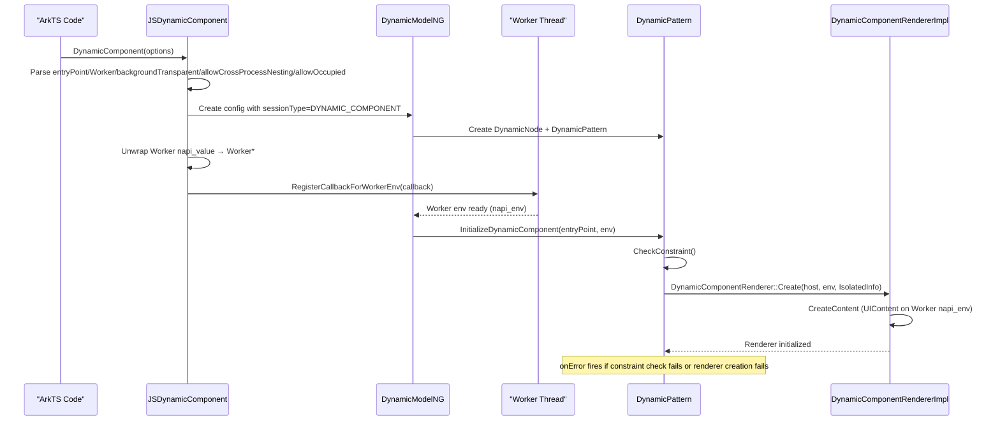

# 架构设计

> DynamicComponent 在宿主应用 Worker 线程中渲染独立 UI 内容——通过 DynamicComponentRenderer 在 Worker 的 napi_env 上创建 UIContent，实现同进程多线程隔离渲染，避免跨进程开销。与 PluginComponent/EmbeddedComponent 的跨进程方案不同，DynamicComponent 专注同进程 Worker 线程场景。

## 设计元数据

| 字段 | 内容 |
|------|------|
| Design ID | DESIGN-Func-05-12-07 |
| 关联需求 | 已有能力补录（无独立 requirement.md） |
| 关联 Epic | 无 |
| 目标 Feature | Feat-01 DynamicComponent完整规格 |
| 复杂度 | 标准 |
| 目标版本 | API 26.0.0+（@systemapi, @stagemodelonly） |
| Owner | ArkUI SIG / 嵌入组件团队 |
| 状态 | Baselined（已有实现补录） |

## 需求基线

| 项 | 补充说明 |
|----|----------|
| 组件创建与选项 | DynamicComponent 接受 `DynamicOptions { entryPoint, worker, backgroundTransparent?, allowCrossProcessNesting?, allowOccupied? }` 创建，entryPoint 指定加载入口 |
| 同进程 Worker 渲染 | DynamicComponentRenderer 在 Worker 的 napi_env 上创建 UIContent，与宿主页面在同一进程但不同线程渲染 |
| 嵌套约束 | 不允许在 DynamicComponent 内嵌套 DynamicComponent（DC_NOT_SUPPORT_UI_CONTENT_TYPE） |
| Worker 数量约束 | 每个 Worker 最多 4 个 DynamicComponent（DC_EXCEED_MAX_NUM_IN_WORKER） |
| 事件回调 | 仅 onError 回调，传递 DCResultCode 错误码 |

## 上下文和现状

### 涉及仓和模块

| 仓库 | 补充架构说明 |
|------|-------------|
| ace_engine/frameworks/core/components_ng/pattern/ui_extension/dynamic_component/ | NG Pattern 层：DynamicPattern、ArktsDynamicPattern、DynamicNode、DynamicModelNG、DynamicModelStatic、DynamicParam、DynamicTouchDelegate、DynamicComponentManager |
| ace_engine/frameworks/bridge/declarative_frontend/jsview/ | JS 桥接层：JSDynamicComponent（dynamic 版本 Worker 传递） |
| ace_engine/frameworks/core/common/ | Renderer 抽象层：DynamicComponentRenderer（虚基类） |
| ace_engine/adapter/ohos/entrance/dynamic_component/ | Renderer 实现层：DynamicComponentRendererImpl（OH 平台具体实现） |
| ace_engine/frameworks/core/interfaces/native/node/ | C-API 层：DynamicLayoutModifier（通过 DynamicModuleHelper 动态加载 libarkui_dynamiclayout.z.so） |
| ace_engine/frameworks/core/components_ng/pattern/dynamiclayout/bridge/ | C-API bridge 层：dynamic_layout_dynamic_modifier.cpp、dynamic_layout_dynamic_module.cpp、arkts_native_dynamic_layout_bridge.cpp（static ArkTS bridge） |

### 调用链层级分析

| 层 | 模块 | 职责 | 修改类型 |
|----|------|------|----------|
| ArkTS API 层 | `DynamicComponent(options)` 声明式调用 | 创建组件、传入 entryPoint/Worker/选项 | 已有实现 |
| JS Bridge 层 | `js_dynamic_component.cpp` JSDynamicComponent::Create | 解析 options（entryPoint/worker/backgroundTransparent/allowCrossProcessNesting/allowOccupied），unwrap Worker 对象 | 已有实现 |
| Model Dispatch 层 | `DynamicModelNG::GetInstance()` | 创建 DynamicNode（DynamicPattern），设置 config（sessionType=DYNAMIC_COMPONENT） | 已有实现 |
| Worker 初始化层 | Worker::RegisterCallbackForWorkerEnv | Worker 线程就绪后回调 napi_env → DynamicModelNG::InitializeDynamicComponent | 已有实现 |
| NG Pattern 层 | `DynamicPattern` | 管理渲染器生命周期：CheckConstraint → InitializeRender → CreateContent | 已有实现 |
| Renderer 抽象层 | `DynamicComponentRenderer` | 虚基类：CreateContent/DestroyContent/SetAdaptiveSize/SetBackgroundTransparent/UpdateViewportConfig/TransferPointerEvent | 已有实现 |
| Renderer 实现层 | `DynamicComponentRendererImpl` | OH 平台实现：在 Worker napi_env 上创建 UIContent，管理 RSUIContext 渲染节点 | 已有实现 |
| C-API 层 | `DynamicLayoutModifier` + `DynamicModuleHelper` | 通过 DynamicModuleHelper 动态加载 libarkui_dynamiclayout.z.so，获取 ArkUIDynamicLayoutModifier 函数表 | 已有实现 |
| Static ArkTS Bridge 层 | `arkts_native_dynamic_layout_bridge.cpp` | Arkoala 静态范式 bridge：ArktsDynamicPattern + DynamicModelStatic | 已有实现 |

### 适用架构规则

| Rule ID | 适用原因 | 设计结论 | 验证方式 |
|---------|----------|----------|----------|
| OH-ARCH-LAYERING | 跨层调用：ArkTS → JS Bridge → Model → Pattern → Renderer | 调用方向严格自上而下；Worker napi_env 由 JS Bridge 层传递到 Pattern 层 | 代码评审 |
| OH-ARCH-API-LEVEL | 组件级 API 为 @systemapi（since 26） | 仅系统应用可使用；@stagemodelonly 限制 Stage 模型 | API 评审 |
| OH-ARCH-IPC-SAF | DynamicComponent 为同进程组件，不涉及 IPC | 不使用 UIService/Session 跨进程通道 | 代码评审 |
| OH-ARCH-COMPONENT-BUILD | C-API 通过动态加载模块（DynamicModuleHelper）实现 | libarkui_dynamiclayout.z.so 为独立可加载模块，不直接链接到主库 | 构建验证 |
| OH-ARCH-ERROR-LOG | 组件有 6 种错误码（DCResultCode） | 错误码通过 onError 回调传递，不在日志中暴露 | 单测/hilog |

## 不涉及项承接

| 维度 | 设计结论 |
|------|----------|
| 性能 | 不量化指标；DynamicComponentRenderer 在 Worker 线程创建 UIContent 有固有的初始化延迟 |
| 安全与权限 | @systemapi 限制系统应用使用；@stagemodelonly 限制 Stage 模型 |
| 兼容性 | DynamicComponent 为新增组件（API 26），不涉及废弃迁移 |
| 持久化 | DynamicComponent 无持久化需求 |
| 构建与部件 | 无新部件引入；C-API 通过 DynamicModuleHelper 动态加载 |

## 关键设计决策

| 决策 ID | 问题 | 推荐方案 | 探索过的替代方案 | 取舍理由 | 影响 |
|---------|------|----------|-----------------|----------|------|
| ADR-1 | DynamicComponent 为何使用同进程 Worker 渲染而非跨进程 | DynamicComponentRenderer 在 Worker napi_env 上创建 UIContent，与宿主同进程 | 跨进程 Session 方案（类似 EmbeddedComponent） | 同进程避免 IPC 开销；Worker 线程隔离保证渲染独立性；适合轻量级嵌入式 UI 场景 | dynamic_component_renderer_impl.h |
| ADR-2 | 为何不允许 DC 嵌套 DC | CheckConstraint 检查 UIContentType，若宿主容器已是 DYNAMIC_COMPONENT/ISOLATED_COMPONENT 则返回 DC_NOT_SUPPORT_UI_CONTENT_TYPE | 允许嵌套 | 嵌套 DC 导致 Worker 线程递归占用和资源膨胀，无实际应用场景支撑 | dynamic_pattern.cpp:155 |
| ADR-3 | C-API 为何使用动态加载模块而非常规 static node modifier | DynamicLayoutModifier 通过 DynamicModuleHelper 动态加载 libarkui_dynamiclayout.z.so | 编译为常规 static modifier 直接链接 | DynamicLayout 涉及 LazyDynamicLayout 等复杂子组件，动态加载减少主库体积和编译依赖 | dynamic_layout_dynamic_module.cpp |
| ADR-4 | 为何 Worker 数量上限为 4 | CheckDCMaxConstraintInWorker 限制每个 Worker 最多 4 个 DynamicComponent | 不设上限或设更高上限 | 每个 DC 在 Worker 线程创建独立 UIContent，过多会导致线程内存和调度压力 | dynamic_component_renderer.h:93 |
| ADR-5 | DynamicPattern 为何继承 PlatformPattern + PlatformAccessibilityBase + SurfaceProxyNode + PlatformContainerHandler | 四重继承覆盖渲染管理、无障碍、Surface 代理、容器事件处理 | 单一继承 + 组合委托 | PlatformPattern 提供基础 Session 生命周期；SurfaceProxyNode 管理 RS 渲染节点代理；组合委托需要更多间接调用开销 | dynamic_pattern.h:46 |

## 设计骨架

### 骨架范围

| 骨架项 | 目标 | 不包含 | 验证方式 |
|--------|------|--------|----------|
| 组件创建与选项 | 锁定 DynamicComponent 创建流程、entryPoint/Worker 传递、DynamicComponentRenderer 初始化 | LazyDynamicLayout 组件规格 | 代码评审 |
| 事件回调 | 锁定 onError 回调触发条件与 DCResultCode 错误码 | onComplete 回调（DC 不支持） | 代码评审 |
| 嵌套与数量约束 | 锁定 CheckConstraint 和 CheckDCMaxConstraintInWorker 检查逻辑 | Worker 创建方式本身 | 代码评审 |
| C-API 动态加载 | 锁定 DynamicModuleHelper 加载 libarkui_dynamiclayout.z.so 机制 | LazyDynamicLayout C-API | C-API 单测 |

### 骨架 Spec 拆分

| Task ID | 目标 | 受影响文件 | AC |
|---------|------|------------|----|
| TASK-SKELETON-1 | DynamicComponent 完整规格（创建/选项/约束/onError/C-API） | dynamic_pattern.cpp, js_dynamic_component.cpp, dynamic_component_renderer_impl.cpp, dynamic_layout_dynamic_module.cpp | Feat-01 AC |

## 后续 Task 拆分

| Task ID | 目标 | 受影响文件 | 依赖 |
|---------|------|------------|------|
| TASK-1 | DynamicComponent完整规格 | Feat-01-dynamic-component-spec.md | 无（基线） |

## API 签名、Kit 与权限

### 新增 API

| API 签名 | 类型 | Kit | d.ts 位置 | 权限要求 | SysCap |
|----------|------|-----|-----------|----------|--------|
| `DynamicComponent(options: DynamicOptions)` | System | ArkUI | `@internal/component/ets/dynamic_component.d.ts`（@since 26, @systemapi, @stagemodelonly） | @systemapi | SystemCapability.ArkUI.ArkUI.Full |
| `DynamicOptions { entryPoint: string, worker: Worker, backgroundTransparent?: boolean, allowCrossProcessNesting?: boolean, allowOccupied?: boolean }` | System | ArkUI | `@internal/component/ets/dynamic_component.d.ts` | @systemapi | SystemCapability.ArkUI.ArkUI.Full |
| `onError(callback: ErrorCallback)` | System | ArkUI | `@internal/component/ets/dynamic_component.d.ts` | @systemapi | SystemCapability.ArkUI.ArkUI.Full |

**Static ArkTS API（.d.ets）：**

| API 签名 | 类型 | Kit | d.ets 位置 | 权限要求 | SysCap |
|----------|------|-----|-----------|----------|--------|
| `EAWorker | undefined`（setDynamicComponentOptions 属性类型） | System | ArkUI | `interface/sdk-js/api/arkui/component/dynamic_layout.static.d.ets` | @systemapi | SystemCapability.ArkUI.ArkUI.Full |
| `DynamicComponent(..)` 构造重载 1: `(worker: EAWorker | undefined, entryPoint: string, options?: DynamicComponentOptions)` | System | ArkUI | `interface/sdk-js/api/arkui/component/dynamic_layout.static.d.ets` | @systemapi | SystemCapability.ArkUI.ArkUI.Full |
| `DynamicComponent(..)` 构造重载 2: `(entryPoint: string, options?: DynamicComponentOptions)` | System | ArkUI | `interface/sdk-js/api/arkui/component/dynamic_layout.static.d.ets` | @systemapi | SystemCapability.ArkUI.ArkUI.Full |

**C-API (NDK) 接口：**

| Modifier 类型 | 获取方式 | 功能 | 说明 |
|---------------|----------|------|------|
| ArkUIDynamicLayoutModifier | `NodeModifier::GetDynamicLayoutModifier()`（DynamicModuleHelper 动态加载） | DynamicComponent 的 C-API 操作入口 | 通过 DynamicModuleHelper 加载 libarkui_dynamiclayout.z.so |

**关联 C++ 数据结构：**

| 类型名 | 定义 | 位置 |
|--------|------|------|
| `DynamicParam` | `{ workerId: int32_t, entryPoint: string, backgroundTransparent: bool }` | `dynamic_param.h` |
| `IsolatedInfo` | `{ abcPath: string, resourcePath: string, entryPoint: string, registerComponents: vector<string> }` | `dynamic_component_renderer.h` |
| `DCResultCode` | `{ DC_NO_ERRORS=0, DC_INTERNAL_ERROR=10011, DC_EXCEED_MAX_NUM_IN_WORKER=10012, DC_ONLY_RUN_ON_SCB=10013, DC_PARAM_ERROE=10014, DC_NOT_SUPPORT_UI_CONTENT_TYPE=10015, DC_WORKER_EXCEED_MAX_NUM=10016 }` | `dynamic_pattern.h` |
| `UIExtensionConfig` | `{ sessionType, backgroundTransparent, allowCrossProcessNesting, allowOccupied }` | `ui_extension_model_ng.h` |

### 变更/废弃 API

无。

## 构建系统影响

### BUILD.gn 变更

```text
文件: frameworks/core/components_ng/pattern/ui_extension/BUILD.gn
变更说明: ui_extension_pattern_ng target 包含 dynamic_component/ 子目录所有源文件
依赖: worker (napi), graphic_2d, rs_surface (通过 adapter)
```

### bundle.json 变更

无新增 component 依赖。

## 可选设计扩展

### 架构图



### 时序设计



### 数据模型设计

**SDK 层 TypeScript 类型：**
```typescript
interface DynamicOptions {
  entryPoint: string;                            // @since 26
  worker: Worker;                                // @since 26, Worker from @ohos.worker
  backgroundTransparent?: boolean;               // @since 26, default true
  allowCrossProcessNesting?: boolean;            // @since 26, default false
  allowOccupied?: boolean;                       // @since 26, default false
}

interface ErrorCallback {
  (error: { code: number; name: string; message: string }): void;
}
```

**Static ArkTS 类型（.d.ets）：**
```typescript
type EAWorker = Worker | undefined;

interface DynamicComponentOptions {
  backgroundTransparent?: boolean;
  allowCrossProcessNesting?: boolean;
  allowOccupied?: boolean;
}

// Constructor overloads
declare function DynamicComponent(worker: EAWorker, entryPoint: string, options?: DynamicComponentOptions): DynamicComponentAttribute;
declare function DynamicComponent(entryPoint: string, options?: DynamicComponentOptions): DynamicComponentAttribute;
```

**C++ 层核心数据结构：**

| 结构 | 位置 | 关键字段 |
|------|------|----------|
| `DCResultCode` | `dynamic_pattern.h:32` | DC_NO_ERRORS=0, DC_INTERNAL_ERROR=10011, DC_EXCEED_MAX_NUM_IN_WORKER=10012, DC_ONLY_RUN_ON_SCB=10013, DC_PARAM_ERROE=10014, DC_NOT_SUPPORT_UI_CONTENT_TYPE=10015, DC_WORKER_EXCEED_MAX_NUM=10016 |
| `DynamicParam` | `dynamic_param.h:27` | workerId (int32_t), entryPoint (string), backgroundTransparent (bool) |
| `IsolatedInfo` | `dynamic_component_renderer.h:40` | abcPath, resourcePath, entryPoint, registerComponents |
| `UIExtensionConfig` | `ui_extension_model_ng.h` | sessionType, backgroundTransparent, allowCrossProcessNesting, allowOccupied |

## 详细设计

### DynamicPattern 生命周期管理

**OnAttachToFrameNode** (`dynamic_pattern.cpp`):
- 注册 OnAreaChanged 回调，将区域变化传递给 DynamicComponentRenderer
- RegisterVisibleAreaChange 监听可见区域变化

**InitializeDynamicComponent** (`dynamic_pattern.cpp:109`):
- 检查 entryPoint 非空和 runtime (Worker napi_env) 非空，否则 HandleErrorCallback(DC_PARAM_ERROE)
- 存储 entryPoint 到 curDynamicInfo_
- 调用 InitializeRender(runtime)

**InitializeRender** (`dynamic_pattern.cpp:200`):
- CheckConstraint: 检查 UIContentType 不为 DYNAMIC_COMPONENT/ISOLATED_COMPONENT；非 SceneBoardWindow 则检查 IsDebugDCEnabled
- DynamicComponentRenderer::Create → 创建 DynamicComponentRendererImpl
- CheckDynamicRendererConstraint: 检查 Worker 内 DC 数量上限和 Worker 总数量上限
- 设置 adaptiveSize/backgroundTransparent → CreateContent
- 创建 AccessibilitySessionAdapterIsolatedComponent

**CheckConstraint** (`dynamic_pattern.cpp:155`):
- 获取宿主 Container 的 UIContentType
- 若为 DYNAMIC_COMPONENT 或 ISOLATED_COMPONENT → DC_NOT_SUPPORT_UI_CONTENT_TYPE（不允许嵌套）
- 若为 SceneBoardWindow → DC_NO_ERRORS
- 否则 → 检查 IsDebugDCEnabled（DC_ONLY_RUN_ON_SCB）

**HandleErrorCallback** (`dynamic_pattern.cpp:123`):
- 根据 DCResultCode 映射错误 name 和 message
- 调用 FireOnErrorCallbackOnUI → FireOnErrorCallback → ArkTS onError 回调

### DynamicComponentRendererImpl 创建流程

**Create** (`dynamic_component_renderer_impl.cpp`):
- 接收 host FrameNode、Worker runtime (napi_env)、IsolatedInfo
- 在 Worker napi_env 上创建 UIContent（同进程，不同线程）

**CreateContent** (`dynamic_component_renderer_impl.cpp`):
- 初始化 UIContent：设置 viewportConfig、创建 RSUIContext 渲染节点
- 将渲染结果挂载到宿主 DynamicNode 下

### C-API 动态加载机制

**DynamicModuleHelper** (`dynamic_module_helper.h:54`):
- GetDynamicModule("DynamicLayout") → dlopen libarkui_dynamiclayout.z.so → 获取 OHOS_ACE_DynamicModule_Create_DynamicLayout 函数
- 返回 ArkUIDynamicLayoutModifier* 函数表

**ArkUIDynamicLayoutModifier** (`dynamic_layout_dynamic_modifier.cpp`):
- 提供 DynamicComponent 的 C-API 操作入口（setDynamicComponentOptions、onError 等）

### ArktsDynamicPattern（Static ArkTS Bridge）

**ArktsDynamicPattern** (`arkts_dynamic_pattern.h:23`):
- 继承 DynamicPattern，用于 Arkoala 静态范式
- InitializeDynamicComponent() → 使用 DynamicParam（workerId/entryPoint/backgroundTransparent）
- CheckDynamicRendererConstraint(int32_t workerId) → 通过 workerId 检查约束

**DynamicModelStatic** (`dynamic_model_static.h:28`):
- CreateFrameNode / CreateFrameNodeByIncRefCount → 创建 DynamicNode
- SetDynamicParam → 设置 DynamicParam 到 ArktsDynamicPattern
- SetOnError → 注册 onError 回调

## 风险和开放问题

| 项 | 类型 | 影响 | 处理方式 | Owner |
|----|------|------|----------|-------|
| DynamicComponent 为 @systemapi 组件 | API | 中 | 仅系统应用可使用；IsolateComponent 为 @atomicservice 替代 | ArkUI SIG |
| DC_ONLY_RUN_ON_SCB 限制 | 架构 | 中 | 仅 SceneBoardWindow 环境下正常运行；debug 模式下可通过 persist.ace.debug.dc.enabled 绕过 | ArkUI SIG |
| DynamicComponentRenderer 在 Worker 线程创建 UIContent 有初始化延迟 | 架构 | 低 | 不量化指标，标注为已知特性 | ArkUI SIG |
| C-API 通过动态加载模块实现，依赖 libarkui_dynamiclayout.z.so 可用性 | 构建 | 低 | 加载失败时 C-API 操作返回 nullptr；不影响 ArkTS 路径 | ArkUI SIG |
| DCResultCode.DC_PARAM_ERROE 拼写错误（应为 DC_PARAM_ERROR） | API | 低 | 代码中拼写为 ERROE，不改（已有实现补录原则） | ArkUI SIG |

## 设计审批

- [x] 需求基线已确认，设计覆盖 P0/P1 AC
- [x] 不涉及项已承接，N/A 和展开项都有结论
- [x] 涉及仓和模块职责清楚
- [x] 调用链层级分析完整，每层覆盖到位
- [x] 适用架构规则已识别并形成设计结论
- [x] 分层和子系统边界合规
- [x] API 变更有签名、权限、错误码和兼容性说明
- [x] BUILD.gn/bundle.json 影响明确
- [x] 设计输出和后续 Task 拆分明确
- [x] 关键设计决策有理由和影响说明
- [x] 风险和开放问题有 Owner

**结论:** 通过（已有实现补录）
