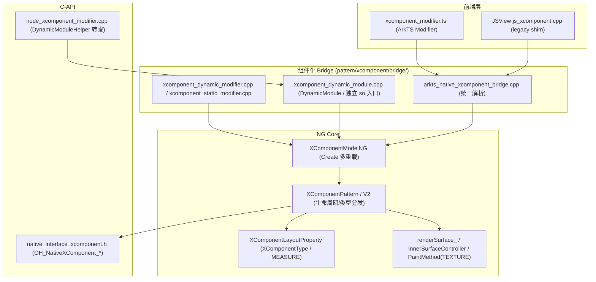
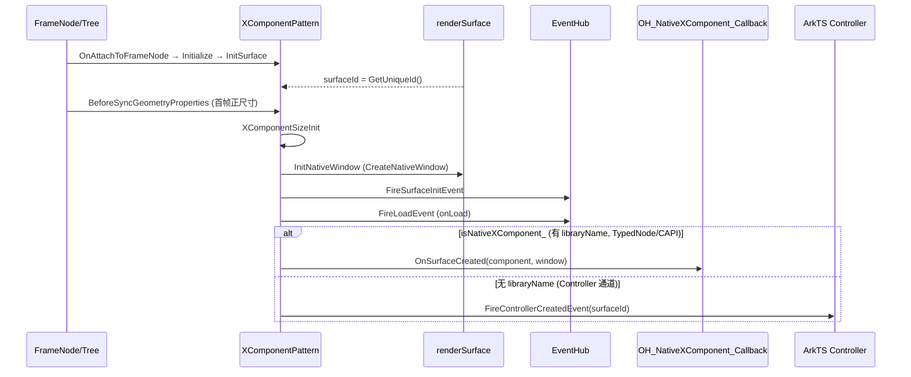

# 架构设计

> 确认目标仓和模块的架构约束、关键设计决策、Spec 拆分方向。

## 设计元数据

| Field | Content |
|-------|---------|
| Design ID | `DESIGN-Func-05-13-01` |
| 关联需求 | 已有能力补录（无独立 requirement.md） |
| 关联 Epic | 无 |
| 目标 Feature | Feat-01 创建、类型与表面生命周期（核心）（后续 Feat-02~08 增量合并） |
| 复杂度 | 复杂 |
| 目标版本 | NDK @since 8；节点 C-API @since 12/15+；TEXTURE 节点 @since 16 |
| Owner | ArkUI SIG |
| 状态 | Baselined（已有实现补录） |

## 需求基线

| 项 | 补充说明 |
|----|----------|
| 已有能力补录 | XComponent 已长期存在，本设计回溯固化其创建/类型/表面生命周期架构真相源 |
| 行为真相源 | 当前源码实现即规格；存疑行为以风险/备注标注，不提改法 |

## 上下文和现状

### 涉及仓和模块

| 仓库 | 补充架构说明 |
|------|--------------|
| ace_engine | XComponent 全部实现在本仓：NG pattern、bridge（组件化）、legacy components、NDK interface |

### 调用链层级分析

| 层 | 模块 | 职责 | 修改类型 |
|----|------|------|----------|
| 前端 JS/ArkTS | `bridge/declarative_frontend/jsview/js_xcomponent.cpp`、`bridge/.../nativeModule/` | 声明式组件属性解析（legacy 入口，现 thin shim） | 不改（补录） |
| 组件化 Bridge | `components_ng/pattern/xcomponent/bridge/arkts_native_xcomponent_bridge.cpp`、`xcomponent_dynamic_modifier.cpp`、`xcomponent_dynamic_module.cpp` | 统一参数解析、Dynamic/Static Modifier、DynamicModule（独立 so 入口） | 不改（补录） |
| Model | `components_ng/pattern/xcomponent/xcomponent_model_ng.cpp`、`xcomponent_model_static.cpp` | Create 多重载、属性写入、节点/类型节点创建 | 不改（补录） |
| Pattern | `components_ng/pattern/xcomponent/xcomponent_pattern.cpp/.h`、`xcomponent_pattern_v2.cpp` | 生命周期、表面管理、类型分发、回调派发 | 不改（补录） |
| Property | `xcomponent_layout_property.h` | XComponentType 属性（PROPERTY_UPDATE_MEASURE） | 不改（补录） |
| Render/Surface | `xcomponent_paint_method.cpp`、`renderSurface_`、`xcomponent_inner_surface_controller.cpp` | TEXTURE 绘制、native 窗口/surface 承载 | 不改（补录） |
| Node C-API | `core/interfaces/native/node/node_xcomponent_modifier.cpp`、`interfaces/native/node/style_modifier.cpp` | NODE_XCOMPONENT_* 属性 set/get/reset、DynamicModuleHelper 转发 | 不改（补录） |
| 经典 NDK | `interfaces/native/native_interface_xcomponent.h/.cpp`、`components/xcomponent/native_interface_xcomponent_impl.cpp` | OH_NativeXComponent_* C API 与回调派发 | 不改（补录） |

- [x] 调用链每一层都已覆盖（前端→Bridge→Model→Pattern→Property→Render→C-API→NDK）
- [x] 每层职责边界清晰
- [x] 每层修改类型明确（均为补录，不改实现）

### 适用架构规则

| Rule ID | 适用原因 | 设计结论 | 验证方式 |
|---------|----------|----------|----------|
| OH-ARCH-LAYERING | 前端→Bridge→Model→Pattern 多层调用 | 调用方向自顶向下，Bridge 统一收口 | 架构评审 |
| OH-ARCH-COMPONENT-BUILD | XComponent 已组件化，bridge/ + 独立 so | 经 DynamicModuleHelper("XComponent") 动态加载 | 构建验证 |
| OH-ARCH-API-LEVEL | 涉及 Public NDK + 节点 C-API | NDK since 8 公开；节点 C-API since 12/15+ | API 评审/XTS |
| OH-ARCH-ERROR-LOG | setAttribute 错误码 401/106102；NDK 0/-2 | 错误码已固化 | 单测 |

## 不涉及项承接

| 维度 | 设计结论 |
|------|----------|
| 控制器表面尺寸/画布 | 属 Feat-02，本设计不展开 |
| 输入事件（touch/mouse/key/focus） | 属 Feat-03 |
| SurfaceHolder/SurfaceCallback V2 | 属 Feat-04（since 18+ 现代表面模型） |
| 帧率/DisplaySync | 属 Feat-05 |
| HDR | 属 Feat-06 |
| AI analyzer | 属 Feat-07 |
| 无障碍 provider | 属 Feat-08 |

## 关键设计决策

| 决策 ID | 问题 | 推荐方案 | 探索过的替代方案 | 取舍理由 | 影响 |
|---------|------|----------|------------------|----------|------|
| ADR-1 | 表面生命周期如何派发到 native | 以 `libraryName` 是否有值为开关：有→创建 OH_NativeXComponent 走 NDK 回调；无→走 ArkTS XComponentController 事件 | 统一单通道 | 双通道兼容历史 NDK（since 8）与纯 ArkTS 场景；native 模块需 OH_NativeXComponent 句柄 | AC-1.4/1.5/5.3 |
| ADR-2 | XComponentType 枚举如何对外暴露 | 内部 4 值（UNKNOWN/SURFACE/COMPONENT/TEXTURE/NODE）；C-API 仅暴露 SURFACE(0)/TEXTURE(2)，数值有间隔 | C-API 暴露全部 4 值 | 数值间隔对齐内部枚举；COMPONENT/NODE 经 ArkTS 字符串/节点类型可达，避免 C-API 语义过载 | AC-6.4 |
| ADR-3 | 未知/空 type 字符串如何处理 | 一律解析为 SURFACE（默认）；TEXTURE 无字符串别名 | 报错 | 容错历史代码；TEXTURE 仅数字/节点类型可达 | AC-1.3 |
| ADR-4 | id 为空如何处理 | 内部合成 `nodeId_<n>`，永不为空，仍作 XComponentClient map key | 拒绝空 id | 保证 map key 永远有效 | AC-1.2 |
| ADR-5 | NODE 类型原子性与焦点矛盾 | 保留 IsAtomicNode=true 且 GetFocusPattern={SCOPE,true}（原子但子树焦点） | 强制一致 | NODE 需承载子树焦点同时被框架当叶子处理 | AC-2.1/2.4（已知张力，标风险） |
| ADR-6 | onLoad/onDestroy 何时触发 | onLoad：首帧正尺寸时（XComponentSizeInit，native window 已建）；onDestroy：OnDetachFromFrameNode（已 init） | 创建即触发 | 需正尺寸才能建 native window，避免零尺寸表面 | AC-3.1/3.3 |
| ADR-7 | 节点 C-API reset 行为 | reset TYPE→SURFACE(0)；reset ID 静默 no-op（无 resetter） | ID 也 reset | ID 无合理默认重置值；保持 map key 稳定 | AC-6.5/6.6（标风险：与 SDK reset 语义可能偏差） |
| ADR-8 | 经典 NDK 回调派发归属 | NG pattern 直接派发仅限 TypedNode/CAPI/static；声明式+libraryname 走 legacy render 层 | 全部 NG 派发 | 历史 legacy 路径仍服务于声明式+native 模块场景 | AC-5.3（标风险：dispatch 分裂） |

## 设计骨架

### 骨架范围

| 骨架项 | 目标 | 不包含 | 验证方式 |
|--------|------|--------|----------|
| 创建与构造参数 | 固化 id/type/libraryName/soPath/controller/screenId 解析 | 控制器方法（Feat-02） | 代码评审 |
| 类型行为 | 固化四类型差异 | — | 代码评审 |
| 表面生命周期双通道 | 固化 ArkTS Controller + NDK 通道 | V2 SurfaceHolder（Feat-04） | 代码评审 + C-API 单测 |

### 骨架 Spec 拆分

| Task ID | 目标 | 受影响文件 | AC |
|---------|------|-----------|-----|
| TASK-SKELETON-1 | Feat-01 创建/类型/表面生命周期规格 | `Feat-01-creation-type-surface-lifecycle-spec.md` | AC-1~6 |

## 后续 Task 拆分

| Task ID | 目标 | 受影响文件 | 依赖 |
|---------|------|-----------|------|
| TASK-01 | Feat-01 规格补录（本设计基线） | `Feat-01-...-spec.md` | — |
| TASK-02~08 | Feat-02~08 增量补录（控制器/输入/V2/帧率/HDR/analyzer/无障碍） | 对应 `Feat-NN-...-spec.md`（增量合并本 design.md） | TASK-01 |

## API 签名、Kit 与权限

### 新增 API

| API 签名 | 类型 | Kit | d.ts 位置 | 权限要求 | SysCap |
|----------|------|-----|-----------|----------|--------|
| `XComponent(options: XComponentOptions)` | Public | ArkUI | `<OH_ROOT>/interface/sdk-js/api/@internal/component/ets/x_component.d.ts`（待 SDK 仓核验） | 无 | SystemCapability.ArkUI.ArkUI.Full |
| `OH_NativeXComponent_RegisterCallback(component, callback)` | Public（NDK） | ArkUI_NDK | `interfaces/native/native_interface_xcomponent.h` | 无 | SystemCapability.ArkUI.ArkUI.Full |
| `setAttribute(NODE_XCOMPONENT_ID/TYPE)` | Public（节点 C-API） | ArkUI_NDK | `interfaces/native/native_node.h` | 无 | SystemCapability.ArkUI.ArkUI.Full |

### 变更/废弃 API

无。

## 构建系统影响

### BUILD.gn 变更

```text
无变更（已有能力补录）。
组件化结构：frameworks/core/components_ng/pattern/xcomponent/bridge/ 经 DynamicModuleHelper("XComponent") 动态加载独立组件 so。
```

### bundle.json 变更

无变更。

## 可选设计扩展

### 架构图



### 时序设计



### 数据模型设计

| 类型 | 定义 | 位置 |
|------|------|------|
| `XComponentType`（内部） | UNKNOWN(-1)/SURFACE(0)/COMPONENT(1)/TEXTURE(2)/NODE(3) | `components/common/layout/constants.h` |
| `ArkUI_XComponentType`（C-API） | SURFACE(0)/TEXTURE(2) | `node_attributes/xcomponent.h` |
| `OH_NativeXComponent_Callback` | {OnSurfaceCreated/Changed/Destroyed/DispatchTouchEvent} | `native_interface_xcomponent.h` |
| `XComponentOptions`（Bridge） | {id?, type, libraryName?, soPath?, controller?, screenId?} | `arkts_native_xcomponent_bridge.h` |

## 详细设计

### 创建路径分发

`XComponentBridge::Create` 按 `id/controller/type` 选择：
- id=nullopt && controller=null && type∈{SURFACE,TEXTURE} → V2 param-less 路径（`createXComponent`）
- 否则 → V1 parametrized 路径（`createXComponentWithParam`，创建 `XComponentPattern`）

证据：`arkts_native_xcomponent_bridge.cpp:514-554`。

### 表面通道开关

`InitNativeXComponent()` 仅当 `type∈{SURFACE,TEXTURE} && libraryname_.has_value()` 创建 OH_NativeXComponent（`xcomponent_pattern.cpp:162-169`）。`OnSurfaceCreated/Changed/Destroyed` 据此在 NDK 回调（`isNativeXComponent_`）与 Controller 事件间二选一派发（`xcomponent_pattern.cpp:2118-2232`）。

## 风险和开放问题

| 项 | 类型 | 影响 | 处理方式 | Owner |
|----|------|------|----------|-------|
| NODE 原子但 SCOPE 焦点的张力 | 架构 | 中 | 标注为已知设计张力，不改实现；spec AC-2.1/2.4 明示 | ArkUI SIG |
| `ResetOnLoad/ResetOnDestroy` 为 no-op（不清除回调） | API | 中 | 标注源码 vs SDK 潜在偏差；若 SDK 期望 reset 清除则需对齐 | ArkUI SIG |
| NDK 表面回调 dispatch 分裂（NG 直接派发 vs legacy render 派发） | 架构 | 中 | 标注；声明式+libraryname 路径需运行时确认是否仍走 render_xcomponent.cpp | ArkUI SIG |
| `screenId` 经 `Uint32Value` 解析，>UINT32_MAX 被截断 | API | 低 | 标注边界 | ArkUI SIG |
| SDK `.d.ts` 路径未在本仓核验 | API | 低 | 标"待 SDK 仓核验"，落地以 SDK 仓实际为准 | ArkUI SIG |

## 设计审批

- [x] 需求基线已确认，设计覆盖 P0/P1 AC
- [x] 不涉及项已承接，N/A 和展开项都有结论
- [x] 涉及仓和模块职责清楚
- [x] 调用链层级分析完整，每层覆盖到位
- [x] 适用架构规则已识别并形成设计结论
- [x] 分层和子系统边界合规
- [x] API 变更有签名、权限、错误码和兼容性说明
- [x] BUILD.gn/bundle.json 影响明确
- [x] 设计输出和后续 Task 拆分明确
- [x] 关键设计决策有理由和影响说明
- [x] 风险和开放问题有 Owner

**结论:** 通过（已有实现补录）
