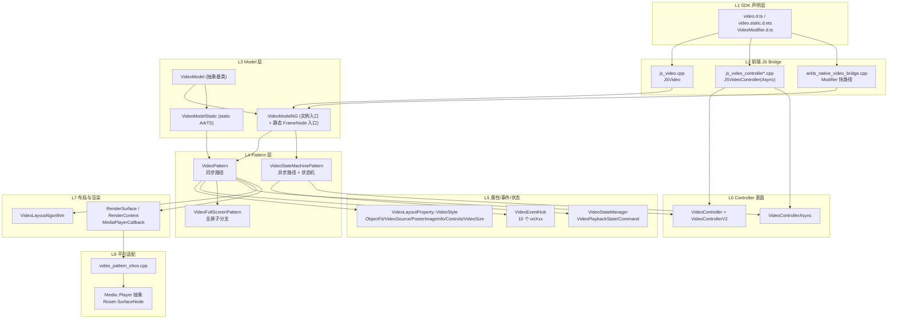
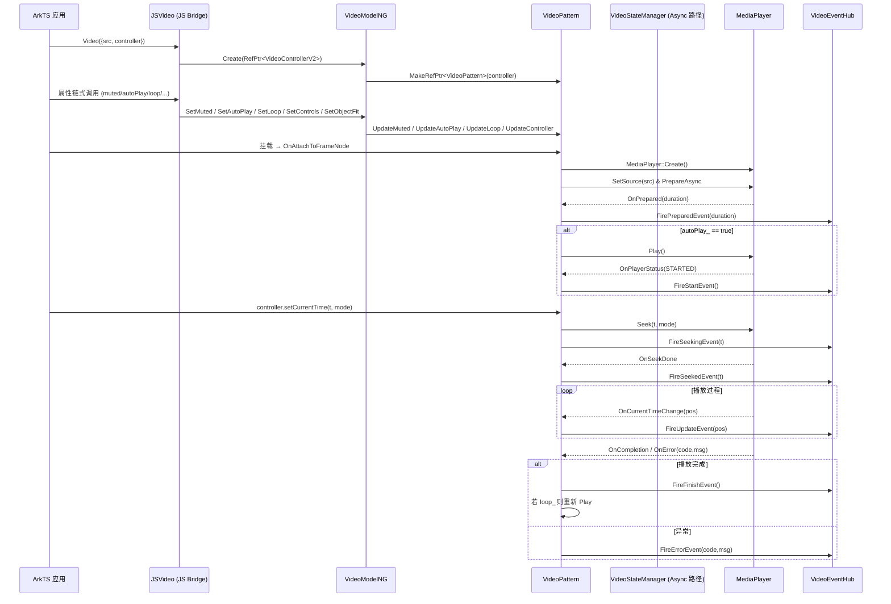
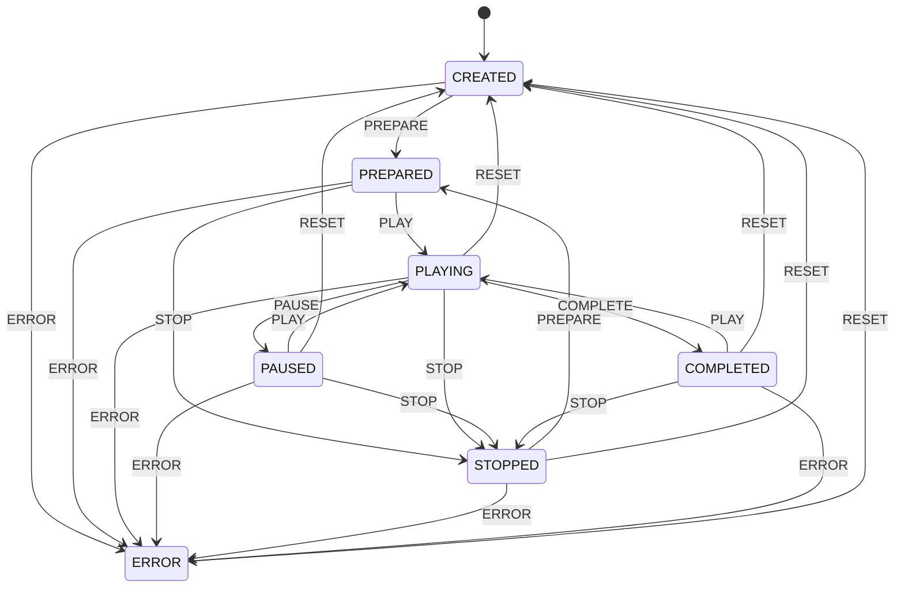

# 架构设计

> 确认目标仓和模块的架构约束、关键设计决策、Spec 拆分方向。

## 设计元数据

| Field | Content |
|-------|---------|
| Design ID | DESIGN-Func-05-13-02 |
| 关联需求 | 已有能力补录（无独立 requirement.md） |
| 关联 Epic | 无 |
| 目标 Feature | Feat-01 显示、播放与事件；Feat-02 控制器与全屏；Feat-03 高级能力（AI/Poster/快捷键） |
| 复杂度 | 关键 |
| 目标版本 | API 7（基线）～ API 26（异步控制器 / static 版本） |
| Owner | ArkUI SIG · Media/Video 组 |
| 状态 | Baselined（已有实现补录） |

## 需求基线

> 需求基线详见 proposal.md。以下仅列出设计阶段需要额外强调的要点。

| 项 | 补充说明（如需） |
|----|------------------|
| API 稳定性 | Video 从 API 7 开始交付，是 ArkUI 中最早的媒体展示组件之一；`objectFit / muted / autoPlay / loop / controls` 及全部 10 个 `onXxx` 事件构成 API 7 的原始表面，不能因补录 spec 而回填限制。 |
| 双控制器共存 | 同步 `VideoController` (API 7) 与异步 `VideoControllerAsync` (API 26) 并行存在；两者背后是不同的 Pattern 主体（`VideoPattern` vs `VideoStateMachinePattern`），设计上要保证两条路径互不干扰。 |
| 内置控制条 | `controls: true` 时内部构建 SVG 按钮 + Slider + 时间文本，属于 Video 组件的"内置子组件树"；需在架构约束里明确它归属 Video 内部实现，非独立组件。 |
| 全屏子节点 | 全屏是一个独立 `FrameNode`（`VideoFullScreenNode`）挂在 root overlay，而非原节点全屏；`fullScreenNodeId_` 只保存 id，节点通过 `FrameNode::GetFrameNode(V2::VIDEO_ETS_TAG, id)` 反查。 |
| C-API 空白 | Video 目前无 `ARKUI_NODE_VIDEO` 定义，无 NDK 接口；这一现状必须在 spec 明示。 |

## 上下文和现状

### 涉及仓和模块

| 仓库 | 补充架构说明 |
|------|--------------|
| `foundation/arkui/ace_engine` | Video 的主实现仓：`frameworks/core/components_ng/pattern/video/` 承载 Pattern/Layout/EventHub/Model 全套；`frameworks/bridge/declarative_frontend/` 承载 JS 桥；`interface/sdk-js/api/@internal/component/ets/video.d.ts`、`interface/sdk-js/api/arkui/component/video.static.d.ets` 定义对外 API 契约。 |
| `foundation/multimedia/player_framework` | Video 依赖的 `Media::Player` 通过 `core/components_ng/render/media_player.h` 抽象接入，负责实际的解码、渲染时钟和 Seek。 |
| `foundation/graphic/graphic_2d` | 通过 `RenderSurface` 与 Rosen `SurfaceNode` 打通视频画面到窗口合成。 |

### 调用链层级分析

从上至下逐层扫描 Video 组件的调用链：

| 层 | 模块 | 职责 | 修改类型 |
|----|------|------|----------|
| L1 SDK 声明层 | `interface/sdk-js/api/@internal/component/ets/video.d.ts` / `interface/sdk-js/api/arkui/component/video.static.d.ets` / `interface/sdk-js/api/arkui/VideoModifier.d.ts` | 对外 API 契约（枚举、`VideoOptions`、`VideoAttribute`、`VideoController*`） | 无（补录 spec 不改契约） |
| L2 前端 JS Bridge | `frameworks/bridge/declarative_frontend/jsview/js_video.{h,cpp}`、`js_video_controller.{h,cpp}`、`js_video_controller_async.{h,cpp}`；`engine/jsi/nativeModule/arkts_native_video_bridge.{h,cpp}` | JS/ArkTS 值 ↔ C++ 类型转换；解析 `VideoOptions`；Modifier 快路径注册 22 组 `Set/Reset` | 无 |
| L3 Model 层 | `frameworks/core/components_ng/pattern/video/video_model.h`；`video_model_ng.{h,cpp}`；`video_model_static.{h,cpp}` | 统一的属性 setter 入口；同时提供实例方法与 `FrameNode*` 静态入口，支持 Modifier | 无 |
| L4 Pattern 层 | `frameworks/core/components_ng/pattern/video/video_pattern.{h,cpp}`；`video_full_screen_pattern.{h,cpp}`；`video_state_machine_pattern.{h,cpp}`；`video_state_machine_full_screen_pattern.{h,cpp}` | 视频行为主体：源准备、播放/暂停/停止、全屏切换、状态机维护、内置控制条构建、快捷键处理、AI overlay | 无 |
| L5 属性/事件/状态 | `video_layout_property.h`（`VideoStyle` 属性组）；`video_event_hub.h`（10 个事件）；`video_state_manager.{h,cpp}`（`VideoPlaybackState`/`VideoPlaybackCommand`/`VideoStateMachine`）；`video_accessibility_property.{h,cpp}` | 属性/事件/状态机的载体 | 无 |
| L6 Controller 表面 | `video_controller_v2.h`（`VideoController` + `VideoControllerV2`）；`video_controller_async.{h,cpp}` | 用户可脚本触发的播放控制指令 → Pattern impl 回调 | 无 |
| L7 布局与渲染 | `video_layout_algorithm.{h,cpp}`；`media_player_callback.h`；`RenderSurface`、`RenderContext` | 计算显示区域；订阅 Media 事件；将解码画面合成到窗口 | 无 |
| L8 平台适配 | `video_pattern_ohos.cpp`；`adapter/ohos/entrance/media_player_ohos.cpp`；`adapter/ohos/entrance/render_surface_ohos.cpp`（等价路径） | 对接 `Media::Player`、`SurfaceNode` 等 OHOS 平台能力 | 无 |
| L9 依赖服务 | `Media::Player`（player_framework）、Graphic Rosen（graphic_2d） | 解码、音视频同步、Surface 合成 | 依赖使用 |

检查项：
- [x] 调用链每一层都已覆盖（从 SDK 声明层到依赖服务层）
- [x] 每层职责边界清晰，无跨层违规调用（Model 层不直接持 MediaPlayer；Pattern 通过 `mediaPlayer_/renderSurface_/renderContextForMediaPlayer_` 三件套隔离）
- [x] 每层修改类型明确（补录 spec，不涉及任何代码变更）

### 适用架构规则

| Rule ID | 适用原因 | 设计结论 | 验证方式 |
|---------|----------|----------|----------|
| OH-ARCH-LAYERING | 涉及 SDK → JS Bridge → Model → Pattern → Property/Render 多层调用 | 严格自上而下：Pattern 不反向依赖 JS Bridge；`VideoModelNG` 通过 `ViewStackProcessor::GetInstance()->GetMainFrameNode()` 获取当前节点，是 Model 层唯一允许触及全局 stack 的位置 | 架构评审/依赖检查 |
| OH-ARCH-SUBSYSTEM | 依赖 `foundation/multimedia/player_framework` 与 `foundation/graphic/graphic_2d` | ArkUI 只通过 `core/components_ng/render/media_player.h` 的 `MediaPlayer::Create()` 工厂访问 Media；不直接依赖 `Media::Player` 头文件；Rosen SurfaceNode 走 `RenderSurface`/`RenderContext` 抽象 | 代码评审/依赖检查 |
| OH-ARCH-IPC-SAF | 不直接跨进程 | Video 组件本身单进程；跨进程由 `Media::Player` 内部处理，ArkUI 不感知 SA/IPC | N/A |
| OH-ARCH-API-LEVEL | 涉及 `@since 7 / 8 / 12 / 15 / 18 / 20 / 22 / 26` 多个版本 | 保留每个 API 的原始 `@since`；同名 API 因回填增量含义时（如 `onError` API 20 加入 `ErrorCallback`），在 spec 兼容性声明中显式列出 | API 评审/XTS |
| OH-ARCH-COMPONENT-BUILD | Video 归属 `ace_compatible_components` 拆分候选，`bundle.json` 已声明依赖 `player_framework` | `frameworks/core/components_ng/components.gni` 已包含 video 目录；无需新增 build 依赖 | 构建验证 |
| OH-ARCH-ERROR-LOG | 播放异常需要透出错误码 | `MediaPlayer` 返回的 `errorCode` 经 `VideoPattern::FireError(int32_t code, const std::string& message)` 打包成 `{"code","name":"BusinessError","message"}` 传给 `onError` (`video_event_hub.h:105`)；`TAG_LOGD(AceLogTag::ACE_VIDEO, ...)` 是 Video 组件统一日志 tag | 单测/hilog |

## 不涉及项承接

> proposal.md 已完成 N/A 判定。本节仅对 proposal 中标记为"涉及"且需展开设计的维度给出结论。

| 维度 | 设计结论 |
|------|----------|
| 无障碍 | 由 `VideoAccessibilityProperty` 承接，控制条子节点各按钮的可读文案由 `video_theme.h` 提供；本设计不新增无障碍策略。 |
| 深色模式 | `OnColorConfigurationUpdate()` (`video_pattern.h:105`) 触发主题重新解析，控制条 SVG、按钮背景、时间文本颜色跟随主题；开发者无需额外配置。 |
| 多窗口 | Video 与常规 FrameNode 一致，随窗口尺寸变化触发 `OnAreaChangedInner`；全屏切换是 overlay 挂载而非窗口切换。 |
| 版本升级 | API 26 新增 `VideoControllerAsync` 与全新状态机 Pattern；同步 API 7 Controller 保留，两条路径并存不废弃。 |

## 关键设计决策

| 决策 ID | 问题 | 推荐方案 | 探索过的替代方案 | 取舍理由 | 影响 |
|--------|------|----------|------------------|----------|------|
| ADR-1 | Video 显示属性存哪里？（LayoutProperty vs Pattern 成员） | 混合方案：`objectFit / VideoSource / PosterImageInfo / Controls / VideoSize` 五项落到 `VideoLayoutProperty::VideoStyle` 属性组（`video_layout_property.h:65-70`）；`muted / autoPlay / loop / progressRate / surfaceBgColor_ / contentTransition_ / showFirstFrame_ / isEnableAnalyzer_ / isEnableShortcutKey_` 直接落到 Pattern 成员（`video_pattern.h:455-500`） | (a) 全部放 LayoutProperty：属性变更就会触发 Measure/Layout，浪费无关帧；(b) 全部放 Pattern：Modifier 快路径拿不到 FrameNode 上下文 | 按"是否影响布局"划分：影响布局的走 Property + `PROPERTY_UPDATE_MEASURE` 标记，剩余状态字段走 Pattern 成员。已在生产多年，是既定实现。 | Model 层每个 setter 都要判断落点；Modifier 静态入口需要同时覆盖 Property + Pattern 双写。 |
| ADR-2 | 内置控制条如何构建？ | Video 在 `CreateControlBar()`（`video_pattern.h:133`）内部创建独立 `FrameNode`，包含 SVG 播放按钮、Slider、时间文本、全屏按钮，作为 Video 的子节点挂载；受 `controls: bool` 控制显示 | (a) 每个按钮走独立组件：无法统一样式与主题；(b) 控制条完全交给应用：违背 API 7 契约 | API 7 就承诺"开箱即用控制条"，内部构建是唯一符合契约的方案。控制条使用 `resource/` 内置 SVG 与 `video_theme.h` 主题，独立于业务代码。 | 控制条状态与 Pattern 强耦合（暂停/播放图标切换、Slider 位置同步）；无法通过属性完全禁用控制条内部逻辑，只能通过 `controls: false` 隐藏。 |
| ADR-3 | 全屏采用节点替换还是节点扩张？ | 节点替换：全屏时创建新的 `VideoFullScreenNode` + `VideoFullScreenPattern`（`video_full_screen_node.h:25-36`）挂到 root overlay，`RecoverState()`（`video_pattern.h:209`）把当前 Pattern 状态克隆到全屏 Pattern；退出全屏时反向克隆 | (a) 就地扩张原节点尺寸：受父容器约束、层级问题、无法覆盖 SystemUI；(b) 用系统 API 进入横屏 Activity：跨进程复杂、状态迁移困难 | 节点替换让全屏节点直接挂 root，绕开父容器 clip 与 stacking；`fullScreenNodeId_` 只保留 id，通过 `FrameNode::GetFrameNode(V2::VIDEO_ETS_TAG, id)` 反查节点。 | 状态迁移窗口存在：`RecoverState` 期间原 MediaPlayer 需要交接；`VideoLayoutProperty::fullScreenReset()`（`video_layout_property.h:50`）会 Reset 并回写 5 项，保证不遗漏关键属性。 |
| ADR-4 | 同步 API 7 Controller 与 API 26 异步 Controller 如何共存？ | 双 Pattern 分派：`VideoModelNG::Create(RefPtr<VideoControllerV2>)` 创建 `VideoPattern`（同步路径）；`VideoModelNG::Create(RefPtr<VideoControllerAsync>)` 创建 `VideoStateMachinePattern`（异步路径，内含 `VideoStateManager`）；所有 setter 先 `DynamicCast<VideoStateMachinePattern>`，命中就走异步分支，否则走 `VideoPattern` 分支（`video_model_ng.cpp:286-299` 即为典范） | (a) 单 Pattern 兼两条 API：状态机会污染同步路径；(b) 仅保留异步 Pattern：破坏 API 7 契约 | 用 Pattern 类型隔离两个世界，`VideoStateMachinePattern` 独享 `VideoStateManager` 严格状态机，`VideoPattern` 保留原来的宽松直调；两个 Pattern 都继承同一 `Pattern` 基类，属性、事件、控制条子节点复用 | 每个 setter 都要写"先 cast 状态机、失败再 cast 老 Pattern"的模板；Modifier 快路径同样需要双写（见 `SetSurfaceBackgroundColor` 的两次分支）。 |
| ADR-5 | `PlaybackSpeed` 枚举与浮点入参如何统一？ | 前端接受 `number \| string \| PlaybackSpeed`，Model 层归一化为 `double progressRate_`；有效范围 `[SPEED_0_125_X=0.125, SPEED_8_00_X=8.00]`（`video_pattern.cpp:77-78`），越界会记录 `VIDEO_EXCEED_PROGRESS_RATE` 统计事件但 **不拒绝设置**，由 `MediaPlayer::SetPlaybackRate` 决定最终返回值 | (a) 严格拒绝越界值：与已上线容忍策略不一致；(b) 直接把枚举当整数序号：不同版本枚举值扩容会破坏兼容 | 归一化到 `double` 让 API 与内部计算脱耦；越界统计事件供 DFX 观测但不阻断，保留下层 MediaPlayer 的行为兼容 | `PlaybackSpeed` 新枚举（API 22 追加 0.5×/1.5×/3.0×/0.25×/0.125×）不影响旧代码；`enableShortcutKey` 快捷键也复用 `progressRate_` 通道 |
| ADR-6 | `onError` 事件签名如何兼容 API 7 (`() => void`) 与 API 20 (`ErrorCallback`)？ | 事件 hub 维护单一 `onError_` 回调，`FireErrorEvent()`（`video_event_hub.h:93-104`）不带参，`FireErrorEvent(int32_t code, const std::string& message)`（`video_event_hub.h:105-120`）打包 `{"code","name":"BusinessError","message"}` JSON；前端根据回调签名解包 | (a) 拆两个回调字段：破坏 API 契约；(b) 全部走 JSON：老 API 7 用户无需字段 | 保留单一存储，触发时按错误来源决定用哪个 Fire；前端桥判断 JS 回调形参数量做兼容 | `onError` 回调可能收到空 JSON 或含 `code` JSON 两种形态，业务需按 API 版本处理 |

## 设计骨架

### 骨架范围

| 骨架项 | 目标 | 不包含 | 验证方式 |
|-------|------|-------|---------|
| Video 组件已上线全属性/事件规格 | 覆盖 API 7 ~ API 26 之间所有 `VideoAttribute` 属性/事件、`VideoOptions` 构造字段、`VideoController*` 方法 | C-API 节点/属性（当前不存在，spec 中标注"未实现"） | 与 `interface/sdk-js/api/@internal/component/ets/video.d.ts`、`interface/sdk-js/api/arkui/component/video.static.d.ets` 逐条对表 |
| 内置控制条与全屏行为 | 描述 `controls: true` 时控制条构建、`requestFullscreen/exitFullscreen` 的节点替换机制 | 应用自绘控制条（不属于 Video 组件承诺） | 源码交叉引用 + 端到端行为观察 |
| 播放状态机与异步指令语义 | 覆盖 `VideoControllerAsync` 的 4 个异步方法 + `VideoStateManager` 状态转换规则 + Pending 命令覆写策略 | 同步 Controller 的重入语义（历史保留，不新增约束） | `VideoStateMachine::CanPlay/CanPause/…` 断言与状态转移表校验 |

### 骨架 Spec 拆分

| Task ID | 目标 | 受影响文件 | AC |
|--------|------|-----------|-----|
| TASK-SKELETON-1 | Feat-01 显示、播放与事件基线补录 | `Feat-01-video-display-playback-events-spec.md` | AC-1.1 ~ AC-3.4（Feat-01 全部 AC） |
| TASK-SKELETON-2 | Feat-02 控制器与全屏补录 | `Feat-02-video-controller-fullscreen-spec.md` | AC-1.1 ~ AC-2.4（Feat-02 全部 AC） |
| TASK-SKELETON-3 | Feat-03 高级能力（AI/Poster/快捷键）补录 | `Feat-03-video-advanced-capabilities-spec.md` | AC-1.1 ~ AC-3.3（Feat-03 全部 AC） |

## 后续 Task 拆分

> design.md 以 proposal.md 和已批准的 spec.md 为上游输入。本节描述 design 输出到 Plan 阶段的衔接信息。

| Task ID | 目标 | 受影响文件 | 依赖 |
|--------|------|-----------|------|
| TASK-VIDEO-BASELINE-01 | 建立 Video 显示/播放/事件基线规格 | `Feat-01-video-display-playback-events-spec.md` | 无 |
| TASK-VIDEO-BASELINE-02 | 建立 Video 控制器（同步 + 异步 + 状态机）与全屏基线规格 | `Feat-02-video-controller-fullscreen-spec.md` | TASK-VIDEO-BASELINE-01 |
| TASK-VIDEO-BASELINE-03 | 建立 Video 高级能力（AI Analyzer / Poster / 快捷键）基线规格 | `Feat-03-video-advanced-capabilities-spec.md` | TASK-VIDEO-BASELINE-01 |

## API 签名、Kit 与权限

> 本节承接 spec.md "API 变更分析"中识别的 API，给出签名、权限和 d.ts 位置等实现细节。

### 新增 API

（补录场景，"新增"指相对空白基线的所有已有 API；均归属 Kit ArkUI，权限均为无，SysCap 均为 `SystemCapability.ArkUI.ArkUI.Full`。）

#### 构造与显示属性（Feat-01）

| API 签名 | 类型 | Kit | d.ts 位置 | 权限要求 | SysCap |
|---------|------|-----|-----------|----------|--------|
| `Video(value: VideoOptions)` | Public | ArkUI | `interface/sdk-js/api/@internal/component/ets/video.d.ts:718` (`interface VideoInterface`) / static `video.static.d.ets:725` | 无 | `SystemCapability.ArkUI.ArkUI.Full` |
| `VideoOptions.src?: string \| Resource` | Public | ArkUI | `video.d.ts:349` | 无 | 同上 |
| `VideoOptions.currentProgressRate?: number \| string \| PlaybackSpeed` | Public | ArkUI | `video.d.ts:359` | 无 | 同上 |
| `VideoOptions.previewUri?: string \| PixelMap \| Resource` | Public | ArkUI | `video.d.ts:369` | 无 | 同上 |
| `VideoOptions.controller?: VideoController` | Public | ArkUI | `video.d.ts:377` | 无 | 同上 |
| `VideoOptions.imageAIOptions?: ImageAIOptions` | Public | ArkUI | `video.d.ts:411` | 无 | 同上 |
| `VideoOptions.posterOptions?: PosterOptions` | Public | ArkUI | `video.d.ts:428` | 无 | 同上 |
| `VideoOptions.controllerAsync?: VideoControllerAsync` | Public | ArkUI | `video.d.ts:472` | 无 | 同上 |
| `muted(value: boolean): VideoAttribute` | Public | ArkUI | `video.d.ts:759` | 无 | 同上 |
| `autoPlay(value: boolean): VideoAttribute` | Public | ArkUI | `video.d.ts:768` | 无 | 同上 |
| `controls(value: boolean): VideoAttribute` | Public | ArkUI | `video.d.ts:777` | 无 | 同上 |
| `loop(value: boolean): VideoAttribute` | Public | ArkUI | `video.d.ts:795` | 无 | 同上 |
| `objectFit(value: ImageFit): VideoAttribute` | Public | ArkUI | `video.d.ts:786` | 无 | 同上 |
| `surfaceBackgroundColor(color: ColorMetrics): VideoAttribute` | System | ArkUI | `video.d.ts:995` | 无 | 同上 |

#### 事件回调（Feat-01）

| API 签名 | 类型 | Kit | d.ts 位置 | 权限要求 | SysCap |
|---------|------|-----|-----------|----------|--------|
| `onStart(event: VoidCallback): VideoAttribute` | Public | ArkUI | `video.d.ts:822` | 无 | 同上 |
| `onPause(event: VoidCallback): VideoAttribute` | Public | ArkUI | `video.d.ts:840` | 无 | 同上 |
| `onFinish(event: VoidCallback): VideoAttribute` | Public | ArkUI | `video.d.ts:858` | 无 | 同上 |
| `onFullscreenChange(callback: Callback<FullscreenInfo>): VideoAttribute` | Public | ArkUI | `video.d.ts:876` | 无 | 同上 |
| `onPrepared(callback: Callback<PreparedInfo>): VideoAttribute` | Public | ArkUI | `video.d.ts:894` | 无 | 同上 |
| `onSeeking(callback: Callback<PlaybackInfo>): VideoAttribute` | Public | ArkUI | `video.d.ts:912` | 无 | 同上 |
| `onSeeked(callback: Callback<PlaybackInfo>): VideoAttribute` | Public | ArkUI | `video.d.ts:930` | 无 | 同上 |
| `onUpdate(callback: Callback<PlaybackInfo>): VideoAttribute` | Public | ArkUI | `video.d.ts:948` | 无 | 同上 |
| `onError(event: VoidCallback \| ErrorCallback): VideoAttribute` | Public | ArkUI | `video.d.ts:975`（`ErrorCallback` 分支 @since 20） | 无 | 同上 |
| `onStop(event: Callback<void>): VideoAttribute` | Public | ArkUI | `video.d.ts:983` | 无 | 同上 |

#### 控制器（Feat-02）

| API 签名 | 类型 | Kit | d.ts 位置 | 权限要求 | SysCap |
|---------|------|-----|-----------|----------|--------|
| `class VideoController { constructor() }` | Public | ArkUI | `video.d.ts:494` | 无 | 同上 |
| `VideoController.start(): void` | Public | ArkUI | `video.d.ts:507` | 无 | 同上 |
| `VideoController.pause(): void` | Public | ArkUI | `video.d.ts:520` | 无 | 同上 |
| `VideoController.stop(): void` | Public | ArkUI | `video.d.ts:533` | 无 | 同上 |
| `VideoController.setCurrentTime(value: number): void` | Public | ArkUI | `video.d.ts:546` | 无 | 同上 |
| `VideoController.setCurrentTime(value: number, seekMode: SeekMode): void` | Public | ArkUI | `video.d.ts:565` | 无 | 同上 |
| `VideoController.requestFullscreen(value: boolean): void` | Public | ArkUI | `video.d.ts:578` | 无 | 同上 |
| `VideoController.exitFullscreen(): void` | Public | ArkUI | `video.d.ts:591` | 无 | 同上 |
| `VideoController.reset(): void` | Public | ArkUI | `video.d.ts:604` (@since 12) | 无 | 同上 |
| `class VideoControllerAsync { constructor() }` | Public | ArkUI | `video.d.ts:625` (@since 26) | 无 | 同上 |
| `VideoControllerAsync.start(): Promise<void>` | Public | ArkUI | `video.d.ts:637` (@since 26) | 无 | 同上 |
| `VideoControllerAsync.pause(): Promise<void>` | Public | ArkUI | `video.d.ts:649` (@since 26) | 无 | 同上 |
| `VideoControllerAsync.stop(): Promise<void>` | Public | ArkUI | `video.d.ts:661` (@since 26) | 无 | 同上 |
| `VideoControllerAsync.setCurrentTime(value: double, seekMode?: SeekMode): void` | Public | ArkUI | `video.d.ts:678` (@since 26) | 无 | 同上 |
| `VideoControllerAsync.requestFullscreen(value: boolean): void` | Public | ArkUI | `video.d.ts:690` (@since 26) | 无 | 同上 |
| `VideoControllerAsync.exitFullscreen(): void` | Public | ArkUI | `video.d.ts:702` (@since 26) | 无 | 同上 |
| `VideoControllerAsync.reset(): Promise<void>` | Public | ArkUI | `video.d.ts:711` (@since 26) | 无 | 同上 |

#### 高级能力（Feat-03）

| API 签名 | 类型 | Kit | d.ts 位置 | 权限要求 | SysCap |
|---------|------|-----|-----------|----------|--------|
| `enableAnalyzer(enable: boolean): VideoAttribute` | Public | ArkUI | `video.d.ts:966` (@since 12) | 无 | 同上 |
| `analyzerConfig(config: ImageAnalyzerConfig): VideoAttribute` | Public | ArkUI | `video.d.ts:975` (@since 12) | 无 | 同上 |
| `enableShortcutKey(enabled: boolean): VideoAttribute` | Public | ArkUI | `video.d.ts:1048` (@since 15) | 无 | 同上 |
| `PosterOptions.showFirstFrame?: boolean` | Public | ArkUI | `video.d.ts:317` (@since 18) | 无 | 同上 |
| `PosterOptions.contentTransitionEffect?: ContentTransitionEffect` | Public | ArkUI | `video.d.ts:326` (@since 21) | 无 | 同上 |

### 变更/废弃 API

| 原有 API | 变更类型 | 新 API | 迁移说明 |
|---------|---------|--------|----------|
| `onError(event: VoidCallback)` (API 7) | 变更（联合类型扩展） | `onError(event: VoidCallback \| ErrorCallback)` (API 20) | 老 API 7 用户无需迁移；期望获取错误码/消息的用户升级到 `ErrorCallback` 签名 |
| `VideoController` 全套同步方法 (API 7) | 无变更 | 同步 API 继续存在 | 追加异步 API `VideoControllerAsync`（API 26），并未废弃同步 API；两者可择一使用，通过 `VideoOptions.controllerAsync` 触发异步路径 |

## 构建系统影响

### BUILD.gn 变更

无变更。Video 已在 `frameworks/core/components_ng/pattern/video/BUILD.gn` 与 `frameworks/core/components_ng/components.gni` 中就位，`ace_engine` 构建目标默认包含 video 目录。

### bundle.json 变更

无变更。`bundle.json` 已声明依赖 `player_framework` 与 `graphic_2d`，Video 使用现有依赖，无需新增 `deps/public_deps/data_deps`。

## 可选设计扩展

### 架构图



### 数据流/控制流

| 步骤 | 调用方 | 被调用方 | 数据/接口 | 说明 |
|------|--------|----------|-----------|------|
| 1 | ArkTS 声明 `Video({src, controller})` | `JSVideo::Create` | `VideoOptions` | JS bridge 解析选项，构造 `VideoControllerV2` 或 `VideoControllerAsync` |
| 2 | `JSVideo::Create` | `VideoModelNG::Create(controller)` | `RefPtr<VideoControllerV2>` | 根据 controller 类型创建 `VideoPattern` 或 `VideoStateMachinePattern` 并挂到 FrameNode |
| 3 | `VideoPattern::OnModifyDone` | `VideoPattern::PrepareMediaPlayer` | `videoSrcInfo_.src_` | 首次或 src 变更时初始化 MediaPlayer；`SetSourceForMediaPlayer` 装填 src/bundle/module |
| 4 | `MediaPlayerCallback::OnPrepared` | `VideoPattern::OnPrepared` | duration (uint32_t) | Media 层准备完成 → 触发 `VideoEventHub::FirePreparedEvent(duration)` → 检查 `autoPlay_` 决定是否自动 `Start()` |
| 5 | `VideoController::Start()` | `startImpl_()` → `VideoPattern::Start` | 无 | 同步 impl 回调；`VideoPattern::Start` → `mediaPlayer_->Play()` |
| 6 | `VideoControllerAsync::Start(callback)` | `VideoStateManager::HandleStateTransition(PLAY, callback)` | `AsyncCommandCallback` | 校验状态 → 设置 pending → 调 `mediaPlayer_->Play()` → 收到 `PlaybackStatus::STARTED` 后回调 |
| 7 | `MediaPlayerCallback::OnCurrentTimeChange` | `VideoPattern::OnCurrentTimeChange` | currentPos (uint32_t) | 更新 `currentPos_`；`VideoEventHub::FireUpdateEvent(currentPos)`；控制条 Slider 位置刷新 |
| 8 | 用户点击控制条全屏按钮 | `SetFullScreenButtonCallBack` → `VideoController::RequestFullscreen` | 无 | 通过 `videoControllerV2_` 走 impl 回调；命中 `VideoPattern::FullScreen` 创建 `VideoFullScreenNode` |
| 9 | 异常路径：src 无效 / MediaPlayer 报错 | `VideoPattern::OnError(code, msg)` | `code:int32_t, message:string` | `FireErrorEvent(code, msg)` 打 JSON `{code, name:"BusinessError", message}` |

### 时序设计



### 数据模型设计

#### API 层类型（TypeScript / ArkTS）

```typescript
// interface/sdk-js/api/@internal/component/ets/video.d.ts:340-473
interface VideoOptions {
  src?: string | Resource;
  currentProgressRate?: number | string | PlaybackSpeed;
  previewUri?: string | PixelMap | Resource;
  controller?: VideoController;
  imageAIOptions?: ImageAIOptions;   // @since 12
  posterOptions?: PosterOptions;     // @since 18
  controllerAsync?: VideoControllerAsync; // @since 26
}

enum PlaybackSpeed {
  Speed_Forward_0_75_X = 0,   // @since 8
  Speed_Forward_1_00_X = 1,
  Speed_Forward_1_25_X = 2,
  Speed_Forward_1_75_X = 3,
  Speed_Forward_2_00_X = 4,
  SPEED_FORWARD_0_50_X = 5,   // @since 22
  SPEED_FORWARD_1_50_X = 6,   // @since 22
  SPEED_FORWARD_3_00_X = 7,   // @since 22
  SPEED_FORWARD_0_25_X = 8,   // @since 22
  SPEED_FORWARD_0_125_X = 9,  // @since 22
}

enum SeekMode {
  PreviousKeyframe = 0,    // @since 8
  NextKeyframe = 1,
  ClosestKeyframe = 2,
  Accurate = 3,
}
```

#### 框架层结构体（C++）

```cpp
// frameworks/core/components_ng/pattern/video/video_styles.h:25-38
struct VideoSourceInfo {
  std::string src_;
  std::string bundleName_ = "";
  std::string moduleName_ = "";
  bool operator==(const VideoSourceInfo&) const;
  bool operator!=(const VideoSourceInfo&) const;
};

// frameworks/core/components_ng/pattern/video/video_styles.h:40
struct VideoStyle {
  ACE_DEFINE_PROPERTY_GROUP_ITEM(VideoSource, VideoSourceInfo);
  ACE_DEFINE_PROPERTY_GROUP_ITEM(ObjectFit, ImageFit);
  ACE_DEFINE_PROPERTY_GROUP_ITEM(PosterImageInfo, ImageSourceInfo);
  ACE_DEFINE_PROPERTY_GROUP_ITEM(Controls, bool);
  ACE_DEFINE_PROPERTY_GROUP_ITEM(VideoSize, SizeF);
};

// frameworks/core/components_ng/pattern/video/video_utils.h:21-30
enum class SeekMode {
  SEEK_PREVIOUS_SYNC = 0,   // 前一关键帧
  SEEK_NEXT_SYNC = 1,       // 下一关键帧
  SEEK_CLOSEST_SYNC = 2,    // 最近关键帧
  SEEK_CLOSEST = 3,         // 精确定位
};

// frameworks/core/components_ng/pattern/video/video_state_manager.h:27-46
enum class VideoPlaybackState {
  CREATED, PREPARED, PLAYING, PAUSED, STOPPED, COMPLETED, ERROR,
};
enum class VideoPlaybackCommand {
  NONE = -1, PREPARE, PLAY, PAUSE, STOP, COMPLETE, ERROR, RESET,
};
```

#### 存储方案

| 数据 | 存储位置 | 更新触发 | 备注 |
|------|----------|----------|------|
| `objectFit / VideoSource / PosterImageInfo / Controls / VideoSize` | `VideoLayoutProperty::VideoStyle` 属性组 | `ACE_UPDATE_LAYOUT_PROPERTY` | `PROPERTY_UPDATE_MEASURE`/`PROPERTY_UPDATE_LAYOUT` 触发布局重刷 |
| `muted_ / autoPlay_ / loop_ / progressRate_` | `VideoPattern` 成员 | `Update*` 直接赋值 | 不触发 Measure/Layout；生效于下一次 `OnModifyDone` 或播放动作 |
| `surfaceBgColor_ / contentTransition_ / showFirstFrame_` | `VideoPattern` 成员 | 直接赋值 | 影响 SurfaceNode 背景色 / Poster→Surface 转场 / 首帧行为 |
| `isEnableAnalyzer_ / isEnableShortcutKey_` | `VideoPattern` 成员 | `EnableAnalyzer` / `SetShortcutKeyEnabled` | Analyzer/快捷键专属状态 |
| `currentPos_ / duration_` | `VideoPattern` 成员 | `OnCurrentTimeChange` / `OnPrepared` | 由 MediaPlayer 回调驱动 |
| `state_ / previousState_ / pendingCommand_ / originalIntent_` | `VideoStateManager` 成员 | `HandleStateTransition` | 异步路径专用；同步路径不用状态机 |

### 算法与状态机

#### 播放状态机（VideoStateManager，Feat-02 使用）



允许集见 `video_state_manager.h:50-73`（`CanPlay`/`CanPause`/`CanStop`/`CanSeek`/`CanPrepare`）。Pending 命令覆写规则见 `video_state_manager.h:236-244`：STOP/RESET 可覆写任意 pending；PLAY 与 PAUSE 可互相覆写；同命令不能自覆写；其它组合拒绝。

#### 全屏切换算法（Feat-02 使用）

1. `VideoController::RequestFullscreen(true)` → `VideoPattern::FullScreen()`
2. 通过 `VideoFullScreenNode::CreateFullScreenNode(V2::VIDEO_ETS_TAG, nodeId, ...)`（`video_full_screen_node.h:34`）创建全屏节点，Pattern 为 `VideoFullScreenPattern`
3. `VideoFullScreenPattern::InitFullScreenParam(sourcePattern, layoutProperty)`（`video_full_screen_pattern.cpp:29`）把源 Pattern 状态与属性克隆过来
4. `VideoLayoutProperty::fullScreenReset()`（`video_layout_property.h:50`）在克隆末尾 Reset 后重放 5 项（`VideoSource / ObjectFit / Controls / PosterImageInfo / VideoSize`）
5. 全屏节点挂到 `OverlayManager` 顶层；`fullScreenNodeId_` 记录 id；`VideoEventHub::FireFullScreenChangeEvent(true)`
6. `exitFullscreen` 或 `OnBackPressed`：`VideoFullScreenPattern::ExitFullScreen()`（`video_full_screen_pattern.cpp:91`）反向克隆状态到源 Pattern，移除全屏节点，触发 `FireFullScreenChangeEvent(false)`

### 测试性设计

| 测试层级 | 测试目标 | Mock 策略 | 验证方式 |
|----------|----------|-----------|----------|
| 属性单测 | `Set*` → `Get*` 一致；属性变更触发 `PROPERTY_UPDATE_*` | 无需 Mock | `test/unittest/components_ng/pattern/video/video_property_test.cpp` 类 |
| Pattern 单测 | `OnModifyDone` 流程、控制条构建、`OnKeyEvent` 分发 | Mock `MediaPlayer::Create()` 返回 stub | `video_pattern_test.cpp` |
| 状态机单测 | `VideoStateMachine::CanX` 允许集覆盖；`HandleStateTransition` 各状态入口 | 无需 Mock | `video_state_manager_test.cpp` |
| 事件回调单测 | `FireXxxEvent` 参数序列化格式（JSON key 与顺序） | 无需 Mock | `video_event_hub_test.cpp` |
| 全屏切换集成 | `RequestFullscreen(true)` 后 `GetFullScreenNode()` 非空；`ExitFullscreen` 后为空 | Mock `OverlayManager` | 集成测试 |

### 接口参数规约

| 接口 | 参数 | 类型 | 合法范围 | 非法处理 | 边界说明 |
|------|------|------|----------|----------|----------|
| `Video(VideoOptions)` | `src` | `string \| Resource` | 任意字符串或有效 Resource；空串合法（无源） | 空串下不启动 MediaPlayer，`OnModifyDone` 早退 | `src` 为空串与 undefined 等价 |
| `Video(VideoOptions)` | `currentProgressRate` | `number \| string \| PlaybackSpeed` | 归一化到 `[0.125, 8.00]` 有效；越界仍尝试设置，MediaPlayer 返回 err code | 越界记录 `VIDEO_EXCEED_PROGRESS_RATE` 统计事件 (`video_pattern.cpp:958`) | `NearEqual(lastSetSpeed, progress)` 时跳过重复设置 |
| `setCurrentTime(value, seekMode?)` | `value` | number（单位：秒） | ≥ 0 且 ≤ duration；越界由 MediaPlayer 处理 | MediaPlayer 内部 clamp 或 error；ArkUI 不预校验 | 精度：秒（float），传给 Media 时单位为秒 |
| `setCurrentTime` | `seekMode` | `SeekMode` | 4 个枚举值 | 默认 `PreviousKeyframe`（`video_pattern.h:374` 默认参数） | Accurate 精度最高但耗时最长 |
| `requestFullscreen(value)` | `value` | boolean | `true` 请求全屏，`false` 请求非全屏 | 已在目标态时无操作；非全屏态调 `exitFullscreen` 也无操作 | 与 `exitFullscreen()` 语义等价 |

### 线程与并发模型

| 操作 | 发起线程 | 回调线程 | 跨进程边界 | 线程安全 | 重入约束 |
|------|----------|----------|-----------|----------|----------|
| 属性 setter (`SetSrc/SetMuted/...`) | UI 线程 | UI 线程 | 无 | Property 组通过 `ACE_UPDATE_LAYOUT_PROPERTY` 宏原子替换 | 不允许在 Pattern 回调中递归 setter |
| `VideoController::Start/Pause/...` (同步) | UI 线程 | UI 线程 | 无 | impl 回调运行在发起线程 | 允许在事件回调中调用 |
| `VideoControllerAsync::Start` (异步) | 任意线程 | UI 线程（`AsyncCommandCallback` 保证 UI 线程回调） | 无 | `VideoStateManager::pendingCommand_` 只在 UI 线程读写 | 同命令重入被 pending 拒绝；PLAY/PAUSE 可互覆写 |
| `MediaPlayer::SetPlaybackRate` | Background TaskExecutor（`video_pattern.cpp:948-987`） | UI 线程回调 | 无 | 通过 `SingleTaskExecutor(BACKGROUND)` 提交 | 每帧最多 1 次 |
| `OnCurrentTimeChange` (Media → Pattern) | Media 线程 | 经 UI Task 派发到 UI 线程 | 无 | `ProxyManager` 转发 | 无 |
| Poster 图像解码 | ImageProvider 线程 | UI 线程 | 无 | ImageLoader 内部保证 | 无 |

## 详细设计

### 显示、播放与事件（Feat-01）

**source 装填流程**：`JSVideo::Create` 解析 `VideoOptions.src`（可能是 `string`、`Resource`）→ `VideoModelNG::SetSrc(src, bundleName, moduleName)`（`video_model_ng.cpp:197`）→ `ACE_UPDATE_LAYOUT_PROPERTY(VideoLayoutProperty, VideoSource, ...)` 触发 `PROPERTY_UPDATE_MEASURE` → `OnModifyDone` 中 `PrepareMediaPlayer` 检测 `videoSrcInfo_.src_` 变化，调 `SetSourceForMediaPlayer` 装入 MediaPlayer。

**objectFit** 通过 `ACE_UPDATE_LAYOUT_PROPERTY(VideoLayoutProperty, ObjectFit, objectFit)`（`video_model_ng.cpp:307-309`）写入 Property；`VideoLayoutAlgorithm::MeasureContent` 根据 `objectFit` 与视频原始分辨率计算显示 rect，交给 SurfaceNode。默认值 `ImageFit::COVER`。

**muted / autoPlay / loop**：均落到 Pattern 成员 `muted_ / autoPlay_ / loop_`；`UpdateMuted()` 转发到 `mediaPlayer_->SetVolume`；`UpdateLooping()` 转发到 `mediaPlayer_->SetLooping`；`checkNeedAutoPlay()` 在 `OnPrepared` 后判断 `autoPlay_ && !isPlaying_` 决定是否 auto `Start()`。

**controls**：`SetControls` → `UpdateControllerBar(frameNode, controls)`（`video_pattern.cpp` 内部方法）→ `CreateControlBar(nodeId)` 或移除控制条子节点。控制条内部 `CreateSVG / CreateText / CreateSlider` 构建三段式布局。

**currentProgressRate / PlaybackSpeed**：`SetProgressRate(double progressRate)`（`video_model_ng.cpp:221`）设置 Pattern `progressRate_`；`UpdateSpeed()`（`video_pattern.cpp:945-988`）通过 Background TaskExecutor 调 `mediaPlayer_->SetPlaybackRate`，越界记录统计事件；`ReportChangeEventOnUIThread` 在 UI 线程报状态。

**事件回调**：全部走 `VideoEventHub`；每个 `FireXxxEvent` 生成一个 JSON 字符串（key/value 见 `video_event_hub.h:42-220`），前端桥按需解析成 `FullscreenInfo`/`PreparedInfo`/`PlaybackInfo`。

**onError 双签名**：`FireErrorEvent()` 空参 → JSON `{"error":""}`；`FireErrorEvent(code, message)` → JSON `{"code":<code>, "name":"BusinessError", "message":<msg>}`。前端桥根据 JS 回调形参数量选择哪种解包。

### 控制器与全屏（Feat-02，详细内容在 Feat-02 详细设计小节合并）

见下方 Feat-02 追加的详细设计。

### 全屏节点生命周期（Feat-02）

全屏切换的完整时序（参见 `video_full_screen_pattern.cpp:23-119`）：

1. **进入全屏**：`VideoController::RequestFullscreen(true)` → `VideoPattern::FullScreen()` → 通过 `VideoFullScreenNode::CreateFullScreenNode(V2::VIDEO_ETS_TAG, nodeId, ...)`（`video_full_screen_node.h:34`）新建 FrameNode + `VideoFullScreenPattern` → `InitFullScreenParam(sourcePattern, renderSurface, mediaPlayer, renderContext)`（`video_full_screen_pattern.cpp:29`）把三件套指针挪到全屏 Pattern → 通过 `VideoFullScreenPattern::CreateLayoutProperty()`（`video_full_screen_pattern.h:64-73`）Clone 源 Property 并调 `fullScreenReset()` → 挂到 OverlayManager 顶层 → 记录 `fullScreenNodeId_`。
2. **退出全屏**：`VideoFullScreenPattern::ExitFullScreen()`（`video_full_screen_pattern.cpp:91`）或 `OnBackPressed()`（`video_full_screen_pattern.h:39-43`）→ 反向克隆状态到源 Pattern → 从 OverlayManager 移除节点 → 清空 `fullScreenNodeId_` → Fire `onFullscreenChange(false)`。
3. **状态复位**：`fullScreenReset()`（`video_layout_property.h:50-63`）先 Reset 全部 LayoutProperty，再重放 `VideoSource / ObjectFit / Controls / PosterImageInfo / VideoSize` 5 项；其它 property（margin/padding/border）被清零，确保全屏节点完全填充 overlay。
4. **焦点管理**：`VideoFullScreenPattern` 继承 `FocusView`（`video_full_screen_pattern.h:26`），全屏态下焦点被限定在全屏节点内；`GetRouteOfFirstScope()` 返回空 list（`video_full_screen_pattern.h:45-48`）。
5. **共享 MediaPlayer**：`InitFullScreenParam` 传入的 `RefPtr<MediaPlayer>` 是源 Pattern 已 prepare 的实例；全屏节点不重建 MediaPlayer，播放不中断（AC-3.5）。

### 同步 Controller 分派（Feat-02）

`VideoController`（`video_controller_v2.h:28-131`）持有 7 个 impl callback（Start/Pause/Stop/SeekTo/RequestFullscreen/ExitFullscreen/Reset），每个方法内部 `if (impl_) impl_(...)` 判空后返回，未挂载时静默失败（R-6）。`VideoControllerV2`（`video_controller_v2.h:134`）额外维护 `list<VideoController>`，广播到所有已注册 impl，同一 controller 可多播到多个 Video 节点（R-7）。

`VideoPattern::SetMethodCall`（`video_pattern.h:357`）在挂载时把 7 个 impl 挂到 `videoControllerV2_`：`SetStartImpl / SetPausetImpl / SetStopImpl / SetSeekToImpl / SetRequestFullscreenImpl / SetExitFullscreenImpl / SetResetImpl`（`video_pattern.h:342-355`）。每个 impl 都是 `[weak, uiTaskExecutor]{ uiTaskExecutor.PostTask(...) }`，保证回到 UI 线程执行。

### 异步 Controller 与状态机（Feat-02）

`VideoControllerAsync`（`video_controller_async.h:34-61`）通过 `WeakPtr<VideoStateMachinePattern>` 与 Pattern 弱耦合，Pattern 销毁时 `ClearPattern()` 断链（R-15）。4 个带 callback 的方法（`Start/Pause/Stop/Reset`）调 `VideoStateManager::HandleStateTransition(command, callback)`（`video_state_manager.h:181-183`）；`SeekTo/RequestFullscreen/ExitFullscreen` 是 fire-and-forget，不进状态机（R-12, R-13）。

`VideoStateManager` 内部维护 `state_ / previousState_ / pendingCommand_ / originalIntent_ / pendingCallback_`（`video_state_manager.h:260-265`）。每次收到命令：

1. `CanHandleStateTransition(command)` → `ValidateStateTransition(command)`：调用 `VideoStateMachine::CanPlay/CanPause/CanStop/CanSeek/CanPrepare`（`video_state_manager.h:50-73`）判定；不允许直接失败（R-10）。
2. `CanSetPendingCommand(command)` → `ValidatePendingCommand(command)`：判定与现有 pending 的关系。
3. 若已有 pending，调 `CanOverridePendingCommand(newCommand)`（`video_state_manager.h:236-244`）：
   - STOP / RESET 可覆写任意
   - PLAY / PAUSE 可互相覆写
   - 同命令不能自覆写
   - 其它组合拒绝
4. `SetPendingCommand(command, callback, originalIntent)`（`video_state_manager.h:226-228`）记录 pending。
5. 触发 `DispatchStateHandler(command)` → 状态分派到 `HandleCommandByCreatedState / HandleCommandByPreparedState / …`（`video_state_manager.h:252-258`）。
6. MediaPlayer 状态回调到 Pattern → 调 `TransitionTo(newState, callback)`（`video_state_manager.h:186-187`）→ `ClearMatchedPending(command)` → invoke `pendingCallback_`。

### 高级能力：AI / Poster / 快捷键（Feat-03，详细内容在 Feat-03 详细设计小节合并）

见下方 Feat-03 追加的详细设计。

### AI 图像分析（Feat-03）

Video 的 AI 能力复用 ArkUI 的 `ImageAnalyzerManager` 基础设施，Holder 类型固定为 `ImageAnalyzerHolder::VIDEO_CUSTOM`。

- **开关落点**：`VideoModelNG::EnableAnalyzer` / 静态版本（`video_model_ng.cpp:527-539, 667-679`）→ Pattern `EnableAnalyzer(bool)`（`video_pattern.cpp:2366-2380`）：`isEnableAnalyzer_ = enable`；enable 分支 lazy 构造 `imageAnalyzerManager_ = std::make_shared<ImageAnalyzerManager>(host, VIDEO_CUSTOM)`（`video_pattern.cpp:2378`）；disable 分支销毁 overlay。
- **能力开启条件**：`IsSupportImageAnalyzer()`（`video_pattern.cpp:2428`）判定三条件都为 true：`isEnableAnalyzer_ == true`、`needControlBar == false`、`imageAnalyzerManager_->IsSupportImageAnalyzerFeature()`；否则不创建 overlay（`controls: true` 与 Analyzer 互斥）。
- **首帧后延迟创建**：`StartUpdateImageAnalyzer` 在首帧渲染后 postDelayed `CreateAnalyzerOverlay`（`video_pattern.cpp:2469-2470`），保证 Surface 有实际帧内容才启动识别。
- **动态更新**：视频画面尺寸变化时 `isContentSizeChanged_ = true`，触发 `UpdateAnalyzerOverlay`；seek 过程通过 `UpdateOverlayVisibility(VisibleType)` 隐藏/恢复 overlay 防错位。
- **配置注入**：`analyzerConfig(void*)` 与 `VideoOptions.imageAIOptions` 均转发到 `imageAnalyzerManager_` 内部的 config setter；两者可独立设置。

### Poster 过渡（Feat-03）

Poster 相关状态存于 Pattern 成员（不进入 LayoutProperty）：

- `showFirstFrame_`：默认 false。若设为 true，`SetSourceForMediaPlayer` 阶段调 `mediaPlayer_->SetRenderFirstFrame(true)`（`video_pattern.cpp:488, 518`），驱动 Media 层在首帧到位前不释放 Poster 层。
- `contentTransition_`：`ContentTransitionType`，默认 `IDENTITY`。`SetContentTransition`（`video_pattern.cpp:2790-2792`）写入；`UpdatePreviewImage`（`video_pattern.cpp:1402`）中 `imageRenderProperty->UpdateContentTransition(contentTransition_)`（`video_pattern.cpp:1445`），非 IDENTITY 时进入过渡分支（`video_pattern.cpp:1446`）。
- 兼容路径：未设 `posterOptions` 时两字段保留默认，走 Feat-01 R-10 的 poster 展示路径，视觉效果与 API 18 之前完全一致。

### 键盘快捷键（Feat-03）

- **注册**：`OnModifyDone`（`video_pattern.cpp:1303`）调 `InitKeyEvent()`（`video_pattern.cpp:1306-1318`）→ 从 focusHub 取回 `SetOnKeyEventInternal`，挂上 `OnKeyEvent`。注册只发生一次，不随 `enableShortcutKey` 开关。
- **分发**：`OnKeyEvent(const KeyEvent& event)`（`video_pattern.cpp:1320-1348`）主流程：
  1. `if (isEnableShortcutKey_ && event.action == KeyAction::DOWN)` 判空早退。
  2. 左右方向键 → `MoveByStep(±1)`（`video_pattern.cpp:1324-1326, 1361-1367`）。
  3. 上下方向键 → `AdjustVolume(±1)`（`video_pattern.cpp:1328-1330, 1369-1384`）。
  4. 其它可映射键 → `OnKeySpaceEvent()`（`video_pattern.cpp:1332-1334, 1352-1359`）。
- **`MoveByStep`**：步长固定 1 秒，越界 `[0, duration_]` 静默；使用 `SeekMode::SEEK_CLOSEST`（精确 seek）。
- **`AdjustVolume`**：`VOLUME_STEP = 0.05`；目标值超出 [0, 1] 拒绝；`NearZero(target)` 时额外调 `mediaPlayer_->SetMediaMuted(MEDIA_TYPE_AUD, true)`（`video_pattern.cpp:1377-1381`）。
- **状态机 Pattern 兼容**：异步 Pattern `VideoStateMachinePattern::SetShortcutKeyEnabled` 亦提供同名 setter，与 Feat-01/Feat-02 的 double-dispatch 一致（`video_model_ng.cpp:342-354, 513-525`）。

## 风险和开放问题

| 项 | 类型 | 影响 | 处理方式 | Owner |
|----|------|------|----------|-------|
| C-API 长期缺位 | API | 中 | Video 没有 `ARKUI_NODE_VIDEO` NDK 表面，跨语言场景无法通过 Node C-API 消费；spec 已在"接口规格"中标注"C-API 未实现" | ArkUI SIG |
| `onError` 双签名的兼容协议依赖前端解包 | API | 中 | API 20 之前的 `onError` 只会拿到空 JSON；升级到 API 20+ 后期望的 `ErrorCallback` 需业务先适配；风险列入 Feat-01 兼容性声明 | ArkUI SIG |
| 同步/异步双 Controller 并存 | 架构 | 中 | `VideoModelNG` 每个 setter 都要"先 cast 状态机、失败再 cast VideoPattern"，样板代码较多；已由 ADR-4 明确并接受该模板；重构窗口留给下一个大版本 | ArkUI SIG |
| `progressRate` 越界只统计不拒绝 | 行为 | 低 | ADR-5 决定容忍越界；下游 MediaPlayer 报错 → `SetSpeed operation execution failed` 通过 `ReportCommandResultOnUIThread` 上报，业务需自查 | ArkUI SIG |
| `PosterOptions.contentTransitionEffect` 在 API 21 新增，需检查旧版本前端是否忽略 | API | 低 | 前端桥中未识别的 key 会被忽略；风险已识别 | ArkUI SIG |
| 状态机 pending 命令覆写规则复杂 | 架构 | 中 | 覆写规则依赖 `CanOverridePendingCommand`，业务方无法从 API 层观测 pending；spec Feat-02 会列出 6 种典型序列的期望结果 | ArkUI SIG |
| 内置控制条按钮无法定制 | API | 低 | 应用只能通过 `controls: false` 完全禁用，无法只替换某个按钮；风险已识别，不在补录范围内解决 | ArkUI SIG |

## 设计审批

- [x] 需求基线已确认，设计覆盖 P0/P1 AC
- [x] 不涉及项已承接，N/A 和展开项都有结论
- [x] 涉及仓和模块职责清楚
- [x] 调用链层级分析完整，每层覆盖到位
- [x] 适用架构规则已识别并形成设计结论
- [x] 分层和子系统边界合规
- [x] API 变更有签名、权限、错误码和兼容性说明
- [x] BUILD.gn/bundle.json 影响明确
- [x] 设计输出和后续 Task 拆分明确
- [x] 关键设计决策有理由和影响说明
- [x] 风险和开放问题有 Owner

**结论:** 通过（已有实现补录）
