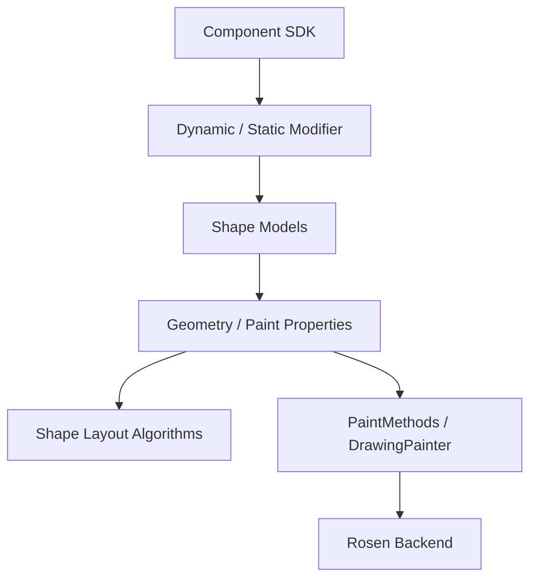
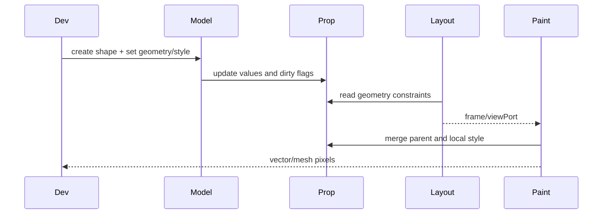
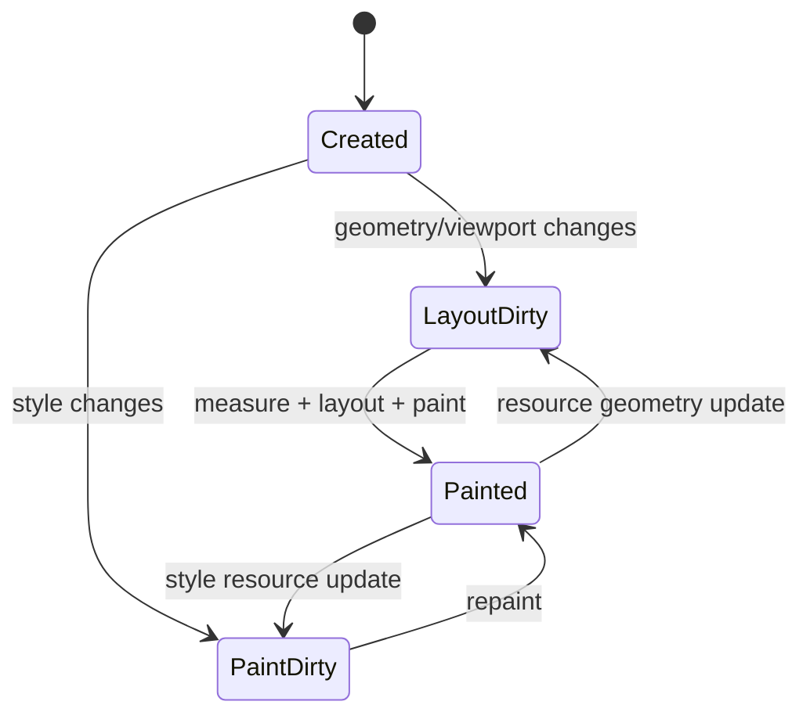
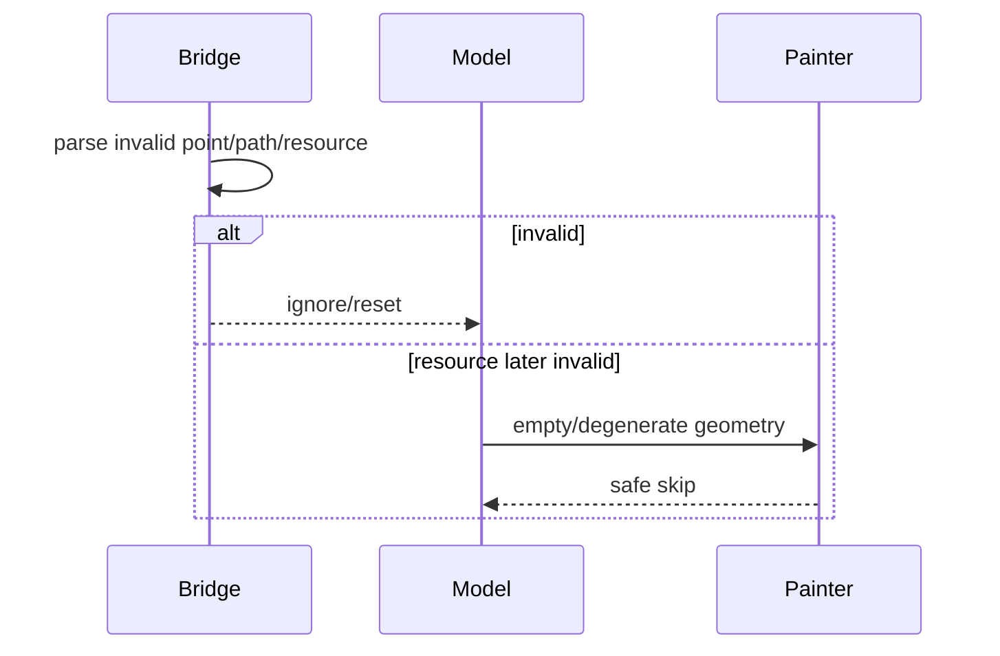

# 架构设计

> Shape 绘制组件功能域的架构设计基线，依据 SDK、NG Pattern、Modifier 与渲染后端既有实现补录。

## 设计元数据

| 字段 | 内容 |
|------|------|
| Design ID | DESIGN-Func-05-14-01 |
| 关联需求 | 已有能力补录（无独立 requirement.md） |
| 关联 Epic | 无 |
| 目标 Feature | Feat-01 容器/viewport/mesh；Feat-02 样式；Feat-03 闭合几何；Feat-04 点线几何；Feat-05 Path；Feat-06 多范式 |
| 复杂度 | 关键 |
| 目标版本 | API 7–26 |
| Owner | ArkUI SIG |
| 状态 | Baselined（已有实现补录） |

## 需求基线

> 本功能域无 proposal.md；以下承接已批准的存量规格。

| 项 | 补充说明（如需） |
|----|------------------|
| 组件基线 | Shape 容器及 Rect/Circle/Ellipse/Line/Polyline/Polygon/Path 组件 |
| 样式基线 | fill/stroke/opacity/dash/line style 和容器属性合并 |
| 兼容基线 | Dynamic/Static/Modifier 及版本差异；内部 modifier 不等于公共 NDK |

## 上下文和现状

### 涉及仓和模块

| 仓库 | 补充架构说明 |
|------|--------------|
| interface_sdk-js — Shape/Rect/Circle/Ellipse/Line/Polyline/Polygon/Path d.ts | 组件公开契约 |
| ace_engine — `pattern/shape/*_model_ng.cpp` | 创建节点并写几何/样式属性 |
| ace_engine — `pattern/shape/*_layout_algorithm.cpp` | 各图形固有尺寸和几何边界 |
| ace_engine — `pattern/shape/*_paint_method.cpp` / painters | 样式合并、路径构造和绘制 |
| ace_engine — `pattern/shape/bridge/*modifier*` | Dynamic/Static 属性映射 |

### 调用链层级分析

| 层 | 模块 | 职责 | 修改类型 |
|----|------|------|----------|
| SDK | 组件 d.ts、Static/Modifier | API、版本和子组件契约 | 存量分析 |
| Bridge/Modifier | JS/ArkTS/Static | 解析几何、资源和样式 | 存量分析 |
| Model | Shape/Rect/...ModelNG | 创建 FrameNode、更新 Property | 存量分析 |
| Pattern/Property | ShapeContainer/各图形 Pattern | 持有几何/样式、创建算法和 PaintMethod | 存量分析 |
| Layout | 各 Shape LayoutAlgorithm | 计算 intrinsic/frame size | 存量分析 |
| Paint | DrawingPainter/PathPainter/PaintMethod | 合并样式并绘制 | 存量分析 |
| Backend | Rosen/RS | 提交路径、画笔、网格与裁剪 | 存量分析 |

检查结论：绘制组件调用链从 SDK 到 Model、Pattern、Layout、Paint 和渲染后端均已覆盖。

### 适用架构规则

| Rule ID | 适用原因 | 设计结论 | 验证方式 |
|---------|----------|----------|----------|
| OH-ARCH-LAYERING | SDK 到绘制后端多层 | Model/Property/Paint 单向依赖 | 架构评审 |
| OH-ARCH-SUBSYSTEM | 与 Rosen 绘制协作 | 仅经 RenderContext/Painter 适配 | 依赖检查 |
| OH-ARCH-IPC-SAF | 无 IPC/SA | N/A | 审查 |
| OH-ARCH-API-LEVEL | API 7–26、多范式 | canonical SDK since 为准 | API 评审/XTS |
| OH-ARCH-COMPONENT-BUILD | 多图形源集和 modifier | 不新增 target/依赖 | 构建验证 |
| OH-ARCH-ERROR-LOG | 非法尺寸、点、path、resource | 按入口记录校验；Dynamic mesh 负维度缺口不以“安全退化”掩盖 | Fuzz/UT |

## 不涉及项承接

| 维度 | 设计结论 |
|------|----------|
| 性能 | 涉及；Path/mesh 成本随命令或顶点数增长 |
| 兼容性 | 涉及；Dynamic/Static/Modifier 分开记录 |
| API | 涉及；Line 未列入 Shape SDK child list 的差异列风险 |
| 安全与权限 | 无权限；Dynamic mesh 负维度可通过长度等式进入 painter，是待修复/待测的越界风险 |
| IPC/持久化/分布式 | N/A |
| 构建 | 涉及但无变更 |

## 关键设计决策

| 决策 ID | 问题 | 推荐方案 | 探索过的替代方案 | 取舍理由 | 影响 |
|---------|------|----------|-----------------|----------|------|
| ADR-1 | 通用样式如何复用 | ShapeAbstractModel/Property 统一样式，各 PaintMethod 合并容器/自身状态 | 每图形复制；全部放容器 | 当前实现减少重复且支持独立图形 | 继承/覆盖优先级必测 |
| ADR-2 | 几何组件如何拆分 | 按闭合、点线、Path 分 Feat | 每组件一 Feat；全部一个 Feat | API/算法相似性与文档规模平衡 | 共享样式不重复定义 |
| ADR-3 | Shape child list 与 Line 实现冲突 | SDK child 清单为公开契约，Line 实现存在性列风险 | 推断 Line 可作 child；忽略 Line | 不能用实现扩大公开契约 | 容器组合测试按 SDK 支持清单 |
| ADR-4 | 内部 modifier/CAPI 如何表述 | 作为桥接实现，不升格公共 NDK | 全记为公共 NDK；完全省略 | 既要追溯又要守住 API 边界 | 多范式 spec 明确公私属性 |

## 设计骨架

### 骨架范围

| 骨架项 | 目标 | 不包含 | 验证方式 |
|--------|------|--------|----------|
| 容器 | viewport/mesh/子节点 | 通用布局组件 | Container UT |
| 样式与几何 | 公共绘制状态和八类组件 | Canvas 即时绘制 | Shape UT/金图 |
| 接口 | Dynamic/Static/Modifier | 新 NDK | SDK/Bridge 对照 |

### 骨架 Spec 拆分

| Task ID | 目标 | 受影响文件 | AC |
|---------|------|------------|-----|
| TASK-SKELETON-1 | 容器/viewport/mesh | `Feat-01-shape-container-viewport-mesh-spec.md` | Feat-01 AC |
| TASK-SKELETON-2 | 通用样式 | `Feat-02-shape-common-paint-style-spec.md` | Feat-02 AC |
| TASK-SKELETON-3 | 闭合几何 | `Feat-03-shape-basic-closed-geometry-spec.md` | Feat-03 AC |
| TASK-SKELETON-4 | 点线几何 | `Feat-04-shape-point-geometry-spec.md` | Feat-04 AC |
| TASK-SKELETON-5 | Path | `Feat-05-shape-path-commands-spec.md` | Feat-05 AC |
| TASK-SKELETON-6 | 多范式 | `Feat-06-shape-multi-paradigm-modifier-spec.md` | Feat-06 AC |

## 后续 Task 拆分

| Task ID | 目标 | 受影响文件 | 依赖 |
|---------|------|------------|------|
| TASK-FEAT-01~05 | 基线化容器、样式和几何 | Feat-01~05 specs | SDK、Model、Layout、Paint |
| TASK-FEAT-06 | 基线化多范式 | Feat-06 spec | Static/Modifier/BUILD |

## API 签名、Kit 与权限

### 新增 API

| API 签名 | 类型 | Kit | d.ts 位置 | 权限要求 | SysCap |
|----------|------|-----|------------|----------|--------|
| `Shape(value?: PixelMap)` / `viewPort` / `mesh` | Public | ArkUI | `shape.d.ts` | 无 | ArkUI.Full |
| `Rect/Circle/Ellipse/Line/Polyline/Polygon/Path(...)` | Public | ArkUI | 各组件 d.ts | 无 | ArkUI.Full |
| `fill/stroke/strokeWidth/strokeDashArray/...` | Public | ArkUI | `common.d.ts` ShapeMethod | 无 | ArkUI.Full |

### 变更/废弃 API

| 原有 API | 变更类型 | 新 API | 迁移说明 |
|----------|----------|--------|----------|
| 无 | 无 | 无 | 内部 modifier 不构成公共 NDK 新增 |

## 构建系统影响

### BUILD.gn 变更

```text
无变更；继续使用 frameworks/core/components_ng/pattern/shape/BUILD.gn 既有源集。
```

### bundle.json 变更

无新增部件或依赖。

## 可选设计扩展

### 架构图



### 数据流/控制流

| 步骤 | 调用方 | 被调用方 | 数据/接口 | 说明 |
|------|--------|----------|-----------|------|
| 1 | SDK | Bridge/Model | geometry/style/resource | 解析与校验 |
| 2 | Model | Property | dimensions/points/path/style | 标记布局/绘制脏 |
| 3 | Layout | GeometryNode | intrinsic size/viewPort | 确定边界 |
| 4 | PaintMethod | DrawingPainter | 合并样式+几何 | 生成路径并绘制 |
| 5 | RenderContext | Rosen | path/brush/pen/mesh | 后端提交 |

### 时序设计



### 数据模型设计

```cpp
struct ShapePaintState {
    optional<Color> fill;
    optional<Color> stroke;
    optional<Dimension> strokeWidth;
    std::vector<Dimension> dashArray;
    float opacity;
};
struct ShapeGeometryState { Dimension width, height; /* points/path/radius by subtype */ };
```

### 算法与状态机



### 测试性设计

| 测试层级 | 测试目标 | Mock 策略 | 验证方式 |
|----------|----------|-----------|----------|
| SDK/Bridge | 类型、resource、reset | Mock VM/Resource | UT |
| Model/Property | dirty flags和属性 | FrameNode fixture | UT |
| Layout | 各几何边界 | LayoutConstraint | 几何断言 |
| Paint | 样式、path、mesh | Mock Canvas/金图 | Polyline fill 及 Dynamic/Static mesh 边界像素/Fuzz；不把 DISABLED 用例计作覆盖 |

### 异常传播时序图



### 资源所有权矩阵

| 资源 | 创建方 | 持有方 | 销毁触发 | 实际释放 | 异常回收 |
|------|--------|--------|----------|----------|----------|
| Shape FrameNode | Model | UI tree | 节点销毁 | RefPtr | 弱引用退出 |
| PixelMap/mesh | 应用/Bridge | Shape container | 替换/销毁 | 引用资源 | 无效时跳过 |

### 接口参数规约

| 接口 | 参数 | 类型 | 合法范围 | 非法处理 | 边界说明 |
|------|------|------|----------|----------|----------|
| mesh | values/row/column | array/number | SDK 要求非负维度且长度 `(r+1)*(c+1)*2` | Static 非正维度归 0；Dynamic 负整数当前未拦截 | `[]/-1/1` 可通过长度式进入 painter，属于安全风险 |
| points | point array | Length[][] | 每点两个坐标 | 忽略非法点 | Polyline 轮廓开放但 fill 仍作用于开放 Path |
| Path | commands | string/Resource | 可解析路径 | 空/跳过 | 尺寸按路径边界 |
| strokeDashArray | array | Length[] | 合法长度 | 归一/忽略 | 奇数复制按实现 |

### 线程与并发模型

| 操作 | 发起线程 | 回调线程 | 跨进程边界 | 线程安全 | 重入约束 |
|------|----------|----------|------------|----------|----------|
| 属性、布局、绘制 | UI | UI/Render backend | 无 | 节点状态 UI 串行 | Resource 更新标脏后下帧消费 |

## 详细设计

### 组件几何与样式

ShapeContainerPattern 建立 viewport/mesh 容器；Static mesh 将非正维度归 0，而 Dynamic Bridge 对可解析负维度不校验，特定长度等式可把负值送入 painter。各图形 Model 写 Property，LayoutAlgorithm 计算边界，Painter 合并父/自身样式后生成路径；Polyline 只保证轮廓不显式闭合，填充 Brush 仍会绘制开放 Path。证据：`frameworks/core/components_ng/pattern/shape/bridge/arkts_native_shape_bridge.cpp:135-166`；`frameworks/core/components_ng/pattern/shape/bridge/shape_static_modifier.cpp:192-206`；`frameworks/core/components_ng/pattern/shape/shape_container_modifier.cpp:23-38,62-78`；`frameworks/core/components_ng/pattern/shape/polygon_painter.cpp:21-45`。

### 多范式接口

Dynamic/Static modifier 汇聚对应组件 Model/Pattern，但内部 native modifier 只承担框架桥接职责，不构成公共 NDK 契约。证据：`frameworks/core/components_ng/pattern/shape/BUILD.gn:22-175`；`frameworks/core/components_ng/pattern/shape/bridge/common_shape_static_modifier.cpp:20-180`。

## 风险和开放问题

| 项 | 类型 | 影响 | 处理方式 | Owner |
|----|------|------|----------|-------|
| SDK Shape child list 未列 Line | API | 高 | 公开行为以 SDK 清单为准，单列实现差异 | ArkUI SIG |
| Dynamic mesh 负维度可通过长度等式进入 painter | 安全 | 高 | 补 `[]/-1/1` 等 Fuzz/UT；当前 invalid CAPI 用例为 DISABLED | ArkUI SIG |
| Path/mesh 非法输入与大数据 | 测试 | 中 | Fuzz、长度和性能边界 | ArkUI SIG |
| Polyline 开放轮廓仍执行 fill | 兼容性 | 中 | 分别验证 stroke 轮廓与 fill 像素，不宣称无闭合填充面 | ArkUI SIG |
| 内部 modifier 被误认作 NDK | API | 中 | 公私接口表面审查 | ArkUI SIG |

## 设计审批

- [x] 需求基线已确认，设计覆盖 P0/P1 AC
- [x] 不涉及项已承接，N/A 和展开项都有结论
- [x] 涉及仓和模块职责清楚
- [x] 调用链层级分析完整，每层覆盖到位
- [x] 适用架构规则已识别并形成设计结论
- [x] 分层和子系统边界合规
- [x] API 变更有签名、权限、错误码和兼容性说明
- [x] BUILD.gn/bundle.json 影响明确
- [x] 设计输出和后续 Task 拆分明确
- [x] 关键设计决策有理由和影响说明
- [x] 风险和开放问题有 Owner

**结论:** 通过（已有实现补录）。
