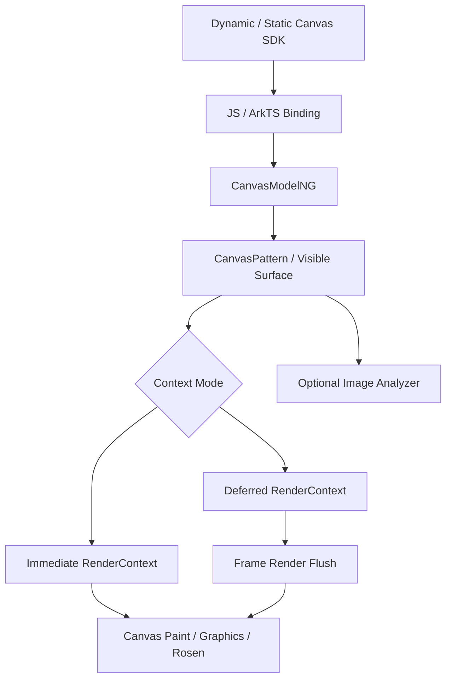
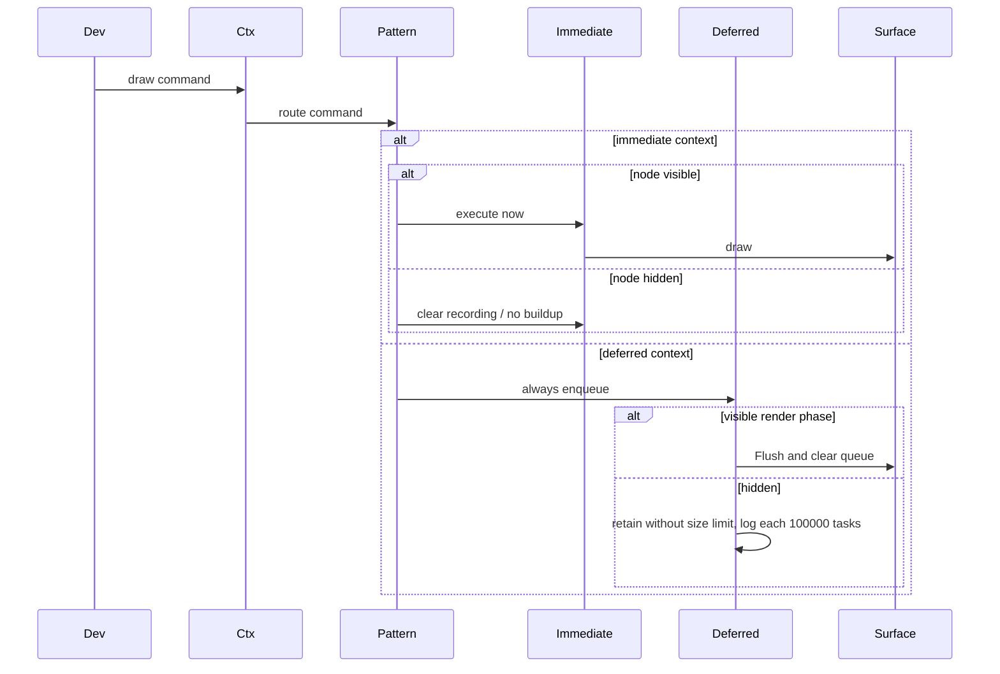
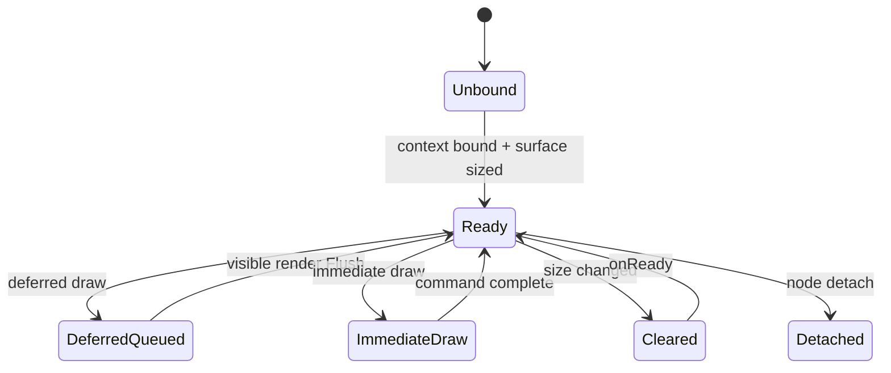
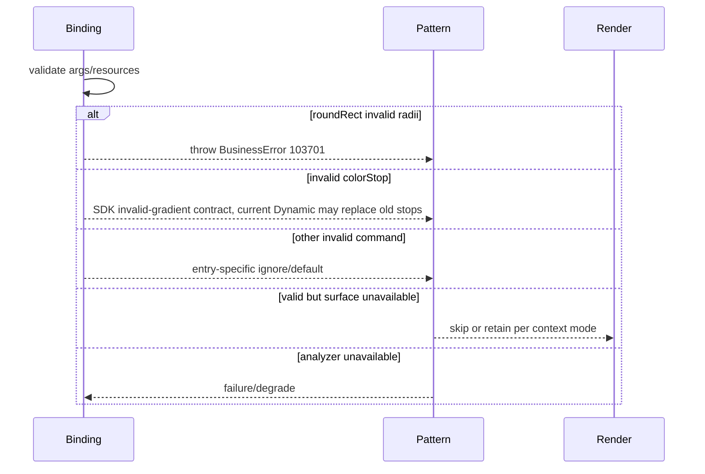

# 架构设计

> Canvas 功能域架构设计基线，依据 SDK、Bridge、CanvasPattern、双 RenderContext 与绘制后端既有实现补录。

## 设计元数据

| 字段 | 内容 |
|------|------|
| Design ID | DESIGN-Func-05-14-02 |
| 关联需求 | 已有能力补录（无独立 requirement.md） |
| 关联 Epic | 无 |
| 目标 Feature | Feat-01 组件/上下文/生命周期；Feat-02 路径；Feat-03 样式；Feat-04 状态/变换；Feat-05 文本；Feat-06 图像/像素；Feat-07 分析/多范式 |
| 复杂度 | 关键 |
| 目标版本 | API 8–26 |
| Owner | ArkUI SIG |
| 状态 | Baselined（已有实现补录） |

## 需求基线

> 本功能域无 proposal.md；以下承接已批准的存量规格。

| 项 | 补充说明（如需） |
|----|------------------|
| 组件基线 | 可见 Canvas 与 CanvasRenderingContext2D/DrawingRenderingContext 一对一绑定 |
| 绘制基线 | CanvasRenderer 提供路径、样式、状态、文本、图像和像素交换契约 |
| 执行基线 | 可见 context 同时存在 immediate 与 deferred 两种路径，不应合并为单一队列语义 |
| 演进基线 | analyzer、FrameNode/lifecycle、CanvasParams/Static、Builder 与后续属性按 API since 门控 |

## 上下文和现状

### 涉及仓和模块

| 仓库 | 补充架构说明 |
|------|--------------|
| interface_sdk-js — `canvas.d.ts` | Dynamic Canvas、CanvasRenderer、上下文、辅助对象与版本的权威契约 |
| interface_sdk-js — `canvas.static.d.ets` | Static Canvas、事件和属性契约 |
| ace_engine — JS Canvas/RenderingContext binding | 对象构造、方法参数和生命周期桥接 |
| ace_engine — `arkts_native_canvas_bridge.cpp` / modifiers | ArkTS/Static 节点属性映射 |
| ace_engine — `canvas_model_ng.cpp` / `canvas_pattern.*` | 创建 FrameNode、绑定 context、命令与生命周期 |
| ace_engine — `canvas_render_context_immediate.cpp` | 可见表面即时绘制路径 |
| ace_engine — `canvas_render_context_deferred.cpp` | 命令录制与帧阶段 Flush |
| ace_engine — Canvas paint methods / Rosen | 路径、文本、图像和像素的后端执行 |
| ace_engine — image analyzer integration | 可选设备分析能力与 overlay |

### 调用链层级分析

| 层 | 模块 | 职责 | 修改类型 |
|----|------|------|----------|
| SDK | Dynamic/Static Canvas 与上下文类 | 签名、版本、默认值、异常说明 | 存量分析 |
| JS/ArkTS Binding | Canvas/Context JS classes、native bridge | 参数解析、对象包装、生命周期注册 | 存量分析 |
| Model | CanvasModelNG | 创建 FrameNode、绑定 context/params | 存量分析 |
| Pattern | CanvasPattern | 表面、尺寸、onReady、可见性和命令路由 | 存量分析 |
| RenderContext | immediate/deferred implementations | 直接执行或录制/Flush | 存量分析 |
| Paint/Graphics | CanvasPaintMethod、drawing/Rosen | 几何、样式、文本、图像执行 | 存量分析 |
| Resource | ImageBitmap/PixelMap/ImageData/Font | 输入和读回资源生命周期 | 存量分析 |
| Analyzer | image analyzer manager/overlay | 可选分析启停和结果覆盖层 | 存量分析 |

检查结论：SDK 到图形后端及 analyzer 支路均覆盖；immediate/deferred 保持并列实现。

### 适用架构规则

| Rule ID | 适用原因 | 设计结论 | 验证方式 |
|---------|----------|----------|----------|
| OH-ARCH-LAYERING | 多层绘制链路 | Bridge 不直接操作后端表面，Pattern/RenderContext 负责分派 | 架构评审 |
| OH-ARCH-SUBSYSTEM | 与 graphics/Rosen/analyzer 协作 | 使用既有适配层和可选能力，不新增反向依赖 | 依赖检查 |
| OH-ARCH-IPC-SAF | analyzer 可能连接扩展能力 | Canvas 主绘制无 IPC；分析失败必须隔离 | 集成测试 |
| OH-ARCH-API-LEVEL | API 8–26 高频演进 | canonical SDK since 为准，多范式分别审查 | API 评审/XTS |
| OH-ARCH-COMPONENT-BUILD | Static/analyzer/graphics 源集 | 不新增 BUILD 或 bundle 依赖 | 构建验证 |
| OH-ARCH-ERROR-LOG | 非有限值、失效资源、编码失败 | 按 API 逐项处理；roundRect 抛 103701，当前 Dynamic colorStop/globalAlpha/quality 仍有可污染状态或穿透后端的偏差 | Fuzz/UT |

## 不涉及项承接

| 维度 | 设计结论 |
|------|----------|
| 性能 | 涉及；大表面、不可见命令、滤镜、读回和编码为重点 |
| 内存 | 涉及；deferred 队列当前隐藏时仍无条件入队且无上限/清理，表面、RGBA 缓冲与图像对象也需跟踪释放 |
| 兼容性 | 涉及；API 18 单位/alpha、API 23 immediate/Static 等分界保留 |
| 安全与权限 | 基础绘制无权限；analyzer 依设备能力，不新增权限契约 |
| 构建 | 涉及但无变更 |
| 持久化/分布式 | N/A；像素和状态不自动持久化或同步 |

## 关键设计决策

| 决策 ID | 问题 | 推荐方案 | 探索过的替代方案 | 取舍理由 | 影响 |
|---------|------|----------|-----------------|----------|------|
| ADR-1 | CanvasRenderer API 如何拆分 | 按生命周期、路径、样式、状态、文本、图像、分析七 Feat，公共规则单一归属 | 每方法一 Feat；全部一个 Feat | 保持可审查规模且避免重复 | Offscreen 通过引用复用 Feat-02~06 |
| ADR-2 | immediate/deferred 是否统一 | 保持双执行路径并要求合法输出等价 | 只记录 deferred；合并实现模型 | API 23 CanvasParams 与历史 context 路径可观察不同 | 可见性、队列和 Flush 分开测试 |
| ADR-3 | context 与组件关系 | 一对一绑定；API<10 的尺寸/offset 变化均 reset/onReady，API>=10 仅尺寸且 pixel-grid-round size 变化触发 | 多 Canvas 共享；自动复制 context | SDK 明示不可共享且状态/表面强关联，生命周期存在版本分支 | 重复绑定和 API 9/10 几何矩阵为 P0 |
| ADR-4 | Dynamic/Static 生命周期是否同签名 | 语义对齐，保留 Dynamic `on/off` 与 Static 成对函数 | 文档统一成同一签名；只写一类 | 已发布 API 形态不同 | 多范式对照而非文本等同 |
| ADR-5 | analyzer 如何隔离 | 作为可选 Pattern 支路，失败不影响绘制；与 overlay builder 互斥 | 融入绘制命令；无能力时失败组件 | 降低设备依赖对基础功能影响 | 能力矩阵与 stop 回收测试 |
| ADR-6 | 内部 modifier/CAPI 如何定位 | 记录实现链但不宣称公共 NDK | 全部当公共；完全省略 | 兼顾追溯与 API 边界 | Feat-07 公私表面审查 |

## 设计骨架

### 骨架范围

| 骨架项 | 目标 | 不包含 | 验证方式 |
|--------|------|--------|----------|
| 组件与执行 | context、surface、生命周期、双模式 | Offscreen 表面 | Pattern/RenderContext UT |
| 2D 绘制 | 路径、样式、状态、文本、图像 | Shape 组件 | 绘制 UT/金图 |
| 资源交换 | ImageBitmap/PixelMap/ImageData/export | 编解码模块内部算法 | 往返测试 |
| 多范式分析 | Dynamic/Static/FrameNode/analyzer | 新公共 NDK | SDK/Bridge/能力矩阵 |

### 骨架 Spec 拆分

| Task ID | 目标 | 受影响文件 | AC |
|---------|------|------------|-----|
| TASK-SKELETON-1 | 组件与生命周期 | `Feat-01-canvas-component-context-lifecycle-spec.md` | Feat-01 AC |
| TASK-SKELETON-2 | 路径裁剪 | `Feat-02-canvas-path-geometry-clipping-spec.md` | Feat-02 AC |
| TASK-SKELETON-3 | 样式合成 | `Feat-03-canvas-paint-style-composition-spec.md` | Feat-03 AC |
| TASK-SKELETON-4 | 状态变换 | `Feat-04-canvas-state-transform-spec.md` | Feat-04 AC |
| TASK-SKELETON-5 | 文本度量 | `Feat-05-canvas-text-rendering-metrics-spec.md` | Feat-05 AC |
| TASK-SKELETON-6 | 图像像素 | `Feat-06-canvas-image-pixel-interchange-spec.md` | Feat-06 AC |
| TASK-SKELETON-7 | 分析多范式 | `Feat-07-canvas-image-analysis-multi-paradigm-spec.md` | Feat-07 AC |

## 后续 Task 拆分

| Task ID | 目标 | 受影响文件 | 依赖 |
|---------|------|------------|------|
| TASK-FEAT-01 | 基线化组件、双模式和生命周期 | Feat-01 spec | SDK/Pattern/RenderContext |
| TASK-FEAT-02~05 | 基线化绘制核心 | Feat-02~05 specs | CanvasRenderer/graphics |
| TASK-FEAT-06 | 基线化图像像素交换 | Feat-06 spec | ImageBitmap/PixelMap/ImageData |
| TASK-FEAT-07 | 基线化分析和多范式 | Feat-07 spec | Static/Bridge/Analyzer |

## API 签名、Kit 与权限

### 新增 API

| API 签名 | 类型 | Kit | d.ts 位置 | 权限要求 | SysCap |
|----------|------|-----|------------|----------|--------|
| `Canvas(context?)` / `Canvas(params)` | Public | ArkUI | `canvas.d.ts:3605-3735` | 无 | ArkUI.Full |
| `CanvasRenderingContext2D` / `DrawingRenderingContext` | Public | ArkUI | `canvas.d.ts:2943-3266,3541-3604` | 无 | ArkUI.Full |
| `CanvasRenderer` 路径/样式/状态/文本/图像 API | Public | ArkUI | `canvas.d.ts:1373-2942` | 无 | ArkUI.Full |
| `onReady` / lifecycle / analyzer | Public | ArkUI | `canvas.d.ts:3728-3810` 等 | 无/设备能力 | ArkUI.Full |

### 变更/废弃 API

| 原有 API | 变更类型 | 新 API | 迁移说明 |
|----------|----------|--------|----------|
| 无 | 无 | 无 | 本次只补录；内部 modifier 不新增公共 NDK |

## 构建系统影响

### BUILD.gn 变更

```text
无变更；沿用 canvas pattern、bridge、graphics 和 analyzer 既有依赖。
```

### bundle.json 变更

无新增 component 或依赖。

## 可选设计扩展

### 架构图



### 数据流/控制流

| 步骤 | 调用方 | 被调用方 | 数据/接口 | 说明 |
|------|--------|----------|-----------|------|
| 1 | SDK | Binding/Model | context/CanvasParams | 创建并独占绑定 |
| 2 | Layout | Pattern | surface size/offset/pixel-grid-round size | API<10 尺寸/offset、API>=10 尺寸且 grid size 变化时清屏并 onReady |
| 3 | Context API | RenderContext | normalized command/state | immediate 或 deferred |
| 4 | Render frame | deferred context | command queue | 可见时 Flush |
| 5 | Graphics | surface | path/text/image/pixels | 后端执行 |
| 6 | Analyzer API | Pattern/analyzer | current image/options | 可选异步分析 |

### 时序设计



### 数据模型设计

```cpp
struct CanvasState {
    Matrix2D transform;
    BrushState fill;
    PenState stroke;
    ClipState clip;
    TextState text;
    float globalAlpha;
    CompositeOperation composite;
};
struct CanvasCommand { CommandType type; ParsedArguments args; CanvasState snapshot; };
```

### 算法与状态机



### 测试性设计

| 测试层级 | 测试目标 | Mock 策略 | 验证方式 |
|----------|----------|-----------|----------|
| SDK/Binding | 参数、since、异常 | Mock VM values | UT/API check |
| Pattern | context、surface、lifecycle | FrameNode fixture | API 9/10 size/offset/grid matrix；生命周期禁用用例不计覆盖 |
| RenderContext | immediate/deferred | 注入 fake surface | 隐藏 deferred 无界队列压力、100000 告警和可见 Flush |
| Graphics | path/text/image | Mock/real canvas | roundRect 103701、gradient/alpha/quality 偏差金图/参数化测试 |
| Analyzer | 能力和互斥 | Fake analyzer | 待补集成测试；现有禁用 accessor 用例不计覆盖 |

### 异常传播时序图



### 资源所有权矩阵

| 资源 | 创建方 | 持有方 | 销毁触发 | 实际释放 | 异常回收 |
|------|--------|--------|----------|----------|----------|
| Canvas surface | Pattern | Pattern/RenderContext | resize/detach | graphics resource | 失效跳过 |
| command queue | deferred context | deferred context | 可见 Flush/对象销毁 | container | 隐藏时无上限或清理；每 100000 条只告警 |
| ImageBitmap/PixelMap | 应用/Bridge | command/resource wrapper | 命令完成/对象销毁 | 引用资源 | 失效源不绘制 |
| analyzer task/overlay | Pattern | analyzer manager | stop/disable/detach | manager | 失败清理 |

### 接口参数规约

| 接口 | 参数 | 类型 | 合法范围 | 非法处理 | 边界说明 |
|------|------|------|----------|----------|----------|
| Canvas | context | 2D/Drawing context | 未被其他 Canvas 绑定 | 不形成第二有效绑定 | 尺寸最大 10000 px |
| 几何/矩阵 | coordinates | number | finite | 忽略当前命令 | 单位随 context |
| roundRect | radii | number/array | null/undefined 为 0；非负且数组 1~4 项 | 负值、空数组、>4 项同步抛 103701 | 不按普通几何静默忽略 |
| colorStop | offset/color | number/color | SDK offset [0,1]、有效色/色域 | 无效渐变或异常；Dynamic 当前可能清旧 stop、NaN 穿透，Static ColorMetrics no-op | 混合 ColorSpace 抛 103701 |
| globalAlpha | alpha | number | Dynamic 有限越界 clamp；Static 越界赋值无效 | Dynamic API>=18 非有限无效；当前两实现各有偏差 | Dynamic API 18 分界 |
| drawImage | source/rects | ImageBitmap/PixelMap | 有效资源/有限矩形 | 无输出 | PixelMap API 18 单位分界 |
| toDataURL | type/quality | string/number | png/jpeg/webp、[0,1] | SDK 非法值默认 png/0.92；当前 Dynamic NaN 穿透 encoder | 高拷贝成本 |

### 线程与并发模型

| 操作 | 发起线程 | 回调线程 | 跨进程边界 | 线程安全 | 重入约束 |
|------|----------|----------|------------|----------|----------|
| Canvas 命令/生命周期 | UI | UI/Render | 无 | context 不跨 Canvas 共享 | onReady 后绘制 |
| deferred Flush | UI pipeline | Render phase | 无 | 队列顺序消费 | Flush 期间不重排命令 |
| analyzer | UI | 能力回调后回 UI | 可选扩展边界 | stop/detach 可取消 | 回调校验节点生命周期 |

## 详细设计

### 组件、双模式与生命周期

CanvasPattern 根据构造方式配置上下文模式。deferred 对命令无条件入队，只在可见渲染阶段 Flush；隐藏期间没有队列上限或清理，每 100000 条仅告警。immediate 直接作用于表面，隐藏路径清理录制状态。API<10 的尺寸或纯 offset 变化均 reset/onReady；API>=10 仅尺寸变化且 pixel-grid-round size 同时变化时触发，纯 offset 不触发。证据：`frameworks/core/components_ng/pattern/canvas/canvas_pattern.cpp:139-200,1094-1109`；`frameworks/core/components_ng/pattern/canvas/canvas_render_context_immediate.cpp:21-40`；`frameworks/core/components_ng/pattern/canvas/canvas_render_context_deferred.cpp:30-60`。

### 绘制状态、资源与多范式

CanvasRenderer 的状态按命令顺序消费，save/restore 保存矩阵、裁剪和样式；图像/像素读回需持有有效资源。对外契约以 SDK 为准：roundRect 非法 radii 抛 103701，colorStop/globalAlpha/toDataURL quality 分别遵守其范式和版本规则。当前 Dynamic colorStop 会清旧 stop 且 NaN 可穿透、Dynamic globalAlpha 有限越界未 clamp、Static globalAlpha 反而 clamp、Dynamic toDataURL NaN 穿透 encoder，均作为实现偏差而非统一契约。Dynamic/Static/FrameNode 最终汇聚 CanvasModel/Pattern，但 lifecycle API 形态保持差异，内部 modifier 仅作为桥接。证据：`frameworks/bridge/declarative_frontend/jsview/canvas/js_canvas_gradient.cpp:50-104`；`frameworks/bridge/declarative_frontend/jsview/canvas/js_canvas_renderer.cpp:1042-1048,1108-1113,1408-1416`；`frameworks/core/interfaces/native/implementation/canvas_renderer_peer_impl.cpp:175-183,738-750`。

## 风险和开放问题

| 项 | 类型 | 影响 | 处理方式 | Owner |
|----|------|------|----------|-------|
| immediate/deferred 被误写为同一队列语义 | 架构 | 高 | 双路径对照和隐藏场景测试 | ArkUI SIG |
| 不可见 deferred 高频命令积压 | 性能 | 高 | SDK 警示、压力测试和可见性回归 | ArkUI SIG |
| API 18 单位/非有限值行为分界 | API | 中 | API 17/18 参数化测试 | ArkUI SIG |
| Dynamic/Static 生命周期签名差异 | API | 中 | 分通道规格和 SDK 编译测试 | ArkUI SIG |
| analyzer 设备依赖/overlay 互斥 | 测试 | 中 | 能力矩阵和故障注入 | ArkUI SIG |
| API<10 纯 offset 也触发 reset/onReady | 兼容性 | 高 | API 9/10 size/offset/grid 参数矩阵 | ArkUI SIG |
| 隐藏 deferred 队列无上限且不清理 | 性能/内存 | 高 | 高频隐藏压力测试和统计告警监控 | ArkUI SIG |
| roundRect 错误被误写为静默退化 | API | 高 | 负值/空数组/>4 项 103701 XTS | ArkUI SIG |
| colorStop 会破坏旧 stop，NaN/ColorMetrics 存在偏差 | API/可靠性 | 高 | Dynamic/Static/色域专项测试 | ArkUI SIG |
| Dynamic/Static globalAlpha 均偏离各自 SDK | API | 高 | Dynamic API 17/18 与 Static 参数矩阵 | ArkUI SIG |
| Dynamic toDataURL NaN quality 穿透 encoder | 编码 | 中 | NaN/Infinity/越界 quality UT/XTS | ArkUI SIG |

## 设计审批

- [x] 需求基线已确认，设计覆盖 P0/P1 AC
- [x] 不涉及项已承接，N/A 和展开项都有结论
- [x] 涉及仓和模块职责清楚
- [x] 调用链层级分析完整，每层覆盖到位
- [x] 适用架构规则已识别并形成设计结论
- [x] 分层和子系统边界合规
- [x] API 变更有签名、权限、错误码和兼容性说明
- [x] BUILD.gn/bundle.json 影响明确
- [x] 设计输出和后续 Task 拆分明确
- [x] 关键设计决策有理由和影响说明
- [x] 风险和开放问题有 Owner

**结论:** 通过（已有实现补录）。
