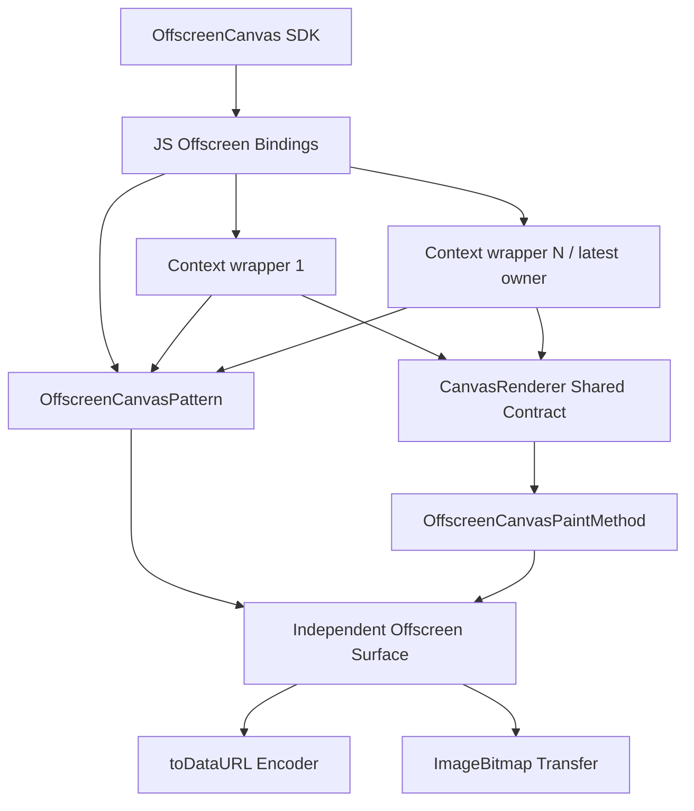
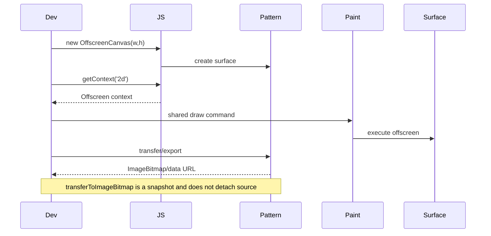
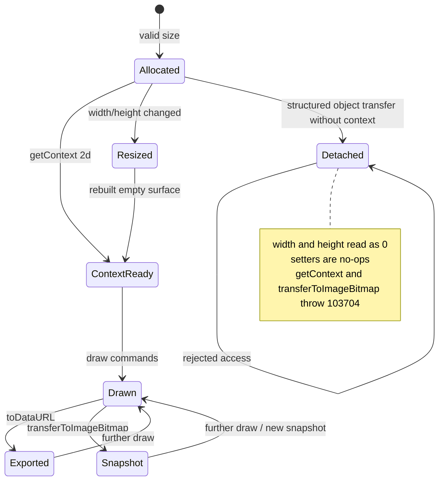
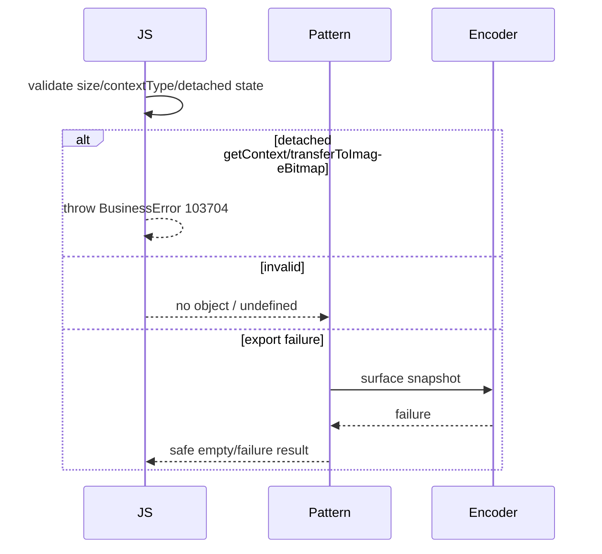

# 架构设计

> OffscreenCanvas 功能域架构设计基线，依据 SDK、JS Binding、OffscreenCanvasPattern 与离屏 PaintMethod 既有实现补录。

## 设计元数据

| 字段 | 内容 |
|------|------|
| Design ID | DESIGN-Func-05-14-03 |
| 关联需求 | 已有能力补录（无独立 requirement.md） |
| 关联 Epic | 无 |
| 目标 Feature | Feat-01 离屏表面/context；Feat-02 二维绘制 context；Feat-03 导出/转移 |
| 复杂度 | 复杂 |
| 目标版本 | API 8–26 |
| Owner | ArkUI SIG |
| 状态 | Baselined（已有实现补录） |

## 需求基线

> 本功能域无 proposal.md；以下承接已批准的存量规格。

| 项 | 补充说明（如需） |
|----|------------------|
| 表面基线 | OffscreenCanvas 以宽高和单位创建独立离屏表面，不进入 FrameNode 树 |
| context 基线 | OffscreenCanvasRenderingContext2D 继承 CanvasRenderer；不同 OffscreenCanvas 的 Pattern/状态独立，同一对象重复 getContext 的 wrapper 共享 Pattern/PaintMethod/状态 |
| 交换基线 | toDataURL 与 transferToImageBitmap 导出最近离屏结果；结构化对象转移另行使源进入 Detached |
| 排除基线 | 无 Canvas onReady、attach/detach、FrameNode、CanvasParams/Static component 或 analyzer |

## 上下文和现状

### 涉及仓和模块

| 仓库 | 补充架构说明 |
|------|--------------|
| interface_sdk-js — `canvas.d.ts` | OffscreenCanvas/context 构造、共享继承和导出契约 |
| ace_engine — `js_offscreen_canvas.cpp` | JS 对象、尺寸、getContext 和 transfer 绑定 |
| ace_engine — `js_offscreen_rendering_context.cpp` | 离屏 context 共享 API 解析 |
| ace_engine — `offscreen_canvas_pattern.*` | 离屏表面、尺寸、像素和上下文所有权 |
| ace_engine — `offscreen_canvas_paint_method.cpp` | 在离屏 surface 执行绘制 |
| Canvas 功能域 | CanvasRenderer 路径/样式/状态/文本/图像的单一规格源 |

### 调用链层级分析

| 层 | 模块 | 职责 | 修改类型 |
|----|------|------|----------|
| SDK | OffscreenCanvas / OffscreenContext | 构造、尺寸、继承、导出 | 存量分析 |
| JS Binding | JSOffscreenCanvas/RenderingContext | 对象包装、参数、context 获取 | 存量分析 |
| Pattern | OffscreenCanvasPattern | 离屏 surface 和像素资源 | 存量分析 |
| Paint | OffscreenCanvasPaintMethod | 直接执行共享绘制命令 | 存量分析 |
| Graphics/Image | surface encoder/ImageBitmap | 编码、快照和资源转移 | 存量分析 |

检查结论：离屏链路不经过 CanvasModelNG/FrameNode/CanvasPattern，独立到 graphics/image 后端。

### 适用架构规则

| Rule ID | 适用原因 | 设计结论 | 验证方式 |
|---------|----------|----------|----------|
| OH-ARCH-LAYERING | SDK→Binding→Pattern→Paint | 保持单向依赖，不借用可见 Canvas 节点生命周期 | 架构评审 |
| OH-ARCH-SUBSYSTEM | graphics/image 互操作 | 仅经既有表面和 ImageBitmap 适配 | 依赖检查 |
| OH-ARCH-IPC-SAF | 无 IPC/SA | ServiceExtensionAbility 明示不支持 | SDK/集成测试 |
| OH-ARCH-API-LEVEL | API 8/10/12 及共享 since | 离屏适用性与共享 API 版本同时门控 | XTS/UT |
| OH-ARCH-COMPONENT-BUILD | 无新 target | 沿用 canvas BUILD | 构建验证 |
| OH-ARCH-ERROR-LOG | 非法尺寸、contextType、编码失败、Detached | 按入口返回 undefined/失败或抛 103704；Dynamic NaN quality 穿透 encoder 作为偏差记录 | Fuzz/UT |

## 不涉及项承接

| 维度 | 设计结论 |
|------|----------|
| 性能 | 涉及；大表面绘制、读回和编码成本高 |
| 内存 | 涉及；表面、编码缓冲和 ImageBitmap 需明确所有权 |
| 兼容性 | 涉及；API 8/10/12、共享 CanvasRenderer since、同表面多 wrapper 共享及 Detached/103704 门控 |
| UI 生命周期/无障碍 | N/A；无 FrameNode 或可见组件事件 |
| analyzer | N/A；Offscreen 不提供分析接口 |
| 构建/持久化/分布式 | 无变更或自动能力 |

## 关键设计决策

| 决策 ID | 问题 | 推荐方案 | 探索过的替代方案 | 取舍理由 | 影响 |
|---------|------|----------|-----------------|----------|------|
| ADR-1 | 是否把 Offscreen 视为 Canvas 组件变体 | 独立 JS 对象、Pattern 和 surface，无 FrameNode | 隐藏 Canvas 节点；复用 CanvasPattern | 当前实现和生命周期完全不同 | 不具备 onReady/attach/analyzer |
| ADR-2 | 共享 CanvasRenderer 如何文档化 | Canvas Feat-02~06 为规则源，Offscreen 只写适用性与差异 | 复制全部 AC；只写一句继承 | 避免两套规范漂移且保留边界 | 共享 API 变更需同步适用性检查 |
| ADR-3 | 当前路径和状态如何隔离 | 以 OffscreenCanvas/Pattern 为隔离单位：不同表面独立，同一表面的多个 JS wrapper 共享 Pattern/PaintMethod/状态 | 所有 wrapper 独立；全局共享 | 与当前对象归属和 resize owner 行为一致 | 不同对象隔离与同对象共享均为 P0 |
| ADR-4 | 导出与转移语义 | 快照 API 读取最近表面且不 detach 源；结构化对象转移仅允许无 context 源并使其 Detached | 把所有 transfer 都视为 detach；绑定原 surface 生命周期 | 区分 ImageBitmap 快照和对象所有权转移 | 重复快照、Detached 与 103704 测试 |

## 设计骨架

### 骨架范围

| 骨架项 | 目标 | 不包含 | 验证方式 |
|--------|------|--------|----------|
| 离屏表面 | 尺寸、单位、getContext | FrameNode/布局 | Pattern UT |
| 共享绘制 | CanvasRenderer 适用性和隔离 | 重复定义公共 API | 对照金图 |
| 导出转移 | data URL/ImageBitmap | 编码器内部算法 | 往返/性能测试 |

### 骨架 Spec 拆分

| Task ID | 目标 | 受影响文件 | AC |
|---------|------|------------|-----|
| TASK-SKELETON-1 | 表面与 context | `Feat-01-offscreen-canvas-surface-context-spec.md` | Feat-01 AC |
| TASK-SKELETON-2 | 共享绘制与隔离 | `Feat-02-offscreen-canvas-rendering-context-spec.md` | Feat-02 AC |
| TASK-SKELETON-3 | 导出与转移 | `Feat-03-offscreen-canvas-export-transfer-spec.md` | Feat-03 AC |

## 后续 Task 拆分

| Task ID | 目标 | 受影响文件 | 依赖 |
|---------|------|------------|------|
| TASK-FEAT-01 | 基线化 surface/context | Feat-01 spec | SDK/JS binding/Pattern |
| TASK-FEAT-02 | 基线化共享绘制适用性 | Feat-02 spec | Canvas Feat-02~06/PaintMethod |
| TASK-FEAT-03 | 基线化 export/transfer | Feat-03 spec | encoder/ImageBitmap |

## API 签名、Kit 与权限

### 新增 API

| API 签名 | 类型 | Kit | d.ts 位置 | 权限要求 | SysCap |
|----------|------|-----|------------|----------|--------|
| `new OffscreenCanvas(width,height[,unit])` | Public | ArkUI | `canvas.d.ts:3378-3496` | 无 | ArkUI.Full |
| `getContext('2d', options?)` | Public | ArkUI | 同上 | 无 | ArkUI.Full |
| `OffscreenCanvasRenderingContext2D extends CanvasRenderer` | Public | ArkUI | `canvas.d.ts:3267-3377` | 无 | ArkUI.Full |
| `toDataURL` / `transferToImageBitmap` | Public | ArkUI | `canvas.d.ts:3290-3490` | 无 | ArkUI.Full |

### 变更/废弃 API

| 原有 API | 变更类型 | 新 API | 迁移说明 |
|----------|----------|--------|----------|
| 无 | 无 | 无 | 本次只补录 |

## 构建系统影响

### BUILD.gn 变更

```text
无变更；沿用 canvas/offscreen pattern、JS binding 与图像依赖。
```

### bundle.json 变更

无新增 component 或依赖。

## 可选设计扩展

### 架构图



### 数据流/控制流

| 步骤 | 调用方 | 被调用方 | 数据/接口 | 说明 |
|------|--------|----------|-----------|------|
| 1 | JS | OffscreenCanvas | width/height/unit | 分配表面 |
| 2 | getContext | Binding/Pattern | `2d`/settings | 创建新 wrapper；同一对象共享 Pattern/PaintMethod，owner 更新为最新 wrapper |
| 3 | CanvasRenderer API | OffscreenPaintMethod | normalized command | 直接作用离屏表面 |
| 4 | export | encoder | latest surface pixels | data URL |
| 5 | transfer | ImageBitmap factory | latest surface | 可复用位图 |
| 6 | structured clone | JS binding | OffscreenCanvas object | 无 context 时转移对象并 detach 源；已有 context/Detached 时参数错误 |

### 时序设计



### 数据模型设计

```cpp
struct OffscreenCanvasState {
    double width;
    double height;
    LengthMetricsUnit unit;
    RefPtr<OffscreenSurface> surface;
    RefPtr<OffscreenCanvasPaintMethod> paintMethod;
    bool detached;
};
```

### 算法与状态机



### 测试性设计

| 测试层级 | 测试目标 | Mock 策略 | 验证方式 |
|----------|----------|-----------|----------|
| JS Binding | 构造/getContext/多 wrapper/Detached | Mock runtime | 待补 owner 共享、结构化转移与 103704 UT |
| Pattern | surface/resize | Fake surface | UT |
| Paint | shared API 等价与隔离 | Canvas/Offscreen 对照 | 金图 |
| Export | format/quality/failure | Fake encoder | 待补 NaN/Infinity/越界矩阵；现有 Offscreen 编码测试路径不足/禁用 |
| Resource | snapshot/structured transfer/repeat/destroy | Fake ImageBitmap | 待补快照不 detach 与 Detached 生命周期 UT |

### 异常传播时序图



### 资源所有权矩阵

| 资源 | 创建方 | 持有方 | 销毁触发 | 实际释放 | 异常回收 |
|------|--------|--------|----------|----------|----------|
| offscreen surface | Pattern | Pattern/多个 wrapper | resize/object destroy/structured transfer | graphics resource | 同表面 wrapper 共享；Detached 源不再访问旧表面 |
| ImageBitmap | transfer factory | 返回对象/调用方 | 对象销毁 | image resource | 失败不损坏旧 bitmap |
| encode buffer | encoder | encoder/result | 导出完成 | buffer/string | 错误路径释放 |

### 接口参数规约

| 接口 | 参数 | 类型 | 合法范围 | 非法处理 | 边界说明 |
|------|------|------|----------|----------|----------|
| constructor | width/height | number | finite、可分配 | 拒绝/归一 | 防尺寸乘法溢出 |
| getContext | contextType | string | 仅 `2d` | undefined | API 10 |
| toDataURL | type/quality | string/any | png/jpeg/webp、[0,1] | SDK 默认 png/0.92；Dynamic NaN 当前穿透 encoder | 内存拷贝高成本 |
| Detached access | getContext/transferToImageBitmap | method | 仅非 Detached | BusinessError 103704 | width/height getter=0，setter no-op |

### 线程与并发模型

| 操作 | 发起线程 | 回调线程 | 跨进程边界 | 线程安全 | 重入约束 |
|------|----------|----------|------------|----------|----------|
| JS context/绘制/导出 | 所属 ArkTS 执行线程 | 同步返回为主 | 无 | 对象不隐式跨线程共享 | 避免并发 resize/export |

## 详细设计

### 表面、context 与共享绘制

JSOffscreenCanvas 将合法尺寸和 unit 写入独立 OffscreenCanvasPattern；`getContext('2d')` 每次可创建新 wrapper，但同一 OffscreenCanvas 的 wrapper 共享 Pattern、OffscreenCanvasPaintMethod、绘制状态和表面，owner 更新为最新 wrapper。不同 OffscreenCanvas 的 Pattern 才相互隔离。CanvasRenderer 方法语义引用 Canvas Feat-02~06（包括 roundRect 103701），由 OffscreenCanvasPaintMethod 直接执行。证据：`frameworks/bridge/declarative_frontend/jsview/canvas/js_offscreen_canvas.cpp:403-475`；`frameworks/core/components_ng/pattern/canvas/offscreen_canvas_pattern.h:125-130`；`frameworks/bridge/declarative_frontend/jsview/canvas/js_offscreen_rendering_context.cpp:97-164`。

### 导出和资源转移

toDataURL 按 SDK 对非法/NaN/Infinity quality 使用默认 0.92；当前 Dynamic NaN 未重置而穿透 encoder，Static 会过滤。`transferToImageBitmap` 创建最近表面的 ImageBitmap 快照且不 detach 源；结构化对象转移只允许尚未 getContext 的源，成功后源 Detached，其尺寸 getter 为 0、setter no-op，getContext/transferToImageBitmap 抛 103704。证据：`frameworks/bridge/declarative_frontend/jsview/canvas/js_canvas_renderer.cpp:1042-1048`；`frameworks/core/components_ng/pattern/canvas/custom_paint_util.cpp:31-41`；`frameworks/bridge/declarative_frontend/jsview/canvas/js_offscreen_canvas.cpp:85-108,236-303`。

## 风险和开放问题

| 项 | 类型 | 影响 | 处理方式 | Owner |
|----|------|------|----------|-------|
| 共享 API 被重复成第二套规格 | 架构 | 高 | Canvas Feat-02~06 作为单一规则源 | ArkUI SIG |
| 被误认为隐藏 Canvas 组件 | API | 中 | 明确无 FrameNode/onReady/analyzer | ArkUI SIG |
| 大表面导出拷贝与内存峰值 | 性能 | 高 | 大小矩阵和失败注入 | ArkUI SIG |
| ServiceExtensionAbility 误用 | API | 中 | 保留 SDK 不支持声明 | ArkUI SIG |
| 同一 OffscreenCanvas 多 context wrapper 被误写为相互隔离 | 状态 | 高 | 同对象共享/不同对象隔离与 resize owner 矩阵 | ArkUI SIG |
| Dynamic toDataURL NaN quality 穿透 encoder | 编码 | 中 | NaN/Infinity/Static 对照；不把禁用 UT 计作覆盖 | ArkUI SIG |
| 快照 transfer 与结构化 Detached 被混为同一语义 | API | 高 | 快照不 detach、结构化转移前置条件和 103704 XTS | ArkUI SIG |

## 设计审批

- [x] 需求基线已确认，设计覆盖 P0/P1 AC
- [x] 不涉及项已承接，N/A 和展开项都有结论
- [x] 涉及仓和模块职责清楚
- [x] 调用链层级分析完整，每层覆盖到位
- [x] 适用架构规则已识别并形成设计结论
- [x] 分层和子系统边界合规
- [x] API 变更有签名、权限、错误码和兼容性说明
- [x] BUILD.gn/bundle.json 影响明确
- [x] 设计输出和后续 Task 拆分明确
- [x] 关键设计决策有理由和影响说明
- [x] 风险和开放问题有 Owner

**结论:** 通过（已有实现补录）。
