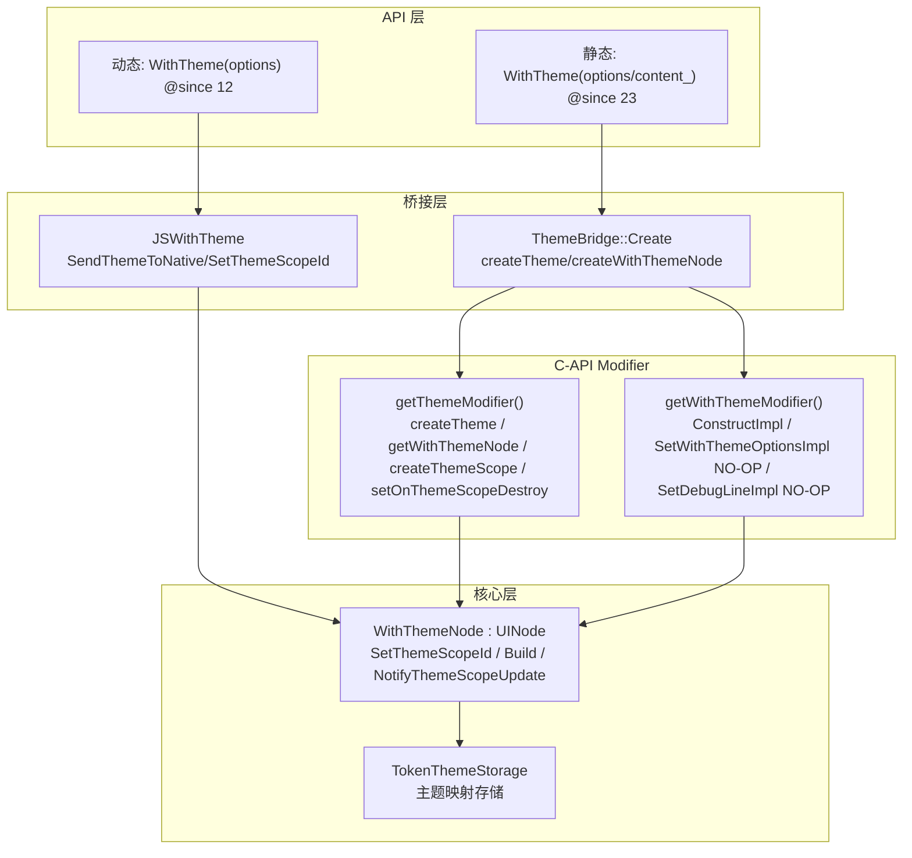

# 架构设计

> WithTheme 是 ArkUI 主题组件中的主题作用域语法节点，作为语法节点（SyntaxNode）而非 Pattern/Model 组件实现，为子组件提供局部主题覆盖和颜色模式切换能力。

## 设计元数据

| 字段 | 内容 |
|------|------|
| Design ID | DESIGN-Func-05-15-01 |
| 关联需求 | 已有能力补录（无独立 requirement.md） |
| 关联 Epic | 无 |
| 目标 Feature | Feat-01 WithTheme 组件 |
| 复杂度 | 中等 |
| 目标版本 | 动态 API 12 起，静态 API 23 起，API 26 新增 Builder 重载 |
| Owner | ArkUI SIG |
| 状态 | Baselined（已有实现补录） |

## 需求基线

| 字段 | 内容 |
|------|------|
| 问题陈述 | 应用需要局部主题作用域语法节点，在指定范围内覆盖主题和颜色模式，支持嵌套场景下最内层作用域优先 |
| 核心目标 | （Feat-01）提供 WithTheme 语法节点，支持 theme/colorMode 选项、幂等 SetThemeScopeId、嵌套构建栈、作用域销毁回调、逐节点主题更新传播 |
| P0 AC | AC-1.1 ~ AC-1.3（创建与选项）、AC-2.1 ~ AC-2.3（作用域根幂等）、AC-3.1 ~ AC-3.3（嵌套构建栈）、AC-4.1 ~ AC-4.2（主题更新传播）、AC-5.1 ~ AC-5.2（销毁回调）、AC-6.1 ~ AC-6.3（colorMode）、AC-7.1 ~ AC-7.2（默认主题回退）、AC-8.1 ~ AC-8.3（属性与桥接差异） |

## 上下文和现状

### 涉及仓和模块

| 仓库 | 模块路径 | 当前职责 | 本 Feature 影响 |
|------|----------|----------|-----------------|
| ace_engine | `frameworks/core/components_ng/syntax/with_theme_node.h/.cpp` | WithThemeNode 语法节点定义，作用域管理、构建栈、销毁回调 | 全量涉及 |
| ace_engine | `frameworks/bridge/declarative_frontend/ark_theme/theme_apply/js_with_theme.h/.cpp` | JS 桥接层，主题颜色解析与交换 | 全量涉及 |
| ace_engine | `frameworks/bridge/declarative_frontend/engine/jsi/nativeModule/arkts_native_theme_bridge.cpp/.h` | ArkTS 桥接层，C-API 调用与回调封装 | 全量涉及 |
| ace_engine | `frameworks/core/interfaces/native/implementation/with_theme_modifier.cpp` | C-API Modifier 表，构造与属性委托 | 全量涉及 |
| ace_engine | `frameworks/core/components_ng/token_theme/token_theme_storage.h/.cpp` | Token 主题存储单例，持有主题映射 | 间接涉及 |

### 调用链层级分析

| 层 | 模块 | 职责 | 修改类型 |
|----|------|------|----------|
| JS Bridge | `frameworks/bridge/declarative_frontend/ark_theme/theme_apply/js_with_theme.cpp` | JS→C++ 调用桥接，解析颜色数组、交换当前主题 | 无修改（规格补录） |
| ArkTS Bridge | `frameworks/bridge/declarative_frontend/engine/jsi/nativeModule/arkts_native_theme_bridge.cpp` | ArkTS→C-API 调用，createTheme/createWithThemeNode/createThemeScope | 无修改（规格补录） |
| C-API Modifier | `frameworks/core/interfaces/native/implementation/with_theme_modifier.cpp` | GENERATED_ArkUIWithThemeModifier 表：ConstructImpl / SetWithThemeOptionsImpl(NO-OP) / SetDebugLineImpl(NO-OP) | 无修改（规格补录） |
| C-API Theme Modifier | `frameworks/core/interfaces/native/node/theme_modifier.h` | getThemeModifier() 表：createTheme / getWithThemeNode / createWithThemeNode / createThemeScope / setOnThemeScopeDestroy / setDefaultTheme / removeFromCache | 无修改（规格补录） |
| Syntax Node | `frameworks/core/components_ng/syntax/with_theme_node.cpp/.h` | WithThemeNode : UINode，作用域根、构建栈、销毁回调、主题更新传播 | 无修改（规格补录） |
| Storage | `frameworks/core/components_ng/token_theme/token_theme_storage.h/.cpp` | TokenThemeStorage 单例，主题映射、darkMap 初始化 | 无修改（规格补录） |

### 适用架构规则

| 规则 ID | 设计结论 |
|---------|----------|
| OH-ARCH-01 | WithTheme 是语法节点（SyntaxNode），不遵循 Pattern-Property-PaintMethod 三层架构 |
| OH-ARCH-02 | WithThemeNode 继承 UINode 而非 FrameNode，IsAtomicNode()=false，IsSyntaxNode()=true |
| OH-ARCH-03 | 主题作用域通过 ThemeScopeId 标识，SetThemeScopeId 幂等（仅当 themeScopeId_==0 时设置） |

## 不涉及项承接

| 维度 | 结论 |
|------|------|
| 性能 | N/A — WithTheme 为语法节点，无渲染开销，构建栈为 thread_local vector |
| 安全与权限 | N/A — WithTheme 不涉及安全敏感操作 |
| 兼容性 | 展开设计 — 动态 API 12 vs 静态 API 23 差异，API 26 新增 Builder 重载与 debugLine/setWithThemeOptions/applyAttributesFinish |
| API/SDK | 展开设计 — 动态 vs 静态 API 签名差异需交叉验证；setWithThemeOptions/debugLine 在 C++ 当前为 NO-OP |
| IPC/跨进程 | N/A — WithTheme 为纯 UI 语法节点，不涉及 IPC |
| 构建与部件 | N/A — WithThemeNode 源码已包含在 syntax 构建目标中 |

## 关键设计决策

| 决策 ID | 问题 | 推荐方案 | 探索过的替代方案 | 取舍理由 | 影响 |
|---------|------|----------|------------------|----------|------|
| ADR-1 | WithTheme 实现方式 | 语法节点（WithThemeNode : UINode），非 Pattern/Model 组件 | 使用 Pattern/Model 架构 | WithTheme 是控制流节点而非可视节点，不参与渲染/布局，语法节点更符合其语义 | 无 WithThemePattern/WithThemeModel；无 LayoutProperty/PaintProperty |
| ADR-2 | ThemeScopeId 设置时机 | 构造时 SetThemeScopeId(nodeId)，且幂等：仅当 themeScopeId_==0 时设置 | 每次调用都覆盖 | 幂等设计防止外部覆盖已确定的 scope id，保证作用域稳定性 | 重复调用 SetThemeScopeId 被静默忽略 |
| ADR-3 | 嵌套 WithTheme 作用域解析 | thread_local 构建栈（g_withThemeBuildNodeIdStack），Build 时 push，析构 pop，GetCurrentBuildingNodeId 返回栈顶 | 全局变量或递归参数 | thread_local 栈天然支持嵌套且线程安全，无需额外同步 | 嵌套场景暴露最内层 WithTheme 的 nodeId |
| ADR-4 | 主题更新传播机制 | NotifyThemeScopeUpdate 先调 UINode::UpdateThemeScopeUpdate(递归子节点)，再遍历 themeScopeUpdateCallbacksMap_ 逐节点回调 | 仅递归或不递归 | 双层传播：递归更新子树 + 逐节点精确回调 | UpdateThemeScopeId/UpdateThemeScopeUpdate 在 WithThemeNode 中为 NO-OP（scope root 不向上传播） |
| ADR-5 | WithThemeAttribute 通用属性/事件 | 不支持（SDK 声明 "universal attributes are not supported"） | 继承 CommonMethod 通用属性 | WithTheme 是作用域容器，自身无可视属性 | 动态 WithThemeAttribute 为空 class；静态有 debugLine/setWithThemeOptions/applyAttributesFinish 但 C++ 当前为 NO-OP |
| ADR-6 | setWithThemeOptions/debugLine C++ 实现 | 当前为 NO-OP（仅校验 frameNode+options 非空） | 完整实现 | 静态 API 26 新增方法，C++ 端尚未接入实际逻辑 | 静态前端调用这些方法不会产生效果 |

## 设计骨架

### 骨架范围

| 骨架项 | 目标 | 不包含 | 验证方式 |
|--------|------|--------|----------|
| WithThemeNode | 语法节点定义，作用域管理 | Pattern/Model/LayoutProperty/PaintProperty | 单元测试 |
| 构建栈 | thread_local g_withThemeBuildNodeIdStack | 全局状态管理 | 单元测试 |
| 主题更新传播 | NotifyThemeScopeUpdate + themeScopeUpdateCallbacksMap_ | 主题内容解析 | 单元测试 |
| JS/ArkTS 桥接 | 颜色解析、C-API 调用 | 主题存储实现 | 代码审查 |

### 骨架 Spec 拆分

| Task ID | 目标 | 受影响文件 | AC |
|---------|------|------------|-----|
| TASK-SKELETON-1 | WithThemeNode 语法节点定义 | `with_theme_node.h` | AC-1.1, AC-3.1 |
| TASK-SKELETON-2 | 构建栈与嵌套作用域 | `with_theme_node.cpp` | AC-3.2, AC-3.3 |
| TASK-SKELETON-3 | 主题更新传播 | `with_theme_node.cpp` | AC-4.1, AC-4.2 |
| TASK-SKELETON-4 | 销毁回调与存储清理 | `with_theme_node.cpp` | AC-5.1, AC-5.2 |

## 后续 Task 拆分

| Task ID | 目标 | 受影响文件 | 依赖 |
|---------|------|------------|------|
| TASK-1 | WithTheme 组件全部行为规格 | Feat-01-with-theme-full-spec.md | 无 |

## API 签名、Kit 与权限

### 新增 API

| API 签名 | 类型 | d.ts 位置 | 权限要求 | SysCap |
|----------|------|-----------|----------|--------|
| `WithTheme(options: WithThemeOptions): WithThemeAttribute` | Public | `with_theme.d.ts` | - | SystemCapability.ArkUI.ArkUI.Full |
| `WithTheme(style_: CustomBuilderT<WithThemeAttribute>, content_?: CustomBuilder): WithThemeAttribute` | Public | `withTheme.d.ets` | - | SystemCapability.ArkUI.ArkUI.Full |

### 变更/废弃 API

| 原有 API | 变更类型 | 新 API | 迁移说明 |
|----------|----------|--------|----------|
| — | — | — | 无变更/废弃 API |

## 构建系统影响

### BUILD.gn 变更

```
无变更。WithThemeNode 实现位于 syntax 构建目标，已有构建配置覆盖。
```

### bundle.json 变更

无变更。

## 可选设计扩展

### 架构图



### 数据流/控制流

| 步骤 | 调用方 | 被调用方 | 数据/接口 | 说明 |
|------|--------|----------|-----------|------|
| 1 | ArkTS | ThemeBridge::Create | themeScopeId, themeId, colors[], darkColors[], colorMode, onThemeScopeDestroy, darkSetStatus | 校验参数，解析颜色 |
| 2 | ThemeBridge::Create | getThemeModifier()->createTheme | themeId, lightColors, darkColors, colorMode | 创建 Theme 对象 |
| 3 | ThemeBridge::Create | getThemeModifier()->getWithThemeNode / CreateWithThemeNode | themeScopeId | 获取或创建 WithThemeNode |
| 4 | ThemeBridge::Create | getThemeModifier()->createThemeScope | node, theme | 关联 Theme 到作用域 |
| 5 | ThemeBridge::Create | getThemeModifier()->setOnThemeScopeDestroy | node, callback | 设置销毁回调 |
| 6 | WithThemeNode::Build | WithThemeBuildStackGuard | GetId() | push nodeId 到 thread_local 栈 |
| 7 | 子组件构建 | WithThemeNode::GetCurrentBuildingNodeId | — | 获取最内层 WithTheme nodeId |
| 8 | ~WithThemeNode | themeScopeDestroyCallback_ | — | 触发销毁回调 |
| 9 | ~WithThemeNode | TokenThemeStorage::RemoveThemeScope | GetId() | 清理存储中的作用域映射 |

### 数据模型设计

**ArkTS (API 层类型)**

```typescript
// with_theme.d.ts (动态)
interface WithThemeOptions {
  theme?: CustomTheme;        // 默认 undefined → 默认 token 样式
  colorMode?: ThemeColorMode; // 默认 SYSTEM
}
type WithThemeInterface = (options: WithThemeOptions) => WithThemeAttribute;
class WithThemeAttribute {}  // 空，不支持通用属性/事件
```

**C++ (框架层结构)**

```cpp
// with_theme_node.h
using ThemeScopeDestroyCallback = std::function<void()>;

class WithThemeNode : public UINode {
    DECLARE_ACE_TYPE(WithThemeNode, UINode);
    ThemeScopeDestroyCallback themeScopeDestroyCallback_;
    std::unordered_map<int32_t, std::function<void()>> themeScopeUpdateCallbacksMap_;
    // thread_local g_withThemeBuildNodeIdStack (构建栈)
};
```

## 详细设计

### WithThemeNode 创建流程

**创建入口**: `ThemeBridge::CreateWithThemeNode()` (`arkts_native_theme_bridge.cpp:123-131`)

```
1. themeModifier->createWithThemeNode(themeScopeId) 创建 WithThemeNode
2. AceType::Claim → DecRefCount
3. ViewStackProcessor::GetInstance()->Push(withThemeNode)
```

**构造函数** (`with_theme_node.h:37-39`):
```
WithThemeNode(nodeId) : UINode(V2::JS_WITH_THEME_ETS_TAG, nodeId) {
    SetThemeScopeId(nodeId);  // 构造时即设置作用域 ID
}
```

### 幂等 SetThemeScopeId 算法

**入口**: `WithThemeNode::SetThemeScopeId()` (`with_theme_node.cpp:106-111`)

```
1. IF themeScopeId_ == 0:
     UINode::SetThemeScopeId(themeScopeId)  // 仅首次设置
   ELSE:
     忽略（静默 NO-OP）
```

### 嵌套构建栈算法

**入口**: `WithThemeNode::Build()` (`with_theme_node.cpp:113-117`)

```
1. WithThemeBuildStackGuard guard(GetId())  // push nodeId 到 thread_local 栈
2. UINode::Build(extraInfos)                // 构建子节点
3. guard 析构 → pop 栈顶                    // 自动清理
```

**获取当前构建节点** (`with_theme_node.cpp:119-125`):
```
1. IF g_withThemeBuildNodeIdStack 为空:
     return std::nullopt
2. return g_withThemeBuildNodeIdStack.back()  // 最内层 WithTheme
```

### 主题更新传播算法

**入口**: `WithThemeNode::NotifyThemeScopeUpdate()` (`with_theme_node.cpp:81-89`)

```
1. UINode::UpdateThemeScopeUpdate(GetThemeScopeId())  // 递归更新子树
2. FOR EACH (nodeId, callback) IN themeScopeUpdateCallbacksMap_:
     IF callback: callback()  // 逐节点回调
```

**NO-OP 传播** (`with_theme_node.cpp:91-99`):
```
UpdateThemeScopeId(themeScopeId) → do nothing（scope root 不向上传播）
UpdateThemeScopeUpdate(themeScopeId) → do nothing
```

## 风险和开放问题

| 项 | 类型 | 影响 | 处理方式 | Owner |
|----|------|------|----------|-------|
| WithTheme 是语法节点非 Pattern/Model | 架构 | 高 | 明确标注为 SyntaxNode，不适用 Pattern 三层架构 | ArkUI SIG |
| WithThemeOptions 无 onAppearing/onDisappearing | 兼容性 | 中 | SDK 仅 theme/colorMode；仅有 onThemeScopeDestroy + onThemeScopeUpdate | ArkUI SIG |
| setWithThemeOptions/debugLine C++ 为 NO-OP | 兼容性 | 中 | 静态 API 26 新增方法，C++ 端尚未接入逻辑，在规格中标注 | ArkUI SIG |
| WithThemeAttribute 不支持通用属性/事件 | 兼容性 | 中 | SDK 明确声明不支持，开发者无法设置 padding/margin/onClick 等 | ArkUI SIG |
| JSWithTheme 标注 backward compat | 架构 | 低 | js_with_theme.h:24-25 标注 "remove when new theme solution done"，未来可能移除 | ArkUI SIG |
| thread_local 构建栈跨线程不共享 | 架构 | 低 | thread_local 设计天然线程安全，但跨线程无法共享构建上下文 | ArkUI SIG |

## 设计审批

- [x] 需求基线已确认，设计覆盖 P0/P1 AC
- [x] 不涉及项已承接，N/A 和展开项都有结论
- [x] 涉及仓和模块职责清楚
- [x] 适用架构规则已识别并形成设计结论
- [x] 分层和子系统边界合规
- [x] API 变更有签名、权限、错误码和兼容性说明
- [x] BUILD.gn/bundle.json 影响明确
- [x] 设计输出和后续 Task 拆分明确
- [x] 关键设计决策有理由和影响说明
- [x] 风险和开放问题有 Owner

**结论:** 通过（已有实现补录）
