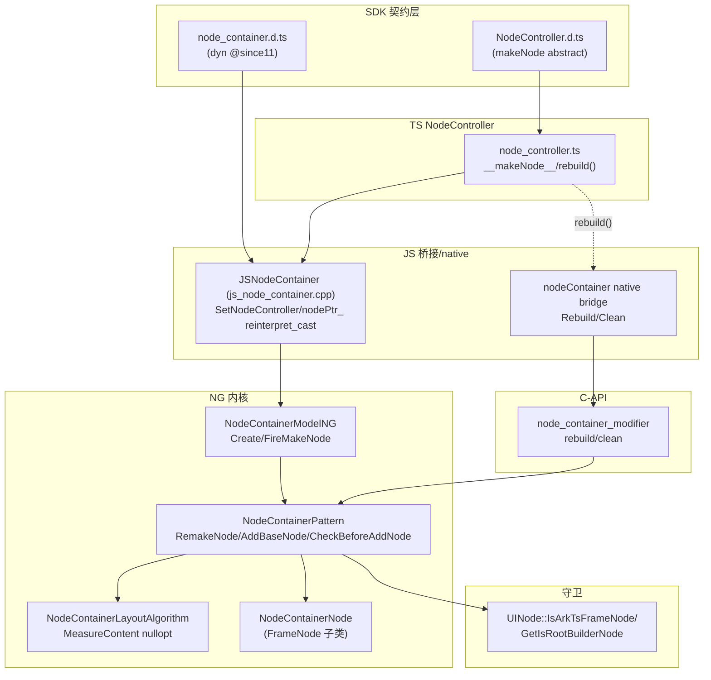
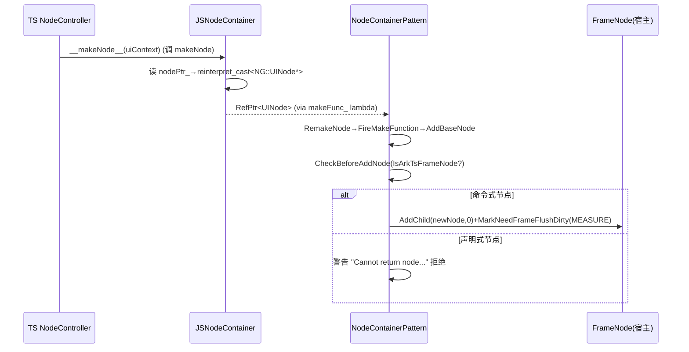

# 架构设计

> 确认目标仓和模块的架构约束、关键设计决策、Spec 拆分方向。

## 设计元数据

| Field | Content |
|-------|---------|
| Design ID | `DESIGN-Func-05-16-01` |
| 关联需求 | 已有能力补录（无独立 requirement.md） |
| 关联 Epic | 无 |
| 目标 Feature | Feat-01 NodeContainer 渲染宿主与 FrameNode 桥接（基线）；Feat-02 NodeController 生命周期回调（已补录）；Feat-03 复用与纹理导出（已补录） |
| 复杂度 | 高 |
| 目标版本 | dynamic `@since11`（NodeContainer/NodeController/makeNode/rebuild，`@atomicservice since12`）/ `@since18`（onAttach/Detach/bind 回调）；static `@since23`（整套）+ `@since26 staticonly`（style-builder/setNodeContainerOptions） |
| Owner | ArkUI SIG |
| 状态 | Baselined（已有实现补录） |

## 需求基线

> 需求基线详见 proposal.md。以下仅列出设计阶段需要额外强调的要点。

| 项 | 补充说明 |
|----|---------|
| 补录而非新增 | 当前实现即规格，可疑行为只能标注为风险/备注 |
| 范围边界 | 本功能域（05-16-01）覆盖 NodeContainer 渲染宿主 + NodeController（TS 抽象）+ 声明式↔命令式桥接 + 生命周期 + 复用 + 纹理导出；FrameNode/BuilderNode/RenderNode（04-06）、UIContext 为独立 FuncID/模块，仅作类型引用 |
| 无 C++ NodeController | NodeController 为纯 TS 抽象类，C++ 对其不透明，仅经 `__makeNode__` 函数属性 + `_nodeContainerId._value` 字段交互 |
| 跨界桥接 | 经 `nodePtr_` 原生指针 `reinterpret_cast<NG::UINode*>` 跨 declarative↔imperative 边界 |
| （Feat-02）生命周期 | NodeController 回调 `@since11`（aboutTo*/touch）/`@since18`（attach/bind）；`aboutToAppear` 异步、其余同步；`aboutToResize` 在 Pattern（非 EventHub）；bind/unbind 状态机（`onWillBind→onBind→makeNode`）与 appear/detach 两轴独立；containerId=NodeContainer element id；纯通知无 dirty |
| （Feat-03）复用与纹理导出 | NodeContainerNode OnRecycle/OnReuse **不调基类**（无子递归）、无公开复用 API、不支持跨实例复用；纹理导出 embed node（surfaceId_ 键 ElementRegister、Rosen DoTextureExport、防嵌套、after-layout 触发、accessibility 消费） |

## 上下文和现状

### 涉及仓和模块

| 仓库 | 补充架构说明 |
|------|-------------|
| `arkui_ace_engine` | NodeContainer 全部实现（TS NodeController、JS 桥接、NG Pattern/Model/EventHub/Layout/Node、native 模块、C-API modifier）均在本仓 |
| `interface/sdk-js` | 提供 dynamic `node_container.d.ts`/`NodeController.d.ts` 与 static `nodeContainer.static.d.ets`/`NodeController.static.d.ets` 契约（外部 API 权威） |

> 仓、模块、当前职责、影响类型详见 proposal.md「影响范围」。

### 调用链层级分析

| 层 | 模块 | 职责 | 修改类型 |
|----|------|------|---------|
| 1. SDK 契约层 | `node_container.d.ts`/`NodeController.d.ts`（dyn）、`nodeContainer.static.d.ets`/`NodeController.static.d.ets`（static） | 声明 NodeContainer/NodeController/makeNode/回调 | 不修改（外部 API 权威） |
| 2. TS NodeController 层 | `frameworks/bridge/declarative_frontend/ark_node/src/node_controller.ts` | 纯 TS 抽象类：`__makeNode__`（调 makeNode+暂存 FrameNode）、`rebuild()`（调 native） | 现状（Feat-01） |
| 3. JS 桥接层 | `frameworks/bridge/declarative_frontend/jsview/js_node_container.cpp` | `JSNodeContainer`：Create/SetNodeController/BindFunc/回调绑定；`nodePtr_` reinterpret_cast 跨界 | 现状（Feat-01） |
| 4. Native 模块层 | `frameworks/bridge/declarative_frontend/engine/jsi/nativeModule/arkts_native_node_container_bridge.cpp` | `nodeContainer` native 对象：Rebuild/Clean | 现状（Feat-01） |
| 5. NG Model 工厂层 | `frameworks/core/components_ng/pattern/node_container/node_container_model_ng.cpp`/`node_container_model.h` | Create（默认 TOP_LEFT）/SetMakeFunction/FireMakeNode/CreateFrameNode | 现状（Feat-01） |
| 6. NG Pattern 层（渲染宿主） | `frameworks/core/components_ng/pattern/node_container/node_container_pattern.cpp`/`.h` | RemakeNode/AddBaseNode/CleanChild/FireMakeFunction/CheckBeforeAddNode 守卫/OnResize/纹理导出 | 现状（Feat-01） |
| 7. NG EventHub 层 | `node_container_event_hub.cpp`/`.h` | 回调存储 + Fire*（aboutTo*/onAttach/Detach/bind 系列等） | 现状（Feat-02 已补录：aboutToAppear 异步、其余同步） |
| 8. NG Layout 层 | `node_container_layout_algorithm.cpp`/`.h` | Measure（layoutPolicy 延迟+RenderNode nullopt+MeasureAdaptiveLayoutChildren）、MeasureContent nullopt；extends StackLayoutAlgorithm | 现状（Feat-01） |
| 9. NG Node 层 | `node_container_node.cpp`/`.h` | FrameNode 子类（NODE_CONTAINER_ETS_TAG）；OnRecycle/OnReuse（复用，不调基类） | 现状（Feat-03 已补录：OnRecycle/OnReuse 不调基类） |
| 10. C-API Modifier 层 | `frameworks/core/interfaces/native/node/node_container_modifier.cpp` | rebuild/clean vtable（ArkUINodeContainerModifier + CJUINodeContainerModifier） | 现状（Feat-01） |
| 11. UINode 守卫层 | `frameworks/core/components_ng/base/ui_node.h` | `IsArkTsFrameNode`/`GetIsRootBuilderNode` 标志（边界准入） | 现状（跨特性） |
| 12. C-API 生成 accessor 层 | `frameworks/core/interfaces/native/implementation/node_container_ops_accessor.cpp` | Arkoala/生成 C-API（construct/AddNodeContainerRootNode/lifecycle setters） | 现状 |

检查项：
- [x] 调用链每一层都已覆盖（SDK→TS→JS 桥接→native→Model→Pattern→Layout→Node→Modifier→守卫）
- [x] 每层职责边界清晰（TS 驱动 makeNode，C++ 经 nodePtr_ 跨界执行 AddChild）
- [x] 每层修改类型明确（均为「现状」，存量补录）

### 适用架构规则

| Rule ID | 适用原因 | 设计结论 | 验证方式 |
|---------|---------|---------|---------|
| OH-ARCH-LAYERING | SDK→TS→JS→native→Model→Pattern→Layout 多层 | 调用方向自顶向下；C++ Pattern 不直接调 TS，经 JS 桥接 lambda 回调 | 架构评审/依赖检查 |
| OH-ARCH-SUBSYSTEM | 仅本仓 + SDK 契约，无跨子系统 | 不引入子系统外依赖 | 依赖检查 |
| OH-ARCH-API-LEVEL | dyn `@since11/18`、static `@since23/26` | Public API，无新增权限 | API 评审/XTS |
| OH-ARCH-COMPONENT-BUILD | 现状无 BUILD.gn/bundle.json 变更 | 无构建影响 | 构建验证 |
| OH-ARCH-ERROR-LOG | 非命令式节点仅 `Cannot return node...` 警告（不抛错）；rebuild 未绑定静默 | 警告/静默降级，无错误码 | UT/hilog |

## 不涉及项承接

> proposal.md 已完成 N/A 判定。本节仅对标记「涉及」且需展开设计的维度给出结论。

| 维度 | 设计结论 |
|------|---------|
| 跨进程/SA | 不涉及（同进程节点） |
| 持久化 | 不涉及 |
| 权限 | 不涉及（Public API 无权限） |
| 国际化/RTL | base node 子树随父容器 |
| 多范式兼容 | dynamic（NG）+ static（`@since23`）双范式；`@since26 staticonly` style-builder |
| 范围边界 | FrameNode/BuilderNode/RenderNode（04-06）、UIContext 为独立 FuncID/模块，仅作类型引用 |

## 关键设计决策

| 决策 ID | 问题 | 推荐方案 | 探索过的替代方案 | 取舍理由 | 影响 |
|--------|------|---------|----------------|---------|------|
| ADR-1 | NodeController 的实现位置 | **纯 TS 抽象类**（`node_controller.ts`），C++ 对其不透明，仅经 `__makeNode__` 函数属性 + `_nodeContainerId._value` 字段交互；**无 C++ NodeController 类** | (a) C++ 抽象基类；(b) 双层镜像 | TS 侧持有 UIContext/FrameNode 引用且与状态管理同层；C++ 仅需节点指针，无需感知 controller 语义 | C++ 侧 controller 不透明，所有回调经 JS 桥接 lambda 注入（风险 RISK-1） |
| ADR-2 | declarative↔imperative 边界守卫 | `CheckBeforeAddNode` 要求返回节点 `IsArkTsFrameNode()` 或 `GetIsRootBuilderNode()`；声明式节点拒绝+警告（不崩） | (a) 无守卫；(b) 抛错崩溃 | 维护边界完整；声明式节点挂入会破坏节点树所有权/生命周期；拒绝+警告保韧性 | 仅命令式 ArkTsFrameNode/RootBuilderNode 可挂入（风险 RISK-2） |
| ADR-3 | rebuild 路径复用 | `controller.rebuild()` 经 native modifier 复用与初始渲染相同的 `RemakeNode→FireMakeFunction→AddBaseNode` 路径，**无分叉** | (a) 独立 rebuild 实现；(b) 全量重建 | 复用降低维护成本、保证语义一致 | rebuild 与初始/变更渲染同路径 |
| ADR-4 | NodeContainer 尺寸模型 | `NodeContainerLayoutAlgorithm`（extends StackLayoutAlgorithm），`MeasureContent` 返 `nullopt`（尺寸来自宿主 constraint/属性，非子节点）+ layoutPolicy 延迟 + match-parent/fix 启用 | (a) wrap 子节点尺寸；(b) 固定尺寸 | NodeContainer 为占位宿主，尺寸由声明式布局决定，子节点适配宿主 | 子节点尺寸适配宿主而非反向 |
| ADR-5 | 跨界指针机制 | makeNode 返回的 FrameNode 经 `nodePtr_` 原生指针 `reinterpret_cast<NG::UINode*>`+`AceType::Claim` 跨界为 `RefPtr<NG::UINode>` | (a) RefPtr 跨边界传递；(b) 句柄表 | 原生指针零拷贝、低开销；类型擦除由 IsArkTsFrameNode 守卫兜底 | 指针跨界依赖守卫保证类型安全（风险 RISK-1） |
| ADR-F2-1 | 生命周期两轴独立 | bind/unbind（controller↔container 身份，`onWillBind/Bind/WillUnbind/Unbind` `@since18`）与 appear/detach（container↔主树可见性，`onAttach/Detach`+`aboutToAppear/Disappear`）是**两个独立轴**，互不依赖 | (a) 单一生命周期轴；(b) 合并 bind 与 appear | 身份绑定与可见性语义不同；独立轴允许 controller 绑定后不可见或可见后重绑 | 下游勿假设绑定即可见（风险 RISK-F2-1） |
| ADR-F2-2 | 回调存储与同步性 | `aboutToResize` 存于 Pattern `resizeFunc_`（非 EventHub）；`aboutToAppear` **异步** PostTask（先 copy 防重入覆写），其余 sync copy-then-invoke | (a) 全在 EventHub；(b) 全同步 | resize 经布局路径触发，与 EventHub 解耦；appear 异步避免重入 | aboutToResize 存储位置不同（风险 RISK-F2-2） |
| ADR-F2-3 | bind 状态机顺序 | 绑定：`onWillBind→set _value→onBind→makeNode`；解绑：`onWillUnbind→state mutation→onUnbind`；containerId=NodeContainer element id | (a) makeNode 在 onBind 前；(b) 无 Will 阶段 | Will→state→Did 保证回调可观测状态迁移；makeNode 在 onBind 后确保绑定已立 | 下游勿在 onWillBind 假设 makeNode 已完成 |
| ADR-F3-1 | NodeContainerNode 复用覆写不调基类 | `OnRecycle`/`OnReuse` 覆写**不调** `FrameNode::OnRecycle`/`OnReuse`/`UINode::OnRecycle`（不递归子节点、不 ClearAccessibilityFocus），仅做 destroyCallbacksMap_+ResetGeometryTransition+Pattern no-op | (a) 调基类递归子；(b) 不覆写 | NodeContainer 的 base node 是命令式节点，其生命周期由命令式侧管理，递归 OnRecycle 会误触发；不调基类避免重复/误清理 | 下游勿假设子节点 OnRecycle 自动触发（风险 RISK-F3-1） |
| ADR-F3-2 | 复用单元与跨实例限制 | 复用单元为 **NodeContainerNode FrameNode**（非 NodeController）；NodeController **无公开复用 API**；**不支持跨实例复用**（SDK caveat） | (a) controller 级复用；(b) 支持跨实例 | NodeController 持有 _nodeContainerId 状态，跨实例复用会破坏绑定关系；NodeContainerNode 级复用由标准可复用容器驱动 | 跨实例复用不支持（风险 RISK-F3-2） |
| ADR-F3-3 | 纹理导出 embed node surface sharing | 子节点 `IsNeedExportTexture` 时经 `surfaceId_` 键入 ElementRegister 为 embed node，Rosen `DoTextureExport`（RSTextureExport surface sharing）；防嵌套（祖先 NodeContainer 已纹理渲染则不重复）；start 由 after-layout 驱动；供 accessibility 跨 surface 遍历 | (a) 无纹理导出；(b) 内联 start | 跨 surface 边界渲染共享（嵌入场景）；after-layout 保证布局就绪；防嵌套避免重复导出 | surfaceId_ 键映射供 accessibility 消费 |

## 设计骨架

### 骨架范围

| 骨架项 | 目标 | 不包含 | 验证方式 |
|--------|------|--------|---------|
| 构造 + makeNode | 固化 NodeContainer/makeNode 契约 + 返回 null | 生命周期回调（Feat-02） | UT + SDK 比对 |
| 桥接 | 固化 __makeNode__/nodePtr_ 跨界 + 守卫 | — | UT |
| AddBaseNode/rebuild | 固化 RemakeNode/AddBaseNode/CleanChild/rebuild | — | UT |
| Layout | 固化 MeasureContent nullopt + layoutPolicy | — | UT |

### 骨架 Spec 拆分

| Task ID | 目标 | 受影响文件 | AC |
|---------|------|----------|-----|
| TASK-SKELETON-1 | Feat-01 渲染宿主+桥接+layout 基线 | `node_container_pattern.cpp`、`js_node_container.cpp`、`node_controller.ts`、`node_container_layout_algorithm.cpp` | AC-1.1~5.7 |

## 后续 Task 拆分

| Task ID | 目标 | 受影响文件 | 依赖 |
|---------|------|----------|------|
| T-1 | Feat-01 NodeContainer 渲染宿主与 FrameNode 桥接（基线，本设计已承接） | `Feat-01-*-spec.md` + 本 design.md | — |
| T-2 | Feat-02 NodeController 生命周期回调（已补录） | `node_container_event_hub.*`、`js_node_container.cpp`（SetOn*Func）、`node_container_pattern.cpp`（OnDirtyLayoutWrapperSwap→OnResize） | T-1 |
| T-3 | Feat-03 复用与纹理导出（已补录） | `node_container_node.cpp`（OnRecycle/OnReuse）、`node_container_pattern.cpp`（HandleTextureExport/SetExportTextureInfoIfNeeded） | T-1 |

## API 签名、Kit 与权限

> 本节承接 spec.md「API 变更分析」中识别的 API，给出签名、权限和 d.ts 位置等实现细节。

### 新增 API

无新增。本特性覆盖既有 API（存量补录）。

### 变更/废弃 API

| 原有 API | 变更类型 | 新 API | 迁移说明 |
|---------|---------|--------|---------|
| `NodeContainer(controller)`（dyn `@since11`/static `@since23`） | 既有 | — | static @since26 staticonly style-builder 须 setNodeContainerOptions+applyAttributesFinish |
| `NodeController.makeNode`（abstract `@since11`） | 既有 | — | 返回 null 移除子节点 |
| `NodeController.rebuild()`（`@since11`） | 既有 | — | 复用 RemakeNode 路径 |
| `NodeController.aboutToResize/aboutToAppear/aboutToDisappear/onTouchEvent`（dyn `@since11`/static `@since23`） | 既有 | — | 基础生命周期（Feat-02） |
| `NodeController.onAttach/onDetach`（dyn `@since18`/static `@since23`） | 既有 | — | 主树 attach/detach（Feat-02） |
| `NodeController.onWillBind/onWillUnbind/onBind/onUnbind(containerId)`（dyn `@since18`/static `@since23`） | 既有 | — | bind/unbind 状态机（Feat-02）；containerId=NodeContainer uniqueId |

> d.ts 位置：dynamic `interface/sdk-js/api/@internal/component/ets/node_container.d.ts:36-108`、`interface/sdk-js/api/arkui/NodeController.d.ts:47-142`；static `interface/sdk-js/api/arkui/component/nodeContainer.static.d.ets:36-91`、`NodeController.static.d.ets:42-184`。Kit：ArkUI；权限：无；SysCap：`SystemCapability.ArkUI.ArkUI.Full`。

## 构建系统影响

### BUILD.gn 变更

无变更（存量补录）。NodeContainer 源文件已纳入 `frameworks/core/components_ng/pattern/node_container/` 现有构建目标。

### bundle.json 变更

无变更。

## 可选设计扩展

### 架构图



### 数据流/控制流

| 步骤 | 调用方 | 被调用方 | 数据/接口 | 说明 |
|------|--------|---------|----------|------|
| 1 | JSNodeContainer::Create | NodeContainerModelNG | FireMakeNode | 首次 make（`js_node_container.cpp:223`） |
| 2 | ModelNG | NodeContainerPattern | RemakeNode | `model_ng.cpp:131-138` |
| 3 | Pattern | makeFunc_ lambda | FireMakeFunction | 经 JS 桥接调 TS __makeNode__ |
| 4 | lambda | TS | nodePtr_→reinterpret_cast<NG::UINode*> | 跨界（`js_node_container.cpp:271-279`） |
| 5 | Pattern | FrameNode | AddChild(newNode,0) | CheckBeforeAddNode 守卫后 |
| 6 | controller.rebuild() | native modifier | RemakeNode | 复用同路径 |

### 时序设计



### 数据模型设计

**API 层（TypeScript，SDK 契约）**

```typescript
abstract class NodeController {
  abstract makeNode(uiContext: UIContext): FrameNode | null;  // @since11
  rebuild(): void;                                             // @since11 → native
  // aboutToResize/aboutToAppear/aboutToDisappear/onTouchEvent (@since11)
  // onAttach/onDetach/onWillBind/onWillUnbind/onBind/onUnbind (@since18)
}
declare const NodeContainer: (controller: NodeController) => NodeContainerAttribute;  // @since11
```

**Framework 层（C++/TS）**

```ts
// node_controller.ts:16-29
class __InternalField__ { _value = -1; __rootNodeOfNodeController__: FrameNode | null; }
_nodeContainerId: __InternalField__;
// __makeNode__(uiContext) { this._nodeContainerId.__rootNodeOfNodeController__ = this.makeNode(uiContext); return ...; }
```
```cpp
// node_container_pattern.h
std::function<RefPtr<UINode>()> makeFunc_;   // JS 桥接注入的 lambda（FireMakeFunction 调用）
// node_container_pattern.cpp:27-30 守卫
if (!(newNode->IsArkTsFrameNode()) && !newNode->GetIsRootBuilderNode()) { 拒绝+警告; }
```

| 结构 | 存储方案 | 生命周期 |
|------|---------|---------|
| `_nodeContainerId.__rootNodeOfNodeController__` | TS controller 实例 | controller 生命周期 |
| base node（RefPtr<UINode>） | FrameNode children[0] | AddBaseNode 挂入/CleanChild 移除 |
| `makeFunc_` lambda | NodeContainerPattern | controller 绑定期间 |

### 测试性设计

| 测试层级 | 测试目标 | Mock 策略 | 验证方式 |
|---------|---------|----------|---------|
| UT | Pattern RemakeNode/AddBaseNode/守卫 | Mock makeFunc_ lambda 返回各类节点 | `node_container_pattern` UT |
| UT | Layout MeasureContent/Measure | Mock 子节点 + layoutPolicy | layout_algorithm UT |
| UT | rebuild/Clean modifier | 注入 ElementRegister 节点 | modifier UT |
| XTS | dynamic/static 端到端 makeNode | 真实 NodeController | `test/xts` |

### 资源所有权矩阵

| 资源 | 创建方 | 持有方 | 销毁触发 | 实际释放 | 异常回收 |
|------|--------|--------|---------|---------|---------|
| base node（FrameNode） | TS makeNode→命令式 API | NodeContainer FrameNode children[0] | controller 解绑/CleanChild/rebuild | RemoveChildAtIndex+MarkNeedFrameFlushDirty | 非命令式节点 CheckBeforeAddNode 拒绝 |
| makeFunc_ lambda | JSNodeContainer::SetNodeController | NodeContainerPattern | controller Reset | 自动 | — |
| NodeContainer FrameNode | GetOrCreateNodeContainerNode | ElementRegister+父子树 | 父容器销毁 | 随父容器 | — |

### 接口参数规约

| 接口 | 参数 | 类型 | 合法范围 | 非法处理 | 边界说明 |
|------|------|------|---------|---------|---------|
| NodeContainer | controller | NodeController | 实现类 | — | makeNode 须返回命令式节点 |
| makeNode | uiContext | UIContext | 当前 | 返回 null→移除子节点 | 返回声明式节点→拒绝+警告 |
| rebuild | — | — | _value>=0 | 未绑定静默不派发 | 复用 RemakeNode |

### 线程与并发模型

| 操作 | 发起线程 | 回调线程 | 跨进程边界 | 线程安全 | 重入约束 |
|------|---------|---------|----------|---------|---------|
| makeNode | UI/Pipeline | 同（JS 执行） | 无 | 单线程 UI | makeFunc_ lambda 内不可重入 rebuild |
| rebuild | controller（UI） | UI | 无 | 单线程 | — |
| layout | Pipeline | 同 | 无 | 单线程 | — |

## 详细设计

### 构造与 makeNode

`NodeContainer(controller)`（dynamic `node_container.d.ts:36,51,96` `@since11`/static `nodeContainer.static.d.ets:74` `@since23`）返回 `NodeContainerAttribute`（空 CommonMethod 子类 dyn `:66`/interface extends CommonMethod static `:36`）；static `@since26 staticonly` style-builder 须 `setNodeContainerOptions(controller)`（`:60`）+`applyAttributesFinish`。`NodeController.makeNode(uiContext): FrameNode|null`（`NodeController.d.ts:75` `@since11`）为 abstract 必填；返回 null→移除子节点（doc `:66-68`）。`NodeContainerModelNG::Create`（`model_ng.cpp:22-30`）默认 `Alignment::TOP_LEFT`；C-API `CreateFrameNode` 同（`:140-145`）。

### declarative↔imperative 桥接

**无 C++ NodeController**——纯 TS 抽象（`node_controller.ts`）。TS `__makeNode__(uiContext)`（`:32-36`）调用户 `makeNode`+暂存 `_nodeContainerId.__rootNodeOfNodeController__`。`JSNodeContainer::SetNodeController`（`js_node_container.cpp:246-292`）读 `__makeNode__` 属性（`:249-253`，非 function 则 Reset return），包 `JsFunction`（`:257-259`），注册 C++ lambda（`:261-280`）：`JAVASCRIPT_EXECUTION_SCOPE`+`ContainerScope`（`:262-263`）→`func->ExecuteJS` 调 `__makeNode__`（`:264-266`）→读返回 FrameNode 的 `nodePtr_`（`:271`）→`reinterpret_cast<NG::UINode*>`+`AceType::Claim`（`:276-279`）返回 `RefPtr<NG::UINode>`。C++ 对 controller 仅知 `__makeNode__` 函数属性 + `_nodeContainerId._value` 字段。

### IsArkTsFrameNode 守卫与 AddBaseNode/CleanChild

`FireMakeNode`（`model_ng.cpp:131-138`）→`pattern->RemakeNode()`。`RemakeNode`（`pattern.cpp:46-52`）`FireMakeFunction()`（`makeFunc_()` 或 nullptr，`pattern.h:70-74`）→`AddBaseNode`。`AddBaseNode(newNode)`（`:54-72`）取旧 `GetChildAtIndex(0)`，旧==新或皆空 return；否则 `RemoveChildAtIndex(0)`+`BuilderUtils::RemoveBuilderFromParent`；newNode 非空时 `CheckBeforeAddNode`→`host->AddChild(newNode,0)`+`AddBuilderToParent`+`UpdateGeometryTransition`+`OnAddBaseNode()`+`MarkNeedFrameFlushDirty(PROPERTY_UPDATE_MEASURE)`（仅 MEASURE）。`CheckBeforeAddNode`（`:26-43`）要求 `IsArkTsFrameNode()` 或 `GetIsRootBuilderNode()`（`ui_node.h:727-735,721`），否则警告 `"Cannot return node created by declarative UI function"` 返回 false；父 reparent 警告（`:34-41`）。`CleanChild`（`:74-80`）`RemoveChildAtIndex(0)`+MEASURE 脏标记。

### rebuild（controller 发起）

`controller.rebuild()`（`NodeController.d.ts:142` `@since11`）TS（`node_controller.ts:37-41`）在 `_nodeContainerId._value>=0` 时调 `getUINativeModule().nodeContainer.rebuild(_value)`；`<0` 静默不派发。native `NodeContainerBridge::Rebuild`（`arkts_native_node_container_bridge.cpp:18-26`）→`node_container_modifier.cpp:rebuild`（`:20-28`）经 `ElementRegister::GetNodeById`→`DynamicCast<FrameNode>`→`DynamicCast<NodeContainerPattern>`→`pattern->RemakeNode()`——**复用与初始渲染相同的 RemakeNode→FireMakeFunction→AddBaseNode 路径**。`Clean` modifier（`:30-37`）→`pattern->CleanChild()`。

### 自定义 layout

`NodeContainerLayoutAlgorithm`（extends `StackLayoutAlgorithm`）；`CreateLayoutAlgorithm` 返回之（`pattern.h:40-43`），`CreateLayoutProperty` 返回 `StackLayoutProperty`（`:35-38`）。`MeasureContent` 返 `std::nullopt`（`layout_algorithm.h:30-34`）——尺寸来自宿主 constraint/属性，非子节点。`Measure`（`layout_algorithm.cpp:24-59`）：`CreateChildConstraint`（`:28`）→遍历 `GetAllChildrenWithBuild`：`IsEnableChildrenMatchParent && layoutPolicy.has_value()` 且 width/height 非 NO_MATCH 则延迟入 `layoutPolicyChildren_`（`:38-47`）；非延迟者 `RenderNode` tag 用 `Measure(std::nullopt)`、其余 `Measure(layoutConstraint)`（`:48-52`）；`PerformMeasureSelf`（`:54`）；`IsEnableChildrenMatchParent` 时 `MeasureAdaptiveLayoutChildren(layoutWrapper,frameSize)`（`:55-58`）。`IsEnableChildrenMatchParent`/`IsEnableMatchParent`/`IsEnableFix` 均 `true`（`pattern.h:118-131`）。

### NodeController 生命周期回调（Feat-02）

NodeController 回调 `@since11`（aboutToResize/Appear/Disappear/onTouchEvent）+ `@since18`（onAttach/Detach/onWillBind/Unbind/Bind/Unbind），static `@since23` 全套（方法非可选、containerId:long）。存储：`aboutToAppear/Disappear/onAttach/Detach/onWillBind/Unbind/Bind/Unbind` 存 EventHub `std::function`（`event_hub.h:84-91`）；`aboutToResize` 存 Pattern `resizeFunc_`（`pattern.h:142`，与其它回调存储位置不同）。Fire*：`FireOnAppear`（`event_hub.cpp:22-44`）**异步** PostTask（UI，tag `ArkUINodeControllerAboutToAppearEvent`，先 copy 防重入覆写）；`FireOnDisappear/WillBind/WillUnbind/Bind/Unbind/Attach/Detach`（`:46-104`）sync copy-then-invoke。

触发：attach 主树→`FireOnAttach`(sync)+`FireOnAppear`(async)（`frame_node.cpp:1882-1883`）；detach→`OnDetachClear`→`FireOnDetach`(sync)+`FireOnDisappear`(sync)（`frame_node.cpp:2180`/`event_hub.cpp:723-728`）。`onTouchEvent` 经 gesture hub（`model_ng.cpp:64-69`）。`aboutToResize`：`OnDirtyLayoutWrapperSwap`（`pattern.cpp:82-112`）`frameSizeChange` 为真时投 after-layout task 调 `FireOnResize(size)`（px），`NodeContainerResizeCallback`（`js_node_container.cpp:127-142`）转 vp 建 `{width,height}`；`skipMeasure&&skipLayout` 提前 return。

bind/unbind 状态机（`JSNodeContainer::Create:168-224`）：containerId=`frameNode->GetId()`（`:184`，NodeContainer element id）。绑定：`FireOnWillBind(cid)`→`AddToNodeControllerMap`+设 `_value=cid`（`:220`）→`FireOnBind(cid)`→`FireMakeNode()`（makeNode 在 onBind 后）。解绑（node-destroy `BindFunc:161-163`/controller-rebind `ResetNodeContainerId:240-243`）：`FireOnWillUnbind`→`RemoveFromNodeControllerMap`/复位 `_value`→`FireOnUnbind`。idempotency：`_value==nodeContainerId` short-circuit（`:189-195`）；`_value!=-1`（绑别 container）先对当前 cid 触发 unbind 再绑新（`:197-199`）；null controller 早退 `RemoveChildAtIndex(0)`+MEASURE+`ResetNodeController`（`:175-180`）。两轴独立：bind/unbind（controller↔container 身份）vs appear/detach（container↔主树可见性）。生命周期回调纯通知，无 dirty/PROPERTY_UPDATE；dirty 仅 makeNode 路径（`AddBaseNode:71`/`CleanChild:79`）。JS 绑定 `SetOn*Func`（`:314-431`）读 controller 可选方法，`IsFunction` 守卫跳过缺失，包 `NodeContainerJsFunctionCallback`/`TouchCallback`/`ResizeCallback` 转发 model。

### 复用与纹理导出（Feat-03）

framework-internal。`NodeContainerNode`（FrameNode 子类，tag `NODE_CONTAINER_ETS_TAG`，`GetOrCreateNodeContainerNode:19-30`）覆写 `OnRecycle`（`node_container_node.cpp:41-50`）：触发 `destroyCallbacksMap_`（`frame_node.h:1637/842/847`）+`ResetGeometryTransition`+`Pattern::OnRecycle()`，**不调基类**（不递归子节点、不 ClearAccessibilityFocus，与标准 FrameNode `frame_node.cpp:5432-5446` 不同）；`OnReuse`（`:52-61`）调 `pattern->OnReuse()`（NodeContainerPattern **不覆写**→空基 no-op `pattern.h:427-428`）+developer-mode `PaintDebugBoundary`，**不调基类**；析构（`:32-39`）收集子树 BuilderNode 经 `BuilderUtils::ClearChildInBuilderContainer` 清理。复用单元为 NodeContainerNode FrameNode（非 controller），由标准可复用容器（ListItem/FlowItem）驱动；NodeController **无公开复用 API**（grep `NodeController.d.ts` 仅 NOTE），**不支持跨实例复用**（SDK caveat `:57-62`）。

纹理导出（embed node）：`SetExportTextureInfoIfNeeded`（`node_container_pattern.cpp:161-187`）取 `GetChildAtIndex(0)`，`IsNeedExportTexture()` 为假则 return；置 `exportTextureNode_`（WeakPtr）+`surfaceId_=StringToLongUint(child ExportTextureInfo::GetSurfaceId())`（uint64 成员 `pattern.h:144`）；防嵌套——最近祖先 NodeContainer 子已 `RENDER_TYPE_TEXTURE` 则 return（`:170-179`）。`HandleTextureExport(isStop,frameNode)`（`:114-136`）：start→`ElementRegister::RegisterEmbedNode(surfaceId_,...)`+`RenderContext::DoTextureExport(surfaceId_)`；stop→`UnregisterEmbedNode`+`StopTextureExport`；host `SetIsNeedRebuildRSTree(isStop)`。Rosen `DoTextureExport`（`rosen_render_context.cpp:6773-6785`）建 `RSTextureExport`+`RSSurfaceNode::SetTextureExport(true)`（surface sharing）。触发：`OnAddBaseNode`（`:189-194`，stop+set，不 start）、`OnMountToParentDone`（`:196-199`，set）、`OnDetachFromFrameNode`（`:138-141`，stop）、`OnDirtyLayoutWrapperSwap`（`:100-110`，`surfaceId_!=0 && !exportTextureNode_.Invalid()` 时 after-layout task start/重导出）。`GetExportTextureNode`（`:143-153`）向下走到首个 FrameNode。embed node 经 ElementRegister 双向映射（`surfaceIdEmbedNodeMap_`/`embedNodeSurfaceIdMap_`，`element_register.cpp:474-480`）供 accessibility manager 跨 surface 边界遍历（`accessibility_manager_ng.cpp:167-172,520`、`js_accessibility_manager.cpp:927-938`）。纹理路径**不置 dirty**（start 由 after-layout 驱动）；`OnRecycle`/`OnReuse` 不置 dirty。无 API 版本门控。

## 风险和开放问题

| 项 | 类型 | 影响 | 处理方式 | Owner |
|----|------|------|---------|-------|
| RISK-1 NodeContainer 经 `nodePtr_` reinterpret_cast 跨界、无 C++ NodeController（C++ 对 controller 不透明），下游勿绕过 IsArkTsFrameNode 守卫 | 架构 | 中 | 规格 AC-2.4/ADR-1/ADR-5 标注；守卫为边界完整性关键 | ArkUI SIG |
| RISK-2 makeNode 返回声明式节点仅 `Cannot return node...` 警告（不抛错不崩），应用难察觉 | API | 中 | 规格 AC-3.4/R-6 标注；警告日志 `ACE_NODE_CONTAINER`；不在规格中改实现 | ArkUI SIG |
| RISK-3 rebuild 未绑定（`_value<0`）静默不派发，应用难察觉 | API | 低 | 规格 AC-4.2/R-7 标注 | ArkUI SIG |
| RISK-F2-1 bind/unbind（controller↔container 身份）与 appear/detach（container↔主树可见性）两轴独立，下游勿假设绑定即可见或可见即绑定 | 架构 | 中 | 规格 AC-3.5/ADR-F2-1 标注；两轴触发源不同（Create vs OnAttachToMainTree） | ArkUI SIG |
| RISK-F2-2 `aboutToResize` 存于 Pattern `resizeFunc_`（非 EventHub），与其它回调存储位置不同；`aboutToAppear` 异步、其余同步 | 架构 | 低 | 规格 AC-2.3/AC-5.1/ADR-F2-2 标注 | ArkUI SIG |
| RISK-F3-1 `NodeContainerNode::OnRecycle/OnReuse` 不调 FrameNode/UINode 基类（不递归子节点、不 ClearAccessibilityFocus），与标准 FrameNode 复用语义不同，下游勿假设子节点 OnRecycle 自动触发 | 架构 | 中 | 规格 AC-1.2/AC-1.4/ADR-F3-1 标注；base node 生命周期由命令式侧管理 | ArkUI SIG |
| RISK-F3-2 NodeController 无公开复用 API、NodeContainer 不支持跨实例复用（SDK caveat），复用单元为 NodeContainerNode FrameNode | API | 中 | 规格 AC-1.6/AC-1.7/ADR-F3-2 标注；跨实例复用会破坏 _nodeContainerId 绑定 | ArkUI SIG |

## 设计审批

- [x] 需求基线已确认，设计覆盖 P0/P1 AC
- [x] 不涉及项已承接，N/A 和展开项都有结论
- [x] 涉及仓和模块职责清楚
- [x] 调用链层级分析完整，每层覆盖到位
- [x] 适用架构规则已识别并形成设计结论
- [x] 分层和子系统边界合规
- [x] API 变更有签名、权限、错误码和兼容性说明
- [x] BUILD.gn/bundle.json 影响明确
- [x] 设计输出和后续 Task 拆分明确
- [x] 关键设计决策有理由和影响说明
- [x] 风险和开放问题有 Owner

**结论:** 通过（已有实现补录）
