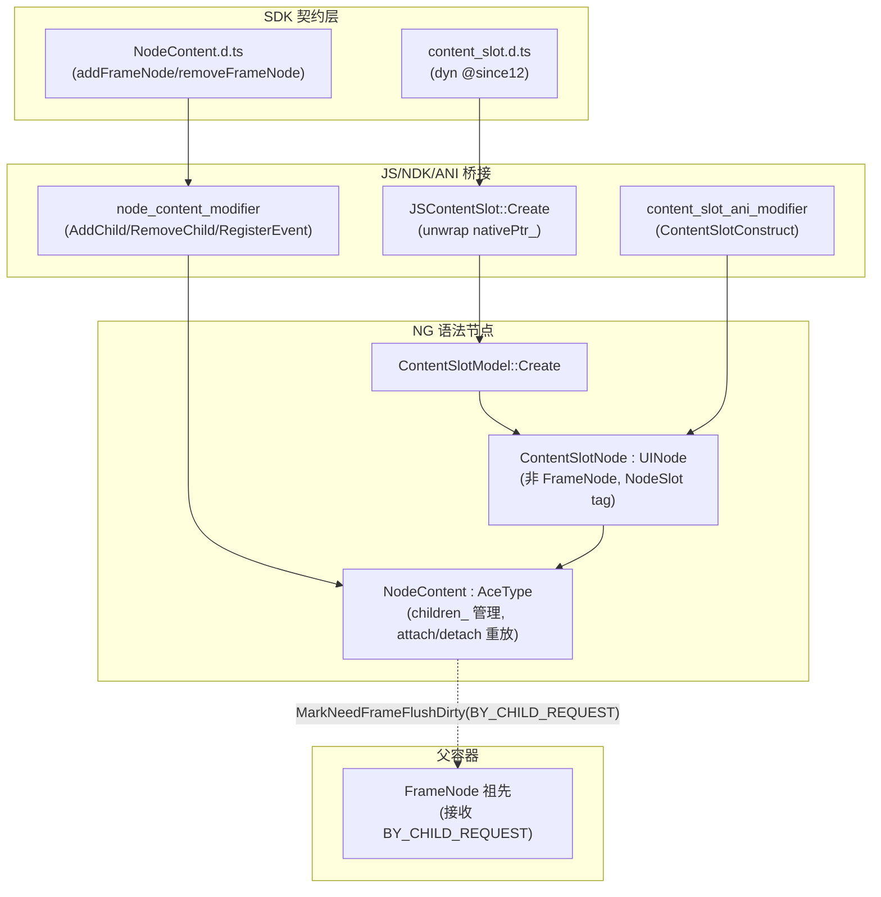
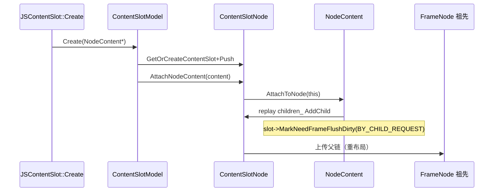

# 架构设计

> 确认目标仓和模块的架构约束、关键设计决策、Spec 拆分方向。

## 设计元数据

| Field | Content |
|-------|---------|
| Design ID | `DESIGN-Func-05-16-02` |
| 关联需求 | 已有能力补录（无独立 requirement.md） |
| 关联 Epic | 无 |
| 目标 Feature | Feat-01 ContentSlot 语法节点与 NodeContent 内容管理（基线） |
| 复杂度 | 标准 |
| 目标版本 | dynamic `@since12`（ContentSlot/NodeContent/addFrameNode·removeFrameNode，`BusinessError 100025 @since22`）；static `@since23`（整套）+ `@since26 staticonly`（style-builder + 属性方法）；`XComponentType.NODE @deprecated since 20` |
| Owner | ArkUI SIG |
| 状态 | Baselined（已有实现补录） |

## 需求基线

> 需求基线详见 proposal.md。以下仅列出设计阶段需要额外强调的要点。

| 项 | 补充说明 |
|----|---------|
| 补录而非新增 | 当前实现即规格，可疑行为只能标注为风险/备注 |
| 与 NodeContainer 边界 | ContentSlot（05-16-02）为 UINode 语法节点（非 FrameNode、无 Pattern/Layout、多子节点、NodeContent 管理）；NodeContainer（05-16-01）为 FrameNode（有 Pattern/Layout、单根、NodeController）。ContentSlot 是 `XComponentType.NODE` 的继任 |
| ContentSlotNode = UINode | 继承 UINode 而非 FrameNode——无 Pattern/LayoutProperty/LayoutAlgorithm/EventHub，经 `MarkNeedFrameFlushDirty(PROPERTY_UPDATE_BY_CHILD_REQUEST)` 上传父链到最近 FrameNode 祖先触发重布局 |

## 上下文和现状

### 涉及仓和模块

| 仓库 | 补充架构说明 |
|------|-------------|
| `arkui_ace_engine` | ContentSlot 全部实现（NG 语法节点、NodeContent 管理器、Model、JS/NDK/ANI 桥接）均在本仓 |
| `interface/sdk-js` | 提供 dynamic `content_slot.d.ts`/`NodeContent.d.ts`/`Content.d.ts` 与 static `contentSlot.static.d.ets`/`NodeContent.static.d.ets` 契约 |

> 仓、模块、当前职责、影响类型详见 proposal.md「影响范围」。

### 调用链层级分析

| 层 | 模块 | 职责 | 修改类型 |
|----|------|------|---------|
| 1. SDK 契约层 | `content_slot.d.ts`（dyn）、`contentSlot.static.d.ets`（static）、`NodeContent.d.ts`/`Content.d.ts` | 声明 ContentSlot/ContentSlotAttribute/NodeContent/Content | 不修改（外部 API 权威） |
| 2. JS 桥接层 | `frameworks/bridge/declarative_frontend/jsview/js_content_slot.cpp` | `JSContentSlot::Create`（unwrap nativePtr_→NodeContent*）、`JSNodeContent` | 现状 |
| 3. NG Model 层 | `frameworks/core/components_ng/syntax/content_slot_model_ng.cpp` | `Create(NodeContent*)`：ClaimNodeId+GetOrCreateContentSlot+Push+attach/detach | 现状 |
| 4. NG 语法节点层 | `frameworks/core/components_ng/syntax/content_slot_node.h`/`.cpp` | `ContentSlotNode : UINode`（非 FrameNode）；tag "NodeSlot"；AttachNodeContent/DetachNodeContent（所有权守卫）；OnAttachToMainTree/Detach 转发 | 现状 |
| 5. NodeContent 管理器层 | `frameworks/core/components_ng/syntax/node_content.h`/`.cpp` | `NodeContent : AceType`（非 UINode）；children_ 管理；AttachToNode/DetachFromNode（重放/回收）；AddNode/RemoveNode；生命周期 callbacks | 现状 |
| 6. NDK Modifier 层 | `frameworks/core/interfaces/native/node/node_content_modifier.cpp` | AddChild/InsertChild/RemoveChild/RegisterEvent/SetUserData/GetUserData vtable | 现状 |
| 7. Extender Accessor 层 | `frameworks/core/interfaces/native/implementation/node_content_extender_accessor.cpp` | AddFrameNodeImpl/RemoveFrameNodeImpl（IsAdopted 守卫+MarkDirtyNode） | 现状 |
| 8. ANI Modifier 层 | `frameworks/core/interfaces/native/ani/content_slot_ani_modifier.cpp` | ContentSlotConstruct/SetContentSlotOptions（static/C-API） | 现状 |
| 9. 父容器层 | FrameNode 祖先 | 接收 `PROPERTY_UPDATE_BY_CHILD_REQUEST` 上传触发重布局 | 现状（跨特性） |

检查项：
- [x] 调用链每一层都已覆盖（SDK→JS→Model→ContentSlotNode→NodeContent→NDK/Extender/ANI→父容器）
- [x] 每层职责边界清晰（TS 驱动 ContentSlot/NodeContent，C++ 管理 UINode 子树）
- [x] 每层修改类型明确（均为「现状」，存量补录）

### 适用架构规则

| Rule ID | 适用原因 | 设计结论 | 验证方式 |
|---------|---------|---------|---------|
| OH-ARCH-LAYERING | SDK→JS→Model→Node→NodeContent→Modifier 多层 | 调用方向自顶向下；ContentSlotNode 不直接布局，经上传父链 | 架构评审/依赖检查 |
| OH-ARCH-SUBSYSTEM | 仅本仓 + SDK 契约，无跨子系统 | 不引入子系统外依赖 | 依赖检查 |
| OH-ARCH-API-LEVEL | dyn `@since12/22`、static `@since23/26`；NODE `@deprecated since 20` | Public API 无新增权限 | API 评审/XTS |
| OH-ARCH-COMPONENT-BUILD | 现状无 BUILD.gn/bundle.json 变更 | 无构建影响 | 构建验证 |
| OH-ARCH-ERROR-LOG | IsAdopted→ERROR_CODE_NODE_IS_ADOPTED(106206)/BusinessError 100025 | 错误码 106206/100025 | UT |

## 不涉及项承接

> proposal.md 已完成 N/A 判定。本节仅对标记「涉及」且需展开设计的维度给出结论。

| 维度 | 设计结论 |
|------|---------|
| 跨进程/SA | 不涉及 |
| 持久化 | 不涉及 |
| 权限 | 不涉及 |
| 国际化/RTL | 子 FrameNode 随父容器 |
| 多范式兼容 | dynamic（NG）+ static（`@since23`）+ NDK/ANI 命令式 |
| 范围边界 | NodeContainer（05-16-01）为独立 FuncID；Content/NodeContent 与 ComponentContent 共享 |

## 关键设计决策

| 决策 ID | 问题 | 推荐方案 | 探索过的替代方案 | 取舍理由 | 影响 |
|--------|------|---------|----------------|---------|------|
| ADR-1 | ContentSlotNode 节点类型 | `ContentSlotNode : UINode`（**非 FrameNode**）——无 Pattern/LayoutProperty/LayoutAlgorithm/EventHub；`IsSyntaxNode/IsAtomicNode=true`；子节点增删经 `MarkNeedFrameFlushDirty(BY_CHILD_REQUEST)` 上传父链到最近 FrameNode 祖先 | (a) FrameNode+Pattern（NodeContainer 模式）；(b) FrameNode 无 Pattern | ContentSlot 为纯占位语法节点，自身不参与布局；子节点是独立 FrameNode（自带布局），slot 仅定位 | 无 Pattern/Layout（风险 RISK-1） |
| ADR-2 | NodeContent children_ 模型 | `children_` 为**脱离时真值源**；attach→遍历 `children_` replay `slot->AddChild`；detach→`children_ = slot->GetChildren()`+`slot->Clean()` 回收 | (a) slot 为真值源；(b) 双向同步 | 脱离时 NodeContent 可独立存在（无 slot 绑定），children_ 保留；attach 时重放到 slot | attach 重放/detach 回收语义 |
| ADR-3 | 所有权守卫 | `AttachNodeContent`：若旧 content 绑别 slot 则先 `DetachFromNode`；content 同时仅绑一个 slot | (a) 多 slot 共享；(b) 无守卫 | 避免 content 子树同时挂多个 slot 导致所有权混乱 | content 仅绑一个 slot |
| ADR-4 | IsAdopted 守卫 | `addFrameNode` 时 `IsAdopted()` 检查：已领养节点拒绝 `ERROR_CODE_NODE_IS_ADOPTED=106206`/`BusinessError 100025` | (a) 无守卫；(b) 自动 detach | 防止 FrameNode 被多个父重复领养导致树所有权破坏 | 106206/100025 |
| ADR-5 | NODE 废弃继任 | `XComponentType.NODE` `@deprecated since 20 @useinstead ContentSlot`；ContentSlot 为命令式节点挂载的推荐继任 | (a) 不废弃；(b) NodeContainer 继任 | ContentSlot 多子节点+轻量（UINode）更适合 C-API/native 混合开发场景 | NODE → ContentSlot 迁移 |

## 设计骨架

### 骨架范围

| 骨架项 | 目标 | 不包含 | 验证方式 |
|--------|------|--------|---------|
| 构造/绑定 | ContentSlot(content) + Create + AttachNodeContent 所有权守卫 | — | UT + SDK |
| 内容管理 | NodeContent addFrameNode/removeFrameNode + AddNode/RemoveNode + IsAdopted | — | UT + XTS |
| 生命周期/脏标记 | OnAttachToMainTree/Detach 转发 + BY_CHILD_REQUEST 上传 + extender MEASURE_SELF_AND_PARENT | — | UT |
| 多前端/NODE 废弃 | JS/NDK/ANI + XComponentType.NODE 废弃 | — | UT + SDK |

### 骨架 Spec 拆分

| Task ID | 目标 | 受影响文件 | AC |
|---------|------|----------|-----|
| TASK-SKELETON-1 | Feat-01 ContentSlot 语法节点+NodeContent+生命周期+脏标记+多前端 | `content_slot_node.*`、`node_content.*`、`content_slot_model_ng.*`、`js_content_slot.cpp`、`node_content_modifier.cpp`、`node_content_extender_accessor.cpp`、`content_slot_ani_modifier.cpp` | AC-1.1~5.4 |

## 后续 Task 拆分

| Task ID | 目标 | 受影响文件 | 依赖 |
|---------|------|----------|------|
| T-1 | Feat-01 ContentSlot 语法节点与 NodeContent 内容管理（基线，本设计已承接） | `Feat-01-*-spec.md` + 本 design.md | — |

## API 签名、Kit 与权限

> 本节承接 spec.md「API 变更分析」中识别的 API，给出签名、权限和 d.ts 位置等实现细节。

### 新增 API

无新增（存量补录）。

### 变更/废弃 API

| 原有 API | 变更类型 | 新 API | 迁移说明 |
|---------|---------|--------|---------|
| `ContentSlot(content)`（dyn `@since12`/static `@since23`） | 既有 | — | static @since26 staticonly style-builder 须 setContentSlotOptions+applyAttributesFinish |
| `NodeContent.addFrameNode`/`removeFrameNode`（dyn `@since12`） | 既有 | — | IsAdopted→106206/100025 |
| `XComponentType.NODE` | 废弃（`@deprecated since 20`） | `@useinstead ContentSlot` | 命令式挂载迁移到 ContentSlot |

> d.ts 位置：dynamic `interface/sdk-js/api/@internal/component/ets/content_slot.d.ts:42-90`、`NodeContent.d.ts:40-78`；static `contentSlot.static.d.ets:37-99`；废弃 `enums.d.ts:4199`。Kit：ArkUI；权限：无；SysCap：`SystemCapability.ArkUI.ArkUI.Full`。

## 构建系统影响

### BUILD.gn 变更

无变更（存量补录）。ContentSlot 源文件已纳入 `frameworks/core/components_ng/syntax/` 现有构建目标。

### bundle.json 变更

无变更。

## 可选设计扩展

### 架构图



### 数据流/控制流

| 步骤 | 调用方 | 被调用方 | 数据/接口 | 说明 |
|------|--------|---------|----------|------|
| 1 | JSContentSlot::Create | ContentSlotModel::Create | NodeContent* | unwrap nativePtr_ |
| 2 | Create | ContentSlotNode | AttachNodeContent | 所有权守卫 |
| 3 | addFrameNode | NodeContent::AddNode | UINode* | slot AddChild+children_ 维护 |
| 4 | AddNode | ContentSlotNode | MarkNeedFrameFlushDirty(BY_CHILD_REQUEST) | 上传父链 |
| 5 | extender | child FrameNode | MarkDirtyNode(MEASURE_SELF_AND_PARENT) | extender ArkTS 额外 |
| 6 | OnAttachToMainTree | NodeContent | OnAttachToMainTree+callback | 生命周期转发 |

### 时序设计



### 数据模型设计

**API 层（TypeScript，SDK 契约）**

```typescript
class ContentSlotAttribute {}  // dyn 空 / static 含 debugLine/setContentSlotOptions/applyAttributesFinish (@since26 staticonly)
declare const ContentSlot: (content: Content) => ContentSlotAttribute;  // @since12
class NodeContent extends Content {
  constructor(); addFrameNode(node: FrameNode): void; removeFrameNode(node: FrameNode): void;  // @since12
}
```

**Framework 层（C++）**

```cpp
// content_slot_node.h:30-85
class ContentSlotNode : public UINode {  // 非 FrameNode
    bool IsAtomicNode() const override { return true; }
    bool IsSyntaxNode() const override { return true; }
    RefPtr<NodeContent> content_;
};
// node_content.h:70-76
class NodeContent : public AceType {  // 非 UINode
    WeakPtr<UINode> nodeSlot_;
    std::list<RefPtr<UINode>> children_;  // 脱离时真值源
    std::function<void()> onAttachCallback_; std::function<void()> onDetachCallback_;
    bool onMainTree_ = false;
};
```

| 结构 | 存储方案 | 生命周期 |
|------|---------|---------|
| `content_` | ContentSlotNode | slot 生命周期 |
| `children_` | NodeContent | NodeContent 生命周期；attach 重放/detach 回收 |
| `nodeSlot_` | NodeContent WeakPtr | slot 绑定期间 |

### 测试性设计

| 测试层级 | 测试目标 | Mock 策略 | 验证方式 |
|---------|---------|----------|---------|
| UT | ContentSlotNode AttachNodeContent/Detach + 所有权守卫 | Mock NodeContent | `content_slot_node` UT |
| UT | NodeContent AddNode/RemoveNode/AttachToNode/DetachFromNode | Mock slot UINode | `node_content` UT |
| UT | NDK/Extender/ANI 桥接 | Mock NodeContent + FrameNode | modifier/extender UT |
| XTS | ContentSlot+NodeContent 端到端 addFrameNode/removeFrameNode | 真实 NodeContent | `test/xts` |

### 资源所有权矩阵

| 资源 | 创建方 | 持有方 | 销毁触发 | 实际释放 | 异常回收 |
|------|--------|--------|---------|---------|---------|
| ContentSlotNode | GetOrCreateContentSlot | ElementRegister+父子树 | 父容器销毁 | 随父容器 | — |
| NodeContent | JSNodeContent::Constructor/NDK Constructor | Referenced 引用计数 | JS/NDK 析构 | DecRefCount | — |
| 子 FrameNode | addFrameNode（外部命令式） | NodeContent children_+slot children | removeFrameNode/slot detach | RemoveChild | IsAdopted 守卫 |

### 接口参数规约

| 接口 | 参数 | 类型 | 合法范围 | 非法处理 | 边界说明 |
|------|------|------|---------|---------|---------|
| ContentSlot | content | Content(NodeContent) | NodeContent 实例 | null→DetachNodeContent | 仅绑一个 slot |
| addFrameNode | node | FrameNode | IsAdopted=false | 106206/100025 | 不可重复领养 |
| removeFrameNode | node | FrameNode | 已在 children_ | 静默（未找到） | — |

### 线程与并发模型

| 操作 | 发起线程 | 回调线程 | 跨进程边界 | 线程安全 | 重入约束 |
|------|---------|---------|----------|---------|---------|
| addFrameNode/removeFrameNode | UI/命令式 | 同 | 无 | 单线程 UI | 不可在 callback 内重入增删 |
| OnAttachToMainTree/Detach | Pipeline | 同 | 无 | 单线程 | onMainTree_ 守卫防重复 |

## 详细设计

### 构造与绑定

`ContentSlot(content: Content)`（dynamic `content_slot.d.ts:58-90` `@since12`/static `contentSlot.static.d.ets:81` `@since23`）返回 `ContentSlotAttribute`（dyn 空类 `:42`；static 含 `debugLine`/`setContentSlotOptions`/`applyAttributesFinish` `@since26 staticonly`）；static style-builder（`:96`）须 `setContentSlotOptions`+`applyAttributesFinish`。`ContentSlotModel::Create(NodeContent* content)`（`content_slot_model_ng.cpp:23-34`）：`ClaimNodeId`→`GetOrCreateContentSlot`→`Push`；content 非空→`AttachNodeContent`，null→`DetachNodeContent`。`AttachNodeContent(content)`（`content_slot_node.h:49-58`）所有权守卫：旧 `content_` 绑别 slot 则先 `DetachFromNode`，再 `content_=content`+`AttachToNode(this)`——content 同时仅绑一个 slot。JS 桥接 `JSContentSlot::Create`（`js_content_slot.cpp:35-50`）读 JS 对象 `nativePtr_`→`reinterpret_cast<NG::NodeContent*>`→`ContentSlotModel::Create`。ANI `ContentSlotConstruct(id)`（`content_slot_ani_modifier.cpp:24-30`）+`SetContentSlotOptions`（`:32-45`）。

### 命令式内容管理（NodeContent）

`NodeContent.addFrameNode(node)`（`NodeContent.d.ts:66` `@since12`）经 extender `AddFrameNodeImpl`（`node_content_extender_accessor.cpp:53-76`）→`NodeContent::AddNode`（`node_content.cpp:59-76`）：`slot->AddChild(child,position)`+`BuilderUtils::AddBuilderToParent`+`slot->MarkNeedFrameFlushDirty(BY_CHILD_REQUEST)`（`:66`），后 dedup+`children_.insert`（position=-1 追加）。`IsAdopted` 守卫：`AddFrameNodeImpl`（`:60`）`frameNode->IsAdopted()`→`ERROR_CODE_NODE_IS_ADOPTED=106206`，TS 映射 `BusinessError(100025)`（`NodeContent.ets:46`）。`removeFrameNode`→`RemoveFrameNodeImpl`（`:78-93`）→`RemoveNode`（`:78-92`）：`slot->RemoveChild`+`children_.erase`+`MarkNeedFrameFlushDirty`。NDK `node_content_modifier.cpp:AddChild`（`:24-46`）null 检查+`IsAdopted`→`AddNode`（无额外 MarkDirtyNode）。`AddBuilderToSlot()`（`node_content.h:68`）声明但未实现——死代码。

### 生命周期传播

`ContentSlotNode::OnAttachToMainTree`（`content_slot_node.h:68-74`）`UINode::OnAttachToMainTree`+转发 `content_->OnAttachToMainTree()`；`OnDetachFromMainTree`（`:76-82`）转发 `content_->OnDetachFromMainTree()`。`NodeContent::OnAttachToMainTree/OnDetachFromMainTree`（`node_content.cpp:94-114`）`onMainTree_` 守卫防重复+触发 `onAttachCallback_`/`onDetachCallback_`。NDK `RegisterEvent`（`node_content_modifier.cpp:89-112`）设 `SetAttachToMainTreeCallback`/`SetDetachFromMainTreeCallback`，事件判别 `{0=attach,1=detach}`。

### 脏标记与重布局

ContentSlotNode 为 UINode 非 FrameNode——**无自身 dirty**（无 Pattern/Layout）。子节点增删经 `NodeContent::AddNode/RemoveNode`→`slot->MarkNeedFrameFlushDirty(PROPERTY_UPDATE_BY_CHILD_REQUEST)` 上传父链（`ui_node.cpp:1250-1256` `UINode::MarkNeedFrameFlushDirty` 遍历 parent）到最近 FrameNode 祖先触发重布局。extender ArkTS 路径额外对子 FrameNode `MarkDirtyNode(PROPERTY_UPDATE_MEASURE_SELF_AND_PARENT)`（`node_content_extender_accessor.cpp:74,90`）——NDK 路径无此额外。`NodeContent::AttachToNode`（`node_content.cpp:22-39`）遍历 `children_`→`node->AddChild`+`MarkNeedFrameFlushDirty(BY_CHILD_REQUEST)`+slot 在主树则 `OnAttachToMainTree`；`DetachFromNode`（`:41-57`）回收 `children_=slot->GetChildren()`+`slot->Clean()`+`OnDetachFromMainTree`。

## 风险和开放问题

| 项 | 类型 | 影响 | 处理方式 | Owner |
|----|------|------|---------|-------|
| RISK-1 ContentSlotNode 为 UINode 非 FrameNode（无 Pattern/Layout/EventHub），经上传父链重布局——与 NodeContainer（FrameNode+Pattern+Layout）架构不同 | 架构 | 中 | 规格 AC-4.1/ADR-1 标注；下游勿假设 ContentSlot 自带布局 | ArkUI SIG |
| RISK-2 两路径脏标记差异：extender ArkTS 额外 `MarkDirtyNode(MEASURE_SELF_AND_PARENT)`，NDK 仅 `BY_CHILD_REQUEST` 上传 | 架构 | 低 | 规格 AC-4.2/ADR-1 标注；两路径重布局时机可能不同 | ArkUI SIG |
| RISK-3 `NodeContent::AddBuilderToSlot()` 声明但未实现（死代码），下游勿依赖 | API | 低 | 规格 AC-2.6/R-10 标注 | ArkUI SIG |

## 设计审批

- [x] 需求基线已确认，设计覆盖 P0/P1 AC
- [x] 不涉及项已承接，N/A 和展开项都有结论
- [x] 涉及仓和模块职责清楚
- [x] 调用链层级分析完整，每层覆盖到位
- [x] 适用架构规则已识别并形成设计结论
- [x] 分层和子系统边界合规
- [x] API 变更有签名、权限、错误码和兼容性说明
- [x] BUILD.gn/bundle.json 影响明确
- [x] 设计输出和后续 Task 拆分明确
- [x] 关键设计决策有理由和影响说明
- [x] 风险和开放问题有 Owner

**结论:** 通过（已有实现补录）
