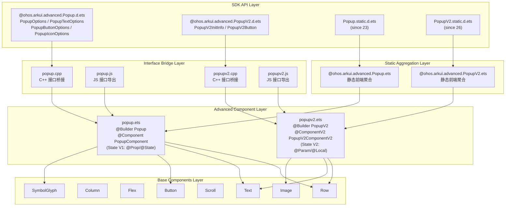
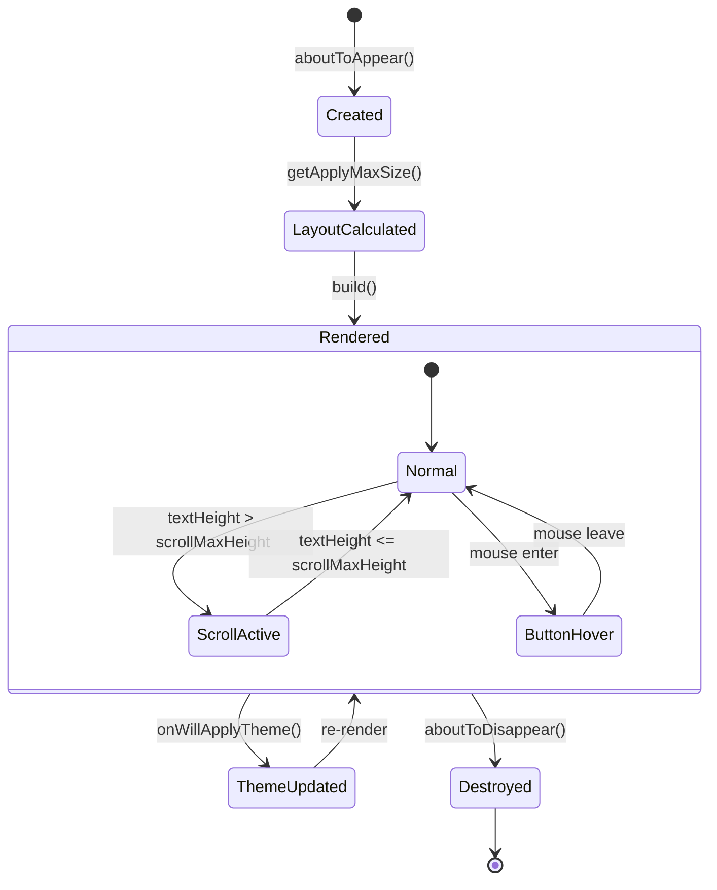

# 架构设计
> Popup 高级组件（v1/v2）的架构设计文档，覆盖 Popup v1（State V1）和 Popup v2（State V2）的接口设计、布局约束、主题机制和 RTL 支持。

## 设计元数据

| 字段 | 内容 |
|------|------|
| Design ID | DESIGN-Func-07-01-16 |
| 关联需求 | 已有能力补录（无独立 requirement.md） |
| 关联 Epic | 无 |
| 目标 Feature | Feat-01: Popup Advanced 全量规格 (v1/v2) |
| 复杂度 | 标准 |
| 目标版本 | API 11 ~ API 26+ |
| Owner | ArkUI SIG |
| 状态 | Baselined（已有实现补录） |

## 需求基线

> 需求基线详见 proposal.md。以下仅列出设计阶段需要额外强调的要点。

| 项 | 补充说明（如需） |
|----|------------------|
| v1 vs v2 架构差异 | v1 使用 State V1（@Component + @Prop/@State），v2 使用 State V2（@ComponentV2 + @Param/@Local） |
| 选项结构差异 | v1 使用 PopupTextOptions 复合对象（text/fontSize/fontColor/fontWeight），v2 简化为 ResourceStr + Modifier 模式 |
| 无独立 Pattern | 高级组件不涉及 components_ng/pattern/ 层实现，基于基础组件（Row/Column/Flex/Text/Scroll/Button/SymbolGlyph/Image）组合构建 |
| 无 C API | 高级组件无 NDK 接口 |
| 静态前端 | v1 静态聚合源码位于 assembled_advanced_ui_component/，v2 同样存在静态聚合 |

## 上下文和现状

### 涉及仓和模块

| 仓库 | 模块路径 | 当前职责 | 本 Feature 影响 |
|------|----------|----------|-----------------|
| ace_engine | `advanced_ui_component/popup/source/popup.ets` | Popup v1 组件实现（@Builder Popup + @Component PopupComponent） | 规格补录 |
| ace_engine | `advanced_ui_component/popup/interfaces/popup.cpp` | Popup v1 C++ 接口桥接 | 规格补录 |
| ace_engine | `advanced_ui_component/popup/interfaces/popup.js` | Popup v1 JS 接口导出 | 规格补录 |
| ace_engine | `advanced_ui_component/popupv2/source/popupv2.ets` | Popup v2 组件实现（@Builder PopupV2 + @ComponentV2 PopupV2ComponentV2） | 规格补录 |
| ace_engine | `advanced_ui_component/popupv2/interfaces/popupv2.cpp` | Popup v2 C++ 接口桥接 | 规格补录 |
| ace_engine | `advanced_ui_component/popupv2/interfaces/popupv2.js` | Popup v2 JS 接口导出 | 规格补录 |
| ace_engine | `advanced_ui_component_static/assembled_advanced_ui_component/@ohos.arkui.advanced.Popup.ets` | 静态前端 Popup v1 聚合源码 | 规格补录 |
| ace_engine | `advanced_ui_component_static/assembled_advanced_ui_component/@ohos.arkui.advanced.PopupV2.ets` | 静态前端 Popup v2 聚合源码 | 规格补录 |
| interface/sdk-js | `api/@ohos.arkui.advanced.Popup.d.ets` | Popup v1 Dynamic API 声明 | 规格对照 |
| interface/sdk-js | `api/@ohos.arkui.advanced.Popup.static.d.ets` | Popup v1 Static API 声明 | 规格对照 |
| interface/sdk-js | `api/@ohos.arkui.advanced.PopupV2.d.ets` | Popup v2 Dynamic API 声明 | 规格对照 |
| interface/sdk-js | `api/@ohos.arkui.advanced.PopupV2.static.d.ets` | Popup v2 Static API 声明 | 规格对照 |

### 调用链层级分析

| 层 | 模块 | 职责 | 修改类型 |
|----|------|------|----------|
| SDK API | `interface/sdk-js/api/@ohos.arkui.advanced.Popup.d.ets` / `.static.d.ets` | Dynamic/Static API 声明 | 无修改（规格补录） |
| SDK API (v2) | `interface/sdk-js/api/@ohos.arkui.advanced.PopupV2.d.ets` / `.static.d.ets` | Dynamic/Static API 声明 | 无修改（规格补录） |
| Advanced Component (v1) | `advanced_ui_component/popup/source/popup.ets` | @Builder Popup + @Component PopupComponent，State V1 状态管理 | 无修改（规格补录） |
| Advanced Component (v2) | `advanced_ui_component/popupv2/source/popupv2.ets` | @Builder PopupV2 + @ComponentV2 PopupV2ComponentV2，State V2 状态管理 | 无修改（规格补录） |
| Interface Bridge (v1) | `advanced_ui_component/popup/interfaces/popup.cpp` | C++ 接口桥接 | 无修改（规格补录） |
| Interface Bridge (v2) | `advanced_ui_component/popupv2/interfaces/popupv2.cpp` | C++ 接口桥接 | 无修改（规格补录） |
| JS Interface (v1) | `advanced_ui_component/popup/interfaces/popup.js` | JS 接口导出 | 无修改（规格补录） |
| JS Interface (v2) | `advanced_ui_component/popupv2/interfaces/popupv2.js` | JS 接口导出 | 无修改（规格补录） |
| Static Aggregation (v1) | `advanced_ui_component_static/assembled_advanced_ui_component/@ohos.arkui.advanced.Popup.ets` | 静态前端聚合 | 无修改（规格补录） |
| Static Aggregation (v2) | `advanced_ui_component_static/assembled_advanced_ui_component/@ohos.arkui.advanced.PopupV2.ets` | 静态前端聚合 | 无修改（规格补录） |
| Base Components | Row/Column/Flex/Text/Scroll/Button/SymbolGlyph/Image | 基础组件渲染能力 | 无修改 |

### 适用架构规则

| Rule ID | 适用原因 | 设计结论 | 验证方式 |
|---------|----------|----------|----------|
| OH-ARCH-LAYERING | 高级组件基于基础组件组合，不涉及底层 Pattern | 调用方向：SDK → Advanced Component → Base Components，高级组件不直接访问 Pattern 层 | 代码评审 |
| OH-ARCH-API-LEVEL | Popup v1 @since 11，v2 @since 26，Static API v1 @since 23 | 各版本通过 @since 标注区分，无 PlatformVersion 条件分支 | API 评审 / XTS |
| OH-ARCH-COMPONENT-BUILD | 高级组件作为 advanced_ui_component 库的一部分打包，无独立 SO | 通过 advanced_ui_component/ 构建系统统一生成 .cpp/.js 接口 | 构建验证 |
| OH-ARCH-SUBSYSTEM | 高级组件依赖基础组件（Row/Column/Text 等），属于同子系统内部调用 | 允许，无跨子系统依赖 | 依赖检查 |

## 不涉及项承接

> proposal.md 已完成 N/A 判定。本节仅对 proposal 中标记为"涉及"且需展开设计的维度给出结论。

| 维度 | 设计结论 |
|------|----------|
| 深色模式 | 颜色属性使用 ResourceColor/Resource 类型，通过 onWillApplyTheme 回调在主题切换时更新 fontPrimary/fontEmphasize/fontSecondary/iconSecondary 颜色 |
| 大字体 | v1 不支持 maxFontScale；v2 通过 `maxFontScale(Math.min(this.appMaxFontScale, MAX_FONT_SCALE))` 限制字体缩放上限为 2（`popupv2.ets:198, 770, 820, 848, 885, 942, 1005, 1042`） |
| RTL | 通过 `Configuration.getLocale().dir === 'rtl'` 检测 RTL 布局，在 `getTitleTextAlign()` 中将 TextAlign 从 Start 切换为 End（`popup.ets:738-743`, `popupv2.ets:731-737`） |
| 无障碍 | 关闭按钮设置 accessibilityText（`popup.ets:790`, `popupv2.ets:787`），按钮设置 focusable(true) |
| 版本升级兼容 | v1 基础 API @since 11，direction 属性 @since 12，maxWidth 属性 @since 18；v2 全量 @since 26 |

## 关键设计决策

| 决策 ID | 问题 | 推荐方案 | 探索过的替代方案 | 取舍理由 | 影响 |
|---------|------|----------|-----------------|----------|------|
| ADR-1 | Popup v1 和 v2 是否共用同一组件 | 分离为两个独立组件：popup.ets（@Component）和 popupv2.ets（@ComponentV2） | 共用组件通过条件分支切换 V1/V2 | V1/V2 状态管理机制完全不同（@State vs @Local），共用会增加复杂度；分离允许独立演进 | 全部 AC |
| ADR-2 | v2 是否保留 PopupTextOptions 复合选项 | 简化为 ResourceStr + TextModifier 模式 | 保留 PopupTextOptions（text/fontSize/fontColor/fontWeight） | V2 通过 attributeModifier 暴露 TextModifier/ImageModifier，开发者可直接操作底层属性，更灵活 | AC-3.1 ~ AC-3.5 |
| ADR-3 | 最大宽高约束策略 | maxWidth 默认 400vp，maxHeight 480vp，通过 ConstraintSizeOptions 约束 | 使用固定尺寸 | 400vp 适配多数屏幕宽度；480vp 限制弹窗高度避免遮挡过多内容；开发者可通过 maxWidth 覆盖 | AC-2.1, AC-2.2 |
| ADR-4 | 消息区域滚动策略 | 当文本高度超过可用空间时启用 Scroll，否则直接渲染 | 始终启用 Scroll | 避免不必要的 Scroll 容器开销；通过 setScrollMaxHeight 动态计算 | AC-4.1 ~ AC-4.3 |
| ADR-5 | 主题更新机制 | 通过 onWillApplyTheme 回调在主题变化时更新颜色属性 | 使用 Resource 资源自动跟随 | onWillApplyTheme 允许组件缓存主题值，避免每次渲染都查询资源 | AC-5.1 |
| ADR-6 | v2 是否支持 maxFontScale | 支持，通过 `Math.min(this.appMaxFontScale, MAX_FONT_SCALE)` 限制上限为 2 | 不限制 | 防止过大字体导致弹窗布局溢出，MAX_FONT_SCALE=2 为合理上限 | AC-3.3 |
| ADR-7 | 标题存在时的消息字体颜色 | 有标题时使用 fontSecondary（次要色），无标题时使用 fontPrimary（主要色） | 统一使用同一颜色 | 无标题时消息作为主要内容，需要更强的视觉层级 | AC-1.4 |

## 设计骨架

### 骨架范围

| 骨架项 | 目标 | 不包含 | 验证方式 |
|--------|------|--------|----------|
| Popup v1 全量接口 | PopupOptions/PopupTextOptions/PopupButtonOptions/PopupIconOptions | C API（无） | UT + 手工 |
| Popup v2 全量接口 | PopupV2InitInfo/PopupV2Button + Modifier 支持 | C API（无） | UT + 手工 |
| 布局约束 | max width 400vp, max height 480vp, RTL 对齐 | 自定义弹窗位置 | UT |
| 主题机制 | onWillApplyTheme 颜色更新 | 自定义主题资源 | UT |
| 滚动行为 | 动态 Scroll 启用/禁用 | 自定义滚动动画 | UT + 手工 |
| 按钮交互 | 最多 2 个按钮 + 关闭按钮 + hover 效果 | 按钮自定义手势 | UT |

### 骨架 Spec 拆分

| Task ID | 目标 | 受影响文件 | AC |
|---------|------|-----------|-----|
| TASK-SKELETON-1 | Popup Advanced 全量规格补录（v1/v2 接口、布局、主题、交互） | Feat-01-popup-advanced-full-spec.md | AC-1.1 ~ AC-7.4 |

## 后续 Task 拆分

| Task ID | 目标 | 受影响文件 | 依赖 |
|---------|------|-----------|------|
| TASK-POPUP-01 | Popup Advanced 全量规格补录 | Feat-01-popup-advanced-full-spec.md, design.md | 无 |

## API 签名、Kit 与权限

> 本节承接 spec.md"API 变更分析"中识别的 API，给出签名、权限和 d.ts 位置等实现细节。

### 新增 API

| API 签名 | 类型 | d.ts 位置 | 权限要求 | SysCap |
|----------|------|-----------|----------|--------|
| `@Builder Popup(options: PopupOptions)` | Public | `@ohos.arkui.advanced.Popup.d.ets` | 无 | SystemCapability.ArkUI.ArkUI.Full |
| `interface PopupTextOptions { text: ResourceStr; fontSize?; fontColor?; fontWeight? }` | Public | 同上 | 无 | 同上 |
| `interface PopupButtonOptions { text: ResourceStr; action?; fontSize?; fontColor? }` | Public | 同上 | 无 | 同上 |
| `interface PopupIconOptions { image: ResourceStr; width?; height?; fillColor?; borderRadius? }` | Public | 同上 | 无 | 同上 |
| `interface PopupOptions { icon?; title?; message; direction?; showClose?; onClose?; buttons?; maxWidth? }` | Public | 同上 | 无 | 同上 |
| `@Builder PopupV2(options: PopupV2InitInfo)` | Public | `@ohos.arkui.advanced.PopupV2.d.ets` | 无 | SystemCapability.ArkUI.ArkUI.Full |
| `interface PopupV2Button { text: ResourceStr; buttonTextModifier?: TextModifier; action? }` | Public | 同上 | 无 | 同上 |
| `interface PopupV2InitInfo { icon?; iconModifier?; title?; titleModifier?; message; messageModifier?; direction?; showClose?; onClose?; buttons?; maxWidth? }` | Public | 同上 | 无 | 同上 |

### 变更/废弃 API

| 原有 API | 变更类型 | 新 API | 迁移说明 |
|----------|----------|--------|----------|
| 无 | — | — | — |

## 构建系统影响

### BUILD.gn 变更

Popup 高级组件作为 advanced_ui_component 库的一部分构建，无独立 SO：

```
# advanced_ui_component/popup/BUILD.gn
# 构建目标：advanced_ui_component 库的一部分
# 接口桥接：popup.cpp / popup.js
# 组件源码：source/popup.ets
```

### bundle.json 变更

Popup 高级组件作为 ace_engine 的内部 component，无独立 bundle.json 变更。

## 可选设计扩展

### 架构图



### 数据流/控制流

| 步骤 | 调用方 | 被调用方 | 数据/接口 | 说明 |
|------|--------|----------|-----------|------|
| 1 | 应用代码 | @Builder Popup / PopupV2 | PopupOptions / PopupV2InitInfo | 组件创建入口 |
| 2 | @Builder | PopupComponent / PopupV2ComponentV2 | @Prop / @Param 参数传递 | 状态传入子组件 |
| 3 | PopupComponent | aboutToAppear() | MediaQuery listener 注册 | 监听横竖屏切换 |
| 4 | PopupComponent | getApplyMaxSize() | display.getDefaultDisplaySync() | 计算最大宽高约束 |
| 5 | PopupComponent | onWillApplyTheme(theme) | Theme.colors 更新 | 主题切换时更新颜色 |
| 6 | 用户交互 | Button.onClick | onClose() / buttons[n].action() | 按钮点击回调 |
| 7 | PopupComponent | setScrollMaxHeight() | textHeight / applyHeight | 动态计算滚动区域高度 |

### 时序设计

```mermaid
sequenceDiagram
    participant App as 应用代码
    participant Builder as @Builder Popup
    component Participant as PopupComponent
    participant Display as display API
    participant Theme as Theme System

    App->>Builder: Popup(options: PopupOptions)
    Builder->>component Participant: PopupComponent({ icon, title, message, ... })
    component Participant->>component Participant: aboutToAppear()
    component Participant->>Display: getDefaultDisplaySync()
    Display-->>component Participant: width, height, densityPixels
    component Participant->>component Participant: getApplyMaxSize()
    component Participant->>component Participant: setScrollMaxHeight()
    Theme->>component Participant: onWillApplyTheme(theme)
    component Participant->>component Participant: 更新 theme 颜色
    component Participant->>component Participant: build() 渲染
```

### 数据模型设计

**API 层类型 (TypeScript)**:

```typescript
// Popup v1 接口 (popup.ets:174-205)
interface PopupTextOptions {
  text: ResourceStr;
  fontSize?: number | string | Resource;
  fontColor?: ResourceColor;
  fontWeight?: number | FontWeight | string;
}

interface PopupButtonOptions {
  text: ResourceStr;
  action?: () => void;
  fontSize?: number | string | Resource;
  fontColor?: ResourceColor;
}

interface PopupIconOptions {
  image: ResourceStr;
  width?: Dimension;
  height?: Dimension;
  fillColor?: ResourceColor;
  borderRadius?: Length | BorderRadiuses;
}

interface PopupOptions {
  icon?: PopupIconOptions;
  title?: PopupTextOptions;
  message: PopupTextOptions;
  direction?: Direction;
  showClose?: boolean | Resource;
  onClose?: () => void;
  buttons?: [PopupButtonOptions?, PopupButtonOptions?];
  maxWidth?: Dimension;
}

// Popup v2 接口 (popupv2.ets:174-192)
interface PopupV2Button {
  text: ResourceStr;
  buttonTextModifier?: TextModifier;
  action?: () => void;
}

interface PopupV2InitInfo {
  icon?: ResourceStr;
  iconModifier?: ImageModifier;
  title?: ResourceStr;
  titleModifier?: TextModifier;
  message: ResourceStr;
  messageModifier?: TextModifier;
  direction?: Direction;
  showClose?: boolean | Resource;
  onClose?: () => void;
  buttons?: [PopupV2Button?, PopupV2Button?];
  maxWidth?: Dimension;
}
```

### 算法与状态机



### 测试性设计

| 测试层级 | 测试目标 | Mock 策略 | 验证方式 |
|----------|----------|-----------|----------|
| UT - 布局 | max width/height 约束计算 | Mock display.getDefaultDisplaySync | 组件单测 |
| UT - 滚动 | setScrollMaxHeight 动态计算 | Mock onAreaChange 回调 | 组件单测 |
| UT - 主题 | onWillApplyTheme 颜色更新 | Mock Theme 对象 | 组件单测 |
| UT - RTL | getTitleTextAlign 方向判定 | Mock Configuration.getLocale | 组件单测 |
| 手工 | 完整弹窗视觉验证 | 真机 | 视觉比对 |
| 手工 | v2 maxFontScale 限制 | 真机设置大字体 | 视觉比对 |

### 接口参数规约

| 接口 | 参数 | 类型 | 合法范围 | 非法处理 | 边界说明 |
|------|------|------|----------|----------|----------|
| Popup | message | PopupTextOptions | 必填 | — | 唯一必填项 |
| Popup | maxWidth | Dimension | ≥ 0 | < 0 时回退到 400vp | 默认 400vp, @since 18 |
| Popup | direction | Direction | Auto/Ltr/Rtl | 默认 Auto | @since 12 |
| Popup | showClose | boolean/Resource | true/false | 默认 true | — |
| Popup | buttons | tuple[2] | 0-2 个按钮 | 空文本不渲染 | — |
| PopupV2 | message | ResourceStr | 必填 | — | 唯一必填项 |
| PopupV2 | maxWidth | Dimension | ≥ 0 | < 0 时回退到 400vp | 默认 400vp |
| PopupV2 | titleModifier | TextModifier | optional | — | @Require @Param |

## 详细设计

### Popup v1 组件结构

Popup v1 由 `@Builder Popup` 函数和 `@Component PopupComponent` struct 组成（`popup.ets:212-224, 264-1085`）。

**@Builder Popup**（`:212-224`）：接收 `PopupOptions`，将参数透传给 `PopupComponent`。

**PopupComponent**（`:264-1085`）：
- State V1 状态管理：`@Prop` 接收外部参数（icon/maxWidth/title/message/popupDirection/showClose/buttons），`@State` 管理内部状态（titleHeight/applyHeight/buttonHeight/scrollMaxHeight/backgroundColor 等）
- 布局结构：`Row` → [Image(icon)?] → [Column(title+closeButton, Scroll(message), Flex(buttons))] 或 [Column(Scroll(message)+closeButton, Flex(buttons))]
- 有标题时使用第一种布局（icon+title+close+message+buttons），无标题时使用第二种（message+close+buttons）

**布局约束计算** `getApplyMaxSize()`（`:693-736`）：
- maxWidth 默认 400vp（`POPUP_DEFAULT_MAXWIDTH = 400`，`:210`）
- maxHeight 480vp（`:727-731`）
- 若 `px2vp(display.width) > maxWidthSize`，使用 maxWidthSize；否则使用屏幕宽度
- 若 `px2vp(display.height) > 480`，使用 480；否则使用屏幕高度减 80vp

**滚动区域计算** `setScrollMaxHeight()`（`:584-607`）：
- 可用高度 = applyHeight 或 maxHeightInDisplay（取较小值）
- 减去 titleHeight、buttonHeight、padding/margin 间距
- 若 `textHeight > scrollMaxHeight + 1`，启用 Scroll；否则不启用

### Popup v2 组件结构

Popup v2 由 `@Builder PopupV2` 函数和 `@ComponentV2 PopupV2ComponentV2` struct 组成（`popupv2.ets:200-215, 255-1096`）。

**@ComponentV2 PopupV2ComponentV2**（`:255-1096`）：
- State V2 状态管理：`@Param` 接收外部参数，`@Local` 管理内部状态，`@Require @Param` 标注必传参数（maxWidth/iconModifier/titleModifier/messageModifier）
- `@Local appMaxFontScale` 在 `aboutToAppear()` 中通过 `uiContext.getMaxFontScale()` 获取（`:564`）
- 通过 `maxFontScale(Math.min(this.appMaxFontScale, MAX_FONT_SCALE))` 限制字体缩放（`:770, 820, 848, 885, 942, 1005, 1042`）
- `attributeModifier` 支持：icon(ImageModifier)、title(TextModifier)、message(TextModifier)、button text(TextModifier)

### 主题机制

`onWillApplyTheme(theme: Theme)` 在主题切换时被调用（`popup.ets:563-569`, `popupv2.ets:554-560`）：

- `theme.colors.fontPrimary` → `theme.title.fontColor`
- `theme.colors.fontEmphasize` → `theme.button.fontColor`
- `theme.colors.fontSecondary` → `theme.message.fontColor`
- `theme.colors.fontPrimary` → `theme.message.plainFontColor`（无标题时）
- `theme.colors.iconSecondary` → `closeButtonFillColorWithTheme`

### RTL 支持

`getTitleTextAlign()`（`popup.ets:738-743`, `popupv2.ets:731-737`）：
- 检测 `Configuration.getLocale().dir === 'rtl'`
- RTL 且 `popupDirection === Direction.Auto` 时返回 `TextAlign.End`
- 否则返回 `TextAlign.Start`

### 消息字体颜色策略

`getMessageFontColor()`（`popup.ets:390-402`, `popupv2.ets:385-393`）：
- 有自定义 fontColor → 使用自定义值
- 有标题 → `theme.message.fontColor`（fontSecondary，次要色）
- 无标题 → `theme.message.plainFontColor`（fontPrimary，主要色）

### 按钮响应区域扩展

`getBtnResponseRegion()`（`popup.ets:507-530`, `popupv2.ets:498-521`）：
- 当按钮实际尺寸小于 `responseRegion` 资源值时扩展响应区域
- 计算 offset 使扩展区域居中

## 风险和开放问题

| 项 | 类型 | 影响 | 处理方式 | Owner |
|----|------|------|----------|-------|
| v1 不支持 maxFontScale | 兼容性 | 中 | v1 为已有实现，在 v2 中补齐 maxFontScale 支持；v1 不做变更 | ArkUI SIG |
| v1 不支持 attributeModifier | 兼容性 | 低 | v2 通过 TextModifier/ImageModifier 补齐，v1 保持 PopupTextOptions 复合选项模式 | ArkUI SIG |
| maxWidth @since 18 (v1) | 兼容性 | 低 | API 18 以下 maxWidth 被忽略，使用默认 400vp | ArkUI SIG |
| direction @since 12 (v1) | 兼容性 | 低 | API 12 以下 direction 被忽略，默认 Auto | ArkUI SIG |
| 静态前端 ArcSlider/ArcButton 无聚合源码 | 构建 | 低 | Popup v1/v2 有静态聚合源码，不受影响 | ArkUI SIG |

## 设计审批

- [x] 需求基线已确认，设计覆盖 P0/P1 AC
- [x] 不涉及项已承接，N/A 和展开项都有结论
- [x] 涉及仓和模块职责清楚
- [x] 调用链层级分析完整，每层覆盖到位
- [x] 适用架构规则已识别并形成设计结论
- [x] 分层和子系统边界合规
- [x] API 变更有签名、权限、错误码和兼容性说明
- [x] BUILD.gn/bundle.json 影响明确
- [x] 设计输出和后续 Task 拆分明确
- [x] 关键设计决策有理由和影响说明
- [x] 风险和开放问题有 Owner

**结论:** 通过（已有实现补录）
