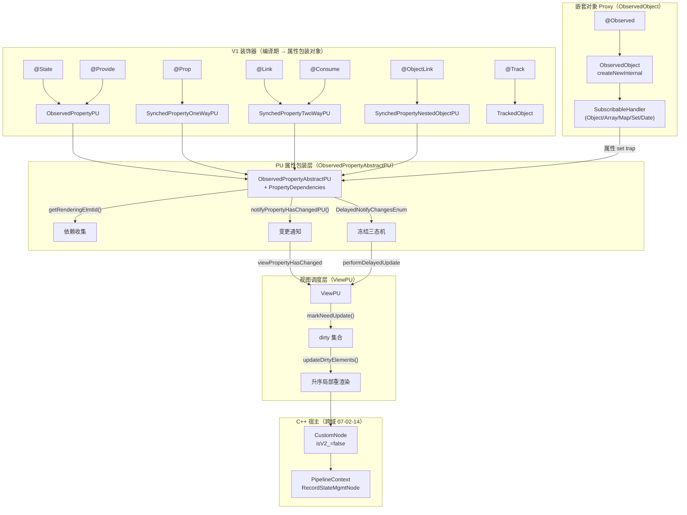
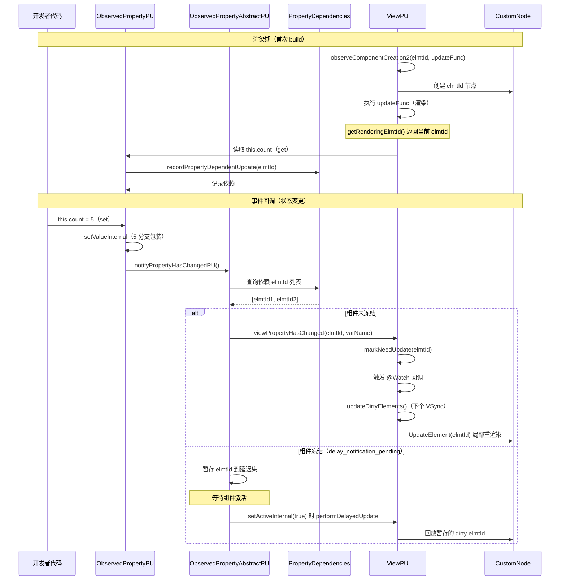
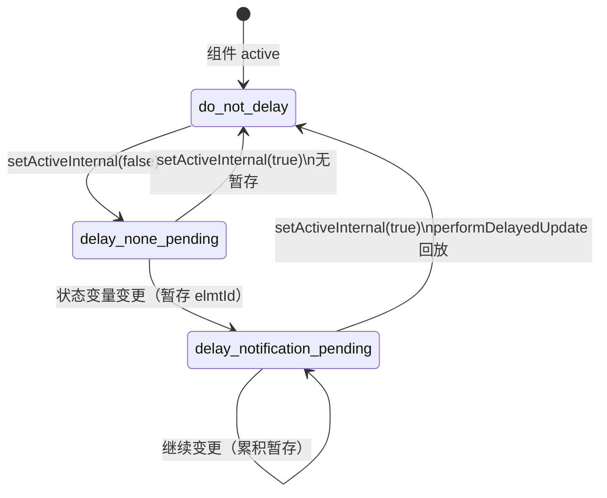

# 架构设计

> 07-02-01 状态管理V1组件内状态管理 功能域的架构设计文档，补录已有实现。本域覆盖 ArkUI 声明式前端的初代（V1）状态管理能力，包括 9 个组件级装饰器（`@State`/`@Prop`/`@Link`/`@Watch`/`@Observed`/`@ObjectLink`/`@Provide`/`@Consume`/`@Track`）共享的底层基础设施：渲染期依赖收集、状态变更精确通知与局部重渲染、`@Observed` 对象的 ES6 Proxy 嵌套观测、组件冻结延迟通知。API 9 起统一使用 PU（Partial Update）渲染路径（API 9 前 FU 已废弃）；`ConfigureStateMgmt` 负责 V1/V2 范式检测。存储联动装饰器（`@StorageLink`/`@StorageProp`/`@LocalStorageLink`/`@LocalStorageProp`）将在本域后续 Feat 补充，V2 装饰器（`@Local`/`@Param`/`@Trace` 等）归 07-02-04。

## 设计元数据

| 字段 | 内容 |
|------|------|
| Design ID | DESIGN-Func-07-02-01 |
| 关联需求 | 已有能力补录（无独立 requirement.md） |
| 关联 Epic | 无 |
| 目标 Feature | Feat-01 依赖收集与变更通知核心机制, Feat-02 @State 组件私有状态, Feat-03 @Prop/@Link 父子同步, Feat-04 @Provide/@Consume 跨层级同步, Feat-05 @ObjectLink 嵌套对象共享引用, Feat-06 @Watch 变更回调与组件冻结, Feat-07 SubscribableAbstract 自定义可观察类型, Feat-08 状态管理调试与渲染基础设施, Feat-09 elmtId 全链路同步与 C++ 宿主集成 |
| 复杂度 | 高 |
| 目标版本 | 核心装饰器 API 7 起；Date 类型 API 10 起；Map/Set/联合类型/@Track/组件冻结 API 11 起；@Consume 默认值/跨 BuilderNode API 20 起；Function 编译期 ERROR/数据源编译期校验/错误码 API 23 起 |
| Owner | ArkUI SIG |
| 状态 | Baselined |
| FuncID | 07-02-01 |
| 源码根 | `frameworks/bridge/declarative_frontend/state_mgmt/src/lib/partial_update/`（PU 主路径）+ `common/observed_object.ts`（@Observed Proxy） |
| SDK 声明 | `interface/sdk-js/api/@internal/component/ets/common.d.ts`（V1 装饰器） |
| 测试入口 | `frameworks/bridge/declarative_frontend/state_mgmt/test/unittest/entry/src/main/v1_tests/` + `common_tests/` |
| 前置依赖 | 无（V1 组件内是状态管理的基础域） |
| 下游影响 | 07-02-02（V1 数据对象 @Observed/@ObjectLink）、07-02-03（V1 应用存储 @StorageLink）、07-02-04（V2 共用 PUV2ViewBase/CustomNode）、07-03-01~04（自定义组件 ViewPU 基类） |
| 关键错误码 | 140110（@Track UI 误用）、140112（@Consume 缺 @Provide）、140114（重复 @Provide）、140115（非法类型） |

## 需求基线

| 字段 | 内容 |
|------|------|
| 问题陈述 | ArkUI 声明式前端需要一套组件级状态管理机制，让开发者通过装饰器声明状态变量，框架自动收集渲染期依赖、在状态变更时精确触发依赖该变量的 UI 元素局部重渲染，并支持父子组件同步、跨层级同步、嵌套对象观测、变更回调与组件冻结 |
| 核心目标 | 提供 V1 组件级状态管理完整能力，覆盖依赖收集核心机制与 9 个组件级装饰器，固化渲染期依赖收集、变更通知、局部重渲染、嵌套对象 ES6 Proxy 代理、组件冻结延迟通知等行为规格 |
| P0 AC | Feat-01（核心机制）与 Feat-02（@State）、Feat-03（@Prop/@Link）全量 AC；Feats 04/05/06 为 P1 |
| 补充说明 | 本域是 V1 装饰器的运行时基础。V2 装饰器（07-02-04）采用不同范式（getter/setter + 全局 `ObserveV2`），但 V1/V2 共用同一 C++ `CustomNode` 宿主，仅靠 `isV2_` 区分 |

## 上下文和现状

### 涉及仓和模块

| 仓库 | 模块路径 | 当前职责 | 本 Feature 影响 |
|------|----------|----------|-----------------|
| ace_engine | `frameworks/bridge/declarative_frontend/state_mgmt/src/lib/partial_update/pu_view.ts` | `ViewPU`（V1 视图抽象基类）：渲染调度、dirty 集合、`@Watch`/`@Provide`/`@Consume` 注册、组件冻结、`updateDirtyElements` | Feat-01/04/06 全量涉及 |
| ace_engine | `frameworks/bridge/declarative_frontend/state_mgmt/src/lib/partial_update/pu_observed_property_abstract.ts` | `ObservedPropertyAbstractPU<T>` + `PropertyDependencies`：elmtId 级依赖收集、`notifyPropertyHasChangedPU`、`DelayedNotifyChangesEnum` 三态机 | Feat-01 核心 |
| ace_engine | `frameworks/bridge/declarative_frontend/state_mgmt/src/lib/partial_update/pu_observed_property.ts` | `ObservedPropertyPU`（@State 实现）：`setValueInternal` 5 分支自动包装 | Feat-02 核心 |
| ace_engine | `frameworks/bridge/declarative_frontend/state_mgmt/src/lib/partial_update/pu_synced_property_one_way.ts` | `SynchedPropertyOneWayPU`（@Prop 实现）：API 10+ 深拷贝、环检测、Sendable 降级 | Feat-03 核心 |
| ace_engine | `frameworks/bridge/declarative_frontend/state_mgmt/src/lib/partial_update/pu_synced_property_two_way.ts` | `SynchedPropertyTwoWayPU`（@Link/@Consume 实现）：写穿透、防循环、BuildNode 复用重连 | Feat-03/04 核心 |
| ace_engine | `frameworks/bridge/declarative_frontend/state_mgmt/src/lib/partial_update/pu_synced_property_object_nested.ts` | `SynchedPropertyNestedObjectPU`（@ObjectLink 实现）：无 source_ 直接订阅 ObservedObject | Feat-05 核心 |
| ace_engine | `frameworks/bridge/declarative_frontend/state_mgmt/src/lib/partial_update/pu_tracked_object.ts` | `TrackedObject`（@Track 实现）：属性级精确追踪、整对象赋值按属性比较 | Feat-05 核心 |
| ace_engine | `frameworks/bridge/declarative_frontend/state_mgmt/src/lib/common/observed_object.ts` | `ObservedObject` + `SubscribableHandler` 系列：`@Observed` 类实例的 ES6 Proxy 代理（Object/Array/Map/Set/Date 五类 handler） | Feat-05 核心 |
| ace_engine | `frameworks/bridge/declarative_frontend/state_mgmt/src/lib/common/observed_property_abstract.ts` | `ObservedPropertyAbstract<T>`：订阅管理、遗留 `notifyHasChanged`（PU 覆盖为空）、`createSync` 工厂 | Feat-01/03 基础 |
| ace_engine | `frameworks/bridge/declarative_frontend/state_mgmt/src/lib/common/state_mgmt_configure.ts` | `ConfigureStateMgmt`：V1/V2 范式检测（`needsV2Observe`）、特性开关 | Feat-01 基础 |
| ace_engine | `frameworks/bridge/declarative_frontend/state_mgmt/src/lib/puv2_common/puv2_view_base.ts` | `PUV2ViewBase`（V1/V2 共享基类）：`markNeedUpdate`、`activeCount_`、`freezeWhenInactive` 继承 | Feat-01/06 基础 |
| ace_engine | `frameworks/bridge/declarative_frontend/state_mgmt/src/lib/partial_update/pu_uinode_registry_proxy.ts` | `UINodeRegisterProxy`：elmtId→View 映射、已删除 elmtId 同步 | Feat-01 基础 |
| ace_engine | `frameworks/core/components_ng/pattern/custom/custom_node.cpp/.h` | `CustomNode`/`CustomNodeBase`：`@Component` 的 C++ 宿主节点、生命周期回调容器 | 跨域（07-02-14）协同 |
| ace_engine | `frameworks/core/pipeline_ng/pipeline_context.cpp` | `RecordStateMgmtNode`（dirty node 计数）、`GetStateMgmtInfo`、`CallStateMgmtCleanUpIdleTaskFunc` | Feat-01 管线集成 |
| ace_engine | `frameworks/bridge/declarative_frontend/state_mgmt/test/unittest/entry/src/main/v1_tests/` | V1 装饰器、`ObservedPropertyPU`、`@Observed` Proxy、`@Track`、`@Provide`/`@Consume` 行为回归测试 | 全量验证 |

### 调用链层级分析

| 层 | 模块 | 职责 | 修改类型 |
|----|------|------|----------|
| 1. SDK 层 | `interface/sdk-js/api/@internal/component/ets/common.d.ts` | 9 个 V1 组件级装饰器类型声明 | 存量分析 |
| 2. 编译期 | ArkTS 编译器 | 装饰器语法解析，转换为运行时属性包装对象创建调用 | 存量分析 |
| 3. 属性包装层 | `pu_observed_property.ts` / `pu_synced_property_one_way.ts` / `pu_synced_property_two_way.ts` / `pu_synced_property_object_nested.ts` | 各装饰器的 `ObservedPropertyAbstractPU` 子类实现，封装 get/set 与同步语义 | 存量分析 |
| 4. 依赖收集层 | `pu_observed_property_abstract.ts` `PropertyDependencies` | 渲染期记录 elmtId ← 状态变量依赖关系，`recordPropertyDependentUpdate` | 存量分析 |
| 5. 变更通知层 | `pu_observed_property_abstract.ts` `notifyPropertyHasChangedPU` | 状态变更时查询 `PropertyDependencies`，精确触发依赖 elmtId 的 dirty 标记 | 存量分析 |
| 6. 视图调度层 | `pu_view.ts` `ViewPU` | `viewPropertyHasChanged`/`markNeedUpdate`（继承自 `PUV2ViewBase`）/`updateDirtyElements` | 存量分析 |
| 7. 冻结控制层 | `pu_observed_property_abstract.ts` `DelayedNotifyChangesEnum` | 非激活组件的状态变更暂存三态机，激活时 `performDelayedUpdate` 回放 | 存量分析 |
| 8. Proxy 代理层 | `common/observed_object.ts` | `@Observed` 类实例的 ES6 Proxy，拦截属性 get/set 触发订阅通知 | 存量分析 |
| 9. 注册表面 | `pu_uinode_registry_proxy.ts` `UINodeRegisterProxy` | 全局 elmtId→`IView` 映射，组件删除时清理 | 存量分析 |
| 10. C++ 宿主层 | `core/components_ng/pattern/custom/custom_node.cpp` | `CustomNode` 宿主节点，V1/V2 共用，`isV2_=false` | 存量分析（跨域 07-02-14） |
| 11. 管线集成层 | `core/pipeline_ng/pipeline_context.cpp` | `RecordStateMgmtNode` dirty 计数、`OnIdle` 清理、`GetStateMgmtInfo` 调试上报 | 存量分析 |

### 适用架构规则

| Rule ID | 适用原因 | 设计结论 | 验证方式 |
|---------|----------|----------|----------|
| OH-ARCH-LAYERING | V1 状态管理跨 SDK → 编译期 → 属性包装 → 依赖收集 → 变更通知 → 视图调度 → C++ 宿主 → 管线 共 11 层 | 单向数据流：状态变量变更自上而下触发 UI 刷新，UI 不反向写状态变量 | 代码评审 |
| OH-ARCH-API-LEVEL | 9 个装饰器在 API 7/10/11/19/20/23 有行为增量；@Track/组件冻结 API 11 起；错误码 API 23 起 | 各装饰器行为与错误码均标注 @since 版本，跨版本差异在 Feat 兼容性声明中固化 | API 评审/XTS |
| OH-ARCH-COMPONENT-BUILD | 状态管理 TS 库编译为独立 `stateMgmt.abc` 字节码，引擎初始化时载入 | 无独立部件，BUILD.gn 在 `frameworks/bridge/declarative_frontend/state_mgmt/BUILD.gn` | 构建验证 |
| OH-ARCH-ERROR-LOG | V1 装饰器错误码 140110/140112/140114/140115（API 23 起）；运行时错误经 `stateMgmtConsole` 输出 | 错误码在 Feat-05（140110）、Feat-04（140112/140114）、各 Feat（140115）固化 | 错误码文档对齐 |

## 不涉及项承接

| 维度 | 结论 |
|------|------|
| V2 装饰器 | 承接 — `@Local`/`@Param`/`@Trace`/`@ObservedV2`/`@Computed`/`@Monitor`/`@Provider`/`@Consumer` 等 V2 装饰器归 07-02-04，本域仅描述 V1 |
| 应用级存储 | 展开 — `AppStorage`/`LocalStorage`/`PersistentStorage`/`Environment` 与存储联动装饰器将在本域（V1）后续 Feat 补充 |
| 数据同步基础设施 | 承接 — 动态/静态前端互操作归 07-02-14；`WeakRefPool` GC + `ConfigureStateMgmt` 归 07-02-04 V2；本域含 `SubscribableAbstract`（Feat-07）、`stateMgmtConsole`/`stateMgmtDFX`/`stateMgmtProfiler` + `UpdateFuncRecord`（Feat-08）、elmtId 全链路同步 + C++ 宿主集成（Feat-09） |
| 性能 | 展开 — @Prop 深拷贝（API 10+）有性能开销，深嵌套数据建议不超过 5 层或用 @ObjectLink；详见 Feat-03/05 |
| 安全与权限 | N/A — 组件状态管理不涉及安全敏感操作 |
| 兼容性 | 展开 — V1 与 V2 不应混用，`checkIsSupportedValue` 显式拒绝 `@ObservedV2` 对象作为 V1 状态变量；V1→V2 迁移归 07-02-04 |
| IPC/跨进程 | N/A — 组件状态管理为单进程 UI 状态 |
| 构建与部件 | N/A — 状态管理 TS 库编译为 `stateMgmt.abc`，无独立部件 |

## 关键设计决策

### ADR 概览

| 决策 ID | 问题 | 选择方案 | 影响 |
|---------|------|----------|------|
| ADR-1 | 渲染路径统一 | API 9 起统一 PU（无开关）；FU 为 API 9 前历史 | Feat-01 |
| ADR-2 | 状态变量实现方式 | 属性包装对象（`ObservedPropertyAbstractPU`） | Feat-01~09 |
| ADR-3 | 依赖收集粒度 | elmtId 级精确追踪 | Feat-01 |
| ADR-4 | 嵌套对象观测 | `@Observed` + ES6 Proxy 自动拦截 | Feat-05（07-02-02） |
| ADR-5 | 组件冻结实现 | 三态机暂存回放（`DelayedNotifyChangesEnum`） | Feat-06（07-03-04） |
| ADR-6 | @Prop 同步方式 | 单向深拷贝（`deepCopyObjectInternal`） | Feat-03 |
| ADR-7 | @Link 双向防循环 | `changeNotificationIsOngoing_` 标志防回声 | Feat-03 |
| ADR-8 | @Provide/@Consume 查找 | 递归祖先链 + BuildNode 重连三件套 | Feat-04 |
| ADR-9 | @Track 属性级追踪 | `TrackedObject` 仅标记属性变化触发通知 | Feat-05（07-02-02） |

### ADR-1: PU/FU 渲染路径选择

**问题背景**：V1 状态管理最初使用 FU（Full Update）路径——状态变量变更后重渲染整个自定义组件。这在复杂 UI 场景下产生大量冗余重渲染（一个变量变化导致整个组件 build 重新执行）。

**关键权衡**：
- FU 路径实现简单（变更即全量重渲染），但性能差（不区分哪些 UI 元素真正依赖该变量）
- PU 路径实现复杂（需要渲染期依赖收集），但性能好（仅重渲染读取过该变量的 UI 元素）
- 完全移除 FU 会破坏历史组件兼容性

**选型推理**：API 9 起统一 PU（`UsesNewPipeline()` 始终返回 true）。PU 在渲染期通过 `getRenderingElmtId()` 返回当前正在渲染的 elmtId，`recordPropertyDependentUpdate()` 记录"哪个 UI 元素读取了哪个状态变量"。状态变更时仅通知依赖的 elmtId，而非整个组件。PU 覆盖了 FU 的 `notifyHasChanged` 为空操作（`pu_observed_property_abstract.ts`），确保两条路径不冲突。PU 渲染路径（API 9 统一）由 `ViewStackProcessor.UsesNewPipeline()` 决定（新组件默认 PU）；`ConfigureStateMgmt` 负责 V1/V2 范式检测（`needsV2Observe`）。

**设计代价**：PU 引入了 `PropertyDependencies` 依赖映射的内存开销（每个状态变量维护一个 elmtId 集合），以及渲染期 `isRenderInProgress` 保护（build 中修改状态变量会抛错）。

### ADR-2: 状态变量实现方式 — 属性包装对象 vs getter/setter

**问题背景**：V1 需要让框架在状态变量被读取（渲染期依赖收集）和被赋值（变更通知）时自动拦截。两种拦截方式：包装对象或 getter/setter 注入。

**关键权衡**：
- 属性包装对象：每个状态变量编译为 `ObservedPropertyAbstractPU` 子类实例（如 `ObservedPropertyPU`/`SynchedPropertyOneWayPU`），包装真实值并提供 get/set 钩子。优点：实现简单，类型安全（不同装饰器有不同子类）。缺点：每变量有对象开销（内存 + GC）
- getter/setter 注入（V2 方案）：直接在原生数据上安装 getter/setter，依赖与通知提取到全局单例。优点：无对象开销。缺点：实现复杂，需要全局单例管理依赖

**选型推理**：V1 选择属性包装对象——这是 V1 早期设计的选择，实现简单且类型安全（每个装饰器编译为特定子类，如 `@State`→`ObservedPropertyPU`、`@Prop`→`SynchedPropertyOneWayPU`）。V2（07-02-04）改用 getter/setter + 全局 `ObserveV2` 单例，避免了每变量对象开销。两套不应混用（`checkIsSupportedValue` 拒绝 V2 对象作为 V1 状态变量）。

### ADR-3: 依赖收集粒度 — elmtId 级 vs 组件级

**问题背景**：状态变量变更后，框架需要知道"哪些 UI 元素需要重渲染"。粒度越细，冗余重渲染越少。

**关键权衡**：
- 组件级追踪（API 9 前 FU 历史方案）：变量变化重渲染整个组件——简单但冗余
- elmtId 级追踪（PU 方案）：变量变化仅重渲染读取过该变量的 UI 元素——精确但需要依赖收集

**选型推理**：选择 elmtId 级追踪——这是 PU 的核心优势（API 9 起统一）。渲染期 `getRenderingElmtId()` 返回当前正在渲染的 elmtId（非渲染期返回 -1 不记录），getter 调 `recordPropertyDependentUpdate(elmtId)` 将依赖记录到 `PropertyDependencies`（`propertyDependencies_` + `trackedObjectPropertyDependencies_`）。变更时 `notifyPropertyHasChangedPU` 查询 `PropertyDependencies` 获取依赖 elmtId 列表，仅对这些 elmtId 标脏。

**设计约束**：非渲染上下文（事件回调、生命周期、setTimeout）中读取状态变量不记录依赖——这解释了为什么"在事件回调中读状态变量不建立 UI 依赖"。

### ADR-4: 嵌套对象观测 — @Observed + ES6 Proxy

**问题背景**：V1 组件级状态变量（@State/@Prop/@Link）仅观察第一层属性。嵌套对象的深层属性赋值（如 `this.obj.name = "x"`）无法自动触发 UI 刷新。需要一种机制让嵌套对象的属性变化可被自动观察。

**关键权衡**：
- 手动通知：要求开发者在每次属性修改后调用 `notifyHasChanged()`——侵入性强，易遗漏
- ES6 Proxy 自动拦截：每个 `@Observed` class 实例包装为 Proxy，`SubscribableHandler` 系列透明拦截 get/set——开发者无感知
- getter/setter 注入（V2 `@Trace` 方案）：在原生数据上装 getter/setter——V2 范式

**选型推理**：V1 选择 ES6 Proxy——`ObservedObject.createNewInternal` 按 Object/Array/Map/Set/Date 五类分发对应 handler（`SubscribableHandler`/`SubscribableArrayHandler`/`SubscribableMapSetHandler`/`SubscribableDateHandler`）。Proxy 的 set trap 在值变化时通知所有订阅的 `ObservedPropertyAbstract`，后续路径同 @State 的 `notifyPropertyHasChangedPU`。`@Track` 模式下 Proxy handler 按属性级分支（兼容模式 vs @Track 模式）。

**设计代价**：Proxy 有 get/set 拦截开销；@Observed 改变 class 原始原型链，与其他类装饰器可能冲突。

### ADR-5: 组件冻结实现 — 三态机暂存回放

**问题背景**：不可见/非激活的自定义组件如果仍响应状态变更并刷新 UI，产生不必要的性能开销。需要冻结机制——组件不可见时暂停 UI 刷新，但状态变更不能丢失（组件重新可见时需要恢复一致状态）。

**关键权衡**：
- 直接丢弃：非激活组件的状态变更直接丢弃——状态不一致（组件重新可见时 UI 与状态脱节）
- 暂存回放（V1 方案）：非激活组件的状态变更暂存，激活时统一回放——保证状态一致性
- 实时检查不暂存（V2 方案）：每次变更实时检查 `isViewActive()`，不暂存——更简单但需要全局单例支持

**选型推理**：V1 选择三态机暂存回放——每个 `ObservedPropertyAbstractPU` 维护 `delayedNotification_` 三态枚举：`do_not_delay`(0) 激活时立即通知 / `delay_none_pending`(1) 冻结但暂无变更 / `delay_notification_pending`(2) 冻结且有暂存变更。`setActiveInternal(false)` 切换到冻结态；状态变更切到 `delay_notification_pending` 并暂存 elmtId；`setActiveInternal(true)` 时 `performDelayedUpdate` 统一回放暂存的 elmtId。

**设计约束**：`freezeWhenInactive`（API 11+）配置激活；子组件未设置则继承父组件；冻结仅适用于 6 类场景（详见 07-03-04）；复用混用时上树后不触发 @Watch（复用执行逻辑早于解冻）。

## 设计骨架

### 骨架范围

| 骨架项 | 目标 | 不包含 | 验证方式 |
|--------|------|--------|----------|
| `ObservedPropertyAbstractPU` | PU 属性包装抽象基类，提供 elmtId 级依赖收集（`PropertyDependencies`）、变更通知（`notifyPropertyHasChangedPU`）、冻结三态机（`DelayedNotifyChangesEnum`） | 基类遗留 `notifyHasChanged`（PU 覆盖为空） | 单元测试 + 代码审查 |
| `PropertyDependencies` | 依赖映射：状态变量 → 依赖它的 elmtId 集合（`propertyDependencies_` + `trackedObjectPropertyDependencies_`） | V2 的 `target[SYMBOL_REFS]` 全局映射 | 代码审查 |
| `ViewPU` | V1 视图抽象基类，渲染调度（`updateDirtyElements`）、`@Watch`/`@Provide`/`@Consume` 注册、组件冻结（`setActiveInternal`） | V2 的 `ViewV2` | 单元测试 |
| `ObservedObject` Proxy 体系 | `@Observed` 类实例的 ES6 Proxy，5 类 handler（Object/Array/Map/Set/Date） | V2 的 `autoProxyObject` + `ObjectProxyHandler` | 单元测试 |
| `TrackedObject` | @Track 属性级追踪，`notifyObjectValueAssignment` 整对象赋值按属性比较 | V2 的 `@Trace` | 单元测试 |

### 骨架 Spec 拆分

| Task ID | 目标 | 受影响文件 | AC |
|---------|------|------------|-----|
| Feat-01 | V1 依赖收集与变更通知核心机制（elmtId 依赖、PU 渲染路径（API 9 统一）、dirty 更新、`UINodeRegisterProxy`） | `pu_observed_property_abstract.ts`、`pu_view.ts`、`pu_uinode_registry_proxy.ts`、`state_mgmt_configure.ts` | AC-1.1 ~ AC-1.x |
| Feat-02 | `@State` 组件私有状态（`ObservedPropertyPU`、`setValueInternal` 5 分支、类型约束） | `pu_observed_property.ts` | AC-1.1 ~ AC-1.x |
| Feat-03 | `@Prop`/`@Link` 父子单向/双向同步（深拷贝、写穿透、防循环、复用重连） | `pu_synced_property_one_way.ts`、`pu_synced_property_two_way.ts` | AC-1.1 ~ AC-2.x |
| Feat-04 | `@Provide`/`@Consume` 跨层级同步（祖先注册、递归查找、BuildNode 重连三件套） | `pu_view.ts`（`addProvidedVar`/`findProvidePU__`/`initializeConsume`）、`pu_synced_property_two_way.ts` | AC-1.1 ~ AC-1.x |
| Feat-05 | `@Observed`/`@ObjectLink`/`@Track` 嵌套对象与属性级追踪（ES6 Proxy 5 handler、共享引用、属性级比较） | `observed_object.ts`、`pu_synced_property_object_nested.ts`、`pu_tracked_object.ts` | AC-1.1 ~ AC-3.x |
| Feat-06 | `@Watch` 变更回调与组件冻结（双触发路径、冻结三态机、`freezeWhenInactive` 继承） | `pu_view.ts`（`declareWatch`/`viewPropertyHasChanged`）、`pu_observed_property_abstract.ts`（`DelayedNotifyChangesEnum`）、`puv2_view_base.ts` | AC-1.1 ~ AC-2.x |

## 后续 Task 拆分

| Spec | 目的 | 依赖 | 输出 |
|------|------|------|------|
| 无后续 Task | 已有实现补录 | — | 各 Feature 详细规格见 `Feat-NN-*-spec.md` |

## API 签名、Kit 与权限

### 新增 API

| API 签名 | 类型 | 功能描述 | 关联 Feat |
|----------|------|----------|----------|
| （已有实现补录，API 通过 ArkTS 装饰器语法或 `@ohos.arkui.StateManagement` 模块暴露，具体签名见各 Feature spec） | Public | 各装饰器/API 的完整签名、@since、开放范围见各 Feature spec 的「核心类与机制清单」和「兼容性声明」 | Feat-01~NN |

### 变更/废弃 API

无变更。

### Kit

无独立 Kit，归属于 ArkUI ArkTS 声明式范式（`SystemCapability.ArkUI.ArkUI.Full`）。

### 权限要求

无权限要求。

## 构建系统影响

### BUILD.gn 变更

无变更。状态管理 TS 库编译为单一 `stateMgmt.abc` 字节码（debug/release/profile 三种构建产物），由引擎初始化时载入。构建配置见 `frameworks/bridge/declarative_frontend/state_mgmt/BUILD.gn`。

### bundle.json 变更

无变更。

## 可选设计扩展

### 架构图



### 数据流

**@State 变更触发 UI 刷新的完整路径：**

1. 开发者代码 `this.count = 5` 触发 `ObservedPropertyPU.set()`（`pu_observed_property.ts`）
2. `set()` 调用 `setValueInternal()`（`pu_observed_property.ts:90-132`）按值类型分支自动包装
3. `setValueInternal()` 调用父类 `notifyPropertyHasChangedPU()`（`pu_observed_property_abstract.ts:343-373`）
4. `notifyPropertyHasChangedPU()` 查询 `PropertyDependencies`，获取依赖该变量的 elmtId 列表
5. 若组件处于冻结态（`delayedNotification_ == delay_notification_pending`），暂存 elmtId，等待激活
6. 否则对每个依赖 elmtId 调用 `ViewPU.viewPropertyHasChanged()`（`pu_view.ts:682-734`）
7. `viewPropertyHasChanged()` 将 elmtId 标记 dirty（`markNeedUpdate`，`puv2_view_base.ts:337-339`），并触发 `@Watch` 回调
8. 下个 VSync 周期 `updateDirtyElements()`（`pu_view.ts:1005-1043`）按 elmtId 升序执行局部重渲染（父先于子）
9. 重渲染时 `get()` 触发新一轮依赖收集（`recordPropertyDependentUpdate`）

**嵌套对象属性变更路径（@Observed + @ObjectLink）：**

1. `this.obj.name = "x"` 触发 `SubscribableHandler.set()`（`observed_object.ts`）
2. Proxy set trap 通知所有订阅该 ObservedObject 的 `ObservedPropertyAbstract`（含 `SynchedPropertyNestedObjectPU`）
3. 后续路径同 @State 的步骤 3-9

### 时序设计



### 数据模型

**ObservedPropertyAbstractPU 类层次：**

```
ObservedPropertyAbstract<T>                      (common/observed_property_abstract.ts)
  ├── createSync()                                工厂方法 (line 201)
  ├── notifyHasChanged()                          遗留通知（PU 覆盖为空）
  └── ObservedPropertyAbstractPU<T>               (pu_observed_property_abstract.ts:22-644)
        ├── PropertyDependencies                  依赖映射 (line 646-773)
        │     ├── propertyDependencies_           Map<elmtId, ...>
        │     └── trackedObjectPropertyDependencies_
        ├── notifyPropertyHasChangedPU()          PU 主路径通知 (line 343-373)
        ├── recordPropertyDependentUpdate()       渲染期依赖记录
        ├── getRenderingElmtId()                  当前渲染 elmtId
        ├── DelayedNotifyChangesEnum              冻结三态机
        │     ├── do_not_delay = 0
        │     ├── delay_none_pending = 1
        │     └── delay_notification_pending = 2
        ├── ObservedPropertyPU<T>                 @State (pu_observed_property.ts:27-193)
        │     └── setValueInternal()              5 分支自动包装 (line 90-132)
        ├── SynchedPropertyOneWayPU<C>            @Prop (pu_synced_property_one_way.ts:65-496)
        │     └── deepCopyObjectInternal()        API 10+ 深拷贝
        ├── SynchedPropertyTwoWayPU<C>            @Link/@Consume (pu_synced_property_two_way.ts:23-292)
        │     └── changeNotificationIsOngoing_    防循环标志
        └── SynchedPropertyNestedObjectPU<C>      @ObjectLink (pu_synced_property_object_nested.ts:23-167)
              └── 无 source_，直接订阅 ObservedObject
```

### 算法与状态机

**组件冻结三态机（`DelayedNotifyChangesEnum`）：**



- `do_not_delay`(0)：组件激活，状态变更立即通知
- `delay_none_pending`(1)：组件冻结，暂无待处理变更
- `delay_notification_pending`(2)：组件冻结且有暂存变更，激活时 `performDelayedUpdate` 统一回放

**dirty 元素升序更新算法（`updateDirtyElements`）：**

1. purge 已删除的 elmtId（从 dirty 集合移除）
2. 对 dirty elmtId 按升序排序（保证父先于子）
3. 对每个 elmtId 调用 `UpdateElement(elmtId)` 执行局部重渲染
4. 合并 `dirtRetakenElementIds_`（重渲染过程中新增的 dirty）

## 详细设计

各 Feature 的详细规格见对应的 `Feat-NN-*-spec.md`：

- [Feat-01 V1 依赖收集与变更通知核心机制](Feat-01-v1-dependency-collection-and-change-notification-spec.md)
- [Feat-02 @State 组件私有状态](Feat-02-state-decorator-spec.md)
- [Feat-03 @Prop/@Link 父子单向/双向同步](Feat-03-prop-link-decorators-spec.md)
- [Feat-04 @Provide/@Consume 跨层级同步](Feat-04-provide-consume-decorators-spec.md)
- [Feat-05 @Observed/@ObjectLink/@Track 嵌套对象与属性级追踪](Feat-05-observed-objectlink-track-decorators-spec.md)
- [Feat-06 @Watch 变更回调与组件冻结](Feat-06-watch-and-component-freeze-spec.md)

## 风险和开放问题

| 项 | 类型 | 影响 | 处理方式 | Owner |
|----|------|------|----------|-------|
| V1/V2 混用 | 兼容性 | 高 | `checkIsSupportedValue` 显式拒绝 `@ObservedV2` 对象作为 V1 状态变量；V1→V2 迁移指导归 07-02-04 | ArkUI SIG |
| @Prop 深拷贝性能 | 性能 | 中 | API 10+ 递归深拷贝有开销，深嵌套建议不超过 5 层或用 @ObjectLink；`NativePointer`/`@Sendable` 降级浅拷贝 | ArkUI SIG |
| @Observed 原型链污染 | 兼容性 | 中 | `@Observed` 改变 class 原始原型链，与其他类装饰器装饰同一 class 可能冲突；文档已声明约束 | ArkUI SIG |
| 渲染期修改状态变量 | 健壮性 | 中 | `viewPropertyHasChanged` 检测 `isRenderInProgress` 输出错误日志 "State variable has changed during render!"；需引导开发者移到事件回调 | ArkUI SIG |
| `SynchedPropertyNesedObjectPU` 拼写 | 可维护性 | 低 | 源码拼写错误（`Nesed` 少 `t`），为兼容性保留；spec 引用时保持原拼写 | ArkUI SIG |
| PU/FU 双路径维护 | 可维护性 | 低 | FU 仅历史兼容，PU 覆盖 `notifyHasChanged` 为空；新组件默认 PU | ArkUI SIG |

## 设计审批

- [x] 需求基线已确认，设计覆盖 P0（Feat-01/02/03）与 P1（Feat-04/05/06）AC
- [x] 不涉及项已承接，V2 归 07-02-04、同步基础设施归 07-02-14、V1 应用存储将在本域后续补充
- [x] 涉及仓和模块职责清楚（ace_engine state_mgmt TS 库 + C++ CustomNode/PipelineContext）
- [x] 调用链层级分析完整，11 层单向数据流
- [x] 适用架构规则已识别（LAYERING / API-LEVEL / COMPONENT-BUILD / ERROR-LOG）
- [x] 关键设计决策有理由和影响说明（9 个 ADR）
- [x] 风险和开放问题有 Owner

**结论:** Baselined（已有实现补录）.
