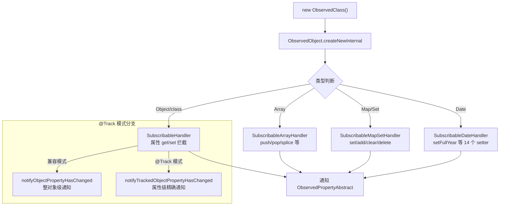

# 架构设计

> 07-02-02 状态管理V1数据对象内状态管理功能域的架构设计文档，补录已有实现。本域覆盖 V1 数据对象级的可观察能力：`@Observed`（类装饰器，实例经 `ObservedObject.createNewInternal` 包装为 ES6 Proxy，`SubscribableHandler` 系列拦截 Object/Array/Map/Set/Date 操作）与 `@Track`（`TrackedObject`，属性级精确追踪，仅标记属性变化触发通知）。`@Observed` 创建的可观察对象经 `@ObjectLink`（组件内，07-02-01 Feat-05）在子组件接收共享引用。

## 设计元数据

| 字段 | 内容 |
|------|------|
| Design ID | DESIGN-Func-07-02-02 |
| 关联需求 | 已有能力补录（无独立 requirement.md） |
| 关联 Epic | 无 |
| 目标 Feature | Feat-01 @Observed/@Track 数据对象观测与属性级追踪 |
| 复杂度 | 高 |
| 目标版本 | @Observed API 7 起；@Track API 11 起；非 @Track 属性 UI 使用错误码 140110 API 23 起 |
| Owner | ArkUI SIG |
| 状态 | Baselined |
| FuncID | 07-02-02 |
| 源码根 | `frameworks/bridge/declarative_frontend/state_mgmt/src/lib/common/observed_object.ts`（@Observed Proxy 体系）+ `partial_update/pu_tracked_object.ts`（@Track） |
| SDK 声明 | `interface/sdk-js/api/@internal/component/ets/common.d.ts`（@Observed/@Track） |
| 测试入口 | `frameworks/bridge/declarative_frontend/state_mgmt/test/unittest/entry/src/main/v1_tests/` + `common_tests/` |
| 前置依赖 | 07-02-01（ObservedPropertyAbstractPU 基类、依赖收集机制） |
| 下游影响 | 07-02-03（应用存储的 @Observed 对象持久化） |
| 关键错误码 | 140110（非 @Track 属性 UI 使用） |

## 需求基线

| 字段 | 内容 |
|------|------|
| 问题陈述 | V1 组件级状态变量（@State/@Prop/@Link）仅观察第一层属性，嵌套对象的深层属性赋值无法自动触发 UI 刷新。需要一套数据对象级观测机制让 class 实例的属性变化可被自动观察 |
| 核心目标 | 提供 `@Observed` ES6 Proxy 代理 + `@Track` 属性级精确追踪，使嵌套对象的属性变化可被自动观察，无需手动通知 |
| P1 AC | Feat-01 全量 AC |

## 上下文和现状

### 涉及仓和模块

| 仓库 | 模块路径 | 当前职责 | 本 Feature 影响 |
|------|----------|----------|-----------------|
| ace_engine | `common/observed_object.ts` | `ObservedObject`(884-1229) + `createNewInternal`(912-935) + 5 类 Proxy handler（SubscribableHandler 119-363 / ArrayHandler 664-875 / MapSetHandler 366-617 / DateHandler 619-662） | 全量涉及 |
| ace_engine | `partial_update/pu_tracked_object.ts` | `TrackedObject`(25-90) + `notifyObjectValueAssignment` 属性级比较 | 全量涉及 |
| ace_engine | `partial_update/pu_observed_property_abstract.ts` | `ObservedPropertyAbstractPU`：依赖收集（`trackedObjectPropertyDependencies_`）| Feat-01 协同 |

### 调用链层级分析

| 层 | 模块 | 职责 | 修改类型 |
|----|------|------|----------|
| 1. SDK 层 | `interface/sdk-js/api/@internal/component/ets/common.d.ts` | @Observed/@Track 声明 | 存量分析 |
| 2. 编译期 | ArkTS 编译器 | @Observed → 构造时调 `ObservedObject.createNewInternal`；@Track → `TrackedObject` 标记 | 存量分析 |
| 3. Proxy 代理层 | `observed_object.ts` `SubscribableHandler` 系列 | get/set 拦截：get 收集 @Track 依赖，set 通知属性变更 | 存量分析 |
| 4. 属性级追踪层 | `pu_tracked_object.ts` `TrackedObject` | @Track 标记属性精确追踪，`notifyObjectValueAssignment` 整对象赋值按属性比较 | 存量分析 |
| 5. 依赖收集层 | `pu_observed_property_abstract.ts` | `trackedObjectPropertyDependencies_` 按属性名分组记录 elmtId 依赖 | 存量分析 |

### 适用架构规则

| Rule ID | 适用原因 | 设计结论 | 验证方式 |
|---------|----------|----------|----------|
| OH-ARCH-LAYERING | 数据对象观测跨 SDK → 编译期 → Proxy 代理 → 属性追踪 → 依赖收集共 5 层 | ES6 Proxy 透明拦截，开发者无感知 | 代码评审 |
| OH-ARCH-API-LEVEL | @Observed API 7、@Track API 11、错误码 140110 API 23 | 各装饰器标注 @since | API 评审 |

## 不涉及项承接

| 维度 | 结论 |
|------|------|
| 组件级状态变量 | 承接 — @State/@Prop/@Link/@Provide/@Consume/@Watch 归 07-02-01 V1 组件内 |
| @ObjectLink | 承接 — @ObjectLink 是组件级接收端，归 07-02-01 Feat-05；本域仅描述 @Observed/@Track 的数据对象创建端 |
| 应用级存储 | 承接 — LocalStorage/AppStorage/PersistentStorage/Environment 归 07-02-03 |
| V2 数据对象 | 承接 — @ObservedV2/@Trace/@Computed/@Monitor 归 07-02-05 |

## 关键设计决策

### ADR 概览

| 决策 ID | 问题 | 选择方案 | 影响 |
|---------|------|----------|------|
| ADR-1 | 嵌套对象观测方式 | @Observed + ES6 Proxy 自动拦截（5 类 handler） | Feat-01 |
| ADR-2 | 属性级精确追踪 | @Track + TrackedObject 仅标记属性触发通知 | Feat-01 |
| ADR-3 | @Track 无深度观测 | 嵌套深层属性仍需每层 @Observed+@Track | Feat-01 |

### ADR-1: 嵌套对象观测 — @Observed + ES6 Proxy

**问题背景**：V1 组件级状态变量仅观察第一层属性。嵌套对象的属性赋值（如 `this.obj.name = "x"`）需要一种机制让框架自动感知。两种方式：手动通知或自动拦截。

**关键权衡**：
- 手动通知：开发者每次修改后调 `notifyHasChanged()` — 侵入性强，易遗漏
- ES6 Proxy 自动拦截：class 实例包装为 Proxy，handler 透明拦截 get/set — 开发者无感知
- getter/setter 注入（V2 @Trace 方案）：在原生数据上装 getter/setter — V2 范式

**选型推理**：V1 选择 ES6 Proxy。`ObservedObject.createNewInternal`(`observed_object.ts:912-935`) 按 Object/Array/Map/Set/Date 五类分发对应 handler。`SubscribableHandler`(119-363) 拦截 Object/class 的属性 get/set：set trap 在值变化时通知所有订阅的 `ObservedPropertyAbstract`；get trap 在 @Track 模式下收集属性级依赖。Proxy set trap 有值未变化优化（`Reflect.get === newValue` 跳过通知）。

**设计代价**：@Observed 改变 class 原始原型链，与其他类装饰器可能冲突；Proxy 有 get/set 拦截开销。

### ADR-2: 属性级精确追踪 — @Track

**问题背景**：@Observed Proxy 的 set trap 默认在整个对象的任意属性变化时通知所有订阅者。如果 class 有多个属性，UI 只用了其中一个，另一个变化也会触发冗余刷新。需要属性级精确追踪。

**选型推理**：`@Track` 装饰 @Observed class 的属性，`TrackedObject`(`pu_tracked_object.ts:25-90`) 仅对标记属性建立精确追踪。未标记属性在 UI 中读取抛 `NON_TRACK_PROPERTY_ON_UI`（API 23 起错误码 140110）。`notifyObjectValueAssignment` 整对象赋值时按属性比较，fake props 触发 @Prop/@ObjectLink 源同步。@Track 没有深度观测功能——嵌套对象的深层属性仍需每层 @Observed+@Track。

### ADR-3: @Track 无深度观测

**问题背景**：@Track 仅追踪标记属性的"自身变化"，不递归追踪嵌套对象的深层属性。

**选型推理**：嵌套对象的深层属性仍需每层 @Observed+@Track。这是 V1 设计的简化——深度观测的复杂性留给 V2 的 @ObservedV2+@Trace（getter/setter + autoProxyObject 逐层 addRef）。

## 设计骨架

| Task ID | 目标 | 受影响文件 | AC |
|---------|------|------------|-----|
| Feat-01 | @Observed ES6 Proxy 5 类 handler + @Track 属性级追踪 + 整对象赋值比较 + 错误码 140110 | `observed_object.ts`、`pu_tracked_object.ts` | AC-1.1~AC-3.5 |

## 后续 Task 拆分

| Spec | 目的 | 依赖 | 输出 |
|------|------|------|------|
| 无后续 Task | 已有实现补录 | — | 各 Feature 详细规格见 `Feat-NN-*-spec.md` |

## API 签名、Kit 与权限

### 新增 API

| API 签名 | 类型 | 功能描述 | 关联 Feat |
|----------|------|----------|----------|
| （已有实现补录，API 通过 ArkTS 装饰器语法或 `@ohos.arkui.StateManagement` 模块暴露，具体签名见各 Feature spec） | Public | 各装饰器/API 的完整签名、@since、开放范围见各 Feature spec 的「核心类与机制清单」和「兼容性声明」 | Feat-01~NN |

### 变更/废弃 API

无变更。

### Kit

无独立 Kit，归属于 ArkUI ArkTS 声明式范式（`SystemCapability.ArkUI.ArkUI.Full`）。

### 权限要求

无权限要求。

## 构建系统影响

### BUILD.gn 变更

无变更。状态管理 TS 库编译为单一 `stateMgmt.abc` 字节码（debug/release/profile 三种构建产物），由引擎初始化时载入。构建配置见 `frameworks/bridge/declarative_frontend/state_mgmt/BUILD.gn`。

### bundle.json 变更

无变更。

## 可选设计扩展

### @Observed Proxy 代理流程

### @Observed + @ObjectLink 数据流

1. `@Observed class Model { ... }` 声明可观察数据类
2. `new Model()` 实例化时经 `ObservedObject.createNewInternal` 包装为 ES6 Proxy
3. 父组件 `@State model: Model = new Model()` 持有 Proxy 包装的实例
4. 子组件 `@ObjectLink model: Model`（07-02-01 Feat-05）经 `SynchedPropertyNestedObjectPU` 订阅该 Proxy
5. `this.model.name = "x"` 触发 `SubscribableHandler.set` trap
6. set trap 通知所有订阅的 `ObservedPropertyAbstract`（含父 @State + 子 @ObjectLink）
7. @State 经 `notifyPropertyHasChangedPU` 触发依赖 elmtId 重渲染

## 详细设计

各 Feature 的详细规格见对应的 `Feat-NN-*-spec.md`。

## 风险和开放问题

| 项 | 类型 | 影响 | 处理方式 | Owner |
|----|------|------|----------|-------|
| @Observed 原型链污染 | 兼容性 | 中 | @Observed 改变 class 原始原型链，与其他类装饰器可能冲突 | ArkUI SIG |
| @Track UI 误用 | 健壮性 | 中 | 未标记 @Track 属性在 UI 中使用报错（API 23+ 错误码 140110） | ArkUI SIG |
| @Track 无深度观测 | 功能 | 低 | 嵌套深层属性仍需每层 @Observed+@Track；深度观测归 V2 @ObservedV2+@Trace | ArkUI SIG |

## 设计审批

- [x] 需求基线已确认
- [x] 不涉及项已承接（组件级/应用级/V2 分别归 07-02-01/03/05）
- [x] 涉及仓和模块职责清楚（`observed_object.ts` + `pu_tracked_object.ts`）
- [x] 调用链层级分析完整（5 层）
- [x] 关键设计决策有理由（3 个 ADR 含深入分析）
- [x] 风险和开放问题有 Owner

**结论:** Baselined（已有实现补录）.
