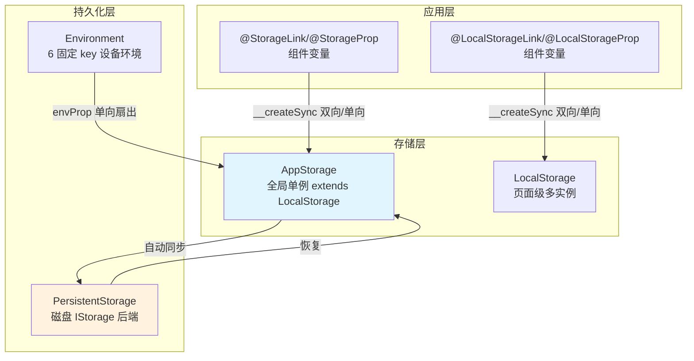

# 架构设计

> 07-02-03 状态管理V1应用内状态管理功能域的架构设计文档，补录已有实现。本域覆盖 V1 应用级状态承载与持久化：`LocalStorage`（页面级多实例存储）、`AppStorage`（应用级全局单例，继承 LocalStorage）、`PersistentStorage`（磁盘持久化，经 AppStorage 中转）、`Environment`（设备环境变量扇出到 AppStorage）。存储联动装饰器（`@StorageLink`/`@StorageProp`/`@LocalStorageLink`/`@LocalStorageProp`）经 `__createSync` 工厂创建。

## 设计元数据

| 字段 | 内容 |
|------|------|
| Design ID | DESIGN-Func-07-02-03 |
| 关联需求 | 已有能力补录（无独立 requirement.md） |
| 关联 Epic | 无 |
| 目标 Feature | Feat-01 LocalStorage, Feat-02 AppStorage+存储装饰器, Feat-03 PersistentStorage, Feat-04 Environment |
| 复杂度 | 高 |
| 目标版本 | LocalStorage/@LocalStorageLink/@LocalStorageProp API 9 起；AppStorage/@StorageLink/@StorageProp API 7 起；PersistentStorage 小写 API 10 起；Environment API 7 起；Map/Set/Date API 12 起 |
| Owner | ArkUI SIG |
| 状态 | Baselined |
| FuncID | 07-02-03 |
| 源码根 | `frameworks/bridge/declarative_frontend/state_mgmt/src/lib/sdk/`（local_storage.ts / app_storage.ts / persistent_storage.ts / environment.ts） |
| SDK 声明 | `interface/sdk-js/api/@internal/component/ets/common.d.ts`（存储装饰器）+ `interface/sdk-js/api/@internal/component/ets/common_ts_ets_api.d.ts`（AppStorage/LocalStorage/PersistentStorage/Environment 类） |
| 测试入口 | `frameworks/bridge/declarative_frontend/state_mgmt/test/unittest/entry/src/main/common_tests/` |
| 前置依赖 | 07-02-01（AppStorage extends LocalStorage；存储装饰器经 __createSync 创建 SynchedPropertyPU） |
| 下游影响 | 无（V1 应用存储是顶层消费方） |
| 关键错误码 | 140115（V1 状态变量非法类型） |

## 需求基线

| 字段 | 内容 |
|------|------|
| 问题陈述 | 组件级状态变量（@State/@Prop/@Link）仅覆盖组件树内同步。应用需要跨组件树/跨页面/跨进程生命周期的状态承载与持久化能力 |
| 核心目标 | 提供 V1 应用级存储完整能力：页面级多实例（LocalStorage）、全局单例（AppStorage）、磁盘持久化（PersistentStorage）、设备环境变量（Environment） |
| P1 AC | Feat-01~04 全量 AC |

## 上下文和现状

### 涉及仓和模块

| 仓库 | 模块路径 | 当前职责 | 本 Feature 影响 |
|------|----------|----------|-----------------|
| ace_engine | `sdk/local_storage.ts` | `LocalStorage`(29-540) extends NativeStorage：`storage_: Map<string, ObservedPropertyAbstract>`；link/prop/setAndLink/setAndProp/ref/setAndRef；CRUD + 订阅者保护 | Feat-01 全量 |
| ace_engine | `sdk/app_storage.ts` | `AppStorage`(27-514) extends LocalStorage：全局单例 + 静态 API 委托 | Feat-02 全量 |
| ace_engine | `sdk/persistent_storage.ts` | `PersistentStorage`(158-482)：persistProp 决策链、MapInfo/SetInfo/DateInfo 序列化、IStorage 后端 | Feat-03 全量 |
| ace_engine | `sdk/environment.ts` | `Environment`(23-197)：6 固定 key 后端查询 → AppStorage 扇出 | Feat-04 全量 |
| ace_engine | `common/i_storage.ts` | `IStorage` 接口（不支持增量更新，write() 写所有属性） | Feat-03 协同 |
| ace_engine | `jsview/js_local_storage.cpp/.h` | `JSLocalStorage`（`storages_` thread_local 多 containerId） | C++ 绑定（跨域 07-02-01） |
| ace_engine | `jsview/js_persistent.cpp/.h` | `JSPersistent`（"Storage"→`StorageProxy`） | C++ 绑定（跨域 07-02-01） |
| ace_engine | `jsview/js_environment.cpp/.h` | `JSEnvironment`（"EnvironmentSetting"） | C++ 绑定（跨域 07-02-01） |

### 调用链层级分析

| 层 | 模块 | 职责 | 修改类型 |
|----|------|------|----------|
| 1. SDK 层 | `interface/sdk-js/api/@internal/component/ets/common.d.ts` | @StorageLink/@StorageProp/@LocalStorageLink/@LocalStorageProp + AppStorage/LocalStorage/PersistentStorage/Environment 类声明 | 存量分析 |
| 2. 存储基类 | `sdk/local_storage.ts` `LocalStorage` | 页面级存储：link/prop/CRUD/订阅者保护/__createSync 工厂 | 存量分析 |
| 3. 全局单例 | `sdk/app_storage.ts` `AppStorage` | extends LocalStorage + 静态 API 委托；进程级共享 | 存量分析 |
| 4. 持久化层 | `sdk/persistent_storage.ts` | persistProp 决策链（磁盘→AppStorage→default）；Map/Set/Date 序列化 | 孅量分析 |
| 5. 环境层 | `sdk/environment.ts` | 6 固定 key 后端查询 → AppStorage.setAndProp 扇出 | 孅量分析 |
| 6. C++ 绑定 | `js_local_storage.cpp`/`js_persistent.cpp`/`js_environment.cpp` | JSLocalStorage thread_local / JSPersistent StorageProxy / JSEnvironment EnvironmentSetting | 跨域（07-02-01） |

### 适用架构规则

| Rule ID | 适用原因 | 设计结论 | 验证方式 |
|---------|----------|----------|----------|
| OH-ARCH-LAYERING | 存储跨 SDK → 基类 → 单例 → 持久化 → 环境 → C++ 绑定共 6 层 | 经 AppStorage 中转；所有读写经 AppStorage | 代码评审 |
| OH-ARCH-API-LEVEL | LocalStorage API 9、AppStorage API 7（小写 10）、PersistentStorage API 10、Environment API 7 | 大写 API 7→10 废弃 | API 评审 |

## 不涉及项承接

| 维度 | 结论 |
|------|------|
| 组件级状态变量 | 承接 — @State/@Prop/@Link/@Provide/@Consume/@Watch 归 07-02-01 |
| 数据对象观测 | 承接 — @Observed/@Track 归 07-02-02 |
| V2 应用存储 | 承接 — AppStorageV2/PersistenceV2 归 07-02-06 |
| UIUtils | 承接 — 命令式工具 API 归 07-02-07 |

## 关键设计决策

### ADR 概览

| 决策 ID | 问题 | 选择方案 | 影响 |
|---------|------|----------|------|
| ADR-1 | AppStorage 与 LocalStorage 关系 | 特殊单例 LocalStorage + 静态 API 委托 | Feat-02 |
| ADR-2 | 持久化方向 | 经 AppStorage 中转；不直接访问 PersistentStorage | Feat-03 |
| ADR-3 | persistProp 决策链 | 磁盘→AppStorage→defaultValue 三级查询 | Feat-03 |
| ADR-4 | 订阅者保护 | delete/clear 仅无订阅者时成功 | Feat-01/02 |
| ADR-5 | Environment 扇出 | envProp → AppStorage.setAndProp 单向扇出 | Feat-04 |

### ADR-1: AppStorage 与 LocalStorage 关系

**问题背景**：应用需要全局共享状态（跨组件树）。LocalStorage 是页面级可多实例存储。如何提供全局单例？

**选型推理**：AppStorage 是"特殊的单例 LocalStorage 对象"——extends LocalStorage，所有 API 为静态方法委托到内部单例 LocalStorage 实例。主线程内多个 UIAbility 共享同一 AppStorage；UIExtensionAbility 是独立进程不共享。AppStorage 与 AppStorageV2（V2）数据互不共享。

### ADR-2: 持久化方向 — 经 AppStorage 中转

**问题背景**：PersistentStorage 需要将数据写入磁盘。UI/业务逻辑如何访问持久化数据？

**关键权衡**：
- 直接访问 PersistentStorage：读写直通磁盘——API 复杂，开发者需区分内存/磁盘
- 经 AppStorage 中转：所有读写经 AppStorage，PersistentStorage 自动同步——API 统一

**选型推理**：选择经 AppStorage 中转。UI/业务逻辑不直接访问 PersistentStorage，所有读写经 AppStorage。AppStorage 中已持久化 key 的变化自动同步写回磁盘。`IStorage.write()` 写所有属性（不支持增量更新）。

### ADR-3: persistProp 决策链

**问题背景**：`persistProp(key, defaultValue)` 需要决定用哪个值初始化——磁盘值、AppStorage 值还是 defaultValue？

**选型推理**：三级查询：①PersistentStorage 文件中有 key → 在 AppStorage 创建用磁盘值初始化 ②文件中无但 AppStorage 有 → 持久化用 AppStorage 值覆盖磁盘值 ③都没有 → AppStorage 用 defaultValue 创建并持久化。必须在访问 AppStorage 同名 key 之前调 persistProp（否则 AppStorage 值会覆盖磁盘值）。

### ADR-4: 订阅者保护

**问题背景**：如果存储属性还有活跃的订阅者（@StorageLink/@StorageProp 装饰的变量、link/prop 返回的 SubscribedAbstractProperty），直接 delete 会导致悬挂引用。

**选型推理**：`delete`/`clear` 仅当属性无订阅者时返回 true。需先调 `SubscribedAbstractProperty.aboutToBeDeleted()` 释放句柄或销毁自定义组件，才能成功 delete。

### ADR-5: Environment 扇出

**问题背景**：设备环境变量（颜色模式、字体大小等）需要被组件感知。

**选型推理**：单向扇出 Environment → AppStorage → Component。`envProp` 查 6 固定 key 后端值，写入 `AppStorage.setAndProp`；系统变化 `onValueChanged` → `AppStorage.set` 扇出到所有 @StorageProp。应用无法修改环境变量，组件用 @StorageProp 单向读取。

## 设计骨架

| Task ID | 目标 | 受影响文件 | AC |
|---------|------|------------|-----|
| Feat-01 | LocalStorage 页面级多实例（link/prop/ref、CRUD、订阅者保护） | `sdk/local_storage.ts` | AC-1.1~AC-4.8 |
| Feat-02 | AppStorage 全局单例 + @StorageLink/@StorageProp | `sdk/app_storage.ts` | AC-1.1~AC-4.4 |
| Feat-03 | PersistentStorage 磁盘持久化（persistProp 决策链、序列化） | `sdk/persistent_storage.ts` | AC-1.1~AC-4.5 |
| Feat-04 | Environment 设备环境变量（6 固定 key、扇出） | `sdk/environment.ts` | AC-1.1~AC-3.4 |

## 后续 Task 拆分

| Spec | 目的 | 依赖 | 输出 |
|------|------|------|------|
| 无后续 Task | 已有实现补录 | — | 各 Feature 详细规格见 `Feat-NN-*-spec.md` |

## API 签名、Kit 与权限

### 新增 API

| API 签名 | 类型 | 功能描述 | 关联 Feat |
|----------|------|----------|----------|
| （已有实现补录，API 通过 ArkTS 装饰器语法或 `@ohos.arkui.StateManagement` 模块暴露，具体签名见各 Feature spec） | Public | 各装饰器/API 的完整签名、@since、开放范围见各 Feature spec 的「核心类与机制清单」和「兼容性声明」 | Feat-01~NN |

### 变更/废弃 API

无变更。

### Kit

无独立 Kit，归属于 ArkUI ArkTS 声明式范式（`SystemCapability.ArkUI.ArkUI.Full`）。

### 权限要求

无权限要求。

## 构建系统影响

### BUILD.gn 变更

无变更。状态管理 TS 库编译为单一 `stateMgmt.abc` 字节码（debug/release/profile 三种构建产物），由引擎初始化时载入。构建配置见 `frameworks/bridge/declarative_frontend/state_mgmt/BUILD.gn`。

### bundle.json 变更

无变更。

## 可选设计扩展

### 存储架构图

### persistProp 决策链数据流

1. 调用 `PersistentStorage.persistProp(key, defaultValue)`
2. 检查 PersistentStorage 文件 → 有 key？→ **是**：在 AppStorage 创建用磁盘值初始化
3. 文件无 key → 检查 AppStorage → 有 key？→ **是**：持久化该属性，用 AppStorage 值覆盖磁盘值
4. AppStorage 也无 key → 在 AppStorage 用 `defaultValue` 创建并持久化
5. 后续 AppStorage 中该 key 变化时自动同步写回磁盘（`write()` 写所有属性）

## 详细设计

各 Feature 的详细规格见对应的 `Feat-NN-*-spec.md`。

## 风险和开放问题

| 项 | 类型 | 影响 | 处理方式 | Owner |
|----|------|------|----------|-------|
| persistProp 顺序陷阱 | 兼容性 | 中 | 先访问 AppStorage 同名 key 后 persistProp 会用 AppStorage 值覆盖磁盘值 | ArkUI SIG |
| 嵌套对象持久化限制 | 功能 | 中 | V1 PersistentStorage 不支持嵌套对象自动持久化，需手动 notifyHasChanged | ArkUI SIG |
| module 级存储路径 | 兼容性 | 低 | 多 module 同 key 数据归属最先使用 PersistentStorage 的 module | ArkUI SIG |
| @StorageProp 副本不一致 | 健壮性 | 低 | 本地修改后 AppStorage setOrCreate 同值不同步回 @StorageProp | ArkUI SIG |

## 设计审批

- [x] 需求基线已确认
- [x] 不涉及项已承接
- [x] 涉及仓和模块职责清楚（`sdk/local_storage.ts` + `app_storage.ts` + `persistent_storage.ts` + `environment.ts`）
- [x] 调用链层级分析完整（6 层）
- [x] 关键设计决策有理由（5 个 ADR 含深入分析）
- [x] 风险和开放问题有 Owner

**结论:** Baselined（已有实现补录）.
