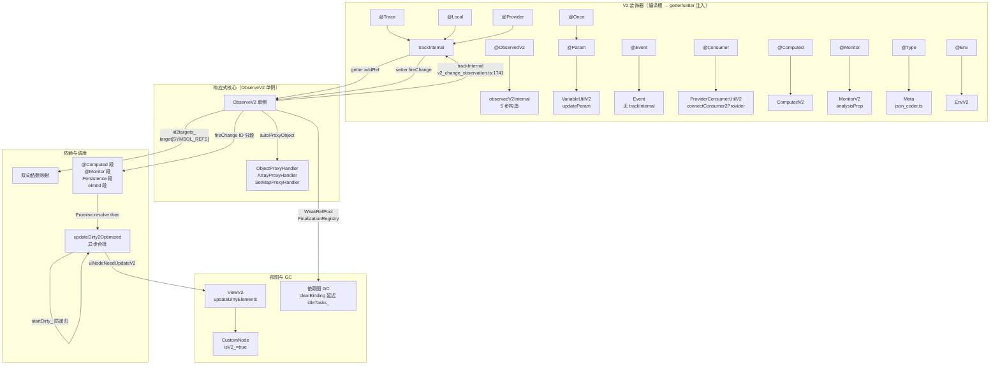
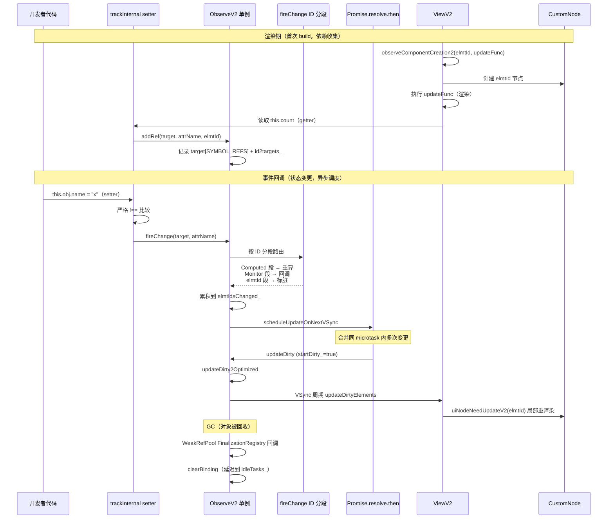

# 架构设计

> 07-02-04 状态管理V2组件内状态管理 功能域的架构设计文档，补录已有实现。本域覆盖 ArkUI 声明式前端 API 12+ 引入的下一代（V2）状态管理能力。V2 与 V1（07-02-01）并存但范式不同：V2 不再使用「属性包装对象」，而是直接在原生数据上安装 getter/setter（`trackInternal`），依赖与通知提取到全局 `ObserveV2` 单例；变更调度通过 `Promise.resolve().then()` 合并到 VSync 在一个 `updateDirty2Optimized` 批次内统一处理。V2 提供 14 个装饰器：`@ObservedV2`/`@Trace`（可观察数据模型）、`@Local`（组件私有）、`@Param`/`@Once`（父→子单向输入）、`@Event`（子→父回调）、`@Provider`/`@Consumer`（跨层同步）、`@Computed`（计算属性）、`@Monitor`/`@SyncMonitor`（变化监听）、`@Type`（序列化类型标记）、`@Env`/`@CustomEnv`（环境注入），以及 `@ComponentV2`/`@ReusableV2`（自定义组件与复用）。

## 设计元数据

| 字段 | 内容 |
|------|------|
| Design ID | DESIGN-Func-07-02-04 |
| 关联需求 | 已有能力补录（无独立 requirement.md） |
| 关联 Epic | 无 |
| 目标 Feature | Feat-01 ObserveV2 核心机制, Feat-02 @Local/@Param/@Once/@Event 组件状态输入输出, Feat-03 @Provider/@Consumer V2 跨层同步, Feat-04 V1↔V2 迁移与混用规则, Feat-05 ConfigureStateMgmt 特性开关 |
| 复杂度 | 高 |
| 目标版本 | 核心装饰器 API 12 起；@ReusableV2 API 18 起；V1/V2 混用解禁（enableV2Compatibility/makeV1Observed）API 19 起；@SyncMonitor/UIUtils.addMonitor API 20+ 起；@Env API 22 起；UIUtils.applySync/flushUpdates/flushUIUpdates API 22 起；跨 BuilderNode/@SyncMonitor/@ReusableV2 错误码 API 23 起；@CustomEnv/@Monitor 通配符 API 26 起 |
| Owner | ArkUI SIG |
| 状态 | Baselined |
| FuncID | 07-02-04 |
| 源码根 | `frameworks/bridge/declarative_frontend/state_mgmt/src/lib/v2/`（v2_change_observation.ts / v2_view.ts / v2_decorators.ts / v2_observed_proxy.ts）+ `common/weakref_pool.ts` |
| SDK 声明 | `interface/sdk-js/api/@internal/component/ets/common.d.ts`（V2 装饰器） |
| 测试入口 | `frameworks/bridge/declarative_frontend/state_mgmt/test/unittest/entry/src/main/v2_tests/` |
| 前置依赖 | 07-02-01（V1/V2 共用 PUV2ViewBase / CustomNode C++ 宿主 / ElementRegister） |
| 下游影响 | 07-02-05（V2 数据对象 trackInternal）、07-02-06（V2 应用存储 ObserveV2 自动追踪）、07-02-07（UIUtils applySync/flushUpdates）、07-03-01~04（ViewV2 基类） |
| 关键错误码 | 130000-130002（addMonitor/clearMonitor）、140000（@Env 无效 key）、140001/140002（applySync/flushUpdates 非法调用）、140113（@ReusableV2 SDK 版本） |

## 需求基线

| 字段 | 内容 |
|------|------|
| 问题陈述 | V1（07-02-01）的属性包装对象范式存在每变量对象开销、深层嵌套观测需逐层 @Observed+@ObjectLink、@Watch 仅变量名级监听无前后值等局限。ArkUI 需要一套更细粒度、更高性能、支持计算属性与路径监听的下一代状态管理 |
| 核心目标 | 提供 V2 状态管理完整能力，覆盖 ObserveV2 单例核心机制与 14 个 V2 装饰器，固化 getter/setter 响应式安装、惰性集合代理、ID 分段路由、异步 dirty 调度、依赖图 GC（WeakRefPool）、V1↔V2 共存迁移行为规格 |
| P0 AC | Feat-01（核心机制）与 Feat-02（@ObservedV2/@Trace）、Feat-03（@Local/@Param/@Once/@Event）全量 AC；Feat 04/05/06 为 P1 |
| 补充说明 | V2 装饰器是纯 TS 实现，C++ 不参与 V2 观察逻辑；V1/V2 在 C++ 侧共用同一 `CustomNode` 宿主，仅靠 `isV2_` 标志区分。V2 与 V1 不应直接混用，API 19+ 提供 `enableV2Compatibility`/`makeV1Observed` 减少混用约束 |

## 上下文和现状

### 涉及仓和模块

| 仓库 | 模块路径 | 当前职责 | 本 Feature 影响 |
|------|----------|----------|-----------------|
| ace_engine | `frameworks/bridge/declarative_frontend/state_mgmt/src/lib/v2/v2_change_observation.ts` | `ObserveV2` 单例（line 52-1739）：依赖跟踪（`addRef`）、变更分发（`fireChange`）、`updateDirty2Optimized`/`updateDirty2` 调度管线、`autoProxyObject` 惰性代理、`trackInternal`（line 1741-1780）共享安装 getter/setter | Feat-01 核心 |
| ace_engine | `frameworks/bridge/declarative_frontend/state_mgmt/src/lib/v2/v2_observed_proxy.ts` | `ObjectProxyHandler`(19-108)/`ArrayProxyHandler`(110-250)/`SetMapProxyHandler`(252-436)：首次读取时惰性包装 Array/Set/Map/Date | Feat-01 核心 |
| ace_engine | `frameworks/bridge/declarative_frontend/state_mgmt/src/lib/v2/v2_view.ts` | `ViewV2`（line 47-1334）：V2 dirty 更新、复用自动冻结、Monitor 重置、`uiNodeNeedUpdateV2`(719)、`updateDirtyElements`(762)、`setActiveInternal`(876)、`performDelayedUpdate`(920) | Feat-06 核心 |
| ace_engine | `frameworks/bridge/declarative_frontend/state_mgmt/src/lib/v2/v2_decorators.ts` | 全部 14 个 V2 装饰器工厂：`ObservedV2`(39)/`Trace`(53)/`Local`(72)/`Param`(92)/`Once`(133)/`Event`(153)/`Provider`(175)/`Consumer`(204)/`Monitor`(259)/`SyncMonitor`(312)/`Computed`(366)/`Env`(385)/`CustomEnv`(436) | Feat-02~06 核心 |
| ace_engine | `frameworks/bridge/declarative_frontend/state_mgmt/src/lib/v2/v2_decorated_variables.ts` | `VariableUtilV2`(24-86，@Param update)、`ProviderConsumerUtilV2`(88-305，@Provider/@Consumer 配对，`connectConsumer2Provider` line 239)、`observedV2Internal`(324-357，@ObservedV2 5 步构造) | Feat-02/03/05 核心 |
| ace_engine | `frameworks/bridge/declarative_frontend/state_mgmt/src/lib/v2/v2_computed.ts` | `ComputedV2`(31-161，`MIN_COMPUTED_ID=0x1000000000`)：`InitRun`(59)/`fireChange`(79)/`observeObjectAccess`(105) 惰性求值 + 缓存 | Feat-04 核心 |
| ace_engine | `frameworks/bridge/declarative_frontend/state_mgmt/src/lib/v2/v2_monitor.ts` | `MonitorV2`(189-574)/`MonitorValueV2`(59-188)/`MonitorPathHelper`(26-57)：路径遍历依赖注册，`analysisProp`(520) | Feat-04 核心 |
| ace_engine | `frameworks/bridge/declarative_frontend/state_mgmt/src/lib/v2/v2_env.ts` | `EnvV2`(64-296)：按 UIContext（instanceId）隔离的环境变量注册，`registerEnv`(210)、`isDirectQuerySystemEnvKey`(158) | Feat-06 核心 |
| ace_engine | `frameworks/bridge/declarative_frontend/state_mgmt/src/lib/v2/v2_make_observed.ts` | `RefInfo`(16-46)：将任意值包装为可观察（`makeObserved` 内部实现） | Feat-01 基础 |
| ace_engine | `frameworks/bridge/declarative_frontend/state_mgmt/src/lib/puv2_common/puv2_view_base.ts` | `PUV2ViewBase`(63-1517)：V1/V2 共享基类，`activeCount_`(104)、`isCompFreezeAllowed_`(119)、`markNeedUpdate`(337)、`executeActiveOrInactiveLifecycleByNonFreezeCount`(701) | Feat-01/06 基础 |
| ace_engine | `frameworks/bridge/declarative_frontend/state_mgmt/src/lib/puv2_common/pu_lifecycle.ts` | `CustomComponentLifecycle`(56-263)：5 态 FSM（INIT/APPEARED/BUILT/RECYCLED/DISAPPEARED）+ `__componentX__Internal`(277-399) 新生命周期装饰器实现 | Feat-06 核心 |
| ace_engine | `frameworks/bridge/declarative_frontend/state_mgmt/src/lib/common/weakref_pool.ts` | `WeakRefPool`(32-141)：规范化 WeakRef + `FinalizationRegistry`(36) 驱动的依赖图 GC，`asyncRegisterToFinalizationRegistry`(68) | Feat-01/05 基础 |
| ace_engine | `frameworks/bridge/declarative_frontend/state_mgmt/src/lib/sdk/ui_utils.ts` | `UIUtilsImpl`(16-134)：`makeObserved`(39)/`getTarget`(23)/`canBeObserved`(19)/`enableV2Compatibility`(50)/`makeV1Observed`(45)/`makeBinding`(57-62)/`addMonitor`(64)/`clearMonitor`(84)/`applySync`(104)/`flushUpdates`(108)/`flushUIUpdates`(112) | Feat-01/04 基础 |
| ace_engine | `frameworks/bridge/declarative_frontend/state_mgmt/src/lib/v2/v2_data_coder/json_coder.ts` | `Meta`(31-70)/`__Type__`(72，即 @Type 装饰器)/`JSONCoder`(138-493)：序列化类型标记与编解码 | Feat-02 协同（@Type） |
| ace_engine | `frameworks/bridge/declarative_frontend/state_mgmt/src/lib/v2/v2_recycle_pool.ts` | `RecyclePoolV2` + `RecycledIdRegistry`：V2 按父节点的组件复用池 | Feat-06 核心 |
| ace_engine | `frameworks/core/components_ng/pattern/custom/custom_node.cpp/.h` | `CustomNode`/`CustomNodeBase`：`@ComponentV2` 的 C++ 宿主节点（`isV2_=true`），V1/V2 共用 | 跨域（07-02-14）协同 |
| ace_engine | `frameworks/bridge/declarative_frontend/state_mgmt/test/unittest/entry/src/main/v2_tests/` | V2 装饰器、`ObserveV2`、`@Computed`、`@Monitor`、`@Provider`/`@Consumer` 行为回归 | 全量验证 |
| ace_engine | `frameworks/bridge/declarative_frontend/state_mgmt/test/unittest/entry/src/main/env_tests/` | `@Env`/`@CustomEnv`、`EnvV2` 注册表、UIContext 隔离 | Feat-06 验证 |

### 调用链层级分析

| 层 | 模块 | 职责 | 修改类型 |
|----|------|------|----------|
| 1. SDK 层 | `interface/sdk-js/api/@internal/component/ets/common.d.ts` | 14 个 V2 装饰器 + `@ComponentV2`/`@ReusableV2` 类型声明 | 存量分析 |
| 2. 编译期 | ArkTS 编译器 | 装饰器语法解析，转换为运行时装饰器工厂调用 | 存量分析 |
| 3. 装饰器层 | `v2/v2_decorators.ts` | 14 个装饰器工厂，委托到 `trackInternal`/`ComputedV2`/`MonitorV2`/`ProviderConsumerUtilV2`/`EnvV2` | 存量分析 |
| 4. 响应式安装层 | `v2/v2_change_observation.ts` `trackInternal`(1741-1780) | 移动值到 `__ob_<prop>`，安装 getter（`addRef`+`autoProxyObject`）与 setter（`fireChange`） | 存量分析 |
| 5. 依赖跟踪层 | `v2/v2_change_observation.ts` `ObserveV2.addRef`(423) | getter 调用时记录依赖到 `target[SYMBOL_REFS]` 与 `ObserveV2.id2targets_` | 存量分析 |
| 6. 变更分发层 | `v2/v2_change_observation.ts` `ObserveV2.fireChange`(619) | setter 调用时按 ID 分段路由：Computed ID 段 / Monitor ID 段 / Persistence ID 段 / 普通 elmtId | 存量分析 |
| 7. 异步调度层 | `v2/v2_change_observation.ts` `updateDirty2Optimized`(807) | `Promise.resolve().then()` 合并同 microtask 内多次变更为一个 `updateDirty` 批次，`startDirty_` 防递归 | 存量分析 |
| 8. 视图调度层 | `v2/v2_view.ts` `ViewV2.updateDirtyElements`(762) | V2 dirty 元素重渲染，`uiNodeNeedUpdateV2`(719) 入口 | 存量分析 |
| 9. 惰性代理层 | `v2/v2_observed_proxy.ts` | 首次读取 Array/Set/Map/Date 时经 `ObserveV2.autoProxyObject`(1444) 包装为 Proxy | 存量分析 |
| 10. GC 层 | `common/weakref_pool.ts` `WeakRefPool` | `FinalizationRegistry` 驱动的依赖图回收，`clearBinding` 延迟到 `idleTasks_` | 存量分析 |
| 11. C++ 宿主层 | `core/components_ng/pattern/custom/custom_node.cpp` | `CustomNode` 宿主（`isV2_=true`），V1/V2 共用 | 存量分析（跨域 07-02-14） |

### 适用架构规则

| Rule ID | 适用原因 | 设计结论 | 验证方式 |
|---------|----------|----------|----------|
| OH-ARCH-LAYERING | V2 状态管理跨 SDK → 编译期 → 装饰器 → 响应式安装 → 依赖跟踪 → 变更分发 → 异步调度 → 视图调度 → GC → C++ 宿主 共 11 层 | 单向数据流：状态变量 setter → `fireChange` → 异步 `updateDirty` → UI 重渲染 | 代码评审 |
| OH-ARCH-API-LEVEL | 14 个装饰器在 API 12/18/19/20/22/23/26 有行为增量；错误码 130000-130002/140000-140002/140113 起 | 各装饰器行为与错误码均标注 @since 版本，V1↔V2 混用 API 19 分水岭 | API 评审/XTS |
| OH-ARCH-COMPONENT-BUILD | 状态管理 TS 库编译为独立 `stateMgmt.abc` 字节码（V1/V2 共用同一产物） | V2 装饰器位于 `v2/` 子目录，V1/V2 共享 `puv2_common/` | 构建验证 |
| OH-ARCH-ERROR-LOG | V2 错误码：130000-130002（addMonitor/clearMonitor/@SyncMonitor，API 20+）、140000（@Env 无效 key，API 22+）、140001/140002（applySync/flushUpdates 非法调用，API 22+）、140113（@ReusableV2 SDK 版本，API 23+） | 错误码在 Feat-04（130001/140001/140002）、Feat-06（140000/140113）固化 | 错误码文档对齐 |

## 不涉及项承接

| 维度 | 结论 |
|------|------|
| V1 装饰器 | 承接 — `@State`/`@Prop`/`@Link`/`@Provide`/`@Consume`/`@ObjectLink`/`@Watch`/`@Track`/`@Observed` 归 07-02-01；本域仅描述 V2 |
| 应用级存储 | 展开 — `AppStorageV2`/`PersistenceV2`/`StorageHelper`/`DataCoder`/`JSONCoder` 将在本域后续 Feat 补充；`@Type` 装饰器语义已在 Feat-02 描述 |
| 数据同步基础设施 | 承接 — elmtId 全链路同步归 07-02-14；本域含 `WeakRefPool` 依赖图 GC（Feat-01）、`ConfigureStateMgmt` 特性开关（Feat-09） |
| V2 组件冻结 | 展开 — `@ComponentV2` 的 `freezeWhenInactive` 与 V1 行为基本一致；本域在 Feat-06 描述 V2 冻结与复用协同（实时 `isViewActive()` 检查 vs V1 三态机） |
| 安全与权限 | N/A — 组件状态管理不涉及安全敏感操作 |
| 兼容性 | 展开 — V1/V2 不应直接混用；API 19+ 提供 `enableV2Compatibility`/`makeV1Observed` 减少约束；V1→V2 迁移对应表见 Feat-06 |
| IPC/跨进程 | N/A — 组件状态管理为单进程 UI 状态 |
| 构建与部件 | N/A — V2 与 V1 共用 `stateMgmt.abc`，无独立部件 |

## 关键设计决策

### ADR 概览

| 决策 ID | 问题 | 选择方案 | 影响 |
|---------|------|----------|------|
| ADR-1 | 状态变量实现方式 | getter/setter 注入（trackInternal）| Feat-01~05 |
| ADR-2 | 依赖记录位置 | 双向映射 target[SYMBOL_REFS] + id2targets_ | Feat-01 |
| ADR-3 | 变更调度时机 | 异步 Promise.resolve.then 合并到 VSync | Feat-01 |
| ADR-4 | ID 分段路由 | fireChange 按 Computed/Monitor/Persistence/elmtId 四段 | Feat-01/04 |
| ADR-5 | 集合类型观测 | 惰性 autoProxyObject 首次读取包装 | Feat-01 |
| ADR-6 | 依赖图 GC | WeakRefPool + FinalizationRegistry 自动回收 | Feat-01/05 |
| ADR-7 | @Computed 实现 | 惰性求值 + 缓存 + 不支持 setter | Feat-04（详见 07-02-05） |
| ADR-8 | @Monitor 路径监听 | analysisProp 点分路径逐层 addRef | Feat-04（详见 07-02-05） |
| ADR-9 | @Provider/@Consumer 配对 | 弱引用 + 重定义 getter/setter | Feat-03 |
| ADR-10 | V1/V2 共存策略 | API 19 分水岭 + 桥接 API | Feat-04 |
| ADR-11 | V2 复用自动重置 | resetStateVarsOnReuse 按定义顺序重置 | 复用（详见 07-03-03） |

### ADR-1: 状态变量实现方式 — getter/setter 注入 vs 属性包装对象

**问题背景**：V1 用属性包装对象（每变量一个 `ObservedPropertyAbstractPU` 实例），有对象开销。V2 需要更高效的方案。

**关键权衡**：
- 属性包装对象（V1 方案）：每变量一个包装对象，提供 get/set 钩子——简单但每变量有对象开销（内存 + GC）
- getter/setter 注入（V2 方案）：直接在原生数据上装 getter/setter，依赖与通知提取到全局 `ObserveV2` 单例——无对象开销但需全局单例

**选型推理**：V2 选择 getter/setter 注入。`trackInternal`(`v2_change_observation.ts:1741-1780`) 移动值到 `__ob_<prop>` 后备存储，原属性装 getter（`addRef` 收集依赖 + `autoProxyObject` 惰性包装集合）与 setter（`fireChange` 变更分发）。V1/V2 不应混用（`checkIsSupportedValue` 拒绝 V2 对象作为 V1 状态变量）。

### ADR-3: 变更调度时机 — 异步合并 vs 同步立即

**问题背景**：V1 状态变更同步立即通知（`notifyPropertyHasChangedPU` → 标脏 → 下个 VSync 重渲染）。V2 如果也同步通知，同一事件中多次变更会产生多次 fireChange 调用，有冗余。

**关键权衡**：
- 同步立即（V1 方案）：每次变更立即通知——实时但可能冗余
- 异步合并（V2 方案）：fireChange 累积变更到 `elmtIdsChanged_`/`computedPropIdsChanged_`/`monitorIdsChanged_`，经 `Promise.resolve().then()` 合并到 `updateDirty` 批次——合并但延迟一帧

**选型推理**：V2 选择异步合并。`startDirty_` 防递归（调度期间新变更不再触发新调度）。`updateDirty2Optimized`(807) 按 containerId 分组经 `scheduleUpdateOnNextVSync`。`applySync`(1645，API 22+) 提供同步逃生舱解决与 animateTo 冲突。处理顺序：先 @Computed 重算 → 再 @Monitor 回调 → 最后标脏 UI。

### ADR-4: ID 分段路由 — fireChange 四段独立调度

**问题背景**：V2 有多种 ID 类型（elmtId/ComputedId/MonitorId/PersistenceId），每种需要不同的处理逻辑。如果混在一个队列中，处理顺序和优先级难以控制。

**选型推理**：`fireChange`(619) 按 ID 区间分发四段：①Computed 段（`>= MIN_COMPUTED_ID=0x1000000000`）→ `updateDirtyComputedProps` 重算 ②Monitor 段 → `updateDirtyMonitors` 回调 ③Persistence 段（`>= MIN_PERSISTENCE_ID`）→ `onChangeObserved` 写盘 ④普通 elmtId 段 → 标脏请求 VSync。分段路由让各子系统独立调度互不干扰。

### ADR-6: 依赖图 GC — WeakRefPool + FinalizationRegistry

**问题背景**：V2 依赖记录在 `target[SYMBOL_REFS]`（对象属性）。如果观察对象被 GC，其依赖记录会变成悬挂引用导致内存泄漏。需要自动清理。

**选型推理**：`WeakRefPool`(`weakref_pool.ts:32-141`) 使用 `FinalizationRegistry`(36) 驱动 GC——观察对象被 GC 时回调自动清理依赖图。`asyncRegisterToFinalizationRegistry`(68) 在 `observedV2Internal` 构造时注册。`clearBinding` 是 O(n) 操作，延迟到 `idleTasks_` 避免阻塞渲染帧。ID_REFS 反向映射优化（@ObservedV2 类属性 >5 时启用）加速 `clearBinding`。

### ADR-9: @Provider/@Consumer 配对 — 弱引用直接配对

**问题背景**：V1 @Provide/@Consume 用递归祖先链查找（`findProvidePU__`）。V2 如何改进跨层同步？

**选型推理**：V2 用弱引用直接配对——`connectConsumer2Provider`(`v2_decorated_variables.ts:239`) 重定义 @Consumer 的 getter/setter 读写 Provider view。Provider GC 后 `weakView.deref()` 为 undefined 抛 `MISSING_PROVIDE_DEFAULT_VALUE_FOR_CONSUME_CONSUMER`。@Consumer 找不到 @Provider 时用本地初始值 `defineConsumerWithoutProvider`(280)。与 V1 差异：alias 唯一匹配（V1 同时匹配 alias + 属性名）、@Consumer 必须本地初始化、@Provider 重载默认开启、支持 function 类型。

### ADR-10: V1/V2 共存策略 — API 19 分水岭

**问题背景**：V1 和 V2 范式不同（属性包装对象 vs getter/setter），直接混用会导致状态不一致。但完全隔离会导致已有 V1 代码无法使用 V2 组件。

**关键权衡**：
- 永久严格隔离：V1/V2 不可互传——安全但迁移困难
- API 19+ 桥接 API：提供 `enableV2Compatibility`/`makeV1Observed` 减少约束——灵活但有限制

**选型推理**：API 19 分水岭。API 19 前：V1 状态变量传给 V2 仅限简单类型（boolean/number/enum/string/undefined/null），复杂类型编译报错。API 19+：`enableV2Compatibility`(50) 使 V1 状态变量在 @ComponentV2 中可观察（递归遍历 class 属性/Array/Set/Map）；`makeV1Observed`(45) 将不可观察对象包装成 V1 可观察。永久约束：V1 装饰器不能与 @ObservedV2 装饰同一变量；@Link 遵循原本初始化规则。

## 设计骨架

### 骨架范围

| 骨架项 | 目标 | 不包含 | 验证方式 |
|--------|------|--------|----------|
| `ObserveV2` 单例 | 全局依赖跟踪（`addRef`）、变更分发（`fireChange`）、dirty 调度（`updateDirty2Optimized`）、惰性代理（`autoProxyObject`） | V1 的 `PropertyDependencies`（属性包装对象） | 单元测试 + 代码审查 |
| `trackInternal` | 共享 getter/setter 安装：值移到 `__ob_<prop>`，getter 调 `addRef`+`autoProxyObject`，setter 调 `fireChange` | V1 的 `ObservedPropertyPU.setValueInternal` | 代码审查 |
| `ViewV2` | V2 视图基类：dirty 更新、复用自动冻结（`freezeRecycledComponent`/`unfreezeReusedComponent`）、Monitor 重置（`resetMonitorsOnReuse`） | V1 的 `ViewPU` | 单元测试 |
| `ComputedV2` | @Computed 惰性求值 + 缓存，`MIN_COMPUTED_ID` ID 段 | — | 单元测试 |
| `MonitorV2` | @Monitor/@SyncMonitor 路径遍历监听，IMonitor(before/now/path) | V1 的 @Watch（仅变量名） | 单元测试 |
| `ProviderConsumerUtilV2` | @Provider/@Consumer 弱引用配对 | V1 的 `findProvidePU__` 递归祖先链 | 单元测试 |
| `WeakRefPool` | `FinalizationRegistry` 驱动的依赖图 GC | — | 单元测试 |

### 骨架 Spec 拆分

| Task ID | 目标 | 受影响文件 | AC |
|---------|------|------------|-----|
| Feat-01 | ObserveV2 核心机制（`trackInternal`、`autoProxyObject`、ID 分段、dirty 调度、`WeakRefPool` GC） | `v2_change_observation.ts`、`v2_observed_proxy.ts`、`weakref_pool.ts` | AC-1.1 ~ AC-1.x |
| Feat-02 | `@ObservedV2`/`@Trace` 可观察数据模型（类装饰器 5 步构造、属性级深度观测） | `v2_decorators.ts`、`v2_decorated_variables.ts` | AC-1.1 ~ AC-1.x |
| Feat-03 | `@Local`/`@Param`/`@Once`/`@Event` 组件状态输入输出 | `v2_decorators.ts`、`v2_decorated_variables.ts` | AC-1.1 ~ AC-4.x |
| Feat-04 | `@Computed`/`@Monitor`/`@SyncMonitor` 计算与监听 | `v2_computed.ts`、`v2_monitor.ts`、`ui_utils.ts` | AC-1.1 ~ AC-3.x |
| Feat-05 | `@Provider`/`@Consumer` V2 跨层同步（弱引用配对、GC 抛错） | `v2_decorators.ts`、`v2_decorated_variables.ts`、`weakref_pool.ts` | AC-1.1 ~ AC-1.x |
| Feat-06 | `@ComponentV2` 生命周期与复用（含 `@Env`/`@CustomEnv`、`@ReusableV2`、V1↔V2 迁移） | `v2_view.ts`、`v2_env.ts`、`puv2_view_base.ts`、`pu_lifecycle.ts` | AC-1.1 ~ AC-3.x |

## 后续 Task 拆分

| Spec | 目的 | 依赖 | 输出 |
|------|------|------|------|
| 无后续 Task | 已有实现补录 | — | 各 Feature 详细规格见 `Feat-NN-*-spec.md` |

## API 签名、Kit 与权限

### 新增 API

| API 签名 | 类型 | 功能描述 | 关联 Feat |
|----------|------|----------|----------|
| （已有实现补录，API 通过 ArkTS 装饰器语法或 `@ohos.arkui.StateManagement` 模块暴露，具体签名见各 Feature spec） | Public | 各装饰器/API 的完整签名、@since、开放范围见各 Feature spec 的「核心类与机制清单」和「兼容性声明」 | Feat-01~NN |

### 变更/废弃 API

无变更。

### Kit

无独立 Kit，归属于 ArkUI ArkTS 声明式范式（`SystemCapability.ArkUI.ArkUI.Full`）。

### 权限要求

无权限要求。

## 构建系统影响

### BUILD.gn 变更

无变更。状态管理 TS 库编译为单一 `stateMgmt.abc` 字节码（debug/release/profile 三种构建产物），由引擎初始化时载入。构建配置见 `frameworks/bridge/declarative_frontend/state_mgmt/BUILD.gn`。

### bundle.json 变更

无变更。

## 可选设计扩展

### 架构图



### 数据流

**@Trace 属性变更触发 UI 刷新的完整路径（V2 异步调度）：**

1. 开发者代码 `this.obj.name = "x"` 触发 `trackInternal` 安装的 setter（`v2_change_observation.ts:1741-1780`）
2. setter 严格 `!==` 比较，值变化则调用 `ObserveV2.fireChange(target, attrName)`（`v2_change_observation.ts:619`）
3. `fireChange` 按 ID 分段路由：Computed ID 段（`>= 0x1000000000`）→ @Computed 重算；Monitor ID 段 → @Monitor 回调；Persistence ID 段 → PersistenceV2 写盘；普通 elmtId 段 → 标脏
4. `fireChange` 将变更累积到 `elmtIdsChanged_`/`computedPropIdsChanged_`/`monitorIdsChanged_`，经 `Promise.resolve().then()` 调度 `updateDirty`(794)
5. `updateDirty` 设置 `startDirty_=true` 防递归，调用 `updateDirty2Optimized`(807)
6. `updateDirty2Optimized` 按 containerId 分组，经 `ViewStackProcessor.scheduleUpdateOnNextVSync` 在 VSync 处理
7. 下个 VSync 周期 `ViewV2.updateDirtyElements`(762) 按 elmtId 执行局部重渲染
8. 重渲染时 getter 调 `ObserveV2.addRef`(423) 重新收集依赖到 `target[SYMBOL_REFS]` 与 `id2targets_`

**嵌套集合观测路径（autoProxyObject）：**

1. `this.arr.push(x)` 或首次读取 `this.arr` 触发 getter
2. getter 调 `ObserveV2.autoProxyObject`(1444) 检测 Array 类型
3. 包装为 `ArrayProxyHandler`（`v2_observed_proxy.ts:110-250`），拦截 push/pop/splice 等接口
4. 后续 `this.arr.push(x)` 触发 Proxy set trap → `fireChange` → 步骤 3-8 同上

### 时序设计



### 数据模型

**ObserveV2 单例依赖映射：**

```
ObserveV2 单例（v2_change_observation.ts:52-1739）
  ├── id2targets_: Map<id, Set<{target, attrName}>>
  │     每个 elmtId/ComputedId/MonitorId 依赖哪些 target.attrName
  ├── elmtIdsChanged_: Set<id>
  │     本批次标脏的 elmtId
  ├── computedPropIdsChanged_: Set<id>
  │     本批次标脏的 @Computed ID（>= MIN_COMPUTED_ID = 0x1000000000）
  ├── monitorIdsChanged_: Set<id>
  │     本批次标脏的 @Monitor ID
  ├── startDirty_: boolean
  │     防递归标志，updateDirty 期间为 true
  └── idleTasks_: Array<() => void>
        延迟任务队列（clearBinding 等 O(n) 操作）

target[SYMBOL_REFS]（每个观察对象的反向映射）
  └── Map<attrName, Set<id>>
        该对象的某属性被哪些 id 依赖

target[V2_DECO_META]（装饰器元信息）
  └── 记录每个属性的装饰器组合（@Trace/@Param/@Once/@Provider 等）

target.__ob_<prop>（trackInternal 后备存储）
  └── trackInternal 将原值移到此，原属性装 getter/setter
```

**ID 分段路由：**

```
ID 空间分段（fireChange 按区间分发）：
  [0, MIN_COMPUTED_ID)                    → 普通 elmtId 段（UI 重渲染）
  [MIN_COMPUTED_ID, MIN_MONITOR_ID)       → @Computed 段（ComputedV2 重算）
  [MIN_MONITOR_ID, MIN_PERSISTENCE_ID)    → @Monitor 段（MonitorV2 回调）
  [MIN_PERSISTENCE_ID, ∞)                 → PersistenceV2 段（写盘）
```

### 算法与状态机

**V2 dirty 调度算法（`updateDirty2Optimized`，对比 V1 `updateDirtyElements`）：**

1. `fireChange` 累积变更到 `elmtIdsChanged_`/`computedPropIdsChanged_`/`monitorIdsChanged_`
2. 经 `Promise.resolve().then()` 调度 `updateDirty`（合并同 microtask 内多次变更）
3. `updateDirty` 设置 `startDirty_=true`（防递归：调度期间的新变更不再触发新调度）
4. 按 containerId 分组，调用 `updateDirty2Optimized`
5. `updateDirty2Optimized` 顺序处理：先 `updateDirtyComputedProps`(998) 重算 @Computed → 再 `updateDirtyMonitors`(1042) 触发 @Monitor 回调 → 最后标脏 UI elmtId 并请求 VSync
6. VSync 周期 `ViewV2.updateDirtyElements` 按 elmtId 执行局部重渲染（最多迭代 3 次/VSync）

**@ReusableV2 复用状态重置算法（`resetStateVarsOnReuse`，`v2_view.ts:210`）：**

1. 回收时 `freezeRecycledComponent`(312)：`activeCount_--`，冻结 @Computed/@Monitor
2. 复用时 `unfreezeReusedComponent`(328)：按定义顺序重置状态变量：
   - @Local/@Provider：用初始值
   - @Param/@Event：有外部用外部，否则用初始值
   - @Consumer：有对应 @Provider 用其值，否则用初始值
   - @Computed：用当前最新值重新计算
   - 常量（含 readonly）：不重置
3. 重置完成后触发 @Monitor（重置中的变化更新 IMonitorValue.before 但不触发回调）

## 详细设计

各 Feature 的详细规格见对应的 `Feat-NN-*-spec.md`：

- [Feat-01 ObserveV2 核心机制](Feat-01-observev2-core-mechanism-spec.md)
- [Feat-02 @ObservedV2/@Trace 可观察数据模型](Feat-02-observedv2-trace-decorators-spec.md)
- [Feat-03 @Local/@Param/@Once/@Event 组件状态输入输出](Feat-03-local-param-once-event-decorators-spec.md)
- [Feat-04 @Computed/@Monitor/@SyncMonitor 计算与监听](Feat-04-computed-monitor-syncmonitor-decorators-spec.md)
- [Feat-05 @Provider/@Consumer V2 跨层同步](Feat-05-provider-consumer-decorators-spec.md)
- [Feat-06 @ComponentV2 生命周期与复用](Feat-06-componentv2-lifecycle-reuse-spec.md)

## 风险和开放问题

| 项 | 类型 | 影响 | 处理方式 | Owner |
|----|------|------|----------|-------|
| V1/V2 混用 | 兼容性 | 高 | API 19+ 提供 `enableV2Compatibility`/`makeV1Observed` 减少约束；V1 装饰器与 @ObservedV2 仍不能装饰同一变量；迁移指导见 Feat-06 | ArkUI SIG |
| @Computed getter 副作用 | 健壮性 | 中 | @Computed 应为纯函数；在 getter 内修改参与计算的属性会导致循环求解 → appfreeze；`startDirty_` 防递归但不防状态不一致 | ArkUI SIG |
| @Monitor 路径不存在 | 健壮性 | 低 | `analysisProp` 返回 `MONITOR_PATH_NOT_FOUND`；路径从可访问变为不可访问时默认不触发（API 26+ 配置项可触发） | ArkUI SIG |
| @Provider GC 后 @Consumer 访问 | 健壮性 | 中 | `WeakRef.deref()` 为 undefined 时抛 `MISSING_PROVIDE_DEFAULT_VALUE_FOR_CONSUME_CONSUMER`；建议 @Consumer 设置本地初始值 | ArkUI SIG |
| 异步调度与 animateTo 冲突 | 兼容性 | 中 | V2 异步调度导致 `@Local` 与 `animateTo` 不兼容；API 22+ 提供 `UIUtils.applySync` 同步刷新逃生舱 | ArkUI SIG |
| trackInternal 不在 @ObservedV2 类 | 健壮性 | 低 | @Trace 不在 @ObservedV2 中使用时，缺 GC 清理、@Computed/@Monitor 构造、ID_REFS 优化；行为不完整 | ArkUI SIG |
| @ReusableV2 复用重置顺序 | 健壮性 | 中 | @Computed 推荐定义在所依赖变量之后；@Monitor 在所有变量重置后触发 | ArkUI SIG |

## 设计审批

- [x] 需求基线已确认，设计覆盖 P0（Feat-01/02/03）与 P1（Feat-04/05/06）AC
- [x] 不涉及项已承接，V1 归 07-02-01、同步基础设施归 07-02-14、V2 应用存储将在本域后续补充
- [x] 涉及仓和模块职责清楚（ace_engine state_mgmt v2/ + puv2_common/ + common/ + sdk/）
- [x] 调用链层级分析完整，11 层单向数据流（异步调度）
- [x] 适用架构规则已识别（LAYERING / API-LEVEL / COMPONENT-BUILD / ERROR-LOG）
- [x] 关键设计决策有理由和影响说明（11 个 ADR）
- [x] 风险和开放问题有 Owner

**结论:** Baselined（已有实现补录）.
