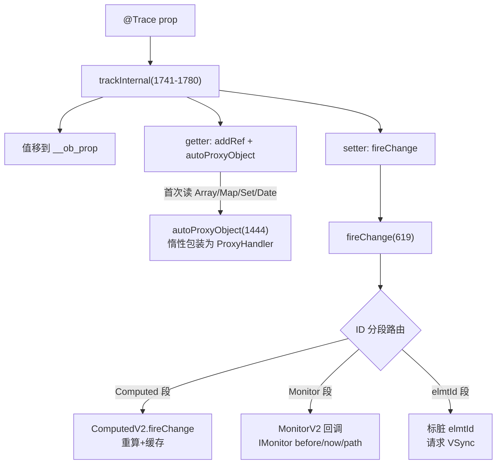

# 架构设计

> 07-02-05 状态管理V2数据对象内状态管理功能域的架构设计文档，补录已有实现。本域覆盖 V2 数据对象级的可观察与计算/监听能力：`@ObservedV2`/`@Trace`（getter/setter 响应式安装 + 惰性集合代理，含 `@Type` 序列化标记）、`@Computed`（惰性求值 + 缓存只读计算属性）、`@Monitor`/`@SyncMonitor`（路径感知变化监听，IMonitor before/now/path）。核心机制委托 07-02-04 V2 组件内的 `ObserveV2` 单例与 `trackInternal`。

## 设计元数据

| 字段 | 内容 |
|------|------|
| Design ID | DESIGN-Func-07-02-05 |
| 关联需求 | 已有能力补录（无独立 requirement.md） |
| 关联 Epic | 无 |
| 目标 Feature | Feat-01 @ObservedV2/@Trace 可观察数据模型（含 @Type）, Feat-02 @Computed/@Monitor/@SyncMonitor 计算与监听 |
| 复杂度 | 高 |
| 目标版本 | @ObservedV2/@Trace/@Computed/@Monitor/@Type API 12 起；@SyncMonitor API 23 起；@Monitor 通配符 API 26 起 |
| Owner | ArkUI SIG |
| 状态 | Baselined |
| FuncID | 07-02-05 |
| 源码根 | `frameworks/bridge/declarative_frontend/state_mgmt/src/lib/v2/v2_computed.ts` + `v2/v2_monitor.ts` + `v2/v2_decorators.ts` + `v2/v2_data_coder/json_coder.ts` |
| SDK 声明 | `interface/sdk-js/api/@internal/component/ets/common.d.ts`（@ObservedV2/@Trace/@Computed/@Monitor） |
| 测试入口 | `frameworks/bridge/declarative_frontend/state_mgmt/test/unittest/entry/src/main/v2_tests/` |
| 前置依赖 | 07-02-04（ObserveV2 单例 / trackInternal / fireChange ID 分段路由） |
| 下游影响 | 07-02-06（PersistenceV2 使用 @Type 序列化标记） |
| 关键错误码 | 130001（@SyncMonitor 路径非法） |

## 需求基线

| 字段 | 内容 |
|------|------|
| 问题陈述 | V1 @Observed/@Track 仅一层观测需逐层 @ObjectLink 拆解；V1 @Watch 仅变量名级监听无前后值。V2 需要更细粒度的数据对象观测（getter/setter + 深度路径）与计算/监听能力 |
| 核心目标 | 提供 V2 数据对象级可观察（@ObservedV2/@Trace）、计算属性（@Computed）、路径感知监听（@Monitor/@SyncMonitor） |
| P1 AC | Feat-01~02 全量 AC |

## 上下文和现状

### 涉及仓和模块

| 仓库 | 模块路径 | 当前职责 | 本 Feature 影响 |
|------|----------|----------|-----------------|
| ace_engine | `v2/v2_decorators.ts` | @ObservedV2(39)/@Trace(53)/@Computed(366)/@Monitor(259)/@SyncMonitor(312)/@Type 相关装饰器工厂 | 全量涉及 |
| ace_engine | `v2/v2_decorated_variables.ts` | `observedV2Internal`(324-357) 5 步构造、`VariableUtilV2`(24-86) | Feat-01 |
| ace_engine | `v2/v2_computed.ts` | `ComputedV2`(31-161) 惰性求值 + 缓存（`MIN_COMPUTED_ID=0x1000000000`） | Feat-02 |
| ace_engine | `v2/v2_monitor.ts` | `MonitorV2`(189-574)/`MonitorValueV2`(59-188)/`MonitorPathHelper`(26--57) 路径遍历 | Feat-02 |
| ace_engine | `v2/v2_change_observation.ts` | `trackInternal`(1741-1780) getter/setter 安装 + `ObserveV2` 单例（跨域 07-02-04 Feat-01） | Feat-01 协同 |
| ace_engine | `v2/v2_data_coder/json_coder.ts` | `Meta`(31-70)/`__Type__`(72) @Type 元信息 + `JSONCoder`(138-493) | Feat-01 协同 |

### 调用链层级分析

| 层 | 模块 | 职责 | 修改类型 |
|----|------|------|----------|
| 1. SDK 层 | `interface/sdk-js/api/@internal/component/ets/common.d.ts` | @ObservedV2/@Trace/@Computed/@Monitor/@SyncMonitor/@Type 声明 | 存量分析 |
| 2. 编译期 | ArkTS 编译器 | @Trace → 调 `trackInternal`；@Computed → `ComputedV2`；@Monitor → `MonitorV2` | 存量分析 |
| 3. 响应式安装层 | `v2_change_observation.ts` `trackInternal`(1741) | 值移到 `__ob_<prop>`，装 getter（addRef+autoProxyObject）/ setter（fireChange） | 跨域（07-02-04） |
| 4. 计算属性层 | `v2_computed.ts` `ComputedV2`(31-161) | `InitRun` 重定义属性 + `observeObjectAccess` 收集依赖 + 缓存到 `___comp_cached_<prop>` | 存量分析 |
| 5. 监听层 | `v2_monitor.ts` `MonitorV2` | `analysisProp`(520) 点分路径逐层 addRef + IMonitor(before/now/path) | 存量分析 |

### 适用架构规则

| Rule ID | 适用原因 | 设计结论 | 验证方式 |
|---------|----------|----------|----------|
| OH-ARCH-LAYERING | 数据对象跨 SDK → 编译期 → 响应式安装 → 计算 → 监听共 5 层 | trackInternal 共享安装；@Computed/@Monitor 独立 ID 段路由 | 代码评审 |
| OH-ARCH-API-LEVEL | 核心装饰器 API 12、@SyncMonitor API 23、通配符 API 26 | 各装饰器标注 @since | API 评审 |

## 不涉及项承接

| 维度 | 结论 |
|------|------|
| V2 组件级状态变量 | 承接 — @Local/@Param/@Once/@Event/@Provider/@Consumer/@ComponentV2 归 07-02-04 |
| ObserveV2 核心机制 | 承接 — trackInternal/autoProxyObject/fireChange/ID 分段/WeakRefPool GC 归 07-02-04 Feat-01 |
| V2 应用存储 | 承接 — AppStorageV2/PersistenceV2 归 07-02-06 |
| UIUtils addMonitor | 承接 — 命令式动态监听归 07-02-07 |

## 关键设计决策

### ADR 概览

| 决策 ID | 问题 | 选择方案 | 影响 |
|---------|------|----------|------|
| ADR-1 | 响应式安装方式 | @Trace 委托 trackInternal getter/setter + 深度观测无需 @ObjectLink | Feat-01 |
| ADR-2 | @Computed 实现 | ComputedV2 惰性求值 + 缓存 + 不支持 setter | Feat-02 |
| ADR-3 | @Monitor 路径监听 | MonitorV2.analysisProp 点分路径逐层 addRef + IMonitor 异步合并 | Feat-02 |
| ADR-4 | @SyncMonitor 同步变体 | API 23+ fireChange 调用栈内同步立即执行 | Feat-02 |
| ADR-5 | @Type 序列化标记 | Meta WeakMap 原型链继承，服务 PersistenceV2 | Feat-01 |

### ADR-1: 响应式安装 — @Trace 委托 trackInternal

**问题背景**：V2 数据对象需要 getter/setter 响应式安装。V1 @Observed 用 ES6 Proxy 包装；V2 改用直接在原生数据上装 getter/setter。

**选型推理**：@Trace 委托 `trackInternal`（07-02-04 Feat-01）——值移到 `__ob_<prop>` 后备存储，原属性装 getter（调 `addRef` 收集依赖 + `autoProxyObject` 惰性包装集合类型）与 setter（调 `fireChange` 按 ID 分段路由）。嵌套类需每层 @ObservedV2+@Trace（V2 无需 V1 的逐层 @ObjectLink 拆层）。每层 @Trace getter 逐层调 addRef 建立深度依赖链。@Trace 使用严格 `!==` 比较（V1 用 `===` 反向判断）。

### ADR-2: @Computed — 惰性求值 + 缓存

**问题背景**：派生状态（如 `fullName = firstName + lastName`）需要自动随依赖变化重新计算，且不应冗余计算。

**关键权衡**：
- 每次访问重算：简单但性能差
- 惰性求值 + 缓存：依赖变化时标记 dirty，下次访问时重算并缓存——性能好

**选型推理**：`ComputedV2`(31-161) 惰性求值 + 缓存。`InitRun`(59) 重定义属性为 getter/setter；`observeObjectAccess`(105) 在 `startRecordDependencies` 下跑 getter 收集依赖；结果缓存到 `___comp_cached_<prop>`。`fireChange`(79) 仅结果 `===` 变化才通知。不支持 setter（`InitRun` setter 抛错）保证只读。@Computed 应为纯函数——在 getter 内修改参与计算的属性会导致循环 → appfreeze。@Computed ID 段 `MIN_COMPUTED_ID=0x1000000000`。

### ADR-3: @Monitor — 路径感知异步监听

**问题背景**：V1 @Watch 仅监听变量名（任意属性变化都触发），无前后值。V2 需要路径级精确监听 + before/now 前后值。

**选型推理**：`MonitorV2.analysisProp`(520) 点分路径逐层 `addRef`（如 `obj.a.b` 逐层注册依赖）。每层注册 MonitorV2 ID。回调参数 `IMonitor`：`dirty: Array<string>`（变化路径数组）+ `value<T>(path?): IMonitorValue`（before/now/path）。@Monitor 异步执行——事件处理程序结束后才执行；一次事件中多次变化只触发一次（初始值 vs 最终值 `===` 判断）。通配符 `.*`（API 26+）创建两个 MonitorValueV2（Last Sure + Wildcard），支持监听 Array/Map/Set/Date API 调用。

### ADR-4: @SyncMonitor 同步变体（API 23+）

**问题背景**：@Monitor 异步合并在某些场景（如数据校验）不够及时——需要同步立即执行。

**选型推理**：@SyncMonitor（API 23+）在 fireChange 调用栈内同步立即执行；同一事件中每次属性变化都触发回调（与 @Monitor 异步合并不同）。路径中可使用通配符 `*`（一层模糊监听）。`MIN_SYNC_MONITOR_OR_SYNC_API_ID` 段区分同步执行。不建议在 @SyncMonitor 内修改被监听属性（无限循环）。

### ADR-5: @Type 序列化标记

**问题背景**：PersistenceV2 序列化 @ObservedV2 class 时，嵌套对象的类型信息会丢失（JSON.stringify/parse 不保持原型链）。

**选型推理**：`@Type` 装饰 @ObservedV2 类属性，`__Type__`(`json_coder.ts:72`) 注册到 `Meta`(31-70) WeakMap（原型链继承）。PersistenceV2 的 `DataCoder.restoreTo` 将解析数据恢复到已有 @ObservedV2 实例，保持原型链。嵌套对象缺 @Type 抛 `PERSISTENCE_V2_LACK_TYPE`。@Type 仅支持自定义 class 类型。

## 设计骨架

| Task ID | 目标 | 受影响文件 | AC |
|---------|------|------------|-----|
| Feat-01 | @ObservedV2/@Trace（5 步构造、深度观测、内置类型 API）+ @Type 序列化标记 | `v2_decorators.ts`、`v2_decorated_variables.ts`、`json_coder.ts` | AC-1.1~AC-5.5 |
| Feat-02 | @Computed（惰性求值+缓存）+ @Monitor/@SyncMonitor（路径遍历、异步/同步、通配符） | `v2_computed.ts`、`v2_monitor.ts` | AC-1.1~AC-5.5 |

## 后续 Task 拆分

| Spec | 目的 | 依赖 | 输出 |
|------|------|------|------|
| 无后续 Task | 已有实现补录 | — | 各 Feature 详细规格见 `Feat-NN-*-spec.md` |

## API 签名、Kit 与权限

### 新增 API

| API 签名 | 类型 | 功能描述 | 关联 Feat |
|----------|------|----------|----------|
| （已有实现补录，API 通过 ArkTS 装饰器语法或 `@ohos.arkui.StateManagement` 模块暴露，具体签名见各 Feature spec） | Public | 各装饰器/API 的完整签名、@since、开放范围见各 Feature spec 的「核心类与机制清单」和「兼容性声明」 | Feat-01~NN |

### 变更/废弃 API

无变更。

### Kit

无独立 Kit，归属于 ArkUI ArkTS 声明式范式（`SystemCapability.ArkUI.ArkUI.Full`）。

### 权限要求

无权限要求。

## 构建系统影响

### BUILD.gn 变更

无变更。状态管理 TS 库编译为单一 `stateMgmt.abc` 字节码（debug/release/profile 三种构建产物），由引擎初始化时载入。构建配置见 `frameworks/bridge/declarative_frontend/state_mgmt/BUILD.gn`。

### bundle.json 变更

无变更。

## 可选设计扩展

### V2 数据对象响应式安装流程

### @Computed 惰性求值数据流

1. `@Computed get fullName(): string { return this.firstName + this.lastName }` 声明
2. `ComputedV2.InitRun` 重定义 `fullName` 属性
3. 首次访问 `fullName`：`observeObjectAccess` 在 `startRecordDependencies` 下执行 getter
4. getter 读取 `this.firstName` → `addRef` 记录 ComputedV2 ID 依赖 firstName
5. getter 读取 `this.lastName` → `addRef` 记录 ComputedV2 ID 依赖 lastName
6. 结果缓存到 `___comp_cached_fullName`
7. 后续 `firstName` 变化 → `fireChange` → Computed 段路由 → 标记 `fullName` dirty
8. 下次访问 `fullName`：重算 getter，结果 `===` 变化才通知依赖

## 详细设计

各 Feature 的详细规格见对应的 `Feat-NN-*-spec.md`。

## 风险和开放问题

| 项 | 类型 | 影响 | 处理方式 | Owner |
|----|------|------|----------|-------|
| @Computed getter 副作用 | 健壮性 | 中 | 应为纯函数；在 getter 内修改参与计算的属性导致循环 → appfreeze | ArkUI SIG |
| @Monitor 路径不存在 | 健壮性 | 低 | analysisProp 返回 MONITOR_PATH_NOT_FOUND | ArkUI SIG |
| @Trace 不在 @ObservedV2 中 | 健壮性 | 低 | 缺 GC 清理、@Computed/@Monitor 构造、ID_REFS 优化 | ArkUI SIG |
| @Computed 不支持 setter | 功能 | 低 | InitRun setter 抛错；计算属性只读 | ArkUI SIG |

## 设计审批

- [x] 需求基线已确认
- [x] 不涉及项已承接（V2 组件级/核心机制/应用存储/辅助接口分别归 07-02-04/06/07）
- [x] 涉及仓和模块职责清楚
- [x] 调用链层级分析完整（5 层）
- [x] 关键设计决策有理由（5 个 ADR 含深入分析）
- [x] 风险和开放问题有 Owner

**结论:** Baselined（已有实现补录）.
