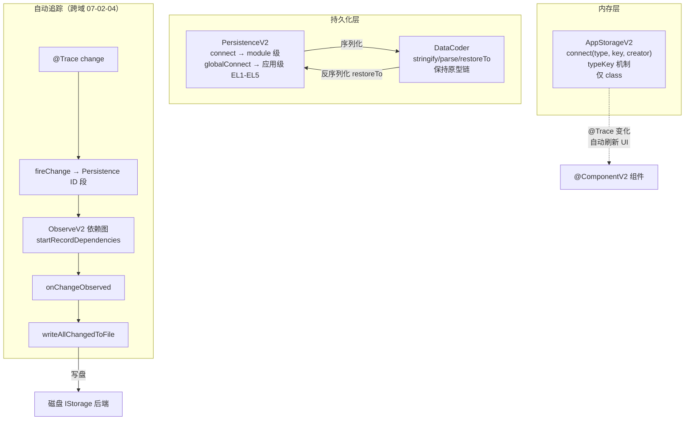

# 架构设计

> 07-02-06 状态管理V2应用内状态管理功能域的架构设计文档，补录已有实现。本域覆盖 V2 应用级状态承载与持久化：`AppStorageV2`（内存全局存储，仅 class 类型，typeKey 机制，`@Trace` 属性自动刷新）、`PersistenceV2`（磁盘持久化，可配置 `IStorage` 后端，`ObserveV2` 依赖图自动追踪 `@Trace` 变化，`DataCoder` 保持原型链序列化）。`PersistenceV2.globalConnect`（API 18+）支持应用级存储路径与 EL1-EL5 加密级别。

## 设计元数据

| 字段 | 内容 |
|------|------|
| Design ID | DESIGN-Func-07-02-06 |
| 关联需求 | 已有能力补录（无独立 requirement.md） |
| 关联 Epic | 无 |
| 目标 Feature | Feat-01 AppStorageV2 内存全局存储, Feat-02 PersistenceV2 磁盘持久化与 @Type/DataCoder |
| 复杂度 | 高 |
| 目标版本 | AppStorageV2/PersistenceV2.connect/remove/keys/save/notifyOnError API 12 起；PersistenceV2.globalConnect API 18 起；集合类型重载/错误码 140105/140106 API 23 起；PersistenceErrorCallback.oldValue API 26 起 |
| Owner | ArkUI SIG |
| 状态 | Baselined |
| FuncID | 07-02-06 |
| 源码根 | `frameworks/bridge/declarative_frontend/state_mgmt/src/lib/sdk/v2_persistence.ts` + `v2/v2_data_coder/` |
| SDK 声明 | `interface/sdk-js/api/arkui/@ohos.arkui.StateManagement.d.ts`（AppStorageV2/PersistenceV2） |
| 测试入口 | `frameworks/bridge/declarative_frontend/state_mgmt/test/unittest/entry/src/main/v2_tests/` |
| 前置依赖 | 07-02-04（ObserveV2 依赖图自动追踪 @Trace 变化）+ 07-02-05（@Type 序列化标记 / DataCoder） |
| 下游影响 | 无（V2 应用存储是顶层消费方） |
| 关键错误码 | 140103（非 class 类型）、140104（defaultCreator 非 function）、140105（connect/globalConnect 同 key）、140106（areaMode 越界）、140107（类型不匹配）、140108（缺 @Type）、140116（key 非法） |

## 需求基线

| 字段 | 内容 |
|------|------|
| 问题陈述 | V1 AppStorage/PersistentStorage 存在：不支持嵌套对象自动持久化、module 级路径歧义、与 AppStorage 强耦合等问题。V2 需要解耦的、支持自动追踪的、保持原型链的应用级存储 |
| 核心目标 | 提供 V2 应用级存储完整能力：内存全局存储（AppStorageV2）、磁盘持久化（PersistenceV2）、DataCoder 序列化、globalConnect 应用级路径 |
| P1 AC | Feat-01~02 全量 AC |

## 上下文和现状

### 涉及仓和模块

| 仓库 | 模块路径 | 当前职责 | 本 Feature 影响 |
|------|----------|----------|-----------------|
| ace_engine | `sdk/v2_persistence.ts` | `StorageHelper`(70-165) 基类 / `AppStorageV2Impl`(167-277) 单例 / `PersistenceV2Impl`(279-913) 单例 | 全量涉及 |
| ace_engine | `v2/v2_data_coder/data_coder.ts` | `DataCoder`(21-380) stringify/parse/restoreTo JSON2 序列化（保持原型链） | Feat-02 协同 |
| ace_engine | `v2/v2_data_coder/json_coder.ts` | `JSONCoder`(138-493) / `Meta`(31-70) / `__Type__`(72) @Type 元信息 | Feat-02 协同 |
| ace_engine | `v2/v2_change_observation.ts` | `ObserveV2` 单例：Persistence ID 段路由（`MIN_PERSISTENCE_ID`）→ `onChangeObserved` → `writeAllChangedToFile` | 跨域（07-02-04） |

### 调用链层级分析

| 层 | 模块 | 职责 | 修改类型 |
|----|------|------|----------|
| 1. SDK 层 | `@ohos.arkui.StateManagement.d.ts` | AppStorageV2/PersistenceV2/connect/globalConnect/save 声明 | 存量分析 |
| 2. 存储基类 | `v2_persistence.ts` `StorageHelper`(70-165) | key 校验 `isKeyValid`、类型校验 `throwIfTypeNameMismatch` | 存量分析 |
| 3. AppStorageV2 | `AppStorageV2Impl`(167-277) | connect（typeKey 机制）/remove/keys 内存全局存储 | 存量分析 |
| 4. PersistenceV2 | `PersistenceV2Impl`(279-913) | connect（module 级）/globalConnect（应用级 EL1-EL5）/save/notifyOnError | 存量分析 |
| 5. 自动持久化 | `ObserveV2` Persistence ID 段 → `onChangeObserved`(566) → `writeAllChangedToFile`(762-793) | @Trace change → fireChange → Persistence 段路由 → 自动写盘 | 跨域（07-02-04） |
| 6. 序列化层 | `DataCoder`/`JSONCoder` | stringify（保持 @Type/@Trace 元信息）→ parse → restoreTo（恢复到已有 @ObservedV2 实例） | 存量分析 |

### 适用架构规则

| Rule ID | 适用原因 | 设计结论 | 验证方式 |
|---------|----------|----------|----------|
| OH-ARCH-LAYERING | 存储跨 SDK → 基类 → AppStorageV2/PersistenceV2 → 自动持久化 → 序列化共 6 层 | ObserveV2 依赖图自动追踪；DataCoder 保持原型链 | 代码评审 |
| OH-ARCH-API-LEVEL | connect API 12、globalConnect API 18、集合类型/错误码 API 23、oldValue API 26 | 各 API 标注 @since | API 评审 |

## 不涉及项承接

| 维度 | 结论 |
|------|------|
| V2 组件级状态变量 | 承接 — @Local/@Param/@Once/@Event/@Provider/@Consumer 归 07-02-04 |
| V2 数据对象观测 | 承接 — @ObservedV2/@Trace/@Type/@Computed/@Monitor 归 07-02-05 |
| ObserveV2 核心机制 | 承接 — trackInternal/fireChange/ID 分段（Persistence ID 段）归 07-02-04 Feat-01 |
| V1 应用存储 | 承接 — LocalStorage/AppStorage/PersistentStorage/Environment 归 07-02-03 |
| UIUtils | 承接 — 命令式工具 API 归 07-02-07 |

## 关键设计决策

### ADR 概览

| 决策 ID | 问题 | 选择方案 | 影响 |
|---------|------|----------|------|
| ADR-1 | AppStorageV2 类型约束 | 仅 class 类型 + typeKey 机制 + @Trace 自动刷新 | Feat-01 |
| ADR-2 | PersistenceV2 自动持久化 | ObserveV2 依赖图自动追踪 @Trace 变化 | Feat-02 |
| ADR-3 | DataCoder 保持原型链 | restoreTo 恢复到已有 @ObservedV2 实例 | Feat-02 |
| ADR-4 | module 级 vs 应用级路径 | connect module 级 / globalConnect 应用级 EL1-EL5 | Feat-02 |
| ADR-5 | API 23 集合类型增强 | globalConnect 集合重载 + 循环引用 + @Sendable | Feat-02 |

### ADR-1: AppStorageV2 — 仅 class + typeKey

**问题背景**：AppStorageV2 需要全局存储 V2 状态对象。如何保证类型安全和自动刷新？

**选型推理**：仅支持 class 类型（typeKey 机制——未指定 key 用 type 的 name）。@Trace 属性变化自动触发 UI 刷新（经 ObserveV2 依赖图）；非 @Trace 不刷新。不支持基本类型/Native 类型/collections.Set/Map/UIContext 隔离。与 AppStorage 数据互不共享。

### ADR-2: PersistenceV2 自动持久化

**问题背景**：V1 PersistentStorage 需要手动 persistProp 且不支持嵌套对象自动持久化。V2 如何改进？

**关键权衡**：
- 手动 save：开发者决定何时写盘——灵活但易遗漏
- 自动追踪：ObserveV2 依赖图自动追踪 @Trace 变化——无感知但需注册依赖

**选型推理**：经 ObserveV2 依赖图自动追踪。connect 时 `startRecordDependencies`/`stopRecordDependencies` 注册依赖图；@Trace change → `fireChange` → Persistence ID 段路由（`MIN_PERSISTENCE_ID`）→ `onChangeObserved`(566) → `writeAllChangedToFile`(762-793) 自动写盘。非 @Trace 属性需手动 `save`。defaultCreator 仅首次 connect（内存+磁盘都不存在）调用。

### ADR-3: DataCoder 保持原型链

**问题背景**：JSON.stringify/parse 不保持原型链——序列化后反序列化的对象丢失 class 类型信息。

**选型推理**：`DataCoder.restoreTo`(63-) 将解析数据恢复到**已有 @ObservedV2 实例**（区别于 JSON.parse 创建新对象）。嵌套对象缺 @Type 抛 `PERSISTENCE_V2_LACK_TYPE`。`DataCoder.stringify`(33-51) 序列化到 JSON2 格式（`FORMAT_TAG='JSON2'`），保持 @Type/@Trace 元信息。

### ADR-4: module 级 vs 应用级路径

**问题背景**：V1 PersistentStorage 的 module 级路径有歧义（多 module 同 key 数据归属不明）。V2 需要更清晰的路径分离。

**选型推理**：connect 存 module 级路径；globalConnect（API 18+）存应用级路径（EL1-EL5 加密级别，默认 EL2，EL5 需 `ohos.permission.PROTECT_SCREEN_LOCK_DATA`）。同一 key 不同加密级别以第一次为准。不建议混用，同 key crash；API 23+ 返回错误码 140105。areaMode 越界 crash；API 23+ 返回 140106。

### ADR-5: API 23 集合类型增强

**问题背景**：PersistenceV2 最初仅支持 class 类型持久化，不支持集合类型（Array/Map/Set）和循环引用。

**选型推理**：API 23+ globalConnect 集合类型重载支持 Array/Map/Set/collections.Array/Map/Set、@Sendable class（成员须 string/number/boolean）、循环引用、解除单 key ≤8k 限制。`Array<ClassA>` 必须同时提供 `defaultCreator` 和 `defaultSubCreator`，且需 `UIUtils.makeObserved` 包装返回值。不支持多层嵌套集合。

## 设计骨架

| Task ID | 目标 | 受影响文件 | AC |
|---------|------|------------|-----|
| Feat-01 | AppStorageV2 connect typeKey / remove / keys / 错误码 | `sdk/v2_persistence.ts:167-277` | AC-1.1~AC-4.4 |
| Feat-02 | PersistenceV2 connect/globalConnect EL1-EL5 / save / DataCoder / 错误码 | `sdk/v2_persistence.ts:279-913`、`v2/v2_data_coder/` | AC-1.1~AC-6.6 |

## 后续 Task 拆分

| Spec | 目的 | 依赖 | 输出 |
|------|------|------|------|
| 无后续 Task | 已有实现补录 | — | 各 Feature 详细规格见 `Feat-NN-*-spec.md` |

## API 签名、Kit 与权限

### 新增 API

| API 签名 | 类型 | 功能描述 | 关联 Feat |
|----------|------|----------|----------|
| （已有实现补录，API 通过 ArkTS 装饰器语法或 `@ohos.arkui.StateManagement` 模块暴露，具体签名见各 Feature spec） | Public | 各装饰器/API 的完整签名、@since、开放范围见各 Feature spec 的「核心类与机制清单」和「兼容性声明」 | Feat-01~NN |

### 变更/废弃 API

无变更。

### Kit

无独立 Kit，归属于 ArkUI ArkTS 声明式范式（`SystemCapability.ArkUI.ArkUI.Full`）。

### 权限要求

无权限要求。

## 构建系统影响

### BUILD.gn 变更

无变更。状态管理 TS 库编译为单一 `stateMgmt.abc` 字节码（debug/release/profile 三种构建产物），由引擎初始化时载入。构建配置见 `frameworks/bridge/declarative_frontend/state_mgmt/BUILD.gn`。

### bundle.json 变更

无变更。

## 可选设计扩展

### V2 存储架构图

### PersistenceV2 自动持久化数据流

1. `PersistenceV2.connect<T>(type, key, creator)` → 分配 PersistenceV2 ID → `startRecordDependencies` 注册依赖图
2. 返回内存中 class 实例（首次用 `defaultCreator` 创建，非首次从磁盘 `getValueFromDisk` 恢复）
3. 用户修改 `@Trace` 属性 → setter 调 `fireChange`
4. `fireChange` 按 ID 分段路由 → Persistence ID 段（`>= MIN_PERSISTENCE_ID`）→ `onChangeObserved`(566)
5. `onChangeObserved` → `writeAllChangedToFile`(762-793) → `DataCoder.stringify` 序列化 → `IStorage.write()` 写盘
6. 应用退出再启动 → `connect` → `getValueFromDisk`(689-740) → `DataCoder.parse` → `restoreTo` 恢复到已有实例

## 详细设计

各 Feature 的详细规格见对应的 `Feat-NN-*-spec.md`。

## 风险和开放问题

| 项 | 类型 | 影响 | 处理方式 | Owner |
|----|------|------|----------|-------|
| connect/globalConnect 混用 | 兼容性 | 高 | 同 key 混用 crash；API 23+ 返回 140105 | ArkUI SIG |
| @Computed 禁止 | 健壮性 | 中 | 被 connect 的类中不允许 @Computed（只读属性导致反序列化失败） | ArkUI SIG |
| 不支持类型清单 | 功能 | 中 | WeakSet/WeakMap/Boolean/Number/String/Symbol/BigInt/RegExp/Function/Promise/ArrayBuffer | ArkUI SIG |
| EL5 权限 | 兼容性 | 低 | 需 module.json 配置 PROTECT_SCREEN_LOCK_DATA | ArkUI SIG |
| Array&lt;ClassA&gt; 需 makeObserved | 健壮性 | 中 | 持久化 Array&lt;ClassA&gt; 必须用 UIUtils.makeObserved 包装返回值 | ArkUI SIG |

## 设计审批

- [x] 需求基线已确认
- [x] 不涉及项已承接（V2 组件级/数据对象/核心机制/V1 存储/辅助接口分别归 07-02-04/05/03/07）
- [x] 涉及仓和模块职责清楚
- [x] 调用链层级分析完整（6 层）
- [x] 关键设计决策有理由（5 个 ADR 含深入分析）
- [x] 风险和开放问题有 Owner

**结论:** Baselined（已有实现补录）.
