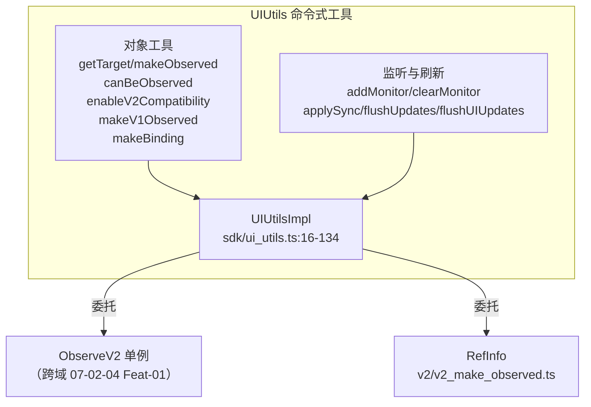

# 架构设计

> 07-02-07 状态管理辅助接口功能域的架构设计文档，补录已有实现。本域覆盖 `@ohos.arkui.StateManagement` 模块导出的 `UIUtils` 工具类与 `ObservedUtil` 检测工具：对象工具（`getTarget`/`makeObserved`/`canBeObserved`/`enableV2Compatibility`/`makeV1Observed`/`makeBinding`）、动态监听（`addMonitor`/`clearMonitor`）、同步刷新（`applySync`/`flushUpdates`/`flushUIUpdates`）。这些是 V1/V2 装饰器体系之外、面向开发者的命令式工具 API，服务于对象代理还原、可观察性检测、V1/V2 混用桥接、动态监听注册、以及与 `animateTo` 等同步场景的协调。

## 设计元数据

| 字段 | 内容 |
|------|------|
| Design ID | DESIGN-Func-07-02-07 |
| 关联需求 | 已有能力补录（无独立 requirement.md） |
| 关联 Epic | 无 |
| 目标 Feature | Feat-01 UIUtils 对象工具, Feat-02 UIUtils 监听与同步刷新 |
| 复杂度 | 中 |
| 目标版本 | getTarget/makeObserved API 12 起；enableV2Compatibility/makeV1Observed API 19 起；makeBinding/addMonitor/clearMonitor API 20 起；applySync/flushUpdates/flushUIUpdates API 22 起；canBeObserved API 23 起；enableWildcard API 26 起 |
| Owner | ArkUI SIG |
| 状态 | Baselined |
| FuncID | 07-02-07 |
| 源码根 | `frameworks/bridge/declarative_frontend/state_mgmt/src/lib/sdk/ui_utils.ts`（UIUtilsImpl）+ `sdk/observed_util.ts`（ObservedUtil）+ `v2/v2_make_observed.ts`（RefInfo） |
| SDK 声明 | `interface/sdk-js/api/arkui/@ohos.arkui.StateManagement.d.ts`（UIUtils / ObservedUtil） |
| 测试入口 | `frameworks/bridge/declarative_frontend/state_mgmt/test/unittest/entry/src/main/common_tests/` + `v2_tests/` |
| 前置依赖 | 07-02-04（ObserveV2 applySync/flushUpdates/flushUIUpdates / AddMonitorPath） |
| 下游影响 | 无（命令式工具 API 是顶层消费方） |
| 关键错误码 | 130000-130002（addMonitor/clearMonitor）、140001（@Computed 内调 applySync）、140002（@Monitor 内调 flushUpdates） |

## 需求基线

| 字段 | 内容 |
|------|------|
| 问题陈述 | V1/V2 装饰器体系是声明式的，但开发者还需要命令式工具 API：还原代理对象、将普通对象变为可观察、检测对象可观察性、桥接 V1/V2 混用、动态注册监听、以及与 `animateTo` 等同步刷新场景协调 |
| 核心目标 | 提供 `UIUtils` 与 `ObservedUtil` 完整能力，固化对象工具、动态监听、同步刷新的行为规格与错误码（130000-130002/140001/140002） |
| P0 AC | Feat-01/02 全量 AC |

## 上下文和现状

### 涉及仓和模块

| 仓库 | 模块路径 | 当前职责 | 本 Feature 影响 |
|------|----------|----------|-----------------|
| ace_engine | `sdk/ui_utils.ts` | `UIUtilsImpl`(16-134)：getTarget(23)/makeObserved(39)/canBeObserved(19)/enableV2Compatibility(50)/makeV1Observed(45)/makeBinding(57-62)/addMonitor(64)/clearMonitor(84)/applySync(104)/flushUpdates(108)/flushUIUpdates(112) | 全量涉及 |
| ace_engine | `sdk/observed_util.ts` | `ObservedUtil`(120-372)：canBeObserved(121) 检测顺序 V2→makeObserved→V2Proxy→V1 | Feat-01 协同 |
| ace_engine | `v2/v2_make_observed.ts` | `RefInfo`(16-46)：makeObserved 内部实现（`RefInfo.get`(25)） | Feat-01 协同 |
| ace_engine | `v2/v2_change_observation.ts` | `ObserveV2`：applySync(1645)/flushUpdates(1698)/flushUIUpdates(1718)/AddMonitorPath(1259)/clearMonitorPath(1327) | Feat-02 协同 |

### 调用链层级分析

| 层 | 模块 | 职责 | 修改类型 |
|----|------|------|----------|
| 1. SDK 层 | `@ohos.arkui.StateManagement.d.ts` | UIUtils/ObservedUtil 类与方法声明 | 存量分析 |
| 2. 工具层 | `sdk/ui_utils.ts` `UIUtilsImpl` | 对外工具 API 委托到内部实现 | 存量分析 |
| 3. 对象工具层 | `v2/v2_make_observed.ts` `RefInfo` / `sdk/observed_util.ts` `ObservedUtil` | makeObserved 包装 / canBeObserved 检测 | 存量分析 |
| 4. V2 桥接层 | `sdk/ui_utils.ts` enableV2Compatibility(50)/makeV1Observed(45) | V1↔V2 跨范式桥接 | 存量分析 |
| 5. 监听/刷新层 | `v2/v2_change_observation.ts` ObserveV2 | AddMonitorPath/clearMonitorPath/applySync/flushUpdates/flushUIUpdates 底层实现 | 跨域（07-02-04） |

### 适用架构规则

| Rule ID | 适用原因 | 设计结论 | 验证方式 |
|---------|----------|----------|----------|
| OH-ARCH-API-LEVEL | 12 个 API 在 API 12/19/20/22/23/26 有增量 | 各 API 标注 @since | API 评审 |
| OH-ARCH-ERROR-LOG | 错误码 130000-130002（addMonitor/clearMonitor，API 20+）、140001/140002（applySync/flushUpdates，API 22+） | 错误码在 Feat-01/02 固化 | 错误码文档对齐 |

## 不涉及项承接

| 维度 | 结论 |
|------|------|
| V1/V2 装饰器 | 承接 — @State/@Local/@Trace/@Param 等装饰器归 07-02-01/04 |
| V1/V2 应用存储 | 承接 — AppStorage/AppStorageV2/PersistenceV2 归 07-02-03/06 |
| 引擎内部基础设施 | 承接 — ConfigureStateMgmt/stateMgmtConsole/stateMgmtDFX/Profiler/SubscribableAbstract/UpdateFuncRecord 归 07-02-01 |
| elmtId 同步/GC/C++ 宿主 | 承接 — ElementRegister/UINodeRegisterProxy/WeakRefPool/CustomNode 归 07-02-01/09 |

## 关键设计决策

### ADR 概览

| 决策 ID | 问题 | 选择方案 | 影响 |
|---------|------|----------|------|
| ADR-1 | UIUtils 范围 | 命令式工具与装饰器互补 | Feat-01/02 |
| ADR-2 | getTarget 语义 | 返回代理前原始对象；修改不触发刷新 | Feat-01 |
| ADR-3 | makeObserved 范式 | V2 范式（autoProxyObject 深度观察）；不能与 V1 装饰器共用 | Feat-01 |
| ADR-4 | V1/V2 桥接 | API 19+ enableV2Compatibility（V1→V2）+ makeV1Observed（V2→V1） | Feat-01 |
| ADR-5 | 动态监听 | addMonitor/clearMonitor 复用 @Monitor 机制（非匿名函数） | Feat-02 |
| ADR-6 | 同步刷新逃生舱 | applySync/flushUpdates/flushUIUpdates 三档；@Computed/@Monitor 内禁用 | Feat-02 |

### ADR-1: UIUtils 范围 — 命令式工具与装饰器互补

**问题背景**：V1/V2 装饰器是声明式的（在编译期确定行为）。但某些场景需要运行时命令式操作（如 JSON.parse 返回的对象需要变为可观察、animateTo 前需同步刷新）。

**选型推理**：UIUtils 是命令式工具类，与装饰器互补。服务场景：getTarget（序列化/`===`比较）、makeObserved（JSON.parse 对象变可观察）、canBeObserved（调试检测）、enableV2Compatibility/makeV1Observed（V1/V2 混用桥接）、makeBinding（@Builder 参数）、addMonitor/clearMonitor（运行时动态监听）、applySync/flushUpdates/flushUIUpdates（同步刷新逃生舱）。

### ADR-2: getTarget — 返回代理前原始对象

**问题背景**：框架对 V1 @Observed class/@State 装饰对象加 Proxy；V2 @Trace/@Local 装饰的 Date/Map/Set/Array 加 Proxy。某些场景（序列化、`===` 比较、NAPI 接口）需要获取原始对象。

**选型推理**：getTarget 返回代理前的原始对象。修改返回值**不触发 UI 刷新**（脱离了框架观察）。V2 @Trace 属性名有 `__ob_` 前缀，getTarget **不剥离**该前缀，可能影响 NAPI 接口（`napi_get_property_names`/`napi_delete_property`）。

### ADR-3: makeObserved — V2 范式深度观察

**问题背景**：JSON.parse 返回的 Object、未装饰的 class、@Sendable class 等需要变为可观察对象。V1 用 @Observed Proxy；V2 用 trackInternal getter/setter。

**选型推理**：makeObserved 创建 V2 范式可观察对象（深度观察 + autoProxyObject 惰性包装集合）。不能与 V1 状态变量装饰器一起用（否则抛运行时异常）。防双重代理（已是 @ObservedV2/@Observed/makeObserved 包装则直接返回入参）。V1 场景用 makeV1Observed。makeObserved 仅对入参对象本身深度观察；对状态变量重新赋值为非 makeObserved 数据则失去观察能力。

### ADR-4: V1/V2 桥接 — enableV2Compatibility + makeV1Observed

**问题背景**：V1 和 V2 范式不同（属性包装对象 vs getter/setter）。API 19 前严格隔离（复杂类型跨范式传递编译报错）。API 19+ 需要桥接 API 支持渐进迁移。

**选型推理**：`enableV2Compatibility`（API 19+）使 V1 状态变量在 @ComponentV2 中可观察——递归遍历 class 属性/Array/Set/Map 子项直至遇到非 V1 状态变量。仅作用于 V1 状态变量，不支持 @ObservedV2/makeObserved 返回值。`makeV1Observed`（API 19+）将不可观察对象包装成 V1 可观察对象（能力等同 @Observed），返回值可初始化 @ObjectLink。不支持 collections/@Sendable/V2 数据；不递归。

### ADR-5: 动态监听 — addMonitor/clearMonitor

**问题背景**：@Monitor 是声明式的（编译期确定监听路径）。运行时需要按需动态添加/取消监听。

**选型推理**：addMonitor/clearMonitor（API 20+）复用 @Monitor 机制（路径遍历 + IMonitor before/now/path）。target 仅 @ComponentV2/@ObservedV2（含 @Trace）实例。必须传非匿名 function（用 `monitorFunc.name` 作 key）。`MonitorOptions.isSynchronous` 行为同 @SyncMonitor；`enableWildcard`（API 26+）支持通配符。clearMonitor 仅管理 addMonitor 添加的监听，不能删除 @Monitor 装饰器回调。

### ADR-6: 同步刷新逃生舱 — applySync/flushUpdates/flushUIUpdates

**问题背景**：V2 状态变量修改后不立即标脏，而是抛 Promise 微任务异步调度。与 animateTo 立即刷新已标脏节点的逻辑冲突——animateTo 前的状态修改可能尚未生效。

**选型推理**：三档同步刷新。`applySync(task)`（API 22+）同步刷新闭包内的修改（含 @Computed/@Monitor/UI）。`flushUpdates()` 同步刷新调用前所有修改（含 Computed/Monitor/UI）。`flushUIUpdates()` 仅同步标脏 UI 节点（不执行 Computed/Monitor）。在 @Computed getter 内调用抛 140001；在 @Monitor 回调内调 flushUpdates/flushUIUpdates 抛 140002。applySync 嵌套被跳过返回 undefined。

## 设计骨架

| Task ID | 目标 | 受影响文件 | AC |
|---------|------|------------|-----|
| Feat-01 | getTarget/makeObserved/canBeObserved/enableV2Compatibility/makeV1Observed/makeBinding + ObservedUtil | `sdk/ui_utils.ts`、`sdk/observed_util.ts`、`v2/v2_make_observed.ts` | AC-1.1~AC-6.4 |
| Feat-02 | addMonitor/clearMonitor + applySync/flushUpdates/flushUIUpdates + 错误码 | `sdk/ui_utils.ts`、`v2/v2_change_observation.ts` | AC-1.1~AC-5.5 |

## 后续 Task 拆分

| Spec | 目的 | 依赖 | 输出 |
|------|------|------|------|
| 无后续 Task | 已有实现补录 | — | 各 Feature 详细规格见 `Feat-NN-*-spec.md` |

## API 签名、Kit 与权限

### 新增 API

| API 签名 | 类型 | 功能描述 | 关联 Feat |
|----------|------|----------|----------|
| （已有实现补录，API 通过 ArkTS 装饰器语法或 `@ohos.arkui.StateManagement` 模块暴露，具体签名见各 Feature spec） | Public | 各装饰器/API 的完整签名、@since、开放范围见各 Feature spec 的「核心类与机制清单」和「兼容性声明」 | Feat-01~NN |

### 变更/废弃 API

无变更。

### Kit

无独立 Kit，归属于 ArkUI ArkTS 声明式范式（`SystemCapability.ArkUI.ArkUI.Full`）。

### 权限要求

无权限要求。

## 构建系统影响

### BUILD.gn 变更

无变更。状态管理 TS 库编译为单一 `stateMgmt.abc` 字节码（debug/release/profile 三种构建产物），由引擎初始化时载入。构建配置见 `frameworks/bridge/declarative_frontend/state_mgmt/BUILD.gn`。

### bundle.json 变更

无变更。

## 详细设计

各 Feature 的详细规格见对应的 `Feat-NN-*-spec.md`。

## 可选设计扩展

### 架构图

## 风险和开放问题

| 项 | 类型 | 影响 | 处理方式 | Owner |
|----|------|------|----------|-------|
| makeObserved 与 V1 装饰器冲突 | 兼容性 | 中 | makeObserved 不能与 V1 状态变量装饰器一起用；用 makeV1Observed | ArkUI SIG |
| getTarget 不剥离 `__ob_` 前缀 | 兼容性 | 低 | 影响 NAPI 接口；文档已声明 | ArkUI SIG |
| addMonitor 不能用匿名函数 | 健壮性 | 低 | 用 `monitorFunc.name` 作 key；必须非匿名 | ArkUI SIG |
| 同步刷新嵌套限制 | 健壮性 | 低 | applySync 内嵌套被跳过；applySync 内 flush 被忽略 | ArkUI SIG |

## 设计审批

- [x] 需求基线已确认
- [x] 不涉及项已承接（装饰器/存储/基础设施分别归 07-02-01/03/04/06/09）
- [x] 涉及仓和模块职责清楚（`sdk/ui_utils.ts` + `sdk/observed_util.ts` + `v2/v2_make_observed.ts`）
- [x] 调用链层级分析完整（5 层）
- [x] 关键设计决策有理由（6 个 ADR 含深入分析）
- [x] 风险和开放问题有 Owner

**结论:** Baselined（已有实现补录）.
