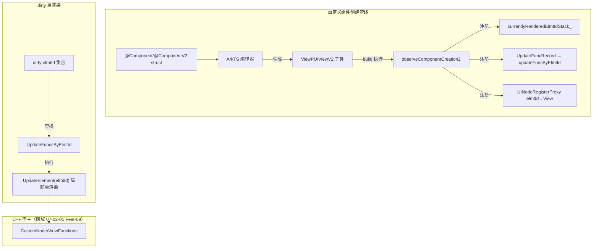

# 架构设计

> 07-03-01 组件化功能域的架构设计文档，补录已有实现。本域覆盖 ArkUI 声明式前端的自定义组件声明与创建机制：`@Component`（V1）/`@ComponentV2`（V2）装饰 struct 声明自定义组件、`build()` 方法描述 UI、`@Entry` 装饰根组件、`@Require` 强制构造传参、组件树构建管线（`observeComponentCreation`/`observeComponentCreation2`）、`UpdateFuncRecord` 更新函数管理。

## 设计元数据

| 字段 | 内容 |
|------|------|
| Design ID | DESIGN-Func-07-03-01 |
| 关联需求 | 已有能力补录（无独立 requirement.md） |
| 关联 Epic | 无 |
| 目标 Feature | Feat-01 @Component/@ComponentV2 自定义组件声明与创建 |
| 复杂度 | 中 |
| 目标版本 | @Component/@Entry API 7 起；@Require API 11 起；@ComponentV2 API 12 起 |
| Owner | ArkUI SIG |
| 状态 | Baselined |
| FuncID | 07-03-01 |
| 源码根 | `frameworks/bridge/declarative_frontend/state_mgmt/src/lib/partial_update/pu_view.ts`（ViewPU）+ `v2/v2_view.ts`（ViewV2）+ `puv2_common/puv2_view_base.ts` + `puv2_common/puv2_updatefunc.ts` |
| SDK 声明 | `interface/sdk-js/api/@internal/component/ets/common.d.ts`（@Component/@Entry/@Require）+ `interface/sdk-js/api/@internal/component/ets/common.d.ts`（@ComponentV2） |
| 测试入口 | `frameworks/bridge/declarative_frontend/state_mgmt/test/unittest/entry/src/main/v1_tests/` + `v2_tests/` + `common_tests/` |
| 前置依赖 | 07-02-01（ViewPU 基类 + observeComponentCreation2）+ 07-02-04（ViewV2 基类） |
| 下游影响 | 07-03-02（生命周期挂在组件上）、07-03-03（复用池管理组件）、07-03-04（冻结配置挂在组件上） |
| 关键错误码 | 无专属 |

## 需求基线

| 字段 | 内容 |
|------|------|
| 问题陈述 | ArkUI 声明式前端需要一种机制让开发者将 UI 拆分为可复用、可组合、状态隔离的自定义组件单元。每个组件有独立的 build 方法描述 UI、独立的状态作用域、可接受父组件传参 |
| 核心目标 | 提供 @Component/@ComponentV2 声明语法、build 方法 UI 描述、组件树构建管线（observeComponentCreation2 + UpdateFuncRecord）、@Entry 根组件标记、@Require 强制传参 |
| P0 AC | Feat-01 全量 AC |
| 补充说明 | V1 @Component 与 V2 @ComponentV2 的 build 机制一致，底层 ViewPU/ViewV2 共享 PUV2ViewBase；状态变量行为详见 07-02 状态管理 |

## 上下文和现状

### 涉及仓和模块

| 仓库 | 模块路径 | 当前职责 | 本 Feature 影响 |
|------|----------|----------|-----------------|
| ace_engine | `frameworks/bridge/declarative_frontend/state_mgmt/src/lib/partial_update/pu_view.ts` | `ViewPU`（V1 视图基类）：组件创建（`observeComponentCreation2`）、dirty 更新、`currentlyRenderedElmtIdStack_` | 全量涉及 |
| ace_engine | `frameworks/bridge/declarative_frontend/state_mgmt/src/lib/v2/v2_view.ts` | `ViewV2`（V2 视图基类）：V2 组件创建、dirty 更新、复用 | Feat-01 |
| ace_engine | `frameworks/bridge/declarative_frontend/state_mgmt/src/lib/puv2_common/puv2_view_base.ts` | `PUV2ViewBase`（V1/V2 共享基类）：`activeCount_`、`freezeWhenInactive` 继承、dump | Feat-01 协同 |
| ace_engine | `frameworks/bridge/declarative_frontend/state_mgmt/src/lib/puv2_common/puv2_updatefunc.ts` | `UpdateFuncRecord`/`UpdateFuncsByElmtId`：每 elmtId 的更新函数 + If/Else isPending/isChanged | Feat-01 |
| ace_engine | `frameworks/bridge/declarative_frontend/state_mgmt/src/lib/partial_update/pu_uinode_registry_proxy.ts` | `UINodeRegisterProxy`：elmtId→View 映射 | Feat-01 协同 |
| ace_engine | `frameworks/core/components_ng/pattern/custom/custom_node.cpp/.h` | `CustomNode`/`CustomNodeBase`：@Component/@ComponentV2 的 C++ 宿主节点 | 跨域（07-02-01 Feat-09） |

### 调用链层级分析

| 层 | 模块 | 职责 | 修改类型 |
|----|------|------|----------|
| 1. SDK 层 | `interface/sdk-js/api/@internal/component/ets/common.d.ts`/`interface/sdk-js/api/@internal/component/ets/common.d.ts` | @Component/@ComponentV2/@Entry/@Require 声明 | 存量分析 |
| 2. 编译期 | ArkTS 编译器 | 装饰器语法解析，转换为 ViewPU/ViewV2 子类创建 + build 方法 | 存量分析 |
| 3. 组件创建层 | `pu_view.ts` `observeComponentCreation2`(1089-1179) | elmtId 入栈、注册 UpdateFuncRecord、注册 elmtId→View | 存量分析 |
| 4. 渲染层 | `pu_view.ts` `build` | 执行 build 方法，经 observeComponentCreation2 创建子组件 | 存量分析 |
| 5. 更新记录层 | `puv2_updatefunc.ts` `UpdateFuncRecord`(51-160) | 每 elmtId 的更新函数 + If/Else isPending/isChanged | 存量分析 |
| 6. 注册层 | `pu_uinode_registry_proxy.ts` | elmtId→View 全局映射 | 存量分析 |
| 7. C++ 宿主层 | `custom_node.cpp` | CustomNode 创建与 ViewFunctions 绑定 | 存量分析（跨域 07-02-01） |

### 适用架构规则

| Rule ID | 适用原因 | 设计结论 | 验证方式 |
|---------|----------|----------|----------|
| OH-ARCH-LAYERING | 自定义组件创建跨 SDK → 编译期 → 组件创建 → 渲染 → 更新记录 → 注册 → C++ 宿主共 7 层 | 单向调用：build 方法经 observeComponentCreation2 注册子组件 | 代码评审 |
| OH-ARCH-API-LEVEL | @Component API 7、@Require API 11、@ComponentV2 API 12 | 各装饰器标注 @since 版本 | API 评审/XTS |

## 不涉及项承接

| 维度 | 结论 |
|------|------|
| 状态变量 | 承接 — @State/@Local/@Prop/@Param 等状态变量装饰器归 07-02 状态管理 |
| 生命周期 | 承接 — aboutToAppear/aboutToDisappear/@Component* 状态机归 07-03-02 |
| 复用 | 承接 — @Reusable/@ReusableV2 归 07-03-03 |
| 冻结 | 承接 — freezeWhenInactive 归 07-03-04 |
| 渲染控制 | 承接 — if/else/ForEach/LazyForEach/Repeat 归 07-05 渲染控制 |
| 组件扩展 | 承接 — @Builder/@BuilderParam/@Styles/@Extend 归 07-03-06 |
| elmtId/C++ 宿主 | 承接 — CustomNode/ViewFunctions/ElementRegister 归 07-02-01 Feat-09 |

## 关键设计决策

| 决策 ID | 问题 | 推荐方案 | 探索过的替代方案 | 取舍理由 | 影响 |
|---------|------|----------|------------------|----------|------|
| ADR-1 | 组件声明方式 | `@Component` 装饰 struct，`build()` 方法描述 UI，组件间通过参数传递数据，状态隔离 | 方案A：函数式组件（无状态隔离）；方案B：struct + build 声明式（选择） | 声明式 UI 标准范式，状态隔离，可嵌套组合 | Feat-01 |
| ADR-2 | V1 vs V2 组件创建 | @ComponentV2 配套 V2 装饰器（@Local/@Param 等），build 机制一致，底层 ViewPU/ViewV2 共享 PUV2ViewBase | 方案A：V2 完全独立创建管线；方案B：共享 PUV2ViewBase + observeComponentCreation2（选择） | 减少重复代码；V1/V2 范式隔离但组件创建机制共享 | Feat-01 |
| ADR-3 | @Require 强制传参 | API 11+ @Require 装饰器强制父组件构造传参，否则编译报错 | 方案A：运行时检查（可能遗漏）；方案B：编译期校验（选择） | 编译期发现问题，避免运行时异常 | Feat-01 |
| ADR-4 | 组件树构建管线 | observeComponentCreation2 注册 elmtId + UpdateFuncRecord；currentlyRenderedElmtIdStack_ 维护渲染栈 | 方案A：无栈式（无法追踪嵌套）；方案B：栈式 + UpdateFuncRecord（选择） | 栈式追踪支持嵌套组件的 elmtId 管理 | Feat-01 |

## 设计骨架

### 骨架范围

| 骨架项 | 目标 | 不包含 | 验证方式 |
|--------|------|--------|----------|
| ViewPU/ViewV2 | V1/V2 自定义组件基类 | 状态变量装饰器（07-02） | 单元测试 |
| observeComponentCreation2 | 组件创建管线（elmtId 栈 + UpdateFuncRecord 注册） | elmtId 全链路同步（07-02-01 Feat-09） | 单元测试 |
| UpdateFuncRecord | 每 elmtId 更新函数 + If/Else isPending/isChanged | dirty 更新调度（07-02-01 Feat-01） | 单元测试 |

### 骨架 Spec 拆分

| Task ID | 目标 | 受影响文件 | AC |
|---------|------|------------|-----|
| Feat-01 | @Component/@ComponentV2 自定义组件声明与创建 | `pu_view.ts`、`v2_view.ts`、`puv2_view_base.ts`、`puv2_updatefunc.ts` | AC-1.1~AC-5.8 |

## 后续 Task 拆分

| Spec | 目的 | 依赖 | 输出 |
|------|------|------|------|
| 无后续 Task | 已有实现补录 | — | 各 Feature 详细规格见 `Feat-NN-*-spec.md` |

## API 签名、Kit 与权限

### 新增 API

| API 签名 | 类型 | 功能描述 | 关联 Feat |
|----------|------|----------|----------|
| （已有实现补录，API 通过 ArkTS 装饰器语法或 `@ohos.arkui.StateManagement` 模块暴露，具体签名见各 Feature spec） | Public | 各装饰器/API 的完整签名、@since、开放范围见各 Feature spec 的「核心类与机制清单」和「兼容性声明」 | Feat-01~NN |

### 变更/废弃 API

无变更。

### Kit

无独立 Kit，归属于 ArkUI ArkTS 声明式范式（`SystemCapability.ArkUI.ArkUI.Full`）。

### 权限要求

无权限要求。

## 构建系统影响

### BUILD.gn 变更

无变更。状态管理 TS 库编译为单一 `stateMgmt.abc` 字节码（debug/release/profile 三种构建产物），由引擎初始化时载入。构建配置见 `frameworks/bridge/declarative_frontend/state_mgmt/BUILD.gn`。

### bundle.json 变更

无变更。

## 可选设计扩展

### 架构图

### 数据流

**自定义组件 build 执行流程：**

1. ArkTS 编译器将 `@Component struct MyComp` 编译为 `ViewPU`/`ViewV2` 子类
2. 框架创建 CustomNode（C++ 宿主），实例化 ViewPU/ViewV2 子类
3. 调用 `aboutToAppear`（生命周期，07-03-02）
4. 调用 `build()` 方法
5. build 中每创建一个子组件元素，调用 `observeComponentCreation2(elmtId, updateFunc)`
6. `observeComponentCreation2` 将 elmtId 压入 `currentlyRenderedElmtIdStack_`，注册 `UpdateFuncRecord` 到 `updateFuncByElmtId`，注册 elmtId→View 到 `UINodeRegisterProxy`
7. 执行子组件的 updateFunc（递归创建子组件）
8. build 完成后弹出 `currentlyRenderedElmtIdStack_`，调用 `onDidBuild`

## 详细设计

各 Feature 的详细规格见对应的 `Feat-NN-*-spec.md`。

## 风险和开放问题

| 项 | 类型 | 影响 | 处理方式 | Owner |
|----|------|------|----------|-------|
| build 中修改状态变量 | 健壮性 | 中 | viewPropertyHasChanged 检测 isRenderInProgress 抛错 | ArkUI SIG |
| 组件递归引用 | 健壮性 | 低 | 需条件终止（如 if/else），否则栈溢出 | ArkUI SIG |
| V1/V2 范式混用 | 兼容性 | 高 | @ComponentV2 中不应使用 V1 状态变量装饰器；跨范式需 enableV2Compatibility | ArkUI SIG |

## 设计审批

- [x] 需求基线已确认，设计覆盖 P0 AC
- [x] 不涉及项已承接，状态变量/生命周期/复用/冻结/渲染控制/扩展分别归 07-02/07-03-02~06/07-05
- [x] 涉及仓和模块职责清楚
- [x] 调用链层级分析完整（7 层）
- [x] 适用架构规则已识别（LAYERING / API-LEVEL）
- [x] 关键设计决策有理由（4 个 ADR）
- [x] 风险和开放问题有 Owner

**结论:** Baselined（已有实现补录）.
