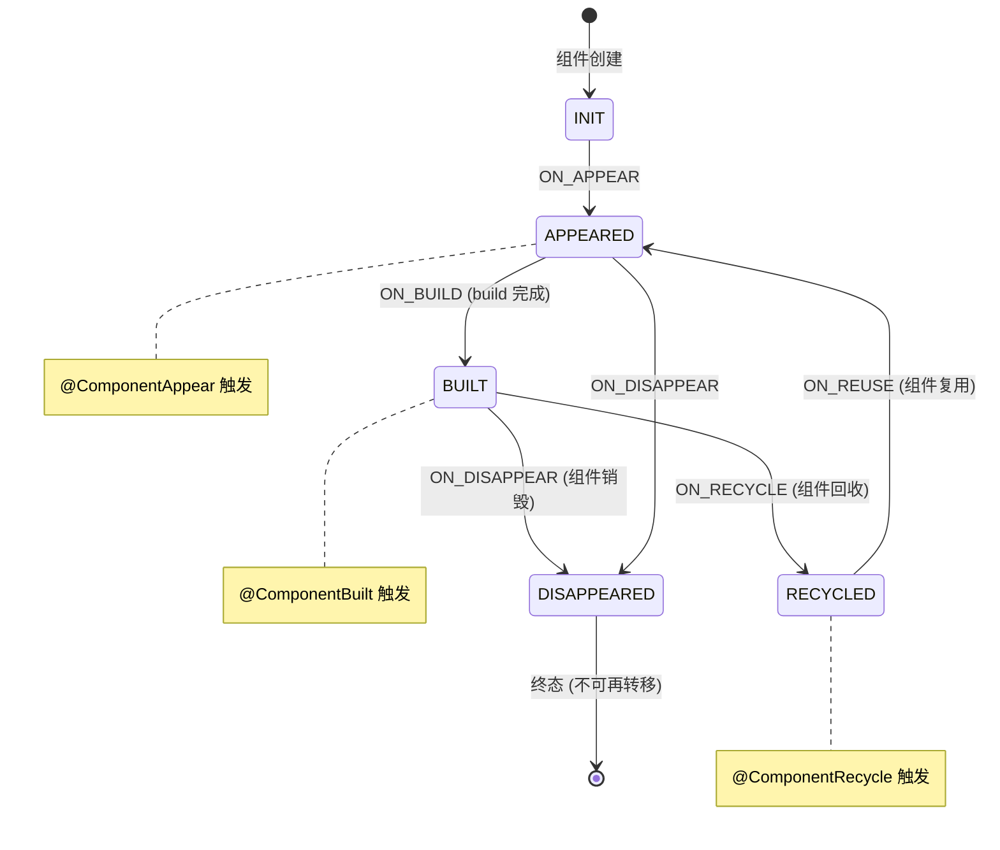

# 架构设计

> 07-03-02 自定义组件生命周期功能域的架构设计文档，补录已有实现。本域覆盖自定义组件的生命周期回调与状态机：V1 旧回调（`aboutToAppear`/`aboutToDisappear`/`onDidBuild`）与新生命周期状态机（`CustomComponentLifecycle` 5 态 FSM + `@ComponentInit`/`@ComponentAppear`/`@ComponentBuilt`/`@ComponentReuse`/`@ComponentRecycle`/`@ComponentDisappear`（API 23+）/`@ComponentActive`/`@ComponentInactive`（API 26+）装饰器）、新旧并存机制、`activeCount_` 引用计数、`transitionTable` 状态转移约束。`onPageShow`/`onPageHide` 是页面级（@Entry）生命周期，不属于本域。

## 设计元数据

| 字段 | 内容 |
|------|------|
| Design ID | DESIGN-Func-07-03-02 |
| 关联需求 | 已有能力补录（无独立 requirement.md） |
| 关联 Epic | 无 |
| 目标 Feature | Feat-01 自定义组件生命周期（V1 回调 + 新状态机） |
| 复杂度 | 中 |
| 目标版本 | aboutToAppear/aboutToDisappear API 7 起；onDidBuild API 9 起；新生命周期装饰器（@ComponentInit/@ComponentAppear/@ComponentBuilt/@ComponentReuse/@ComponentRecycle/@ComponentDisappear）API 23 起；@ComponentActive/@ComponentInactive API 26 起；activeCount_ API 18 起 |
| Owner | ArkUI SIG |
| 状态 | Baselined |
| FuncID | 07-03-02 |
| 源码根 | `frameworks/bridge/declarative_frontend/state_mgmt/src/lib/puv2_common/pu_lifecycle.ts`（CustomComponentLifecycle 5 态 FSM + __componentX__Internal）+ `puv2_common/puv2_view_base.ts`（activeCount_） |
| SDK 声明 | `interface/sdk-js/api/@internal/component/ets/common.d.ts`（@Component* 装饰器 API 23+/26+） |
| 测试入口 | `frameworks/bridge/declarative_frontend/state_mgmt/test/unittest/entry/src/main/common_tests/`（FSM）+ `v1_tests/`（V1 回调）+ `v2_tests/`（新装饰器） |
| 前置依赖 | 07-03-01（组件创建 — 生命周期挂在组件上） |
| 下游影响 | 07-03-03（复用触发 aboutToReuse/aboutToRecycle 生命周期事件）、07-03-04（active/inactive 状态驱动冻结） |
| 关键错误码 | 无专属 |

## 需求基线

| 字段 | 内容 |
|------|------|
| 问题陈述 | 自定义组件需要在不同阶段（创建、出现、构建完成、回收、销毁、激活、非激活）执行自定义逻辑。V1 仅提供 aboutToAppear/aboutToDisappear/onDidBuild 三个粗粒度回调，无法精确覆盖复用/冻结等场景的阶段性需求 |
| 核心目标 | 提供 V1 旧回调 + 新生命周期状态机（5 态 FSM + @Component* 装饰器），新旧并存互不冲突，覆盖组件从创建到销毁的全生命周期 |
| P1 AC | Feat-01 全量 AC |
| 补充说明 | `onPageShow`/`onPageHide`/`onBackPress` 是页面级（@Entry）生命周期，不属于自定义组件。新生命周期装饰器（API 23+）与 V1 旧回调并存，C++ 按序调用两套（旧先、新后） |

## 上下文和现状

### 涉及仓和模块

| 仓库 | 模块路径 | 当前职责 | 本 Feature 影响 |
|------|----------|----------|-----------------|
| ace_engine | `frameworks/bridge/declarative_frontend/state_mgmt/src/lib/puv2_common/pu_lifecycle.ts` | `CustomComponentLifecycle`(56-263)：5 态 FSM + `transitionTable` + `__componentX__Internal`(277-399) 新装饰器实现 | 全量涉及 |
| ace_engine | `frameworks/bridge/declarative_frontend/state_mgmt/src/lib/puv2_common/puv2_view_base.ts` | `PUV2ViewBase`：`activeCount_`(104) 引用计数、`executeActiveOrInactiveLifecycleByNonFreezeCount`(701-722) | Feat-01 协同 |
| ace_engine | `frameworks/bridge/declarative_frontend/state_mgmt/src/lib/partial_update/pu_view.ts` | `ViewPU`：`viewPropertyHasChanged`(682-734) build 中修改检测、`setActiveInternal`(483-522) active/inactive 切换 | Feat-01 协同 |
| ace_engine | `frameworks/core/components_ng/pattern/custom/custom_node.cpp` | `CustomNode`：C++ 侧生命周期回调分发（旧 `FireOnAppear` 先，新 `FireTriggerLifecycleFunc` 后） | 跨域（07-02-01 Feat-09） |

### 调用链层级分析

| 层 | 模块 | 职责 | 修改类型 |
|----|------|------|----------|
| 1. SDK 层 | `interface/sdk-js/api/@internal/component/ets/common.d.ts` | @Component* 装饰器声明（API 23+/26+） | 存量分析 |
| 2. 编译期 | ArkTS 编译器 | 装饰器语法解析，置 `__newLifecycleNeedWork__Internal=true` 并 push 到 Symbol-keyed 数组 | 存量分析 |
| 3. 状态机层 | `pu_lifecycle.ts` `CustomComponentLifecycle`(56-263) | 5 态 FSM 维护 + `transitionTable` 转移约束 | 存量分析 |
| 4. 装饰器分发层 | `pu_lifecycle.ts` `__componentX__Internal`(277-399) | `executeInternalFunction`（装饰器方法先）→ `handleObserverFunction`（observer 回调后） | 存量分析 |
| 5. 引用计数层 | `puv2_view_base.ts` `activeCount_`(104) | API 18+ active/inactive 引用计数，`executeActiveOrInactiveLifecycleByNonFreezeCount`(701-722) | 存量分析 |
| 6. C++ 分发层 | `custom_node.cpp` | 按序调用新旧两套（旧 FireOnAppear 先，新 FireTriggerLifecycleFunc 后） | 存量分析 |

### 适用架构规则

| Rule ID | 适用原因 | 设计结论 | 验证方式 |
|---------|----------|----------|----------|
| OH-ARCH-LAYERING | 生命周期跨 SDK → 编译期 → 状态机 → 装饰器分发 → 引用计数 → C++ 分发共 6 层 | 单向调用，新旧并存不冲突 | 代码评审 |
| OH-ARCH-API-LEVEL | V1 回调 API 7/9、新装饰器 API 23/26、activeCount_ API 18 | 各装饰器标注 @since 版本 | API 评审/XTS |

## 不涉及项承接

| 维度 | 结论 |
|------|------|
| 页面生命周期 | 承接 — onPageShow/onPageHide/onBackPress 是 @Entry 页面级，不属于自定义组件 |
| 组件冻结 | 承接 — freezeWhenInactive 配置与冻结行为归 07-03-04（本域仅涉及 active/inactive 对生命周期回调的影响） |
| 组件复用 | 承接 — aboutToReuse/aboutToRecycle 的复用机制归 07-03-03（本域仅涉及复用时触发的生命周期事件） |
| 状态管理 | 承接 — 状态变量行为归 07-02 |
| 组件创建 | 承接 — @Component/@ComponentV2 声明与 build 归 07-03-01 |

## 关键设计决策

### ADR 概览

| 决策 ID | 问题 | 选择方案 | 影响 |
|---------|------|----------|------|
| ADR-1 | V1 回调时机 | aboutToAppear(build 前) / aboutToDisappear(销毁前) / onDidBuild(build 后) | Feat-01 |
| ADR-2 | 新状态机设计 | 5 态 FSM + 6 个 @Component* 装饰器（API 23+）+ @ComponentActive/@Inactive（API 26+） | Feat-01 |
| ADR-3 | 新旧并存 | C++ 按序调用两套（旧先新后），不冲突 | Feat-01 |
| ADR-4 | Active/Inactive 引用计数 | activeCount_（API 18+），executeActiveOrInactiveLifecycleByNonFreezeCount | Feat-01 |

### ADR-1: V1 回调时机

**问题背景**：自定义组件需要在其生命周期的关键节点（创建前、创建后、销毁前）执行自定义逻辑（如初始化资源、设置初始状态、释放资源）。回调时机必须精确——aboutToAppear 必须在 build 前执行（此时状态变量已初始化但 UI 尚未渲染），onDidBuild 必须在 build 后执行（此时子组件已创建，可访问子组件引用）。

**选型推理**：选择三个粗粒度回调覆盖关键节点。aboutToAppear 中修改状态变量允许（build 尚未开始，无渲染期保护）；build 中修改抛错（`isRenderInProgress` 检测）；aboutToDisappear 中修改允许但无意义（组件即将销毁，UI 不再刷新）。嵌套组件时生命周期按"父 aboutToAppear → 父 build → 子 aboutToAppear → 子 build → 子 onDidBuild → 父 onDidBuild"顺序触发。

### ADR-2: 新状态机设计 — 5 态 FSM + @Component* 装饰器

**问题背景**：V1 回调（aboutToAppear/aboutToDisappear/onDidBuild）无法精确覆盖复用/冻结等场景的阶段性需求（如组件被回收后重新复用时需要知道"正在被复用"而非"正在被创建"）。需要更精细的生命周期状态管理。

**关键权衡**：
- 扩展 V1 回调数量：增加更多回调方法但仍是扁平结构——无法表达状态转移约束
- 引入状态机（FSM）：用有限状态机管理生命周期阶段，每个阶段对应事件和装饰器——精确且有约束

**选型推理**：选择 5 态 FSM（INIT→APPEARED→BUILT→RECYCLED→DISAPPEARED）+ 6 个装饰器（API 23+）。`transitionTable`（`pu_lifecycle.ts:35-53`）约束合法转移路径，非法转移被拒绝，DISAPPEARED 为终态。@ComponentInit 特殊——非状态机，构造期执行（与其他 @Component* 差异）。@ComponentActive/@ComponentInactive（API 26+）独立于 FSM，不受状态机约束。`executeInternalFunction`（装饰器方法）先于 `handleObserverFunction`（observer 回调）执行。

### ADR-3: 新旧并存机制

**问题背景**：引入新状态机（API 23+）后，已有应用使用 V1 旧回调。两套机制必须并存且不冲突，支持渐进迁移。

**选型推理**：C++ 按序调用两套——旧 `FireOnAppear` 先，新 `FireTriggerLifecycleFunc` 后。两套独立运行，不互相干扰。开发者可以同时使用新旧回调（不冲突），也可以逐步将旧回调迁移为新装饰器。

### ADR-4: Active/Inactive 引用计数

**问题背景**：组件的激活/非激活状态需要精确管理——一个组件可能被多个因素影响其激活状态（如父组件激活 + 自身可见）。需要一个引用计数机制来追踪。

**选型推理**：`activeCount_`（`puv2_view_base.ts:104`，API 18+）维护引用计数。`executeActiveOrInactiveLifecycleByNonFreezeCount`(701-722) 处理非冻结组件：0→1 触发 active（@ComponentActive 回调），1→0 触发 inactive（@ComponentInactive 回调）。冻结组件（freezeWhenInactive=true）不走此路径，由冻结机制管理（详见 07-03-04）。

## 设计骨架

### 骨架范围

| 骨架项 | 目标 | 不包含 | 验证方式 |
|--------|------|--------|----------|
| `CustomComponentLifecycle` | 5 态 FSM 状态机 + transitionTable 转移约束 | 组件创建管线（07-03-01） | 单元测试 |
| `__componentX__Internal` | 8 个新装饰器内部实现（executeInternalFunction 先于 handleObserverFunction） | V1 旧回调（C++ FireOnAppear） | 代码审查 |
| `activeCount_` | API 18+ active/inactive 引用计数 | 冻结机制（07-03-04） | 单元测试 |

### 骨架 Spec 拆分

| Task ID | 目标 | 受影响文件 | AC |
|---------|------|------------|-----|
| Feat-01 | 自定义组件生命周期（V1 回调 + 新状态机 FSM + @Component* 装饰器 + 新旧并存 + activeCount_） | `pu_lifecycle.ts`、`puv2_view_base.ts`、`pu_view.ts` | AC-1.1~AC-5.8 |

## 后续 Task 拆分

| Spec | 目的 | 依赖 | 输出 |
|------|------|------|------|
| 无后续 Task | 已有实现补录 | — | 各 Feature 详细规格见 `Feat-NN-*-spec.md` |

## API 签名、Kit 与权限

### 新增 API

| API 签名 | 类型 | 功能描述 | 关联 Feat |
|----------|------|----------|----------|
| （已有实现补录，API 通过 ArkTS 装饰器语法或 `@ohos.arkui.StateManagement` 模块暴露，具体签名见各 Feature spec） | Public | 各装饰器/API 的完整签名、@since、开放范围见各 Feature spec 的「核心类与机制清单」和「兼容性声明」 | Feat-01~NN |

### 变更/废弃 API

无变更。

### Kit

无独立 Kit，归属于 ArkUI ArkTS 声明式范式（`SystemCapability.ArkUI.ArkUI.Full`）。

### 权限要求

无权限要求。

## 构建系统影响

### BUILD.gn 变更

无变更。状态管理 TS 库编译为单一 `stateMgmt.abc` 字节码（debug/release/profile 三种构建产物），由引擎初始化时载入。构建配置见 `frameworks/bridge/declarative_frontend/state_mgmt/BUILD.gn`。

### bundle.json 变更

无变更。

## 可选设计扩展

### 生命周期状态机图

### 数据流

**新旧生命周期并存调用链：**

1. C++ CustomNode 触发生命周期事件（如组件出现）
2. 先调用旧回调路径：`FireOnAppear` → `aboutToAppear()`（V1 回调）
3. 后调用新回调路径：`FireTriggerLifecycleFunc` → `CustomComponentLifecycle.executeInternalFunction`（装饰器方法 @ComponentAppear）→ `handleObserverFunction`（observer 回调）
4. 状态机更新：`transitionTable` 验证转移合法性 → 更新 FSM 状态（如 INIT→APPEARED）

**activeCount_ 引用计数流程：**

1. 组件被标记 active（如从 LazyForEach 缓存回到屏上）→ `activeCount_` 从 0→1
2. `executeActiveOrInactiveLifecycleByNonFreezeCount` 检测 0→1 → 触发 @ComponentActive（API 26+）
3. 组件被标记 inactive（如进入 LazyForEach 缓存）→ `activeCount_` 从 1→0
4. `executeActiveOrInactiveLifecycleByNonFreezeCount` 检测 1→0 → 触发 @ComponentInactive（API 26+）
5. 冻结组件（freezeWhenInactive=true）不走此路径（由冻结机制管理，详见 07-03-04）

## 详细设计

各 Feature 的详细规格见对应的 `Feat-NN-*-spec.md`。

## 风险和开放问题

| 项 | 类型 | 影响 | 处理方式 | Owner |
|----|------|------|----------|-------|
| build 中修改状态变量 | 健壮性 | 中 | `viewPropertyHasChanged` 检测 `isRenderInProgress` 抛错；需引导开发者移到 aboutToAppear/事件回调 | ArkUI SIG |
| @Component* 装饰器装饰同一方法多次 | 健壮性 | 低 | 仅最后定义生效；文档已声明不建议 | ArkUI SIG |
| 新旧装饰器并存时的执行顺序 | 兼容性 | 低 | C++ 保证旧先新后；开发者可混用不冲突 | ArkUI SIG |
| @ComponentInit 非状态机 | 可维护性 | 低 | 文档明确标注 @ComponentInit 在构造期执行（与其他 @Component* 差异） | ArkUI SIG |

## 设计审批

- [x] 需求基线已确认，设计覆盖 P1 AC
- [x] 不涉及项已承接（页面生命周期/冻结/复用/状态管理/组件创建分别归 07-03-01~04/07-02）
- [x] 涉及仓和模块职责清楚（`pu_lifecycle.ts` + `puv2_view_base.ts` + `pu_view.ts` + C++ CustomNode）
- [x] 调用链层级分析完整（6 层：SDK → 编译期 → 状态机 → 装饰器分发 → 引用计数 → C++ 分发）
- [x] 适用架构规则已识别（LAYERING / API-LEVEL）
- [x] 关键设计决策有理由（4 个 ADR 含深入分析）
- [x] 风险和开放问题有 Owner

**结论:** Baselined（已有实现补录）.
