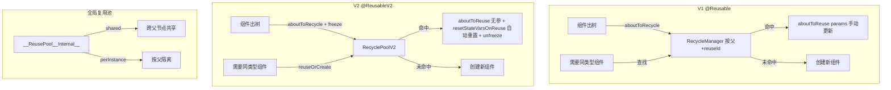

# 架构设计

> 07-03-03 自定义组件复用功能域的架构设计文档，补录已有实现。本域覆盖自定义组件的复用机制：V1 `@Reusable`（`aboutToReuse(params)`/`aboutToRecycle`、`RecycleManager` + `BidirectionalMap`、reuseId）、V2 `@ReusableV2`（`aboutToReuse` 无参、`resetStateVarsOnReuse` 自动状态重置、`RecyclePoolV2` + `RecycledIdRegistry`）、全局复用池 `__ReusePool__Internal__`（shared/perInstance）、`reuseOrCreateNewComponent`、V1/V2 复用混用矩阵（错误码 140113）、Repeat template 限制。

## 设计元数据

| 字段 | 内容 |
|------|------|
| Design ID | DESIGN-Func-07-03-03 |
| 关联需求 | 已有能力补录（无独立 requirement.md） |
| 关联 Epic | 无 |
| 目标 Feature | Feat-01 自定义组件复用机制（V1 @Reusable + V2 @ReusableV2 + 全局复用池） |
| 复杂度 | 高 |
| 目标版本 | @Reusable API 10 起；@ReusableV2 API 18 起；全局复用池 API 10 起；错误码 140113 API 23 起 |
| Owner | ArkUI SIG |
| 状态 | Baselined |
| FuncID | 07-03-03 |
| 源码根 | `frameworks/bridge/declarative_frontend/state_mgmt/src/lib/partial_update/pu_view.ts`（RecycleManager V1）+ `v2/v2_view.ts`（resetStateVarsOnReuse / freezeRecycledComponent）+ `v2/v2_recycle_pool.ts`（RecyclePoolV2）+ `puv2_common/puv2_globalreuse.ts`（__ReusePool__Internal__） |
| SDK 声明 | `interface/sdk-js/api/@internal/component/ets/common.d.ts`（@Reusable）+ `interface/sdk-js/api/@internal/component/ets/common.d.ts`（@ReusableV2） |
| 测试入口 | `frameworks/bridge/declarative_frontend/state_mgmt/test/unittest/entry/src/main/repeat_tests/` |
| 前置依赖 | 07-03-01（组件创建 — reuseOrCreateNewComponent）+ 07-03-02（aboutToReuse/aboutToRecycle 生命周期回调） |
| 下游影响 | 07-03-04（回收期间冻结 freezeRecycledComponent） |
| 关键错误码 | 140113（@Reusable + @ComponentV2 混用需 API 18+ SDK） |

## 需求基线

| 字段 | 内容 |
|------|------|
| 问题陈述 | 频繁创建/销毁自定义组件（如 LazyForEach/Repeat 列表项）有显著性能开销（组件实例化 + build 执行 + elmtId 注册 + C++ 节点创建）。需要复用机制：组件出树时回收入池，需要同类型组件时从池中复用 |
| 核心目标 | 提供 V1/V2/全局三套复用机制，减少组件创建/销毁开销；V2 自动状态重置保证复用组件状态干净 |
| P1 AC | Feat-01 全量 AC |
| 补充说明 | V1 @Reusable 的 aboutToReuse(params) 接收新参数手动管理状态；V2 @ReusableV2 的 aboutToReuse 无参，框架自动重置状态变量 |

## 上下文和现状

### 涉及仓和模块

| 仓库 | 模块路径 | 当前职责 | 本 Feature 影响 |
|------|----------|----------|-----------------|
| ace_engine | `partial_update/pu_view.ts` | `RecycleManager` + `BidirectionalMap`：V1 按父节点的复用池管理 | 全量涉及 |
| ace_engine | `v2/v2_view.ts` | `ViewV2`：`resetStateVarsOnReuse`(210)、`freezeRecycledComponent`(312)、`unfreezeReusedComponent`(328)、`reuseOrCreateNewComponent`(1075) | 全量涉及 |
| ace_engine | `v2/v2_recycle_pool.ts` | `RecyclePoolV2` + `RecycledIdRegistry`：V2 复用池 | Feat-01 |
| ace_engine | `puv2_common/puv2_globalreuse.ts` | `__ReusePool__Internal__`：全局复用池（shared/perInstance） | Feat-01 |

### 调用链层级分析

| 层 | 模块 | 职责 | 修改类型 |
|----|------|------|----------|
| 1. SDK 层 | `interface/sdk-js/api/@internal/component/ets/common.d.ts`/`interface/sdk-js/api/@internal/component/ets/common.d.ts` | @Reusable/@ReusableV2 声明 | 存量分析 |
| 2. V1 复用池 | `pu_view.ts` `RecycleManager` | 按父节点 + reuseId 管理回收/复用 | 存量分析 |
| 3. V2 复用池 | `v2_view.ts`/`v2_recycle_pool.ts` | RecyclePoolV2 + resetStateVarsOnReuse 自动重置 | 存量分析 |
| 4. 全局复用池 | `puv2_globalreuse.ts` | shared/perInstance 跨父复用 | 存量分析 |
| 5. C++ 宿主 | `custom_node.cpp` | CustomNode 回收/复用时触发 TS 回调 | 跨域（07-02-01） |

### 适用架构规则

| Rule ID | 适用原因 | 设计结论 | 验证方式 |
|---------|----------|----------|----------|
| OH-ARCH-LAYERING | 复用跨 SDK → V1/V2 复用池 → 全局复用池 → C++ 宿主共 5 层 | V1/V2 独立复用池 + 全局共享池 | 代码评审 |
| OH-ARCH-API-LEVEL | @Reusable API 10、@ReusableV2 API 18、140113 API 23 | 各装饰器标注 @since | API 评审 |

## 不涉及项承接

| 维度 | 结论 |
|------|------|
| 生命周期 | 承接 — aboutToReuse/aboutToRecycle 的时机归 07-03-02（本域仅涉及复用池管理机制） |
| 冻结 | 承接 — 回收期间冻结行为归 07-03-04 |
| 状态管理 | 承接 — V2 resetStateVarsOnReuse 涉及的状态变量行为归 07-02-04 |
| 渲染控制 | 承接 — Repeat/LazyForEach 触发复用的渲染控制归 07-05 |

## 关键设计决策

### ADR 概览

| 决策 ID | 问题 | 选择方案 | 影响 |
|---------|------|----------|------|
| ADR-1 | V1 @Reusable 设计 | aboutToReuse(params) 手动传参 + RecycleManager 按父管理 | Feat-01 |
| ADR-2 | V2 @ReusableV2 设计 | aboutToReuse 无参 + resetStateVarsOnReuse 自动重置 | Feat-01 |
| ADR-3 | 全局复用池 | __ReusePool__Internal__ shared/perInstance 双模式 | Feat-01 |
| ADR-4 | V1/V2 复用混用 | 严格混用矩阵，140113 错误码 | Feat-01 |

### ADR-1: V1 @Reusable — 手动传参 + 按父管理

**问题背景**：V1 组件复用时需要传递新参数给复用的组件（如列表项的新数据）。复用池需要按父节点隔离（不同父节点下的同类型组件不能互相复用）。

**选型推理**：`aboutToReuse(params)` 接收新参数，开发者手动更新组件状态。`RecycleManager` + `BidirectionalMap` 按父节点管理复用池——每个父节点有独立的池。reuseId 区分不同类型组件（相同 reuseId 可互换，默认用类名）。V1 组件在池中状态变量仍可能被引用，需 `freezeWhenInactive` 避免无效更新。

### ADR-2: V2 @ReusableV2 — 无参 + 自动状态重置

**问题背景**：V1 的手动传参方式容易遗漏状态重置（开发者忘记在 aboutToReuse 中重置某些变量），导致复用组件状态残留。V2 需要更安全的自动重置机制。

**关键权衡**：
- V1 方式（手动传参）：灵活但易遗漏状态重置
- V2 方式（无参 + 自动重置）：安全但开发者无法控制重置顺序（框架按定义顺序重置）

**选型推理**：V2 `aboutToReuse` 无参（参数经 @Param 传递，不通过回调参数）。`resetStateVarsOnReuse`(`v2_view.ts:210`) 按定义顺序自动重置：@Local/@Provider（初始值）→ @Param/@Event（有外部用外部否则初始值）→ @Consumer（有 @Provider 用其值否则初始值）→ @Computed（最新值重计算）→ @Monitor（所有变量重置后触发，重置中变化更新 before 不触发回调）。常量不重置。回收时 `freezeRecycledComponent`(312) 冻结（activeCount_--），复用时 `unfreezeReusedComponent`(328) 解冻。@Computed 推荐定义在所依赖变量之后以确保重置顺序正确。

### ADR-3: 全局复用池 — shared/perInstance 双模式

**问题背景**：按父节点隔离的复用池（V1 RecycleManager / V2 RecyclePoolV2）在不同父节点下的同类型组件无法共享，导致复用率低（列表 A 回收的组件不能给列表 B 复用）。

**选型推理**：`__ReusePool__Internal__`(`puv2_globalreuse.ts`) 提供 shared（跨父共享）/ perInstance（按父隔离）两种模式。shared 模式下不同父节点共享同一复用池，提升复用率。`reuseOrCreateNewComponent`(`v2_view.ts:1075`) 从池查找匹配 reuseId 的组件，找到则复用，未找到则创建新。V2 复用组件不支持直接用于 Repeat template（可用在 template 内的 V2 自定义组件中）。

### ADR-4: V1/V2 复用混用矩阵

**问题背景**：V1 @Reusable 和 V2 @ReusableV2 的状态管理范式不同（V1 属性包装对象 vs V2 getter/setter），混用时可能导致状态不一致。

**选型推理**：严格混用矩阵——V1 普通+V2 复用=不支持；V2 普通+V1 复用=不支持；V1 复用+V2 复用=不支持；V1 复用+V2 普通+API 18+SDK=支持（否则 API 23+ 返回 140113）；V2 复用+V1 普通+SDK 18+=支持。不建议嵌套滥用 @ReusableV2。

## 设计骨架

| Task ID | 目标 | 受影响文件 | AC |
|---------|------|------------|-----|
| Feat-01 | V1 @Reusable + V2 @ReusableV2 + 全局复用池 + 混用矩阵 | `pu_view.ts`、`v2_view.ts`、`v2_recycle_pool.ts`、`puv2_globalreuse.ts` | AC-1.1~AC-5.7 |

## 后续 Task 拆分

| Spec | 目的 | 依赖 | 输出 |
|------|------|------|------|
| 无后续 Task | 已有实现补录 | — | 各 Feature 详细规格见 `Feat-NN-*-spec.md` |

## API 签名、Kit 与权限

### 新增 API

| API 签名 | 类型 | 功能描述 | 关联 Feat |
|----------|------|----------|----------|
| （已有实现补录，API 通过 ArkTS 装饰器语法或 `@ohos.arkui.StateManagement` 模块暴露，具体签名见各 Feature spec） | Public | 各装饰器/API 的完整签名、@since、开放范围见各 Feature spec 的「核心类与机制清单」和「兼容性声明」 | Feat-01~NN |

### 变更/废弃 API

无变更。

### Kit

无独立 Kit，归属于 ArkUI ArkTS 声明式范式（`SystemCapability.ArkUI.ArkUI.Full`）。

### 权限要求

无权限要求。

## 构建系统影响

### BUILD.gn 变更

无变更。状态管理 TS 库编译为单一 `stateMgmt.abc` 字节码（debug/release/profile 三种构建产物），由引擎初始化时载入。构建配置见 `frameworks/bridge/declarative_frontend/state_mgmt/BUILD.gn`。

### bundle.json 变更

无变更。

## 可选设计扩展

### 复用流程图

### V2 resetStateVarsOnReuse 重置顺序

1. **@Local/@Provider** → 用初始值重置
2. **@Param/@Event** → 有外部传入用外部值，否则用初始值
3. **@Consumer** → 有对应 @Provider 用其值，否则用初始值
4. **@Computed** → 用当前最新值重新计算（推荐定义在依赖变量之后）
5. **@Monitor** → 所有变量重置完成后触发；重置中的变化更新 IMonitorValue.before 但不触发回调
6. **常量（含 readonly）** → 不重置

## 详细设计

各 Feature 的详细规格见对应的 `Feat-NN-*-spec.md`。

## 风险和开放问题

| 项 | 类型 | 影响 | 处理方式 | Owner |
|----|------|------|----------|-------|
| V1/V2 复用混用 | 兼容性 | 高 | 严格混用矩阵；140113 错误码 API 23+ | ArkUI SIG |
| @Computed 重置顺序 | 健壮性 | 中 | 推荐定义在依赖变量之后；否则重置可能使用过期值 | ArkUI SIG |
| Repeat template 限制 | 功能 | 中 | V2 复用组件不能直接用于 Repeat template | ArkUI SIG |
| 嵌套滥用 | 可维护性 | 低 | 文档已声明不建议嵌套 @ReusableV2 | ArkUI SIG |

## 设计审批

- [x] 需求基线已确认
- [x] 不涉及项已承接（生命周期/冻结/状态管理/渲染控制分别归 07-03-02/04/07-02/07-05）
- [x] 涉及仓和模块职责清楚
- [x] 调用链层级分析完整（5 层）
- [x] 关键设计决策有理由（4 个 ADR 含深入分析）
- [x] 风险和开放问题有 Owner

**结论:** Baselined（已有实现补录）.
