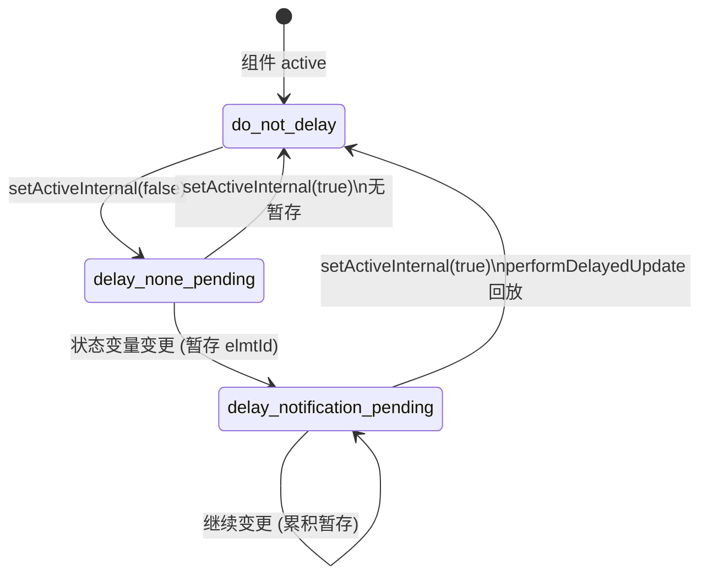

# 架构设计

> 07-03-04 自定义组件冻结功能域的架构设计文档，补录已有实现。本域覆盖自定义组件的冻结机制：`freezeWhenInactive` 配置（`@Component`/`@ComponentV2` options）、6 类冻结触发场景、V1 三态机（`DelayedNotifyChangesEnum`：do_not_delay/delay_none_pending/delay_notification_pending）暂存回放与 V2 实时检查（`isViewActive()`）差异、`activeCount_` 引用计数、配置继承（`isCompFreezeAllowed_`）、混用场景改进（API 18+）、BuilderNode `inheritFreezeOptions`（API 20+）、复用混用例外。

## 设计元数据

| 字段 | 内容 |
|------|------|
| Design ID | DESIGN-Func-07-03-04 |
| 关联需求 | 已有能力补录（无独立 requirement.md） |
| 关联 Epic | 无 |
| 目标 Feature | Feat-01 自定义组件冻结机制 |
| 复杂度 | 中 |
| 目标版本 | freezeWhenInactive API 11 起；混用场景改进 API 18 起；BuilderNode inheritFreezeOptions API 20 起；Repeat 缓存池冻结 API 18 起 |
| Owner | ArkUI SIG |
| 状态 | Baselined |
| FuncID | 07-03-04 |
| 源码根 | `frameworks/bridge/declarative_frontend/state_mgmt/src/lib/partial_update/pu_view.ts`（setActiveInternal V1）+ `partial_update/pu_observed_property_abstract.ts`（DelayedNotifyChangesEnum 三态机）+ `v2/v2_view.ts`（freezeRecycledComponent V2）+ `puv2_common/puv2_view_base.ts`（isCompFreezeAllowed_ / isViewActive / activeCount_） |
| SDK 声明 | @Component/@ComponentV2 options `freezeWhenInactive`（无独立 d.ts，是组件装饰器参数） |
| 测试入口 | `frameworks/bridge/declarative_frontend/state_mgmt/test/unittest/entry/src/main/v1_tests/`（V1 三态机）+ `v2_tests/`（V2 实时检查）+ `repeat_tests/`（复用混用例外） |
| 前置依赖 | 07-03-01（组件创建 — freezeWhenInactive 配置挂在组件上）+ 07-03-02（activeCount_ 引用计数驱动 active/inactive） |
| 下游影响 | 无（冻结是组件行为终端消费方） |
| 关键错误码 | 无专属 |

## 需求基线

| 字段 | 内容 |
|------|------|
| 问题陈述 | 不可见/非激活的自定义组件如果仍响应状态变更并刷新 UI，产生不必要的性能开销（dirty 标记 + VSync 重渲染 + @Watch 回调）。需要冻结机制在组件不可见时暂停 UI 刷新，但状态变更不能丢失（组件重新可见时需恢复一致状态） |
| 核心目标 | 提供 freezeWhenInactive 配置，在 6 类场景下自动冻结/解冻组件，减少不可见组件的无效刷新，同时保证状态一致性（暂存回放或实时检查） |
| P1 AC | Feat-01 全量 AC |
| 补充说明 | active/inactive 不等同于可见性；冻结仅适用于 6 类场景；V1 用三态机暂存回放，V2 用实时 isViewActive() 检查（无三态） |

## 上下文和现状

### 涉及仓和模块

| 仓库 | 模块路径 | 当前职责 | 本 Feature 影响 |
|------|----------|----------|-----------------|
| ace_engine | `partial_update/pu_view.ts` | `setActiveInternal`(483-522) V1 active/inactive 切换、`performDelayedUpdate` 回放 | 全量涉及 |
| ace_engine | `partial_update/pu_observed_property_abstract.ts` | `DelayedNotifyChangesEnum` 三态枚举、`enableDelayedNotification`/`moveElmtIdsForDelayedUpdate` | 全量涉及 |
| ace_engine | `v2/v2_view.ts` | `freezeRecycledComponent`(312)/`unfreezeReusedComponent`(328) V2 复用冻结、`performDelayedUpdate`(920) | Feat-01 |
| ace_engine | `puv2_common/puv2_view_base.ts` | `isCompFreezeAllowed_`(119) 配置继承、`activeCount_`(104) 引用计数、`isViewActive()`(760) V2 实时检查 | Feat-01 |

### 调用链层级分析

| 层 | 模块 | 职责 | 修改类型 |
|----|------|------|----------|
| 1. 配置层 | `@Component({ freezeWhenInactive: true })` | 声明冻结配置 | 存量分析 |
| 2. 继承层 | `puv2_view_base.ts` `isCompFreezeAllowed_`(119) | 子未设置则继承父 | 存量分析 |
| 3. V1 三态机 | `pu_observed_property_abstract.ts` `DelayedNotifyChangesEnum` | do_not_delay/delay_none_pending/delay_notification_pending 三态暂存 | 存量分析 |
| 4. V2 实时检查 | `puv2_view_base.ts` `isViewActive()`(760) | 基于 activeCount_ > 0 实时判断 | 存量分析 |
| 5. 引用计数 | `puv2_view_base.ts` `activeCount_`(104) | API 18+ 激活引用计数 | 存量分析 |
| 6. 回放层 | `pu_view.ts`/`v2_view.ts` `performDelayedUpdate` | 激活时回放暂存的 dirty elmtId | 存量分析 |

### 适用架构规则

| Rule ID | 适用原因 | 设计结论 | 验证方式 |
|---------|----------|----------|----------|
| OH-ARCH-LAYERING | 冻结跨配置 → 继承 → 三态机/实时检查 → 引用计数 → 回放共 6 层 | V1 三态暂存 vs V2 实时检查，两层范式 | 代码评审 |
| OH-ARCH-API-LEVEL | freezeWhenInactive API 11、混用改进 API 18、BuilderNode API 20 | 各特性标注 @since | API 评审 |

## 不涉及项承接

| 维度 | 结论 |
|------|------|
| 状态变量冻结行为 | 承接 — @Watch 延迟/@State 变更暂存等状态变量级行为归 07-02-01/07-02-04 |
| 组件复用冻结 | 承接 — V2 回收期间冻结归 07-03-03（本域仅涉及冻结对 active/inactive 的影响） |
| 组件创建管线 | 承接 — observeComponentCreation2/updateDirtyElements 归 07-02-01 Feat-01 |
| 生命周期 | 承接 — activeCount_ 与 @ComponentActive/@Inactive 的协同归 07-03-02 |

## 关键设计决策

### ADR 概览

| 决策 ID | 问题 | 选择方案 | 影响 |
|---------|------|----------|------|
| ADR-1 | 冻结触发场景 | 6 类：router/TabContent/LazyForEach/Navigation/复用/混用 | Feat-01 |
| ADR-2 | V1 vs V2 冻结实现 | V1 三态机暂存回放 vs V2 实时 isViewActive() 检查 | Feat-01 |
| ADR-3 | 配置继承 | 子未设置则继承父 isCompFreezeAllowed_ | Feat-01 |
| ADR-4 | 复用混用例外 | 复用上树不触发 @Watch（复用早于解冻） | Feat-01 |

### ADR-1: 冻结触发场景 — 6 类

**问题背景**：并非所有不可见组件都应该被冻结——冻结需要精确的触发条件，避免误冻结正在工作的组件。

**选型推理**：6 类场景：①router 非栈顶不可见页面 ②TabContent 非当前显示 ③LazyForEach 缓存节点（屏上节点为 active）④Navigation 未显示 NavDestination ⑤组件复用进入复用池 ⑥混用场景。active/inactive 不等同于可见性——一个组件可能可见但 inactive（如 TabContent 切换动画期间），也可能不可见但 active（如 LazyForEach 屏上但正在滚动）。@ComponentV2 不支持 LazyForEach 缓存节点冻结（与 @Component 差异）。可仅给子组件单独设置 freezeWhenInactive。

### ADR-2: V1 三态机 vs V2 实时检查

**问题背景**：组件冻结后状态变更不能丢失（否则组件重新可见时 UI 与状态脱节）。两种保证方式：暂存回放或实时检查。

**关键权衡**：
- V1 三态机暂存回放：每个 ObservedPropertyAbstractPU 维护 delayedNotification_ 三态（do_not_delay/delay_none_pending/delay_notification_pending）；状态变更暂存 elmtId；激活时 performDelayedUpdate 统一回放。优点：保证状态不丢失。缺点：三态机有内存开销，回放可能产生批量刷新
- V2 实时检查：每次状态变更实时检查 isViewActive()（基于 activeCount_ > 0），冻结时直接跳过。优点：无暂存开销。缺点：需要全局单例（ObserveV2）支持实时查询

**选型推理**：V1 选择三态机（与 V1 属性包装对象范式一致——每个变量独立维护冻结态）；V2 选择实时检查（与 V2 getter/setter + 全局 ObserveV2 范式一致——变更时实时查询激活状态）。V2 复用回收 freezeRecycledComponent(312) 时 activeCount_--，复用解冻 unfreezeReusedComponent(328) 时回放 elmtIdsDelayedUpdate_。

### ADR-3: 配置继承 — isCompFreezeAllowed_

**问题背景**：开发者不想给每个子组件都显式设置 freezeWhenInactive。应该支持配置继承——子组件默认继承父组件的冻结配置。

**选型推理**：`isCompFreezeAllowed_`(`puv2_view_base.ts:119`) 实现配置继承——子组件未设置则继承父。API 17 及以下父组件解冻时解冻子组件所有节点（包括非屏上）；API 18+ 只解冻子组件屏上节点（混用场景改进，减少不必要的刷新）。API 20+ BuilderNode 配置 inheritFreezeOptions: true 可继承父冻结（API 20 前 BuilderNode 无法继承）。

### ADR-4: 复用混用例外 — 上树后不触发 @Watch

**问题背景**：组件复用与冻结混用时，组件从复用池上树（reuse）后重新标记为 active。按照冻结机制，激活时应该回放暂存的状态变更并触发 @Watch。但复用机制在解冻前已经执行了脏节点刷新（resetStateVarsOnReuse 重置状态变量），导致解冻时判断"冻结期间无变量改变"而不触发 @Watch。

**选型推理**：复用上树后重新标记 active 但**不触发 @Watch**——这是复用执行逻辑早于组件解冻的副作用。即使 aboutToReuse 中改值，解冻时同样不触发 @Watch（复用已清空脏节点列表）。这个行为虽然可能出乎开发者预期，但避免了复用重置 + 解冻回放的双重状态变更冲突。

## 设计骨架

| Task ID | 目标 | 受影响文件 | AC |
|---------|------|------------|-----|
| Feat-01 | freezeWhenInactive + 6 类场景 + V1 三态机 vs V2 实时 + 配置继承 + 复用混用例外 | `pu_view.ts`、`pu_observed_property_abstract.ts`、`v2_view.ts`、`puv2_view_base.ts` | AC-1.1~AC-5.5 |

## 后续 Task 拆分

| Spec | 目的 | 依赖 | 输出 |
|------|------|------|------|
| 无后续 Task | 已有实现补录 | — | 各 Feature 详细规格见 `Feat-NN-*-spec.md` |

## API 签名、Kit 与权限

### 新增 API

| API 签名 | 类型 | 功能描述 | 关联 Feat |
|----------|------|----------|----------|
| （已有实现补录，API 通过 ArkTS 装饰器语法或 `@ohos.arkui.StateManagement` 模块暴露，具体签名见各 Feature spec） | Public | 各装饰器/API 的完整签名、@since、开放范围见各 Feature spec 的「核心类与机制清单」和「兼容性声明」 | Feat-01~NN |

### 变更/废弃 API

无变更。

### Kit

无独立 Kit，归属于 ArkUI ArkTS 声明式范式（`SystemCapability.ArkUI.ArkUI.Full`）。

### 权限要求

无权限要求。

## 构建系统影响

### BUILD.gn 变更

无变更。状态管理 TS 库编译为单一 `stateMgmt.abc` 字节码（debug/release/profile 三种构建产物），由引擎初始化时载入。构建配置见 `frameworks/bridge/declarative_frontend/state_mgmt/BUILD.gn`。

### bundle.json 变更

无变更。

## 可选设计扩展

### V1 三态机状态图

### 冻结/解冻数据流

**V1 冻结流程：**
1. 组件进入 inactive（如 TabContent 切换）→ `setActiveInternal(false)`(`pu_view.ts:483-522`)
2. `delayedNotification_` 切换为 `delay_none_pending`(1)
3. 状态变量变更 → `delayedNotification_` 切换为 `delay_notification_pending`(2)，暂存 elmtId
4. 组件回到 active → `performDelayedUpdate` 统一回放暂存的 elmtId → @Watch 回调被再次调用

**V2 冻结流程：**
1. 组件进入 inactive → `activeCount_` 从 1→0
2. 状态变量变更 → setter 调 `fireChange` → ObserveV2 实时检查 `isViewActive()`(760) 返回 false → 跳过
3. 组件回到 active → `activeCount_` 从 0→1 → `performDelayedUpdate`(920) 处理延迟刷新

## 详细设计

各 Feature 的详细规格见对应的 `Feat-NN-*-spec.md`。

## 风险和开放问题

| 项 | 类型 | 影响 | 处理方式 | Owner |
|----|------|------|----------|-------|
| 复用混用例外 | 健壮性 | 中 | 复用上树不触发 @Watch（复用早于解冻）；aboutToReuse 改值也不触发 | ArkUI SIG |
| @ComponentV2 不支持 LazyForEach 冻结 | 功能 | 中 | 文档已声明；建议用 Repeat 替代 LazyForEach | ArkUI SIG |
| 混用场景行为变化（API 18） | 兼容性 | 低 | API 17- 全节点解冻 / API 18+ 屏上节点解冻；版本差异已文档化 | ArkUI SIG |
| BuilderNode 无法继承冻结（API 20 前） | 功能 | 低 | API 20+ inheritFreezeOptions 解决 | ArkUI SIG |

## 设计审批

- [x] 需求基线已确认
- [x] 不涉及项已承接（状态变量行为/复用/创建管线/生命周期分别归 07-02/07-03-03/07-03-02）
- [x] 涉及仓和模块职责清楚
- [x] 调用链层级分析完整（6 层）
- [x] 关键设计决策有理由（4 个 ADR 含深入分析）
- [x] 风险和开放问题有 Owner

**结论:** Baselined（已有实现补录）.
