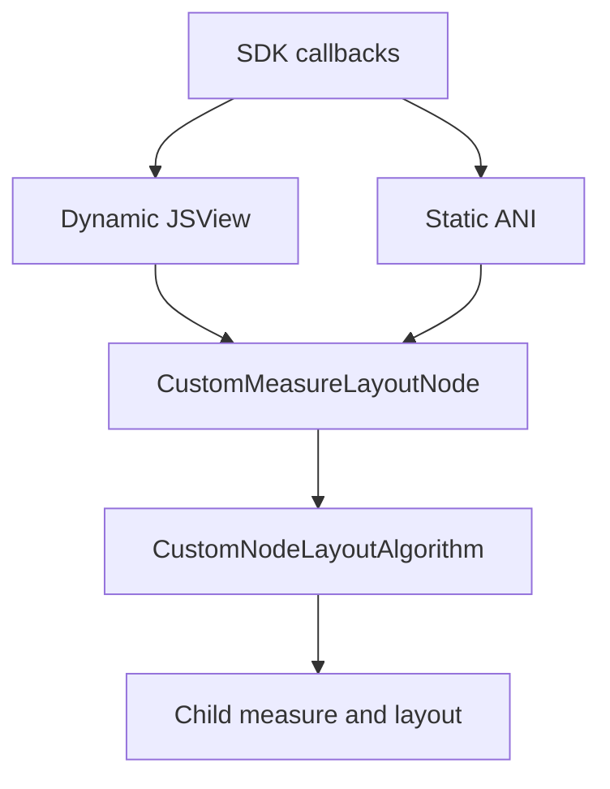
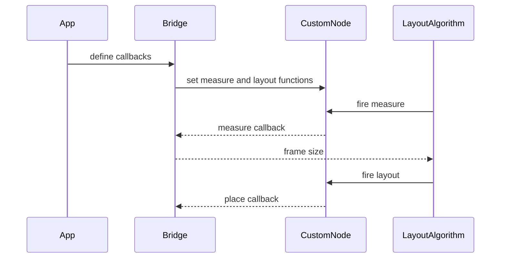
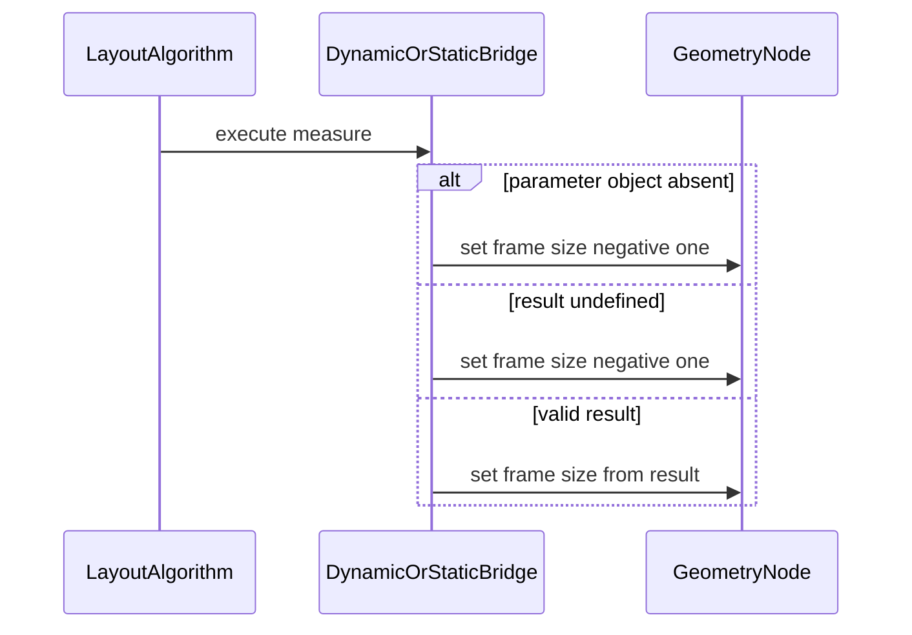

# 架构设计

> 自定义组件测量与子项放置是既有布局扩展能力的补录。本设计以当前 SDK、实现、测试和 Git 历史为证据，不引入新行为。

## 设计元数据

| 字段 | 内容 |
|------|------|
| Design ID | DESIGN-Func-07-03-05 |
| 关联需求 | 已有能力补录（无独立 requirement.md） |
| 关联 Epic | 无 |
| 目标 Feature | Feat-01 自定义组件测量与子项放置 |
| 复杂度 | 复杂 |
| 目标版本 | Dynamic 新回调 API 10 起，Dynamic 当前标记 API 11；Static API 23 起 |
| Owner | ArkUI SIG |
| 状态 | Baselined（已有实现补录） |

## 需求基线

| 项 | 补充说明 |
|----|----------|
| 两阶段回调 | `onMeasureSize` 返回宿主尺寸，`onPlaceChildren` 放置已测量子项。 |
| 双范式接入 | Dynamic 使用 JSView，Static 使用 ANI；两者都落到 `CustomMeasureLayoutNode`。 |
| 兼容边界 | 已废弃的 `onMeasure/onLayout` 仍由现行源码执行，不能按死代码处理。 |
| 排除项 | `DynamicLayout.CustomLayoutAlgorithm` 以 `FrameNode` 为载体，不属于本功能域。 |

## 上下文和现状

### 涉及仓和模块

| 仓库 | 补充架构说明 |
|------|--------------|
| interface_sdk-js | Dynamic `common.d.ts` 定义回调和数据对象；Static `customComponent.static.d.ets` 定义 `LayoutCallbacks`。 |
| ace_engine | JSView 将 Dynamic 回调绑定到自定义节点；布局算法调度回调或默认路径。 |
| ace_engine | ANI 为 Static 组件创建同一自定义节点并转换回调参数。 |
| ace_engine | `CustomLayoutRoot` modifier 是 Static 前端内部订阅入口，不是应用侧 C API。 |

### 调用链层级分析

| 层 | 模块 | 职责 | 修改类型 |
|----|------|------|----------|
| SDK | `common.d.ts`、`customComponent.static.d.ets` | 声明回调、`Measurable`、`Layoutable`、尺寸与约束对象 | 存量补录 |
| Dynamic 绑定 | `js_view_functions.cpp`、`js_view.cpp` | 读取两个回调，组装参数并跨 JS 调用 | 存量补录 |
| Static 绑定 | `custom_node_module.cpp`、`ani_measure_layout.cpp` | 查找 ANI 方法，组装 ANI 参数并调用 | 存量补录 |
| 节点承载 | `custom_measure_layout_node.cpp` | 保存测量、放置和参数更新函数 | 存量补录 |
| 布局算法 | `custom_node_layout_algorithm.cpp` | 优先分发自定义回调；无回调时执行默认测量/布局 | 存量补录 |
| 内部 modifier | `custom_layout_root_modifier.cpp` | 将 Static 回调订阅到节点函数 | 存量补录 |

### 适用架构规则

| Rule ID | 适用原因 | 设计结论 | 验证方式 |
|---------|----------|----------|----------|
| OH-ARCH-LAYERING | SDK、桥接、节点和算法分层 | SDK 只定义契约；桥接不可绕过节点直接操作布局树 | SDK 与源码对照 |
| OH-ARCH-API-LEVEL | Dynamic 与 Static 的 since 不同 | 分通道记录版本，不拼接为虚构的统一最低版本 | SDK 审查 |
| OH-ARCH-ERROR-LOG | 两个桥接均处理空结果或弱引用失效 | 保留现有日志和降级路径，不将失败解释为成功放置 | 单测和日志审查 |
| OH-ARCH-COMPONENT-BUILD | 多个既有 bridge/core target | 不新增 BUILD.gn 或部件依赖 | 构建配置审查 |

## 不涉及项承接

| 维度 | 设计结论 |
|------|----------|
| 新公开 C API | 不涉及；`CustomLayoutRoot` 是 Static 内部 modifier。 |
| 持久化、IPC | 不涉及；回调与参数对象只在当前布局过程存活。 |
| DynamicLayout | 不涉及；其 API 和调用载体均不同。 |
| 删除旧路径 | 不涉及；SDK 仍保留旧 API 的兼容承诺，当前代码仍可执行。 |

## 关键设计决策

| 决策 ID | 问题 | 推荐方案 | 探索过的替代方案 | 取舍理由 | 影响 |
|---------|------|----------|-----------------|----------|------|
| ADR-1 | 是否按测量和放置拆为两个 Feat | 使用一个 Feat 覆盖完整生命周期 | 两个回调各自成文；仅写 API 表 | 公开回调只有两个且前后强耦合，拆分会重复约束和时序 | 所有 AC |
| ADR-2 | Dynamic 与 Static 如何描述 | 同一契约、分开桥接路径 | 只写 Dynamic；按实现细节合并 | SDK 参数签名一致，但执行入口和版本不同 | AC-1.1, AC-2.1 |
| ADR-3 | 旧回调代码如何归类 | 标为已废弃兼容，不标死代码 | 标为废代码；完全不记录 | SDK 标 `@deprecated` 且源码仍有执行入口 | AC-3.1 |
| ADR-4 | 邻近 DynamicLayout 如何处理 | 在范围边界中显式排除 | 共用回调名称即合并 | DynamicLayout 使用 `FrameNode` 和不同算法契约 | AC-3.2 |
| ADR-5 | 测量回调异常结果如何描述 | 只固化已证实的整体空返回降级 | 将 Dynamic/Static 的字段解析细节视为统一契约 | Dynamic 字段解析分支存在实现差异，SDK 未承诺该细节 | AC-1.3 |

## 设计骨架

### 骨架范围

| 骨架项 | 目标 | 不包含 | 验证方式 |
|--------|------|--------|----------|
| 回调契约 | 固化两个回调、参数和结果 | 新增回调 | SDK 签名对照 |
| 调用链 | 固化 Dynamic/Static 到节点、算法的路径 | 重构 bridge | 源码与 UT |
| 历史边界 | 区分现行、兼容、内部和相邻能力 | 删除决策 | SDK、引用和历史核验 |

### 骨架 Spec 拆分

| Task ID | 目标 | 受影响文件 | AC |
|---------|------|------------|----|
| TASK-SKELETON-1 | 基线化自定义测量、放置和兼容边界 | `Feat-01-custom-measure-layout-spec.md` | 全部 AC |

## 后续 Task 拆分

| Task ID | 目标 | 受影响文件 | 依赖 |
|---------|------|------------|------|
| TASK-FEAT-01 | 补录 SDK 契约、桥接与历史边界 | `Feat-01-custom-measure-layout-spec.md` | SDK、Core、Bridge、UT |

## API 签名、Kit 与权限

### 新增 API

| API 签名 | 类型 | Kit | d.ts 位置 | 权限要求 | SysCap |
|----------|------|-----|-----------|----------|--------|
| `onMeasureSize?(GeometryInfo, Array<Measurable>, ConstraintSizeOptions): SizeResult` | Dynamic InnerApi | ArkUI | `@internal/component/ets/common.d.ts:35238-35271` | 无 | ArkUI.Full |
| `onPlaceChildren?(GeometryInfo, Array<Layoutable>, ConstraintSizeOptions): void` | Dynamic InnerApi | ArkUI | `@internal/component/ets/common.d.ts:35201-35234` | 无 | ArkUI.Full |
| `LayoutCallbacks.onMeasureSize(GeometryInfo, Array<Measurable>, ConstraintSizeOptions): SizeResult` | Static | ArkUI | `arkui/component/customComponent.static.d.ets:453-477` | 无 | ArkUI.Full |
| `LayoutCallbacks.onPlaceChildren(GeometryInfo, Array<Layoutable>, ConstraintSizeOptions): void` | Static | ArkUI | `arkui/component/customComponent.static.d.ets:453-476` | 无 | ArkUI.Full |

### 变更/废弃 API

| 原有 API | 变更类型 | 新 API | 迁移说明 |
|----------|----------|--------|----------|
| `CustomComponent.onMeasure` | 废弃（since 10） | `onMeasureSize` | 新代码返回 `SizeResult` 并接收 self/children/constraint。 |
| `CustomComponent.onLayout` | 废弃（since 10） | `onPlaceChildren` | 新代码接收 self/children/constraint 并由 `Layoutable.layout` 放置。 |

## 构建系统影响

### BUILD.gn 变更

```text
无变更；沿用 core custom、declarative frontend 和 Static ANI 的既有源集。
```

### bundle.json 变更

无新增部件或依赖。

## 可选设计扩展

### 架构图



### 数据流/控制流

| 步骤 | 调用方 | 被调用方 | 数据/接口 | 说明 |
|------|--------|----------|-----------|------|
| 1 | 自定义组件 | Bridge | 两个可选回调 | Dynamic 读取 JS 属性；Static 查找 ANI 方法。 |
| 2 | Bridge | `CustomMeasureLayoutNode` | measure/layout/update 函数 | 节点承载同一布局回调。 |
| 3 | 布局算法 | 测量回调 | `GeometryInfo`、`Measurable[]`、constraint | 回调返回宿主尺寸。 |
| 4 | 布局算法 | 放置回调 | `GeometryInfo`、`Layoutable[]`、constraint | 回调对已测量子项调用 `layout`。 |
| 5 | 布局算法 | 默认路径 | child constraint 和 layout | 回调缺失时测量所有子项并执行默认布局。 |

### 时序设计



### 异常传播时序图



### 测试性设计

| 测试层级 | 测试目标 | Mock 策略 | 验证方式 |
|----------|----------|----------|----------|
| Core 节点 | 回调存在和缺失时的分发 | `CustomMeasureLayoutNode` 与 mock wrapper | `custom_measure_layout_node_test*.cpp` |
| 参数对象 | 子项索引、约束、尺寸更新 | mock child wrapper | `custom_measure_layout_param_test_ng.cpp` |
| Static modifier | 两个订阅入口连接节点 | mock continuation 和 wrapper | `custom_layout_root_modifier_test.cpp` |
| Bridge | Dynamic/ANI 参数和空返回 | JS/ANI mock | bridge 单测与集成回归 |

### 接口参数规约

| 接口 | 参数 | 类型 | 合法范围 | 非法处理 | 边界说明 |
|------|------|------|----------|----------|----------|
| onMeasureSize | children | `Array<Measurable>` | 当前子项集合 | 空集合仍返回 `SizeResult` | 子项可按独立 constraint 测量 |
| onMeasureSize | return | `SizeResult` | width 和 height 可被解析为布局尺寸 | 整体 undefined 时 size 为 `(-1,-1)` | 单字段失败的 Dynamic 细节不作为 SDK 契约 |
| onPlaceChildren | children | `Array<Layoutable>` | 已测量子项集合 | 无显式错误码 | 放置通过 `Layoutable.layout(position)` |

## 详细设计

### 测量与尺寸回调

Dynamic SDK 在 `CustomComponentV2` 上声明 `onMeasureSize`，参数为 self、`Measurable[]` 和 constraint，返回 `SizeResult`（`interface/sdk-js/api/@internal/component/ets/common.d.ts:35238-35271`）。`Measurable.measure` 将 constraint 应用于子项，`uniqueId` 是 since 18 的可选标识（`common.d.ts:34534-34599`）。Static `LayoutCallbacks` 在 API 23 提供同签名回调（`customComponent.static.d.ets:453-477`）。

Dynamic JSView 把属性 `onMeasureSize` 绑定为函数（`frameworks/bridge/declarative_frontend/jsview/js_view_functions.cpp:485-487`），随后传入 self、children、constraint（`:86-123`）。参数对象或整体返回值缺失时，当前实现将 frame size 写为 `(-1,-1)`（同文件 `:90-105`）。Static ANI 在 `custom_node_module.cpp:238-325` 查找并调用同名方法，且对整体空结果采用相同的负一尺寸降级（`:261-295`）。

### 子项放置与默认回退

`Layoutable` 提供测量结果、可选 `uniqueId` 与 `layout(position)`（`interface/sdk-js/api/@internal/component/ets/common.d.ts:34423-34516`）。Dynamic 通过 `ExecutePlaceChildren` 传入 self、children 和 placement constraint（`frameworks/bridge/declarative_frontend/jsview/js_view_functions.cpp:66-77`）；Static ANI 的同名调用在 `custom_node_module.cpp:327-384`。

`CustomMeasureLayoutNode` 只有在保存的函数存在时才返回已处理（`frameworks/core/components_ng/pattern/custom/custom_measure_layout_node.cpp:34-54`）。因此 `CustomNodeLayoutAlgorithm` 在测量回调不存在时，会创建 child constraint、测量全部子项、更新尺寸并执行默认 self measure；放置回调不存在时，执行默认 layout 并 layout 每个子项（`frameworks/core/components_ng/pattern/custom/custom_node_layout_algorithm.cpp:70-100`）。

### 历史演变与代码分类

| 时期或对象 | 当前分类 | 证据 | 维护结论 |
|------------|----------|------|----------|
| 2022 `05489e06f5a` | 旧能力引入 | 提交 `05489e06f5a` 引入 `onMeasure/onLayout`、measure 和 layout API | 历史起点，不表示可删除。 |
| 2023 `cb7c2d31cb6` | 新回调扩展 | 提交 `cb7c2d31cb6` 扩展自定义组件 measure/layout 能力 | 新回调成为推荐路径。 |
| 旧 `onMeasure/onLayout` | 已废弃公开 API | SDK 标 `@deprecated since 10`，并指定新回调（`common.d.ts:34936-34961`） | 新代码不使用；兼容性继续核验。 |
| `JSMeasureLayoutParam`、`ExecuteMeasure/ExecuteLayout` | 已废弃 API 的兼容实现 | 旧执行函数仍在 `js_view_functions.cpp:44-64`，并实例化旧参数对象 | 不是废代码，不得凭名称删除。 |
| 新回调与 `JSMeasureLayoutParamNG` | 现行 Dynamic 路径 | `ExecuteMeasureSize/ExecutePlaceChildren` 使用 NG 参数对象（`js_view_functions.cpp:66-105`） | 新增/排障优先路径。 |
| `LayoutCallbacks`、ANI、`CustomLayoutRoot` | 现行 Static 路径与内部接入 | Static SDK `:453-477`；modifier 表暴露订阅函数（`custom_layout_root_modifier.cpp:186-193`） | modifier 非应用侧 C API。 |
| `DynamicLayout.CustomLayoutAlgorithm` | 相邻能力 | `docs/kb/components/container/dynamic_layout.md` | 不与本 Feat 的自定义组件回调混用。 |

## 风险和开放问题

| 项 | 类型 | 影响 | 处理方式 | Owner |
|----|------|------|----------|-------|
| Dynamic 与 Static 的 since 不同 | API | 中 | 规格分通道记录，避免虚构统一版本 | ArkUI SIG |
| Dynamic 单独 height 解析失败分支写入 width 变量 | 兼容性 | 中 | 只记录整体 undefined 的已证实降级；该分支作为跨范式回归项，不改实现 | ArkUI SIG |
| 旧 API 仍可执行 | 兼容性 | 高 | 任何清理前同时复核 SDK、引用关系和兼容测试 | ArkUI SIG |
| KB 仍把主题路由到 07-03-06 | 文档 | 中 | 本规格以 registry 的 `07-03-05` 为权威；KB 路由修复另行维护 | 文档维护者 |

## 设计审批

- [x] 需求基线已确认，设计覆盖 P0/P1 AC
- [x] 不涉及项已承接，N/A 和展开项都有结论
- [x] 涉及仓和模块职责清楚
- [x] 调用链层级分析完整，每层覆盖到位
- [x] 适用架构规则已识别并形成设计结论
- [x] 分层和子系统边界合规
- [x] API 变更有签名、权限、错误码和兼容性说明
- [x] BUILD.gn/bundle.json 影响明确
- [x] 设计输出和后续 Task 拆分明确
- [x] 关键设计决策有理由和影响说明
- [x] 风险和开放问题有 Owner

**结论:** 通过（已有实现补录）。
